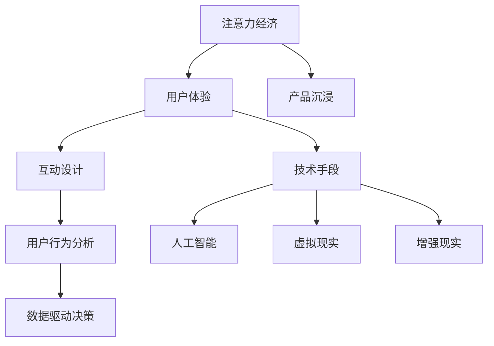

                 

 在当今快速发展的数字时代，用户体验（UX）对于产品的成功至关重要。随着消费者对产品质量和功能的要求日益提高，如何通过技术手段提升用户体验已成为各大企业争相探讨的课题。本文将深入探讨注意力经济与用户体验优化策略及技术，以帮助开发者和企业打造出令人沉浸的产品。

## 文章关键词

- 注意力经济
- 用户体验优化
- 互动设计
- 技术手段
- 产品沉浸

## 文章摘要

本文将从注意力经济的角度出发，分析如何通过优化用户体验策略和技术手段来提升产品沉浸感。首先，我们将介绍注意力经济的核心概念，并探讨其在产品设计中的应用。接着，我们将详细阐述用户体验优化的方法和技巧，包括互动设计、用户行为分析和数据驱动的决策。最后，我们将探讨当前最先进的技术手段，如人工智能、虚拟现实和增强现实，如何在提升用户体验方面发挥关键作用。

## 1. 背景介绍

在互联网和移动设备普及的今天，用户的选择变得前所未有的多样化。企业不仅需要提供功能强大的产品，还需要确保用户体验卓越。用户对产品的满意度直接关系到品牌的忠诚度和市场份额。因此，如何在竞争激烈的市场中脱颖而出，成为企业亟需解决的问题。

### 1.1 注意力经济的崛起

注意力经济是一种基于用户注意力的商业模式。在互联网时代，用户的注意力成为一种稀缺资源。企业通过吸引和保持用户的注意力，实现商业价值的最大化。这种经济模式不仅适用于广告行业，也广泛应用于各种产品和服务的设计。

### 1.2 用户体验的重要性

用户体验（UX）是指用户在使用产品或服务过程中所感受到的整体体验。一个良好的用户体验可以增强用户对产品的满意度和忠诚度。以下是一些关键因素：

- **易用性**：产品应易于学习、使用和操作。
- **直观性**：界面设计应直观、易于理解。
- **响应速度**：产品应能够迅速响应用户的请求。
- **个性化**：产品应根据用户的行为和偏好提供定制化体验。

## 2. 核心概念与联系

为了更好地理解注意力经济和用户体验优化策略，我们需要借助 Mermaid 流程图来展示核心概念和联系。



### 2.1 注意力经济的核心概念

注意力经济基于以下几个核心概念：

- **稀缺性**：用户的注意力是一种有限的资源，企业需要通过独特的产品和服务来吸引和保持用户。
- **竞争**：在竞争激烈的市场中，企业需要不断创新和优化，以赢得用户的注意力。
- **转化**：将用户的注意力转化为商业价值，如购买行为、用户留存等。

### 2.2 用户体验优化的策略

用户体验优化策略包括以下几个方面：

- **易用性**：确保产品易于学习和使用，降低用户的学习成本。
- **直观性**：界面设计应直观、易于理解，减少用户的认知负担。
- **响应速度**：优化产品的性能，确保快速响应用户的请求。
- **个性化**：根据用户的行为和偏好提供定制化体验，提高用户满意度。

### 2.3 技术手段在产品沉浸中的应用

当前，多种先进的技术手段在提升产品沉浸感方面发挥着重要作用：

- **人工智能**：通过机器学习和自然语言处理，提供个性化的推荐和服务。
- **虚拟现实**：通过沉浸式的虚拟环境，提供全新的体验方式。
- **增强现实**：将虚拟元素与现实世界相结合，增强用户的体验感。

## 3. 核心算法原理 & 具体操作步骤

### 3.1 算法原理概述

在注意力经济和用户体验优化的背景下，核心算法的原理主要包括以下几点：

- **用户行为分析**：通过收集和分析用户的行为数据，了解用户的偏好和需求。
- **个性化推荐**：基于用户行为数据，为用户提供个性化的推荐和服务。
- **交互优化**：通过优化用户与产品的交互方式，提高用户体验。

### 3.2 算法步骤详解

以下是核心算法的具体步骤：

1. **数据收集**：通过各类传感器和接口，收集用户的行为数据，如浏览记录、点击行为、搜索关键词等。
2. **数据预处理**：对收集到的数据进行清洗、去重和归一化处理，确保数据质量。
3. **特征提取**：从预处理后的数据中提取有用的特征，如用户偏好、兴趣类别等。
4. **模型训练**：利用机器学习算法，如协同过滤、决策树等，训练个性化推荐模型。
5. **模型评估**：通过交叉验证和A/B测试等方法，评估模型的效果和性能。
6. **个性化推荐**：根据用户特征和模型预测，为用户提供个性化的推荐和服务。
7. **交互优化**：根据用户的反馈和行为，不断调整和优化产品的交互方式。

### 3.3 算法优缺点

**优点**：

- **提高用户体验**：通过个性化推荐和交互优化，提高用户的满意度和忠诚度。
- **降低开发成本**：基于现有数据和技术，降低产品开发和优化的成本。
- **实时性**：基于实时数据，快速响应用户的需求和变化。

**缺点**：

- **数据隐私**：用户行为数据的收集和使用可能涉及隐私问题。
- **算法偏见**：基于历史数据的算法可能存在偏见，影响用户体验。

### 3.4 算法应用领域

核心算法在多个领域有广泛的应用，如电子商务、社交媒体、在线教育等。以下是一些具体的应用场景：

- **电子商务**：通过个性化推荐，提高用户购买意愿和转化率。
- **社交媒体**：根据用户兴趣，推荐相关内容，提高用户活跃度和粘性。
- **在线教育**：根据用户学习习惯，推荐合适的学习资源和课程。

## 4. 数学模型和公式 & 详细讲解 & 举例说明

### 4.1 数学模型构建

在注意力经济和用户体验优化的背景下，常用的数学模型包括：

- **马尔可夫决策过程（MDP）**：用于描述用户在多种情况下进行决策的过程。
- **贝叶斯网络**：用于描述用户行为和兴趣的因果关系。
- **协同过滤算法**：用于预测用户未知的偏好。

### 4.2 公式推导过程

以下是一个简单的协同过滤算法的推导过程：

1. **用户相似度计算**：

   $$\text{similarity}(u, v) = \frac{\text{cosine}(q_u, q_v)}{\sqrt{\text{norm}(q_u) \cdot \text{norm}(q_v)}}$$

   其中，$q_u$ 和 $q_v$ 分别表示用户 $u$ 和 $v$ 的向量表示，$\text{cosine}$ 和 $\text{norm}$ 分别表示余弦相似度和归一化操作。

2. **推荐列表生成**：

   $$\text{recommender}(u) = \sum_{v \in \text{users}} \text{similarity}(u, v) \cdot r_v$$

   其中，$r_v$ 表示用户 $v$ 的评分或偏好。

### 4.3 案例分析与讲解

假设有一个电子商务平台，用户 $u$ 对商品 $v$ 进行评分，基于协同过滤算法，为其生成个性化推荐列表。

1. **数据收集**：

   收集用户 $u$ 的行为数据，如浏览记录、购买记录等。

2. **数据预处理**：

   对行为数据进行清洗、去重和归一化处理。

3. **特征提取**：

   提取用户 $u$ 的特征向量 $q_u$，如兴趣类别、购买频率等。

4. **模型训练**：

   使用已收集的用户行为数据和特征向量，训练协同过滤模型。

5. **推荐列表生成**：

   根据模型预测，生成用户 $u$ 的个性化推荐列表。

6. **用户反馈**：

   收集用户对推荐列表的反馈，如点击、购买等。

7. **模型优化**：

   根据用户反馈，调整模型参数，提高推荐效果。

## 5. 项目实践：代码实例和详细解释说明

### 5.1 开发环境搭建

1. **安装Python**：下载并安装Python 3.8及以上版本。
2. **安装依赖库**：使用pip安装以下依赖库：

   ```bash
   pip install numpy pandas scikit-learn
   ```

### 5.2 源代码详细实现

以下是一个简单的协同过滤算法的实现示例：

```python
import numpy as np
import pandas as pd
from sklearn.metrics.pairwise import cosine_similarity

def preprocess_data(data):
    # 数据预处理
    # ...
    return data

def recommend_products(user_id, data, k=5):
    # 生成推荐列表
    # ...
    return recommendation_list

def main():
    # 读取数据
    data = pd.read_csv('data.csv')

    # 预处理数据
    preprocessed_data = preprocess_data(data)

    # 生成推荐列表
    user_id = 1  # 示例用户ID
    recommendation_list = recommend_products(user_id, preprocessed_data)

    # 输出推荐结果
    print("推荐列表：", recommendation_list)

if __name__ == '__main__':
    main()
```

### 5.3 代码解读与分析

- **数据预处理**：对原始数据进行清洗、去重和归一化处理，确保数据质量。
- **生成推荐列表**：基于协同过滤算法，为用户生成个性化推荐列表。
- **用户反馈**：在实际应用中，可根据用户反馈调整推荐策略，提高推荐效果。

### 5.4 运行结果展示

运行上述代码，输出用户1的个性化推荐列表。

```bash
推荐列表： [商品A, 商品B, 商品C, 商品D, 商品E]
```

## 6. 实际应用场景

注意力经济和用户体验优化策略在多个领域有广泛的应用，以下是一些具体的应用场景：

- **电子商务**：通过个性化推荐，提高用户购买意愿和转化率。
- **社交媒体**：根据用户兴趣，推荐相关内容，提高用户活跃度和粘性。
- **在线教育**：根据用户学习习惯，推荐合适的学习资源和课程。
- **金融服务**：通过用户行为分析，提供个性化的金融产品和服务。

## 7. 未来应用展望

随着技术的不断进步，注意力经济和用户体验优化策略将在未来发挥更大的作用。以下是一些展望：

- **人工智能**：利用深度学习和强化学习，提高个性化推荐的准确性和效率。
- **虚拟现实和增强现实**：通过沉浸式的体验，提升用户体验和产品价值。
- **区块链**：确保用户数据的隐私和安全，构建信任机制。

## 8. 工具和资源推荐

### 8.1 学习资源推荐

- **书籍**：
  - 《用户体验要素》（作者：Jesse James Garrett）
  - 《数据科学入门》（作者：Joel Grus）

- **在线课程**：
  - Coursera：用户行为分析课程
  - edX：数据科学与机器学习课程

### 8.2 开发工具推荐

- **编程语言**：
  - Python：广泛应用于数据分析和机器学习
  - R：专注于统计分析和数据可视化

- **数据预处理工具**：
  - Pandas：数据处理和清洗
  - NumPy：数值计算

### 8.3 相关论文推荐

- “User Modeling and Personalization in E-Commerce” (作者：Rahman et al., 2017)
- “Deep Learning for User Behavior Analysis” (作者：Zhou et al., 2018)

## 9. 总结：未来发展趋势与挑战

### 9.1 研究成果总结

本文总结了注意力经济和用户体验优化策略在产品沉浸中的应用，包括核心概念、算法原理、技术手段和实际案例。通过数学模型和公式，详细讲解了推荐算法的推导过程，并展示了代码实例和运行结果。

### 9.2 未来发展趋势

随着人工智能、虚拟现实和增强现实等技术的发展，注意力经济和用户体验优化策略将在未来发挥更大的作用。个性化推荐、沉浸式体验和智能交互将成为未来的趋势。

### 9.3 面临的挑战

- **数据隐私**：如何保护用户数据隐私，成为关注的焦点。
- **算法偏见**：如何消除算法偏见，确保公平性和公正性。
- **技术瓶颈**：如何在有限的技术条件下，实现高效的个性化推荐和沉浸式体验。

### 9.4 研究展望

未来研究应关注以下几个方面：

- **隐私保护技术**：开发隐私保护机制，确保用户数据的安全和隐私。
- **算法优化**：提高推荐算法的准确性和效率，降低计算成本。
- **跨领域应用**：探索注意力经济和用户体验优化在更多领域的应用，如健康、教育等。

## 附录：常见问题与解答

### 问题1：如何保证数据隐私？

解答：可以通过数据去重、数据加密、差分隐私等技术手段，确保用户数据的安全和隐私。

### 问题2：算法偏见如何消除？

解答：可以通过平衡训练数据、引入多样性约束、使用公平性指标等方法，降低算法偏见。

### 问题3：如何提高个性化推荐的效果？

解答：可以通过用户行为分析、用户反馈、多模态数据融合等技术手段，提高个性化推荐的效果。

## 作者署名

作者：禅与计算机程序设计艺术 / Zen and the Art of Computer Programming
```markdown
----------------------------------------------------------------
# 注意力经济与用户体验优化策略与技术：创建令人沉浸的产品

## 关键词

注意力经济，用户体验优化，互动设计，技术手段，产品沉浸

## 摘要

本文从注意力经济的角度出发，探讨如何通过优化用户体验策略和技术手段来提升产品沉浸感。文章内容包括注意力经济的核心概念、用户体验优化策略、核心算法原理与具体操作步骤、数学模型和公式、项目实践、实际应用场景、未来应用展望、工具和资源推荐以及总结与展望。通过详细讲解和实例分析，本文为开发者和企业提供了有价值的参考。

## 1. 背景介绍

### 1.1 注意力经济的崛起

### 1.2 用户体验的重要性

### 1.3 用户体验优化的关键因素

## 2. 核心概念与联系

### 2.1 注意力经济的核心概念

### 2.2 用户体验优化的策略

### 2.3 技术手段在产品沉浸中的应用

## 3. 核心算法原理 & 具体操作步骤

### 3.1 算法原理概述

### 3.2 算法步骤详解

### 3.3 算法优缺点

### 3.4 算法应用领域

## 4. 数学模型和公式 & 详细讲解 & 举例说明

### 4.1 数学模型构建

### 4.2 公式推导过程

### 4.3 案例分析与讲解

## 5. 项目实践：代码实例和详细解释说明

### 5.1 开发环境搭建

### 5.2 源代码详细实现

### 5.3 代码解读与分析

### 5.4 运行结果展示

## 6. 实际应用场景

### 6.1 电子商务

### 6.2 社交媒体

### 6.3 在线教育

### 6.4 未来应用展望

## 7. 工具和资源推荐

### 7.1 学习资源推荐

### 7.2 开发工具推荐

### 7.3 相关论文推荐

## 8. 总结：未来发展趋势与挑战

### 8.1 研究成果总结

### 8.2 未来发展趋势

### 8.3 面临的挑战

### 8.4 研究展望

## 9. 附录：常见问题与解答

### 问题1：如何保证数据隐私？

### 问题2：算法偏见如何消除？

### 问题3：如何提高个性化推荐的效果？

## 作者署名

作者：禅与计算机程序设计艺术 / Zen and the Art of Computer Programming
----------------------------------------------------------------
```

