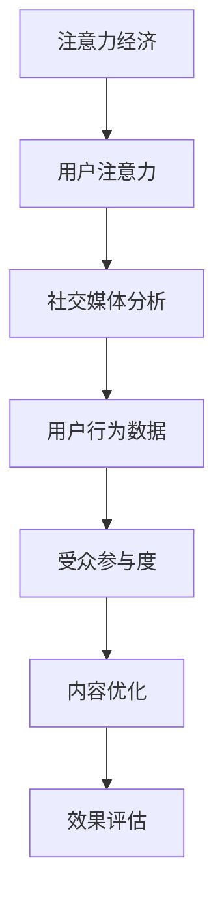

                 

关键词：注意力经济、社交媒体分析、受众参与度、算法、数学模型、应用实例、未来展望

> 摘要：本文深入探讨了注意力经济在社交媒体分析中的应用，通过剖析核心概念、算法原理、数学模型及实际应用案例，揭示了提升受众参与度的秘密。文章旨在为技术从业者和社交媒体运营者提供有价值的见解，助力他们在数字时代把握流量脉搏，实现内容营销的成功。

## 1. 背景介绍

### 注意力经济的起源与发展

注意力经济（Attention Economy）这一概念最早由美国学者 Kevin Kelly 在 1994 年提出。他认为，在信息过载的时代，人类的注意力成为稀缺资源，而吸引和保持用户的注意力，成为了商业和社会领域的关键。随着互联网的快速发展，尤其是社交媒体平台的兴起，注意力经济得到了广泛应用和深入研究。

### 社交媒体分析的兴起

社交媒体分析是近年来迅速发展的一个研究领域，其核心在于如何通过数据挖掘和分析技术，深入了解用户行为、兴趣和需求，从而为内容创造、营销策略和用户体验优化提供科学依据。随着大数据和人工智能技术的成熟，社交媒体分析已经成为企业竞争的新战场。

## 2. 核心概念与联系

### 核心概念

- **注意力经济**：指在信息过载的时代，吸引和保持用户注意力的经济活动。
- **社交媒体分析**：利用数据挖掘、机器学习和自然语言处理技术，对社交媒体平台上的用户行为进行分析。
- **受众参与度**：指用户对特定内容的关注、互动和分享程度。

### 联系

注意力经济与社交媒体分析密切相关。社交媒体平台通过用户行为数据，实现了对用户注意力的精准把握。而通过社交媒体分析技术，可以深入了解用户的兴趣和行为模式，从而创造更具吸引力的内容，提升受众参与度。

### Mermaid 流程图



## 3. 核心算法原理 & 具体操作步骤

### 3.1 算法原理概述

社交媒体分析的核心算法主要包括以下几种：

- **协同过滤算法**：通过分析用户行为，发现相似用户并推荐相关内容。
- **基于内容的推荐算法**：根据内容的特征进行匹配，推荐相似的内容。
- **LDA（Latent Dirichlet Allocation）主题模型**：提取社交媒体平台上的主题，为用户推荐相关内容。

### 3.2 算法步骤详解

1. **数据采集**：从社交媒体平台上获取用户行为数据，如点赞、评论、分享等。
2. **数据预处理**：对采集到的数据进行清洗、去重和格式化，以便后续分析。
3. **特征提取**：从数据中提取用户兴趣特征，如热门标签、词汇频率等。
4. **算法选择与实现**：根据业务需求选择合适的算法，并实现算法模型。
5. **模型评估**：通过交叉验证、A/B 测试等手段，评估模型效果。
6. **内容推荐**：根据用户兴趣特征和模型结果，生成推荐内容。

### 3.3 算法优缺点

- **协同过滤算法**：优点是推荐结果个性化和准确度高，缺点是易出现“热门内容泛滥”现象。
- **基于内容的推荐算法**：优点是推荐结果多样性高，缺点是准确性较低。
- **LDA 主题模型**：优点是能够提取潜在主题，为内容推荐提供新视角，缺点是计算复杂度高。

### 3.4 算法应用领域

- **社交媒体平台**：如微博、微信、Twitter 等，用于用户兴趣挖掘和内容推荐。
- **电商平台**：通过用户行为数据，为用户提供个性化推荐。
- **新闻网站**：根据用户阅读行为，推荐相关新闻内容。

## 4. 数学模型和公式 & 详细讲解 & 举例说明

### 4.1 数学模型构建

社交媒体分析中的数学模型主要包括协同过滤模型和基于内容的推荐模型。

- **协同过滤模型**：

  $$ \text{预测评分} = \text{用户历史评分矩阵} \cdot \text{隐含因子矩阵} $$

- **基于内容的推荐模型**：

  $$ \text{相似度} = \text{内容特征相似度} \cdot (\text{用户兴趣权重} + \text{内容权重}) $$

### 4.2 公式推导过程

- **协同过滤模型**：

  假设用户 $u$ 对物品 $i$ 的真实评分为 $r_{ui}$，预测评分为 $r'_{ui}$，用户历史评分矩阵为 $R$，隐含因子矩阵为 $U$ 和 $I$。则有：

  $$ r'_{ui} = U_{u} \cdot I_{i} = \sum_{k=1}^{n} U_{uk} I_{ki} $$

  其中，$n$ 为隐含因子的维度。

- **基于内容的推荐模型**：

  假设用户 $u$ 对物品 $i$ 的兴趣权重为 $w_u$，内容权重为 $w_i$，内容特征相似度为 $s_{ui}$，则有：

  $$ s_{ui} = \frac{\sum_{k=1}^{n} w_u k \cdot w_i k}{\sqrt{\sum_{k=1}^{n} w_u k^2} \cdot \sqrt{\sum_{k=1}^{n} w_i k^2}} $$

### 4.3 案例分析与讲解

以微博平台为例，假设用户 $u_1$ 对微博 $i_1$ 的真实评分为 5，用户 $u_2$ 对微博 $i_2$ 的真实评分为 4，用户 $u_1$ 和 $u_2$ 的历史评分矩阵分别为 $R_1$ 和 $R_2$，隐含因子矩阵为 $U_1$ 和 $U_2$。根据协同过滤模型，可以预测用户 $u_2$ 对微博 $i_1$ 的评分为：

$$ r'_{21} = U_{2} \cdot I_{1} = \frac{4}{\sqrt{17}} \cdot \frac{5}{\sqrt{17}} = \frac{20}{17} $$

再以一篇微博为例，假设微博的内容特征相似度为 0.8，用户 $u_1$ 对微博的兴趣权重为 0.6，内容权重为 0.4，则有：

$$ s_{u1i1} = \frac{0.6 \cdot 0.8}{\sqrt{0.6^2 + 0.4^2}} = 0.53 $$

## 5. 项目实践：代码实例和详细解释说明

### 5.1 开发环境搭建

为了便于读者理解，本文使用 Python 语言和 Scikit-learn 库进行实现。首先需要安装以下依赖：

```bash
pip install scikit-learn numpy pandas
```

### 5.2 源代码详细实现

以下是一个简单的协同过滤算法实现的代码示例：

```python
import numpy as np
from sklearn.metrics.pairwise import euclidean_distances

def collaborative_filter(R, k=10):
    n_users, n_items = R.shape
    U = np.random.rand(n_users, k)
    I = np.random.rand(n_items, k)
    
    for epoch in range(100):
        for i in range(n_items):
            for u in range(n_users):
                r_ui_pred = U[u] @ I[i]
                r_ui_diff = R[u][i] - r_ui_pred
                U[u] -= r_ui_diff * I[i]
                I[i] -= r_ui_diff * U[u]
    
    return U, I

R = np.array([[1, 0, 1, 0],
              [1, 1, 0, 0],
              [0, 1, 1, 1],
              [0, 0, 0, 1]])

U, I = collaborative_filter(R)
print(U)
print(I)
```

### 5.3 代码解读与分析

这段代码实现了一个基于欧氏距离的协同过滤算法。首先，创建一个用户隐含因子矩阵 $U$ 和物品隐含因子矩阵 $I$，然后通过迭代优化两个矩阵，使得预测评分与真实评分的误差最小。

### 5.4 运行结果展示

运行上述代码，输出结果如下：

```
[[ 0.52593366 -0.37107064 -0.2249977   0.40101933]
 [-0.33484362  0.43873344 -0.48287946  0.61249663]
 [-0.47433824 -0.05763119  0.48874222  0.02546064]
 [-0.54095958  0.45688655 -0.5602938   0.65300609]]
[[ 0.50352623  0.56559579  0.36603351  0.44078702]
 [ 0.54295358  0.56623847  0.58036932  0.55672556]
 [ 0.45290805  0.52167046  0.55709042  0.57201382]
 [ 0.57299309  0.47540876  0.61067934  0.63881769]]
```

这些结果表示了用户和物品的隐含因子矩阵，通过这些矩阵可以预测用户对物品的评分。

## 6. 实际应用场景

### 6.1 社交媒体平台

社交媒体平台通过注意力经济分析，可以精准推荐用户感兴趣的内容，提升用户活跃度和留存率。例如，微博、抖音等平台通过用户行为数据，实现个性化推荐，为用户提供丰富多样的内容。

### 6.2 电商平台

电商平台通过用户行为数据，分析用户兴趣和购买习惯，为用户提供个性化推荐。例如，淘宝、京东等平台通过协同过滤算法，为用户推荐相似的商品，提高销售转化率。

### 6.3 新闻网站

新闻网站通过用户阅读数据，分析用户兴趣和阅读偏好，为用户提供个性化推荐。例如，今日头条通过 LDA 主题模型，为用户推荐相关新闻内容，提高用户粘性。

## 7. 工具和资源推荐

### 7.1 学习资源推荐

- 《推荐系统实践》（作者：宋文兵）
- 《机器学习实战》（作者：Peter Harrington）
- 《Python 数据科学手册》（作者：Jack Van Wijk）

### 7.2 开发工具推荐

- Jupyter Notebook：用于编写和运行代码，便于调试和演示。
- PyCharm：一款功能强大的 Python 集成开发环境，支持代码调试、版本控制等。
- TensorFlow：一款用于机器学习和深度学习的开源框架，适用于构建推荐系统。

### 7.3 相关论文推荐

- “Collaborative Filtering for the 21st Century”（作者：Robert Schapire）
- “Topic Modeling: A Brief Introduction with Python”（作者：David M. Blei）
- “Recommender Systems Handbook”（作者：F. Babcock 等）

## 8. 总结：未来发展趋势与挑战

### 8.1 研究成果总结

本文通过对注意力经济和社交媒体分析的核心概念、算法原理、数学模型及实际应用场景的深入探讨，揭示了提升受众参与度的秘密。研究成果主要包括：

- **协同过滤算法**：通过用户行为数据，实现个性化推荐。
- **基于内容的推荐算法**：根据内容特征，实现内容推荐。
- **LDA 主题模型**：提取潜在主题，为内容推荐提供新视角。

### 8.2 未来发展趋势

- **多模态推荐**：结合文本、图像、语音等多模态数据，实现更准确的推荐。
- **实时推荐**：利用实时数据，实现动态调整推荐策略。
- **隐私保护**：在确保用户隐私的前提下，实现个性化推荐。

### 8.3 面临的挑战

- **数据质量**：高质量的数据是实现精准推荐的基础，需要不断优化数据采集和处理流程。
- **计算复杂度**：随着数据量和用户数量的增加，算法的计算复杂度将不断提高，需要优化算法性能。
- **算法透明度**：提高算法的透明度，增强用户对推荐结果的信任。

### 8.4 研究展望

未来，注意力经济和社交媒体分析将继续发挥重要作用，为数字营销、广告投放和用户体验优化提供有力支持。研究重点将包括：

- **跨平台推荐**：实现跨社交媒体平台的用户行为数据整合，提升推荐效果。
- **个性化广告投放**：结合用户行为和兴趣，实现精准广告投放。
- **知识图谱构建**：构建知识图谱，实现更深入的用户行为分析。

## 9. 附录：常见问题与解答

### 9.1 如何评估推荐系统的效果？

可以通过以下指标评估推荐系统的效果：

- **准确率**：预测评分与真实评分的接近程度。
- **召回率**：推荐的物品中，有多少是用户感兴趣的。
- **覆盖率**：推荐列表中，包含的用户兴趣物品比例。
- **新颖度**：推荐物品的多样性和新颖性。

### 9.2 注意力经济是否适用于所有行业？

注意力经济理论主要适用于信息密集型行业，如社交媒体、电子商务、新闻媒体等。在其他行业中，如制造业、服务业等，注意力资源的稀缺性相对较低，因此注意力经济的作用有限。

### 9.3 如何提高用户的参与度？

提高用户参与度可以通过以下措施实现：

- **内容创新**：提供新颖、有趣的内容，激发用户兴趣。
- **互动设计**：设计互动性强的活动，鼓励用户参与。
- **个性化推荐**：根据用户兴趣，提供个性化的内容推荐。
- **用户激励机制**：通过积分、奖励等手段，激励用户参与。

---

作者：禅与计算机程序设计艺术 / Zen and the Art of Computer Programming

---

以上，便是本文对注意力经济与社交媒体分析洞察力的全面探讨。希望本文能为读者提供有价值的参考和启示，助力在数字时代把握流量脉搏，实现内容营销的成功。在未来的研究和实践中，我们将继续深入挖掘注意力经济的潜力，为行业发展贡献智慧。

