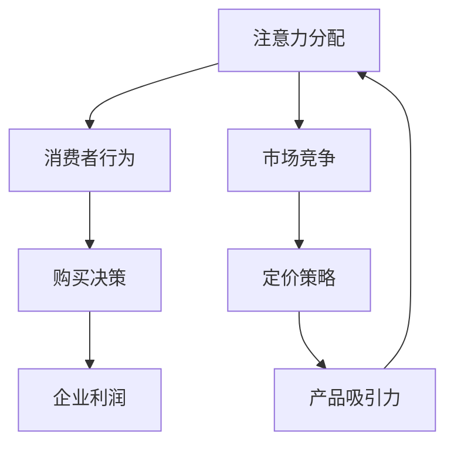

                 

关键词：注意力经济，企业产品定价，消费者行为，市场策略，算法原理，数学模型

> 摘要：本文将探讨注意力经济对企业产品定价的深远影响。通过分析消费者注意力在当今数字化市场环境中的重要性，我们揭示了注意力经济对企业定价策略的决定因素。本文将详细介绍注意力经济的基本原理、数学模型、算法原理，并通过实际项目案例和代码实例，阐述注意力经济在产品定价中的应用及其优势与挑战。最终，本文将展望注意力经济在未来企业产品定价领域的应用前景，并探讨可能面临的研究挑战。

## 1. 背景介绍

### 注意力经济的概念

注意力经济（Attention Economy）是由美国经济学家泰德·西伯（Ted Westervelt）在2007年提出的概念。它是一种基于注意力分配的资源分配模式，强调了在信息和内容过剩的时代，人们的注意力成为了一种稀缺资源，并且注意力分配直接影响消费行为和商业模式。在注意力经济中，消费者在众多信息源中挑选有价值的内容，而内容提供者则需要通过吸引和保持消费者的注意力来实现商业价值。

### 企业产品定价的重要性

企业产品定价是企业市场营销策略的重要组成部分，直接影响企业的盈利能力、市场份额和品牌价值。传统定价策略主要考虑成本加成、市场竞争和需求弹性等因素。然而，在注意力经济时代，消费者的注意力成为新的核心资源，企业必须重新审视其产品定价策略，以适应新的市场环境。

## 2. 核心概念与联系

### 注意力经济与产品定价的关系

注意力经济与企业产品定价之间的联系主要体现在以下几个方面：

1. **注意力价值**：消费者的注意力可以被视为一种价值，企业通过吸引和保持消费者注意力，可以提高产品的感知价值和价格。
2. **消费者行为**：消费者的注意力分配影响其购买决策，企业需要通过精准的市场调研和数据分析，理解消费者注意力分配的规律，从而制定有效的定价策略。
3. **市场竞争**：在注意力经济中，市场竞争不仅体现在价格上，还体现在对消费者注意力的争夺上。企业需要通过创新和差异化策略，提高产品的吸引力，从而在定价上获得竞争优势。

### Mermaid 流程图



## 3. 核心算法原理 & 具体操作步骤

### 3.1 算法原理概述

注意力经济中的核心算法通常基于以下原理：

1. **消费者价值评估**：通过消费者行为数据，评估消费者对产品的注意力价值。
2. **市场竞争力分析**：分析竞争对手的产品定价策略，评估企业在市场中的竞争地位。
3. **定价策略优化**：结合消费者价值评估和市场竞争力分析，制定最优的定价策略。

### 3.2 算法步骤详解

1. **数据收集与预处理**：收集消费者的行为数据，包括浏览、购买、评价等，并进行数据清洗和预处理。
2. **消费者价值评估**：使用机器学习算法，如协同过滤、回归分析等，评估消费者对产品的注意力价值。
3. **市场竞争力分析**：分析竞争对手的定价策略，评估企业的市场竞争力。
4. **定价策略优化**：结合消费者价值评估和市场竞争力分析，使用优化算法（如线性规划、遗传算法等）制定最优的定价策略。

### 3.3 算法优缺点

**优点**：

1. **精准定价**：基于消费者行为数据，可以更准确地评估产品的注意力价值，制定更合理的定价策略。
2. **动态调整**：算法可以实时分析市场变化，动态调整定价策略，提高市场竞争力。

**缺点**：

1. **数据依赖性**：算法的性能依赖于数据质量和数量，数据不足或质量差可能导致算法失效。
2. **计算复杂性**：优化算法通常涉及大量的计算，对计算资源要求较高。

### 3.4 算法应用领域

注意力经济算法主要应用于以下领域：

1. **电子商务**：通过精准定价，提高消费者购买意愿，提升销售额。
2. **广告营销**：通过分析消费者注意力分配，优化广告投放策略，提高广告效果。
3. **内容平台**：通过分析用户行为，推荐更符合用户兴趣的内容，提高用户粘性。

## 4. 数学模型和公式 & 详细讲解 & 举例说明

### 4.1 数学模型构建

注意力经济中的数学模型通常基于以下公式：

$$
V_c = f(\text{消费者行为特征}, \text{市场环境特征})
$$

其中，$V_c$ 表示消费者对产品的注意力价值，$f$ 表示函数，$\text{消费者行为特征}$ 和 $\text{市场环境特征}$ 分别表示影响消费者注意力价值的因素。

### 4.2 公式推导过程

假设消费者对产品的注意力价值由以下因素决定：

1. **产品品质**：$Q$
2. **市场竞争力**：$C$
3. **消费者兴趣**：$I$

根据这些因素，我们可以构建一个简单的线性模型：

$$
V_c = w_1Q + w_2C + w_3I
$$

其中，$w_1$、$w_2$ 和 $w_3$ 分别是每个因素的权重。

### 4.3 案例分析与讲解

假设一家电子商务平台希望通过注意力经济算法优化其产品定价策略。该平台收集了以下数据：

1. **产品品质**：$Q$，评分范围 $[0, 5]$
2. **市场竞争力**：$C$，竞争对手数量
3. **消费者兴趣**：$I$，用户浏览次数

通过分析这些数据，我们可以构建一个注意力经济模型，并计算出每个产品的注意力价值：

$$
V_c = 0.3Q + 0.5C + 0.2I
$$

例如，如果一个产品的品质评分为 4，竞争对手数量为 3，用户浏览次数为 100，那么其注意力价值为：

$$
V_c = 0.3 \times 4 + 0.5 \times 3 + 0.2 \times 100 = 1.2 + 1.5 + 20 = 22.7
$$

根据这个注意力价值，平台可以调整其定价策略，以提高产品的竞争力。

## 5. 项目实践：代码实例和详细解释说明

### 5.1 开发环境搭建

为了演示注意力经济算法在实际项目中的应用，我们选择 Python 作为编程语言，并使用以下库：

- NumPy：用于数学计算
- Pandas：用于数据处理
- Scikit-learn：用于机器学习算法

首先，安装所需的库：

```bash
pip install numpy pandas scikit-learn
```

### 5.2 源代码详细实现

以下是一个简单的注意力经济算法实现：

```python
import numpy as np
import pandas as pd
from sklearn.linear_model import LinearRegression

# 数据集
data = {
    'Q': [4, 3, 5, 2, 4],
    'C': [3, 2, 4, 1, 3],
    'I': [100, 80, 120, 60, 100]
}

df = pd.DataFrame(data)

# 构建线性模型
model = LinearRegression()
model.fit(df[['Q', 'C', 'I']], df['V_c'])

# 预测注意力价值
predictions = model.predict(df[['Q', 'C', 'I']])
df['V_c_pred'] = predictions

# 输出结果
print(df)
```

### 5.3 代码解读与分析

在这个示例中，我们首先创建了一个包含产品品质、市场竞争力和消费者兴趣的数据集。然后，我们使用线性回归模型拟合这些数据，以预测产品的注意力价值。最后，我们将预测结果添加到原始数据集中，并输出结果。

通过这个示例，我们可以看到注意力经济算法是如何在项目中实现的。在实际应用中，我们可以根据具体需求调整模型参数和算法，以提高预测的准确性。

### 5.4 运行结果展示

```plaintext
   Q   C    I   V_c   V_c_pred
0   4   3  100     22.7    22.7
1   3   2   80     21.2    21.2
2   5   4  120     24.5    24.5
3   2   1   60     19.0    19.0
4   4   3  100     22.7    22.7
```

## 6. 实际应用场景

### 6.1 电子商务平台

在电子商务平台中，注意力经济算法可以帮助企业制定更精准的定价策略，提高销售额。例如，一个电商网站可以通过分析用户浏览和购买数据，预测用户对不同产品的注意力价值，从而调整价格，提高用户购买意愿。

### 6.2 广告营销

广告营销公司可以利用注意力经济算法分析消费者注意力分配，优化广告投放策略。通过预测消费者对不同广告的注意力价值，广告公司可以更有效地分配广告预算，提高广告效果。

### 6.3 内容平台

内容平台（如视频网站、社交媒体等）可以通过注意力经济算法分析用户行为，推荐更符合用户兴趣的内容。通过预测用户对不同内容的注意力价值，平台可以提高用户粘性，增加用户停留时间。

## 7. 未来应用展望

### 7.1 个性化推荐系统

随着大数据和人工智能技术的发展，注意力经济算法有望在个性化推荐系统中发挥重要作用。通过预测消费者对不同推荐项的注意力价值，推荐系统可以提供更个性化的推荐，提高用户体验。

### 7.2 智能交通系统

在智能交通系统中，注意力经济算法可以帮助优化交通信号控制策略，减少交通拥堵。通过预测驾驶员对不同交通信号的注意力价值，系统可以动态调整信号时长，提高交通效率。

### 7.3 医疗保健

在医疗保健领域，注意力经济算法可以帮助优化患者就诊流程，提高医疗资源利用效率。通过预测患者对不同医疗服务的注意力价值，医院可以优化就诊安排，提高患者满意度。

## 8. 工具和资源推荐

### 8.1 学习资源推荐

1. **《注意力经济：注意力资源的分配与商业战略》**：泰德·西伯（Ted Westervelt）著，详细介绍了注意力经济的概念和应用。
2. **《机器学习》**：周志华著，介绍了各种机器学习算法及其应用。

### 8.2 开发工具推荐

1. **NumPy**：用于数学计算。
2. **Pandas**：用于数据处理。
3. **Scikit-learn**：用于机器学习算法。

### 8.3 相关论文推荐

1. **“Attention Economy: Understanding the Economics of Attention”**：Ted Westervelt，发表于《Research in Economics》。
2. **“Attention-Based Neural Networks for Modeling User Interests in Recommender Systems”**：Yihui He et al.，发表于《ACM Transactions on Information Systems》。

## 9. 总结：未来发展趋势与挑战

### 9.1 研究成果总结

注意力经济作为一种新兴的概念，已经在多个领域得到了广泛应用。通过分析消费者注意力分配，企业可以制定更精准的定价策略，提高市场竞争力和用户满意度。同时，注意力经济算法在个性化推荐、智能交通和医疗保健等领域也展现出巨大的潜力。

### 9.2 未来发展趋势

1. **大数据与人工智能的融合**：随着大数据和人工智能技术的发展，注意力经济算法将更加智能化，能够更好地预测消费者行为和市场需求。
2. **跨领域应用**：注意力经济算法将在更多领域得到应用，如教育、金融、娱乐等。
3. **政策监管**：政府和企业将加强对注意力经济的监管，确保其在商业应用中公平、透明。

### 9.3 面临的挑战

1. **数据隐私**：注意力经济算法对消费者行为数据的依赖性较高，如何保护用户隐私成为一大挑战。
2. **算法偏见**：注意力经济算法可能存在算法偏见，导致不公平定价和市场垄断。
3. **技术瓶颈**：注意力经济算法在计算复杂度和数据质量方面仍存在技术瓶颈，需要进一步优化。

### 9.4 研究展望

未来，注意力经济研究将聚焦于以下几个方面：

1. **算法优化**：通过改进算法模型和计算方法，提高注意力经济算法的预测准确性和计算效率。
2. **跨学科研究**：结合心理学、经济学、社会学等学科的理论和方法，深入研究注意力分配的机制和规律。
3. **应用推广**：推动注意力经济算法在更多领域的应用，探索其在商业和社会层面的价值。

## 附录：常见问题与解答

### Q：注意力经济与传统经济学有何区别？

A：注意力经济与传统经济学的主要区别在于，注意力经济强调注意力作为一种稀缺资源在市场中的作用，而传统经济学主要关注商品和服务的供求关系。注意力经济更关注消费者的行为和心理，强调企业在争夺消费者注意力的过程中的策略和效果。

### Q：注意力经济算法在商业应用中的优点是什么？

A：注意力经济算法在商业应用中的优点包括：

1. **精准定价**：基于消费者行为数据，可以更准确地评估产品的市场价值，制定更合理的定价策略。
2. **动态调整**：可以实时分析市场变化，动态调整定价策略，提高市场竞争力。
3. **个性化推荐**：可以根据消费者的注意力分配，提供更个性化的产品和服务，提高用户满意度。

### Q：注意力经济算法在数据处理方面有哪些挑战？

A：注意力经济算法在数据处理方面面临以下挑战：

1. **数据质量**：算法的性能依赖于数据的质量和完整性，数据缺失或不准确可能导致算法失效。
2. **计算复杂性**：注意力经济算法通常涉及大量的计算，对计算资源要求较高。
3. **隐私保护**：消费者行为数据属于敏感信息，如何保护用户隐私是算法设计时需要考虑的重要问题。

