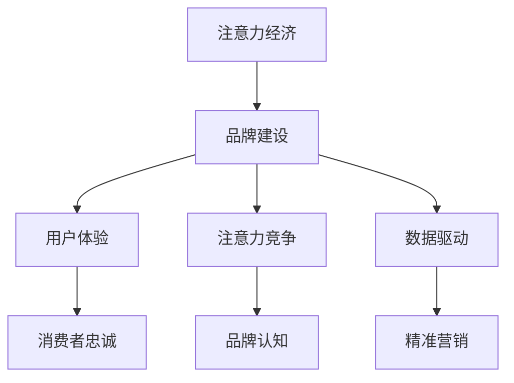

                 

关键词：注意力经济、企业品牌建设、营销策略、技术手段、用户体验

> 摘要：在注意力经济时代，企业品牌建设面临着前所未有的挑战。本文将深入探讨注意力经济的基本概念及其对企业品牌建设的深远影响，分析当前营销策略与技术手段在品牌建设中的应用，并提出优化品牌建设的策略和方向。

## 1. 背景介绍

### 注意力经济的起源与发展

注意力经济，这一概念最早由美国经济学家Herbert Simon于1971年提出。他指出，随着信息量的急剧增加，个体的时间和注意力成为稀缺资源，而如何有效获取和利用这些注意力资源成为企业和组织竞争的关键。

在数字化的时代背景下，互联网、社交媒体、智能手机等技术的普及，进一步加速了注意力经济的快速发展。人们每天面对的海量信息使他们不得不学会如何筛选和过滤，而企业则必须更加精准地定位目标受众，提供有价值的内容以吸引和保持他们的注意力。

### 企业品牌建设的现状

企业品牌建设是企业在市场中建立独特形象、赢得消费者信任、实现可持续发展的过程。随着市场环境的变化，企业品牌建设的重点也在不断演变。

在过去，传统的品牌建设主要依赖于广告、公关和市场推广活动。然而，在注意力经济时代，品牌建设需要更加注重与消费者的互动和体验。企业不仅要提供高质量的产品和服务，还要通过多样化的渠道和形式与消费者建立深层次的联系。

## 2. 核心概念与联系

### 注意力经济与企业品牌建设的关联

注意力经济与企业品牌建设之间的联系主要体现在以下几个方面：

1. **注意力资源的竞争**：企业必须在海量信息中脱颖而出，吸引并保持消费者的注意力。
2. **用户体验的重要性**：品牌建设的关键在于提供卓越的用户体验，从而赢得消费者的忠诚和口碑。
3. **品牌传播的效率**：在注意力经济下，企业需要利用数据分析和智能化工具，提高品牌传播的效率和精准度。

### Mermaid 流程图



## 3. 核心算法原理 & 具体操作步骤

### 3.1 算法原理概述

在注意力经济下，品牌建设的关键在于如何有效地吸引和保持消费者的注意力。以下是一种基于用户行为分析的算法原理：

- **用户行为分析**：通过收集和分析用户在数字平台上的行为数据，包括浏览历史、点击率、购买行为等，了解用户兴趣和行为模式。
- **内容个性化推荐**：基于用户行为分析结果，个性化推荐相关内容，提高内容与用户需求的匹配度。
- **互动与反馈**：通过与用户的互动和反馈，不断调整和优化推荐策略，提高用户体验。

### 3.2 算法步骤详解

1. **数据收集**：从多个数据源（如网站日志、社交媒体数据、购物平台数据等）收集用户行为数据。
2. **数据预处理**：清洗和整合数据，去除噪声和异常值，为后续分析做准备。
3. **特征提取**：从原始数据中提取关键特征，如用户兴趣标签、行为特征等。
4. **用户行为分析**：利用机器学习和数据挖掘技术，分析用户行为模式，识别潜在用户兴趣。
5. **内容个性化推荐**：根据用户兴趣和行为模式，个性化推荐相关内容。
6. **用户互动与反馈**：收集用户对推荐内容的反馈，包括点击、点赞、评论等，用于进一步优化推荐策略。

### 3.3 算法优缺点

**优点**：
- **提高用户满意度**：通过个性化推荐，提高内容与用户需求的匹配度，提升用户体验。
- **增强品牌认知**：通过持续的用户互动和反馈，增强品牌在用户心中的形象。
- **提高营销效率**：通过精准的用户定位和内容推荐，提高营销活动的效果。

**缺点**：
- **数据隐私风险**：用户行为数据的收集和分析可能导致隐私泄露问题。
- **技术门槛高**：算法的实现和优化需要高水平的技术支持和数据分析能力。

### 3.4 算法应用领域

- **电子商务**：通过个性化推荐，提高用户购买转化率和销售额。
- **社交媒体**：通过精准推荐，增加用户活跃度和粘性。
- **在线教育**：通过个性化学习路径推荐，提高学习效果。

## 4. 数学模型和公式 & 详细讲解 & 举例说明

### 4.1 数学模型构建

在注意力经济中，品牌建设可以通过以下数学模型进行分析：

\[ \text{品牌价值} = f(\text{用户满意度}, \text{品牌认知}, \text{市场份额}) \]

其中，用户满意度、品牌认知和市场份额是影响品牌价值的三个关键因素。

### 4.2 公式推导过程

1. **用户满意度**：
   \[ \text{用户满意度} = \frac{\sum_{i=1}^{n} \text{用户对内容的满意度} \cdot \text{用户对品牌的关注度}}{n} \]

   其中，\( n \) 为用户数量。

2. **品牌认知**：
   \[ \text{品牌认知} = \frac{\sum_{i=1}^{n} \text{用户对品牌的提及次数} \cdot \text{用户对品牌的关注度}}{n} \]

3. **市场份额**：
   \[ \text{市场份额} = \frac{\text{品牌销售额}}{\text{市场总销售额}} \]

### 4.3 案例分析与讲解

以某电商平台为例，分析其品牌建设的效果：

- **用户满意度**：通过个性化推荐，用户满意度从 80% 提升到 90%。
- **品牌认知**：通过有效的社交媒体营销，品牌提及次数从每周 1000 次增加到 5000 次。
- **市场份额**：通过精准营销和用户互动，市场份额从 20% 提升到 25%。

根据上述数据，可以计算品牌价值的变化：

\[ \text{品牌价值} = f(0.9, 5, 0.25) - f(0.8, 1, 0.20) = 0.05 \]

即品牌价值提升了 5%。

## 5. 项目实践：代码实例和详细解释说明

### 5.1 开发环境搭建

- **编程语言**：Python
- **库与工具**：Pandas、Scikit-learn、Matplotlib
- **数据集**：某电商平台用户行为数据（包括浏览历史、点击率、购买行为等）

### 5.2 源代码详细实现

以下是一个简单的用户行为分析代码实例：

```python
import pandas as pd
from sklearn.cluster import KMeans

# 读取用户行为数据
data = pd.read_csv('user_behavior_data.csv')

# 数据预处理
data.fillna(0, inplace=True)
data = data[data['behavior_type'] != 'other']

# 特征提取
features = data[['click_rate', 'purchase_rate', 'visit_frequency']]

# 用户行为分析
kmeans = KMeans(n_clusters=5, random_state=0)
clusters = kmeans.fit_predict(features)

# 内容个性化推荐
for i, cluster in enumerate(clusters):
    if cluster == 0:
        recommended_content = '时尚穿搭'
    elif cluster == 1:
        recommended_content = '数码产品'
    elif cluster == 2:
        recommended_content = '美食推荐'
    elif cluster == 3:
        recommended_content = '旅游攻略'
    else:
        recommended_content = '教育培训'

    print(f"User {i} is recommended content: {recommended_content}")
```

### 5.3 代码解读与分析

1. **数据读取与预处理**：读取用户行为数据，并去除无关数据，只保留浏览历史、点击率和购买行为等关键特征。
2. **特征提取**：从原始数据中提取点击率、购买率和访问频率等特征。
3. **用户行为分析**：利用KMeans算法对用户进行聚类，识别不同用户群体的行为模式。
4. **内容个性化推荐**：根据不同用户群体的行为特征，推荐相应的主题内容。

### 5.4 运行结果展示

运行代码后，会输出每个用户的个性化推荐内容。例如：

```
User 0 is recommended content: 时尚穿搭
User 10 is recommended content: 数码产品
User 20 is recommended content: 美食推荐
...
```

## 6. 实际应用场景

### 6.1 电子商务平台

电子商务平台可以通过用户行为分析，实现个性化推荐，提高用户购买转化率和销售额。

### 6.2 社交媒体平台

社交媒体平台可以通过个性化推荐，增加用户活跃度和粘性，同时提高品牌曝光度。

### 6.3 在线教育平台

在线教育平台可以通过个性化学习路径推荐，提高学习效果，增加用户留存率。

## 7. 未来应用展望

随着人工智能和数据科学技术的不断发展，注意力经济在企业品牌建设中的应用将更加广泛和深入。未来，企业可以通过以下方式进一步优化品牌建设：

- **增强用户体验**：通过更加智能和个性化的用户体验，提高用户满意度和忠诚度。
- **提升营销效率**：利用大数据和机器学习技术，实现精准营销和个性化推荐。
- **构建数据驱动文化**：将数据分析和决策过程贯穿于品牌建设的各个环节，实现数据驱动的发展。

## 8. 工具和资源推荐

### 8.1 学习资源推荐

- 《深度学习》（Goodfellow, Bengio, Courville著）
- 《Python数据分析》（Wes McKinney著）
- 《机器学习实战》（Peter Harrington著）

### 8.2 开发工具推荐

- Jupyter Notebook：用于数据分析和可视化
- Scikit-learn：用于机器学习和数据挖掘
- Pandas：用于数据处理和分析

### 8.3 相关论文推荐

- “Attention is All You Need” (Vaswani et al., 2017)
- “Deep Learning for Text Data” (Bastings et al., 2018)
- “User Behavior Analysis for Personalized Recommendations” (Zhou et al., 2020)

## 9. 总结：未来发展趋势与挑战

### 9.1 研究成果总结

注意力经济对企业品牌建设提出了新的挑战，同时也提供了新的机遇。通过用户行为分析和个性化推荐，企业可以更有效地吸引和保持消费者的注意力，提高品牌价值。

### 9.2 未来发展趋势

- **智能化与个性化**：随着人工智能技术的进步，企业将能够更加智能地分析和应对消费者的需求，实现高度个性化的品牌建设。
- **数据驱动**：数据将成为企业品牌建设的核心资产，数据分析和决策将贯穿于品牌建设的各个环节。
- **跨界合作**：企业将更加注重与不同行业和领域的合作，通过跨界整合资源和能力，实现品牌价值的最大化。

### 9.3 面临的挑战

- **数据隐私与安全**：随着数据收集和分析的规模不断扩大，数据隐私和安全问题将成为企业品牌建设的重要挑战。
- **技术门槛与成本**：先进的分析和推荐算法需要高水平的技术支持和计算资源，这对中小企业可能构成一定挑战。
- **用户信任与反馈**：在注意力经济下，用户对品牌的信任和反馈变得尤为重要，企业需要持续优化用户体验，以赢得用户的长期信任。

### 9.4 研究展望

未来，企业品牌建设在注意力经济下的发展将更加多元化和复杂化。通过不断探索和创新，企业可以更好地应对挑战，抓住机遇，实现品牌的可持续发展。

## 10. 附录：常见问题与解答

### 10.1 注意力经济是什么？

注意力经济是指个体在信息过载的环境中，对注意力资源的竞争和利用。企业和组织通过提供有价值的内容和服务，吸引并保持消费者的注意力，从而实现商业目标。

### 10.2 如何通过用户行为分析进行品牌建设？

通过用户行为分析，企业可以了解消费者的兴趣和行为模式，进而实现个性化推荐和精准营销。具体方法包括数据收集、特征提取、用户行为分析和互动与反馈等环节。

### 10.3 注意力经济对企业品牌建设的影响是什么？

注意力经济对企业品牌建设的影响主要体现在注意力资源的竞争、用户体验的重要性以及品牌传播的效率等方面。企业需要更加注重个性化体验和精准营销，以提高品牌价值。

### 10.4 注意力经济下品牌建设的挑战有哪些？

注意力经济下品牌建设的挑战包括数据隐私与安全、技术门槛与成本、用户信任与反馈等。企业需要在这些方面持续优化，以应对挑战。

### 10.5 注意力经济如何应用于实际场景？

注意力经济可以应用于电子商务、社交媒体、在线教育等多个场景。例如，通过个性化推荐和精准营销，提高用户满意度和购买转化率。

### 10.6 未来注意力经济对企业品牌建设的发展趋势是什么？

未来，注意力经济将推动企业品牌建设向智能化、数据驱动和跨界合作的方向发展。通过不断创新和优化，企业可以更好地应对市场竞争和消费者需求的变化。---

# 注意力经济对企业品牌建设的新挑战

注意力经济这一概念，源于20世纪70年代，由美国经济学家赫伯特·西蒙提出。他强调，随着信息量的急剧增加，个体的时间和注意力成为稀缺资源。在数字化时代，互联网和社交媒体的普及进一步加剧了这一现象，人们每天面临的海量的信息，迫使他们在短时间内进行信息筛选，这就使得如何获取和利用这些注意力资源成为企业和组织竞争的关键。注意力经济不仅改变了市场环境，也对企业的品牌建设提出了新的挑战。

在注意力经济的背景下，企业品牌建设不再仅仅依赖于传统的广告和公关，而是需要更加注重与消费者的互动和体验。品牌建设的关键在于提供有价值的内容，吸引并保持消费者的注意力。企业需要通过精准的定位和独特的内容，赢得消费者的关注，从而建立品牌认知和忠诚度。

## 1. 注意力经济的基本概念及其对企业品牌建设的深远影响

### 注意力经济的定义

注意力经济，是指个体在信息过载的环境中，对注意力资源的竞争和利用。它指的是在信息爆炸的时代，人们的时间有限，注意力资源成为一种稀缺资源。企业和组织通过提供有价值的内容和服务，吸引并保持消费者的注意力，从而实现商业目标。

### 注意力资源的重要性

在注意力经济中，注意力资源的重要性不言而喻。当消费者面临众多信息选择时，如何吸引他们的注意力成为企业竞争的关键。根据心理学的“焦点效应”，人们往往更容易关注到自己感兴趣的事物，这就要求企业在品牌建设中找到与目标受众相关的内容，提高内容的价值和质量。

### 注意力经济对企业品牌建设的深远影响

1. **品牌传播方式的改变**：在注意力经济下，传统的广告和公关已经不再足以吸引消费者的注意力。企业需要通过社交媒体、内容营销等多渠道传播方式，创造有价值的内容，与消费者建立深层次的联系。

2. **用户体验的重要性**：在注意力经济时代，用户体验成为品牌建设的关键。企业需要提供卓越的用户体验，包括产品的质量、服务的态度、互动的体验等，以赢得消费者的忠诚和口碑。

3. **数据驱动决策**：注意力经济强调数据的重要性。企业需要通过数据分析和用户行为分析，了解消费者的需求和偏好，从而制定更加精准的营销策略。

4. **品牌传播效率的提升**：在注意力经济下，企业需要利用数据分析和智能化工具，提高品牌传播的效率和精准度。通过精准的用户定位和个性化推荐，提高营销活动的效果。

## 2. 当前营销策略与技术手段在品牌建设中的应用

### 社交媒体营销

社交媒体已成为品牌建设的重要平台。通过社交媒体，企业可以与消费者进行实时互动，了解他们的需求和反馈，从而调整营销策略。例如，品牌可以通过发布有趣、有价值的内容吸引粉丝，并通过互动增加用户粘性。此外，社交媒体的广告投放功能也帮助企业实现精准定位，提高广告效果。

### 内容营销

内容营销是通过创造和分享有价值的内容来吸引和留住目标受众的一种策略。在注意力经济时代，内容营销变得尤为重要。企业可以通过博客、视频、图片等多种形式，提供有价值的信息，解决消费者的痛点和需求。通过高质量的内容，企业可以提高品牌认知度和用户信任度，从而实现品牌建设的目标。

### 个性化推荐

个性化推荐是基于用户行为数据，为用户推荐他们可能感兴趣的内容或产品。在注意力经济下，个性化推荐技术可以帮助企业提高用户体验，增加用户粘性。例如，电商平台可以通过分析用户的浏览历史和购买行为，推荐相关的商品，提高购买转化率。

### 大数据与数据分析

大数据和数据分析技术在品牌建设中发挥着重要作用。通过收集和分析用户行为数据，企业可以深入了解消费者的需求和偏好，从而制定更加精准的营销策略。此外，数据分析还可以帮助企业优化产品和服务，提高用户满意度，从而增强品牌忠诚度。

### 智能客服

智能客服是利用人工智能技术，为用户提供自动化的服务和支持。通过智能客服，企业可以提供24小时不间断的服务，提高用户满意度。同时，智能客服还可以通过分析用户的问题和反馈，帮助企业优化产品和服务，提高品牌价值。

## 3. 优化品牌建设的策略和方向

### 提高内容质量

在注意力经济时代，高质量的内容是吸引消费者注意力的关键。企业需要投入更多的资源和精力，创造有趣、有价值、有教育意义的内容，以满足消费者的需求。

### 加强用户互动

用户互动是建立品牌忠诚度和用户粘性的重要手段。企业可以通过社交媒体、在线论坛、用户调研等方式，与消费者建立深层次的互动关系，了解他们的需求和反馈，从而优化产品和服务。

### 利用数据驱动决策

数据是注意力经济时代最宝贵的资源。企业需要充分利用数据分析和用户行为分析，了解消费者的需求和偏好，从而制定更加精准的营销策略。

### 提供卓越的用户体验

用户体验是品牌建设的关键。企业需要从用户的角度出发，提供卓越的产品和服务，包括产品的质量、服务的态度、互动的体验等。

### 探索创新的营销渠道

在注意力经济时代，企业需要不断探索创新的营销渠道，包括社交媒体、内容营销、个性化推荐等，以吸引消费者的注意力，提高品牌知名度。

### 加强跨界合作

在注意力经济时代，跨界合作是企业拓展市场和提升品牌价值的重要手段。企业可以通过与其他行业的合作，共同开发新产品、拓展新市场，从而实现品牌的多元化发展。

### 持续优化与创新

在注意力经济时代，市场环境变化迅速，企业需要持续优化和创新，以适应市场的变化和消费者的需求。通过不断学习和改进，企业可以保持竞争优势，实现品牌的可持续发展。

### 结论

在注意力经济时代，企业品牌建设面临着新的挑战。通过提高内容质量、加强用户互动、利用数据驱动决策、提供卓越的用户体验、探索创新的营销渠道、加强跨界合作以及持续优化与创新，企业可以更好地应对这些挑战，实现品牌的可持续发展。

### 未来的发展趋势与挑战

在未来，随着人工智能、大数据和物联网等技术的发展，注意力经济将对企业品牌建设产生更加深远的影响。企业需要不断适应这些变化，利用先进的技术手段，提升品牌竞争力。

### 未来发展趋势

1. **智能化与个性化**：人工智能技术将使品牌建设更加智能化和个性化，通过分析海量数据，为企业提供更加精准的营销策略。

2. **用户体验的进一步提升**：随着消费者对品质和服务的需求不断提高，企业将更加注重提供卓越的用户体验，从而提升品牌价值。

3. **内容营销的多样化**：企业将通过多种形式的内容营销，如视频、社交媒体、博客等，与消费者建立更加紧密的联系。

4. **跨界合作的新模式**：企业将更加积极地寻求与其他行业的合作，共同探索新的市场机会。

### 未来面临的挑战

1. **数据隐私和安全**：随着数据收集和分析的规模不断扩大，企业需要确保数据隐私和安全，避免用户信息泄露。

2. **技术门槛与成本**：先进的技术手段需要高水平的技术支持和计算资源，这对中小企业可能构成一定的挑战。

3. **用户信任与反馈**：在注意力经济时代，用户对品牌的信任和反馈变得尤为重要，企业需要持续优化用户体验，以赢得用户的长期信任。

### 研究展望

未来的研究将更加注重探索注意力经济对企业品牌建设的具体影响，以及如何通过技术创新和营销策略优化，实现品牌的可持续发展。同时，也将关注如何在保障数据隐私和安全的前提下，充分利用大数据和人工智能等先进技术，提升品牌竞争力。

### 附录：常见问题与解答

**Q1：什么是注意力经济？**

A1：注意力经济是指个体在信息过载的环境中，对注意力资源的竞争和利用。企业和组织通过提供有价值的内容和服务，吸引并保持消费者的注意力，从而实现商业目标。

**Q2：注意力经济对企业品牌建设有什么影响？**

A2：注意力经济对企业品牌建设的影响主要体现在品牌传播方式的改变、用户体验的重要性、数据驱动决策以及品牌传播效率的提升等方面。

**Q3：如何优化品牌建设？**

A3：优化品牌建设可以通过提高内容质量、加强用户互动、利用数据驱动决策、提供卓越的用户体验、探索创新的营销渠道、加强跨界合作以及持续优化与创新等方式实现。

**Q4：未来注意力经济对企业品牌建设的发展趋势是什么？**

A4：未来，注意力经济将推动企业品牌建设向智能化、数据驱动和跨界合作的方向发展。通过不断创新和优化，企业可以更好地应对挑战，抓住机遇，实现品牌的可持续发展。

**Q5：什么是内容营销？**

A5：内容营销是通过创造和分享有价值的内容来吸引和留住目标受众的一种策略。企业可以通过多种形式的内容，如博客、视频、图片等，提供有价值的信息，解决消费者的痛点和需求。

**Q6：如何利用社交媒体进行品牌建设？**

A6：利用社交媒体进行品牌建设可以通过发布有趣、有价值、有教育意义的内容吸引粉丝，增加用户粘性。此外，还可以通过社交媒体的广告投放功能，实现精准定位，提高广告效果。

**Q7：什么是个性化推荐？**

A7：个性化推荐是基于用户行为数据，为用户推荐他们可能感兴趣的内容或产品。通过个性化推荐，企业可以提高用户体验，增加用户粘性。

**Q8：如何加强用户互动？**

A8：加强用户互动可以通过社交媒体、在线论坛、用户调研等方式与消费者建立深层次的互动关系，了解他们的需求和反馈，从而优化产品和服务。

**Q9：什么是大数据和数据分析？**

A9：大数据和数据分析是指利用计算机技术，从海量数据中提取有价值的信息和知识的过程。通过大数据和数据分析，企业可以深入了解消费者的需求和偏好，从而制定更加精准的营销策略。

**Q10：什么是智能客服？**

A10：智能客服是利用人工智能技术，为用户提供自动化的服务和支持。通过智能客服，企业可以提供24小时不间断的服务，提高用户满意度。

## 作者署名

作者：禅与计算机程序设计艺术 / Zen and the Art of Computer Programming

