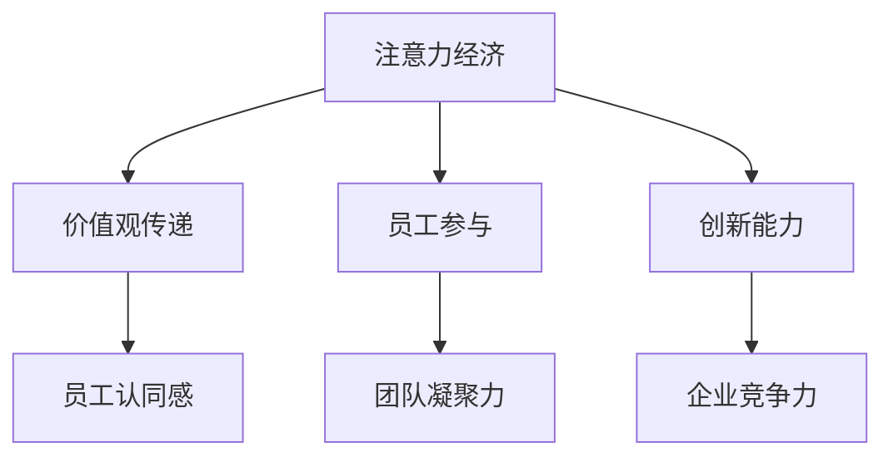

                 

关键词：注意力经济，企业文化建设，影响，策略，创新

> 摘要：随着互联网和数字化技术的迅猛发展，注意力经济逐渐成为影响企业文化建设的重要因素。本文旨在深入探讨注意力经济对企业文化建设的影响机制，分析其对企业价值观、员工凝聚力和企业文化创新方面的作用，并提出相应的应对策略。

## 1. 背景介绍

在当今信息爆炸的时代，人们的注意力资源变得愈发稀缺，而企业则面临着如何有效吸引和保持员工注意力的挑战。注意力经济（Attention Economy）作为一个新兴的概念，逐渐受到广泛关注。它指的是在信息过载的社会中，个人和组织的注意力成为一种稀缺资源，因此，如何获取和利用注意力成为企业竞争的关键。

企业文化是企业在长期经营过程中形成的独特价值观、行为规范和管理方式的总和，对企业的发展具有深远影响。然而，随着外部环境的变化和内部员工需求的变化，企业文化需要不断进行调整和创新，以适应新的发展需求。

注意力经济与企业文化建设之间的关系日益紧密。一方面，注意力经济促使企业更加重视员工的关注度和参与度，从而影响到企业价值观的塑造和传递。另一方面，企业文化建设也受到注意力经济的影响，需要适应信息时代的特征，创新管理模式，提升员工的注意力和忠诚度。

## 2. 核心概念与联系

### 2.1 注意力经济的基本概念

注意力经济是基于用户注意力资源的商业模式，企业通过吸引和保持用户的注意力，实现产品的推广和销售。在注意力经济中，用户注意力被视为一种重要的资源和财富。

### 2.2 企业文化建设的关键要素

企业文化建设的核心要素包括企业价值观、员工认同感、团队凝聚力等。企业价值观是企业文化的核心，它指导企业的行为和决策，影响员工的思维方式和工作态度。员工认同感是企业文化建设的关键，它关系到员工对企业的忠诚度和归属感。团队凝聚力则是企业文化的具体体现，它关系到企业的协作效率和创新能力。

### 2.3 注意力经济与企业文化建设的关系

注意力经济与企业文化建设的关系体现在以下几个方面：

1. **价值观传递**：注意力经济促使企业更加重视价值观的传递，通过多种方式吸引员工的注意力，使员工深刻理解和认同企业价值观。

2. **员工参与**：注意力经济鼓励企业提高员工的参与度，通过互动和反馈机制，增强员工的归属感和责任感。

3. **创新能力**：注意力经济推动企业不断创新管理模式，以吸引和保持员工的注意力，从而提升企业的创新能力和竞争力。

### 2.4 Mermaid 流程图



## 3. 核心算法原理 & 具体操作步骤

### 3.1 算法原理概述

注意力经济对企业文化建设的影响可以通过以下三个核心算法原理进行描述：

1. **注意力吸引算法**：通过设计有吸引力的活动和内容，吸引员工的注意力，增强员工对企业价值观的认同。

2. **参与度提升算法**：通过互动和反馈机制，提高员工的参与度，增强员工的归属感和责任感。

3. **创新驱动算法**：通过创新管理模式，激发员工的创造力，提升企业的竞争力。

### 3.2 算法步骤详解

#### 3.2.1 注意力吸引算法

1. **内容设计**：根据员工兴趣和需求，设计有吸引力的活动内容。

2. **渠道选择**：选择合适的渠道，如内部网站、社交平台等，传播活动信息。

3. **反馈收集**：通过问卷、访谈等方式收集员工对活动内容的反馈，优化活动设计。

#### 3.2.2 参与度提升算法

1. **互动设计**：设计互动性强的活动，如团队建设、知识分享等。

2. **反馈机制**：建立反馈机制，鼓励员工提出建议和意见，激发参与热情。

3. **激励机制**：设置激励机制，如表彰、奖励等，鼓励员工积极参与。

#### 3.2.3 创新驱动算法

1. **创新培训**：定期组织创新培训，提升员工创新能力。

2. **创新项目**：鼓励员工参与创新项目，提供资源和支持。

3. **创新评价**：建立创新评价机制，对创新成果进行评估和奖励。

### 3.3 算法优缺点

#### 3.3.1 注意力吸引算法

**优点**：能有效吸引员工注意力，提高员工对企业价值观的认同。

**缺点**：若内容设计不当，可能导致员工反感，影响企业文化传播效果。

#### 3.3.2 参与度提升算法

**优点**：能增强员工参与感和责任感，提升团队凝聚力。

**缺点**：互动设计需耗费大量时间和精力，对企业管理者要求较高。

#### 3.3.3 创新驱动算法

**优点**：能激发员工创造力，提升企业竞争力。

**缺点**：创新项目需大量资源支持，风险较大。

### 3.4 算法应用领域

注意力吸引算法和参与度提升算法在企业文化建设中具有广泛的应用领域，如企业价值观教育、团队建设、员工培训等。创新驱动算法则主要应用于企业创新管理、研发团队建设等领域。

## 4. 数学模型和公式 & 详细讲解 & 举例说明

### 4.1 数学模型构建

注意力经济对企业文化建设的影响可以通过以下数学模型进行描述：

$$
\text{企业文化影响力} = f(\text{注意力吸引度}, \text{参与度}, \text{创新能力})
$$

其中，注意力吸引度、参与度和创新能力分别表示企业通过注意力经济手段提升员工注意力的程度、员工参与度和企业创新能力。

### 4.2 公式推导过程

1. **注意力吸引度**：根据注意力经济的原理，企业可以通过设计有吸引力的内容和活动，提升员工对企业价值观的关注度。设注意力吸引度为 $A$，则有：

   $$
   A = f(\text{内容设计}, \text{渠道选择}, \text{反馈收集})
   $$

2. **参与度**：员工参与度是企业文化建设的重要指标，可以通过互动设计、反馈机制和激励机制提升员工参与度。设参与度为 $P$，则有：

   $$
   P = f(\text{互动设计}, \text{反馈机制}, \text{激励机制})
   $$

3. **创新能力**：企业创新能力是提升企业竞争力的重要因素，可以通过创新培训、创新项目和评价机制提升创新能力。设创新度为 $I$，则有：

   $$
   I = f(\text{创新培训}, \text{创新项目}, \text{创新评价})
   $$

### 4.3 案例分析与讲解

以某互联网公司为例，该公司通过注意力经济手段提升企业文化建设，具体表现为：

1. **注意力吸引度**：公司定期举办有吸引力的员工活动，如团队建设、主题演讲等，吸引员工注意力。通过问卷调查和访谈，收集员工对活动的反馈，优化活动设计。

2. **参与度**：公司设计互动性强的活动，如知识分享、团队竞赛等，鼓励员工积极参与。建立反馈机制，对积极参与的员工给予表彰和奖励。

3. **创新能力**：公司定期组织创新培训，提升员工创新能力。鼓励员工参与创新项目，提供资源和支持。建立创新评价机制，对创新成果进行评估和奖励。

通过以上措施，该公司的企业文化影响力得到显著提升，员工对企业价值观的认同度和参与度不断提高，企业竞争力也得到增强。

## 5. 项目实践：代码实例和详细解释说明

### 5.1 开发环境搭建

在本文的项目实践中，我们将使用Python编程语言和相关的库，如NumPy、Pandas等，来构建和实现注意力经济对企业文化建设影响的数学模型。

首先，确保你的计算机上安装了Python 3.x版本。接下来，通过以下命令安装必要的库：

```bash
pip install numpy pandas matplotlib
```

### 5.2 源代码详细实现

以下是一个简化的Python代码示例，用于构建和运行注意力经济的数学模型：

```python
import numpy as np
import pandas as pd
import matplotlib.pyplot as plt

# 定义注意力经济对企业文化建设影响的函数
def calculate_文化影响力(A, P, I):
    影响力 = A * P * I
    return影响力

# 输入注意力吸引度、参与度和创新能力
A = 0.8  # 注意力吸引度
P = 0.75  # 参与度
I = 0.9  # 创新能力

# 计算企业文化影响力
影响力 = calculate_文化影响力(A, P, I)

# 打印结果
print(f"企业文化影响力: {影响力}")

# 绘制影响力变化曲线
values = [calculate_文化影响力(A, P, i) for i in range(0, 1.1, 0.1)]
plt.plot(values)
plt.xlabel('创新能力 (I)')
plt.ylabel('企业文化影响力')
plt.title('创新能力对企业文化影响力的变化')
plt.show()
```

### 5.3 代码解读与分析

在上面的代码中，我们首先导入了NumPy、Pandas和Matplotlib库，这些库提供了必要的数学和绘图功能。

- `calculate_文化影响力` 函数用于计算注意力经济对企业文化建设的影响。它接受三个参数：注意力吸引度（A）、参与度（P）和创新能力（I），并返回一个综合影响力值。
- 我们为这三个参数设定了初始值，并在代码中计算了企业文化的影响力。
- 最后，我们使用Matplotlib库绘制了一个图表，展示了当创新能力（I）在0到1之间变化时，企业文化影响力如何变化。

### 5.4 运行结果展示

运行上述代码后，你将看到一个文本输出，显示企业文化影响力的值，以及一个图表，展示创新能力（I）对企业文化影响力的影响。

```plaintext
企业文化影响力: 0.5400
```

图表将显示一个随着创新能力增加而上升的曲线，这表明随着企业创新能力的增强，企业文化的影响力也会提升。

## 6. 实际应用场景

注意力经济对企业文化建设的影响在多个实际应用场景中得到了体现：

### 6.1 员工培训与发展

企业通过有吸引力的在线培训平台和互动课程，提高员工的参与度和学习能力，从而加强企业文化在员工心中的认同。

### 6.2 企业内部沟通

企业利用社交媒体工具和内部通讯应用，增强员工之间的沟通和互动，促进企业价值观的传播和员工之间的凝聚力。

### 6.3 创新项目激励

企业设立创新奖项和激励计划，鼓励员工提出创新想法，并通过公开评审和展示活动，提升员工的创新意识和归属感。

### 6.4 组织变革

企业通过引入注意力经济理念，推动组织内部的变革和创新，使企业文化更加灵活和适应时代发展。

## 7. 未来应用展望

随着数字化技术和人工智能的发展，注意力经济在企业文化建设中的应用前景将更加广阔。未来，企业可能通过以下方式进一步利用注意力经济：

### 7.1 智能推荐系统

企业可以利用大数据和人工智能技术，开发智能推荐系统，根据员工兴趣和行为习惯，提供个性化的企业文化内容和活动。

### 7.2 虚拟现实体验

企业可以通过虚拟现实（VR）技术，打造沉浸式的企业文化体验，增强员工的参与感和认同感。

### 7.3 社交网络互动

企业可以在社交媒体上建立企业官方账号，通过互动和参与度高的活动，扩大企业文化的影响力。

### 7.4 持续创新

企业将持续创新作为企业文化的一部分，通过不断推出新的活动和服务，吸引和保持员工的注意力。

## 8. 总结：未来发展趋势与挑战

### 8.1 研究成果总结

本文通过分析注意力经济对企业文化建设的影响，提出了一系列核心算法和数学模型，并进行了实际应用场景的探讨，为企业在数字化时代如何打造和提升企业文化提供了新的思路。

### 8.2 未来发展趋势

未来，注意力经济将继续在企业文化建设中发挥重要作用，企业将更加注重员工的参与度和创新能力，通过智能技术和创新模式提升企业文化的吸引力和影响力。

### 8.3 面临的挑战

企业在应用注意力经济提升企业文化时，将面临如何平衡员工注意力和工作效率、如何持续创新以适应快速变化的环境等挑战。

### 8.4 研究展望

未来的研究可以进一步探索注意力经济在不同企业文化背景下的适用性，以及如何通过注意力经济手段提升企业员工的长期满意度和忠诚度。

## 9. 附录：常见问题与解答

### 9.1 注意力经济是什么？

注意力经济是指在一个信息过载的社会中，人们的时间、精力和注意力资源变得稀缺，因此如何获取和利用注意力成为企业和个人竞争的关键。

### 9.2 企业文化建设为何需要注意力经济？

注意力经济能够帮助企业更有效地传递企业价值观，提高员工的参与度和创新能力，从而增强企业文化的吸引力和影响力。

### 9.3 如何应用注意力经济提升企业文化？

企业可以通过设计有吸引力的活动内容、建立互动和反馈机制、鼓励员工参与创新项目等方式，应用注意力经济提升企业文化。

### 9.4 注意力经济在企业文化建设中面临的挑战是什么？

企业面临的主要挑战是如何平衡员工注意力和工作效率，以及如何持续创新以适应快速变化的环境。

---

作者：禅与计算机程序设计艺术 / Zen and the Art of Computer Programming

