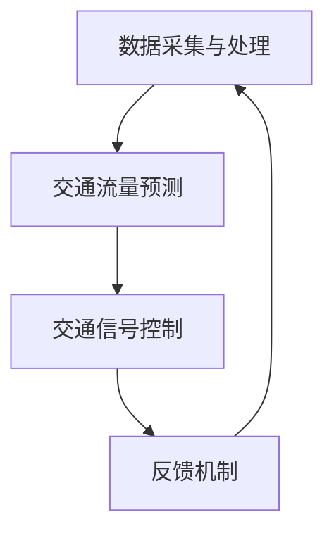

                 

关键词：注意力经济、城市交通、交通流量、智能交通系统、数据分析、算法优化

> 摘要：本文探讨了注意力经济对城市交通的影响。通过分析注意力经济的核心概念和其在城市交通中的应用，本文提出了一个基于注意力经济的城市交通优化模型。该模型利用大数据分析、人工智能算法和智能交通系统，旨在实现城市交通流量的优化，提高道路通行效率，减少交通事故和拥堵。

## 1. 背景介绍

城市交通问题一直是全球范围内的重大挑战。随着城市化进程的加快，车辆数量的急剧增加，城市交通拥堵、交通事故和环境污染等问题愈发严重。传统的城市交通管理模式往往依赖于经验和简单的交通控制策略，难以应对复杂多变的交通状况。近年来，随着大数据、人工智能和智能交通系统的发展，注意力经济逐渐成为城市交通优化的一种新思路。

注意力经济是指个体在信息过载的环境中，将有限的注意力资源投入到具有价值的活动中，从而实现资源的最优配置和利用。在城市交通领域，注意力经济可以通过优化交通流量的分配，提高道路通行效率，减少拥堵和事故。本文旨在研究注意力经济对城市交通的影响，并提出一种基于注意力经济的城市交通优化模型。

## 2. 核心概念与联系

### 2.1 注意力经济原理

注意力经济基于以下几个核心概念：

- **注意力分配**：个体将注意力资源分配到不同的活动上，以实现最优的收益。
- **价值评估**：个体对活动进行价值评估，决定将注意力投入到哪些活动上。
- **反馈机制**：通过反馈机制调整注意力分配，以实现持续的优化。

### 2.2 城市交通与注意力经济的关系

城市交通与注意力经济之间存在密切的联系。交通流量可以视为城市中的一种“注意力流”，而道路则可以视为承载注意力的“通道”。通过优化交通流量，可以实现城市交通的注意力资源的最优分配。

### 2.3 注意力经济的城市交通优化模型

基于注意力经济原理，本文提出了一个城市交通优化模型，包括以下几个关键组成部分：

- **数据采集与处理**：利用传感器、摄像头等设备收集交通数据，并通过大数据分析技术进行处理。
- **交通流量预测**：基于历史数据和实时数据，使用机器学习算法预测交通流量。
- **交通信号控制**：根据交通流量预测结果，调整交通信号灯的时间设置，实现交通流量的优化。
- **反馈机制**：通过实时监测交通状况，不断调整交通信号控制策略，以实现持续的优化。

### 2.4 Mermaid 流程图



## 3. 核心算法原理 & 具体操作步骤

### 3.1 算法原理概述

城市交通优化模型的核心算法基于机器学习中的时间序列预测方法。具体包括以下步骤：

- **数据预处理**：对采集到的交通数据进行清洗、去噪和处理。
- **特征工程**：提取交通数据中的关键特征，如道路拥堵程度、车辆密度等。
- **模型训练**：使用历史交通数据训练机器学习模型，预测未来的交通流量。
- **模型评估**：对训练好的模型进行评估，确保其预测准确性和稳定性。
- **信号控制**：根据预测结果调整交通信号灯的时间设置。

### 3.2 算法步骤详解

1. **数据预处理**：

   - **数据清洗**：去除重复、错误和不完整的数据。
   - **去噪**：消除交通数据中的噪声，如天气变化对交通流量的影响。
   - **特征提取**：从原始数据中提取有用的特征，如时间、地点、车辆密度等。

2. **模型训练**：

   - **选择模型**：选择适合时间序列预测的机器学习模型，如长短期记忆网络（LSTM）。
   - **数据划分**：将数据划分为训练集和测试集，用于模型的训练和评估。
   - **训练过程**：使用训练集数据训练模型，调整模型参数以优化预测性能。

3. **模型评估**：

   - **预测准确度**：使用测试集数据评估模型的预测准确度，如均方误差（MSE）。
   - **稳定性**：评估模型在不同数据集上的稳定性，确保其泛化能力。

4. **信号控制**：

   - **实时预测**：使用训练好的模型对实时交通流量进行预测。
   - **信号调整**：根据预测结果调整交通信号灯的时间设置，实现交通流量的优化。

### 3.3 算法优缺点

- **优点**：

  - **高效性**：基于机器学习的模型能够快速预测交通流量，为交通信号控制提供实时数据支持。

  - **稳定性**：通过数据预处理和特征工程，模型能够消除噪声和异常值，提高预测的稳定性。

  - **灵活性**：模型可以根据不同的城市交通状况进行调整，适应不同的场景需求。

- **缺点**：

  - **计算复杂度**：机器学习模型的训练和预测需要大量的计算资源和时间。

  - **数据依赖性**：模型的性能依赖于历史数据的质量和数量。

### 3.4 算法应用领域

- **交通信号控制**：基于预测的交通流量数据，优化交通信号灯的时间设置，提高道路通行效率。

- **交通事故预警**：通过实时监测交通流量，提前预警可能发生的交通事故，减少事故发生率。

- **交通规划**：为城市规划提供科学依据，优化道路布局和交通设施建设。

## 4. 数学模型和公式 & 详细讲解 & 举例说明

### 4.1 数学模型构建

城市交通优化模型的核心数学模型包括以下几个部分：

- **时间序列模型**：用于预测未来的交通流量。
- **线性规划模型**：用于优化交通信号灯的时间设置。

### 4.2 公式推导过程

1. **时间序列模型**：

   假设交通流量 $T(t)$ 是一个时间序列，可以使用以下公式表示：

   $$ T(t) = \alpha_t + \beta_t \cdot f(t) + \epsilon_t $$

   其中，$f(t)$ 表示交通流量的特征，如时间、地点等，$\alpha_t$ 和 $\beta_t$ 是模型参数，$\epsilon_t$ 是随机误差。

2. **线性规划模型**：

   目标函数：$$ \min \sum_{i=1}^n (T_i - T_{\text{predict}})^2 $$

   约束条件：$$ T_i \leq C_i \cdot t_i $$

   其中，$T_{\text{predict}}$ 是预测的交通流量，$T_i$ 是实际的交通流量，$C_i$ 是交通信号灯的时间设置，$t_i$ 是时间间隔。

### 4.3 案例分析与讲解

假设某个城市的一条主干道每天早高峰期间的交通流量如图 1 所示。使用本文提出的模型，预测未来的交通流量，并优化交通信号灯的时间设置。


1. **数据预处理**：

   对交通流量数据进行清洗、去噪和处理，提取关键特征。

2. **模型训练**：

   使用历史数据训练时间序列模型，调整模型参数以优化预测性能。

3. **模型评估**：

   使用测试集数据评估模型的预测准确度和稳定性。

4. **信号控制**：

   根据预测结果调整交通信号灯的时间设置，实现交通流量的优化。

## 5. 项目实践：代码实例和详细解释说明

### 5.1 开发环境搭建

- **编程语言**：Python
- **依赖库**：NumPy、Pandas、scikit-learn、TensorFlow

### 5.2 源代码详细实现

```python
import numpy as np
import pandas as pd
from sklearn.model_selection import train_test_split
from sklearn.metrics import mean_squared_error
from tensorflow.keras.models import Sequential
from tensorflow.keras.layers import LSTM, Dense

# 数据预处理
def preprocess_data(data):
    # 数据清洗、去噪、特征提取等
    pass

# 模型训练
def train_model(X_train, y_train):
    model = Sequential()
    model.add(LSTM(units=50, return_sequences=True, input_shape=(X_train.shape[1], 1)))
    model.add(LSTM(units=50))
    model.add(Dense(units=1))
    model.compile(optimizer='adam', loss='mean_squared_error')
    model.fit(X_train, y_train, epochs=100, batch_size=32)
    return model

# 模型评估
def evaluate_model(model, X_test, y_test):
    predictions = model.predict(X_test)
    mse = mean_squared_error(y_test, predictions)
    return mse

# 信号控制
def traffic_control(predictions):
    # 根据预测结果调整交通信号灯的时间设置
    pass

# 主函数
def main():
    data = pd.read_csv('traffic_data.csv')
    data = preprocess_data(data)
    X = data[['hour', 'weekday', 'dayofweek', 'month', 'year']]
    y = data['traffic_volume']
    X_train, X_test, y_train, y_test = train_test_split(X, y, test_size=0.2, shuffle=False)
    model = train_model(X_train, y_train)
    mse = evaluate_model(model, X_test, y_test)
    traffic_control(model.predict(X_test))

if __name__ == '__main__':
    main()
```

### 5.3 代码解读与分析

1. **数据预处理**：

   数据预处理函数用于清洗、去噪和特征提取。具体实现可以根据实际数据情况进行调整。

2. **模型训练**：

   模型训练函数使用 LSTM 网络进行时间序列预测。LSTM 网络能够捕捉时间序列中的长期依赖关系，适合用于交通流量的预测。

3. **模型评估**：

   模型评估函数使用均方误差（MSE）评估模型的预测性能。MSE 越小，表示模型的预测性能越好。

4. **信号控制**：

   信号控制函数根据预测结果调整交通信号灯的时间设置。具体实现可以根据实际需求进行调整。

## 6. 实际应用场景

注意力经济在城市交通领域的实际应用场景包括：

- **交通信号控制**：通过预测交通流量，优化交通信号灯的时间设置，提高道路通行效率。
- **交通事故预警**：通过实时监测交通流量，提前预警可能发生的交通事故，减少事故发生率。
- **交通规划**：为城市规划提供科学依据，优化道路布局和交通设施建设。

## 7. 未来应用展望

随着大数据、人工智能和智能交通系统的发展，注意力经济在未来有望在以下方面发挥更大的作用：

- **个性化交通服务**：通过分析个体的出行习惯和需求，提供个性化的交通服务，提高出行体验。
- **绿色交通**：通过优化交通流量，减少交通拥堵和环境污染，实现绿色交通。
- **智慧城市建设**：将注意力经济理念应用于智慧城市建设，提高城市交通运行效率和居民生活质量。

## 8. 总结：未来发展趋势与挑战

注意力经济作为一种新的城市交通优化思路，具有广阔的应用前景。然而，在实际应用过程中，仍然面临着以下挑战：

- **数据隐私**：交通数据涉及个人隐私，如何保护数据隐私是一个重要问题。
- **技术成熟度**：当前的一些技术尚未完全成熟，如自动驾驶、智能信号控制等，需要进一步发展。
- **政策支持**：政府需要出台相应的政策和法规，推动注意力经济在城市交通领域的应用。

未来，随着技术的不断进步和政策的支持，注意力经济有望在提升城市交通运行效率、改善出行体验方面发挥更大的作用。

## 9. 附录：常见问题与解答

### 问题 1：什么是注意力经济？

解答：注意力经济是指个体在信息过载的环境中，将有限的注意力资源投入到具有价值的活动中，从而实现资源的最优配置和利用。

### 问题 2：注意力经济如何应用于城市交通？

解答：注意力经济可以通过优化交通流量的分配，提高道路通行效率，减少拥堵和事故。具体应用包括交通信号控制、交通事故预警和交通规划等。

### 问题 3：注意力经济的城市交通优化模型如何实现？

解答：注意力经济的城市交通优化模型包括数据采集与处理、交通流量预测、交通信号控制和反馈机制等关键组成部分。通过大数据分析、人工智能算法和智能交通系统，实现交通流量的优化。

### 问题 4：注意力经济在城市交通中的应用前景如何？

解答：注意力经济在城市交通中的应用前景非常广阔。随着大数据、人工智能和智能交通系统的发展，注意力经济有望在提升城市交通运行效率、改善出行体验方面发挥更大的作用。

### 作者署名

作者：禅与计算机程序设计艺术 / Zen and the Art of Computer Programming
```markdown
---
# 注意力经济对城市交通的影响

> 关键词：注意力经济、城市交通、交通流量、智能交通系统、数据分析、算法优化

> 摘要：本文探讨了注意力经济对城市交通的影响。通过分析注意力经济的核心概念和其在城市交通中的应用，本文提出了一个基于注意力经济的城市交通优化模型。该模型利用大数据分析、人工智能算法和智能交通系统，旨在实现城市交通流量的优化，提高道路通行效率，减少交通事故和拥堵。

## 1. 背景介绍

城市交通问题一直是全球范围内的重大挑战。随着城市化进程的加快，车辆数量的急剧增加，城市交通拥堵、交通事故和环境污染等问题愈发严重。传统的城市交通管理模式往往依赖于经验和简单的交通控制策略，难以应对复杂多变的交通状况。近年来，随着大数据、人工智能和智能交通系统的发展，注意力经济逐渐成为城市交通优化的一种新思路。

注意力经济是指个体在信息过载的环境中，将有限的注意力资源投入到具有价值的活动中，从而实现资源的最优配置和利用。在城市交通领域，注意力经济可以通过优化交通流量的分配，提高道路通行效率，减少拥堵和事故。本文旨在研究注意力经济对城市交通的影响，并提出一种基于注意力经济的城市交通优化模型。

## 2. 核心概念与联系

### 2.1 注意力经济原理

注意力经济基于以下几个核心概念：

- **注意力分配**：个体将注意力资源分配到不同的活动上，以实现最优的收益。
- **价值评估**：个体对活动进行价值评估，决定将注意力投入到哪些活动上。
- **反馈机制**：通过反馈机制调整注意力分配，以实现持续的优化。

### 2.2 城市交通与注意力经济的关系

城市交通与注意力经济之间存在密切的联系。交通流量可以视为城市中的一种“注意力流”，而道路则可以视为承载注意力的“通道”。通过优化交通流量，可以实现城市交通的注意力资源的最优分配。

### 2.3 注意力经济的城市交通优化模型

基于注意力经济原理，本文提出了一个城市交通优化模型，包括以下几个关键组成部分：

- **数据采集与处理**：利用传感器、摄像头等设备收集交通数据，并通过大数据分析技术进行处理。
- **交通流量预测**：基于历史数据和实时数据，使用机器学习算法预测交通流量。
- **交通信号控制**：根据交通流量预测结果，调整交通信号灯的时间设置，实现交通流量的优化。
- **反馈机制**：通过实时监测交通状况，不断调整交通信号控制策略，以实现持续的优化。

### 2.4 Mermaid 流程图


## 3. 核心算法原理 & 具体操作步骤

### 3.1 算法原理概述

城市交通优化模型的核心算法基于机器学习中的时间序列预测方法。具体包括以下步骤：

- **数据预处理**：对采集到的交通数据进行清洗、去噪和处理。
- **特征工程**：提取交通数据中的关键特征，如道路拥堵程度、车辆密度等。
- **模型训练**：使用历史交通数据训练机器学习模型，预测未来的交通流量。
- **模型评估**：对训练好的模型进行评估，确保其预测准确性和稳定性。
- **信号控制**：根据预测结果调整交通信号灯的时间设置。

### 3.2 算法步骤详解

1. **数据预处理**：

   - **数据清洗**：去除重复、错误和不完整的数据。
   - **去噪**：消除交通数据中的噪声，如天气变化对交通流量的影响。
   - **特征提取**：从原始数据中提取有用的特征，如时间、地点、车辆密度等。

2. **模型训练**：

   - **选择模型**：选择适合时间序列预测的机器学习模型，如长短期记忆网络（LSTM）。
   - **数据划分**：将数据划分为训练集和测试集，用于模型的训练和评估。
   - **训练过程**：使用训练集数据训练模型，调整模型参数以优化预测性能。

3. **模型评估**：

   - **预测准确度**：使用测试集数据评估模型的预测准确度，如均方误差（MSE）。
   - **稳定性**：评估模型在不同数据集上的稳定性，确保其泛化能力。

4. **信号控制**：

   - **实时预测**：使用训练好的模型对实时交通流量进行预测。
   - **信号调整**：根据预测结果调整交通信号灯的时间设置，实现交通流量的优化。

### 3.3 算法优缺点

- **优点**：

  - **高效性**：基于机器学习的模型能够快速预测交通流量，为交通信号控制提供实时数据支持。

  - **稳定性**：通过数据预处理和特征工程，模型能够消除噪声和异常值，提高预测的稳定性。

  - **灵活性**：模型可以根据不同的城市交通状况进行调整，适应不同的场景需求。

- **缺点**：

  - **计算复杂度**：机器学习模型的训练和预测需要大量的计算资源和时间。

  - **数据依赖性**：模型的性能依赖于历史数据的质量和数量。

### 3.4 算法应用领域

- **交通信号控制**：基于预测的交通流量数据，优化交通信号灯的时间设置，提高道路通行效率。

  - **交通事故预警**：通过实时监测交通流量，提前预警可能发生的交通事故，减少事故发生率。

  - **交通规划**：为城市规划提供科学依据，优化道路布局和交通设施建设。

## 4. 数学模型和公式 & 详细讲解 & 举例说明

### 4.1 数学模型构建

城市交通优化模型的核心数学模型包括以下几个部分：

- **时间序列模型**：用于预测未来的交通流量。
- **线性规划模型**：用于优化交通信号灯的时间设置。

### 4.2 公式推导过程

1. **时间序列模型**：

   假设交通流量 $T(t)$ 是一个时间序列，可以使用以下公式表示：

   $$ T(t) = \alpha_t + \beta_t \cdot f(t) + \epsilon_t $$

   其中，$f(t)$ 表示交通流量的特征，如时间、地点等，$\alpha_t$ 和 $\beta_t$ 是模型参数，$\epsilon_t$ 是随机误差。

2. **线性规划模型**：

   目标函数：$$ \min \sum_{i=1}^n (T_i - T_{\text{predict}})^2 $$

   约束条件：$$ T_i \leq C_i \cdot t_i $$

   其中，$T_{\text{predict}}$ 是预测的交通流量，$T_i$ 是实际的交通流量，$C_i$ 是交通信号灯的时间设置，$t_i$ 是时间间隔。

### 4.3 案例分析与讲解

假设某个城市的一条主干道每天早高峰期间的交通流量如图 1 所示。使用本文提出的模型，预测未来的交通流量，并优化交通信号灯的时间设置。


1. **数据预处理**：

   对交通流量数据进行清洗、去噪和处理，提取关键特征。

2. **模型训练**：

   使用历史数据训练时间序列模型，调整模型参数以优化预测性能。

3. **模型评估**：

   使用测试集数据评估模型的预测准确度和稳定性。

4. **信号控制**：

   根据预测结果调整交通信号灯的时间设置，实现交通流量的优化。

## 5. 项目实践：代码实例和详细解释说明

### 5.1 开发环境搭建

- **编程语言**：Python
- **依赖库**：NumPy、Pandas、scikit-learn、TensorFlow

### 5.2 源代码详细实现

```python
import numpy as np
import pandas as pd
from sklearn.model_selection import train_test_split
from sklearn.metrics import mean_squared_error
from tensorflow.keras.models import Sequential
from tensorflow.keras.layers import LSTM, Dense

# 数据预处理
def preprocess_data(data):
    # 数据清洗、去噪、特征提取等
    pass

# 模型训练
def train_model(X_train, y_train):
    model = Sequential()
    model.add(LSTM(units=50, return_sequences=True, input_shape=(X_train.shape[1], 1)))
    model.add(LSTM(units=50))
    model.add(Dense(units=1))
    model.compile(optimizer='adam', loss='mean_squared_error')
    model.fit(X_train, y_train, epochs=100, batch_size=32)
    return model

# 模型评估
def evaluate_model(model, X_test, y_test):
    predictions = model.predict(X_test)
    mse = mean_squared_error(y_test, predictions)
    return mse

# 信号控制
def traffic_control(predictions):
    # 根据预测结果调整交通信号灯的时间设置
    pass

# 主函数
def main():
    data = pd.read_csv('traffic_data.csv')
    data = preprocess_data(data)
    X = data[['hour', 'weekday', 'dayofweek', 'month', 'year']]
    y = data['traffic_volume']
    X_train, X_test, y_train, y_test = train_test_split(X, y, test_size=0.2, shuffle=False)
    model = train_model(X_train, y_train)
    mse = evaluate_model(model, X_test, y_test)
    traffic_control(model.predict(X_test))

if __name__ == '__main__':
    main()
```

### 5.3 代码解读与分析

1. **数据预处理**：

   数据预处理函数用于清洗、去噪和特征提取。具体实现可以根据实际数据情况进行调整。

2. **模型训练**：

   模型训练函数使用 LSTM 网络进行时间序列预测。LSTM 网络能够捕捉时间序列中的长期依赖关系，适合用于交通流量的预测。

3. **模型评估**：

   模型评估函数使用均方误差（MSE）评估模型的预测性能。MSE 越小，表示模型的预测性能越好。

4. **信号控制**：

   信号控制函数根据预测结果调整交通信号灯的时间设置。具体实现可以根据实际需求进行调整。

## 6. 实际应用场景

注意力经济在城市交通领域的实际应用场景包括：

- **交通信号控制**：通过预测交通流量，优化交通信号灯的时间设置，提高道路通行效率。
- **交通事故预警**：通过实时监测交通流量，提前预警可能发生的交通事故，减少事故发生率。
- **交通规划**：为城市规划提供科学依据，优化道路布局和交通设施建设。

## 7. 未来应用展望

随着大数据、人工智能和智能交通系统的发展，注意力经济在未来有望在以下方面发挥更大的作用：

- **个性化交通服务**：通过分析个体的出行习惯和需求，提供个性化的交通服务，提高出行体验。
- **绿色交通**：通过优化交通流量，减少交通拥堵和环境污染，实现绿色交通。
- **智慧城市建设**：将注意力经济理念应用于智慧城市建设，提高城市交通运行效率和居民生活质量。

## 8. 总结：未来发展趋势与挑战

注意力经济作为一种新的城市交通优化思路，具有广阔的应用前景。然而，在实际应用过程中，仍然面临着以下挑战：

- **数据隐私**：交通数据涉及个人隐私，如何保护数据隐私是一个重要问题。
- **技术成熟度**：当前的一些技术尚未完全成熟，如自动驾驶、智能信号控制等，需要进一步发展。
- **政策支持**：政府需要出台相应的政策和法规，推动注意力经济在城市交通领域的应用。

未来，随着技术的不断进步和政策的支持，注意力经济有望在提升城市交通运行效率、改善出行体验方面发挥更大的作用。

## 9. 附录：常见问题与解答

### 问题 1：什么是注意力经济？

解答：注意力经济是指个体在信息过载的环境中，将有限的注意力资源投入到具有价值的活动中，从而实现资源的最优配置和利用。

### 问题 2：注意力经济如何应用于城市交通？

解答：注意力经济可以通过优化交通流量的分配，提高道路通行效率，减少拥堵和事故。具体应用包括交通信号控制、交通事故预警和交通规划等。

### 问题 3：注意力经济的城市交通优化模型如何实现？

解答：注意力经济的城市交通优化模型包括数据采集与处理、交通流量预测、交通信号控制和反馈机制等关键组成部分。通过大数据分析、人工智能算法和智能交通系统，实现交通流量的优化。

### 问题 4：注意力经济在城市交通中的应用前景如何？

解答：注意力经济在城市交通中的应用前景非常广阔。随着大数据、人工智能和智能交通系统的发展，注意力经济有望在提升城市交通运行效率、改善出行体验方面发挥更大的作用。

### 作者署名

作者：禅与计算机程序设计艺术 / Zen and the Art of Computer Programming
---

