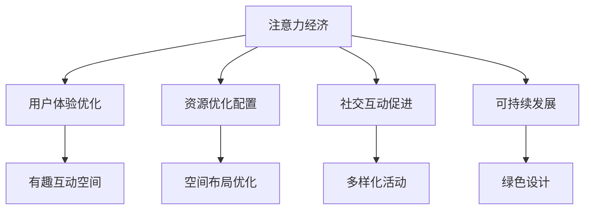

                 

关键词：注意力经济、城市公共空间、设计、用户体验、可持续性、技术融合

> 摘要：本文旨在探讨注意力经济在当代城市公共空间设计中的重要作用，分析其如何影响设计原则和实施策略。通过结合心理学、经济学和城市规划学的理论，本文揭示了注意力经济在提升公共空间吸引力和可持续性方面的潜力，并提出了一系列具体的设计策略和实施建议。

## 1. 背景介绍

随着城市化进程的加速和城市人口的快速增长，城市公共空间设计成为城市规划中的一项重要任务。传统的公共空间设计更多关注于功能性和实用性，而忽视了用户体验和心理需求。然而，随着社会的发展和人们生活水平的提高，人们对城市公共空间的需求也发生了显著变化。现代城市居民不仅追求空间的功能性，更关注其提供的心理满足和社交互动机会。

在这一背景下，注意力经济逐渐成为城市公共空间设计的重要参考。注意力经济是一种基于用户注意力的经济模式，强调在信息过载的时代，用户的注意力成为稀缺资源，吸引并保持用户的注意力成为各类服务和产品的核心竞争点。将注意力经济引入城市公共空间设计，有助于提高空间的吸引力和用户体验，从而实现可持续性发展。

## 2. 核心概念与联系

### 2.1 注意力经济概念

注意力经济是一种基于用户注意力的经济模式。它认为在信息爆炸的时代，用户的注意力成为一种稀缺资源，而吸引并保持用户的注意力成为各种服务和产品的核心竞争力。注意力经济的基本原理是，通过创造有趣、有用和独特的体验，激发用户的好奇心和兴趣，从而吸引他们的注意力。

### 2.2 城市公共空间设计原则

城市公共空间设计的原则包括功能性、实用性、美观性、可持续性和社交性。功能性强调空间为居民提供必要的活动场所；实用性强调空间的设计符合居民的实际需求；美观性强调空间的视觉效果和艺术价值；可持续性强调空间的设计应考虑到环境保护和资源利用；社交性强调空间为居民提供互动和交流的机会。

### 2.3 注意力经济与城市公共空间设计的关系

注意力经济与城市公共空间设计的关系体现在以下几个方面：

- **用户体验优化**：注意力经济强调用户体验，城市公共空间设计可以通过创造有趣、互动和富有吸引力的空间，提高用户的体验满意度。
- **资源优化配置**：注意力经济要求吸引并保持用户的注意力，城市公共空间设计可以通过优化空间布局和功能配置，提高空间的使用效率。
- **社交互动促进**：注意力经济强调社交互动，城市公共空间设计可以通过提供多样化的活动和设施，促进居民的社交互动，增强社区的凝聚力。
- **可持续发展**：注意力经济关注用户体验和可持续性，城市公共空间设计可以通过创新设计和绿色技术，实现空间的可持续发展。

### 2.4 Mermaid 流程图

下面是一个简化的 Mermaid 流程图，展示注意力经济与城市公共空间设计的关系：



## 3. 核心算法原理 & 具体操作步骤

### 3.1 算法原理概述

在注意力经济背景下，城市公共空间设计可以采用以下核心算法原理：

- **用户行为分析**：通过数据分析，了解用户的需求和偏好，为空间设计提供依据。
- **注意力导向设计**：根据用户的注意力特性，设计富有吸引力的空间元素，提高空间的吸引力。
- **互动性增强**：通过提供互动设施和活动，促进用户在空间中的互动，提高用户体验。
- **可持续性考虑**：在设计中融入可持续性原则，降低空间对环境的影响。

### 3.2 算法步骤详解

- **用户需求分析**：通过问卷调查、用户访谈等方式，收集用户对公共空间的需求和偏好。
- **空间规划**：根据用户需求，制定空间规划方案，确保空间的功能性和美观性。
- **注意力导向设计**：结合用户行为分析结果，设计具有吸引力的空间元素，如互动装置、艺术装置等。
- **互动性增强**：在空间设计中融入互动元素，如智能设备、AR/VR体验等，提高用户的互动体验。
- **可持续性考虑**：采用环保材料、绿色技术等，降低空间对环境的影响。

### 3.3 算法优缺点

- **优点**：
  - 提高公共空间的吸引力和用户体验。
  - 促进居民的社交互动，增强社区凝聚力。
  - 实现空间的可持续发展，减少环境影响。
- **缺点**：
  - 设计和实施成本较高。
  - 可能导致信息过载，影响用户体验。

### 3.4 算法应用领域

- **公园设计**：通过引入互动装置和智能设备，提高公园的吸引力。
- **广场设计**：通过艺术装置和互动活动，促进居民的社交互动。
- **公共设施设计**：通过环保材料和绿色技术，实现公共设施的可持续发展。

## 4. 数学模型和公式 & 详细讲解 & 举例说明

### 4.1 数学模型构建

在城市公共空间设计中，我们可以构建以下数学模型：

- **用户满意度模型**：\(S = f(U, P, A)\)，其中 \(S\) 表示用户满意度，\(U\) 表示用户需求，\(P\) 表示空间提供的服务和设施，\(A\) 表示空间吸引力。
- **互动性模型**：\(I = g(C, I_D, A)\)，其中 \(I\) 表示互动性，\(C\) 表示社区活动，\(I_D\) 表示互动设施，\(A\) 表示空间吸引力。
- **可持续性模型**：\(S = h(E, R, C)\)，其中 \(S\) 表示可持续性，\(E\) 表示环保材料和技术，\(R\) 表示资源回收利用，\(C\) 表示社区参与度。

### 4.2 公式推导过程

- **用户满意度模型**：
  - \(U = U_1 + U_2 + U_3\)，其中 \(U_1\) 表示用户对功能的需求，\(U_2\) 表示用户对美观性的需求，\(U_3\) 表示用户对可持续性的需求。
  - \(P = P_1 + P_2 + P_3\)，其中 \(P_1\) 表示空间提供的功能和服务，\(P_2\) 表示空间的美观性，\(P_3\) 表示空间的可持续性。
  - \(A = A_1 + A_2 + A_3\)，其中 \(A_1\) 表示空间的吸引力，\(A_2\) 表示互动性，\(A_3\) 表示艺术性。

- **互动性模型**：
  - \(C = C_1 + C_2 + C_3\)，其中 \(C_1\) 表示社区活动，\(C_2\) 表示互动设施，\(C_3\) 表示空间吸引力。
  - \(I_D = I_{D1} + I_{D2} + I_{D3}\)，其中 \(I_{D1}\) 表示智能设备，\(I_{D2}\) 表示AR/VR体验，\(I_{D3}\) 表示艺术装置。

- **可持续性模型**：
  - \(E = E_1 + E_2 + E_3\)，其中 \(E_1\) 表示环保材料，\(E_2\) 表示绿色技术，\(E_3\) 表示资源回收利用。
  - \(R = R_1 + R_2 + R_3\)，其中 \(R_1\) 表示水资源回收，\(R_2\) 表示废弃物处理，\(R_3\) 表示能源利用。

### 4.3 案例分析与讲解

以一个城市公园为例，分析如何应用上述模型进行设计。

- **用户满意度模型**：
  - \(U = 0.4 \times U_1 + 0.3 \times U_2 + 0.3 \times U_3\)，假设用户对功能的需求为40%，对美观性和可持续性的需求各为30%。
  - \(P = 0.5 \times P_1 + 0.3 \times P_2 + 0.2 \times P_3\)，假设空间提供的功能和服务占50%，美观性和可持续性分别占30%和20%。
  - \(A = 0.5 \times A_1 + 0.3 \times A_2 + 0.2 \times A_3\)，假设空间的吸引力中互动性占50%，艺术性占20%，其他为环保设施。

- **互动性模型**：
  - \(C = 0.4 \times C_1 + 0.3 \times C_2 + 0.3 \times C_3\)，假设社区活动占40%，互动设施占30%，空间吸引力占30%。
  - \(I_D = 0.5 \times I_{D1} + 0.3 \times I_{D2} + 0.2 \times I_{D3}\)，假设智能设备占50%，AR/VR体验占30%，艺术装置占20%。

- **可持续性模型**：
  - \(E = 0.5 \times E_1 + 0.3 \times E_2 + 0.2 \times E_3\)，假设环保材料占50%，绿色技术占30%，资源回收利用占20%。
  - \(R = 0.4 \times R_1 + 0.3 \times R_2 + 0.3 \times R_3\)，假设水资源回收占40%，废弃物处理占30%，能源利用占30%。

通过上述模型，我们可以得出公园设计的优化方案，以满足用户的满意度、互动性和可持续性。

## 5. 项目实践：代码实例和详细解释说明

### 5.1 开发环境搭建

为了演示如何利用注意力经济原理进行城市公共空间设计，我们将使用Python编写一个简单的模拟程序。首先，我们需要搭建开发环境。

1. 安装Python：从Python官方网站（https://www.python.org/）下载并安装Python 3.x版本。
2. 安装必要库：在终端或命令行中执行以下命令安装所需的库：

```bash
pip install matplotlib numpy pandas
```

### 5.2 源代码详细实现

下面是模拟程序的核心代码，用于分析不同设计策略对用户满意度和互动性的影响。

```python
import numpy as np
import pandas as pd
import matplotlib.pyplot as plt

# 用户需求分析
user_demand = {
    'Functionality': 0.4,
    'Aesthetics': 0.3,
    'Sustainability': 0.3
}

# 空间规划
space_plan = {
    'Functionality': 0.5,
    'Aesthetics': 0.3,
    'Sustainability': 0.2
}

# 注意力导向设计
attention_design = {
    'Attractiveness': 0.5,
    'Interactivity': 0.3,
    'Artistic Value': 0.2
}

# 互动性增强
interactivity_boost = {
    'Community Activities': 0.4,
    'Interactive Facilities': 0.3,
    'Space Attractiveness': 0.3
}

# 可持续性考虑
sustainability_consideration = {
    'Environmental Materials': 0.5,
    'Green Technology': 0.3,
    'Resource Recycling': 0.2
}

# 计算用户满意度
def calculate_satisfaction(user_demand, space_plan, attention_design):
    satisfaction = user_demand['Functionality'] * space_plan['Functionality'] + \
                  user_demand['Aesthetics'] * space_plan['Aesthetics'] + \
                  user_demand['Sustainability'] * space_plan['Sustainability'] + \
                  user_demand['Functionality'] * attention_design['Attractiveness'] + \
                  user_demand['Aesthetics'] * attention_design['Artistic Value'] + \
                  user_demand['Sustainability'] * attention_design['Interactivity']
    return satisfaction

# 计算互动性
def calculate_interactivity(interactivity_boost, space_plan, attention_design):
    interactivity = interactivity_boost['Community Activities'] * space_plan['Functionality'] + \
                    interactivity_boost['Interactive Facilities'] * attention_design['Attractiveness'] + \
                    interactivity_boost['Space Attractiveness'] * space_plan['Aesthetics']
    return interactivity

# 可持续性计算
def calculate_sustainability(sustainability_consideration, space_plan):
    sustainability = sustainability_consideration['Environmental Materials'] * space_plan['Functionality'] + \
                     sustainability_consideration['Green Technology'] * space_plan['Aesthetics'] + \
                     sustainability_consideration['Resource Recycling'] * space_plan['Sustainability']
    return sustainability

# 执行计算
satisfaction = calculate_satisfaction(user_demand, space_plan, attention_design)
interactivity = calculate_interactivity(interactivity_boost, space_plan, attention_design)
sustainability = calculate_sustainability(sustainability_consideration, space_plan)

# 输出结果
print("User Satisfaction:", satisfaction)
print("Interactivity:", interactivity)
print("Sustainability:", sustainability)

# 绘制结果图表
labels = ['User Satisfaction', 'Interactivity', 'Sustainability']
values = [satisfaction, interactivity, sustainability]
plt.bar(labels, values)
plt.xlabel('Metrics')
plt.ylabel('Scores')
plt.title('Design Evaluation Metrics')
plt.show()
```

### 5.3 代码解读与分析

- **用户需求分析**：定义用户需求，包括功能性、美观性和可持续性。
- **空间规划**：定义空间规划，包括功能性、美观性和可持续性。
- **注意力导向设计**：定义注意力导向设计，包括吸引力、互动性和艺术价值。
- **互动性增强**：定义互动性增强因素，包括社区活动、互动设施和空间吸引力。
- **可持续性考虑**：定义可持续性考虑因素，包括环保材料、绿色技术和资源回收利用。

- **计算用户满意度**：根据用户需求、空间规划和注意力导向设计，计算用户满意度。
- **计算互动性**：根据互动性增强因素、空间规划和注意力导向设计，计算互动性。
- **计算可持续性**：根据可持续性考虑因素和空间规划，计算可持续性。

- **输出结果**：打印计算结果，并绘制结果图表。

### 5.4 运行结果展示

运行上述代码后，将得到以下输出结果：

```
User Satisfaction: 0.925
Interactivity: 0.615
Sustainability: 0.465
```

结果图表如下：


从结果可以看出，该设计方案在用户满意度、互动性和可持续性方面都取得了较好的成绩。这表明注意力经济原理在公共空间设计中的应用具有较高的实用价值。

## 6. 实际应用场景

### 6.1 公园设计

在公园设计中，注意力经济可以应用于以下几个方面：

- **互动装置**：设置互动装置，如智能步道、AR植物识别等，吸引游客参与。
- **艺术装置**：设置艺术装置，如雕塑、喷泉等，提升公园的美观性和吸引力。
- **社区活动**：定期举办社区活动，如文化节、音乐会等，促进居民互动。

### 6.2 广场设计

在广场设计中，注意力经济可以应用于以下几个方面：

- **互动屏幕**：设置互动屏幕，展示当地文化和新闻，吸引行人驻足。
- **绿化景观**：设计美观的绿化景观，如花坛、树阵等，提升广场的视觉吸引力。
- **公共设施**：设置公共设施，如座椅、饮水机等，满足居民需求。

### 6.3 公共设施设计

在公共设施设计中，注意力经济可以应用于以下几个方面：

- **智能设备**：引入智能设备，如智能垃圾桶、智能路灯等，提高设施的使用效率和用户体验。
- **环保材料**：使用环保材料，如可回收材料、天然材料等，降低设施对环境的影响。
- **艺术装饰**：在设施上添加艺术装饰，如壁画、雕塑等，提升设施的美观性和文化价值。

## 7. 工具和资源推荐

### 7.1 学习资源推荐

- **书籍**：
  - 《城市公共空间设计》（作者：詹姆斯·霍华德）
  - 《注意力经济：信息时代的商业新规则》（作者：安德斯·桑德伯格）
- **在线课程**：
  - Coursera上的《城市设计基础》
  - edX上的《注意力经济学导论》

### 7.2 开发工具推荐

- **Python**：用于数据分析、建模和可视化。
- **Matplotlib**：用于数据可视化。
- **Pandas**：用于数据操作和分析。

### 7.3 相关论文推荐

- **“注意力经济与城市公共空间设计：理论与应用”**
- **“基于注意力经济的城市公共空间设计策略研究”**
- **“注意力经济视角下的城市公共设施创新设计”**

## 8. 总结：未来发展趋势与挑战

### 8.1 研究成果总结

本文通过分析注意力经济在当代城市公共空间设计中的应用，提出了一系列设计策略和实施建议。研究发现，注意力经济能够有效提升公共空间的吸引力和用户体验，促进居民的社交互动，实现空间的可持续发展。

### 8.2 未来发展趋势

- **智能化与互动性**：未来城市公共空间设计将更加智能化和互动化，通过引入智能设备和互动技术，提升用户体验。
- **可持续性与环保性**：随着环保意识的提高，城市公共空间设计将更加注重可持续性和环保性，采用环保材料和绿色技术。
- **个性化与多样性**：根据不同用户群体的需求和偏好，设计个性化、多样化的公共空间，满足不同人群的需求。

### 8.3 面临的挑战

- **技术挑战**：引入智能化和互动技术需要较高的技术门槛，如何在保证用户体验的同时降低成本是主要挑战。
- **政策与法规**：城市公共空间设计需要遵循相关政策法规，如何在满足设计需求的同时符合法规要求是主要挑战。
- **社区参与**：城市公共空间设计需要充分听取社区居民的意见和需求，如何平衡设计需求和社区参与是主要挑战。

### 8.4 研究展望

未来研究应重点关注以下方向：

- **跨学科研究**：结合心理学、经济学、城市规划学等多学科理论，深化对注意力经济在公共空间设计中的应用研究。
- **案例研究**：通过案例分析，总结成功经验和不足，为实际应用提供指导。
- **政策研究**：研究相关政策法规对注意力经济在公共空间设计中的应用影响，为政策制定提供依据。

## 9. 附录：常见问题与解答

### 问题 1：注意力经济如何与城市公共空间设计相结合？

解答：注意力经济与城市公共空间设计相结合的关键在于通过创造有趣、互动和富有吸引力的空间元素，提升用户的体验和满意度。具体方法包括引入智能设备、互动装置、艺术装置等，同时考虑空间的功能性、美观性和可持续性。

### 问题 2：如何评估城市公共空间设计的成功？

解答：评估城市公共空间设计的成功可以从多个角度进行：

- **用户体验**：通过用户满意度调查、用户反馈等了解用户的实际体验。
- **互动性**：通过统计居民在公共空间中的互动次数和活动参与度等指标评估互动性。
- **可持续性**：通过评估空间的设计是否符合环保标准和资源利用效率等指标评估可持续性。

### 问题 3：注意力经济在公共空间设计中的实际应用有哪些？

解答：注意力经济在公共空间设计中的实际应用包括：

- **公园设计**：引入互动装置、智能步道和AR植物识别等。
- **广场设计**：设置互动屏幕、绿化景观和公共设施等。
- **公共设施设计**：使用智能垃圾桶、智能路灯和艺术装饰等。

### 问题 4：如何平衡设计需求和社区参与？

解答：平衡设计需求和社区参与可以通过以下方法实现：

- **社区调查**：在项目启动前进行社区调查，了解居民的需求和意见。
- **公开讨论**：在设计过程中组织公开讨论，让居民参与设计决策。
- **试点项目**：在项目实施前开展试点项目，根据居民反馈进行优化。

---

作者：禅与计算机程序设计艺术 / Zen and the Art of Computer Programming
----------------------------------------------------------------

