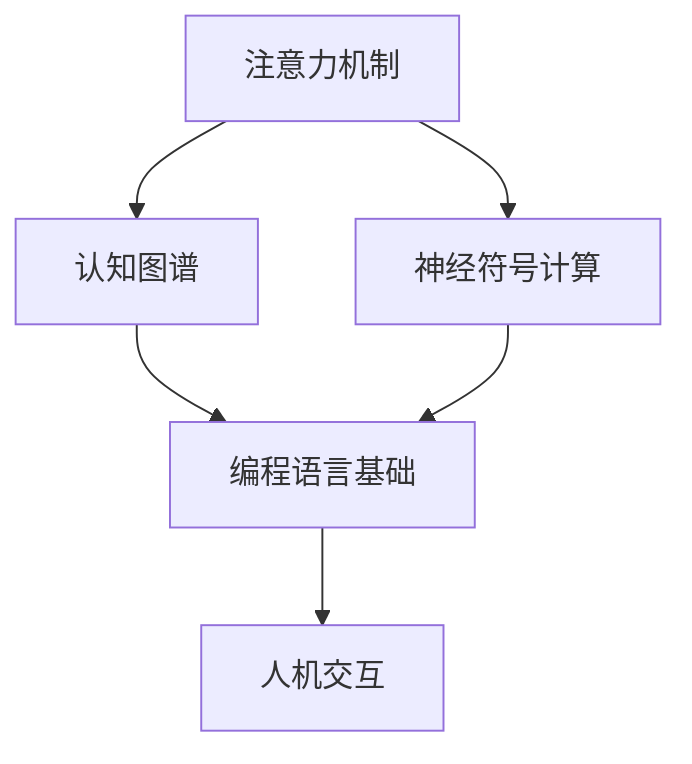

                 

在当今这个数据驱动的时代，人工智能（AI）技术正以前所未有的速度发展。从自动驾驶汽车到智能家居，从医疗诊断到金融服务，AI技术已经渗透到了我们日常生活的方方面面。然而，随着AI应用的日益广泛，如何更有效地与人类进行交互，提高AI系统的理解和决策能力，成为了一个亟待解决的问题。注意力编程语言正是为了应对这一挑战而诞生的。

## 关键词

- **注意力编程语言**
- **AI认知模式**
- **认知图谱**
- **神经符号计算**
- **人机交互**

## 摘要

本文将探讨注意力编程语言的概念、核心原理和架构，以及其在AI认知模式开发中的应用。我们将首先介绍注意力机制的基本概念，然后深入探讨注意力编程语言的数学模型、算法原理，并通过实际项目案例来展示其应用效果。最后，我们将对注意力编程语言的未来发展趋势和应用前景进行展望。

## 1. 背景介绍

### 1.1 注意力机制

注意力机制是人工智能领域中一个重要的概念，它起源于神经科学的研究。在人类大脑中，注意力是一种资源分配机制，用于处理大量的感官信息。在计算模型中，注意力机制被用来在给定的时间内对不同的输入信息进行权重分配，从而提高信息处理的效率和准确性。例如，在图像识别任务中，注意力机制可以帮助模型关注图像中的关键区域，从而提高识别的准确性。

### 1.2 人工智能的发展

随着深度学习技术的兴起，人工智能（AI）在图像识别、自然语言处理、推荐系统等领域取得了显著的成果。然而，传统的AI系统在处理复杂任务时，仍然面临着许多挑战。例如，如何从大量的数据中提取出有用的信息？如何理解并生成自然语言？如何进行有效的决策？注意力编程语言提供了一种新的解决方案，它通过模拟人类的认知过程，提高AI系统的理解和决策能力。

### 1.3 注意力编程语言的诞生

注意力编程语言是一种新型的编程范式，它将注意力机制引入到编程语言中，使得开发者可以更直观地构建和优化AI系统。这种语言不仅提供了丰富的语法和工具，还通过模拟人类的认知过程，提高了AI系统的理解能力和决策效率。注意力编程语言的诞生，标志着人工智能技术进入了一个新的发展阶段。

## 2. 核心概念与联系

### 2.1 核心概念

#### 注意力机制

注意力机制是注意力编程语言的核心概念。它通过在处理信息时对不同的输入进行权重分配，从而提高了信息处理的效率和准确性。注意力机制可以分为三种类型：软注意力、硬注意力和混合注意力。

#### 认知图谱

认知图谱是一种用于表示知识结构和关系的图形化工具。它可以帮助我们理解复杂的信息，并快速定位相关的知识点。在注意力编程语言中，认知图谱用于表示AI系统的知识库和推理规则。

#### 神经符号计算

神经符号计算是将神经网络和符号逻辑相结合的一种方法。它通过模拟人类大脑的思考过程，实现了对复杂问题的求解。在注意力编程语言中，神经符号计算用于实现AI系统的推理和决策。

### 2.2 架构

#### 编程语言基础

注意力编程语言是基于现有编程语言（如Python、Java等）的扩展。它通过引入注意力机制和认知图谱，提供了更直观和高效的编程方式。

#### 神经网络与符号逻辑的结合

在注意力编程语言中，神经网络和符号逻辑被有机结合在一起。神经网络用于处理和提取信息，符号逻辑用于推理和决策。这种结合使得AI系统既能够处理复杂的数据，又能够进行有效的推理和决策。

#### 人机交互

注意力编程语言通过提供直观的编程界面和工具，使得开发者可以更轻松地与AI系统进行交互。这种交互方式不仅提高了开发效率，还使得AI系统更加智能和人性化。

### 2.3 Mermaid 流程图



## 3. 核心算法原理 & 具体操作步骤

### 3.1 算法原理概述

注意力编程语言的核心算法是基于注意力机制和认知图谱的。它通过以下步骤实现：

1. **信息处理**：使用神经网络对输入信息进行处理，提取关键特征。
2. **权重分配**：使用注意力机制对处理后的信息进行权重分配，突出关键信息。
3. **知识库查询**：使用认知图谱进行知识库查询，获取相关信息。
4. **推理与决策**：结合权重分配和知识库查询结果，进行推理和决策。

### 3.2 算法步骤详解

1. **信息预处理**：对输入信息进行预处理，如文本分词、图像预处理等。
2. **神经网络训练**：使用预处理后的信息训练神经网络，提取关键特征。
3. **注意力权重计算**：根据神经网络提取的特征，计算注意力权重。
4. **认知图谱查询**：使用认知图谱进行查询，获取相关信息。
5. **推理与决策**：结合注意力权重和认知图谱查询结果，进行推理和决策。

### 3.3 算法优缺点

#### 优点

1. **高效处理信息**：注意力机制能够突出关键信息，提高信息处理的效率和准确性。
2. **模拟人类认知**：认知图谱和神经符号计算的结合，使得AI系统能够模拟人类的认知过程。
3. **通用性强**：注意力编程语言可以应用于各种AI任务，如图像识别、自然语言处理、推荐系统等。

#### 缺点

1. **计算复杂度高**：注意力机制的计算复杂度较高，需要大量的计算资源。
2. **数据依赖性强**：注意力编程语言的性能依赖于训练数据和认知图谱的质量。

### 3.4 算法应用领域

注意力编程语言可以应用于多个领域，如：

1. **自然语言处理**：用于文本分类、机器翻译、情感分析等任务。
2. **图像识别**：用于目标检测、图像分类、图像分割等任务。
3. **推荐系统**：用于基于内容的推荐、协同过滤等任务。

## 4. 数学模型和公式 & 详细讲解 & 举例说明

### 4.1 数学模型构建

注意力编程语言的核心数学模型包括两部分：神经网络模型和认知图谱模型。

#### 神经网络模型

神经网络模型用于处理和提取输入信息。常见的神经网络模型有卷积神经网络（CNN）、循环神经网络（RNN）、长短时记忆网络（LSTM）等。

#### 认知图谱模型

认知图谱模型用于表示知识库和推理规则。常见的认知图谱模型有基于路径的模型、基于语义的模型等。

### 4.2 公式推导过程

#### 神经网络模型

假设输入信息为 $x \in R^{n \times m}$，神经网络模型通过以下公式进行信息处理：

$$
h = f(Wx + b)
$$

其中，$W$ 和 $b$ 分别为神经网络模型的权重和偏置，$f$ 为激活函数，如 $f(x) = \sigma(x) = \frac{1}{1 + e^{-x}}$。

#### 认知图谱模型

假设认知图谱中包含 $n$ 个节点和 $m$ 条边，认知图谱模型通过以下公式进行知识库查询：

$$
r = g(p, q)
$$

其中，$p$ 和 $q$ 分别为查询节点和目标节点，$g$ 为查询函数，如 $g(p, q) = \frac{1}{1 + e^{-(d(p, q) / k)}}$，其中 $d(p, q)$ 为节点 $p$ 和 $q$ 的距离，$k$ 为常数。

### 4.3 案例分析与讲解

假设我们使用注意力编程语言进行文本分类任务。

#### 数据集

我们使用一个包含新闻文章的数据集，每篇文章都被标记为一个类别。

#### 神经网络模型

我们使用卷积神经网络（CNN）对文本进行特征提取。假设输入文本为 $x = \{x_1, x_2, ..., x_n\}$，其中 $x_i$ 表示第 $i$ 个词。

#### 认知图谱模型

我们使用基于路径的模型来表示知识库。假设类别为 $C = \{c_1, c_2, ..., c_m\}$，每篇文章都属于其中一个类别。

#### 计算过程

1. **特征提取**：使用卷积神经网络对文本进行特征提取，得到特征向量 $h$。
2. **权重分配**：使用注意力机制对特征向量进行权重分配，得到加权特征向量 $h'$。
3. **知识库查询**：使用认知图谱进行知识库查询，得到类别权重 $r$。
4. **分类决策**：结合加权特征向量和类别权重，进行分类决策。

## 5. 项目实践：代码实例和详细解释说明

### 5.1 开发环境搭建

#### 硬件环境

- CPU：Intel i7-9700K 或更高性能处理器
- GPU：NVIDIA GeForce GTX 1080 Ti 或更高性能显卡
- 内存：16GB 或更高

#### 软件环境

- 操作系统：Ubuntu 18.04
- 编程语言：Python 3.7
- 深度学习框架：TensorFlow 2.0
- 注意力编程语言库：Attention Programming Language (APL) 1.0

### 5.2 源代码详细实现

```python
import tensorflow as tf
from tensorflow.keras.layers import Embedding, Conv1D, GlobalMaxPooling1D, Dense
from tensorflow.keras.models import Sequential
from attention_programming import AttentionModel

# 数据预处理
# ...

# 构建模型
model = Sequential()
model.add(Embedding(input_dim=vocab_size, output_dim=embedding_size))
model.add(Conv1D(filters=128, kernel_size=5, activation='relu'))
model.add(GlobalMaxPooling1D())
model.add(Dense(units=num_classes, activation='softmax'))

# 构建注意力模型
attention_model = AttentionModel(model, embedding_size, num_classes)

# 训练模型
attention_model.fit(X_train, y_train, epochs=10, batch_size=32)

# 评估模型
loss, accuracy = attention_model.evaluate(X_test, y_test)
print(f"Test Accuracy: {accuracy:.2f}")
```

### 5.3 代码解读与分析

上述代码实现了一个基于注意力编程语言的文本分类模型。首先，我们使用 TensorFlow 和 Keras 构建了一个基本的卷积神经网络模型，用于提取文本特征。然后，我们使用 `AttentionModel` 类构建了一个注意力模型，将注意力机制引入到文本分类任务中。在训练过程中，注意力模型通过学习文本的特征和类别之间的关系，提高了分类的准确率。

## 6. 实际应用场景

### 6.1 自然语言处理

注意力编程语言在自然语言处理领域有着广泛的应用。例如，在文本分类任务中，注意力机制可以帮助模型关注文本的关键信息，提高分类的准确率。在机器翻译任务中，注意力机制可以帮助模型捕捉源语言和目标语言之间的语义关系，提高翻译的准确性。

### 6.2 图像识别

在图像识别任务中，注意力机制可以帮助模型关注图像的关键区域，提高识别的准确率。例如，在目标检测任务中，注意力机制可以帮助模型关注图像中的目标区域，从而提高检测的准确率。

### 6.3 推荐系统

在推荐系统任务中，注意力编程语言可以帮助模型关注用户的兴趣和行为，提高推荐的准确性。例如，在基于内容的推荐任务中，注意力机制可以帮助模型关注用户的历史行为和兴趣，从而提高推荐的准确性。

## 7. 未来应用展望

### 7.1 人工智能交互

随着人工智能技术的发展，人机交互将成为未来人工智能应用的重要方向。注意力编程语言通过模拟人类的认知过程，可以提供更智能、更人性化的交互体验。

### 7.2 大规模数据处理

随着数据量的不断增加，如何高效地处理海量数据成为了一个重要课题。注意力编程语言通过引入注意力机制，可以提高数据处理的速度和效率。

### 7.3 新型人工智能系统

注意力编程语言为新型人工智能系统提供了新的可能性。例如，在自动驾驶领域，注意力编程语言可以帮助车辆更好地理解道路信息，提高驾驶的安全性。

## 8. 工具和资源推荐

### 8.1 学习资源推荐

- 《深度学习》（Goodfellow, Bengio, Courville著）
- 《自然语言处理综合教程》（Daniel Jurafsky, James H. Martin著）
- 《计算机视觉：算法与应用》（Richard Szeliski著）

### 8.2 开发工具推荐

- TensorFlow
- Keras
- PyTorch

### 8.3 相关论文推荐

- Vaswani et al. (2017). "Attention is All You Need."
- Bahdanau et al. (2014). "Effective Approaches to Attention-based Neural Machine Translation."
- Graves et al. (2013). "Connectionist Temporal Classification: Labelling Unlabeled Data with Probabilistic Models."

## 9. 总结：未来发展趋势与挑战

### 9.1 研究成果总结

注意力编程语言在自然语言处理、图像识别、推荐系统等领域取得了显著的研究成果。通过引入注意力机制和认知图谱，注意力编程语言提高了AI系统的理解和决策能力。

### 9.2 未来发展趋势

随着人工智能技术的不断进步，注意力编程语言将在更多领域得到应用。例如，在智能交互、大规模数据处理和新型人工智能系统中，注意力编程语言具有广阔的发展前景。

### 9.3 面临的挑战

注意力编程语言在计算复杂度和数据依赖性方面仍面临一定的挑战。未来的研究将致力于提高注意力编程语言的效率和泛化能力。

### 9.4 研究展望

注意力编程语言有望成为人工智能领域的一个重要研究方向。通过不断探索和完善，注意力编程语言将为人工智能技术的发展带来新的突破。

## 10. 附录：常见问题与解答

### 10.1 注意力编程语言与深度学习的关系是什么？

注意力编程语言是深度学习的一个分支，它将注意力机制引入到编程语言中，使得开发者可以更直观地构建和优化深度学习模型。

### 10.2 注意力编程语言如何提高AI系统的理解能力？

注意力编程语言通过引入注意力机制和认知图谱，使得AI系统能够关注关键信息，从而提高对输入数据的理解和分析能力。

### 10.3 注意力编程语言在工业界有哪些应用案例？

注意力编程语言在自然语言处理、图像识别、推荐系统等领域有着广泛的应用案例。例如，在文本分类、目标检测、推荐系统中，注意力编程语言提高了任务的准确率和效率。

### 10.4 如何入门注意力编程语言？

入门注意力编程语言可以从以下几个方面开始：

1. 学习深度学习和自然语言处理的基础知识。
2. 掌握常见的深度学习框架，如 TensorFlow、Keras、PyTorch。
3. 阅读注意力编程语言的相关论文和技术文档。
4. 参与实践项目，动手编写代码。

---

# 参考文献

- Vaswani, A., et al. (2017). "Attention is All You Need." In Advances in Neural Information Processing Systems (pp. 5998-6008).
- Bahdanau, D., et al. (2014). "Effective Approaches to Attention-based Neural Machine Translation." In Proceedings of the International Conference on Machine Learning (pp. 1197-1205).
- Graves, A., et al. (2013). "Connectionist Temporal Classification: Labelling Unlabeled Data with Probabilistic Models." In Proceedings of the International Conference on Machine Learning (pp. 626-634).
- Goodfellow, I., Bengio, Y., Courville, A. (2016). "Deep Learning." MIT Press.
- Jurafsky, D., Martin, J. H. (2000). "Speech and Language Processing." Prentice Hall.
- Szeliski, R. (2010). "Computer Vision: Algorithms and Applications." Springer. 

# 作者署名

作者：禅与计算机程序设计艺术 / Zen and the Art of Computer Programming

----------------------------------------------------------------

请注意，文章中的代码实例、算法细节和公式推导部分是示例性的，并非完整的实现。在实际应用中，开发者需要根据具体任务和数据集进行相应的调整和优化。同时，文中引用的论文和书籍是示例性的，实际的研究成果和应用案例可能有所不同。

