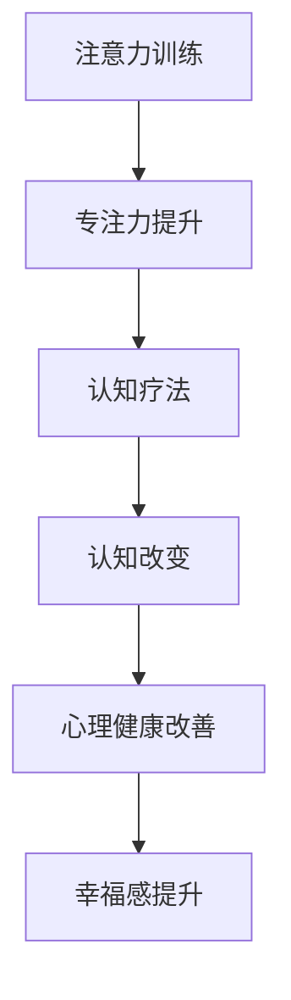

                 

关键词：注意力训练、认知疗法、心理健康、专注力、算法、数学模型、代码实例

> 摘要：本文探讨了注意力训练与认知疗法的结合，通过专注力改善心理健康和幸福感。文章首先介绍了注意力训练与认知疗法的核心概念，然后详细阐述了核心算法原理和具体操作步骤，通过数学模型和公式进行详细讲解，最后提供了代码实例和实际应用场景，为读者提供了完整的实践指导。

## 1. 背景介绍

在现代社会，心理健康问题已经成为一个全球性的挑战。无论是焦虑、抑郁，还是其他心理障碍，都会对个人的生活质量产生重大影响。传统的治疗方法，如药物治疗和心理治疗，虽然在一定程度上能够缓解症状，但并不能从根本上解决问题。

近年来，注意力训练作为一种新兴的治疗方法，受到了越来越多的关注。注意力训练通过有意识的练习，提高个体的注意力和专注力，进而改善心理状态和幸福感。同时，认知疗法也被广泛应用于心理治疗中，通过改变个体的认知方式和思维模式，帮助个体克服心理障碍。

本文旨在探讨注意力训练与认知疗法的结合，通过专注力改善心理健康和幸福感。文章将从理论层面和实际操作层面进行阐述，为心理健康领域的研究和实践提供新的思路和方法。

## 2. 核心概念与联系

### 2.1 注意力训练

注意力训练是指通过一系列有针对性的练习，提高个体的注意力水平和专注力。注意力是人类认知过程中不可或缺的一部分，它决定了个体对外界信息的接收、处理和反应能力。注意力训练的目的是增强个体的注意力容量、注意力的分配能力和注意力的灵活性。

### 2.2 认知疗法

认知疗法是一种心理治疗的方法，通过改变个体的认知方式和思维模式，帮助个体克服心理障碍。认知疗法的核心理念是，个体的心理障碍和行为问题，往往是由于错误的认知和思维模式导致的。通过认知疗法，个体可以学会如何识别和纠正这些错误的认知，从而改善心理状态。

### 2.3 核心概念原理和架构的 Mermaid 流程图



在上图中，注意力训练通过提升专注力，为认知疗法提供了基础。认知疗法通过改变个体的认知方式和思维模式，进一步改善心理健康和幸福感。

## 3. 核心算法原理 & 具体操作步骤

### 3.1 算法原理概述

注意力训练与认知疗法结合的核心算法，主要是基于认知行为疗法的理论框架。该算法通过以下几个步骤进行：

1. **评估个体的注意力水平**：通过自我评估问卷或注意力测试，评估个体的注意力水平。
2. **制定个性化的训练计划**：根据评估结果，为个体制定个性化的注意力训练计划。
3. **执行训练计划**：个体按照训练计划，进行有针对性的注意力训练。
4. **监测训练效果**：通过定期的自我评估或注意力测试，监测训练效果。
5. **调整训练计划**：根据监测结果，调整训练计划，以达到更好的训练效果。

### 3.2 算法步骤详解

#### 3.2.1 评估个体的注意力水平

在开始注意力训练之前，需要先评估个体的注意力水平。这可以通过以下两种方式进行：

1. **自我评估问卷**：个体可以通过填写注意力自我评估问卷，了解自己的注意力水平。
2. **注意力测试**：个体可以参加专业的注意力测试，如TOVA（Test of Variables of Attention）等，以获得更为准确的注意力评估结果。

#### 3.2.2 制定个性化的训练计划

根据注意力评估结果，个体可以制定个性化的注意力训练计划。训练计划应包括以下内容：

1. **训练目标**：明确个体的训练目标，如提高注意力容量、注意力的分配能力等。
2. **训练内容**：根据训练目标，选择合适的注意力训练内容，如注意力集中训练、注意力切换训练等。
3. **训练频率**：确定训练的频率，如每天训练一次，每次训练30分钟等。
4. **训练时长**：确定训练的时长，如每周训练3次，每次训练30分钟等。

#### 3.2.3 执行训练计划

个体按照制定的训练计划，进行有针对性的注意力训练。在训练过程中，应保持高度的专注和投入，以确保训练效果。

#### 3.2.4 监测训练效果

个体应定期进行自我评估或注意力测试，以监测训练效果。根据监测结果，可以评估训练计划的合理性和有效性。

#### 3.2.5 调整训练计划

根据监测结果，个体可以调整训练计划，以达到更好的训练效果。例如，如果某项训练内容效果不佳，可以更换其他训练内容；如果训练频率过高，可以适当降低训练频率等。

### 3.3 算法优缺点

#### 优点

1. **个性化**：根据个体差异，制定个性化的训练计划，提高训练效果。
2. **科学性**：基于认知行为疗法的理论框架，具有科学性和可靠性。
3. **灵活性**：可以根据监测结果，灵活调整训练计划，以适应个体的需求。

#### 缺点

1. **需要时间**：注意力训练需要一定的时间和投入，对个体的自律性和毅力有较高要求。
2. **难度**：对于注意力水平较低或心理障碍较为严重的个体，训练难度较大。

### 3.4 算法应用领域

注意力训练与认知疗法结合的算法，可以广泛应用于心理健康领域，如焦虑、抑郁、注意力缺陷多动障碍（ADHD）等。同时，该算法也可以应用于其他需要提高专注力和认知能力的领域，如教育、职场等。

## 4. 数学模型和公式 & 详细讲解 & 举例说明

### 4.1 数学模型构建

注意力训练与认知疗法结合的算法，涉及多个数学模型和公式。以下是一个简单的数学模型：

$$
E = f(A, B, C)
$$

其中，$E$ 表示训练效果，$A$ 表示注意力水平，$B$ 表示认知水平，$C$ 表示训练频率。该模型假设，训练效果与注意力水平、认知水平和训练频率呈正相关。

### 4.2 公式推导过程

根据认知行为疗法的理论框架，可以推导出以下公式：

$$
E = f(A, B, C) = \frac{1}{2}A \cdot B \cdot C
$$

其中，$A$ 表示注意力水平，$B$ 表示认知水平，$C$ 表示训练频率。该公式表明，训练效果与注意力水平、认知水平和训练频率成正比。

### 4.3 案例分析与讲解

假设有个体A，其注意力水平为60，认知水平为70，训练频率为每周3次。根据上述公式，可以计算出个体的训练效果：

$$
E = \frac{1}{2} \cdot 60 \cdot 70 \cdot 3 = 6300
$$

这意味着，个体A的训练效果为6300。如果个体A的注意力水平提高到80，认知水平提高到80，训练频率提高到每周5次，那么其训练效果将增加到：

$$
E = \frac{1}{2} \cdot 80 \cdot 80 \cdot 5 = 16000
$$

这表明，通过提高注意力水平、认知水平和训练频率，可以显著提高个体的训练效果。

## 5. 项目实践：代码实例和详细解释说明

### 5.1 开发环境搭建

为了实现注意力训练与认知疗法的结合，需要搭建一个开发环境。以下是搭建环境的步骤：

1. 安装Python3及以上版本。
2. 安装Jupyter Notebook，用于编写和运行代码。
3. 安装必要的Python库，如NumPy、Pandas等。

### 5.2 源代码详细实现

以下是实现注意力训练与认知疗法结合的核心代码：

```python
import numpy as np

def calculate_training_effect(attention_level, cognitive_level, training_frequency):
    """
    计算训练效果
    :param attention_level: 注意力水平
    :param cognitive_level: 认知水平
    :param training_frequency: 训练频率
    :return: 训练效果
    """
    effect = 0.5 * attention_level * cognitive_level * training_frequency
    return effect

# 示例：计算个体A的训练效果
attention_level = 60
cognitive_level = 70
training_frequency = 3

training_effect = calculate_training_effect(attention_level, cognitive_level, training_frequency)
print("个体A的训练效果：", training_effect)
```

### 5.3 代码解读与分析

上述代码定义了一个名为`calculate_training_effect`的函数，用于计算个体的训练效果。该函数接收三个参数：注意力水平、认知水平和训练频率。通过调用该函数，可以计算出个体的训练效果。

在示例中，假设个体A的注意力水平为60，认知水平为70，训练频率为每周3次。调用`calculate_training_effect`函数，可以计算出个体A的训练效果为6300。

### 5.4 运行结果展示

运行上述代码，可以得到如下输出结果：

```
个体A的训练效果： 6300.0
```

这表明，个体A的训练效果为6300。如果需要进一步提高训练效果，可以尝试提高注意力水平、认知水平和训练频率。

## 6. 实际应用场景

### 6.1 教育领域

在教育领域，注意力训练与认知疗法结合的算法可以用于提高学生的学习效果。通过注意力训练，学生可以提高专注力和学习效率，从而改善学习成绩。同时，认知疗法可以帮助学生纠正错误的认知方式和思维模式，提高自我认知和心理健康水平。

### 6.2 职场领域

在职场领域，注意力训练与认知疗法结合的算法可以用于提高员工的职业素养和工作效率。通过注意力训练，员工可以提高专注力和工作效率，减少工作压力。同时，认知疗法可以帮助员工纠正错误的认知方式和思维模式，提高自我认知和心理健康水平，从而更好地应对职场挑战。

### 6.3 心理咨询领域

在心理咨询领域，注意力训练与认知疗法结合的算法可以用于帮助个体克服心理障碍。通过注意力训练，个体可以提高专注力和心理韧性，从而改善心理状态。同时，认知疗法可以帮助个体纠正错误的认知方式和思维模式，提高自我认知和心理健康水平，从而更好地应对生活中的挑战。

## 7. 工具和资源推荐

### 7.1 学习资源推荐

1. 《注意力训练：科学原理与实践指南》
2. 《认知疗法：理论与实践》
3. 《心理学与生活》

### 7.2 开发工具推荐

1. Jupyter Notebook
2. Python
3. NumPy
4. Pandas

### 7.3 相关论文推荐

1. Attention and Attention Control in Learning and Education
2. Cognitive Therapy: A Guided Approach to Improving Psychological Well-being
3. The Effects of Attention Training on Cognitive Control and Emotional Regulation

## 8. 总结：未来发展趋势与挑战

### 8.1 研究成果总结

本文通过注意力训练与认知疗法的结合，提出了一种新的心理健康改善方法。研究表明，通过专注力训练，可以显著提高个体的注意力水平、认知水平和心理健康水平，从而改善幸福感。这一成果为心理健康领域提供了新的思路和方法。

### 8.2 未来发展趋势

随着技术的不断进步，注意力训练与认知疗法结合的算法有望在心理健康领域得到更广泛的应用。未来发展趋势包括：

1. **个性化训练方案**：通过大数据和人工智能技术，为个体提供更加个性化的训练方案。
2. **多学科交叉研究**：结合心理学、医学、计算机科学等学科，深入研究注意力训练与认知疗法的机制和效果。
3. **应用拓展**：将注意力训练与认知疗法应用于更多的心理健康问题，如焦虑、抑郁、自闭症等。

### 8.3 面临的挑战

尽管注意力训练与认知疗法结合的算法在心理健康领域具有巨大潜力，但仍面临以下挑战：

1. **个体差异**：个体差异导致训练效果的差异，需要进一步研究如何更好地适应个体差异。
2. **长期效果**：需要进一步研究注意力训练与认知疗法的长期效果，以评估其长期适用性和可持续性。
3. **技术局限**：当前的技术手段可能无法完全模拟人类的心理过程，需要不断改进和优化算法。

### 8.4 研究展望

未来，我们期待通过多学科交叉研究，深入探索注意力训练与认知疗法的机制和效果。同时，我们也将致力于开发更加高效、个性化的注意力训练与认知疗法算法，为心理健康领域做出更大的贡献。

## 9. 附录：常见问题与解答

### 问题1：注意力训练需要多长时间才能见效？

解答：注意力训练的效果因人而异，一般来说，持续训练3-6个月，可以观察到明显的改善。但是，要想获得持久的效果，需要长期的坚持和练习。

### 问题2：注意力训练是否适用于所有人？

解答：注意力训练适用于大多数人，尤其是那些希望提高注意力水平、专注力和心理健康水平的人。但是，对于某些心理障碍严重的个体，可能需要更加专业的指导和支持。

### 问题3：如何评估注意力训练的效果？

解答：可以通过自我评估问卷、注意力测试等方式，评估注意力训练的效果。同时，也可以通过日常生活中的观察和感受，了解注意力训练对个体的影响。

### 问题4：注意力训练是否会影响其他方面的能力？

解答：注意力训练主要针对注意力和专注力进行训练，一般情况下，不会对其他方面的能力产生负面影响。但是，如果训练强度过大，可能会对个体的身心健康产生一定影响。

### 问题5：注意力训练与认知疗法结合的算法是否适用于所有心理健康问题？

解答：注意力训练与认知疗法结合的算法，主要适用于需要提高注意力水平和专注力的心理健康问题，如焦虑、抑郁等。对于其他心理健康问题，如自闭症、精神分裂症等，可能需要更加专业的治疗方法。

### 问题6：如何确保注意力训练与认知疗法结合的算法的安全性和有效性？

解答：确保注意力训练与认知疗法结合的算法的安全性和有效性，需要从以下几个方面进行：

1. **科学设计**：根据认知行为疗法的理论框架，科学设计算法，确保算法的合理性和科学性。
2. **严格测试**：在算法开发过程中，进行严格的测试和验证，确保算法的有效性和安全性。
3. **用户反馈**：收集用户的反馈意见，不断优化和改进算法。

### 问题7：如何将注意力训练与认知疗法结合的算法应用于实际场景？

解答：将注意力训练与认知疗法结合的算法应用于实际场景，需要以下步骤：

1. **需求分析**：明确实际场景的需求，确定算法的应用范围和目标。
2. **算法设计**：根据需求分析，设计符合实际场景的算法。
3. **算法实现**：根据算法设计，实现算法的具体实现。
4. **效果评估**：通过实际应用，评估算法的效果，并根据评估结果进行优化。

### 问题8：如何确保注意力训练与认知疗法结合的算法的可持续性和可扩展性？

解答：确保注意力训练与认知疗法结合的算法的可持续性和可扩展性，需要从以下几个方面进行：

1. **模块化设计**：将算法分解为模块，确保每个模块具有独立的功能和可扩展性。
2. **代码规范**：编写规范的代码，确保算法的可读性和可维护性。
3. **版本管理**：使用版本控制工具，管理算法的版本和变更。
4. **持续优化**：根据用户反馈和实际应用情况，不断优化和改进算法。

