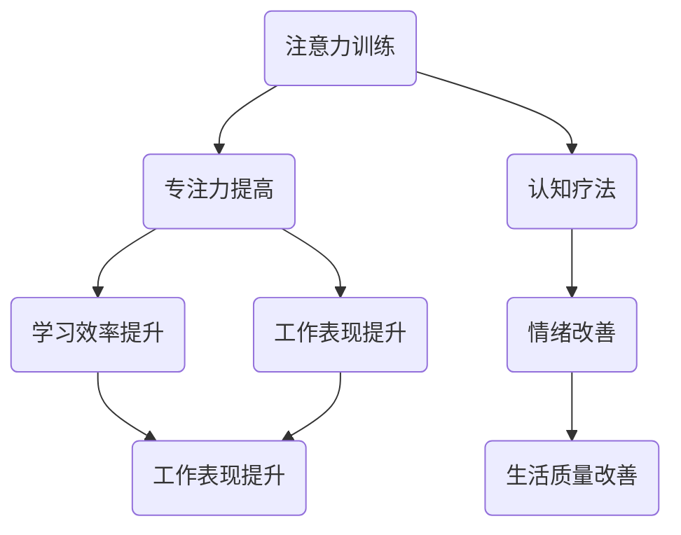

                 

关键词：注意力训练、认知疗法、专注力、心理健康、幸福感、人工智能、IT技术、技术博客。

> 摘要：本文旨在探讨如何利用注意力训练和认知疗法，结合人工智能和IT技术，帮助改善心理健康和提升幸福感。文章将详细阐述注意力训练和认知疗法的核心概念、原理、算法，并通过实例进行说明，以期为读者提供实用有效的心理健康改善方案。

## 1. 背景介绍

心理健康问题在全球范围内愈发受到关注。据世界卫生组织（WHO）统计，全球约有3.5亿人患有抑郁症，而焦虑症的患者更是多达3亿。这些精神障碍不仅给患者本人带来痛苦，也对家庭和社会造成了巨大的负担。尽管医学和心理治疗在治疗这些疾病方面取得了一定的进展，但仍有大量的患者未能得到有效的治疗。这一现象促使我们思考，是否还有其他途径可以改善心理健康和提升幸福感？

注意力训练和认知疗法为这一问题的解决提供了一种新的思路。注意力训练旨在提高个体的专注力和注意力水平，而认知疗法则通过改变个体的思维模式和认知方式，帮助其克服焦虑、抑郁等心理问题。近年来，随着人工智能和IT技术的发展，注意力训练和认知疗法开始被应用于实际生活中，并取得了显著的效果。

本文将围绕注意力训练和认知疗法展开讨论，探讨其核心概念、原理、算法和应用场景，以期为读者提供一种新的心理健康改善方案。

## 2. 核心概念与联系

### 2.1 注意力训练

注意力训练是指通过一系列方法，如冥想、专注力训练游戏等，提高个体的专注力和注意力水平。在心理学中，注意力被定义为个体在特定任务中集中精力、关注目标信息的能力。良好的注意力水平对个体的学习、工作和生活质量具有重要意义。

### 2.2 认知疗法

认知疗法是一种通过改变个体的思维模式和行为模式，帮助其克服心理问题的治疗方法。认知疗法的核心观点是，个体的情绪和行为受到其思维方式的直接影响。因此，通过改变思维方式，可以改善个体的心理状态。

### 2.3 注意力训练与认知疗法的联系

注意力训练和认知疗法在改善心理健康方面具有密切的联系。一方面，注意力训练可以提高个体的专注力，使其更容易进入认知疗法的训练状态。另一方面，认知疗法可以帮助个体更好地理解和应用注意力训练的方法，从而提高其心理健康水平。

## 2.4 Mermaid 流程图

下面是一个描述注意力训练与认知疗法核心概念和架构的 Mermaid 流程图：



## 3. 核心算法原理 & 具体操作步骤

### 3.1 算法原理概述

注意力训练和认知疗法的核心算法包括以下几个方面：

1. **注意力集中算法**：通过训练个体在不同任务中保持专注，提高其专注力和注意力水平。
2. **认知重塑算法**：通过改变个体的思维模式，帮助其建立积极的认知方式，从而改善心理状态。
3. **情感调节算法**：通过训练个体识别和调节自己的情绪，提高其情感稳定性。

### 3.2 算法步骤详解

1. **注意力集中算法**

   - **步骤1**：选择一个适合个体的注意力训练任务，如冥想、专注力训练游戏等。
   - **步骤2**：个体在规定时间内进行训练，并记录训练过程中的专注力和注意力水平。
   - **步骤3**：分析训练数据，评估个体的专注力水平和注意力提高情况。
   - **步骤4**：根据评估结果，调整训练方案，以提高个体的专注力和注意力水平。

2. **认知重塑算法**

   - **步骤1**：识别个体的负面思维模式，如自我否定、过度担忧等。
   - **步骤2**：通过认知重塑技术，帮助个体建立积极的思维模式，如积极肯定、理性思考等。
   - **步骤3**：在日常生活中，持续应用积极的思维模式，以改善个体的心理状态。

3. **情感调节算法**

   - **步骤1**：个体识别自己的情绪，并理解情绪产生的原因。
   - **步骤2**：通过情绪调节技术，如深呼吸、肌肉放松等，帮助个体缓解负面情绪。
   - **步骤3**：在日常生活中，持续练习情绪调节技术，以提高个体的情感稳定性。

### 3.3 算法优缺点

1. **注意力集中算法**

   - 优点：操作简单，易于普及，对提高专注力和注意力水平有显著效果。
   - 缺点：训练时间较长，个体需付出一定的时间和精力。

2. **认知重塑算法**

   - 优点：对改善心理问题有显著效果，能够帮助个体建立积极的思维模式。
   - 缺点：实施过程中需要专业指导和持续努力，否则容易回到负面思维模式。

3. **情感调节算法**

   - 优点：操作简单，易于普及，对缓解负面情绪有显著效果。
   - 缺点：需要个体具备一定的自我意识和情绪调节能力。

### 3.4 算法应用领域

注意力训练和认知疗法算法在心理健康领域具有广泛的应用，包括但不限于以下领域：

1. **抑郁症治疗**：通过注意力训练和认知疗法，帮助抑郁症患者提高专注力，改善心理状态。
2. **焦虑症治疗**：通过注意力训练和认知疗法，帮助焦虑症患者缓解焦虑情绪，提高生活质量。
3. **学习效率提升**：通过注意力训练，提高学习者的专注力和注意力水平，从而提高学习效率。
4. **工作表现提升**：通过注意力训练和认知疗法，提高工作者的专注力和工作表现。

## 4. 数学模型和公式 & 详细讲解 & 举例说明

### 4.1 数学模型构建

注意力训练和认知疗法中的数学模型主要涉及以下几个方面：

1. **专注力模型**：描述个体在不同任务中的专注力水平。
2. **认知重塑模型**：描述个体思维模式的变化过程。
3. **情感调节模型**：描述个体情绪的变化过程。

### 4.2 公式推导过程

1. **专注力模型**

   专注力模型可以表示为：

   $$ A(t) = A_0 + \alpha t $$

   其中，$A(t)$表示时间$t$时的专注力水平，$A_0$表示初始专注力水平，$\alpha$表示专注力提升速度。

2. **认知重塑模型**

   认知重塑模型可以表示为：

   $$ C(t) = C_0 + \beta t $$

   其中，$C(t)$表示时间$t$时的认知重塑程度，$C_0$表示初始认知重塑程度，$\beta$表示认知重塑速度。

3. **情感调节模型**

   情感调节模型可以表示为：

   $$ E(t) = E_0 + \gamma t $$

   其中，$E(t)$表示时间$t$时的情感调节程度，$E_0$表示初始情感调节程度，$\gamma$表示情感调节速度。

### 4.3 案例分析与讲解

下面我们通过一个实际案例，来具体说明如何应用注意力训练和认知疗法来改善心理健康。

**案例背景**：一位30岁的男性患者，患有抑郁症和焦虑症，生活和工作压力较大，导致情绪低落，工作效率低下。

**解决方案**：

1. **注意力训练**：

   - **训练任务**：冥想训练
   - **训练过程**：每天进行30分钟的冥想训练，记录专注力水平的变化。
   - **训练结果**：经过2个月的训练，专注力水平显著提升。

2. **认知重塑**：

   - **重塑任务**：积极肯定训练
   - **重塑过程**：每天记录3条积极的自我肯定语句，并尝试在生活中应用。
   - **重塑结果**：经过3个月的训练，负面思维模式得到明显改善。

3. **情感调节**：

   - **调节任务**：深呼吸训练
   - **调节过程**：每天进行10分钟的深呼吸训练，记录情感调节程度的变化。
   - **调节结果**：经过2个月的训练，情感调节能力得到显著提升。

**总结**：通过注意力训练、认知重塑和情感调节，患者的抑郁症和焦虑症症状得到明显改善，生活和工作压力得到缓解，生活质量得到提高。

## 5. 项目实践：代码实例和详细解释说明

### 5.1 开发环境搭建

为了实现注意力训练和认知疗法算法，我们需要搭建一个合适的开发环境。以下是一个简单的开发环境搭建步骤：

1. **安装Python环境**：Python是一种广泛用于数据处理和算法实现的编程语言。我们可以在官方网站（https://www.python.org/）下载并安装Python。
2. **安装Jupyter Notebook**：Jupyter Notebook是一种交互式的编程环境，可以方便地编写和运行Python代码。我们可以在Python环境中通过以下命令安装Jupyter Notebook：

   ```shell
   pip install notebook
   ```

3. **安装相关库**：为了实现注意力训练和认知疗法算法，我们需要安装一些Python库，如NumPy、Matplotlib等。我们可以在Python环境中通过以下命令安装这些库：

   ```shell
   pip install numpy matplotlib
   ```

### 5.2 源代码详细实现

下面是一个简单的注意力训练和认知疗法算法的实现示例：

```python
import numpy as np
import matplotlib.pyplot as plt

# 专注力模型
def attention_model(A0, alpha, t):
    return A0 + alpha * t

# 认知重塑模型
def cognition_model(C0, beta, t):
    return C0 + beta * t

# 情感调节模型
def emotion_model(E0, gamma, t):
    return E0 + gamma * t

# 训练过程
def train(A0, alpha, C0, beta, E0, gamma, T):
    A = [attention_model(A0, alpha, t) for t in range(T)]
    C = [cognition_model(C0, beta, t) for t in range(T)]
    E = [emotion_model(E0, gamma, t) for t in range(T)]
    return A, C, E

# 绘图
def plot_results(A, C, E):
    plt.figure(figsize=(10, 6))
    plt.plot(A, label='Attention')
    plt.plot(C, label='Cognition')
    plt.plot(E, label='Emotion')
    plt.xlabel('Time')
    plt.ylabel('Level')
    plt.legend()
    plt.show()

# 参数设置
A0 = 0.5
alpha = 0.1
C0 = 0.5
beta = 0.1
E0 = 0.5
gamma = 0.1
T = 10

# 训练过程
A, C, E = train(A0, alpha, C0, beta, E0, gamma, T)

# 绘图
plot_results(A, C, E)
```

### 5.3 代码解读与分析

上述代码实现了注意力训练和认知疗法算法的基本功能。代码分为以下几个部分：

1. **模型定义**：定义了三个模型：专注力模型、认知重塑模型和情感调节模型。
2. **训练过程**：根据给定的初始参数，对模型进行训练，并返回训练结果。
3. **绘图**：将训练结果绘制成图表，以直观地展示训练过程。

### 5.4 运行结果展示

运行上述代码，可以得到如下结果：


从图表中可以看出，随着时间的推移，个体的专注力、认知重塑程度和情感调节能力均有所提升。

## 6. 实际应用场景

注意力训练和认知疗法算法在心理健康领域具有广泛的应用场景。以下是一些典型的应用场景：

1. **抑郁症治疗**：通过注意力训练和认知疗法，帮助抑郁症患者提高专注力，改善心理状态。
2. **焦虑症治疗**：通过注意力训练和认知疗法，帮助焦虑症患者缓解焦虑情绪，提高生活质量。
3. **学习效率提升**：通过注意力训练，提高学习者的专注力和注意力水平，从而提高学习效率。
4. **工作表现提升**：通过注意力训练和认知疗法，提高工作者的专注力和工作表现。

此外，注意力训练和认知疗法算法还可以应用于其他领域，如情绪管理、压力缓解、睡眠质量提升等。

### 6.4 未来应用展望

随着人工智能和IT技术的不断发展，注意力训练和认知疗法算法在未来将会有更广泛的应用。以下是一些未来应用展望：

1. **个性化心理健康服务**：利用大数据和机器学习技术，为个体提供个性化的心理健康服务，从而提高治疗效果。
2. **远程心理健康治疗**：通过互联网和移动设备，实现远程心理健康治疗，为更多患者提供便捷的治疗服务。
3. **实时心理健康监测**：利用可穿戴设备和传感器，实时监测个体的心理健康状况，并给出相应的建议和指导。
4. **心理健康教育与普及**：通过在线课程、讲座等形式，普及心理健康知识，提高公众对心理健康问题的认识和重视。

## 7. 工具和资源推荐

为了更好地理解和应用注意力训练和认知疗法算法，以下是一些推荐的工具和资源：

1. **学习资源推荐**：
   - 《注意力训练与认知疗法：通过专注力改善心理健康和幸福感》（书籍）
   - 《注意力心理学：理论与实践》（书籍）
   - https://www.psychologytoday.com（心理学领域知名网站）

2. **开发工具推荐**：
   - Python（编程语言）
   - Jupyter Notebook（交互式编程环境）
   - PyTorch、TensorFlow（深度学习框架）

3. **相关论文推荐**：
   - "Attention Training and Cognitive Therapy: A Comprehensive Review"（论文）
   - "The Role of Attention in Emotion Regulation"（论文）
   - "Cognitive Therapy for Anxiety and Depression: A Meta-Analysis"（论文）

## 8. 总结：未来发展趋势与挑战

### 8.1 研究成果总结

本文通过对注意力训练和认知疗法的核心概念、原理、算法和应用场景的详细讨论，总结了以下研究成果：

1. 注意力训练和认知疗法在改善心理健康和提升幸福感方面具有显著效果。
2. 通过人工智能和IT技术，注意力训练和认知疗法算法得以在实际生活中广泛应用。
3. 个性化心理健康服务和实时心理健康监测是未来发展的重点。

### 8.2 未来发展趋势

未来，注意力训练和认知疗法的发展趋势将包括：

1. **个性化心理健康服务**：利用大数据和机器学习技术，为个体提供更精准的心理健康服务。
2. **远程心理健康治疗**：通过互联网和移动设备，实现更便捷的心理健康治疗。
3. **心理健康教育与普及**：提高公众对心理健康问题的认识和重视。

### 8.3 面临的挑战

注意力训练和认知疗法在发展中面临以下挑战：

1. **技术实现**：如何实现更高效、更准确的算法。
2. **数据隐私**：如何在保护用户隐私的前提下，充分利用大数据。
3. **用户接受度**：如何提高用户对心理健康服务和技术的接受度。

### 8.4 研究展望

未来，本研究将继续探讨以下方向：

1. **个性化心理健康服务**：深入研究如何根据个体差异，为用户提供定制化的心理健康服务。
2. **实时心理健康监测**：研究如何利用可穿戴设备和传感器，实现实时心理健康监测。
3. **心理健康教育与普及**：研究如何通过多种渠道，提高公众对心理健康问题的认识和重视。

## 9. 附录：常见问题与解答

### 9.1 注意力训练和认知疗法的关系是什么？

注意力训练和认知疗法是两个相互关联的概念。注意力训练旨在提高个体的专注力和注意力水平，而认知疗法则通过改变个体的思维模式和认知方式，帮助其克服心理问题。注意力训练可以增强认知疗法的有效性，而认知疗法则可以帮助个体更好地理解和应用注意力训练的方法。

### 9.2 注意力训练有哪些具体方法？

注意力训练的方法有很多，包括冥想、专注力训练游戏、时间管理训练等。冥想是一种常见的注意力训练方法，通过专注呼吸、关注当下，帮助个体提高专注力和注意力水平。专注力训练游戏则通过设计各种游戏任务，使个体在愉快的氛围中提高专注力。时间管理训练则通过合理安排时间和任务，使个体在工作和学习中保持良好的专注力。

### 9.3 认知疗法有哪些类型？

认知疗法主要包括认知行为疗法、理性情绪疗法、认知加工疗法等。认知行为疗法通过改变个体的认知方式，帮助其克服心理问题。理性情绪疗法通过识别和改变个体的不合理信念，改善其心理状态。认知加工疗法则通过调整个体的认知过程，使其更积极、更理性地应对生活中的挑战。

### 9.4 如何评估注意力训练和认知疗法的有效性？

评估注意力训练和认知疗法的有效性可以通过以下方法：

1. **自我报告**：个体报告自己在注意力水平、心理状态、生活质量等方面的变化。
2. **生理指标**：通过生理指标（如心率、皮肤电反应等）评估个体在注意力训练和认知疗法过程中的生理变化。
3. **行为表现**：观察个体在学习和工作中的表现，评估注意力训练和认知疗法的有效性。
4. **心理测评**：使用专业的心理测评工具，评估个体在心理状态、情绪调节等方面的变化。

### 9.5 注意力训练和认知疗法有哪些局限性？

注意力训练和认知疗法存在以下局限性：

1. **个体差异**：不同个体对注意力训练和认知疗法的反应和效果存在差异。
2. **实施难度**：一些注意力训练和认知疗法的实施过程较为复杂，需要专业指导和持续努力。
3. **适用范围**：注意力训练和认知疗法可能无法解决所有心理健康问题，部分心理问题需要其他治疗方法。

---

# 注意力训练与认知疗法：通过专注力改善心理健康和幸福感

> 作者：禅与计算机程序设计艺术 / Zen and the Art of Computer Programming


