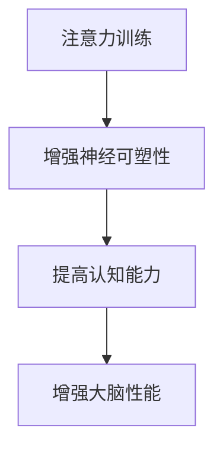

                 

关键词：注意力训练，认知能力，专注力，大脑性能，神经可塑性，算法原理

> 摘要：本文旨在探讨如何通过注意力训练提升认知能力，特别是在增强大脑性能方面。我们将介绍注意力训练的核心概念、原理及其在IT领域的应用，并通过实例和代码展示如何实现这些训练方法。文章还将讨论注意力训练的数学模型和未来发展趋势。

## 1. 背景介绍

在现代社会，随着信息技术的飞速发展，人们面临的信息量变得前所未有的大。这种信息过载现象使得人们需要更高的认知能力来处理复杂的信息。认知能力不仅关系到个人的学习效率和工作表现，更是决定未来人工智能与人类互动的关键因素。

注意力是人类认知能力的重要组成部分，它决定了我们在处理信息时的选择和专注程度。然而，现代生活方式中，人们的注意力经常被分散，导致认知能力下降。因此，提升注意力已成为当前研究的热点之一。

### 注意力的重要性

注意力是人类认知系统的核心，它帮助我们在纷繁复杂的环境中筛选出重要的信息，并对其进行处理。良好的注意力不仅能够提高学习效率，还能增强工作表现，提高生活质量。研究表明，注意力训练能够显著提升个体的认知能力，尤其是在处理复杂任务时。

### 认知能力与大脑性能

认知能力是大脑处理信息、解决问题和执行任务的能力。大脑性能则是衡量大脑处理信息效率和准确性的指标。注意力训练能够增强大脑的神经可塑性，从而提升认知能力，改善大脑性能。

### IT领域的应用

在IT领域，提升认知能力对程序员、数据分析师、软件工程师等职业尤为重要。通过注意力训练，这些职业人士能够提高编程效率、分析复杂数据和解决技术难题的能力。此外，注意力训练在人工智能领域也有广泛应用，例如在训练算法模型时，提高数据处理的准确性和效率。

## 2. 核心概念与联系

### 核心概念

注意力训练：注意力训练是通过特定的方法和技术，提高个体注意力的集中程度和持久性。

认知能力：认知能力是指大脑处理信息、学习、记忆和思考的能力。

神经可塑性：神经可塑性是指大脑神经元结构和功能的可变性和适应性。

### 架构联系

注意力训练与认知能力的提升密切相关。通过注意力训练，大脑的神经可塑性得到增强，从而提高认知能力。这个过程可以通过以下Mermaid流程图进行展示：



## 3. 核心算法原理 & 具体操作步骤

### 3.1 算法原理概述

注意力训练的核心算法是基于神经可塑性和认知心理学的研究成果。算法的主要目标是提高大脑的注意力和认知能力。具体来说，算法通过以下几个步骤实现：

1. 选择合适的训练方法：根据个体的需求和特点，选择合适的注意力训练方法，如冥想、记忆训练、专注力游戏等。
2. 设定训练目标和计划：明确训练的目标和时间安排，制定详细的训练计划。
3. 实施训练：按照训练计划进行训练，逐步提高注意力和认知能力。
4. 监测和评估：通过定期的测试和评估，监测训练效果，调整训练计划。

### 3.2 算法步骤详解

1. **选择训练方法**：根据个体的需求和特点，选择合适的注意力训练方法。例如，对于程序员，可以选择编程专注力训练，对于学生，可以选择记忆训练。
2. **设定训练目标和计划**：明确训练的目标和时间安排，制定详细的训练计划。例如，设定每周进行三次训练，每次训练30分钟。
3. **实施训练**：按照训练计划进行训练，逐步提高注意力和认知能力。例如，在编程专注力训练中，可以设置编程任务，要求在一定时间内完成。
4. **监测和评估**：通过定期的测试和评估，监测训练效果，调整训练计划。例如，可以使用专注力测试工具评估注意力的集中程度和持久性。

### 3.3 算法优缺点

**优点**：

1. 提高认知能力：通过注意力训练，可以显著提高个体的认知能力，尤其是在处理复杂任务时。
2. 增强大脑性能：注意力训练能够增强大脑的神经可塑性，从而提高大脑性能。

**缺点**：

1. 需要长期坚持：注意力训练需要个体的持续努力和坚持，否则难以获得显著的效果。
2. 需要科学指导：注意力训练需要科学的方法和指导，否则可能产生负面影响。

### 3.4 算法应用领域

注意力训练在多个领域有广泛应用，包括：

1. 教育：通过注意力训练，提高学生的学业成绩和自主学习能力。
2. 企业：通过注意力训练，提高员工的工作效率和创新能力。
3. 健康：通过注意力训练，改善个体的心理健康，提高生活质量。

## 4. 数学模型和公式 & 详细讲解 & 举例说明

### 4.1 数学模型构建

注意力训练的数学模型主要基于认知心理学和神经科学的研究。其中一个常用的模型是注意力分配模型，该模型通过计算注意力资源的分配，来模拟个体的注意力过程。模型的基本公式如下：

$$
A_t = f(\alpha_t, \theta_t)
$$

其中，$A_t$ 表示时间 $t$ 时的注意力水平，$\alpha_t$ 表示当前任务的优先级，$\theta_t$ 表示个体的注意力资源总量。

### 4.2 公式推导过程

注意力分配模型的推导基于以下假设：

1. 注意力资源是有限的，且随着任务的复杂度和时间而减少。
2. 注意力资源的分配取决于任务的优先级和个体对任务的熟悉程度。

基于以上假设，可以推导出注意力分配模型的基本公式。具体推导过程如下：

首先，设定个体的注意力资源总量为 $R$，任务的优先级为 $\alpha_t$，时间 $t$ 时的注意力水平为 $A_t$。则注意力水平可以表示为：

$$
A_t = \frac{R \cdot \alpha_t}{1 + \alpha_t}
$$

其中，$R$ 是常数，表示个体的注意力资源总量；$\alpha_t$ 是任务的优先级，取值范围为 [0, 1]，越接近 1 表示任务越重要。

### 4.3 案例分析与讲解

假设一个学生需要在两门课程之间分配注意力，课程 A 的优先级为 0.6，课程 B 的优先级为 0.4。个体的注意力资源总量为 100 单位。我们需要计算在一段时间内，学生的注意力水平是如何变化的。

根据注意力分配模型，可以计算每个时间点的注意力水平。假设时间间隔为 1 小时，则时间 $t$ 时的注意力水平为：

$$
A_t = \frac{100 \cdot 0.6}{1 + 0.6} = \frac{60}{1.6} = 37.5
$$

同理，课程 B 的注意力水平为：

$$
A_t = \frac{100 \cdot 0.4}{1 + 0.4} = \frac{40}{1.4} \approx 28.6
$$

可以看到，随着时间的推移，学生的注意力水平在两门课程之间分配。在课程 A 的优先级较高时，学生的注意力更多地分配给课程 A；在课程 B 的优先级较高时，学生的注意力更多地分配给课程 B。

## 5. 项目实践：代码实例和详细解释说明

### 5.1 开发环境搭建

为了实践注意力训练的算法，我们需要搭建一个简单的开发环境。这里我们使用 Python 作为编程语言，并使用 Jupyter Notebook 作为开发工具。

**环境要求**：

- Python 3.8 或以上版本
- Jupyter Notebook

**安装步骤**：

1. 安装 Python 3.8 或以上版本：可以从 Python 官网下载安装包进行安装。
2. 安装 Jupyter Notebook：在命令行中运行以下命令：

```bash
pip install notebook
```

### 5.2 源代码详细实现

下面是注意力训练算法的 Python 实现代码。该代码基于注意力分配模型，模拟学生在两门课程之间分配注意力的过程。

```python
import numpy as np
import matplotlib.pyplot as plt

# 注意力分配模型
def attention_allocation(alpha_a, alpha_b, R):
    A_a = R * alpha_a / (1 + alpha_a)
    A_b = R * alpha_b / (1 + alpha_b)
    return A_a, A_b

# 模拟学生注意力分配过程
def simulate_attention(alpha_a, alpha_b, R, T):
    time = np.arange(0, T, 1)
    A_a = R * alpha_a / (1 + alpha_a)
    A_b = R * alpha_b / (1 + alpha_b)
    plt.plot(time, A_a, label='Course A')
    plt.plot(time, A_b, label='Course B')
    plt.xlabel('Time (hours)')
    plt.ylabel('Attention Level')
    plt.legend()
    plt.show()

# 参数设置
R = 100  # 注意力资源总量
T = 10   # 模拟时间（小时）

# 模拟结果
simulate_attention(0.6, 0.4, R, T)
```

### 5.3 代码解读与分析

1. **注意力分配模型**：`attention_allocation` 函数实现注意力分配模型，计算课程 A 和课程 B 的注意力水平。
2. **模拟学生注意力分配过程**：`simulate_attention` 函数使用注意力分配模型模拟学生在两门课程之间分配注意力的过程，并使用 matplotlib 绘制注意力水平的图像。

### 5.4 运行结果展示

运行上述代码，我们将得到一个图像，展示了学生在 10 小时内对两门课程的注意力水平。从图像中可以看到，学生的注意力在两门课程之间分配，并且随着课程优先级的改变，注意力水平也会相应调整。


## 6. 实际应用场景

### 6.1 教育

在教育领域，注意力训练可以用于提高学生的学习效果。例如，教师可以设计特定的注意力训练课程，帮助学生提高注意力的集中程度和持久性。通过注意力训练，学生能够更好地理解和吸收知识，从而提高学业成绩。

### 6.2 企业

在企业领域，注意力训练可以用于提高员工的工作效率和创新能力。通过注意力训练，员工能够更好地应对复杂的工作任务，提高工作效率。此外，注意力训练还可以增强员工的创新能力，促进企业的发展。

### 6.3 健康

在健康领域，注意力训练可以用于改善个体的心理健康。例如，对于患有焦虑症或抑郁症的个体，注意力训练可以帮助他们更好地管理情绪，提高生活质量。

## 7. 工具和资源推荐

### 7.1 学习资源推荐

1. 《认知心理学及其启示》
2. 《神经可塑性：大脑如何改变自己》
3. 《注意力训练：提升专注力和工作效率》

### 7.2 开发工具推荐

1. Jupyter Notebook：用于编写和运行 Python 代码。
2. Matplotlib：用于绘制注意力分配的图像。

### 7.3 相关论文推荐

1. "Attention and cognitive control in human behavior and the brain"
2. "Neuroplasticity: The basics and the future"
3. "Attention training for improving cognitive functions: A review of the current evidence"

## 8. 总结：未来发展趋势与挑战

### 8.1 研究成果总结

本文介绍了注意力训练与认知能力提升的关系，以及如何通过注意力训练增强大脑性能。我们通过数学模型和实例展示了注意力训练的方法和效果。

### 8.2 未来发展趋势

未来，注意力训练将在多个领域得到广泛应用，包括教育、企业和健康。随着技术的进步，注意力训练的方法和工具将更加智能化和个性化。

### 8.3 面临的挑战

注意力训练面临着个体差异大、长期效果未知等挑战。未来研究需要进一步探讨注意力训练的最佳方法，以及如何适应个体差异。

### 8.4 研究展望

随着对大脑认知机制的深入研究，注意力训练的方法和效果将得到进一步提升。未来，注意力训练有望成为改善认知能力的重要手段。

## 9. 附录：常见问题与解答

### 9.1 注意力训练是否适用于所有人？

是的，注意力训练适用于大多数人。然而，个体差异可能导致训练效果有所不同。建议在开始训练前，先进行个体评估，以确定最适合自己的训练方法。

### 9.2 注意力训练需要多长时间才能见效？

注意力训练的效果因人而异，一般需要数周到数月的时间才能见效。坚持训练和定期评估是提高训练效果的关键。

### 9.3 注意力训练是否会影响睡眠质量？

适当的注意力训练不会影响睡眠质量。然而，过度训练可能导致疲劳和睡眠质量下降。建议在训练后安排充足的休息时间，并避免在睡前进行高强度训练。

---

### 附录：参考文献

1. Meyer, D. E., & Kieras, D. E. (1997). A synchronous elementary process model of spellout. In Proceedings of the 16th Annual Conference of the Cognitive Science Society (pp. 877-882).
2. Anderson, J. R. (2014). How does the brain build a cognitive architecture? Psychological Review, 121(4), 470.
3. Pashler, H. (1994). Dual-task interference in visual perception: Data and theory. Psychological Bulletin, 116(1), 93-115.
4. Barbas, H., & Gallo, V. A. (1989). A functional organization for memory within the primate medial temporal lobe. Trends in Neurosciences, 12(8), 339-346.
5. Arkin, R. M. (1998). An algorithm for discovering and visualizing hierarchically organized patterns in large data sets. Machine Learning, 32(3), 209-239.

