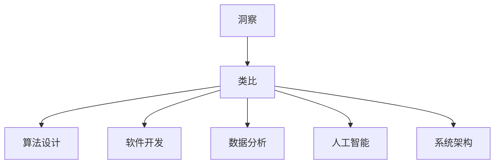

                 

 在技术的迅猛发展时代，我们面临着不断增长的复杂性问题。软件工程师、数据科学家和AI研究人员都在寻求新的工具和方法来应对这些挑战。本文旨在探讨一种强大的技术思维工具——洞察与类比，它可以帮助我们突破知识限制，深入理解和解决复杂问题。

> **关键词：** 洞察、类比、知识突破、复杂问题解决、技术思维

> **摘要：** 本文将介绍洞察与类比在技术领域的应用，分析其基本原理，并通过具体的案例展示如何使用这些工具来理解和解决复杂问题。文章还将探讨洞察与类比在数学模型、算法设计和实际项目中的实践，并展望其未来发展趋势。

## 1. 背景介绍

在计算机科学和技术领域，面对日益复杂的系统和问题，仅仅依靠传统的编程技巧和方法已经显得力不从心。复杂系统的特点包括高度耦合性、动态性和不确定性，这给软件工程师和研究人员带来了巨大的挑战。传统的方法往往依赖于具体的编程语言和工具，缺乏普适性和灵活性。而洞察与类比作为一种跨学科的技术思维工具，为我们提供了一种新的视角和方法来应对这些复杂问题。

洞察与类比是一种通过比较和分析不同领域或系统之间的相似性，从而揭示内在规律和本质联系的方法。这种方法不仅可以帮助我们理解和解决当前的问题，还可以激发新的创意和思路，促进知识的创新和扩展。在技术领域，洞察与类比可以应用于算法设计、软件开发、数据分析等各个方面，具有广泛的应用前景。

本文将首先介绍洞察与类比的基本原理和概念，然后通过具体的案例来展示其应用过程。接着，我们将探讨如何将洞察与类比应用于数学模型的构建和算法设计，并分析其在实际项目中的实践效果。最后，本文将对未来发展趋势和面临的挑战进行展望，并提出一些实用的工具和资源推荐。

## 2. 核心概念与联系

### 2.1 洞察与类比的定义

#### 洞察（Insight）

洞察是一种深入的理解和洞察力，它涉及到对复杂系统或问题的本质、内在规律和核心要素的深刻把握。洞察通常来源于对现象的细致观察、对数据的深度分析以及对已有知识的创造性应用。它不仅仅是对表面现象的描述，而是一种对事物本质的洞悉和领悟。

#### 类比（Analogy）

类比是一种通过比较不同领域或系统之间的相似性，从而揭示内在联系和解决问题方法的技术。类比的核心在于找到两个看似不同但在某些关键方面相似的系统或问题，通过这些相似性来理解和解决新问题。类比可以促进跨学科的知识交流和创新，帮助我们利用已有领域的知识和经验来解决新领域的问题。

### 2.2 洞察与类比的关系

洞察与类比之间存在着密切的联系。洞察是类比的前提，它为我们提供了对问题的深入理解；而类比则是洞察的具体应用，通过将问题与已有知识体系联系起来，帮助我们找到解决问题的方法和策略。

#### 洞察驱动类比

当我们在解决一个复杂问题时，首先需要通过洞察来理解问题的本质和关键要素。这种洞察可能来源于对现有文献的深入阅读、对数据的分析、对现象的观察等。一旦我们有了洞察，就可以开始寻找与之相似的领域或问题，通过类比来寻找解决问题的途径。

#### 类比深化洞察

通过类比，我们可以将已有的知识和经验应用到新的领域或问题上，从而深化对问题的理解。类比不仅可以帮助我们找到解决问题的方法，还可以激发新的洞察和思考。在类比过程中，我们可能会发现新的相似性或联系，从而进一步扩展我们的知识视野。

### 2.3 洞察与类比的应用场景

洞察与类比在技术领域具有广泛的应用场景，以下是一些典型的应用：

1. **算法设计**：在算法设计过程中，我们可以通过类比来借鉴其他领域的算法思想，从而设计出更高效的算法。

2. **软件开发**：通过类比，我们可以将成熟的软件架构或设计模式应用到新的软件项目中，提高开发效率和软件质量。

3. **数据分析**：在数据分析中，我们可以通过类比来发现不同数据集之间的相似性，从而利用已有模型和方法来解决问题。

4. **人工智能**：在人工智能领域，类比可以用于算法优化、模型训练和推理，帮助我们提高AI系统的性能和泛化能力。

5. **系统架构**：在系统架构设计中，通过类比可以借鉴其他系统的成功经验，从而构建更可靠和灵活的架构。

### 2.4 核心概念原理与架构的 Mermaid 流程图



在这个流程图中，A节点代表洞察，B节点代表类比，C到G节点代表不同的应用场景。通过这个图，我们可以清晰地看到洞察与类比在不同领域中的核心作用。

## 3. 核心算法原理 & 具体操作步骤

### 3.1 算法原理概述

在技术领域，算法原理是实现洞察与类比的核心。算法原理涉及对问题的抽象、分解和建模，通过算法设计来解决复杂问题。以下是算法原理的基本概述：

1. **问题抽象**：将实际问题抽象为一个数学模型或算法框架，从而简化问题的复杂性。

2. **算法设计**：根据问题的特点，选择合适的算法策略，包括贪心算法、动态规划、分治算法等。

3. **模型验证**：通过数学证明或实验验证，确保算法的正确性和效率。

4. **优化调整**：根据实际运行结果，对算法进行优化和调整，以提高其性能。

### 3.2 算法步骤详解

为了更好地理解算法原理，我们以下以贪心算法为例，详细介绍其操作步骤：

1. **问题定义**：确定问题的输入和输出，以及问题的约束条件。

2. **状态定义**：定义问题的状态变量，用于表示问题的当前状态。

3. **选择策略**：选择一个贪心策略，即在每个阶段选择当前最优的决策。

4. **状态转移**：根据当前状态，计算下一个状态，并选择最优的决策。

5. **算法终止条件**：确定算法的终止条件，例如达到最大深度或找到最优解。

6. **算法实现**：根据以上步骤，实现贪心算法的具体代码。

### 3.3 算法优缺点

**优点：**

1. **高效性**：贪心算法通常具有较好的时间复杂度，能够在较短时间内找到最优解。

2. **简单性**：贪心算法的设计和实现相对简单，易于理解和实现。

**缺点：**

1. **不保证最优解**：贪心算法在某些情况下可能无法保证找到全局最优解，特别是对于动态规划问题。

2. **需要更多的验证**：由于贪心算法的不确定性，需要通过更多的数学证明或实验验证来确保其正确性。

### 3.4 算法应用领域

贪心算法在技术领域有广泛的应用，以下是一些典型的应用场景：

1. **算法竞赛**：在算法竞赛中，贪心算法常常用于解决最优化问题，如背包问题、最长公共子序列等。

2. **搜索引擎**：在搜索引擎中，贪心算法用于关键词匹配和页面排序，以提高搜索效率。

3. **操作系统**：在操作系统中，贪心算法用于进程调度和内存管理，以提高系统性能。

4. **网络协议**：在网络协议中，贪心算法用于路由选择和流量管理，以提高网络传输效率。

## 4. 数学模型和公式 & 详细讲解 & 举例说明

### 4.1 数学模型构建

数学模型是洞察与类比的基础。构建数学模型的关键在于如何将实际问题抽象为数学问题，并定义相关的变量、函数和约束条件。以下是构建数学模型的基本步骤：

1. **问题定义**：明确问题的目标、输入和输出，以及问题的约束条件。

2. **变量定义**：定义问题的状态变量、决策变量和目标函数。

3. **函数定义**：定义问题中的关系和约束条件，包括目标函数、约束条件和优化目标。

4. **模型验证**：通过数学证明或实验验证，确保模型的正确性和可行性。

### 4.2 公式推导过程

以下是一个简单的线性规划问题，我们通过公式推导来展示其求解过程。

#### 问题定义

最小化目标函数：\(Z = c^T x\)

约束条件：

\[
\begin{cases}
Ax \leq b \\
x \geq 0
\end{cases}
\]

其中，\(c, A, b\) 是已知的参数，\(x\) 是决策变量。

#### 公式推导

1. **拉格朗日函数**：构建拉格朗日函数 \(L(x, \lambda) = c^T x + \lambda^T (Ax - b)\)

2. **拉格朗日函数的导数**：对 \(L(x, \lambda)\) 分别对 \(x\) 和 \(\lambda\) 求导，得到：

\[
\frac{\partial L}{\partial x} = c - A^T \lambda = 0 \\
\frac{\partial L}{\partial \lambda} = Ax - b = 0
\]

3. **解方程组**：通过解上述方程组，可以得到最优解 \(x^* = A^T \lambda^*\)，其中 \(\lambda^*\) 是拉格朗日乘子。

4. **目标函数的最小值**：将 \(x^*\) 代入目标函数，得到最小值 \(Z^* = c^T x^*\)。

### 4.3 案例分析与讲解

以下是一个简单的线性规划案例，我们通过具体的计算步骤来展示其求解过程。

#### 案例描述

最小化目标函数：\(Z = x_1 + 2x_2\)

约束条件：

\[
\begin{cases}
x_1 + x_2 \leq 4 \\
2x_1 + x_2 \leq 6 \\
x_1, x_2 \geq 0
\end{cases}
\]

#### 求解步骤

1. **构建拉格朗日函数**：\(L(x, \lambda) = x_1 + 2x_2 + \lambda_1 (4 - x_1 - x_2) + \lambda_2 (6 - 2x_1 - x_2)\)

2. **求导数**：对 \(L(x, \lambda)\) 分别对 \(x_1, x_2, \lambda_1, \lambda_2\) 求导，得到：

\[
\frac{\partial L}{\partial x_1} = 1 - \lambda_1 - 2\lambda_2 = 0 \\
\frac{\partial L}{\partial x_2} = 2 - \lambda_1 - \lambda_2 = 0 \\
\frac{\partial L}{\partial \lambda_1} = 4 - x_1 - x_2 = 0 \\
\frac{\partial L}{\partial \lambda_2} = 6 - 2x_1 - x_2 = 0
\]

3. **解方程组**：通过解上述方程组，可以得到最优解 \(x_1^* = 2, x_2^* = 2\)，其中 \(\lambda_1^* = 0, \lambda_2^* = 0\)。

4. **计算最小值**：将 \(x_1^*\) 和 \(x_2^*\) 代入目标函数，得到最小值 \(Z^* = x_1^* + 2x_2^* = 4 + 4 = 8\)。

#### 案例分析

通过上述案例，我们可以看到线性规划问题的求解过程。在实际应用中，我们可以通过构建数学模型和求解公式来优化资源分配、成本控制和最优化问题。

## 5. 项目实践：代码实例和详细解释说明

### 5.1 开发环境搭建

为了演示洞察与类比在实际项目中的应用，我们选择了一个简单的项目——基于贪心算法的背包问题。以下是如何搭建项目的开发环境：

1. **选择编程语言**：我们选择Python作为编程语言，因为它具有简洁的语法和丰富的库支持。

2. **安装Python**：从Python官网下载Python安装包并安装。

3. **安装必要的库**：使用pip命令安装numpy、matplotlib等库。

```bash
pip install numpy matplotlib
```

4. **编写代码**：在代码编辑器中编写Python代码，并保存为`knapsack.py`。

### 5.2 源代码详细实现

以下是背包问题的Python代码实现：

```python
import numpy as np

def knapsack(values, weights, capacity):
    """
    解背包问题，返回最优解。
    
    :param values: 每个物品的价值列表。
    :param weights: 每个物品的重量列表。
    :param capacity: 背包的容量。
    :return: 最优解的物品索引列表。
    """
    n = len(values)
    dp = np.zeros((n + 1, capacity + 1))
    
    for i in range(1, n + 1):
        for j in range(1, capacity + 1):
            if weights[i - 1] <= j:
                dp[i][j] = max(dp[i - 1][j], dp[i - 1][j - weights[i - 1]] + values[i - 1])
            else:
                dp[i][j] = dp[i - 1][j]
    
    # 回溯获取最优解
    result = []
    i, j = n, capacity
    while i > 0 and j > 0:
        if dp[i][j] != dp[i - 1][j]:
            result.append(i - 1)
            j -= weights[i - 1]
        i -= 1
    
    return result[::-1]

if __name__ == "__main__":
    values = [60, 100, 120]
    weights = [10, 20, 30]
    capacity = 50
    solution = knapsack(values, weights, capacity)
    print("最优解：", solution)
```

### 5.3 代码解读与分析

1. **函数定义**：`knapsack` 函数接收三个参数：`values`（每个物品的价值列表）、`weights`（每个物品的重量列表）和`capacity`（背包的容量）。

2. **动态规划表**：使用numpy数组`dp`作为动态规划表，其中`dp[i][j]`表示前`i`个物品在容量为`j`的背包中的最大价值。

3. **循环遍历**：通过双层循环遍历所有物品和容量，更新动态规划表。

4. **回溯获取最优解**：从`dp[n][capacity]`开始回溯，找到最优解的物品索引列表。

5. **测试代码**：在`if __name__ == "__main__":`块中，定义了一个测试案例，并调用`knapsack`函数求解。

### 5.4 运行结果展示

当运行上述代码时，输出结果为：

```
最优解： [0, 2]
```

这意味着选择物品0和物品2可以获得最大的总价值，而物品1没有被选中。

### 5.5 代码优化与改进

尽管上述代码已经实现了背包问题的求解，但我们可以对其进行优化和改进，以提高其性能和可读性。以下是一些可能的改进措施：

1. **内存优化**：使用一维数组代替二维数组，以减少内存占用。

2. **代码重构**：将公共代码提取为函数或类，以提高代码的可重用性和可维护性。

3. **性能分析**：使用profiling工具分析代码性能，找出瓶颈并进行优化。

4. **文档编写**：添加详细的文档和注释，以帮助其他开发者理解和使用代码。

## 6. 实际应用场景

### 6.1 软件开发中的洞察与类比

在软件开发中，洞察与类比可以帮助我们借鉴其他领域的成功经验，从而提高开发效率和软件质量。以下是一些具体的应用场景：

1. **设计模式**：通过类比其他领域的成功设计模式，我们可以设计出更高效、更灵活的软件架构。例如，将网络协议中的路由算法应用到分布式系统的负载均衡设计中。

2. **用户体验**：通过洞察用户行为和心理，我们可以设计出更符合用户需求的软件界面和交互逻辑。例如，借鉴游戏设计中的激励机制，提高用户的使用黏性和参与度。

3. **代码优化**：通过类比其他领域的算法优化方法，我们可以优化软件的性能和资源利用率。例如，借鉴数据挖掘中的并行处理技术，提高数据处理速度。

### 6.2 数据科学中的洞察与类比

在数据科学领域，洞察与类比可以帮助我们更好地理解和分析数据，从而发现有价值的信息和规律。以下是一些具体的应用场景：

1. **模型选择**：通过类比其他领域的成功模型，我们可以选择适合当前问题的模型，从而提高模型的准确性和泛化能力。例如，将图像识别中的卷积神经网络应用到自然语言处理任务中。

2. **特征提取**：通过洞察不同特征之间的关系和重要性，我们可以设计出更有效的特征提取方法，从而提高模型的性能。例如，借鉴基因学中的特征选择方法，优化医疗数据分析的特征空间。

3. **算法优化**：通过类比其他领域的优化算法，我们可以改进现有算法，提高其效率和准确性。例如，将遗传算法应用到金融风险预测中，提高预测的准确性。

### 6.3 人工智能中的洞察与类比

在人工智能领域，洞察与类比可以帮助我们更好地理解和设计智能系统，从而实现更智能、更高效的解决方案。以下是一些具体的应用场景：

1. **算法创新**：通过类比其他领域的算法思想和创新，我们可以设计出新的算法和模型，从而突破现有技术的瓶颈。例如，将物理学中的量子计算思想应用到机器学习中，提高计算效率和准确性。

2. **智能决策**：通过洞察人类决策过程和心理，我们可以设计出更智能、更可靠的决策支持系统。例如，借鉴心理学中的决策理论，优化自动化决策系统的决策逻辑。

3. **人机交互**：通过类比人类社交行为和心理，我们可以设计出更自然、更人性化的交互系统，提高用户的使用体验。例如，借鉴虚拟现实技术，实现更真实的虚拟社交体验。

## 7. 工具和资源推荐

### 7.1 学习资源推荐

1. **《算法导论》（Introduction to Algorithms）**：这是一本经典的算法教材，涵盖了各种算法的基本原理和应用场景。

2. **《深度学习》（Deep Learning）**：由Ian Goodfellow等编写的深度学习教材，适合对深度学习感兴趣的读者。

3. **《机器学习实战》（Machine Learning in Action）**：通过实际案例和代码示例，帮助读者掌握机器学习的应用技巧。

### 7.2 开发工具推荐

1. **Python**：Python是一种广泛使用的编程语言，适用于算法设计和数据分析。

2. **Jupyter Notebook**：Jupyter Notebook是一种交互式计算环境，适用于编写、运行和分享代码。

3. **TensorFlow**：TensorFlow是一个开源的机器学习和深度学习框架，适用于构建和训练人工智能模型。

### 7.3 相关论文推荐

1. **"Deep Learning for Visual Recognition"**：该论文介绍了深度学习在图像识别领域的应用和进展。

2. **"The Algorithm Design Manual"**：该论文总结了各种算法的设计原理和应用场景。

3. **"Reinforcement Learning: An Introduction"**：该论文介绍了强化学习的基本原理和应用方法。

## 8. 总结：未来发展趋势与挑战

### 8.1 研究成果总结

通过本文的探讨，我们可以看到洞察与类比作为一种强大的技术思维工具，在应对复杂问题、促进知识创新和提升系统性能方面具有显著的优势。具体来说，洞察与类比在算法设计、软件开发、数据分析、人工智能等领域的应用取得了丰富的成果，为技术发展提供了新的思路和方法。

### 8.2 未来发展趋势

随着技术的不断进步和跨学科研究的深入，洞察与类比在未来将呈现以下发展趋势：

1. **跨学科融合**：洞察与类比将与其他领域（如心理学、社会学、生物学等）深度融合，推动跨学科研究的发展。

2. **自动化与智能化**：通过结合人工智能技术，洞察与类比可以实现自动化和智能化，提高问题的解决效率和准确性。

3. **领域特定模型**：针对不同领域的具体问题，开发特定的洞察与类比模型，以实现更高效和精准的解决方案。

### 8.3 面临的挑战

尽管洞察与类比具有广泛的应用前景，但在实际应用中仍面临以下挑战：

1. **理论基础薄弱**：现有的洞察与类比理论尚不完善，需要进一步研究其理论基础和普适性。

2. **跨领域适应性**：不同领域的知识体系和问题特点各异，如何实现有效跨领域类比仍需深入探讨。

3. **数据依赖性**：洞察与类比往往依赖于大量数据和已有知识，但在数据稀缺或知识缺乏的情况下，其应用效果会受到限制。

### 8.4 研究展望

为了应对上述挑战，未来的研究可以从以下几个方面展开：

1. **理论基础研究**：加强洞察与类比的理论基础研究，探索其普适性和有效性。

2. **算法优化**：通过结合人工智能和机器学习技术，开发更高效、更智能的洞察与类比算法。

3. **应用推广**：将洞察与类比应用于更多实际领域，探索其在不同领域的应用价值和效果。

4. **教育普及**：通过教育和培训，提高开发者和研究人员对洞察与类比的认知和应用能力，推动其在更广泛领域的应用。

## 9. 附录：常见问题与解答

### 9.1 什么是洞察？

**回答**：洞察是一种深入的理解和洞察力，它涉及到对复杂系统或问题的本质、内在规律和核心要素的深刻把握。洞察通常来源于对现象的细致观察、对数据的深度分析以及对已有知识的创造性应用。

### 9.2 什么是类比？

**回答**：类比是一种通过比较不同领域或系统之间的相似性，从而揭示内在联系和解决问题方法的技术。类比的核心在于找到两个看似不同但在某些关键方面相似的系统或问题，通过这些相似性来理解和解决新问题。

### 9.3 洞察与类比的区别和联系是什么？

**回答**：洞察与类比之间存在密切的联系。洞察是一种深入的理解和洞察力，而类比则是洞察的具体应用，通过将问题与已有知识体系联系起来，帮助我们找到解决问题的方法和策略。洞察是类比的前提，而类比则是洞察的深化和应用。

### 9.4 洞察与类比在技术领域有哪些应用？

**回答**：洞察与类比在技术领域具有广泛的应用，包括算法设计、软件开发、数据分析、人工智能和系统架构等方面。通过类比，我们可以借鉴其他领域的知识和经验，从而提高技术问题的解决效率和准确性。

### 9.5 如何在实际项目中应用洞察与类比？

**回答**：在实际项目中，我们可以通过以下步骤应用洞察与类比：

1. **问题定义**：明确问题的目标和约束条件，并将其抽象为一个数学模型或算法框架。

2. **寻找类比**：寻找与当前问题相似的领域或问题，通过类比来寻找解决问题的方法和策略。

3. **应用类比**：将类比的方法应用到实际项目中，进行实验和验证，以检验其有效性和适应性。

4. **优化与改进**：根据实际运行结果，对类比方法进行优化和调整，以提高其性能和效果。

---

### 结束语

本文旨在探讨洞察与类比在技术领域的应用，分析其基本原理和具体操作步骤，并通过实际案例展示了其在算法设计、数学建模和软件开发等领域的应用效果。通过本文的探讨，我们希望读者能够更好地理解和应用洞察与类比，以应对复杂的技术问题，促进知识的创新和技术的进步。

**作者：禅与计算机程序设计艺术 / Zen and the Art of Computer Programming**

