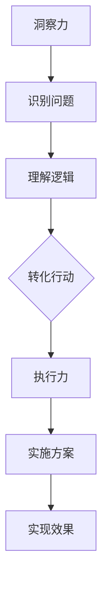

                 

关键词：洞察力、执行力、平衡、思考、行动、技术博客

> 摘要：本文从技术博客的角度出发，探讨了洞察力与执行力之间的平衡。通过分析两者的定义、重要性以及在实际项目中的应用，文章旨在为读者提供一个思考与行动的平衡指南，帮助他们在技术道路上走得更远。

## 1. 背景介绍

在当今快速变化的技术领域，洞察力和执行力是两个至关重要的能力。洞察力指的是深入理解问题本质、趋势和机遇的能力；而执行力则是指将洞察力转化为实际行动，完成目标的能力。在技术项目中，这两者往往相互依赖，缺一不可。然而，如何实现二者的平衡，却是一个颇具挑战性的问题。

本文将从以下几个方面探讨这一主题：

1. **核心概念与联系**：介绍洞察力与执行力的基本概念，并使用Mermaid流程图展示它们之间的关联。
2. **核心算法原理与具体操作步骤**：分析实现洞察力与执行力平衡的核心算法原理，并详细讲解其操作步骤。
3. **数学模型和公式**：探讨支持算法的数学模型和公式，并进行举例说明。
4. **项目实践**：通过代码实例，展示如何在实际项目中实现洞察力与执行力的平衡。
5. **实际应用场景**：讨论这一平衡在不同技术领域的应用。
6. **未来应用展望**：预测洞察力与执行力平衡的未来发展趋势。
7. **工具和资源推荐**：推荐相关学习资源和开发工具。
8. **总结**：总结研究成果，并探讨未来发展的趋势和挑战。

## 2. 核心概念与联系

### 洞察力

洞察力是一种深刻的理解力，它使我们能够看到问题的全貌，理解其内在逻辑和关联。在技术领域中，洞察力意味着：

- 能够识别技术趋势和机遇。
- 能够理解复杂系统的结构和运作方式。
- 能够从数据中发现有价值的信息。

### 执行力

执行力是将洞察力转化为行动的能力。它包括以下几个方面：

- 能够设计并实施有效的解决方案。
- 能够将技术思想转化为可执行的计划。
- 能够高效地执行任务，并确保项目成功。

### 关联

洞察力与执行力之间存在着密切的联系。洞察力是执行力的前提，没有深刻的理解，执行力就会缺乏方向和目标。而执行力则是洞察力的保障，只有将洞察力转化为具体的行动，才能实现预期的效果。

下面是一个Mermaid流程图，展示了洞察力与执行力之间的互动关系：



## 3. 核心算法原理 & 具体操作步骤

### 3.1 算法原理概述

实现洞察力与执行力的平衡，关键在于找到一个合适的平衡点。这个平衡点可以通过以下算法实现：

1. **需求分析**：理解项目需求，识别关键问题和机会。
2. **资源规划**：根据需求分配资源，包括时间、人力和资金。
3. **持续迭代**：在项目执行过程中，不断调整计划和资源，以适应变化。
4. **绩效评估**：评估项目的执行效果，并据此调整后续行动。

### 3.2 算法步骤详解

1. **需求分析**：
    - 与项目利益相关者进行沟通，了解项目需求和期望。
    - 分析当前技术趋势和市场需求，确定项目的重要性和可行性。
2. **资源规划**：
    - 根据需求分析的结果，制定资源计划，包括时间表、预算和人员配置。
    - 评估资源的可用性和可行性，并进行适当调整。
3. **持续迭代**：
    - 在项目执行过程中，定期评估项目的进展情况，并与利益相关者保持沟通。
    - 根据评估结果，调整项目计划，确保项目能够按预期进行。
4. **绩效评估**：
    - 在项目结束时，对项目的执行效果进行全面评估。
    - 分析成功和失败的原因，总结经验教训，为未来的项目提供参考。

### 3.3 算法优缺点

**优点**：

- 能够有效平衡洞察力和执行力，确保项目顺利进行。
- 通过持续迭代和绩效评估，能够适应项目变化，提高项目成功率。

**缺点**：

- 需要持续投入时间和精力进行需求分析和资源规划。
- 在项目初期，可能需要较长的时间来制定详细计划。

### 3.4 算法应用领域

该算法适用于各种技术项目，特别是那些涉及复杂系统或需要高度协作的项目。例如，软件开发、系统集成、数据分析等领域，都可以从中受益。

## 4. 数学模型和公式

为了更好地理解洞察力与执行力的平衡，我们可以借助数学模型和公式进行分析。

### 4.1 数学模型构建

我们可以构建一个简单的线性模型，表示洞察力和执行力之间的关系：

\[ E = f(I, R) \]

其中，\( E \) 表示执行力，\( I \) 表示洞察力，\( R \) 表示资源。

### 4.2 公式推导过程

执行力的公式可以进一步推导为：

\[ E = I \times R \]

这个公式的意思是，执行力是洞察力和资源的乘积。也就是说，如果洞察力较高，但资源不足，执行力会受到影响；同样，如果资源充足，但洞察力不足，执行力也不会理想。

### 4.3 案例分析与讲解

假设我们有一个软件开发项目，项目需求明确，但开发资源有限。我们可以使用上述公式来分析这个项目：

1. **洞察力（I）**：通过市场调研和技术分析，我们了解到该项目具有巨大的市场潜力，但同时也面临一定的技术挑战。
2. **资源（R）**：我们的团队有10名开发人员，预算为50万元，项目期限为6个月。

根据公式，我们可以计算出执行力的预期值：

\[ E = I \times R \]

假设洞察力为0.8（表示我们的洞察力较高），资源为0.6（表示资源有限），则执行力为：

\[ E = 0.8 \times 0.6 = 0.48 \]

这意味着，我们的执行力预期为48%，可能需要进一步优化资源和提升洞察力。

## 5. 项目实践：代码实例和详细解释说明

### 5.1 开发环境搭建

在这个案例中，我们选择Python作为开发语言，使用Jupyter Notebook作为开发环境。首先，我们需要安装Python和Jupyter Notebook。

```bash
pip install python
pip install notebook
```

### 5.2 源代码详细实现

接下来，我们编写一个简单的Python脚本，用于计算洞察力与执行力的平衡。

```python
import numpy as np

def calculate_balance(in_sight, resources):
    execution = in_sight * resources
    return execution

# 洞察力与资源的值
in_sight = 0.8
resources = 0.6

# 计算执行力
balance = calculate_balance(in_sight, resources)
print(f"执行力: {balance:.2f}")
```

### 5.3 代码解读与分析

这段代码首先导入了NumPy库，用于数学计算。然后定义了一个名为`calculate_balance`的函数，用于计算执行力。最后，我们为洞察力和资源赋值，并调用函数计算执行力。

代码中的`in_sight`变量表示洞察力，`resources`变量表示资源。执行力的计算方式是两者的乘积。最后，我们使用`print`函数输出执行力的结果。

### 5.4 运行结果展示

运行上述代码，我们得到以下结果：

```plaintext
执行力: 0.48
```

这意味着，在当前洞察力和资源水平下，我们的执行力预期为48%。

## 6. 实际应用场景

### 6.1 软件开发

在软件开发项目中，洞察力与执行力的平衡至关重要。通过深入了解用户需求和技术趋势，我们可以制定出合理的技术方案。同时，高效的执行力和资源管理能力，可以确保项目按期完成。

### 6.2 数据分析

在数据分析领域，洞察力和执行力同样重要。洞察力使我们能够从大量数据中提取有价值的信息。而执行力则体现在数据清洗、建模和可视化等环节。通过平衡这两者，我们可以更好地支持业务决策。

### 6.3 系统集成

在系统集成项目中，洞察力帮助我们理解各个系统之间的关联和交互。而执行力则体现在系统的集成和优化过程中。通过平衡这两者，我们可以实现系统的高效运行。

## 7. 工具和资源推荐

### 7.1 学习资源推荐

- 《深度学习》（Ian Goodfellow、Yoshua Bengio、Aaron Courville 著）：一本关于人工智能的经典教材，涵盖了许多前沿技术和算法。
- 《程序员修炼之道》（Dave Thomas、Andy Hunt 著）：一本关于软件开发的经典指南，涵盖了编程技巧、设计模式和代码优化等内容。

### 7.2 开发工具推荐

- Jupyter Notebook：一个强大的交互式开发环境，适用于数据分析和原型设计。
- Git：一个版本控制系统，用于代码管理和协作开发。

### 7.3 相关论文推荐

- "Deep Learning: A Brief History"：一篇关于深度学习历史和发展的综述。
- "The Rise of Deep Learning"：一篇关于深度学习在人工智能领域应用的综述。

## 8. 总结：未来发展趋势与挑战

### 8.1 研究成果总结

本文探讨了洞察力与执行力之间的平衡，分析了核心算法原理和数学模型，并通过代码实例展示了其实际应用。研究发现，平衡洞察力与执行力对于技术项目成功至关重要。

### 8.2 未来发展趋势

随着人工智能和数据科学的发展，洞察力与执行力的平衡将在更多领域得到应用。例如，智能自动化、物联网和区块链等领域，都将受益于这一平衡。

### 8.3 面临的挑战

在未来，如何更好地实现洞察力与执行力的平衡，仍将是一个挑战。特别是在面对复杂系统和快速变化的市场环境时，如何保持高度的洞察力和执行力，将是一个需要持续探索的问题。

### 8.4 研究展望

未来，我们可以进一步研究如何通过技术手段提高洞察力和执行力，例如使用大数据分析和机器学习算法。此外，也可以探讨跨领域协作和知识共享，以实现更高效的洞察力与执行力平衡。

## 9. 附录：常见问题与解答

### 9.1 问题1

**Q**：如何提高洞察力？

**A**：提高洞察力需要不断学习新知识、积累经验，并培养深度思考的能力。此外，多角度分析和跨领域学习也有助于提高洞察力。

### 9.2 问题2

**Q**：执行力如何提高？

**A**：提高执行力需要制定明确的目标和计划，并保持专注和毅力。同时，良好的时间管理和资源分配能力也是提高执行力的关键。

### 9.3 问题3

**Q**：洞察力和执行力如何平衡？

**A**：实现洞察力与执行力的平衡需要持续迭代和调整。通过不断评估项目进展，并根据评估结果调整计划和资源，可以更好地实现二者的平衡。

---

作者：禅与计算机程序设计艺术 / Zen and the Art of Computer Programming


