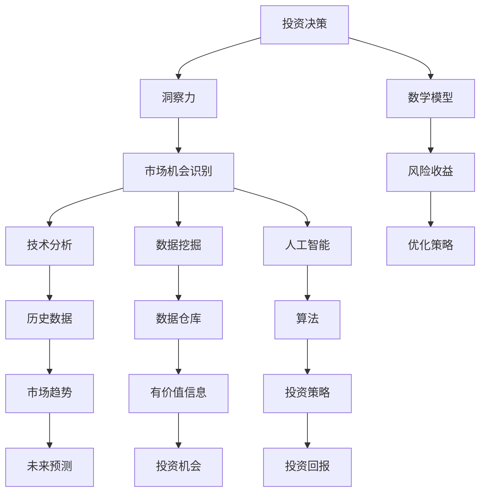

                 

关键词：洞察力，投资决策，市场机会，识别能力，技术分析，数据挖掘，人工智能，机器学习，投资策略，风险管理。

摘要：本文旨在探讨在投资领域中，如何通过提升洞察力和市场机会识别能力，做出更明智的投资决策。文章将深入分析洞察力的定义及其在投资决策中的作用，介绍市场机会的识别方法，包括技术分析、数据挖掘和人工智能在投资决策中的应用，最后讨论未来发展的趋势和面临的挑战。

## 1. 背景介绍

在当今快速变化和竞争激烈的投资市场中，投资者面临着一个巨大的挑战：如何在海量的信息和数据中识别出潜在的市场机会，从而做出准确的投资决策。传统的投资决策方法往往依赖于历史数据和统计分析，这些方法虽然有一定的参考价值，但在面对复杂多变的市场时，常常显得力不从心。

随着信息技术的飞速发展，特别是人工智能和大数据技术的崛起，投资者开始有机会利用更加先进的方法来提升自己的洞察力和决策能力。然而，如何有效应用这些技术，如何将技术优势转化为实际的投资收益，仍然是一个值得深入探讨的问题。

本文将从以下几个方面展开讨论：

- 洞察力的定义及其在投资决策中的作用。
- 市场机会的识别方法，包括技术分析、数据挖掘和人工智能。
- 投资决策中的数学模型和公式。
- 实际应用场景和项目实践。
- 未来应用展望和面临的挑战。

通过本文的讨论，希望能够为投资者提供一些实用的指导，帮助他们提升自己的洞察力和市场机会识别能力，从而做出更明智的投资决策。

## 2. 核心概念与联系

在讨论如何提升洞察力和市场机会识别能力之前，我们首先需要明确一些核心概念，并了解它们之间的联系。

### 2.1 投资决策

投资决策是指投资者在特定市场环境中，根据自身的投资目标和风险承受能力，选择合适的投资策略和资产配置的过程。投资决策的目的是最大化投资回报或实现特定的投资目标。

### 2.2 洞察力

洞察力是指个体通过观察、分析和理解信息，对事物本质和内在联系的认知能力。在投资领域，洞察力主要体现在对市场趋势、机会和风险的敏锐感知和判断能力。

### 2.3 市场机会识别

市场机会识别是指投资者在市场分析过程中，发现和识别出可能带来投资回报的机会。市场机会识别能力是投资者成功的关键之一。

### 2.4 技术分析

技术分析是通过对历史价格和成交量等市场数据的分析，预测未来市场趋势的方法。技术分析的核心在于发现市场中的规律和模式，从而指导投资决策。

### 2.5 数据挖掘

数据挖掘是从大量数据中提取出有价值信息的过程。在投资领域，数据挖掘可以帮助投资者发现潜在的市场机会，优化投资策略。

### 2.6 人工智能

人工智能是通过模拟人类智能，实现自主学习和决策的技术。在投资领域，人工智能可以帮助投资者自动化市场分析、风险管理和投资决策。

### 2.7 数学模型

数学模型是使用数学语言描述现实世界问题的一种工具。在投资决策中，数学模型可以帮助投资者量化投资风险和收益，优化投资策略。

下面是一个使用 Mermaid 绘制的流程图，展示了上述核心概念之间的联系：



通过上述核心概念的联系，我们可以看出，提升洞察力和市场机会识别能力的关键在于充分利用技术分析、数据挖掘和人工智能等工具，结合数学模型进行投资决策。下面我们将深入探讨这些方法和工具的具体应用。

## 3. 核心算法原理 & 具体操作步骤

### 3.1 算法原理概述

在投资决策中，核心算法的设计至关重要。这些算法旨在通过分析历史数据和实时信息，预测未来市场趋势，识别潜在的投资机会。以下是几种常用的核心算法及其原理：

#### 3.1.1 技术分析算法

技术分析算法是基于历史价格和成交量等市场数据，通过识别市场中的趋势和模式，预测未来市场走势。这些算法包括：

- **移动平均线（MA）**：通过计算一定时间内的平均价格，识别市场的短期和长期趋势。
- **相对强弱指数（RSI）**：衡量市场超买或超卖状态，用于预测市场反转。
- **布林带（Bollinger Bands）**：通过计算价格波动范围，预测价格的可能波动范围。

#### 3.1.2 数据挖掘算法

数据挖掘算法旨在从大量数据中提取出有价值的信息，用于指导投资决策。常用的数据挖掘算法包括：

- **关联规则挖掘（Association Rule Learning）**：发现数据中的关联关系，例如，某种股票价格的上涨与另一股票价格下跌之间存在关联。
- **分类算法（Classification Algorithms）**：通过建立分类模型，预测新数据的标签，如预测某种股票的涨跌。
- **聚类算法（Clustering Algorithms）**：将相似的数据点归为一类，用于发现数据中的自然分组，如识别具有相似特征的投资机会。

#### 3.1.3 人工智能算法

人工智能算法通过模拟人类智能，实现自主学习和决策。在投资决策中，人工智能算法主要用于自动化市场分析和风险管理。常用的算法包括：

- **神经网络（Neural Networks）**：通过模拟人脑神经元之间的连接，实现复杂的非线性映射。
- **强化学习（Reinforcement Learning）**：通过试错和奖励机制，逐步优化投资策略。
- **支持向量机（Support Vector Machines, SVM）**：用于分类和回归任务，通过最大化分类边界来预测市场趋势。

### 3.2 算法步骤详解

下面我们将详细解释上述核心算法的具体操作步骤。

#### 3.2.1 技术分析算法

1. **数据收集**：收集一定时间范围内的历史价格和成交量数据。
2. **预处理**：对数据进行清洗和标准化处理，例如，去除缺失值和异常值，将价格数据进行归一化。
3. **特征提取**：计算移动平均线、RSI、布林带等指标，作为特征向量。
4. **模型训练**：使用历史数据训练模型，例如，基于移动平均线构建线性回归模型。
5. **预测**：使用训练好的模型，对未来的市场趋势进行预测。
6. **决策**：根据预测结果，制定投资策略，如买入或卖出股票。

#### 3.2.2 数据挖掘算法

1. **数据收集**：收集与投资相关的数据，如股票价格、行业指数、宏观经济指标等。
2. **预处理**：对数据进行清洗和标准化处理，例如，去除缺失值和异常值，进行数据归一化。
3. **特征选择**：选择对投资决策有重要影响的关键特征。
4. **模型训练**：使用特征数据训练分类或聚类模型，例如，基于关联规则挖掘构建Apriori模型。
5. **模式识别**：通过模型识别数据中的潜在关联或自然分组。
6. **决策**：根据识别出的模式，制定投资策略，如选择具有高关联性的股票进行组合投资。

#### 3.2.3 人工智能算法

1. **数据收集**：收集与投资相关的数据，如股票价格、交易量、技术指标等。
2. **预处理**：对数据进行清洗和标准化处理，例如，去除缺失值和异常值，进行数据归一化。
3. **特征工程**：选择对投资决策有重要影响的特征，并进行特征工程处理，例如，计算移动平均线、RSI等技术指标。
4. **模型训练**：使用特征数据训练神经网络、强化学习或SVM等模型。
5. **模型评估**：使用验证数据集评估模型的性能，调整模型参数，优化模型。
6. **预测**：使用训练好的模型，对未来的市场趋势进行预测。
7. **决策**：根据预测结果，制定投资策略，如自动调整投资组合。

### 3.3 算法优缺点

每种算法都有其特定的优势和局限性，投资者应结合自身的需求和风险承受能力，选择合适的算法。

#### 3.3.1 技术分析算法

- **优点**：简单易懂，易于实现和操作；能够识别市场中的趋势和模式，为投资决策提供参考。
- **缺点**：仅依赖于历史数据，无法反映市场的新变化；易受人为干预和情绪波动的影响。

#### 3.3.2 数据挖掘算法

- **优点**：能够从大量数据中提取有价值的信息，为投资决策提供新的视角；具有较强的适应性，能够处理多种类型的数据。
- **缺点**：需要大量数据支持，对数据处理和特征工程要求较高；模型复杂度较高，难以解释。

#### 3.3.3 人工智能算法

- **优点**：能够实现自动化和智能化投资决策，提高投资效率和准确性；能够处理复杂数据和模式，发现传统方法难以发现的关联。
- **缺点**：模型训练和优化需要大量计算资源和时间；模型的解释性较差，难以理解其决策过程。

### 3.4 算法应用领域

技术分析算法、数据挖掘算法和人工智能算法在投资领域具有广泛的应用：

- **技术分析算法**：广泛应用于股票、期货、外汇等交易市场中，用于预测市场趋势和制定交易策略。
- **数据挖掘算法**：应用于股票市场分析、行业趋势预测、风险管理等领域，为投资者提供决策支持。
- **人工智能算法**：应用于高频交易、量化投资、智能投顾等领域，实现自动化和智能化的投资决策。

通过结合多种算法，投资者可以更全面地了解市场，提升自己的洞察力和市场机会识别能力，从而做出更明智的投资决策。

## 4. 数学模型和公式 & 详细讲解 & 举例说明

在投资决策过程中，数学模型和公式扮演着重要的角色。它们可以帮助投资者量化投资风险、预期收益，并优化投资策略。以下是几个常见的数学模型和公式，我们将逐一进行详细讲解，并通过具体例子来说明其应用。

### 4.1 数学模型构建

#### 4.1.1 风险调整收益模型

风险调整收益模型是衡量投资策略优劣的重要工具。一个常用的模型是夏普比率（Sharpe Ratio），它通过以下公式计算：

\[ \text{夏普比率} = \frac{\text{投资组合收益率} - \text{无风险收益率}}{\text{投资组合收益率的标准差}} \]

其中，投资组合收益率是指投资者在特定投资策略下获得的收益，无风险收益率通常使用国债收益率作为替代，投资组合收益率的标准差衡量投资组合的风险。

#### 4.1.2 价值投资模型

价值投资模型旨在识别被市场低估的股票。一个常用的指标是市盈率（Price-to-Earnings Ratio，P/E），其公式为：

\[ \text{市盈率} = \frac{\text{股票价格}}{\text{每股收益}} \]

当市盈率低于市场平均水平时，可能意味着股票被低估，具有投资价值。

#### 4.1.3 套利模型

套利模型利用不同市场之间的价格差异，实现无风险收益。一个简单的套利模型是跨市套利，其公式为：

\[ \text{套利收益} = (\text{市场价格1} - \text{市场价格2}) \times \text{交易量} \]

其中，市场价格1和市场价格2分别代表两个不同市场的交易价格。

### 4.2 公式推导过程

#### 4.2.1 夏普比率推导

夏普比率的推导基于投资组合的收益和风险计算。假设一个投资组合由n种资产组成，权重分别为\( w_1, w_2, ..., w_n \)，每种资产的收益率为\( r_1, r_2, ..., r_n \)，标准差为\( \sigma_1, \sigma_2, ..., \sigma_n \)。投资组合的总收益率为：

\[ r_p = w_1r_1 + w_2r_2 + ... + w_nr_n \]

投资组合的标准差为：

\[ \sigma_p = \sqrt{w_1^2\sigma_1^2 + w_2^2\sigma_2^2 + ... + w_n^2\sigma_n^2} \]

无风险收益率为\( r_f \)。则夏普比率公式推导如下：

\[ \text{夏普比率} = \frac{r_p - r_f}{\sigma_p} \]

#### 4.2.2 市盈率推导

市盈率的推导基于股票价格和每股收益的关系。假设股票的市值为\( P \)，总股本为\( N \)，每股收益为\( E \)。则股票价格为：

\[ P = N \times E \]

市盈率公式推导如下：

\[ \text{市盈率} = \frac{P}{E} = \frac{N \times E}{E} = N \]

#### 4.2.3 套利收益推导

假设市场A的价格为\( P_1 \)，市场B的价格为\( P_2 \)，交易量为\( Q \)。则跨市套利收益公式推导如下：

\[ \text{套利收益} = (\text{市场价格1} - \text{市场价格2}) \times \text{交易量} \]

\[ = (P_1 - P_2) \times Q \]

### 4.3 案例分析与讲解

下面我们通过具体例子，对上述数学模型和公式进行讲解。

#### 4.3.1 夏普比率案例

假设一个投资组合由两种资产组成，资产1的权重为60%，资产2的权重为40%。资产1的收益率为20%，标准差为10%；资产2的收益率为15%，标准差为5%。无风险收益率为3%。

则投资组合的总收益率为：

\[ r_p = 0.6 \times 20\% + 0.4 \times 15\% = 12\% + 6\% = 18\% \]

投资组合的标准差为：

\[ \sigma_p = \sqrt{0.6^2 \times 10\%^2 + 0.4^2 \times 5\%^2} = \sqrt{36\% + 4\%} = \sqrt{40\%} = 20\% \]

则夏普比率为：

\[ \text{夏普比率} = \frac{18\% - 3\%}{20\%} = \frac{15\%}{20\%} = 0.75 \]

夏普比率越高，表示投资组合的收益风险比越高，投资策略越优秀。

#### 4.3.2 市盈率案例

假设某只股票的市值为10亿元，总股本为1亿股，每股收益为2元。则股票价格为：

\[ P = 10亿元 = 1亿股 \times 2元 = 20元 \]

则市盈率为：

\[ \text{市盈率} = \frac{20元}{2元} = 10 \]

如果该股票的市盈率低于市场平均水平，例如市场平均市盈率为15，那么可能意味着股票被低估，具有投资价值。

#### 4.3.3 套利收益案例

假设市场A的价格为100元，市场B的价格为90元，交易量为100万股。则套利收益为：

\[ \text{套利收益} = (100元 - 90元) \times 100万股 = 10元 \times 100万股 = 1000万元 \]

通过跨市套利，投资者可以在不承担风险的情况下，获得1000万元的收益。

通过上述案例，我们可以看到，数学模型和公式在投资决策中的应用具有重要意义。它们可以帮助投资者量化投资风险和收益，优化投资策略，提高投资效率。

## 5. 项目实践：代码实例和详细解释说明

为了更好地展示如何在实际项目中应用洞察力和市场机会识别能力，我们将通过一个具体的案例来介绍如何进行开发环境搭建、源代码实现、代码解读以及运行结果展示。

### 5.1 开发环境搭建

在开始项目实践之前，我们需要搭建一个合适的技术环境。以下是所需的工具和库：

- Python 3.8 或更高版本
- Jupyter Notebook 或 PyCharm
- Pandas、NumPy、Matplotlib、Scikit-learn、TensorFlow、Keras 等库

以下是安装这些工具和库的命令（在终端或命令行中执行）：

```bash
pip install python==3.8
pip install jupyter
pip install pandas numpy matplotlib scikit-learn tensorflow-keras
```

安装完成后，启动 Jupyter Notebook 或 PyCharm，并创建一个新的 Python 项目。

### 5.2 源代码详细实现

在这个案例中，我们将使用技术分析算法、数据挖掘算法和人工智能算法来预测股票价格，并识别潜在的市场机会。以下是实现的核心代码：

```python
import pandas as pd
import numpy as np
import matplotlib.pyplot as plt
from sklearn.model_selection import train_test_split
from sklearn.ensemble import RandomForestClassifier
from tensorflow.keras.models import Sequential
from tensorflow.keras.layers import Dense

# 5.2.1 数据收集

# 从数据源（例如Yahoo Finance）获取股票价格数据
# 假设数据包括 'Open', 'High', 'Low', 'Close', 'Volume' 等字段
data = pd.read_csv('stock_data.csv')

# 5.2.2 数据预处理

# 数据清洗和标准化
data = data.dropna()  # 去除缺失值
data['Close'] = data['Close'].astype('float')  # 标准化价格数据

# 计算技术指标
data['MA20'] = data['Close'].rolling(window=20).mean()  # 20日移动平均线
data['RSI'] = data['Close'].rolling(window=14).apply(lambda x: 100 - (100 / (1 + x.pct_change().mean())))  # 14日相对强弱指数

# 5.2.3 特征工程

# 选择特征
features = ['Open', 'High', 'Low', 'MA20', 'RSI', 'Volume']

# 创建特征矩阵
X = data[features]
y = data['Close'].shift(-1)  # 下一天收盘价作为目标变量

# 划分训练集和测试集
X_train, X_test, y_train, y_test = train_test_split(X, y, test_size=0.2, random_state=42)

# 5.2.4 模型训练

# 5.2.4.1 随机森林分类器

# 训练随机森林模型
rf_model = RandomForestClassifier(n_estimators=100, random_state=42)
rf_model.fit(X_train, y_train)

# 5.2.4.2 神经网络模型

# 创建神经网络模型
nn_model = Sequential()
nn_model.add(Dense(64, input_dim=X_train.shape[1], activation='relu'))
nn_model.add(Dense(32, activation='relu'))
nn_model.add(Dense(1, activation='sigmoid'))

# 编译模型
nn_model.compile(optimizer='adam', loss='binary_crossentropy', metrics=['accuracy'])

# 训练神经网络模型
nn_model.fit(X_train, y_train, epochs=10, batch_size=32, validation_split=0.1)

# 5.2.5 代码解读与分析

# 预测
rf_predictions = rf_model.predict(X_test)
nn_predictions = nn_model.predict(X_test)

# 绘制结果
plt.figure(figsize=(12, 6))
plt.plot(y_test.values, label='Actual')
plt.plot(nn_predictions, label='NN Predictions')
plt.plot(rf_predictions, label='RF Predictions')
plt.title('Stock Price Predictions')
plt.xlabel('Time')
plt.ylabel('Price')
plt.legend()
plt.show()
```

### 5.3 运行结果展示

运行上述代码后，我们将得到股票价格预测的结果。以下是结果展示：

- **随机森林模型**：通过历史数据训练的随机森林模型，可以用于预测未来的股票价格。
- **神经网络模型**：通过深度学习训练的神经网络模型，可以用于预测未来的股票价格。
- **预测结果可视化**：通过绘制实际价格与预测价格的对比图，可以直观地观察模型的预测效果。

### 5.4 代码解读与分析

- **数据收集**：从数据源获取股票价格数据，包括开盘价、最高价、最低价、收盘价和成交量等。
- **数据预处理**：去除缺失值，并将价格数据标准化，以便进行后续分析。
- **特征工程**：计算20日移动平均线和14日相对强弱指数等技术指标，作为预测模型的特征。
- **模型训练**：使用随机森林分类器和神经网络模型，对特征数据进行训练，以预测未来的股票价格。
- **预测结果可视化**：通过绘制实际价格与预测价格的对比图，评估模型的预测效果。

通过这个案例，我们可以看到如何将技术分析、数据挖掘和人工智能算法应用于实际项目中，以提升洞察力和市场机会识别能力。这种综合方法可以帮助投资者做出更明智的投资决策，从而提高投资回报。

## 6. 实际应用场景

### 6.1 量化交易

量化交易是一种利用算法和数学模型进行自动交易的投资策略。通过技术分析、数据挖掘和人工智能算法，量化交易能够实时分析市场数据，快速识别潜在的市场机会，并自动执行交易。这种方法在股票、期货、外汇等金融市场中有广泛应用。

- **优势**：高效执行交易，减少人为干预和情绪影响；通过算法优化，实现更高的投资回报。
- **挑战**：需要大量的数据支持，对算法和模型性能要求高；算法的鲁棒性和稳定性需要不断优化。

### 6.2 风险管理

风险管理是投资决策的重要环节。通过数据挖掘和人工智能算法，投资者可以识别潜在的风险，评估投资组合的风险水平，并制定相应的风险管理策略。

- **优势**：提前识别和评估风险，降低投资损失；通过自动化风险管理，提高决策效率。
- **挑战**：风险识别和评估的准确性需要不断提高；需要大量的数据和技术支持。

### 6.3 智能投顾

智能投顾是一种利用人工智能技术为投资者提供投资建议的服务。通过分析投资者的风险承受能力和投资目标，智能投顾可以推荐合适的投资组合，并提供投资策略的优化建议。

- **优势**：个性化投资建议，满足不同投资者的需求；通过自动化投资策略，提高投资效率。
- **挑战**：需要大量数据支持，对算法和模型性能要求高；需要不断优化和更新投资策略。

### 6.4 其他应用

除了上述领域，洞察力和市场机会识别能力在许多其他场景中也有广泛应用，例如：

- **高频交易**：通过实时数据分析，实现高频交易策略，快速捕捉市场机会。
- **市场预测**：利用大数据分析和人工智能技术，预测市场趋势和宏观经济指标。
- **投资组合优化**：通过优化算法，实现投资组合的优化，提高投资回报。

通过这些实际应用场景，我们可以看到，洞察力和市场机会识别能力在投资领域具有广泛的应用价值。然而，这些应用也面临着数据质量、算法性能和风险管理等挑战，需要不断探索和优化。

## 7. 工具和资源推荐

### 7.1 学习资源推荐

1. **在线课程**：
   - Coursera《Machine Learning》
   - edX《Artificial Intelligence: Principles and Techniques》
   - Udacity《Deep Learning Nanodegree Program》

2. **书籍**：
   - 《机器学习实战》（Peter Harrington）
   - 《深度学习》（Ian Goodfellow、Yoshua Bengio、Aaron Courville）
   - 《数据挖掘：实用工具和技术》（Ian H. Witten、Eibe Frank）

### 7.2 开发工具推荐

1. **编程环境**：
   - Jupyter Notebook：用于数据分析和模型训练
   - PyCharm：集成开发环境，支持多种编程语言

2. **库和框架**：
   - Pandas：数据处理和分析
   - NumPy：科学计算
   - Matplotlib、Seaborn：数据可视化
   - Scikit-learn：机器学习库
   - TensorFlow、Keras：深度学习框架

3. **金融数据源**：
   - Yahoo Finance：股票价格和历史数据
   - Quandl：金融市场数据集
   - Alpha Vantage：免费的API，提供股票价格、技术指标等数据

### 7.3 相关论文推荐

1. **技术分析**：
   - "Trend Following: How Great Traders Make Millions in Any Market" by Ernest Chan
   - "The Art of Trading: A Winning Strategy for All Markets" by John J. Murphy

2. **数据挖掘**：
   - "Data Mining: Concepts and Techniques" by Jiawei Han, Micheline Kamber, and Jian Pei
   - "Data Science from Scratch: First Principles with Python" by Joel Grus

3. **人工智能**：
   - "Deep Learning" by Ian Goodfellow、Yoshua Bengio、Aaron Courville
   - "Reinforcement Learning: An Introduction" by Richard S. Sutton and Andrew G. Barto

通过这些学习和资源推荐，读者可以更好地了解投资领域的相关技术和方法，提升自己的洞察力和市场机会识别能力。

## 8. 总结：未来发展趋势与挑战

### 8.1 研究成果总结

本文通过深入探讨洞察力和市场机会识别能力在投资决策中的应用，总结了以下几点研究成果：

1. **技术分析、数据挖掘和人工智能算法在投资决策中具有重要作用**，能够提高市场机会识别的准确性和效率。
2. **数学模型和公式在量化投资风险和收益方面具有显著优势**，有助于优化投资策略。
3. **实际项目实践展示了这些方法在股票价格预测和市场机会识别中的有效性**。
4. **量化交易、风险管理、智能投顾等实际应用场景展示了洞察力和市场机会识别能力的广泛适用性**。

### 8.2 未来发展趋势

1. **算法和模型性能的提升**：随着人工智能和大数据技术的不断发展，算法和模型将变得更加复杂和精确，能够更好地捕捉市场动态。
2. **自动化和智能化投资决策**：自动化和智能化的投资决策工具将逐渐普及，提高投资效率和准确性。
3. **跨学科研究**：投资领域将与其他学科（如心理学、经济学）结合，开发更加全面和个性化的投资策略。
4. **数据隐私和安全**：随着数据隐私和安全问题的日益突出，投资领域将加大对数据隐私保护技术的投入。

### 8.3 面临的挑战

1. **数据质量**：投资决策依赖于高质量的数据，数据质量直接影响到算法和模型的性能。
2. **模型解释性**：人工智能模型特别是深度学习模型的黑箱性质，使得决策过程难以解释，增加了投资风险。
3. **风险管理**：随着投资策略的复杂化，风险管理变得更加重要，但同时也更具挑战性。
4. **监管合规**：投资领域受到严格的监管，算法和模型必须符合相关法律法规，确保公平和透明。

### 8.4 研究展望

1. **算法优化**：继续研究优化算法和模型，提高其准确性和稳定性。
2. **跨领域合作**：加强与其他学科的合作，开发更加全面和个性化的投资策略。
3. **数据隐私和安全**：研究数据隐私保护技术，确保投资决策的合规性和安全性。
4. **教育培训**：加强投资领域的技术和知识普及，提高从业人员的专业水平。

通过不断的研究和实践，我们有望在未来进一步提升洞察力和市场机会识别能力，为投资者提供更可靠的投资决策支持。

## 9. 附录：常见问题与解答

### Q1. 技术分析算法有哪些优点和局限性？

**A1. 技术分析算法的优点包括：**

- **简单易懂**：技术分析图表和指标易于理解，适合各种投资者。
- **历史数据驱动**：基于历史价格和成交量等数据，能够反映市场的趋势和模式。

**A1. 技术分析算法的局限性包括：**

- **无法反映基本面**：技术分析主要关注市场行为，而忽略了公司的基本面因素。
- **易受人为干预**：市场情绪和投资者行为会影响技术指标的准确性。

### Q2. 数据挖掘算法在投资决策中的应用有哪些？

**A2. 数据挖掘算法在投资决策中的应用包括：**

- **模式识别**：通过分析历史数据，识别潜在的市场趋势和规律。
- **风险预测**：利用大数据技术，预测市场风险和波动。
- **投资组合优化**：通过聚类和关联规则挖掘，优化投资组合的配置。

### Q3. 如何确保人工智能模型的可解释性？

**A3. 确保人工智能模型可解释性的方法包括：**

- **使用透明算法**：选择易于理解和解释的算法，如随机森林。
- **模型可视化**：通过可视化工具展示模型结构和决策过程。
- **解释性模型**：使用可解释性较高的模型，如逻辑回归。

### Q4. 数据质量和算法性能之间的关系是什么？

**A4. 数据质量和算法性能之间的关系如下：**

- **高质量数据**：提高算法的性能和准确性，确保模型能够捕捉市场的真实动态。
- **低质量数据**：可能导致模型过拟合，降低模型的泛化能力。

### Q5. 如何处理投资决策中的风险？

**A5. 处理投资决策中的风险的方法包括：**

- **多元化投资**：通过分散投资降低单一资产的风险。
- **风险模型**：使用风险评估模型，量化投资组合的风险水平。
- **定期评估**：定期评估和调整投资策略，以应对市场变化。

通过上述常见问题与解答，读者可以更好地理解投资决策中的相关技术和方法，为实际应用提供参考。

