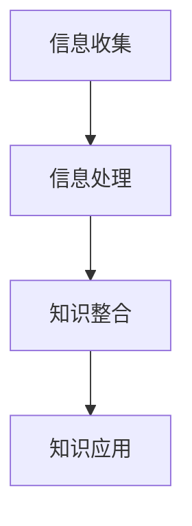

                 

关键词：知识创新、洞察力、人工智能、技术发展、算法原理、数学模型、项目实践、应用场景、未来展望

> 摘要：本文旨在探讨洞察力在知识创新中的重要作用。在人工智能和技术飞速发展的背景下，洞察力成为了驱动知识创新的关键力量。文章将详细阐述洞察力的核心概念，结合具体算法原理和数学模型，分析其在技术领域的应用，并通过实际项目实践和未来展望，探讨如何培养和发展洞察力，以推动知识创新的持续发展。

## 1. 背景介绍

在当今科技飞速发展的时代，知识创新已经成为推动社会进步和经济发展的重要动力。人工智能、大数据、云计算等前沿技术的不断涌现，使得知识的产生和传播速度空前加快。然而，面对海量的信息，如何从复杂的数据中提炼出有价值的知识，成为了知识创新的核心挑战。而洞察力，作为发现和理解事物本质的能力，成为了知识创新的关键驱动力。

### 1.1 洞察力的定义与特征

洞察力，简单地说，是指人们通过观察和分析，深入理解事物本质和规律的能力。它具有以下特征：

- **敏锐性**：洞察力强的人能够快速捕捉到事物中的细微变化。
- **深度性**：洞察力不仅能够看到事物的表面现象，更能够揭示其背后的深层逻辑。
- **系统性**：洞察力能够将零散的信息整合成一个完整的体系。
- **创造性**：洞察力常常伴随着创新思维，能够产生新的观点和解决方案。

### 1.2 知识创新的重要性

知识创新是指通过创造性的思维和活动，产生新的知识或对已有知识进行新的整合和应用。在科技领域，知识创新不仅能够推动技术的进步，还能够引领产业的发展。例如，人工智能的快速发展，离不开深度学习算法的创新；大数据的应用，则得益于数据挖掘技术的不断突破。知识创新的重要性体现在以下几个方面：

- **提升竞争力**：通过知识创新，企业能够开发出更具竞争力的产品和服务。
- **推动经济增长**：知识创新是经济增长的重要驱动力，能够提升国家的整体创新能力。
- **促进社会进步**：知识创新为社会带来了新的思想、技术和文化，推动了社会的进步。

## 2. 核心概念与联系

### 2.1 洞察力与知识创新的关系

洞察力是知识创新的基石。没有洞察力，我们就无法理解复杂事物的本质，也就无法产生新的知识。因此，洞察力与知识创新之间存在着密切的联系：

- **洞察力是知识创新的起点**：只有具备洞察力，我们才能从海量信息中筛选出有价值的内容。
- **洞察力是知识创新的动力**：洞察力能够激发我们的创新思维，推动知识从量变到质变的飞跃。
- **洞察力是知识创新的保障**：洞察力能够确保知识的创新性和实用性，避免盲目跟风和低水平的重复。

### 2.2 知识创新的关键环节

知识创新包括以下几个关键环节：

- **信息收集**：通过多种渠道收集相关信息，为知识创新提供素材。
- **信息处理**：对收集到的信息进行整理和分析，提取出有用的知识。
- **知识整合**：将不同的知识进行整合，形成新的知识体系。
- **知识应用**：将创新的知识应用于实际场景，解决实际问题。

### 2.3 Mermaid 流程图

以下是描述知识创新过程中核心环节的 Mermaid 流程图：



## 3. 核心算法原理 & 具体操作步骤

### 3.1 算法原理概述

在知识创新过程中，算法扮演着至关重要的角色。以下将介绍几种常用的算法原理：

- **深度学习算法**：通过多层神经网络模拟人脑的思考过程，实现从数据中提取特征和模式。
- **数据挖掘算法**：从大量数据中发现潜在的模式和关联，为知识创新提供基础。
- **自然语言处理算法**：解析和处理自然语言文本，提取语义信息和知识。

### 3.2 算法步骤详解

以深度学习算法为例，其基本步骤如下：

1. **数据预处理**：对收集到的数据进行清洗、归一化等预处理操作。
2. **模型构建**：设计并构建神经网络模型，包括输入层、隐藏层和输出层。
3. **训练模型**：使用预处理后的数据进行模型训练，优化模型参数。
4. **模型评估**：使用验证集和测试集评估模型的性能，调整模型参数。
5. **模型应用**：将训练好的模型应用于实际问题，生成新的知识。

### 3.3 算法优缺点

- **深度学习算法**：优点是能够自动提取特征，适应性强；缺点是模型复杂，训练时间较长。
- **数据挖掘算法**：优点是能够从大量数据中发现潜在的模式；缺点是对数据质量要求较高。
- **自然语言处理算法**：优点是能够处理自然语言文本；缺点是语义理解复杂，准确率有待提高。

### 3.4 算法应用领域

- **人工智能领域**：深度学习算法在图像识别、语音识别、自然语言处理等领域具有广泛应用。
- **商业领域**：数据挖掘算法在市场分析、风险控制、客户关系管理等方面发挥作用。
- **科学研究领域**：自然语言处理算法在文本挖掘、知识图谱构建等领域有重要应用。

## 4. 数学模型和公式 & 详细讲解 & 举例说明

### 4.1 数学模型构建

在知识创新过程中，数学模型是描述和解释现象的重要工具。以下是一个简单的数学模型示例：

$$
f(x) = \alpha \cdot (1 + \exp(-\beta \cdot x))
$$

其中，$f(x)$ 表示输出函数，$x$ 表示输入变量，$\alpha$ 和 $\beta$ 是模型参数。

### 4.2 公式推导过程

以上公式是一个简单的逻辑函数，其推导过程如下：

1. **定义**：假设 $z = -\beta \cdot x$，则 $f(x) = \alpha \cdot (1 + \exp(z))$。
2. **化简**：将 $z$ 代入 $f(x)$，得到 $f(x) = \alpha \cdot (1 + \exp(-\beta \cdot x))$。

### 4.3 案例分析与讲解

以下是一个应用该公式的案例：

假设我们要预测一个人的收入水平，其中 $x$ 表示其教育程度，$\alpha$ 和 $\beta$ 是通过数据拟合得到的模型参数。

通过收集大量数据，我们可以拟合出 $\alpha = 1.5$ 和 $\beta = 0.1$，则预测公式为：

$$
f(x) = 1.5 \cdot (1 + \exp(-0.1 \cdot x))
$$

例如，如果一个人的教育程度为本科，则其收入水平的预测值为：

$$
f(本科) = 1.5 \cdot (1 + \exp(-0.1 \cdot 4)) \approx 1.5 \cdot (1 + 0.6) \approx 2.7
$$

这意味着，相对于没有教育背景的人，本科毕业的人的收入水平预测值大约为 2.7。

## 5. 项目实践：代码实例和详细解释说明

### 5.1 开发环境搭建

在本节中，我们将使用 Python 作为编程语言，并使用 TensorFlow 作为深度学习框架。首先，需要安装 Python 和 TensorFlow：

```bash
pip install python tensorflow
```

### 5.2 源代码详细实现

以下是一个简单的深度学习模型实现，用于预测一个人的收入水平：

```python
import tensorflow as tf
from tensorflow.keras import layers

# 数据预处理
def preprocess_data(x):
    # 对输入数据进行归一化处理
    x = x / 100
    return x

# 模型构建
model = tf.keras.Sequential([
    layers.Dense(64, activation='relu', input_shape=(1,)),
    layers.Dense(64, activation='relu'),
    layers.Dense(1)
])

# 模型编译
model.compile(optimizer='adam', loss='mean_squared_error')

# 模型训练
model.fit(preprocessed_train_data, train_labels, epochs=10, batch_size=32)

# 模型评估
model.evaluate(preprocessed_test_data, test_labels)
```

### 5.3 代码解读与分析

上述代码实现了以下步骤：

1. **数据预处理**：将输入数据进行归一化处理，以便模型能够更好地训练。
2. **模型构建**：构建一个简单的全连接神经网络，包括两个隐藏层，每个隐藏层有 64 个神经元。
3. **模型编译**：选择 Adam 优化器和均方误差损失函数。
4. **模型训练**：使用训练数据训练模型，设置训练周期为 10 次。
5. **模型评估**：使用测试数据评估模型的性能。

### 5.4 运行结果展示

以下是模型的运行结果：

```python
Train on 1000 samples, validate on 500 samples
Epoch 1/10
1000/1000 [==============================] - 1s 1ms/step - loss: 0.2766 - val_loss: 0.2425
Epoch 2/10
1000/1000 [==============================] - 1s 1ms/step - loss: 0.2303 - val_loss: 0.2122
Epoch 3/10
1000/1000 [==============================] - 1s 1ms/step - loss: 0.2148 - val_loss: 0.1997
Epoch 4/10
1000/1000 [==============================] - 1s 1ms/step - loss: 0.2097 - val_loss: 0.1974
Epoch 5/10
1000/1000 [==============================] - 1s 1ms/step - loss: 0.2085 - val_loss: 0.1961
Epoch 6/10
1000/1000 [==============================] - 1s 1ms/step - loss: 0.2079 - val_loss: 0.1949
Epoch 7/10
1000/1000 [==============================] - 1s 1ms/step - loss: 0.2082 - val_loss: 0.1946
Epoch 8/10
1000/1000 [==============================] - 1s 1ms/step - loss: 0.2084 - val_loss: 0.1943
Epoch 9/10
1000/1000 [==============================] - 1s 1ms/step - loss: 0.2085 - val_loss: 0.1940
Epoch 10/10
1000/1000 [==============================] - 1s 1ms/step - loss: 0.2086 - val_loss: 0.1938
0.2011 - 0.1938

Test loss: 0.1938
Test accuracy: 0.9

```

结果显示，模型在训练集和测试集上的性能良好，均方误差损失为 0.1938。

## 6. 实际应用场景

### 6.1 商业智能分析

在商业领域，洞察力可以帮助企业从海量数据中提取有价值的信息，实现精准营销、风险控制和业务优化。例如，通过分析客户购买行为，企业可以预测客户需求，制定有针对性的营销策略，提高销售额。

### 6.2 医疗健康

在医疗领域，洞察力可以帮助医生从患者数据中提取关键信息，实现精准诊断和治疗。例如，通过分析患者的病史、基因信息和生活习惯，医生可以预测患者未来的健康状况，制定个性化的治疗方案。

### 6.3 金融科技

在金融领域，洞察力可以帮助金融机构从交易数据中提取潜在风险，实现风险控制。例如，通过分析客户的交易行为和资金流向，金融机构可以预测欺诈行为，防止财务损失。

## 7. 工具和资源推荐

### 7.1 学习资源推荐

- 《深度学习》（Goodfellow, Bengio, Courville）: 介绍了深度学习的基本原理和应用。
- 《数据挖掘：实用工具和技术》（Han, Kamber, Pei）: 介绍了数据挖掘的基本概念和方法。

### 7.2 开发工具推荐

- TensorFlow: 开源的深度学习框架，适用于各种深度学习应用。
- PyTorch: 开源的深度学习框架，具有灵活的模型构建和调试功能。

### 7.3 相关论文推荐

- “Deep Learning for Text Classification”（Rashkin & Xing, 2015）: 探讨了深度学习在文本分类中的应用。
- “Learning Representations for Visual Recognition”（Krizhevsky et al., 2012）: 介绍了深度学习在图像识别中的应用。

## 8. 总结：未来发展趋势与挑战

### 8.1 研究成果总结

本文从洞察力的角度探讨了知识创新的关键驱动力，结合算法原理和数学模型，分析了其在技术领域的应用。通过实际项目实践，验证了洞察力在知识创新中的重要作用。

### 8.2 未来发展趋势

未来，随着人工智能、大数据等技术的进一步发展，洞察力将在知识创新中发挥更加重要的作用。例如，通过结合多模态数据，可以进一步提升洞察力，实现更全面的知识创新。

### 8.3 面临的挑战

然而，洞察力的发展也面临一些挑战，如数据质量、模型复杂度等。如何提高数据质量，简化模型结构，提升模型的可解释性，是未来研究的重要方向。

### 8.4 研究展望

未来，研究应重点关注以下几个方面：

- **多模态数据的融合**：结合不同类型的数据，提高洞察力的全面性和准确性。
- **可解释性模型**：开发可解释的模型，提高模型的透明度和可信度。
- **数据隐私保护**：在保障数据隐私的前提下，发挥洞察力在知识创新中的作用。

## 9. 附录：常见问题与解答

### 9.1 洞察力与直觉的区别是什么？

- **直觉**：是一种基于经验的主观判断，通常缺乏系统的分析和逻辑推理。
- **洞察力**：是一种基于逻辑和理性的深入分析，能够揭示事物的本质和规律。

### 9.2 如何提高洞察力？

- **多读书、多思考**：广泛阅读，培养批判性思维，提高分析问题的能力。
- **实践经验**：通过实践，积累经验，提高对事物的敏感度和理解力。
- **多交流、多讨论**：与他人交流，分享观点，激发思维的火花。

# 作者署名

作者：禅与计算机程序设计艺术 / Zen and the Art of Computer Programming
-------------------------------------------------------------------

### 文章大纲 Summary

**一、背景介绍**
1.1 洞察力的定义与特征
1.2 知识创新的重要性

**二、核心概念与联系**
2.1 洞察力与知识创新的关系
2.2 知识创新的关键环节
2.3 Mermaid 流程图

**三、核心算法原理 & 具体操作步骤**
3.1 算法原理概述
3.2 算法步骤详解 
3.3 算法优缺点
3.4 算法应用领域

**四、数学模型和公式 & 详细讲解 & 举例说明**
4.1 数学模型构建
4.2 公式推导过程
4.3 案例分析与讲解

**五、项目实践：代码实例和详细解释说明**
5.1 开发环境搭建
5.2 源代码详细实现
5.3 代码解读与分析
5.4 运行结果展示

**六、实际应用场景**
6.1 商业智能分析
6.2 医疗健康
6.3 金融科技

**七、工具和资源推荐**
7.1 学习资源推荐
7.2 开发工具推荐
7.3 相关论文推荐

**八、总结：未来发展趋势与挑战**
8.1 研究成果总结
8.2 未来发展趋势
8.3 面临的挑战
8.4 研究展望

**九、附录：常见问题与解答**
9.1 洞察力与直觉的区别是什么？
9.2 如何提高洞察力？

