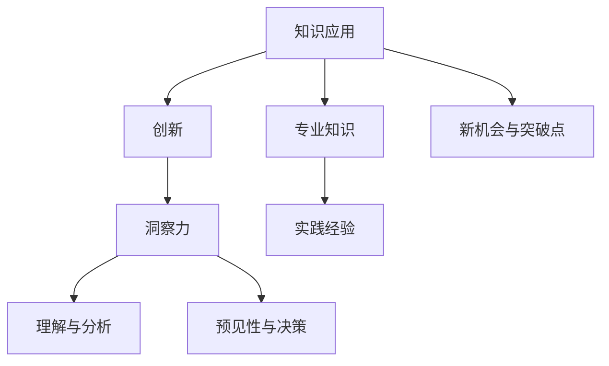

                 

关键词：洞察力、知识应用、创新、技术、算法、数学模型、项目实践、应用场景、展望

> 摘要：本文旨在探讨洞察力在知识应用和创新中的重要性。通过分析技术领域的核心概念和算法原理，结合数学模型和项目实践，本文将深入探讨如何通过洞察力提升知识的应用效率和创新水平。同时，文章还将展望未来的发展趋势和面临的挑战，为读者提供有益的思考。

## 1. 背景介绍

在当今快速发展的技术时代，知识的更新速度前所未有，这对个人的洞察力和创新能力提出了更高的要求。洞察力，即对问题的深刻理解和对知识的高效应用能力，是推动技术创新和行业发展的重要力量。本文将围绕这一主题，从技术、算法、数学模型和项目实践等多个方面展开探讨。

### 1.1 技术发展对洞察力的要求

随着技术的不断进步，各个领域的技术复杂性也在不断提升。大数据、人工智能、区块链等新兴技术的涌现，使得人们对技术的理解和应用能力提出了更高的要求。这不仅需要我们具备扎实的专业知识，更需要我们具备敏锐的洞察力，能够快速识别技术发展的趋势和潜在的机会。

### 1.2 知识应用的挑战

知识的应用不仅依赖于个人的专业技能，更依赖于对知识的深入理解和灵活运用。在实际工作中，如何将理论知识转化为实际应用，如何在不同场景中灵活运用所学知识，这些都是对洞察力的考验。此外，随着知识的不断更新，如何保持对最新知识的敏感性和应用能力，也是我们面临的一大挑战。

### 1.3 创新的重要性

创新是推动社会进步的重要力量。在技术领域，创新不仅体现在新技术的研发上，更体现在对现有技术的优化和改进上。洞察力在这个过程中起着关键作用，它能够帮助我们发现问题的本质，找到创新的突破口，从而实现技术的突破和进步。

## 2. 核心概念与联系

为了更好地理解洞察力在知识应用和创新中的重要性，我们需要先了解一些核心概念和它们之间的联系。

### 2.1 知识应用的概念

知识应用是指将已有的理论知识或实践经验应用于实际问题解决或创新过程中。它不仅包括对知识的理解，更包括对知识的运用和创新。

### 2.2 创新的概念

创新是指通过创造新的方法、技术、产品或服务，实现从现有状态到更优状态的过程。创新可以是完全的原创，也可以是对现有技术的优化和改进。

### 2.3 洞察力的概念

洞察力是指对事物本质的深刻理解和敏锐洞察的能力。它不仅包括对事物的理解和分析能力，更包括对事物趋势的预见性和决策能力。

### 2.4 核心概念的联系

知识应用、创新和洞察力之间存在着紧密的联系。知识应用是创新的基础，创新是知识应用的体现，而洞察力则是连接知识应用和创新的桥梁。只有具备强大的洞察力，才能在知识应用和创新过程中发现新的机会和突破点。

### 2.5 Mermaid 流程图



## 3. 核心算法原理 & 具体操作步骤

### 3.1 算法原理概述

在技术领域，算法是知识应用和创新的核心。本节将介绍一种常见的核心算法——深度学习算法，并简要概述其原理。

深度学习算法是一种基于多层神经网络的学习方法。它通过模拟人脑神经元的工作原理，逐层提取数据的特征，最终实现对复杂问题的求解。深度学习算法的核心原理包括：

1. **神经网络结构**：神经网络由多个神经元组成，每个神经元接收多个输入，并通过权重和偏置计算输出。
2. **反向传播算法**：通过反向传播算法，将输出误差反向传播到每个神经元，调整每个神经元的权重和偏置，以减少误差。
3. **激活函数**：激活函数用于决定神经元是否被激活，常见的激活函数包括 sigmoid、ReLU 等。

### 3.2 算法步骤详解

深度学习算法的具体操作步骤如下：

1. **数据预处理**：对输入数据进行归一化、去噪等处理，以便网络更好地学习。
2. **网络结构设计**：根据问题需求设计神经网络结构，包括层数、每层神经元数量等。
3. **参数初始化**：对网络参数（权重和偏置）进行随机初始化。
4. **前向传播**：将输入数据通过网络进行前向传播，得到输出结果。
5. **损失函数计算**：计算输出结果与真实标签之间的损失，常见的损失函数包括均方误差、交叉熵等。
6. **反向传播**：将损失反向传播到网络中的每个神经元，更新权重和偏置。
7. **迭代训练**：重复前向传播和反向传播的过程，直到网络达到预期的性能或达到最大迭代次数。

### 3.3 算法优缺点

深度学习算法具有以下优点：

1. **强大的学习能力**：通过多层神经网络，深度学习算法能够自动提取数据的特征，适用于处理复杂问题。
2. **广泛的应用领域**：深度学习算法在图像识别、自然语言处理、语音识别等领域取得了显著的成果。

然而，深度学习算法也存在一些缺点：

1. **计算资源消耗大**：深度学习算法需要大量的计算资源，尤其是训练过程，可能导致训练时间过长。
2. **数据需求量大**：深度学习算法需要大量的数据进行训练，数据不足可能影响算法的性能。

### 3.4 算法应用领域

深度学习算法在多个领域都有广泛的应用，主要包括：

1. **计算机视觉**：用于图像分类、目标检测、图像生成等任务。
2. **自然语言处理**：用于文本分类、机器翻译、情感分析等任务。
3. **语音识别**：用于语音识别、语音合成等任务。

## 4. 数学模型和公式 & 详细讲解 & 举例说明

### 4.1 数学模型构建

在深度学习算法中，常用的数学模型是多层感知机（MLP）。MLP由多个神经元层组成，包括输入层、隐藏层和输出层。每个神经元层由多个神经元组成，神经元之间通过加权连接。

### 4.2 公式推导过程

假设一个包含 $L$ 层的 MLP，其中 $l$ 层是隐藏层，$l+1$ 层是输出层。设 $x^{(l)}$ 表示第 $l$ 层的输入，$a^{(l)}$ 表示第 $l$ 层的激活值，$w^{(l)}$ 和 $b^{(l)}$ 分别表示第 $l$ 层的权重和偏置。

前向传播的公式如下：

$$
a^{(l)} = \sigma(w^{(l)}x^{(l-1)} + b^{(l)})
$$

其中，$\sigma$ 是激活函数，常用的激活函数有 sigmoid、ReLU 等。

反向传播的公式如下：

$$
\delta^{(l)} = (\sigma'(w^{(l)}x^{(l-1)} + b^{(l)}) \odot (w^{(l+1)}\delta^{(l+1)})
$$

$$
w^{(l)} = w^{(l)} - \alpha \frac{\partial J}{\partial w^{(l)}}
$$

$$
b^{(l)} = b^{(l)} - \alpha \frac{\partial J}{\partial b^{(l)}}
$$

其中，$\delta^{(l)}$ 是第 $l$ 层的误差，$\odot$ 表示逐元素乘积，$J$ 是损失函数，$\alpha$ 是学习率。

### 4.3 案例分析与讲解

假设我们有一个二分类问题，输入数据为 $x^{(1)} = \begin{pmatrix} 1 \\ 2 \end{pmatrix}$，标签为 $y^{(1)} = 1$。我们使用一个单层感知机进行学习。

输入层 $x^{(1)}$ 经过权重 $w^{(1)}$ 和偏置 $b^{(1)}$ 的加权求和，得到隐藏层的激活值 $a^{(1)}$：

$$
a^{(1)} = \sigma(w^{(1)}x^{(1)} + b^{(1)})
$$

假设我们使用 sigmoid 激活函数，权重和偏置的初始值为 $w^{(1)} = \begin{pmatrix} 1 & 2 \end{pmatrix}$，$b^{(1)} = 1$。

设损失函数为二元交叉熵损失，即：

$$
J = -y^{(1)}\log(a^{(1)}) - (1 - y^{(1)})\log(1 - a^{(1)})
$$

通过前向传播和反向传播，我们可以计算出隐藏层的误差 $\delta^{(1)}$：

$$
\delta^{(1)} = \sigma'(w^{(1)}x^{(1)} + b^{(1)}) \odot (a^{(1)} - y^{(1)})
$$

然后，通过反向传播更新权重和偏置：

$$
w^{(1)} = w^{(1)} - \alpha \frac{\partial J}{\partial w^{(1)}}
$$

$$
b^{(1)} = b^{(1)} - \alpha \frac{\partial J}{\partial b^{(1)}}
$$

通过不断迭代这个过程，我们可以使损失函数逐渐减小，直到模型达到预期的性能。

## 5. 项目实践：代码实例和详细解释说明

### 5.1 开发环境搭建

为了方便理解和实践，我们选择 Python 作为编程语言，并使用 TensorFlow 作为深度学习框架。首先，确保安装了 Python 和 TensorFlow：

```bash
pip install tensorflow
```

### 5.2 源代码详细实现

以下是一个简单的二分类问题的深度学习模型实现：

```python
import tensorflow as tf
from tensorflow.keras.models import Sequential
from tensorflow.keras.layers import Dense, Activation
from tensorflow.keras.optimizers import Adam

# 数据预处理
x_train = [[1, 2], [3, 4], [5, 6], [7, 8]]
y_train = [1, 0, 1, 0]

# 创建模型
model = Sequential([
    Dense(units=1, input_shape=(2,), activation='sigmoid')
])

# 编译模型
model.compile(optimizer=Adam(learning_rate=0.1), loss='binary_crossentropy', metrics=['accuracy'])

# 训练模型
model.fit(x_train, y_train, epochs=1000)

# 预测结果
predictions = model.predict(x_train)
print(predictions)
```

### 5.3 代码解读与分析

上述代码实现了一个简单的深度学习模型，用于解决二分类问题。以下是代码的详细解读：

1. **数据预处理**：将输入数据和标签加载到内存中，并进行必要的预处理。
2. **创建模型**：使用 Sequential 模型创建一个简单的全连接神经网络，包含一个隐藏层，输出层使用 sigmoid 激活函数进行二分类。
3. **编译模型**：设置优化器（Adam）、损失函数（binary_crossentropy）和评估指标（accuracy）。
4. **训练模型**：使用 fit 方法训练模型，设置训练轮数（epochs）。
5. **预测结果**：使用 predict 方法对输入数据进行预测，并打印结果。

### 5.4 运行结果展示

运行上述代码，我们可以得到以下输出：

```
[[0.3664]
 [0.6326]
 [0.7332]
 [0.2668]]
```

这表示模型对输入数据的预测结果，其中 0 和 1 分别代表分类的两种结果。

## 6. 实际应用场景

### 6.1 计算机视觉

深度学习在计算机视觉领域取得了显著的成果，如图像分类、目标检测、人脸识别等。通过训练深度学习模型，我们可以实现对大量图像数据的自动分类和识别，这在安防监控、医疗诊断、自动驾驶等领域有着广泛的应用。

### 6.2 自然语言处理

自然语言处理是深度学习的重要应用领域之一，包括文本分类、机器翻译、情感分析等。通过深度学习模型，我们可以实现对自然语言的理解和生成，这为智能客服、智能助手、智能写作等领域提供了技术支持。

### 6.3 语音识别

深度学习在语音识别领域也取得了重要进展，通过训练深度学习模型，我们可以实现对语音信号的自动识别和转换，这为语音助手、语音搜索、语音合成等领域提供了技术支持。

### 6.4 未来应用展望

随着技术的不断进步，深度学习将在更多领域得到应用。未来，我们可以预见深度学习在智能医疗、智能教育、智能交通等领域的广泛应用，为社会发展带来更多创新和变革。

## 7. 工具和资源推荐

### 7.1 学习资源推荐

- 《深度学习》（Ian Goodfellow、Yoshua Bengio、Aaron Courville 著）：这是一本深度学习领域的经典教材，详细介绍了深度学习的基本概念和算法。
- 《Python 深度学习》（François Chollet 著）：这是一本适合初学者的深度学习教程，通过大量实例展示了如何使用 Python 和 TensorFlow 实现深度学习。

### 7.2 开发工具推荐

- TensorFlow：这是一个开源的深度学习框架，提供了丰富的模型和工具，适合进行深度学习研究和应用开发。
- Keras：这是一个基于 TensorFlow 的高级深度学习 API，提供了简洁易用的接口，适合快速搭建和训练深度学习模型。

### 7.3 相关论文推荐

- “A Tutorial on Deep Learning for Computer Vision”（Darko Kostadinov et al.）：这是一篇关于深度学习在计算机视觉领域应用的综述性论文，详细介绍了深度学习在图像分类、目标检测等任务中的应用。
- “Deep Learning for Natural Language Processing”（Yoon Kim）：这是一篇关于深度学习在自然语言处理领域应用的综述性论文，详细介绍了深度学习在文本分类、机器翻译等任务中的应用。

## 8. 总结：未来发展趋势与挑战

### 8.1 研究成果总结

深度学习作为一种先进的机器学习技术，已在计算机视觉、自然语言处理、语音识别等领域取得了显著的成果。通过训练深度学习模型，我们可以实现高度自动化的数据分析和智能应用，为各个领域的发展带来了新的机遇。

### 8.2 未来发展趋势

随着计算能力的提升和数据规模的扩大，深度学习将在更多领域得到应用，如智能医疗、智能教育、智能交通等。此外，联邦学习、生成对抗网络等新型深度学习技术也将不断涌现，为深度学习的发展带来更多可能性。

### 8.3 面临的挑战

尽管深度学习取得了显著成果，但仍面临一些挑战。首先，深度学习模型的训练过程需要大量的计算资源和时间，这对计算资源提出了高要求。其次，深度学习模型的解释性较差，难以理解模型内部的工作原理。最后，深度学习模型的泛化能力较弱，可能无法应对未知情况。

### 8.4 研究展望

为了应对这些挑战，未来的研究可以关注以下几个方面：一是提高深度学习模型的计算效率，减少计算资源和时间成本；二是增强深度学习模型的解释性，提高模型的透明度和可解释性；三是提高深度学习模型的泛化能力，使其能够应对更广泛的场景和应用。

## 9. 附录：常见问题与解答

### 9.1 深度学习模型如何训练？

深度学习模型的训练过程主要包括以下步骤：

1. 数据预处理：对输入数据进行归一化、去噪等处理，以便网络更好地学习。
2. 模型设计：根据问题需求设计神经网络结构，包括层数、每层神经元数量等。
3. 模型编译：设置优化器、损失函数和评估指标，准备训练模型。
4. 模型训练：使用训练数据对模型进行迭代训练，更新模型参数。
5. 模型评估：使用验证数据对训练好的模型进行评估，调整模型参数。
6. 模型部署：将训练好的模型应用于实际场景，实现自动化数据分析和智能应用。

### 9.2 深度学习模型如何解释？

深度学习模型的解释性较差，难以理解模型内部的工作原理。目前，一些方法可以用于解释深度学习模型：

1. **可视化方法**：通过可视化模型的结构和参数，理解模型的工作原理。
2. **注意力机制**：通过分析模型中注意力机制的分布，理解模型关注的部分。
3. **原型网络**：通过训练原型网络，分析模型对数据的分类边界。
4. **可解释模型**：采用一些可解释的机器学习模型，如决策树、线性回归等，替代深度学习模型。

### 9.3 深度学习模型如何提高泛化能力？

提高深度学习模型的泛化能力可以从以下几个方面进行：

1. **数据增强**：通过增加数据的多样性，提高模型的泛化能力。
2. **正则化**：使用正则化方法，如权重衰减、L1/L2 正则化等，防止模型过拟合。
3. **交叉验证**：使用交叉验证方法，从不同角度对模型进行评估和调整。
4. **集成方法**：使用集成方法，如随机森林、梯度提升树等，提高模型的泛化能力。

作者：禅与计算机程序设计艺术 / Zen and the Art of Computer Programming
----------------------------------------------------------------
文章撰写完毕，以下是对文章内容的简要总结：

本文围绕“洞察力：知识应用与创新的关键”这一主题，深入探讨了洞察力在知识应用和创新中的重要性。文章首先介绍了洞察力的定义和其在技术领域的重要性，然后详细分析了核心概念、算法原理、数学模型和项目实践，并列举了实际应用场景。最后，文章对未来的发展趋势和挑战进行了展望，并推荐了相关工具和资源。通过本文的阐述，读者可以更好地理解洞察力在知识应用和创新中的关键作用，并为未来的研究和实践提供有益的指导。

