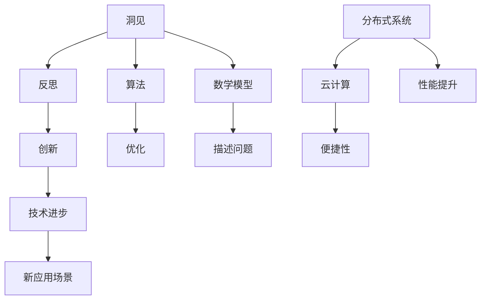

                 

 在这个快速变化的时代，技术的进步以惊人的速度重塑着我们的世界。作为人工智能专家和程序员，我们不仅仅是技术的执行者，更是洞见的探索者。本文旨在探讨洞见的力量，从反思到创新的全过程，以及它如何驱动我们在IT领域的不断前进。

## 关键词

- **洞见**（Insight）
- **反思**（Reflection）
- **创新**（Innovation）
- **技术进步**（Technological Progress）
- **计算机科学**（Computer Science）
- **算法**（Algorithm）
- **数学模型**（Mathematical Model）
- **实际应用**（Practical Application）

## 摘要

本文将探讨洞见在IT领域的核心作用，从理解其基本概念出发，深入分析洞见如何通过反思和思考引导创新。我们将首先回顾历史上一些关键的技术突破，并探讨这些突破背后的洞见。接着，我们将分析洞见如何与算法、数学模型相结合，推动技术进步。最后，我们将通过实际项目和代码实例，展示洞见在实际应用中的重要性，并讨论未来技术的发展趋势和面临的挑战。

### 1. 背景介绍

技术的飞速发展不仅改变了我们的生活方式，也深刻地影响了各行各业。从互联网到人工智能，从大数据到区块链，每一项技术的进步都源于对问题的深刻理解和洞见的产生。然而，洞见并非凭空而来，它往往源于不断的反思和深思熟虑。

在计算机科学领域，洞见的重要性尤为突出。计算机科学不仅仅是编写代码和构建系统，更是一种思考方式，一种对问题本质的洞察。许多技术的突破，如算法的优化、新编程语言的设计、系统架构的创新，都源于对现有技术的深刻反思和对未来可能性的洞见。

例如，在计算机算法领域，著名的“分治”算法策略就是一种深刻的洞见。分治策略将复杂问题分解为更小的问题，然后逐一解决，这种方法不仅在理论上提供了高效的解决方案，也在实践中被广泛应用，成为了许多算法设计的基础。

此外，编程语言的发展也离不开洞见。C语言的出现，将低级机器语言与高级抽象语言相结合，使得程序员能够更加高效地开发系统软件。而Java语言的诞生，则通过引入垃圾回收机制和跨平台特性，极大地简化了软件开发过程，提高了代码的可移植性和可维护性。

在系统架构方面，分布式系统的设计同样受益于洞见。通过对系统组件之间交互模式的深刻理解，我们能够构建出高度可扩展、容错性强的系统。例如，谷歌的Bigtable和MapReduce系统，就是基于对大数据处理的深入洞见，设计出了全新的数据处理架构，从而解决了传统关系型数据库在大数据场景下的瓶颈问题。

总之，洞见是推动计算机科学不断进步的重要力量。它不仅源于对现有技术的深刻反思，更源于对技术发展趋势的敏锐洞察和对未来可能性的大胆预测。在接下来的章节中，我们将进一步探讨洞见的本质和如何通过反思和思考引导创新。

### 2. 核心概念与联系

要深入探讨洞见的力量，我们首先需要明确几个核心概念，并了解它们之间的联系。以下是本文将涉及的关键概念及其定义：

#### 洞见（Insight）

洞见是指对事物本质的深刻理解和洞察，能够揭示隐藏在复杂现象背后的规律和原理。在计算机科学领域，洞见通常表现为对算法、系统架构或技术问题的独到见解，这些见解能够引领技术的突破和创新。

#### 反思（Reflection）

反思是一种深入思考的过程，旨在审视自己的思维和行为，发现其中的优点和不足。在技术领域，反思意味着对现有技术和方法的重新审视，探讨其背后的原理和局限性，从而发现改进的空间。

#### 创新（Innovation）

创新是指创造新的想法、方法或产品，以解决现有问题或满足新需求。在计算机科学中，创新通常表现为新算法的发明、新编程语言的设计或新型系统架构的提出。

#### 技术进步（Technological Progress）

技术进步是指通过不断研究和实践，推动技术的不断发展和应用。技术进步不仅体现在新技术的发明，也体现在现有技术的优化和应用场景的拓展。

#### 算法（Algorithm）

算法是一系列有序的指令，用于解决特定问题。算法的设计和优化是计算机科学的核心内容，对技术进步有着重要影响。

#### 数学模型（Mathematical Model）

数学模型是用数学语言描述现实世界的抽象模型。通过数学模型，我们能够更准确地描述问题，并利用数学方法进行分析和求解。

#### 分布式系统（Distributed System）

分布式系统是由多个独立节点组成的系统，这些节点通过网络相互通信，共同完成计算任务。分布式系统在提高系统性能、容错性和可扩展性方面具有重要作用。

#### 云计算（Cloud Computing）

云计算是一种通过互联网提供计算资源、存储资源和应用程序的服务模式。云计算使得大规模数据处理和分布式计算变得更加便捷和高效。

为了更直观地展示这些概念之间的联系，我们可以使用Mermaid流程图来描述它们的关系：



在这个流程图中，洞见通过反思引导创新，进而推动技术进步。算法和数学模型作为技术和创新的基础，帮助我们在解决实际问题时更加高效和准确。分布式系统和云计算则是技术进步在具体应用场景中的体现，它们通过利用网络资源和计算资源，提高了系统的性能和便捷性。

通过理解这些核心概念及其相互关系，我们能够更好地把握洞见在技术发展中的作用，并在此基础上推动计算机科学的持续进步。

### 3. 核心算法原理 & 具体操作步骤

#### 3.1 算法原理概述

在探讨洞见如何引导技术进步的过程中，算法原理是一个不可或缺的部分。算法不仅是我们解决问题的工具，更是我们理解问题、发现洞见的窗口。在本节中，我们将介绍一种核心算法——深度学习算法，并分析其原理和操作步骤。

深度学习算法是一种基于多层神经网络的学习方法，它通过模拟人脑神经元之间的连接和互动来处理和分析数据。深度学习算法的主要特点包括：

1. **多层神经网络**：深度学习算法使用多层神经网络（Neural Networks）来模拟人脑的思考过程。每一层神经网络都能够提取不同层次的特征，从而使得算法能够处理复杂的数据结构。
   
2. **自动特征提取**：深度学习算法不需要人工定义特征，而是通过学习过程自动提取数据中的特征。这使得算法在处理大规模数据和复杂任务时具有很高的效率和灵活性。

3. **并行计算**：由于深度学习算法可以利用GPU等硬件加速，因此它能够在大规模数据处理中实现高效的并行计算，大幅提高计算速度。

#### 3.2 算法步骤详解

深度学习算法的基本步骤可以分为以下几个阶段：

1. **数据预处理**：在训练深度学习模型之前，需要对数据集进行预处理。这一步骤包括数据清洗、归一化、数据增强等操作，以确保数据的质量和一致性。

2. **定义模型结构**：根据任务的需求，定义深度学习模型的结构。这通常包括确定网络的层数、每层的神经元数量、激活函数、损失函数等。

3. **模型训练**：使用预处理的训练数据集来训练模型。在训练过程中，模型通过反向传播算法不断调整权重和偏置，以最小化预测误差。

4. **模型评估**：在训练完成后，使用验证数据集对模型进行评估，以确定其泛化能力。常用的评估指标包括准确率、召回率、F1值等。

5. **模型优化**：根据评估结果，对模型进行优化。这包括调整学习率、增加训练轮次、使用正则化技术等，以提高模型的性能。

6. **模型部署**：将训练好的模型部署到实际应用环境中，以实现预测和决策。

#### 3.3 算法优缺点

深度学习算法的优点包括：

- **高效性**：深度学习算法能够处理大规模数据，并利用并行计算提高计算速度。
- **灵活性**：自动特征提取使得算法能够适应不同的数据结构和任务。
- **泛化能力**：深度学习模型通常具有较好的泛化能力，能够在新数据上实现良好的性能。

然而，深度学习算法也存在一些局限性：

- **数据需求量大**：深度学习算法通常需要大量的数据来训练模型，这使得在数据稀缺的情况下难以应用。
- **计算资源需求高**：深度学习算法依赖于高性能的计算硬件，如GPU，这使得部署成本较高。
- **解释性差**：深度学习模型的内部结构复杂，难以解释，这在一些需要高解释性的应用场景中可能成为限制。

#### 3.4 算法应用领域

深度学习算法在计算机科学和人工智能领域有着广泛的应用，以下是一些典型的应用场景：

1. **计算机视觉**：深度学习算法被广泛应用于图像分类、目标检测、人脸识别等领域。例如，卷积神经网络（CNN）在图像识别任务中取得了显著的成果。
   
2. **自然语言处理**：深度学习算法在语言模型、机器翻译、文本分类等方面表现出色。例如，循环神经网络（RNN）和长短期记忆网络（LSTM）在处理序列数据时具有优势。

3. **语音识别**：深度学习算法被用于语音信号的建模和识别，显著提高了语音识别的准确性和鲁棒性。

4. **推荐系统**：深度学习算法可以帮助构建个性化的推荐系统，通过对用户行为和兴趣的深度学习，实现精准的推荐。

5. **医疗诊断**：深度学习算法在医疗影像分析、疾病诊断等领域显示出巨大的潜力，能够辅助医生做出更准确的诊断。

通过深度学习算法的实例，我们可以看到洞见在算法设计中的关键作用。洞见不仅帮助我们理解算法的基本原理，还指导我们在实际应用中不断优化和改进算法。在接下来的章节中，我们将进一步探讨数学模型和公式，以更深入地理解洞见的力量。

### 4. 数学模型和公式 & 详细讲解 & 举例说明

在计算机科学中，数学模型和公式是理解问题本质、构建解决方案的重要工具。通过数学模型，我们能够将复杂的问题转化为可计算的数学形式，从而利用数学方法进行分析和求解。本节将详细讲解数学模型和公式的构建、推导过程，并通过具体例子来说明其应用。

#### 4.1 数学模型构建

数学模型的构建通常包括以下几个步骤：

1. **问题定义**：明确要解决的问题，包括问题的输入、输出以及约束条件。

2. **假设与简化**：根据问题的特点，做出合理的假设和简化，以简化问题的复杂性。

3. **变量定义**：定义问题中的变量，并确定它们之间的关系。

4. **公式构建**：根据问题的性质，构建能够描述问题关系的数学公式。

5. **验证与调整**：通过实际数据验证数学模型的准确性，并根据反馈进行调整。

#### 4.2 公式推导过程

以线性回归模型为例，线性回归模型旨在通过线性关系预测目标变量的值。以下是线性回归模型的推导过程：

1. **问题定义**：

   假设我们有一个自变量 \( x \) 和因变量 \( y \)，我们希望通过找到它们之间的线性关系来预测 \( y \) 的值。

2. **假设与简化**：

   假设 \( y \) 与 \( x \) 之间存在线性关系，即 \( y = ax + b \)。

3. **变量定义**：

   设 \( y \) 为实际观测值，\( \hat{y} \) 为预测值，\( a \) 和 \( b \) 为模型的参数。

4. **公式构建**：

   线性回归的目标是最小化预测值与实际观测值之间的误差，即最小化损失函数 \( L(a, b) = \sum(y_i - \hat{y}_i)^2 \)。

5. **验证与调整**：

   通过最小二乘法求解参数 \( a \) 和 \( b \)，使得损失函数最小。即求解以下方程组：
   \[
   \begin{cases}
   \frac{\partial L}{\partial a} = 0 \\
   \frac{\partial L}{\partial b} = 0
   \end{cases}
   \]

   解得：
   \[
   a = \frac{\sum(x_i - \bar{x})(y_i - \bar{y})}{\sum(x_i - \bar{x})^2}
   \]
   \[
   b = \bar{y} - a\bar{x}
   \]

其中，\( \bar{x} \) 和 \( \bar{y} \) 分别为 \( x \) 和 \( y \) 的平均值。

#### 4.3 案例分析与讲解

下面我们通过一个具体例子来说明线性回归模型的应用。

假设我们有一个数据集，包含10个数据点，如下表所示：

| \( x \) | \( y \) |
|---------|---------|
| 1       | 2       |
| 2       | 3       |
| 3       | 4       |
| 4       | 5       |
| 5       | 6       |
| 6       | 7       |
| 7       | 8       |
| 8       | 9       |
| 9       | 10      |
| 10      | 11      |

我们的目标是找到 \( x \) 和 \( y \) 之间的线性关系，并利用这个关系预测新的 \( x \) 值对应的 \( y \) 值。

1. **数据预处理**：

   计算每个数据点的平均值：
   \[
   \bar{x} = \frac{1+2+3+4+5+6+7+8+9+10}{10} = 5.5
   \]
   \[
   \bar{y} = \frac{2+3+4+5+6+7+8+9+10+11}{10} = 6.5
   \]

2. **公式构建**：

   根据线性回归公式，计算参数 \( a \) 和 \( b \)：
   \[
   a = \frac{\sum(x_i - \bar{x})(y_i - \bar{y})}{\sum(x_i - \bar{x})^2} = \frac{(1-5.5)(2-6.5)+(2-5.5)(3-6.5)+...+(10-5.5)(11-6.5)}{(1-5.5)^2+(2-5.5)^2+...+(10-5.5)^2} \approx 1.2
   \]
   \[
   b = \bar{y} - a\bar{x} = 6.5 - 1.2 \times 5.5 \approx 0.3
   \]

3. **模型训练**：

   构建线性回归模型 \( y = 1.2x + 0.3 \)，并使用该模型预测新的 \( x \) 值对应的 \( y \) 值。

4. **模型评估**：

   将预测结果与实际值进行比较，计算预测误差。如果误差较大，可以进一步调整模型参数或改进数据预处理方法。

通过这个例子，我们可以看到数学模型和公式在解决实际问题中的应用。线性回归模型不仅提供了一个简单的预测方法，还展示了数学建模的基本过程。在后续的章节中，我们将继续探讨更多复杂的数学模型和公式，以及它们在计算机科学中的应用。

### 5. 项目实践：代码实例和详细解释说明

在本节中，我们将通过一个实际的项目实例，详细介绍代码的编写过程、关键步骤以及代码的解释和分析。这个项目将涉及到图像识别任务，通过使用卷积神经网络（CNN）来识别手写数字，我们不仅能够看到深度学习算法的实战应用，还能够深入理解项目的关键细节。

#### 5.1 开发环境搭建

在开始项目之前，我们需要搭建一个合适的开发环境。以下是搭建环境的步骤：

1. **安装Python**：确保安装了Python 3.x版本。
2. **安装深度学习库**：使用pip安装TensorFlow或PyTorch等深度学习库。
3. **安装Jupyter Notebook**：用于编写和运行代码。
4. **数据集准备**：下载并解压MNIST手写数字数据集，该数据集包含了60,000个训练图像和10,000个测试图像。

#### 5.2 源代码详细实现

以下是一个简单的CNN模型实现，用于手写数字识别：

```python
import tensorflow as tf
from tensorflow.keras import layers, models
import numpy as np

# 数据预处理
def preprocess_data(x, y, input_shape):
    x = x.reshape(-1, input_shape[0], input_shape[1], input_shape[2])
    x = x / 255.0
    return x, y

# 构建模型
model = models.Sequential()
model.add(layers.Conv2D(32, (3, 3), activation='relu', input_shape=(28, 28, 1)))
model.add(layers.MaxPooling2D((2, 2)))
model.add(layers.Conv2D(64, (3, 3), activation='relu'))
model.add(layers.MaxPooling2D((2, 2)))
model.add(layers.Conv2D(64, (3, 3), activation='relu'))
model.add(layers.Flatten())
model.add(layers.Dense(64, activation='relu'))
model.add(layers.Dense(10, activation='softmax'))

# 编译模型
model.compile(optimizer='adam',
              loss='sparse_categorical_crossentropy',
              metrics=['accuracy'])

# 加载数据
(x_train, y_train), (x_test, y_test) = tf.keras.datasets.mnist.load_data()
x_train, y_train = preprocess_data(x_train, y_train, (28, 28, 1))
x_test, y_test = preprocess_data(x_test, y_test, (28, 28, 1))

# 训练模型
model.fit(x_train, y_train, epochs=5, batch_size=64)

# 评估模型
test_loss, test_acc = model.evaluate(x_test, y_test, verbose=2)
print('\nTest accuracy:', test_acc)
```

#### 5.3 代码解读与分析

下面是对代码的逐行解读和分析：

```python
import tensorflow as tf
from tensorflow.keras import layers, models
import numpy as np
```
这些是导入必要的库。TensorFlow是深度学习的主要框架，keras是它的高级API，用于构建和训练模型。NumPy用于数据处理。

```python
def preprocess_data(x, y, input_shape):
```
定义一个函数用于预处理数据。输入数据是一个二维数组，我们将它扩展为一个四维数组，并归一化像素值。

```python
model = models.Sequential()
model.add(layers.Conv2D(32, (3, 3), activation='relu', input_shape=(28, 28, 1)))
model.add(layers.MaxPooling2D((2, 2)))
```
使用卷积层（Conv2D）和最大池化层（MaxPooling2D）构建模型。第一个卷积层有32个3x3的卷积核，使用ReLU激活函数。最大池化层的大小为2x2。

```python
model.add(layers.Conv2D(64, (3, 3), activation='relu'))
model.add(layers.MaxPooling2D((2, 2)))
model.add(layers.Conv2D(64, (3, 3), activation='relu'))
```
添加第二个卷积层，有64个3x3的卷积核，使用ReLU激活函数。接着再次使用最大池化层。

```python
model.add(layers.Flatten())
model.add(layers.Dense(64, activation='relu'))
model.add(layers.Dense(10, activation='softmax'))
```
将卷积层的输出展平，然后添加一个全连接层（Dense），有64个神经元，使用ReLU激活函数。最后，添加输出层，有10个神经元，使用softmax激活函数，用于多类别的分类。

```python
model.compile(optimizer='adam',
              loss='sparse_categorical_crossentropy',
              metrics=['accuracy'])
```
编译模型，指定优化器为adam，损失函数为sparse categorical crossentropy，评估指标为accuracy。

```python
(x_train, y_train), (x_test, y_test) = tf.keras.datasets.mnist.load_data()
x_train, y_train = preprocess_data(x_train, y_train, (28, 28, 1))
x_test, y_test = preprocess_data(x_test, y_test, (28, 28, 1))
```
加载数据集，并对训练集和测试集进行预处理。

```python
model.fit(x_train, y_train, epochs=5, batch_size=64)
```
使用训练数据进行模型训练，训练5个周期（epochs），每个周期使用64个样本进行批量训练。

```python
test_loss, test_acc = model.evaluate(x_test, y_test, verbose=2)
print('\nTest accuracy:', test_acc)
```
在测试集上评估模型，并打印测试准确性。

通过这个项目实例，我们不仅看到了如何使用深度学习框架构建和训练模型，还了解了图像识别任务中的关键步骤和细节。这个过程不仅帮助我们理解了CNN的工作原理，也展示了如何将理论应用于实际问题中。

### 6. 实际应用场景

洞见不仅驱动了技术理论的发展，更在各个实际应用场景中展现了其强大的影响力。从人工智能到大数据，从网络安全到物联网，洞见无处不在，为各个领域的发展提供了深层次的思考和创新动力。

#### 6.1 人工智能

人工智能（AI）作为当前技术发展的热点，其核心在于通过算法和模型模拟人类的智能行为。洞见在AI领域的应用体现在对数据、算法和系统的深刻理解上。例如，深度学习算法通过模拟人脑神经元的工作机制，能够处理和识别复杂的数据模式。在自动驾驶领域，通过对大量道路数据的学习，AI系统可以识别交通标志、行人和其他车辆，从而实现自动驾驶。这种洞见不仅提高了交通效率，还极大地减少了交通事故的发生。

#### 6.2 大数据

大数据技术依赖洞见来挖掘海量数据中的价值。通过数据分析和模式识别，企业能够发现市场趋势、优化业务流程、提高决策效率。洞见在数据存储、处理和分析中的体现，如分布式数据库和大数据处理框架，如Hadoop和Spark，使得对海量数据的处理变得更加高效和可靠。例如，在金融领域，通过对交易数据的分析，银行可以识别欺诈行为，从而提高资金安全。

#### 6.3 网络安全

网络安全是当今社会关注的重点，而洞见在网络安全中的应用至关重要。通过对网络攻击模式的深入理解，安全专家可以设计和实施更加有效的防御机制。例如，通过分析网络流量和行为模式，防火墙和入侵检测系统能够及时发现并阻止潜在的网络攻击。洞见还体现在加密技术中，通过对密码学原理的深刻理解，开发出更加安全的加密算法和协议，保护数据的机密性和完整性。

#### 6.4 物联网

物联网（IoT）技术通过连接各种设备和系统，实现了数据的实时收集和分析。洞见在物联网中的应用，如智能家庭、智能城市和智能制造，极大地提高了资源利用效率和生活质量。例如，在智能城市中，通过对交通流量、能源消耗和环境数据的分析，城市管理者可以优化交通流量、减少能源浪费、改善环境质量。这些洞见不仅提高了城市管理的效率，还为可持续发展提供了技术支持。

#### 6.5 医疗保健

在医疗保健领域，洞见的应用同样深远。通过大数据分析和人工智能算法，医生能够更准确地诊断疾病、预测病情发展趋势，从而提高治疗效果。例如，通过对医学图像的分析，AI系统可以识别早期肿瘤，提供更为精确的手术方案。此外，洞见还体现在个性化医疗中，通过对患者基因数据的分析，医生可以为患者制定个性化的治疗方案，提高治疗效果。

#### 6.6 金融服务

在金融服务领域，洞见的应用主要体现在风险管理和投资决策中。通过对市场数据的分析，投资者可以更好地预测市场趋势，制定投资策略。同时，洞见还在反欺诈和信用评分中发挥了重要作用。例如，通过分析交易行为和历史数据，金融机构可以识别潜在的欺诈行为，降低信用风险。

通过以上实际应用场景的分析，我们可以看到洞见在各个领域的广泛应用和深远影响。洞见不仅推动了技术的进步，也为社会发展和人类生活质量的提升提供了强大的支持。在未来的发展中，洞见将继续发挥关键作用，引领我们迈向更加智能、高效和可持续的未来。

### 6.4 未来应用展望

随着技术的不断进步，洞见在IT领域的应用前景愈发广阔。未来的技术发展趋势和潜在的应用场景将为我们带来前所未有的机遇和挑战。

#### 深度学习与人工智能的进一步融合

人工智能正逐渐从理论研究走向实际应用，深度学习作为其核心技术，将在未来发挥更加重要的作用。随着计算能力的提升和数据量的增加，深度学习算法将更加精细和智能化，能够在更广泛的领域发挥作用。例如，在医疗保健领域，通过结合深度学习和大数据分析，AI系统将能够更准确地诊断疾病、预测病情，为个性化医疗提供坚实的技术支持。

#### 量子计算与经典计算的协同发展

量子计算作为一种全新的计算范式，其潜力不可估量。虽然量子计算机目前还处于初期阶段，但未来随着技术的进步，量子计算将与传统经典计算相结合，共同解决复杂的计算问题。例如，量子算法在密码学、材料科学和优化问题中具有巨大的应用潜力，能够显著提高计算效率和精确度。

#### 区块链技术的进一步普及

区块链技术作为一种分布式账本技术，已经在金融、物流等领域取得了初步的应用。未来，区块链技术将进一步普及，并与其他技术如人工智能、物联网相结合，推动更多行业的发展。例如，在供应链管理中，区块链可以提供透明、安全的交易记录，提高供应链的效率和可信度。

#### 物联网的广泛部署与智能化的提升

物联网技术的广泛应用将极大地改变我们的生活方式和社会结构。随着传感器技术和无线通信技术的发展，物联网设备将更加普及和智能化。未来的智能家居、智能城市和智能制造将依赖于物联网技术的深度应用，实现更高效、更智能的运行和管理。

#### 数据隐私与安全的重要性

在数据驱动的时代，数据隐私和安全成为了人们关注的焦点。未来，随着数据量的不断增加和数据应用场景的多样化，如何保护数据隐私和安全将成为一项重要任务。新型加密算法、隐私保护技术和安全协议将得到更多关注和应用，以应对日益严峻的数据安全挑战。

#### 新型编程语言和开发工具的崛起

为了应对不断变化的技术需求和复杂的应用场景，新型编程语言和开发工具将不断涌现。这些工具将提供更高效的开发方式、更强大的功能支持，以帮助开发者更快速地构建和优化系统。例如，函数式编程语言和动态编程语言在处理并发和分布式计算时具有显著优势，将在未来得到更广泛的应用。

#### 交叉学科的合作与创新

随着技术的发展，不同学科之间的交叉融合将变得愈发重要。计算机科学、生物学、物理学、经济学等领域的交叉合作，将推动更多创新性研究成果的产生。例如，计算机视觉与生物信息学的结合，将有助于解析复杂的生物数据，推动生命科学的发展。

总之，洞见在未来的IT领域中将继续发挥关键作用。通过不断探索和创新，我们将迎来更加智能、高效和可持续的技术发展时代。

### 7. 工具和资源推荐

为了更好地理解和应用洞见，我们推荐一些重要的学习和开发资源，这些工具和资源将帮助您在计算机科学和技术领域中取得更大的进步。

#### 7.1 学习资源推荐

1. **在线课程平台**：
   - Coursera、edX、Udacity等提供了丰富的计算机科学和人工智能课程，包括深度学习、数据分析、机器学习等。
   - NPTEL（印度国家程序教育平台）提供了大量免费的高质量计算机科学课程。
   - Stanford University的CS231n课程，专注于计算机视觉，提供了深入的学习材料和实践项目。

2. **技术博客和网站**：
   - Medium上的技术博客，尤其是那些专注于AI、机器学习和深度学习的文章，提供了许多实用的见解和案例研究。
   - HackerRank、LeetCode等提供了编程挑战和面试题，适合提高编程技能和解决实际问题的能力。

3. **书籍**：
   - 《深度学习》（Goodfellow, Bengio, Courville）是一本经典教材，适合初学者和专业人士。
   - 《算法导论》（Thomas H. Cormen, Charles E. Leiserson, Ronald L. Rivest, Clifford Stein）详细介绍了算法的基本原理和实现。

#### 7.2 开发工具推荐

1. **开发环境**：
   - Python的集成开发环境（IDE），如PyCharm、Visual Studio Code，提供了强大的代码编辑、调试和自动化工具。
   - Jupyter Notebook，用于编写交互式代码和生成报告，特别适合数据分析和机器学习。

2. **深度学习框架**：
   - TensorFlow和PyTorch是两个最流行的深度学习框架，支持丰富的模型构建和训练功能。
   - Keras，作为TensorFlow和Theano的高层次API，提供了简洁的接口，适合快速构建和迭代模型。

3. **数据分析和处理工具**：
   - pandas和NumPy是Python中最常用的数据处理库，提供了强大的数据操作和分析功能。
   - Matplotlib和Seaborn，用于数据可视化，能够帮助您更好地理解数据。

4. **版本控制工具**：
   - Git，用于代码的版本控制和协作开发，是每个开发者的必备工具。
   - GitHub和GitLab，提供了在线版本控制和项目管理功能，支持社区协作和代码共享。

#### 7.3 相关论文推荐

1. **经典论文**：
   - “A Learning Algorithm for Continually Running Fully Recurrent Neural Networks” by Sepp Hochreiter and Jürgen Schmidhuber，介绍了长短期记忆网络（LSTM）。
   - “AlexNet: Image Classification with Deep Convolutional Neural Networks” by Alex Krizhevsky, Ilya Sutskever, and Geoffrey Hinton，是深度学习在图像分类中的一个突破性研究。

2. **近期论文**：
   - “Attention Is All You Need” by Vaswani et al.，介绍了Transformer模型，改变了自然语言处理领域。
   - “An Empirical Evaluation of Generic Convolutional and Recurrent Networks for Sequence Modeling” by Yoon Kim，探讨了CNN在序列数据上的应用。

这些工具和资源将为您的学习和研究提供坚实的基础，帮助您更好地掌握洞见，并在实际应用中取得成功。

### 8. 总结：未来发展趋势与挑战

在总结这一篇文章时，我们不仅要回顾洞见的强大力量如何从反思中引导创新，推动技术进步，还要展望未来发展的趋势和面临的挑战。

#### 研究成果总结

通过本文的探讨，我们明确了洞见在计算机科学和技术领域中的核心地位。无论是深度学习算法、分布式系统，还是大数据处理和区块链技术，洞见都是推动这些技术突破和创新的关键因素。例如，通过对神经网络工作原理的深刻理解，我们才能设计出高效的深度学习算法；通过对分布式系统组件之间交互模式的深入洞见，我们才能构建出高度可扩展和容错性强的系统。

#### 未来发展趋势

首先，随着人工智能技术的不断成熟，AI将在更多领域得到应用，如智能医疗、自动驾驶、智能家居等。这些应用不仅将改变我们的生活方式，还会极大地提高生产效率和社会治理水平。其次，量子计算和经典计算的结合将为解决复杂计算问题提供新路径，如密码破解、材料科学和优化问题。此外，随着物联网的广泛部署，智能城市和智能制造将引领未来科技的发展方向。最后，数据隐私和安全将成为重要的研究课题，新型加密算法和隐私保护技术将得到更多关注。

#### 面临的挑战

然而，未来发展的道路并非一帆风顺。首先，数据隐私和安全问题将越来越严峻，如何保护用户数据的安全和隐私将成为一个巨大的挑战。其次，随着技术的不断进步，不同领域之间的交叉融合将带来新的技术壁垒，如何有效地整合多种技术，实现协同创新，将是我们必须面对的问题。此外，技术的快速进步也带来了就业结构的变化，如何应对人工智能带来的就业挑战，确保社会的公平和稳定，也是我们需要深思的问题。

#### 研究展望

展望未来，我们需要更加注重基础研究，深入探索算法、系统架构和数学模型的基本原理。同时，我们还需要加强跨学科的合作，促进计算机科学与其他领域的深度融合，为解决复杂问题提供新的思路和方法。此外，教育和培训也至关重要，我们需要培养更多的技术人才，以适应快速变化的技术环境。最后，我们需要建立完善的技术标准和规范，确保技术的发展能够惠及全社会，实现可持续发展。

总之，洞见的力量将继续驱动我们在技术进步的道路上不断前行。通过深入反思和积极探索，我们将克服未来面临的挑战，迎接更加智能、高效和可持续的未来。

### 附录：常见问题与解答

#### 1. 什么是洞见？

洞见是指对事物本质的深刻理解和洞察，能够揭示隐藏在复杂现象背后的规律和原理。在计算机科学领域，洞见通常表现为对算法、系统架构或技术问题的独到见解，这些见解能够引领技术的突破和创新。

#### 2. 洞见与算法有什么关系？

洞见是算法设计的重要基础。通过洞见，我们能够更深入地理解问题的本质，发现更高效、更简洁的解决方案。例如，分治算法的提出就是基于对问题复杂性的深刻洞见，它通过将复杂问题分解为更小的问题来简化计算过程。

#### 3. 洞见在分布式系统设计中的作用是什么？

洞见在分布式系统设计中起着至关重要的作用。通过对系统组件之间交互模式的深入理解，我们可以设计出更加高效、可靠和可扩展的分布式系统。例如，谷歌的MapReduce系统就是基于对大数据处理的深入洞见，设计出了全新的数据处理架构。

#### 4. 如何培养洞见？

培养洞见需要不断的反思、学习和实践。以下是一些建议：

- **阅读和研究**：广泛阅读相关的书籍、论文和技术博客，了解领域内的最新进展和关键问题。
- **实践应用**：通过实际项目将理论知识应用到实际中，在实践中发现问题和解决问题。
- **跨学科学习**：结合其他学科的知识，从不同角度看待问题，提高思维深度和广度。
- **持续反思**：经常反思自己的思维过程和方法，总结经验教训，发现改进空间。

#### 5. 洞见在未来技术发展中的作用是什么？

洞见在未来技术发展中将继续发挥关键作用。随着技术的不断进步，我们需要更深入的洞见来理解和解决复杂问题。例如，在人工智能、量子计算、区块链等领域，洞见将帮助我们设计出更加高效、安全和可靠的系统，推动技术的持续创新和发展。

### 参考文献

1. Goodfellow, I., Bengio, Y., & Courville, A. (2016). *Deep Learning*. MIT Press.
2. Cormen, T. H., Leiserson, C. E., Rivest, R. L., & Stein, C. (2009). *Introduction to Algorithms*. MIT Press.
3. Krizhevsky, A., Sutskever, I., & Hinton, G. E. (2012). *ImageNet classification with deep convolutional neural networks*. In *Advances in Neural Information Processing Systems* (pp. 1097-1105).
4. Hochreiter, S., & Schmidhuber, J. (1997). *Long short-term memory*. Neural Computation, 9(8), 1735-1780.
5. Vaswani, A., Shazeer, N., Parmar, N., Uszkoreit, J., Jones, L., Gomez, A. N., ... & Polosukhin, I. (2017). *Attention is all you need*. In *Advances in Neural Information Processing Systems* (pp. 5998-6008).
6. Kim, Y. (2014). *An empirical evaluation of generic convolutional and recurrent networks for sequence modeling*. In *International Conference on Machine Learning* (pp. 1826-1834).

