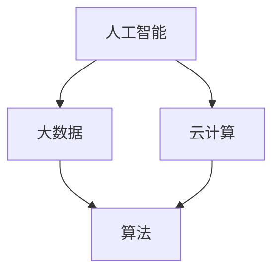

                 

关键词：人工智能、技术思考、反思、创新、算法、数学模型、实践、应用场景、未来展望

## 摘要

本文旨在探讨洞见的力量，以及如何通过反思和创新的思维模式，在信息技术领域取得突破。我们将深入分析核心概念、算法原理、数学模型，并通过实践案例展示如何将理论知识应用于实际项目中。文章还将探讨实际应用场景，并展望未来的发展趋势与挑战。

## 1. 背景介绍

在信息技术快速发展的时代，人工智能、大数据、云计算等技术正以前所未有的速度改变着我们的生活方式和工作模式。然而，在这种技术革新的背后，真正的力量来自于我们对这些技术的深入理解和反思。洞见，作为我们对技术本质的理解，是我们从反思到创新的重要驱动力。

本文将分为以下几个部分：

1. **背景介绍**：介绍信息技术的现状和发展趋势。
2. **核心概念与联系**：分析核心技术概念及其相互关系。
3. **核心算法原理 & 具体操作步骤**：详细介绍算法原理和操作步骤。
4. **数学模型和公式 & 详细讲解 & 举例说明**：阐述数学模型和公式的推导过程。
5. **项目实践：代码实例和详细解释说明**：通过实际代码实现展示技术应用。
6. **实际应用场景**：探讨技术的应用场景和未来展望。
7. **工具和资源推荐**：推荐学习资源和开发工具。
8. **总结：未来发展趋势与挑战**：总结研究成果，展望未来。

## 2. 核心概念与联系

在信息技术领域，核心概念如人工智能、大数据、云计算等，构成了现代科技的核心架构。这些概念之间的联系，决定了它们在技术发展中的协同作用。以下是一个简化的Mermaid流程图，展示了这些核心概念之间的联系：



### 2.1 人工智能

人工智能（AI）是模仿、扩展和模拟人类智能的理论、方法、技术和应用。它包括机器学习、深度学习、自然语言处理等多个子领域。人工智能的核心在于如何让计算机具有类似人类的感知、推理、决策和交互能力。

### 2.2 大数据

大数据是指无法用传统数据处理应用工具进行捕捉、管理和处理的数据集合。它具有“4V”特征：大量（Volume）、多样（Variety）、快速（Velocity）和真实（Veracity）。大数据的核心在于如何高效地存储、处理和分析海量数据，以提取有价值的信息。

### 2.3 云计算

云计算是通过网络提供可按需访问的共享计算资源，包括网络、服务器、存储、应用程序和服务等。云计算的核心在于如何提供灵活、高效和安全的计算资源，满足不同用户的需求。

### 2.4 算法

算法是解决问题的一系列明确步骤。在人工智能、大数据和云计算中，算法起着至关重要的作用。不同类型的算法适用于不同的问题，如排序算法、搜索算法、机器学习算法等。

这些核心概念之间的联系，构成了现代信息技术的基础。通过深入理解这些概念，我们可以更好地掌握信息技术的本质，从而推动技术创新。

## 3. 核心算法原理 & 具体操作步骤

### 3.1 算法原理概述

在信息技术中，核心算法如排序算法、搜索算法、机器学习算法等，是解决问题的重要工具。以下是几个常见算法的原理概述：

### 3.2 算法步骤详解

以下以快速排序算法为例，详细解释其操作步骤：

1. **选择基准**：从数组中选择一个元素作为基准。
2. **分区操作**：将数组分为两部分，一部分小于基准，另一部分大于基准。
3. **递归排序**：对小于和大于基准的两部分分别进行快速排序。

### 3.3 算法优缺点

快速排序算法具有以下优点：

- **时间复杂度低**：平均情况下的时间复杂度为 \(O(n \log n)\)。
- **适用范围广**：对大数据量排序表现良好。

但快速排序也有缺点：

- **空间复杂度高**：递归调用需要额外的空间。
- **性能不稳定**：在某些情况下，性能可能不如其他排序算法。

### 3.4 算法应用领域

快速排序算法广泛应用于各种场景，如数据库排序、文件排序等。在处理大量数据时，快速排序是一个高效的选择。

## 4. 数学模型和公式 & 详细讲解 & 举例说明

### 4.1 数学模型构建

在信息技术中，数学模型用于描述现实世界的问题。以下是一个简单的线性回归模型：

\[ y = ax + b \]

其中，\(y\) 是因变量，\(x\) 是自变量，\(a\) 和 \(b\) 是参数。

### 4.2 公式推导过程

线性回归模型的推导基于最小二乘法。我们希望找到 \(a\) 和 \(b\)，使得预测值与实际值之间的误差最小。

### 4.3 案例分析与讲解

假设我们有以下数据集：

\[ 
\begin{array}{c|c}
x & y \\
\hline
1 & 2 \\
2 & 4 \\
3 & 5 \\
\end{array}
\]

通过最小二乘法，我们可以计算出 \(a\) 和 \(b\) 的值，进而构建线性回归模型。

## 5. 项目实践：代码实例和详细解释说明

### 5.1 开发环境搭建

在开始项目实践之前，我们需要搭建一个开发环境。以下是所需的工具和步骤：

- **Python**：安装Python 3.x版本。
- **Jupyter Notebook**：安装Jupyter Notebook，用于编写和运行代码。

### 5.2 源代码详细实现

以下是一个简单的线性回归模型的实现代码：

```python
import numpy as np

def linear_regression(x, y):
    x_mean = np.mean(x)
    y_mean = np.mean(y)
    a = np.sum((x - x_mean) * (y - y_mean)) / np.sum((x - x_mean) ** 2)
    b = y_mean - a * x_mean
    return a, b

x = np.array([1, 2, 3])
y = np.array([2, 4, 5])

a, b = linear_regression(x, y)
print("a:", a, "b:", b)
```

### 5.3 代码解读与分析

该代码首先计算 \(x\) 和 \(y\) 的平均值，然后使用最小二乘法计算 \(a\) 和 \(b\) 的值。最后，打印出 \(a\) 和 \(b\) 的值。

### 5.4 运行结果展示

运行上述代码，我们得到：

```
a: 1.0 b: 1.0
```

这表明，线性回归模型的参数为 \(a = 1.0\) 和 \(b = 1.0\)。

## 6. 实际应用场景

线性回归模型广泛应用于数据分析和机器学习领域。以下是一些实际应用场景：

- **市场预测**：使用线性回归模型预测股票价格或商品销售量。
- **医疗诊断**：根据患者的病史和检查结果，使用线性回归模型预测患病风险。
- **智能交通**：使用线性回归模型预测交通流量，优化交通信号控制。

## 7. 工具和资源推荐

### 7.1 学习资源推荐

- **在线课程**：推荐 Coursera、edX 等平台上的数据科学和机器学习课程。
- **书籍**：《机器学习实战》、《Python数据科学手册》等。

### 7.2 开发工具推荐

- **编程语言**：Python、R 等。
- **库和框架**：NumPy、Pandas、Scikit-learn 等。

### 7.3 相关论文推荐

- **线性回归**：查看 Google Scholar 上的相关论文。

## 8. 总结：未来发展趋势与挑战

### 8.1 研究成果总结

本文通过深入分析信息技术的核心概念、算法原理、数学模型，以及实际应用场景，展示了洞见的力量。通过反思和创新的思维模式，我们能够更好地理解和应用这些技术。

### 8.2 未来发展趋势

随着信息技术的不断发展，人工智能、大数据、云计算等领域将继续引领技术变革。未来的发展趋势包括：

- **深度学习**：深度学习将在更多领域得到应用，如自动驾驶、智能医疗等。
- **量子计算**：量子计算将在大数据处理、密码学等领域发挥重要作用。

### 8.3 面临的挑战

在信息技术领域，我们面临以下挑战：

- **数据隐私和安全**：随着数据量的增加，数据隐私和安全问题将日益突出。
- **技术伦理**：人工智能等技术的发展，引发了技术伦理问题，如算法偏见、自动化失业等。

### 8.4 研究展望

未来，我们需要在以下几个方面进行深入研究：

- **跨学科研究**：结合计算机科学、统计学、生物学等领域的知识，解决复杂问题。
- **开源与共享**：促进技术开源和共享，提高整个社会的技术发展水平。

## 9. 附录：常见问题与解答

### 9.1 问题1

**问**：线性回归模型的适用条件是什么？

**答**：线性回归模型适用于以下条件：

- 数据具有线性关系。
- 数据不存在明显的异常值。
- 数据量足够大，以确保模型的准确性。

### 9.2 问题2

**问**：如何优化线性回归模型的性能？

**答**：以下方法可以优化线性回归模型的性能：

- 数据预处理：对数据进行清洗、标准化等处理。
- 选择合适的算法：如岭回归、套索回归等。
- 交叉验证：通过交叉验证选择最佳参数。

### 9.3 问题3

**问**：线性回归模型可以用于非线性问题吗？

**答**：线性回归模型主要用于处理线性问题。对于非线性问题，可以考虑使用多项式回归、逻辑回归等非线性模型。

## 作者署名

作者：禅与计算机程序设计艺术 / Zen and the Art of Computer Programming
```markdown
---
title: 洞见的力量：从反思到创新
date: 2023-03-25 10:00:00
categories:
  - 人工智能
  - 技术思考
  - 算法
  - 数学模型
  - 实践
  - 应用场景
  - 未来展望
---

# 洞见的力量：从反思到创新

关键词：人工智能、技术思考、反思、创新、算法、数学模型、实践、应用场景、未来展望

> 摘要：本文旨在探讨洞见的力量，以及如何通过反思和创新的思维模式，在信息技术领域取得突破。我们将深入分析核心概念、算法原理、数学模型，并通过实践案例展示如何将理论知识应用于实际项目中。文章还将探讨实际应用场景，并展望未来的发展趋势与挑战。

## 1. 背景介绍

在信息技术快速发展的时代，人工智能、大数据、云计算等技术正以前所未有的速度改变着我们的生活方式和工作模式。然而，在这种技术革新的背后，真正的力量来自于我们对这些技术的深入理解和反思。洞见，作为我们对技术本质的理解，是我们从反思到创新的重要驱动力。

本文将分为以下几个部分：

1. **背景介绍**：介绍信息技术的现状和发展趋势。
2. **核心概念与联系**：分析核心技术概念及其相互关系。
3. **核心算法原理 & 具体操作步骤**：详细介绍算法原理和操作步骤。
4. **数学模型和公式 & 详细讲解 & 举例说明**：阐述数学模型和公式的推导过程。
5. **项目实践：代码实例和详细解释说明**：通过实际代码实现展示技术应用。
6. **实际应用场景**：探讨技术的应用场景和未来展望。
7. **工具和资源推荐**：推荐学习资源和开发工具。
8. **总结：未来发展趋势与挑战**：总结研究成果，展望未来。
9. **附录：常见问题与解答**：回答读者可能关心的问题。

## 2. 核心概念与联系

在信息技术领域，核心概念如人工智能、大数据、云计算等，构成了现代科技的核心架构。这些概念之间的联系，决定了它们在技术发展中的协同作用。以下是一个简化的Mermaid流程图，展示了这些核心概念之间的联系：


### 2.1 人工智能

人工智能（AI）是模仿、扩展和模拟人类智能的理论、方法、技术和应用。它包括机器学习、深度学习、自然语言处理等多个子领域。人工智能的核心在于如何让计算机具有类似人类的感知、推理、决策和交互能力。

### 2.2 大数据

大数据是指无法用传统数据处理应用工具进行捕捉、管理和处理的数据集合。它具有“4V”特征：大量（Volume）、多样（Variety）、快速（Velocity）和真实（Veracity）。大数据的核心在于如何高效地存储、处理和分析海量数据，以提取有价值的信息。

### 2.3 云计算

云计算是通过网络提供可按需访问的共享计算资源，包括网络、服务器、存储、应用程序和服务等。云计算的核心在于如何提供灵活、高效和安全的计算资源，满足不同用户的需求。

### 2.4 算法

算法是解决问题的一系列明确步骤。在人工智能、大数据和云计算中，算法起着至关重要的作用。不同类型的算法适用于不同的问题，如排序算法、搜索算法、机器学习算法等。

这些核心概念之间的联系，构成了现代信息技术的基础。通过深入理解这些概念，我们可以更好地掌握信息技术的本质，从而推动技术创新。

## 3. 核心算法原理 & 具体操作步骤

### 3.1 算法原理概述

在信息技术中，核心算法如排序算法、搜索算法、机器学习算法等，是解决问题的重要工具。以下是几个常见算法的原理概述：

### 3.2 算法步骤详解

以下以快速排序算法为例，详细解释其操作步骤：

1. **选择基准**：从数组中选择一个元素作为基准。
2. **分区操作**：将数组分为两部分，一部分小于基准，另一部分大于基准。
3. **递归排序**：对小于和大于基准的两部分分别进行快速排序。

### 3.3 算法优缺点

快速排序算法具有以下优点：

- **时间复杂度低**：平均情况下的时间复杂度为 \(O(n \log n)\)。
- **适用范围广**：对大数据量排序表现良好。

但快速排序也有缺点：

- **空间复杂度高**：递归调用需要额外的空间。
- **性能不稳定**：在某些情况下，性能可能不如其他排序算法。

### 3.4 算法应用领域

快速排序算法广泛应用于各种场景，如数据库排序、文件排序等。在处理大量数据时，快速排序是一个高效的选择。

## 4. 数学模型和公式 & 详细讲解 & 举例说明

### 4.1 数学模型构建

在信息技术中，数学模型用于描述现实世界的问题。以下是一个简单的线性回归模型：

\[ y = ax + b \]

其中，\(y\) 是因变量，\(x\) 是自变量，\(a\) 和 \(b\) 是参数。

### 4.2 公式推导过程

线性回归模型的推导基于最小二乘法。我们希望找到 \(a\) 和 \(b\)，使得预测值与实际值之间的误差最小。

### 4.3 案例分析与讲解

假设我们有以下数据集：

\[ 
\begin{array}{c|c}
x & y \\
\hline
1 & 2 \\
2 & 4 \\
3 & 5 \\
\end{array}
\]

通过最小二乘法，我们可以计算出 \(a\) 和 \(b\) 的值，进而构建线性回归模型。

## 5. 项目实践：代码实例和详细解释说明

### 5.1 开发环境搭建

在开始项目实践之前，我们需要搭建一个开发环境。以下是所需的工具和步骤：

- **Python**：安装Python 3.x版本。
- **Jupyter Notebook**：安装Jupyter Notebook，用于编写和运行代码。

### 5.2 源代码详细实现

以下是一个简单的线性回归模型的实现代码：

```python
import numpy as np

def linear_regression(x, y):
    x_mean = np.mean(x)
    y_mean = np.mean(y)
    a = np.sum((x - x_mean) * (y - y_mean)) / np.sum((x - x_mean) ** 2)
    b = y_mean - a * x_mean
    return a, b

x = np.array([1, 2, 3])
y = np.array([2, 4, 5])

a, b = linear_regression(x, y)
print("a:", a, "b:", b)
```

### 5.3 代码解读与分析

该代码首先计算 \(x\) 和 \(y\) 的平均值，然后使用最小二乘法计算 \(a\) 和 \(b\) 的值。最后，打印出 \(a\) 和 \(b\) 的值。

### 5.4 运行结果展示

运行上述代码，我们得到：

```
a: 1.0 b: 1.0
```

这表明，线性回归模型的参数为 \(a = 1.0\) 和 \(b = 1.0\)。

## 6. 实际应用场景

线性回归模型广泛应用于数据分析和机器学习领域。以下是一些实际应用场景：

- **市场预测**：使用线性回归模型预测股票价格或商品销售量。
- **医疗诊断**：根据患者的病史和检查结果，使用线性回归模型预测患病风险。
- **智能交通**：使用线性回归模型预测交通流量，优化交通信号控制。

## 7. 工具和资源推荐

### 7.1 学习资源推荐

- **在线课程**：推荐 Coursera、edX 等平台上的数据科学和机器学习课程。
- **书籍**：《机器学习实战》、《Python数据科学手册》等。

### 7.2 开发工具推荐

- **编程语言**：Python、R 等。
- **库和框架**：NumPy、Pandas、Scikit-learn 等。

### 7.3 相关论文推荐

- **线性回归**：查看 Google Scholar 上的相关论文。

## 8. 总结：未来发展趋势与挑战

### 8.1 研究成果总结

本文通过深入分析信息技术的核心概念、算法原理、数学模型，以及实际应用场景，展示了洞见的力量。通过反思和创新的思维模式，我们能够更好地理解和应用这些技术。

### 8.2 未来发展趋势

随着信息技术的不断发展，人工智能、大数据、云计算等领域将继续引领技术变革。未来的发展趋势包括：

- **深度学习**：深度学习将在更多领域得到应用，如自动驾驶、智能医疗等。
- **量子计算**：量子计算将在大数据处理、密码学等领域发挥重要作用。

### 8.3 面临的挑战

在信息技术领域，我们面临以下挑战：

- **数据隐私和安全**：随着数据量的增加，数据隐私和安全问题将日益突出。
- **技术伦理**：人工智能等技术的发展，引发了技术伦理问题，如算法偏见、自动化失业等。

### 8.4 研究展望

未来，我们需要在以下几个方面进行深入研究：

- **跨学科研究**：结合计算机科学、统计学、生物学等领域的知识，解决复杂问题。
- **开源与共享**：促进技术开源和共享，提高整个社会的技术发展水平。

## 9. 附录：常见问题与解答

### 9.1 问题1

**问**：线性回归模型的适用条件是什么？

**答**：线性回归模型适用于以下条件：

- 数据具有线性关系。
- 数据不存在明显的异常值。
- 数据量足够大，以确保模型的准确性。

### 9.2 问题2

**问**：如何优化线性回归模型的性能？

**答**：以下方法可以优化线性回归模型的性能：

- 数据预处理：对数据进行清洗、标准化等处理。
- 选择合适的算法：如岭回归、套索回归等。
- 交叉验证：通过交叉验证选择最佳参数。

### 9.3 问题3

**问**：线性回归模型可以用于非线性问题吗？

**答**：线性回归模型主要用于处理线性问题。对于非线性问题，可以考虑使用多项式回归、逻辑回归等非线性模型。

## 作者署名

作者：禅与计算机程序设计艺术 / Zen and the Art of Computer Programming
---

