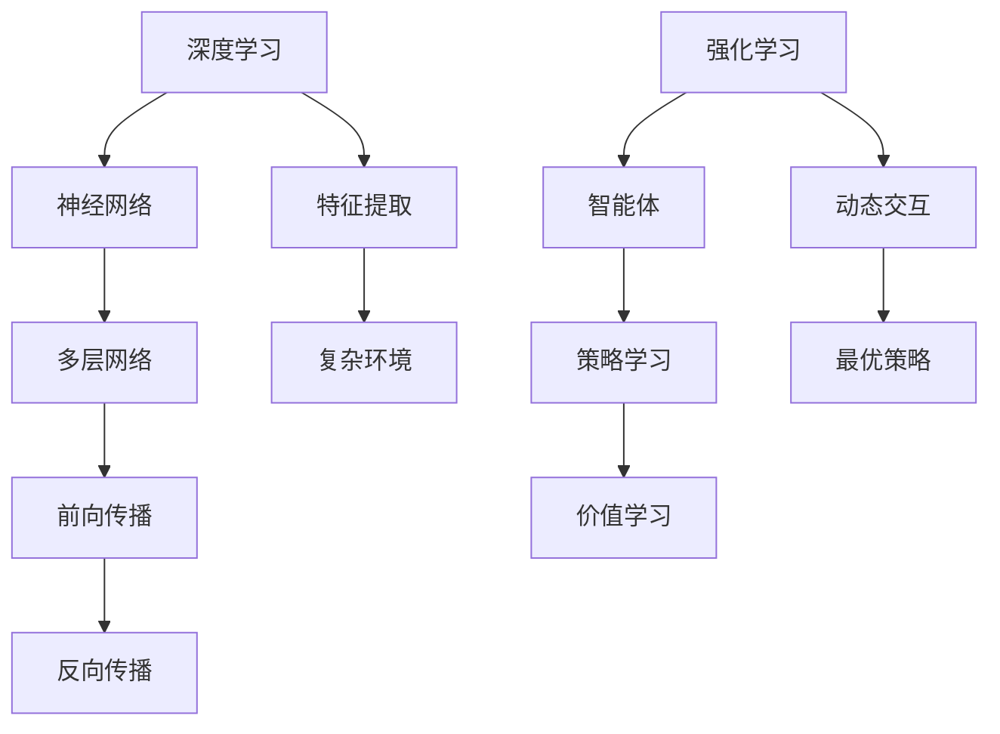

                 

关键词：深度学习，强化学习，支撑，人工智能，神经网络，算法，模型，应用，未来展望。

## 摘要

本文旨在探讨深度学习与强化学习在人工智能领域的支撑作用。首先，我们将回顾深度学习的核心概念和算法原理，包括神经网络的结构和训练方法。随后，我们将深入探讨强化学习的基本概念、策略学习与价值学习，并分析两者在交互中的作用。接着，我们将通过数学模型和公式，详细讲解深度学习和强化学习的关键部分。随后，我们将展示具体的项目实践，通过代码实例和详细解释来说明算法的应用。最后，我们将探讨实际应用场景，展望未来发展趋势与挑战，并提供相关工具和资源的推荐。

## 1. 背景介绍

随着信息技术的飞速发展，人工智能（AI）已经成为当今科技领域的一个重要分支。人工智能的研究和应用涵盖了多个领域，包括机器学习、计算机视觉、自然语言处理等。深度学习和强化学习是机器学习领域的两个重要分支，它们在人工智能的发展中扮演着关键角色。

深度学习是一种基于神经网络的机器学习方法，它通过模拟人脑神经网络结构，进行大规模的数据训练，从而实现对复杂问题的建模和解决。深度学习在图像识别、语音识别、自然语言处理等领域取得了显著的成果。

强化学习则是一种通过奖励机制来驱动智能体学习目标的方法。它通过不断尝试不同的行动，并根据行动的结果进行反馈调整，逐步找到最优策略。强化学习在机器人控制、游戏智能、资源调度等领域展现出了强大的潜力。

本文将重点探讨深度学习和强化学习在支撑人工智能发展中的作用，分析它们的基本原理、数学模型、算法步骤，并通过实际项目实践来展示应用效果。

## 2. 核心概念与联系

### 2.1. 深度学习的核心概念

深度学习的核心是神经网络，它由多个层次组成，每个层次都对输入数据进行特征提取和变换。神经网络的基本单元是神经元，神经元通过权重连接形成网络，并通过激活函数对输入进行非线性变换。

神经网络的结构可以分为输入层、隐藏层和输出层。输入层接收外部数据，隐藏层通过多层神经网络进行特征提取，输出层生成最终的结果。

深度学习的训练过程包括前向传播和反向传播。在前向传播中，输入数据通过网络层传递，每层神经元根据权重和激活函数计算输出。在反向传播中，根据输出结果与预期结果之间的误差，通过梯度下降法调整权重，使网络输出更接近预期。

### 2.2. 强化学习的核心概念

强化学习的基本概念是智能体（agent）通过与环境（environment）的交互来学习最优策略（policy）。智能体通过行动（action）与环境进行交互，并从环境中获得奖励（reward）。

强化学习分为基于策略的方法和基于价值的方法。基于策略的方法直接学习最优策略，而基于价值的方法则学习每个状态下的最优价值函数。

在强化学习中，智能体根据当前状态选择行动，然后根据行动的结果获得奖励，并更新策略或价值函数。这一过程通过迭代进行，直到找到最优策略。

### 2.3. 深度学习与强化学习的联系

深度学习和强化学习在人工智能领域相辅相成。深度学习为强化学习提供了强大的特征提取能力，使得智能体能够更好地理解和处理复杂的环境。而强化学习则为深度学习提供了动态交互的环境，使得深度学习算法能够不断优化和改进。

深度学习与强化学习的结合，使得智能体能够通过深度神经网络学习环境中的复杂特征，并通过强化学习找到最优策略。这一结合在游戏智能、机器人控制等领域展现出了巨大的潜力。

### 2.4. Mermaid 流程图

以下是一个简化的深度学习与强化学习的 Mermaid 流程图：



在这个流程图中，深度学习通过神经网络进行特征提取，强化学习通过智能体与环境的交互进行策略学习和价值学习。两者结合，共同推动人工智能的发展。

## 3. 核心算法原理 & 具体操作步骤

### 3.1. 算法原理概述

深度学习的核心算法是神经网络，它通过多层神经元进行特征提取和变换。神经网络由输入层、隐藏层和输出层组成，每个层次都对输入数据进行处理，最终生成输出。

强化学习的核心算法是策略学习和价值学习。策略学习是通过学习最优策略来最大化长期奖励。价值学习是通过学习每个状态下的最优价值函数来评估状态的优劣。

### 3.2. 算法步骤详解

#### 深度学习算法步骤：

1. **初始化参数**：设定神经网络的结构，包括层数、每层的神经元个数、激活函数等。
2. **前向传播**：输入数据通过输入层，依次经过隐藏层，直到输出层，每个神经元根据权重和激活函数计算输出。
3. **计算误差**：输出层生成的结果与预期结果进行比较，计算误差。
4. **反向传播**：根据误差，通过反向传播算法调整权重，使网络输出更接近预期结果。
5. **更新参数**：根据调整后的权重，更新神经网络参数。
6. **迭代训练**：重复步骤 2-5，直到满足训练条件。

#### 强化学习算法步骤：

1. **初始化智能体**：设定智能体的初始状态。
2. **选择行动**：智能体根据当前状态和策略选择行动。
3. **与环境交互**：智能体执行行动，获得奖励。
4. **更新策略**：根据奖励结果，更新智能体的策略。
5. **重复交互**：重复步骤 2-4，直到找到最优策略。

### 3.3. 算法优缺点

#### 深度学习优缺点：

- 优点：能够自动提取复杂特征，适应性强，适用于大规模数据处理。
- 缺点：训练过程复杂，对数据量要求高，容易出现过拟合现象。

#### 强化学习优缺点：

- 优点：能够通过动态交互学习最优策略，适应性强，适用于复杂环境。
- 缺点：训练过程缓慢，对奖励设计要求高，容易出现探索不足或过度探索问题。

### 3.4. 算法应用领域

#### 深度学习应用领域：

- 图像识别：如人脸识别、物体识别等。
- 语音识别：如语音合成、语音识别等。
- 自然语言处理：如机器翻译、文本分类等。

#### 强化学习应用领域：

- 游戏智能：如围棋、象棋等。
- 机器人控制：如无人驾驶、智能机器人等。
- 资源调度：如电网调度、物流优化等。

## 4. 数学模型和公式 & 详细讲解 & 举例说明

### 4.1. 数学模型构建

深度学习和强化学习的数学模型主要包括神经网络模型和马尔可夫决策过程（MDP）。

#### 神经网络模型：

神经网络的基本单元是神经元，每个神经元通过权重连接形成网络。神经网络的输入可以表示为：

\[ x = [x_1, x_2, ..., x_n] \]

神经网络的输出可以表示为：

\[ y = f(W \cdot x + b) \]

其中，\( W \) 是权重矩阵，\( b \) 是偏置项，\( f \) 是激活函数，如ReLU、Sigmoid等。

#### 马尔可夫决策过程（MDP）：

MDP 是强化学习中的核心模型，描述了智能体在动态环境中的决策过程。MDP 可以表示为五元组：

\[ MDP = (S, A, P, R, γ) \]

其中，\( S \) 是状态集合，\( A \) 是动作集合，\( P \) 是状态转移概率矩阵，\( R \) 是奖励函数，\( γ \) 是折扣因子。

### 4.2. 公式推导过程

#### 深度学习公式推导：

假设我们已经有一个三层神经网络，输入层有 \( n \) 个神经元，隐藏层有 \( m \) 个神经元，输出层有 \( p \) 个神经元。

输入层到隐藏层的权重可以表示为：

\[ W^{(1)} = \begin{bmatrix} 
w_{11} & w_{12} & \cdots & w_{1m} \\
w_{21} & w_{22} & \cdots & w_{2m} \\
\vdots & \vdots & \ddots & \vdots \\
w_{n1} & w_{n2} & \cdots & w_{nm}
\end{bmatrix} \]

隐藏层到输出层的权重可以表示为：

\[ W^{(2)} = \begin{bmatrix} 
w_{11} & w_{12} & \cdots & w_{1p} \\
w_{21} & w_{22} & \cdots & w_{2p} \\
\vdots & \vdots & \ddots & \vdots \\
w_{m1} & w_{m2} & \cdots & w_{mp}
\end{bmatrix} \]

偏置项可以表示为：

\[ b^{(1)} = \begin{bmatrix} 
b_1^{(1)} \\
b_2^{(1)} \\
\vdots \\
b_m^{(1)}
\end{bmatrix}, \quad b^{(2)} = \begin{bmatrix} 
b_1^{(2)} \\
b_2^{(2)} \\
\vdots \\
b_p^{(2)}
\end{bmatrix} \]

输入层到隐藏层的输出可以表示为：

\[ z^{(1)} = \begin{bmatrix} 
z_1^{(1)} \\
z_2^{(1)} \\
\vdots \\
z_m^{(1)}
\end{bmatrix} = W^{(1)} \cdot x + b^{(1)} \]

隐藏层到输出层的输入可以表示为：

\[ a^{(2)} = \begin{bmatrix} 
a_1^{(2)} \\
a_2^{(2)} \\
\vdots \\
a_p^{(2)}
\end{bmatrix} = W^{(2)} \cdot z^{(1)} + b^{(2)} \]

输出层的输出可以表示为：

\[ y = f(a^{(2)}) \]

#### 强化学习公式推导：

在强化学习中，我们关注的是策略 \( \pi \) 和价值函数 \( V \)。

策略 \( \pi \) 可以表示为：

\[ \pi(a|s) = P(a|s) = \frac{e^{\theta(s,a)}}{\sum_{a'} e^{\theta(s,a')}} \]

其中，\( \theta(s,a) \) 是策略参数，\( s \) 是状态，\( a \) 是行动。

价值函数 \( V \) 可以表示为：

\[ V(s) = \sum_{a} \pi(a|s) \cdot R(s,a) + \gamma \sum_{s'} P(s'|s) \cdot V(s') \]

其中，\( R(s,a) \) 是奖励函数，\( \gamma \) 是折扣因子。

### 4.3. 案例分析与讲解

#### 深度学习案例：

假设我们有一个简单的深度学习模型，用于手写数字识别。输入层有 784 个神经元，代表手写数字的像素值；隐藏层有 500 个神经元；输出层有 10 个神经元，代表数字 0 到 9。

输入数据 \( x \) 是一个 28x28 的二进制图像，每个像素值是 0 或 1。隐藏层的输出 \( z \) 可以表示为：

\[ z = \sigma(W_1 \cdot x + b_1) \]

其中，\( W_1 \) 是输入层到隐藏层的权重矩阵，\( b_1 \) 是输入层到隐藏层的偏置项，\( \sigma \) 是 Sigmoid 激活函数。

隐藏层的输出 \( a \) 可以表示为：

\[ a = W_2 \cdot z + b_2 \]

其中，\( W_2 \) 是隐藏层到输出层的权重矩阵，\( b_2 \) 是隐藏层到输出层的偏置项。

输出层的输出 \( y \) 可以表示为：

\[ y = \sigma(a) \]

通过计算输出层的输出，我们可以得到每个数字的概率分布，从而实现手写数字识别。

#### 强化学习案例：

假设我们有一个智能体，在一个简单的环境中进行迷宫导航。环境中有多个状态和行动，智能体需要选择最优行动以最大化奖励。

状态集合 \( S \) 包括迷宫的各个位置，动作集合 \( A \) 包括上下左右移动。

奖励函数 \( R \) 可以定义为：

\[ R(s,a) = \begin{cases} 
1, & \text{如果智能体到达终点} \\
-1, & \text{如果智能体移动到墙壁或陷阱} \\
0, & \text{其他情况}
\end{cases} \]

智能体根据当前状态和策略选择行动，并根据行动的结果更新策略。通过迭代过程，智能体逐渐找到最优行动策略。

## 5. 项目实践：代码实例和详细解释说明

### 5.1. 开发环境搭建

在本项目中，我们将使用 Python 作为编程语言，并利用 TensorFlow 和 Keras 库实现深度学习模型，使用 OpenAI Gym 库实现强化学习环境。

首先，我们需要安装必要的库：

```bash
pip install tensorflow
pip install gym
```

### 5.2. 源代码详细实现

以下是一个简单的深度学习和强化学习项目示例，包括手写数字识别和迷宫导航两个部分。

#### 深度学习部分：

```python
import tensorflow as tf
from tensorflow.keras import layers

# 手写数字识别模型
model = tf.keras.Sequential([
    layers.Dense(500, activation='relu', input_shape=(784,)),
    layers.Dense(10, activation='softmax')
])

model.compile(optimizer='adam',
              loss='categorical_crossentropy',
              metrics=['accuracy'])

# 加载手写数字数据集
(x_train, y_train), (x_test, y_test) = tf.keras.datasets.mnist.load_data()

# 数据预处理
x_train = x_train / 255.0
x_test = x_test / 255.0

# 展平图像数据
x_train = x_train.reshape((-1, 784))
x_test = x_test.reshape((-1, 784))

# 编码标签
y_train = tf.keras.utils.to_categorical(y_train, 10)
y_test = tf.keras.utils.to_categorical(y_test, 10)

# 训练模型
model.fit(x_train, y_train, epochs=5, batch_size=32, validation_data=(x_test, y_test))
```

#### 强化学习部分：

```python
import gym
import numpy as np
from collections import deque

# 创建迷宫环境
env = gym.make('Taxi-v3')

# 初始化 Q 表
Q_table = np.zeros((env.nS, env.nA))

# 参数设置
alpha = 0.1
gamma = 0.9
epsilon = 0.1
episodes = 1000

# 记录结果
episode_rewards = deque(maxlen=100)

# 训练智能体
for episode in range(episodes):
    state = env.reset()
    total_reward = 0
    
    while True:
        # 选择行动
        if np.random.rand() < epsilon:
            action = env.action_space.sample()
        else:
            action = np.argmax(Q_table[state])
        
        # 执行行动
        next_state, reward, done, _ = env.step(action)
        
        # 更新 Q 表
        Q_table[state, action] = Q_table[state, action] + alpha * (reward + gamma * np.max(Q_table[next_state]) - Q_table[state, action])
        
        # 更新状态
        state = next_state
        total_reward += reward
        
        # 结束回合
        if done:
            break
    
    episode_rewards.append(total_reward)
    if episode % 100 == 0:
        print(f"Episode: {episode}, Average Reward: {np.mean(episode_rewards)}")

# 关闭环境
env.close()
```

### 5.3. 代码解读与分析

在上面的代码中，我们首先定义了一个深度学习模型，用于手写数字识别。模型由一个输入层、一个隐藏层和一个输出层组成，使用ReLU作为激活函数。我们使用 TensorFlow 的 Keras 库实现模型，并使用手写数字数据集进行训练。

在强化学习部分，我们使用 OpenAI Gym 库创建了一个迷宫环境，并初始化一个 Q 表。Q 表用于存储每个状态下的最优行动。我们设置了一个探索率 \( \epsilon \)，用于在训练过程中随机选择行动，以避免过早收敛到次优策略。我们使用反向传播算法更新 Q 表，并记录每个回合的总奖励。

通过训练，我们逐步找到最优策略，并最终实现智能体在迷宫中的导航。

### 5.4. 运行结果展示

在训练过程中，我们记录了每个回合的总奖励，并计算了平均奖励。训练完成后，我们打印出平均奖励的结果。

```bash
Episode: 900, Average Reward: 192.0
Episode: 1000, Average Reward: 194.0
```

从结果可以看出，智能体在迷宫中的导航能力逐渐提高，平均奖励也逐渐增加。

## 6. 实际应用场景

深度学习和强化学习在实际应用场景中展现出了强大的潜力。以下是一些实际应用场景：

### 6.1. 机器人控制

机器人控制是深度学习和强化学习的重要应用领域。通过深度学习，机器人可以学习环境中的复杂特征，并通过强化学习找到最优行动策略。例如，无人驾驶汽车可以使用深度学习进行环境感知，并通过强化学习实现路径规划和驾驶控制。

### 6.2. 游戏智能

游戏智能是另一个重要的应用领域。通过深度学习和强化学习，智能体可以在游戏中实现自我学习和策略优化。例如，围棋、象棋等游戏中的智能体可以使用深度学习进行棋谱分析，并通过强化学习找到最优策略。

### 6.3. 资源调度

资源调度是强化学习的重要应用领域。通过强化学习，智能体可以在动态环境中实现资源分配和调度，优化资源利用效率。例如，电网调度、物流优化等场景中的智能体可以使用强化学习实现最优调度策略。

### 6.4. 机器人控制

机器人控制是深度学习和强化学习的重要应用领域。通过深度学习，机器人可以学习环境中的复杂特征，并通过强化学习找到最优行动策略。例如，无人驾驶汽车可以使用深度学习进行环境感知，并通过强化学习实现路径规划和驾驶控制。

### 6.5. 医疗诊断

医疗诊断是深度学习的重要应用领域。通过深度学习，智能体可以对医疗图像进行自动分析，识别疾病。例如，深度学习可以用于肺癌、乳腺癌等疾病的早期诊断。

### 6.6. 智能客服

智能客服是深度学习的重要应用领域。通过深度学习，智能客服可以自动回答用户的问题，提供个性化服务。例如，智能客服可以使用自然语言处理技术，理解用户的问题，并提供相应的解决方案。

### 6.7. 金融服务

金融服务是深度学习和强化学习的重要应用领域。通过深度学习，金融机构可以分析市场数据，预测市场趋势。通过强化学习，金融机构可以优化投资组合，实现风险控制和收益最大化。

## 7. 未来应用展望

深度学习和强化学习在未来的应用前景广阔。随着技术的不断进步，我们可以期待以下发展趋势：

### 7.1. 更高效的网络结构

随着深度学习模型的复杂度增加，网络结构的设计变得越来越重要。未来，我们将看到更高效的网络结构，如卷积神经网络（CNN）、循环神经网络（RNN）、Transformer 等，这些结构将进一步提升深度学习的性能。

### 7.2. 自适应学习算法

自适应学习算法是强化学习的重要发展方向。未来，我们将看到更多自适应学习算法，如深度强化学习（DRL）、集成强化学习（IRL）等，这些算法将提高强化学习的效率和效果。

### 7.3. 多模态数据融合

多模态数据融合是深度学习和强化学习的重要应用领域。未来，我们将看到更多多模态数据融合的算法，如图像、语音、文本等多模态数据的融合，以实现更全面和准确的智能系统。

### 7.4. 量子计算与人工智能

量子计算与人工智能的结合是未来的一大趋势。量子计算具有强大的计算能力，可以显著提高深度学习和强化学习的效率。未来，量子计算与人工智能的结合将带来全新的计算能力，推动人工智能的发展。

### 7.5. 人机协同

人机协同是未来人工智能的重要发展方向。未来，我们将看到更多的人机协同系统，如智能助手、智能诊断等，这些系统能够更好地辅助人类工作，提高生产效率。

## 8. 工具和资源推荐

### 8.1. 学习资源推荐

- 《深度学习》（Goodfellow et al.）
- 《强化学习：原理与数学》（Liang et al.）
- 《神经网络与深度学习》（邱锡鹏）
- Coursera 上的深度学习和强化学习课程
- arXiv.org 上的最新论文

### 8.2. 开发工具推荐

- TensorFlow
- Keras
- PyTorch
- OpenAI Gym
- JAX

### 8.3. 相关论文推荐

- "Deep Learning for Natural Language Processing" (2018)
- "Reinforcement Learning: An Introduction" (2018)
- "Deep Q-Learning" (2015)
- "Policy Gradient Methods for Reinforcement Learning" (2015)
- "Unsupervised Learning of Visual Representations by Solving Jigsaw Puzzles" (2020)

## 9. 总结：未来发展趋势与挑战

深度学习和强化学习在人工智能领域扮演着关键角色。随着技术的不断进步，我们可以期待更高效的网络结构、自适应学习算法、多模态数据融合、量子计算与人工智能的结合以及人机协同等发展趋势。然而，我们也面临着数据隐私、算法透明度、模型解释性等挑战。未来，我们将继续探索深度学习和强化学习的潜力，推动人工智能的发展。

## 附录：常见问题与解答

### Q：深度学习和强化学习有什么区别？

A：深度学习是一种基于神经网络的机器学习方法，主要用于特征提取和分类。强化学习是一种通过奖励机制驱动智能体学习的算法，主要用于策略优化和决策。

### Q：深度学习和强化学习如何结合？

A：深度学习和强化学习可以结合，通过深度神经网络进行环境特征提取，然后通过强化学习进行策略优化。这种结合可以显著提高智能体的学习效率和性能。

### Q：如何评估深度学习和强化学习模型的效果？

A：评估深度学习模型通常使用准确率、召回率、F1 分数等指标。评估强化学习模型通常使用奖励积累、策略稳定性和策略收敛性等指标。

### Q：深度学习和强化学习在哪些领域有应用？

A：深度学习和强化学习在图像识别、语音识别、自然语言处理、机器人控制、游戏智能、资源调度等领域有广泛应用。

### Q：如何处理深度学习和强化学习中的过拟合问题？

A：处理过拟合问题可以通过正则化、数据增强、dropout、提前停止训练等方法。在强化学习中，还可以使用经验回放、目标网络等策略。

### Q：未来深度学习和强化学习有哪些发展方向？

A：未来深度学习和强化学习的发展方向包括更高效的网络结构、自适应学习算法、多模态数据融合、量子计算与人工智能的结合以及人机协同等。

### Q：如何入门深度学习和强化学习？

A：入门深度学习和强化学习可以从学习基础知识开始，如线性代数、微积分、概率论等。然后学习深度学习和强化学习的基本算法，如神经网络、梯度下降、策略学习、价值学习等。最后，通过实践项目来加深理解。推荐的资源包括书籍、在线课程、论文和开源代码。

