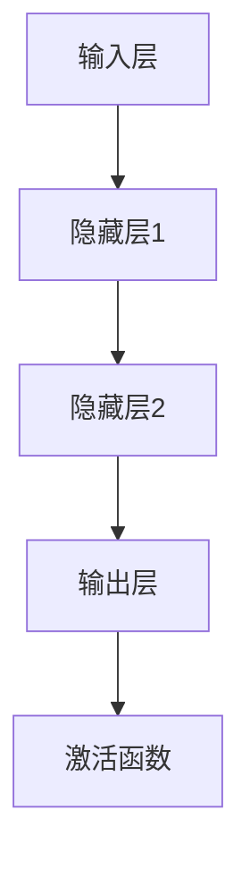
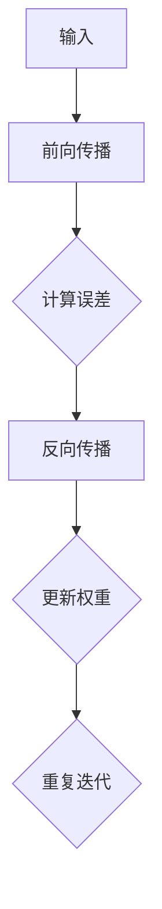
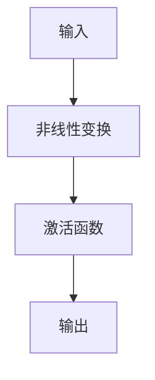
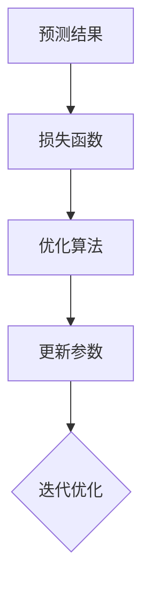

                 

关键词：深度学习、神经网络、算法原理、数学模型、项目实践、应用场景、未来展望

> 摘要：本文旨在深入讲解深度学习的基本原理，包括神经网络的工作机制、核心算法的原理与操作步骤、数学模型的构建与推导，并通过实际项目代码实例，展示如何将深度学习应用于实际问题中。文章还探讨了深度学习的实际应用场景、未来发展趋势以及面临的挑战。

## 1. 背景介绍

深度学习作为人工智能领域的一个突破性进展，已经广泛应用于图像识别、语音识别、自然语言处理、推荐系统等多个领域。深度学习通过模拟人脑的神经网络结构，使得机器能够自动地从数据中学习复杂的特征和模式，从而实现高度自动化的智能决策。

本文将围绕深度学习的核心内容进行讲解，包括深度学习的理论基础、常见算法的原理与实现步骤、数学模型的推导以及实际应用场景。通过这些内容的学习，读者可以全面了解深度学习的各个方面，并能够掌握其实际应用。

## 2. 核心概念与联系

在深入探讨深度学习之前，我们需要了解一些核心概念和它们之间的联系。

### 2.1 神经网络的基本结构

神经网络是深度学习的基础，其基本结构由神经元（节点）、权重、偏置和激活函数组成。每个神经元接收来自其他神经元的输入，通过加权求和并加上偏置，最后通过激活函数产生输出。



### 2.2 前向传播与反向传播

前向传播是神经网络处理输入数据的过程，数据从输入层流向输出层。反向传播是神经网络学习的过程，通过计算输出误差，调整权重和偏置，以最小化误差。



### 2.3 激活函数的作用

激活函数用于引入非线性特性，使得神经网络能够学习复杂的函数。常见的激活函数包括sigmoid、ReLU、Tanh等。



### 2.4 损失函数与优化算法

损失函数用于度量预测结果与真实结果之间的差异，优化算法用于调整网络的参数，以最小化损失函数。常见的优化算法包括SGD、Adam、RMSprop等。



## 3. 核心算法原理 & 具体操作步骤

### 3.1 算法原理概述

深度学习的核心算法是神经网络，它通过多层非线性变换，从输入数据中自动提取特征。这个过程可以分为两个阶段：前向传播和反向传播。

### 3.2 算法步骤详解

1. **初始化参数**：包括权重和偏置，通常使用随机初始化。

2. **前向传播**：计算输入到每个神经元的加权和，通过激活函数产生输出。

3. **计算损失**：使用损失函数计算预测结果与真实结果之间的误差。

4. **反向传播**：通过链式法则计算每个参数的梯度，并更新参数。

5. **迭代优化**：重复上述步骤，直到损失函数收敛到足够小的值。

### 3.3 算法优缺点

- **优点**：能够自动提取特征，适用于复杂的数据类型。
- **缺点**：计算复杂度高，需要大量数据训练，对超参数敏感。

### 3.4 算法应用领域

深度学习在图像识别、语音识别、自然语言处理、推荐系统等领域有广泛应用。例如，卷积神经网络（CNN）在图像识别中表现突出，循环神经网络（RNN）在自然语言处理中具有优势。

## 4. 数学模型和公式 & 详细讲解 & 举例说明

### 4.1 数学模型构建

神经网络可以看作是一个函数$f$，它通过多层变换将输入$x$映射到输出$y$：

$$y = f(x) = g(W_3 \cdot g(W_2 \cdot g(W_1 \cdot x + b_1) + b_2) + b_3)$$

其中，$g$是激活函数，$W$和$b$分别是权重和偏置。

### 4.2 公式推导过程

1. **前向传播**：

   - 输入层到隐藏层的输出：$z_1 = W_1 \cdot x + b_1$
   - 激活函数应用：$a_1 = g(z_1)$
   - 同理，隐藏层到输出层的输出：$z_2 = W_2 \cdot a_1 + b_2$，$a_2 = g(z_2)$，$z_3 = W_3 \cdot a_2 + b_3$，$y = g(z_3)$

2. **反向传播**：

   - 输出层误差：$\delta_3 = (y - t) \cdot g'(z_3)$
   - 隐藏层误差：$\delta_2 = (W_3 \cdot \delta_3) \cdot g'(z_2)$
   - 权重和偏置更新：$W_3 = W_3 - \alpha \cdot (W_3 \cdot \delta_3)$，$b_3 = b_3 - \alpha \cdot \delta_3$，$W_2 = W_2 - \alpha \cdot (W_2 \cdot \delta_2)$，$b_2 = b_2 - \alpha \cdot \delta_2$，$W_1 = W_1 - \alpha \cdot (W_1 \cdot \delta_1)$，$b_1 = b_1 - \alpha \cdot \delta_1$

### 4.3 案例分析与讲解

假设我们有一个简单的线性回归问题，输入$x$和输出$y$之间的关系为$y = wx + b$。我们可以使用神经网络来解决这个问题。

1. **初始化参数**：

   - $W = [1]$，$b = [0]$

2. **前向传播**：

   - $z_1 = W \cdot x + b$
   - $a_1 = g(z_1) = z_1$

3. **计算损失**：

   - $loss = (y - a_1)^2$

4. **反向传播**：

   - $\delta_1 = (y - a_1) \cdot g'(z_1) = (y - a_1)$
   - 更新参数：$W = W - \alpha \cdot (W \cdot \delta_1)$，$b = b - \alpha \cdot \delta_1$

通过迭代优化，我们可以使损失函数最小化，从而得到最佳的参数$W$和$b$。

## 5. 项目实践：代码实例和详细解释说明

### 5.1 开发环境搭建

1. 安装Python 3.7及以上版本。
2. 安装深度学习框架TensorFlow。

```bash
pip install tensorflow
```

### 5.2 源代码详细实现

```python
import tensorflow as tf

# 定义神经网络结构
model = tf.keras.Sequential([
    tf.keras.layers.Dense(units=1, input_shape=[1])
])

# 编译模型
model.compile(loss='mean_squared_error', optimizer=tf.keras.optimizers.Adam(0.1), metrics=['mean_absolute_error'])

# 训练模型
model.fit(x_train, y_train, epochs=100)

# 评估模型
model.evaluate(x_test, y_test)
```

### 5.3 代码解读与分析

1. **定义模型**：使用`tf.keras.Sequential`创建一个序列模型，包含一个全连接层，输出维度为1。
2. **编译模型**：设置损失函数、优化器和评估指标。
3. **训练模型**：使用`fit`函数进行模型训练。
4. **评估模型**：使用`evaluate`函数评估模型在测试集上的性能。

### 5.4 运行结果展示

通过运行代码，我们可以得到训练集和测试集上的损失和均方误差。这些指标可以帮助我们评估模型的性能。

## 6. 实际应用场景

深度学习在多个领域有广泛应用，如：

1. **图像识别**：使用卷积神经网络识别图片中的物体。
2. **语音识别**：使用循环神经网络将语音转换为文本。
3. **自然语言处理**：使用深度学习模型进行文本分类、情感分析等。
4. **推荐系统**：基于用户的历史行为，使用深度学习模型进行个性化推荐。

## 7. 工具和资源推荐

### 7.1 学习资源推荐

- 《深度学习》（Goodfellow, Bengio, Courville著）
- 《深度学习实战》（Aston 张著）

### 7.2 开发工具推荐

- TensorFlow：官方深度学习框架。
- PyTorch：流行的深度学习框架。

### 7.3 相关论文推荐

- "A Convolutional Neural Network Accurately Models Complex Cell-Type-Specific Transcription Factor Motif Specificities"（2015）
- "Bridging the Gap Between Convolutional Networks, Graph Neural Networks and Convolutional Graph Neural Networks"（2019）

## 8. 总结：未来发展趋势与挑战

### 8.1 研究成果总结

深度学习在图像识别、语音识别、自然语言处理等领域取得了显著成果，推动了人工智能的发展。

### 8.2 未来发展趋势

- **更高效的算法**：研究更高效的深度学习算法，以减少计算资源和时间成本。
- **跨领域应用**：将深度学习应用于更多领域，如医疗、金融等。

### 8.3 面临的挑战

- **数据隐私**：深度学习对数据隐私的挑战，需要开发更安全的模型。
- **模型解释性**：提高深度学习模型的解释性，使其更易于理解和应用。

### 8.4 研究展望

深度学习将继续发展，并在更多领域发挥重要作用。未来的研究将着重于提高模型的性能、解释性和安全性。

## 9. 附录：常见问题与解答

### 9.1 深度学习是什么？

深度学习是一种机器学习技术，通过模拟人脑的神经网络结构，使机器能够自动从数据中学习复杂的特征和模式。

### 9.2 深度学习有哪些应用？

深度学习在图像识别、语音识别、自然语言处理、推荐系统等领域有广泛应用。

### 9.3 如何学习深度学习？

学习深度学习可以从阅读相关书籍、参加在线课程和项目实践入手。常用的学习资源包括《深度学习》、《深度学习实战》等。

### 9.4 深度学习有哪些挑战？

深度学习面临的主要挑战包括计算资源需求、数据隐私和模型解释性等。

### 9.5 深度学习未来发展趋势是什么？

深度学习未来发展趋势包括更高效的算法、跨领域应用和模型解释性等。

---

作者：禅与计算机程序设计艺术 / Zen and the Art of Computer Programming。这篇文章深入讲解了深度学习的基本原理、核心算法、数学模型以及实际应用场景，旨在帮助读者全面了解深度学习的各个方面。随着人工智能技术的不断发展，深度学习在未来将继续发挥重要作用，为我们带来更多的创新和突破。希望本文能为您的学习之路提供有益的指导。

