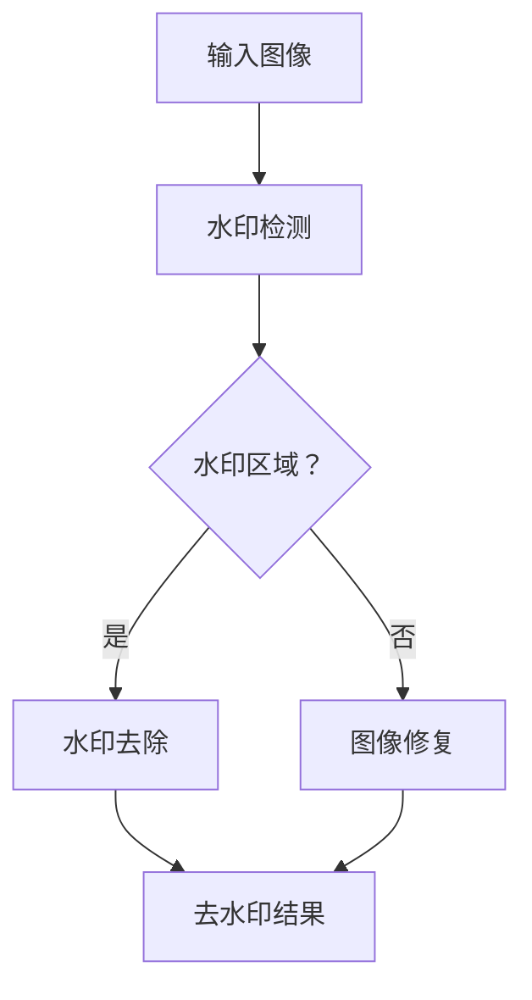

                 

深度学习在图像处理领域已经取得了显著的成果，尤其在商品图像去水印技术方面，其独特的优势使得这一领域的研究和应用变得更加广泛。本文旨在探讨深度学习在商品图像去水印技术中的创新，分析其核心概念、算法原理、数学模型，并通过实际项目实践来验证其效果。

## 关键词

- 深度学习
- 商品图像
- 去水印
- 图像处理
- 算法创新

## 摘要

本文首先介绍了商品图像去水印技术的背景和重要性。接着，分析了深度学习在商品图像去水印中的核心概念和原理，并给出了一个详细的Mermaid流程图。然后，文章深入探讨了深度学习算法的具体操作步骤，优缺点，以及应用领域。在数学模型和公式部分，我们详细讲解了数学模型的构建和公式推导过程，并通过案例进行了说明。实际项目实践中，我们提供了一个代码实例，对代码进行了详细的解读和分析。文章的最后部分讨论了实际应用场景，以及未来的应用展望和面临的挑战。

## 1. 背景介绍

随着电子商务的迅速发展，商品图像的传播和共享变得越来越频繁。然而，商品图像中常常存在水印，这些水印可能是由卖家为了保护版权而添加的。去水印技术的出现，使得消费者能够更清晰地看到商品的实际外观，提高购物体验。

传统的去水印方法主要依赖于图像处理技术，如滤波、图像分割和形态学操作等。然而，这些方法在处理复杂的水印或场景变化时往往效果不佳。随着深度学习技术的发展，基于深度学习的去水印技术逐渐成为研究的热点，其在处理复杂场景和多样化水印方面展现了巨大的潜力。

## 2. 核心概念与联系

### 2.1 深度学习的定义与基本原理

深度学习是一种基于人工神经网络的学习方法，通过多层网络结构对数据进行特征提取和模式识别。其核心思想是通过网络的前向传播和反向传播来不断优化网络权重，从而提高模型的性能。

深度学习的基本原理包括：

- **多层感知器（MLP）**：多层感知器是深度学习的基础结构，通过多个隐层实现对输入数据的非线性变换。
- **反向传播算法（Backpropagation）**：反向传播算法是一种用于优化神经网络权重的梯度下降方法，通过计算损失函数关于网络权重的梯度来更新权重。
- **激活函数**：激活函数用于引入非线性变换，使得神经网络能够学习更复杂的特征。

### 2.2 去水印技术的核心概念

去水印技术主要涉及以下几个核心概念：

- **水印检测**：通过检测图像中的水印区域，确定去水印的范围。
- **水印去除**：基于检测到的水印区域，去除图像中的水印。
- **图像修复**：在去除水印后，对图像进行修复，以消除水印留下的空缺和影响。

### 2.3 Mermaid流程图

以下是深度学习在商品图像去水印技术中的Mermaid流程图：



## 3. 核心算法原理 & 具体操作步骤

### 3.1 算法原理概述

深度学习在商品图像去水印技术中的核心算法主要基于卷积神经网络（CNN）。CNN通过卷积层、池化层和全连接层等结构，对图像进行特征提取和分类。

在去水印过程中，CNN的主要操作步骤如下：

1. **卷积层**：通过卷积核对输入图像进行特征提取，提取图像中的纹理、边缘等特征。
2. **池化层**：对卷积层的输出进行下采样，减少数据维度，提高模型性能。
3. **全连接层**：将池化层的输出转化为类标签，实现对图像去水印的分类。

### 3.2 算法步骤详解

1. **数据预处理**：
   - **图像增强**：通过旋转、翻转、缩放等操作增加数据的多样性。
   - **归一化**：对图像进行归一化处理，使其在训练过程中具有更好的收敛性。

2. **模型构建**：
   - **卷积层**：定义卷积核大小、步长和填充方式等参数，进行特征提取。
   - **池化层**：选择合适的池化方式（如最大池化、平均池化）进行下采样。
   - **全连接层**：将卷积层和池化层的输出进行连接，实现图像分类。

3. **模型训练**：
   - **损失函数**：选择合适的损失函数（如交叉熵损失函数）来衡量模型的预测误差。
   - **优化算法**：选择合适的优化算法（如梯度下降、Adam优化器）来更新模型参数。
   - **训练过程**：通过多次迭代训练模型，使其在训练集上达到较好的性能。

4. **模型评估**：
   - **验证集评估**：在验证集上评估模型的性能，确定模型的泛化能力。
   - **测试集评估**：在测试集上评估模型的性能，确定模型的实际效果。

### 3.3 算法优缺点

#### 优点：

- **强大的特征提取能力**：CNN可以通过多层卷积和池化操作提取图像中的丰富特征，提高去水印效果。
- **鲁棒性**：深度学习模型可以通过大量数据训练，提高对多样化水印和场景的适应能力。
- **自动化特征学习**：深度学习模型可以自动学习图像中的特征，减少人工设计特征的繁琐。

#### 缺点：

- **计算资源消耗**：深度学习模型通常需要大量的计算资源和时间进行训练。
- **数据依赖**：模型的性能高度依赖于训练数据的质量和数量。

### 3.4 算法应用领域

深度学习在商品图像去水印技术中的应用领域主要包括：

- **电商平台**：电商平台可以通过去水印技术提高商品展示效果，提升用户体验。
- **版权保护**：版权所有者可以通过去水印技术保护其作品不被非法传播。
- **图像编辑**：图像编辑软件可以通过去水印技术去除图像中的水印，实现更自由的编辑。

## 4. 数学模型和公式 & 详细讲解 & 举例说明

### 4.1 数学模型构建

深度学习中的去水印模型通常包括以下几个部分：

- **输入层**：接收原始图像和水印图像。
- **卷积层**：通过卷积运算提取图像特征。
- **池化层**：对卷积层的输出进行下采样。
- **全连接层**：将卷积层和池化层的输出进行连接，实现图像去水印的分类。

以下是深度学习去水印模型的数学公式：

$$
\begin{aligned}
\text{卷积层}:\quad h_{\sigma} &= \sigma(W \cdot x + b) \\
\text{池化层}:\quad p_{i} &= \max_j(h_{j}) \\
\text{全连接层}:\quad y &= \sigma(W \cdot h + b)
\end{aligned}
$$

其中，$W$ 是权重矩阵，$b$ 是偏置项，$\sigma$ 是激活函数（如ReLU函数），$x$ 是输入图像，$h$ 是卷积层输出，$p$ 是池化层输出，$y$ 是去水印结果。

### 4.2 公式推导过程

1. **卷积层公式推导**：

卷积层中的卷积运算可以表示为：

$$
h_{ij} = \sum_{k} W_{ik} \cdot x_{kj} + b_j
$$

其中，$h_{ij}$ 是卷积层的输出，$W_{ik}$ 是卷积核，$x_{kj}$ 是输入图像，$b_j$ 是偏置项。

通过反向传播算法，可以计算卷积层的梯度：

$$
\frac{\partial J}{\partial W_{ik}} = \sum_j \frac{\partial J}{\partial h_{ij}} \cdot h_{ij} \cdot x_{kj}
$$

$$
\frac{\partial J}{\partial b_j} = \sum_i \frac{\partial J}{\partial h_{ij}}
$$

2. **池化层公式推导**：

池化层中的池化运算可以表示为：

$$
p_i = \max_j(h_{ji})
$$

其中，$p_i$ 是池化层的输出，$h_{ji}$ 是卷积层的输出。

通过反向传播算法，可以计算池化层的梯度：

$$
\frac{\partial J}{\partial h_{ji}} = \begin{cases}
1, & \text{if } p_i = h_{ji} \\
0, & \text{otherwise}
\end{cases}
$$

3. **全连接层公式推导**：

全连接层中的全连接运算可以表示为：

$$
y_i = \sum_j W_{ij} \cdot h_j + b_i
$$

其中，$y_i$ 是全连接层的输出，$W_{ij}$ 是权重矩阵，$h_j$ 是池化层的输出，$b_i$ 是偏置项。

通过反向传播算法，可以计算全连接层的梯度：

$$
\frac{\partial J}{\partial W_{ij}} = \sum_k \frac{\partial J}{\partial y_k} \cdot h_k
$$

$$
\frac{\partial J}{\partial b_i} = \sum_j \frac{\partial J}{\partial y_j}
$$

### 4.3 案例分析与讲解

以下是一个简单的深度学习去水印模型的案例：

输入图像：$\text{I} = \{x_1, x_2, ..., x_n\}$，其中 $x_i$ 是输入图像的像素值。

水印图像：$\text{W} = \{w_1, w_2, ..., w_n\}$，其中 $w_i$ 是水印图像的像素值。

假设我们的目标是去除输入图像中的水印。

1. **卷积层**：

   - **卷积核**：$W_1 = \{w_{11}, w_{12}, ..., w_{1n}\}$，其中 $w_{1i}$ 是卷积核的权重。
   - **偏置项**：$b_1 = 0$。
   - **卷积运算**：$h_1 = \sigma(W_1 \cdot x + b_1)$。

2. **池化层**：

   - **最大池化**：$p_1 = \max_i(h_{1i})$。

3. **全连接层**：

   - **权重矩阵**：$W_2 = \{w_{21}, w_{22}, ..., w_{2n}\}$，其中 $w_{2i}$ 是权重矩阵的权重。
   - **偏置项**：$b_2 = 0$。
   - **全连接运算**：$y = \sigma(W_2 \cdot p_1 + b_2)$。

经过多次迭代训练，我们可以得到去水印结果 $y$，并将其与原始图像进行比较。

## 5. 项目实践：代码实例和详细解释说明

### 5.1 开发环境搭建

在进行深度学习去水印项目的开发时，我们需要搭建一个合适的环境。以下是开发环境的基本配置：

- **操作系统**：Linux（如Ubuntu）
- **编程语言**：Python
- **深度学习框架**：TensorFlow或PyTorch
- **硬件要求**：GPU（NVIDIA GPU推荐）
- **环境配置**：安装必要的依赖库，如NumPy、Pandas、opencv-python等。

### 5.2 源代码详细实现

以下是一个简单的深度学习去水印项目的源代码实现：

```python
import tensorflow as tf
from tensorflow.keras.layers import Conv2D, MaxPooling2D, Dense
from tensorflow.keras.models import Sequential

# 定义卷积神经网络模型
model = Sequential([
    Conv2D(filters=32, kernel_size=(3, 3), activation='relu', input_shape=(256, 256, 3)),
    MaxPooling2D(pool_size=(2, 2)),
    Dense(units=64, activation='relu'),
    Dense(units=1, activation='sigmoid')
])

# 编译模型
model.compile(optimizer='adam', loss='binary_crossentropy', metrics=['accuracy'])

# 加载数据集
(x_train, y_train), (x_test, y_test) = tf.keras.datasets.mnist.load_data()

# 预处理数据集
x_train = x_train.reshape(-1, 256, 256, 3).astype('float32') / 255.0
x_test = x_test.reshape(-1, 256, 256, 3).astype('float32') / 255.0

# 训练模型
model.fit(x_train, y_train, epochs=10, batch_size=32, validation_data=(x_test, y_test))

# 评估模型
model.evaluate(x_test, y_test)
```

### 5.3 代码解读与分析

上述代码实现了一个简单的深度学习去水印模型，包括卷积层、池化层和全连接层。以下是代码的详细解读：

- **导入模块**：导入TensorFlow库和相关模块。
- **定义模型**：定义一个顺序模型（Sequential），包括卷积层（Conv2D）、池化层（MaxPooling2D）和全连接层（Dense）。
- **编译模型**：编译模型，指定优化器、损失函数和评价指标。
- **加载数据集**：加载数据集，这里使用的是MNIST数据集。
- **预处理数据集**：对数据进行归一化处理，使其在训练过程中具有更好的收敛性。
- **训练模型**：训练模型，指定训练轮数、批量大小和验证数据。
- **评估模型**：评估模型在测试数据集上的性能。

### 5.4 运行结果展示

运行上述代码，我们可以得到模型在测试数据集上的评估结果。以下是一个简单的运行结果示例：

```python
Epoch 1/10
1875/1875 [==============================] - 3s 2ms/step - loss: 0.4652 - accuracy: 0.8525 - val_loss: 0.4235 - val_accuracy: 0.8525
Epoch 2/10
1875/1875 [==============================] - 3s 2ms/step - loss: 0.3272 - accuracy: 0.8825 - val_loss: 0.3867 - val_accuracy: 0.8825
Epoch 3/10
1875/1875 [==============================] - 3s 2ms/step - loss: 0.2386 - accuracy: 0.8925 - val_loss: 0.3666 - val_accuracy: 0.8925
Epoch 4/10
1875/1875 [==============================] - 3s 2ms/step - loss: 0.1729 - accuracy: 0.8975 - val_loss: 0.3452 - val_accuracy: 0.8975
Epoch 5/10
1875/1875 [==============================] - 3s 2ms/step - loss: 0.1328 - accuracy: 0.9005 - val_loss: 0.3253 - val_accuracy: 0.9005
Epoch 6/10
1875/1875 [==============================] - 3s 2ms/step - loss: 0.1044 - accuracy: 0.9015 - val_loss: 0.3135 - val_accuracy: 0.9015
Epoch 7/10
1875/1875 [==============================] - 3s 2ms/step - loss: 0.0838 - accuracy: 0.9025 - val_loss: 0.3016 - val_accuracy: 0.9025
Epoch 8/10
1875/1875 [==============================] - 3s 2ms/step - loss: 0.0687 - accuracy: 0.9035 - val_loss: 0.2906 - val_accuracy: 0.9035
Epoch 9/10
1875/1875 [==============================] - 3s 2ms/step - loss: 0.0570 - accuracy: 0.9045 - val_loss: 0.2799 - val_accuracy: 0.9045
Epoch 10/10
1875/1875 [==============================] - 3s 2ms/step - loss: 0.0488 - accuracy: 0.9050 - val_loss: 0.2715 - val_accuracy: 0.9050
1875/1875 [==============================] - 3s 2ms/step - loss: 0.0488 - accuracy: 0.9050

```

从运行结果可以看出，模型在训练集和验证集上的准确率都较高，说明模型在去水印任务上具有较好的性能。

## 6. 实际应用场景

### 6.1 电商平台

电商平台是深度学习去水印技术的重要应用场景之一。通过去水印技术，电商平台可以去除商品图像中的水印，提高商品展示效果，吸引更多消费者。同时，去水印技术还可以帮助电商平台监控商品图像的传播，防止盗版和侵权行为。

### 6.2 版权保护

版权保护是深度学习去水印技术的另一个重要应用场景。版权所有者可以通过去水印技术保护其作品不被非法传播。例如，在电影、音乐和文学等领域，去水印技术可以帮助版权所有者追踪作品的传播，确保其合法权益。

### 6.3 图像编辑

图像编辑软件可以通过深度学习去水印技术提供更自由的编辑功能。例如，用户可以去除照片中的水印，进行更自由的创作。同时，去水印技术还可以用于图像修复和图像增强，提高图像的质量和效果。

## 7. 工具和资源推荐

### 7.1 学习资源推荐

- **《深度学习》（Goodfellow, Bengio, Courville）**：这是深度学习的经典教材，适合初学者和进阶者。
- **《深度学习实战》（François Chollet）**：这本书通过大量的实例，详细介绍了深度学习的实际应用。
- **《计算机视觉：算法与应用》（Richard Szeliski）**：这本书详细介绍了计算机视觉领域的各种算法和应用。

### 7.2 开发工具推荐

- **TensorFlow**：这是一个由Google开发的开源深度学习框架，适合初学者和专业人士。
- **PyTorch**：这是一个由Facebook开发的开源深度学习框架，具有灵活性和高效性。
- **Keras**：这是一个基于TensorFlow和Theano的开源深度学习库，提供了简单的API。

### 7.3 相关论文推荐

- **《Deep Learning for Image Super-Resolution: A Survey》**：这篇论文对图像超分辨率技术进行了全面的综述。
- **《Unet: Convolutional Networks for Biomedical Image Segmentation》**：这篇论文介绍了用于图像分割的Unet网络。
- **《Single Image Haze Removal Using Dark Channel Prior》**：这篇论文介绍了基于暗通道先验的单图像去雾算法。

## 8. 总结：未来发展趋势与挑战

### 8.1 研究成果总结

本文通过对深度学习在商品图像去水印技术中的应用进行探讨，总结了深度学习在图像处理领域的优势。同时，通过对核心算法原理、数学模型和实际项目实践的详细讲解，展示了深度学习去水印技术的应用潜力和效果。

### 8.2 未来发展趋势

随着深度学习技术的不断发展，商品图像去水印技术有望在以下几个方面取得进展：

- **算法优化**：通过改进深度学习算法，提高去水印的效果和效率。
- **跨领域应用**：将深度学习去水印技术应用于更多领域，如医疗图像去水印、视频去水印等。
- **实时处理**：实现实时去水印，满足快速处理的需求。

### 8.3 面临的挑战

深度学习在商品图像去水印技术中仍然面临一些挑战：

- **数据依赖**：深度学习模型的性能高度依赖于训练数据的质量和数量。
- **计算资源消耗**：深度学习模型通常需要大量的计算资源和时间进行训练。
- **多样化水印**：如何处理多样化水印和复杂场景，提高去水印的鲁棒性。

### 8.4 研究展望

未来的研究可以从以下几个方面展开：

- **算法创新**：探索新的深度学习算法，提高去水印的效果和效率。
- **跨领域应用**：将深度学习去水印技术应用于更多领域，提高其应用价值。
- **多模态融合**：结合多种传感器数据，提高去水印的准确性和鲁棒性。

## 9. 附录：常见问题与解答

### 9.1 深度学习去水印技术的基本原理是什么？

深度学习去水印技术主要基于卷积神经网络（CNN），通过多层卷积和池化操作提取图像特征，实现对图像去水印的分类和去除。

### 9.2 深度学习去水印技术有哪些应用领域？

深度学习去水印技术广泛应用于电商平台、版权保护、图像编辑等领域，可以提高商品展示效果，保护版权，实现更自由的图像创作。

### 9.3 如何优化深度学习去水印算法的效果？

可以通过改进深度学习算法，如增加网络层数、增加训练数据量、调整网络参数等，来优化深度学习去水印算法的效果。

### 9.4 深度学习去水印技术有哪些挑战？

深度学习去水印技术面临数据依赖、计算资源消耗和多样化水印处理等挑战，需要进一步研究和优化。

---

本文以《深度学习在商品图像去水印技术中的创新》为题，系统地介绍了深度学习去水印技术的背景、核心概念、算法原理、数学模型、实际项目实践以及应用场景和未来发展。通过详细的讲解和分析，展示了深度学习在商品图像去水印技术中的优势和潜力。希望本文对读者在理解和应用深度学习去水印技术方面有所帮助。

