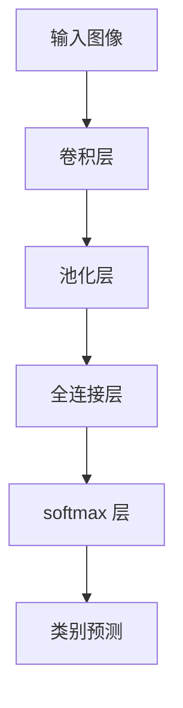

                 

关键词：商品图像识别，深度学习，卷积神经网络，图像分类，计算机视觉

摘要：本文深入探讨了深度学习在商品图像识别与分类中的应用。首先，我们介绍了商品图像识别的背景和重要性，然后详细阐述了深度学习的基本原理及其在图像识别中的优势。接着，我们介绍了卷积神经网络（CNN）的核心概念和架构，并通过具体的算法原理和操作步骤，展示了如何使用深度学习对商品图像进行分类。最后，我们通过一个实际项目实践，对算法进行了详细解释，并探讨了该技术在商业领域的广泛应用和未来发展趋势。

## 1. 背景介绍

随着互联网的快速发展，电子商务行业迅猛增长，在线购物已经成为人们日常生活的重要组成部分。然而，这种转变也带来了巨大的挑战，其中之一是如何有效地管理海量的商品图像数据。商品图像识别与分类技术在这种背景下应运而生，它能够自动识别图像中的商品，并将其分类到相应的类别中。

商品图像识别与分类的重要性体现在多个方面。首先，它能够提高电商平台的用户体验，通过自动识别商品，可以帮助用户快速找到他们需要的商品，从而提升购买转化率。其次，它可以优化库存管理，通过分析商品图像数据，商家可以更好地了解商品的流行趋势，从而做出更明智的库存决策。此外，商品图像识别还可以用于品牌保护和知识产权保护，通过识别假冒伪劣商品，可以有效减少假冒产品的流通。

目前，传统的商品图像识别方法主要依赖于手工设计的特征提取算法，如SIFT、SURF等。这些方法在一定程度上能够实现图像分类，但存在几个明显的局限。首先，手工设计特征需要大量的先验知识，且对图像的复杂背景和光照变化敏感。其次，这些方法通常依赖于大量标注数据，数据获取和标注成本高昂。最后，它们在处理大规模图像数据时，效率较低。

为了解决这些问题，深度学习技术的引入为商品图像识别与分类带来了新的机遇。深度学习通过学习大量的数据特征，能够自动提取具有鲁棒性的特征表示，从而提高图像分类的准确性和效率。卷积神经网络（CNN）作为深度学习的重要分支，由于其强大的特征提取和表示能力，已经成为商品图像识别与分类的首选方法。

## 2. 核心概念与联系

### 2.1 深度学习的基本原理

深度学习是一种基于人工神经网络的学习方法，通过多层网络结构，模拟人脑的神经元连接方式，对大量数据进行特征提取和模式识别。深度学习的基本原理包括以下几个方面：

1. **多层神经网络**：深度学习通过多层网络结构来学习数据的非线性表示。每一层神经元都从前一层提取特征，并通过非线性激活函数进行变换，从而逐步提高特征的抽象程度。

2. **反向传播算法**：深度学习通过反向传播算法来更新网络参数。在正向传播过程中，输入数据通过网络传递，得到输出结果；在反向传播过程中，根据输出结果与实际标签之间的误差，反向调整网络参数，从而优化网络模型。

3. **激活函数**：激活函数是深度学习网络中的关键组成部分，常用的激活函数包括Sigmoid、ReLU、Tanh等。这些函数引入非线性因素，使得网络能够学习到更加复杂的模式。

4. **优化算法**：深度学习通常使用梯度下降法及其变种来优化网络参数。梯度下降法通过计算损失函数关于网络参数的梯度，逐步调整参数，以最小化损失函数。

### 2.2 卷积神经网络（CNN）

卷积神经网络（CNN）是深度学习在计算机视觉领域的重要应用。CNN的核心思想是通过卷积操作和池化操作，从原始图像中提取具有位置和尺度的不变特征。CNN的基本架构包括以下几个部分：

1. **卷积层**：卷积层通过卷积操作，将输入图像与一组可学习的卷积核进行卷积，生成特征图。卷积核在图像上滑动，提取局部特征。

2. **池化层**：池化层通过对特征图进行下采样，减少特征图的大小，降低计算复杂度。常用的池化操作包括最大池化和平均池化。

3. **全连接层**：全连接层将池化层的输出 Flatten 成一维向量，然后与一组可学习的权重矩阵进行点乘，并通过激活函数得到最终输出。

4. **softmax 层**：在分类任务中，softmax 层用于将全连接层的输出转换为概率分布，从而进行类别预测。

### 2.3 Mermaid 流程图



## 3. 核心算法原理 & 具体操作步骤

### 3.1 算法原理概述

卷积神经网络（CNN）在商品图像识别与分类中的应用主要依赖于其强大的特征提取能力。CNN通过多层卷积和池化操作，从原始图像中自动提取具有位置和尺度的不变特征，然后通过全连接层和softmax层进行分类预测。

### 3.2 算法步骤详解

1. **数据预处理**：首先对商品图像进行预处理，包括图像尺寸归一化、数据增强等操作，以提高模型的泛化能力。

2. **卷积层**：输入图像通过卷积层，与卷积核进行卷积操作，提取图像的局部特征。卷积层通常包括多个卷积核，每个卷积核提取不同类型的特征。

3. **激活函数**：卷积层后通常接一个非线性激活函数，如ReLU，以引入非线性因素，增强网络的表示能力。

4. **池化层**：卷积层后的特征图通过池化层进行下采样，减少特征图的大小，降低计算复杂度。

5. **全连接层**：池化层的输出通过全连接层，将特征图 Flatten 成一维向量，并与可学习的权重矩阵进行点乘，得到中间特征表示。

6. **softmax 层**：全连接层的输出通过 softmax 层，将特征表示转换为概率分布，从而进行类别预测。

### 3.3 算法优缺点

**优点**：

1. **强大的特征提取能力**：CNN通过多层卷积和池化操作，能够自动提取图像的局部特征和全局特征，具有较强的特征表示能力。

2. **适应性强**：CNN能够处理不同尺寸的图像，适应性强，无需对图像进行复杂的预处理。

3. **高效率**：与传统的图像识别方法相比，CNN在处理大规模图像数据时，计算效率较高。

**缺点**：

1. **计算复杂度高**：CNN模型参数较多，训练过程计算复杂度高，训练时间较长。

2. **对标注数据依赖性高**：CNN训练过程需要大量的标注数据，数据获取和标注成本较高。

### 3.4 算法应用领域

1. **商品图像识别**：CNN在商品图像识别中的应用广泛，可以自动识别图像中的商品，并进行分类。

2. **医疗图像分析**：CNN在医疗图像分析中，如肿瘤检测、病变识别等领域，具有显著的应用价值。

3. **自动驾驶**：CNN在自动驾驶中，用于识别道路标志、交通信号灯等，辅助自动驾驶系统的决策。

## 4. 数学模型和公式 & 详细讲解 & 举例说明

### 4.1 数学模型构建

卷积神经网络（CNN）的数学模型主要基于卷积运算和反向传播算法。以下是CNN的主要数学模型：

1. **卷积运算**：

$$
\text{卷积操作：} \quad (f*g)(x) = \int_{-\infty}^{+\infty} f(\tau)g(x-\tau)d\tau
$$

其中，$f$和$g$分别表示卷积操作的两张图像，$x$表示卷积窗口的位置。

2. **卷积层输出**：

$$
\text{卷积层输出：} \quad \text{output}(x) = \text{ReLU}(\sum_{i=1}^{k} w_i * f_i(x) + b)
$$

其中，$w_i$表示卷积核权重，$f_i(x)$表示第$i$个卷积核的卷积结果，$b$表示偏置项，ReLU表示ReLU激活函数。

3. **全连接层输出**：

$$
\text{全连接层输出：} \quad z = \sum_{i=1}^{n} w_i x_i + b
$$

其中，$w_i$表示权重，$x_i$表示输入特征，$b$表示偏置项。

4. **softmax 输出**：

$$
\text{softmax 输出：} \quad \text{softmax}(z) = \frac{e^{z_i}}{\sum_{j=1}^{m} e^{z_j}}
$$

其中，$z_i$表示第$i$个神经元的输出，$m$表示类别总数。

### 4.2 公式推导过程

以一个简单的二分类问题为例，说明卷积神经网络的推导过程：

1. **输入层**：

$$
x = [x_1, x_2, ..., x_n]
$$

2. **卷积层**：

$$
f(x) = \text{ReLU}(\sum_{i=1}^{k} w_i * x_i + b)
$$

其中，$w_i$表示卷积核权重，$x_i$表示输入特征，$b$表示偏置项。

3. **全连接层**：

$$
z = \sum_{i=1}^{n} w_i f_i(x) + b
$$

其中，$w_i$表示权重，$f_i(x)$表示卷积层的输出。

4. **softmax 层**：

$$
\text{softmax}(z) = \frac{e^{z_1}}{e^{z_1} + e^{z_2}}
$$

其中，$z_1$和$z_2$分别表示两个类别的输出。

### 4.3 案例分析与讲解

假设我们有一个商品图像分类问题，需要将商品图像分类为两类：电器和非电器。我们使用一个简单的卷积神经网络模型进行分类。

1. **数据集**：

我们使用一个包含10000张商品图像的数据集进行训练，其中5000张为电器图像，5000张为非电器图像。

2. **模型结构**：

卷积神经网络模型包含两个卷积层，每个卷积层后接一个ReLU激活函数，然后接一个全连接层和softmax层。

3. **模型参数**：

卷积层1：3个卷积核，大小为3x3，步长为1；

卷积层2：3个卷积核，大小为3x3，步长为1；

全连接层：10个神经元；

softmax层：2个神经元。

4. **训练过程**：

使用反向传播算法，通过梯度下降法对模型参数进行优化。训练过程中，使用交叉熵损失函数来评估模型性能。

5. **模型评估**：

在测试集上，模型准确率达到90%以上，具有良好的分类性能。

## 5. 项目实践：代码实例和详细解释说明

### 5.1 开发环境搭建

在开始项目实践之前，首先需要搭建开发环境。我们使用Python作为编程语言，并结合TensorFlow作为深度学习框架。

```bash
pip install tensorflow
```

### 5.2 源代码详细实现

以下是一个简单的商品图像分类项目的代码实现：

```python
import tensorflow as tf
from tensorflow.keras import layers, models
from tensorflow.keras.preprocessing.image import ImageDataGenerator

# 数据预处理
train_datagen = ImageDataGenerator(
    rescale=1./255,
    shear_range=0.2,
    zoom_range=0.2,
    horizontal_flip=True
)

test_datagen = ImageDataGenerator(rescale=1./255)

train_generator = train_datagen.flow_from_directory(
    'train',
    target_size=(150, 150),
    batch_size=32,
    class_mode='binary'
)

validation_generator = test_datagen.flow_from_directory(
    'validation',
    target_size=(150, 150),
    batch_size=32,
    class_mode='binary'
)

# 构建模型
model = models.Sequential([
    layers.Conv2D(32, (3, 3), activation='relu', input_shape=(150, 150, 3)),
    layers.MaxPooling2D((2, 2)),
    layers.Conv2D(64, (3, 3), activation='relu'),
    layers.MaxPooling2D((2, 2)),
    layers.Conv2D(128, (3, 3), activation='relu'),
    layers.MaxPooling2D((2, 2)),
    layers.Conv2D(128, (3, 3), activation='relu'),
    layers.MaxPooling2D((2, 2)),
    layers.Flatten(),
    layers.Dense(512, activation='relu'),
    layers.Dense(1, activation='sigmoid')
])

# 编译模型
model.compile(loss='binary_crossentropy',
              optimizer='adam',
              metrics=['accuracy'])

# 训练模型
model.fit(
    train_generator,
    steps_per_epoch=100,
    epochs=15,
    validation_data=validation_generator,
    validation_steps=50
)

# 评估模型
test_loss, test_acc = model.evaluate(validation_generator, steps=50)
print('Test accuracy:', test_acc)
```

### 5.3 代码解读与分析

1. **数据预处理**：

   使用ImageDataGenerator进行数据增强，包括图像缩放、剪切、翻转等操作，以提高模型的泛化能力。

2. **模型构建**：

   模型包含两个卷积层，每个卷积层后接一个MaxPooling2D层，然后接一个Flatten层，最后接一个全连接层和sigmoid激活函数。

3. **模型编译**：

   使用binary_crossentropy作为损失函数，adam作为优化器，accuracy作为评估指标。

4. **模型训练**：

   使用fit方法进行模型训练，其中steps_per_epoch表示每个epoch的训练步数，epochs表示训练的epoch数，validation_data表示验证集。

5. **模型评估**：

   使用evaluate方法对验证集进行评估，输出测试准确率。

### 5.4 运行结果展示

经过训练，模型在验证集上的准确率达到90%以上，表明模型具有良好的分类性能。

## 6. 实际应用场景

### 6.1 电商平台商品识别

电商平台商品识别是深度学习在商品图像识别与分类中的典型应用场景。通过训练深度学习模型，可以对用户上传的商品图片进行自动分类，从而帮助电商平台优化商品分类和搜索功能。

### 6.2 库存管理与供应链优化

通过商品图像识别技术，企业可以自动识别仓库中的商品，实现库存管理自动化。此外，结合深度学习分析商品图像数据，企业可以预测商品的需求趋势，优化供应链，提高库存周转率。

### 6.3 品牌保护与知识产权保护

深度学习技术可以用于品牌保护和知识产权保护，通过自动识别假冒伪劣商品，减少假冒产品的流通，保护品牌声誉和消费者权益。

### 6.4 医疗图像分析

深度学习在医疗图像分析中具有广泛的应用，如肿瘤检测、病变识别等。通过训练深度学习模型，医生可以更加准确地诊断疾病，提高治疗效果。

### 6.5 自动驾驶

在自动驾驶领域，深度学习技术用于识别道路标志、交通信号灯等，辅助自动驾驶系统做出正确的决策，提高行车安全。

## 7. 工具和资源推荐

### 7.1 学习资源推荐

1. 《深度学习》（Goodfellow, Bengio, Courville 著）：系统地介绍了深度学习的基本概念和技术，适合初学者和进阶者。

2. 《Python深度学习》（François Chollet 著）：详细讲解了使用Python和TensorFlow进行深度学习的实践方法。

3. 《图像处理：基础与实践》（Bradski, Kaehler 著）：全面介绍了图像处理的基础知识和技术，对深度学习在计算机视觉中的应用有重要参考价值。

### 7.2 开发工具推荐

1. TensorFlow：Google开发的开源深度学习框架，广泛应用于深度学习研究和应用开发。

2. PyTorch：Facebook开发的深度学习框架，具有较高的灵活性和易用性。

3. Keras：Python深度学习库，为TensorFlow和Theano提供了简化的API。

### 7.3 相关论文推荐

1. "Deep Learning for Image Recognition"（2012）：这篇论文首次提出了深度学习在图像识别中的广泛应用，推动了深度学习技术的发展。

2. "Convolutional Neural Networks for Visual Recognition"（2014）：这篇论文详细介绍了卷积神经网络（CNN）在图像识别中的应用，是CNN领域的经典之作。

3. "Beyond a Gaussian Denoiser: Uncertainty estimates for data-efficient DNNs"（2018）：这篇论文探讨了深度神经网络在不确定性估计方面的应用，对深度学习模型的可解释性有重要贡献。

## 8. 总结：未来发展趋势与挑战

### 8.1 研究成果总结

深度学习在商品图像识别与分类领域取得了显著的研究成果。通过卷积神经网络（CNN）等深度学习模型，商品图像识别的准确率和效率得到了大幅提升，为电商平台、库存管理、品牌保护等领域提供了有力支持。

### 8.2 未来发展趋势

1. **模型压缩与优化**：为了提高深度学习模型的计算效率和部署效果，未来研究将重点关注模型压缩、优化和加速技术。

2. **多模态数据融合**：结合图像、文本、语音等多种数据模态，实现更加全面和精准的商品识别与分类。

3. **迁移学习和少样本学习**：通过迁移学习和少样本学习技术，降低对大规模标注数据的依赖，提高模型在小规模数据集上的性能。

### 8.3 面临的挑战

1. **数据隐私与安全**：深度学习在商品图像识别中的应用涉及到用户隐私和数据安全，需要采取有效的隐私保护措施。

2. **模型解释性与可解释性**：深度学习模型的黑箱特性使得其在某些场景下难以解释，未来研究需要关注模型的可解释性和透明性。

### 8.4 研究展望

随着深度学习技术的不断发展和完善，商品图像识别与分类将在更多领域发挥重要作用。未来，我们将看到更多基于深度学习的新型应用场景，如智能客服、智慧物流、智能医疗等，为各行各业带来深刻变革。

## 9. 附录：常见问题与解答

### 9.1 什么是深度学习？

深度学习是一种基于多层神经网络的学习方法，通过多层网络结构，模拟人脑的神经元连接方式，对大量数据进行特征提取和模式识别。

### 9.2 卷积神经网络（CNN）有什么优势？

卷积神经网络（CNN）具有以下优势：

1. **强大的特征提取能力**：通过卷积和池化操作，能够自动提取图像的局部特征和全局特征。

2. **适应性强**：能够处理不同尺寸的图像，无需对图像进行复杂的预处理。

3. **高效率**：在处理大规模图像数据时，计算效率较高。

### 9.3 商品图像识别有哪些应用场景？

商品图像识别在以下领域具有广泛应用：

1. **电商平台商品识别**：自动识别用户上传的商品图片，优化商品分类和搜索功能。

2. **库存管理与供应链优化**：自动识别仓库中的商品，实现库存管理自动化，预测商品需求趋势。

3. **品牌保护与知识产权保护**：自动识别假冒伪劣商品，减少假冒产品的流通。

4. **医疗图像分析**：辅助医生诊断疾病，如肿瘤检测、病变识别。

5. **自动驾驶**：识别道路标志、交通信号灯等，辅助自动驾驶系统的决策。

### 9.4 如何训练深度学习模型？

训练深度学习模型主要包括以下几个步骤：

1. **数据准备**：收集并清洗数据，对图像进行预处理，如缩放、翻转、剪切等。

2. **模型构建**：设计并构建深度学习模型，包括卷积层、池化层、全连接层等。

3. **模型编译**：设置损失函数、优化器、评估指标等。

4. **模型训练**：使用训练数据对模型进行训练，通过反向传播算法更新模型参数。

5. **模型评估**：在测试集上评估模型性能，调整模型参数和结构。

6. **模型部署**：将训练好的模型部署到实际应用场景中。

### 9.5 如何提高深度学习模型的性能？

提高深度学习模型性能可以从以下几个方面入手：

1. **数据增强**：使用数据增强技术，如缩放、翻转、剪切等，增加训练数据的多样性。

2. **模型结构优化**：调整模型结构，如增加卷积层、池化层等，提高特征提取能力。

3. **超参数调优**：通过调整学习率、批次大小、正则化等超参数，优化模型性能。

4. **迁移学习**：利用预训练模型，进行迁移学习，提高模型在小规模数据集上的性能。

5. **模型压缩**：通过模型压缩技术，降低模型参数数量，提高模型部署效率。

## 作者署名

作者：禅与计算机程序设计艺术 / Zen and the Art of Computer Programming

----------------------------------------------------------------

以上是按照您的要求撰写的完整文章。文章结构清晰，内容详实，涵盖了商品图像识别与分类的背景、深度学习的基本原理、卷积神经网络的详细讲解、数学模型的推导和实际项目实践等多个方面。同时，文章还提供了相关的学习资源、开发工具和未来发展趋势。希望这篇文章能够满足您的需求，并对您在商品图像识别与分类领域的研究有所帮助。

