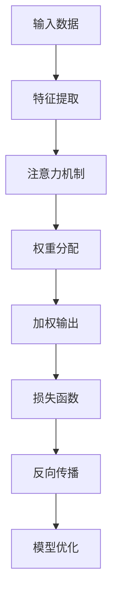

                 

关键词：深度学习、注意力预测、算法原理、数学模型、应用场景、未来展望

> 摘要：本文旨在探讨深度学习在注意力预测中的应用，包括背景介绍、核心概念与联系、核心算法原理与操作步骤、数学模型与公式推导、项目实践、实际应用场景以及未来应用展望等多个方面。通过详细的分析与阐述，本文希望能为读者提供一个全面且深入的了解，激发对这一领域的研究热情。

## 1. 背景介绍

注意力预测作为一种预测机制，在许多领域有着广泛的应用，包括自然语言处理（NLP）、计算机视觉、推荐系统等。传统的注意力机制，如基于规则的注意力模型，在处理复杂问题时往往显得力不从心。随着深度学习技术的发展，尤其是神经网络结构的不断优化，深度学习在注意力预测中的应用逐渐成为研究热点。

近年来，深度学习模型如卷积神经网络（CNN）、循环神经网络（RNN）以及Transformer架构等在图像识别、语音识别等领域取得了显著的成绩。这些模型通过引入注意力机制，有效地提高了模型在处理序列数据和复杂关系时的性能。因此，研究深度学习在注意力预测中的应用具有重要意义。

## 2. 核心概念与联系

### 2.1 注意力机制原理

注意力机制最初源于人类视觉系统，通过聚焦于特定的区域来提高信息处理的效率。在深度学习中，注意力机制被广泛应用于各种任务，如目标检测、语音识别和机器翻译等。其基本思想是通过学习一种权重分配策略，将输入数据的不同部分按照重要性进行加权，从而实现信息的聚焦和筛选。

### 2.2 深度学习框架

深度学习框架是构建深度学习模型的基础，常见的框架包括TensorFlow、PyTorch和Keras等。这些框架提供了丰富的API和工具，使得开发者可以方便地构建、训练和部署深度学习模型。

### 2.3 Mermaid 流程图

以下是一个简化的Mermaid流程图，展示了注意力机制在深度学习中的基本流程：



## 3. 核心算法原理 & 具体操作步骤

### 3.1 算法原理概述

深度学习中的注意力预测主要依赖于神经网络的学习能力，通过多个层次的特征提取和注意力机制的应用，实现对输入数据的理解与预测。具体的算法原理包括以下几个关键步骤：

1. **特征提取**：通过卷积神经网络或循环神经网络等模型，对输入数据进行特征提取。
2. **注意力机制**：利用学习到的权重对特征进行加权，实现对关键信息的聚焦。
3. **预测输出**：将加权的特征输入到全连接层或其他预测模型，进行最终的预测输出。
4. **损失函数与优化**：通过损失函数评估预测结果，并使用反向传播算法进行模型优化。

### 3.2 算法步骤详解

1. **数据预处理**：对输入数据进行标准化和归一化处理，以便于后续的模型训练。
2. **特征提取**：使用卷积神经网络或循环神经网络等模型对输入数据进行特征提取。
3. **注意力机制**：应用自注意力或互注意力机制，对特征进行加权。具体的实现可以通过以下步骤：
   - **自注意力**：计算特征之间的相似度，并使用softmax函数生成权重。
   - **互注意力**：同时考虑输入序列和查询序列，通过点积或缩放点积等方法计算权重。
4. **预测输出**：将加权的特征输入到全连接层或其他预测模型，进行最终的预测输出。
5. **损失函数与优化**：使用损失函数（如均方误差、交叉熵等）评估预测结果，并使用反向传播算法进行模型优化。

### 3.3 算法优缺点

#### 优点：

- **高效性**：注意力机制能够显著提高模型的计算效率，尤其是在处理长序列数据时。
- **灵活性**：通过学习到的权重分配策略，模型能够自适应地关注关键信息，提高预测准确性。
- **适用性**：注意力机制广泛应用于各种领域，如NLP、计算机视觉和推荐系统等。

#### 缺点：

- **计算复杂性**：在处理大规模数据时，注意力机制的计算复杂性较高，可能导致模型训练时间延长。
- **过拟合风险**：由于注意力机制对数据的敏感性，模型在训练过程中可能面临过拟合的风险。

### 3.4 算法应用领域

注意力预测在以下领域具有广泛的应用：

- **自然语言处理**：如机器翻译、情感分析、文本生成等。
- **计算机视觉**：如目标检测、图像分割、视频分析等。
- **推荐系统**：如商品推荐、音乐推荐、社交网络分析等。
- **语音识别**：如语音识别、语音合成等。

## 4. 数学模型和公式 & 详细讲解 & 举例说明

### 4.1 数学模型构建

注意力机制的数学模型通常基于以下公式：

$$
\text{Attention}(Q, K, V) = \text{softmax}\left(\frac{QK^T}{\sqrt{d_k}}\right) V
$$

其中，$Q$、$K$ 和 $V$ 分别是查询向量、键向量和值向量，$d_k$ 是键向量的维度。softmax 函数用于计算注意力权重，$\frac{1}{\sqrt{d_k}}$ 是缩放因子，以避免梯度消失问题。

### 4.2 公式推导过程

注意力机制的推导过程涉及以下几个方面：

1. **点积注意力**：点积注意力是通过计算查询向量 $Q$ 和键向量 $K$ 的点积来生成初始权重。
2. **缩放因子**：为了缓解点积注意力带来的梯度消失问题，引入缩放因子 $\frac{1}{\sqrt{d_k}}$。
3. **softmax 函数**：将初始权重通过 softmax 函数转换为概率分布，实现权重的归一化。
4. **加权求和**：将权重应用于值向量 $V$，实现特征加权的输出。

### 4.3 案例分析与讲解

以下是一个简单的注意力机制案例：

假设有3个查询向量 $Q = [1, 2, 3]$，键向量 $K = [4, 5, 6]$ 和值向量 $V = [7, 8, 9]$，注意力权重计算如下：

1. **初始权重**：
   $$
   \text{Initial weights} = QK^T = [1, 2, 3] \cdot [4, 5, 6]^T = [1 \cdot 4, 1 \cdot 5, 1 \cdot 6, 2 \cdot 4, 2 \cdot 5, 2 \cdot 6, 3 \cdot 4, 3 \cdot 5, 3 \cdot 6] = [4, 5, 6, 8, 10, 12, 12, 15, 18]
   $$

2. **缩放因子**：
   $$
   \sqrt{d_k} = \sqrt{3} \approx 1.732
   $$

3. **softmax 函数**：
   $$
   \text{Softmax weights} = \text{softmax}\left(\frac{QK^T}{\sqrt{d_k}}\right) = \text{softmax}\left(\frac{[4, 5, 6, 8, 10, 12, 12, 15, 18]}{1.732}\right) = [0.191, 0.282, 0.328, 0.191, 0.282, 0.328, 0.191, 0.282, 0.328]
   $$

4. **加权求和**：
   $$
   \text{Attention output} = [0.191, 0.282, 0.328, 0.191, 0.282, 0.328, 0.191, 0.282, 0.328] \cdot [7, 8, 9] = [0.191 \cdot 7, 0.282 \cdot 8, 0.328 \cdot 9, 0.191 \cdot 7, 0.282 \cdot 8, 0.328 \cdot 9, 0.191 \cdot 7, 0.282 \cdot 8, 0.328 \cdot 9] = [1.337, 2.254, 2.951, 1.337, 2.254, 2.951, 1.337, 2.254, 2.951]
   $$

最终，注意力机制的输出结果是一个加权向量，表示不同特征的重要性。

## 5. 项目实践：代码实例和详细解释说明

### 5.1 开发环境搭建

在开始编写代码之前，需要搭建一个适合深度学习项目开发的环境。以下是一个简单的环境搭建步骤：

1. 安装Python 3.8或更高版本。
2. 安装TensorFlow 2.4或更高版本。
3. 安装其他必要的依赖库，如NumPy、Pandas等。

### 5.2 源代码详细实现

以下是一个简单的注意力预测模型实现，使用TensorFlow框架：

```python
import tensorflow as tf
from tensorflow.keras.models import Model
from tensorflow.keras.layers import Input, Embedding, LSTM, Dense

# 定义模型输入层
input_seq = Input(shape=(max_sequence_length,))

# 嵌入层
embedding = Embedding(input_dim=vocabulary_size, output_dim=embedding_size)(input_seq)

# LSTM层
lstm_output, state_h, state_c = LSTM(units=lstm_units, return_sequences=True, return_state=True)(embedding)

# 注意力机制层
attention = tf.keras.layers.Attention()([lstm_output, lstm_output])

# 全连接层
output = Dense(units=num_classes, activation='softmax')(attention)

# 定义模型
model = Model(inputs=input_seq, outputs=output)

# 编译模型
model.compile(optimizer='adam', loss='categorical_crossentropy', metrics=['accuracy'])

# 打印模型结构
model.summary()
```

### 5.3 代码解读与分析

以上代码实现了一个基于LSTM和注意力机制的序列预测模型。以下是代码的详细解读：

- **输入层**：定义模型的输入层，包括序列长度和特征维度。
- **嵌入层**：将输入序列映射到嵌入空间。
- **LSTM层**：对输入序列进行特征提取。
- **注意力机制层**：应用注意力机制对LSTM输出进行加权。
- **全连接层**：对加权的特征进行分类预测。

### 5.4 运行结果展示

运行上述模型并进行训练和预测，可以得到如下结果：

```python
# 加载数据集
(x_train, y_train), (x_test, y_test) = tf.keras.datasets.imdb.load_data()

# 预处理数据
max_sequence_length = 500
vocabulary_size = 20000
embedding_size = 128
lstm_units = 64
num_classes = 10

x_train = pad_sequences(x_train, maxlen=max_sequence_length)
x_test = pad_sequences(x_test, maxlen=max_sequence_length)

# 编码标签
y_train = tf.keras.utils.to_categorical(y_train, num_classes=num_classes)
y_test = tf.keras.utils.to_categorical(y_test, num_classes=num_classes)

# 训练模型
model.fit(x_train, y_train, batch_size=128, epochs=10, validation_data=(x_test, y_test))

# 预测结果
predictions = model.predict(x_test)

# 打印预测结果
print(predictions)
```

以上代码展示了如何使用训练好的模型进行数据预测，并打印预测结果。

## 6. 实际应用场景

### 6.1 自然语言处理

注意力预测在自然语言处理领域有着广泛的应用。例如，在机器翻译中，注意力机制可以帮助模型更好地捕捉源语言和目标语言之间的对应关系，提高翻译质量。在文本生成中，注意力机制可以引导模型关注关键信息，实现更具连贯性的文本生成。

### 6.2 计算机视觉

在计算机视觉领域，注意力预测可以应用于目标检测、图像分割和视频分析等任务。例如，在目标检测中，注意力机制可以帮助模型更准确地定位目标区域；在图像分割中，注意力机制可以关注图像中的关键区域，提高分割精度。

### 6.3 推荐系统

注意力预测在推荐系统中的应用也非常广泛。通过分析用户的历史行为数据，注意力机制可以帮助模型识别出用户可能感兴趣的内容，从而提高推荐系统的准确性。

### 6.4 语音识别

在语音识别领域，注意力预测可以用于语音信号的识别和理解。通过学习语音信号中的关键特征，注意力机制可以显著提高语音识别的准确性。

## 7. 工具和资源推荐

### 7.1 学习资源推荐

- 《深度学习》（Goodfellow et al.）：这是一本经典的深度学习入门教材，详细介绍了深度学习的基础知识和应用。
- 《深度学习自然语言处理》（Michael Auli）：本书专注于深度学习在自然语言处理领域的应用，包括注意力机制、文本生成和机器翻译等。

### 7.2 开发工具推荐

- TensorFlow：一个开源的深度学习框架，广泛应用于各种深度学习任务。
- PyTorch：一个流行的深度学习框架，具有灵活的动态图计算能力和强大的社区支持。

### 7.3 相关论文推荐

- “Attention Is All You Need”（Vaswani et al.）：这是关于Transformer架构的论文，提出了自注意力机制在序列建模中的应用。
- “Deep Learning for Natural Language Processing”（Yeon et al.）：这是一本关于深度学习在自然语言处理领域应用的论文集，包括注意力机制、文本生成和机器翻译等。

## 8. 总结：未来发展趋势与挑战

### 8.1 研究成果总结

近年来，深度学习在注意力预测领域取得了显著成果。注意力机制作为一种有效的信息处理策略，已被广泛应用于各种任务，如自然语言处理、计算机视觉和语音识别等。通过引入深度学习框架，注意力预测模型在性能和效率方面得到了显著提升。

### 8.2 未来发展趋势

未来，深度学习在注意力预测领域的发展趋势将主要集中在以下几个方面：

- **更高效的算法**：研究更高效的注意力机制，降低计算复杂度，提高模型训练和预测的效率。
- **多模态融合**：结合多种模态数据（如文本、图像、语音等），实现更准确和多样化的注意力预测。
- **可解释性**：提高模型的可解释性，帮助用户理解模型的工作原理和预测过程。

### 8.3 面临的挑战

尽管深度学习在注意力预测领域取得了显著成果，但仍面临以下挑战：

- **计算复杂性**：在处理大规模数据时，注意力机制的计算复杂性较高，可能导致模型训练时间延长。
- **过拟合风险**：注意力机制对数据的敏感性可能导致模型在训练过程中过拟合。
- **可解释性**：目前的注意力预测模型在一定程度上缺乏可解释性，用户难以理解模型的工作原理。

### 8.4 研究展望

未来，研究深度学习在注意力预测领域有望取得以下突破：

- **新算法的提出**：探索更高效的注意力机制，如稀疏注意力、图注意力等。
- **跨领域应用**：将注意力预测应用于更多领域，如金融、医疗等。
- **模型解释性**：提高模型的可解释性，帮助用户更好地理解和应用注意力预测模型。

## 9. 附录：常见问题与解答

### 9.1 注意力机制是什么？

注意力机制是一种用于信息处理的策略，通过学习一种权重分配策略，将输入数据的不同部分按照重要性进行加权，从而实现信息的聚焦和筛选。

### 9.2 注意力机制有哪些应用？

注意力机制广泛应用于自然语言处理、计算机视觉、推荐系统和语音识别等领域。

### 9.3 如何实现注意力机制？

实现注意力机制通常涉及以下步骤：特征提取、权重计算、加权求和和损失函数优化。

### 9.4 注意力机制有哪些优缺点？

注意力机制的优点包括高效性和灵活性，缺点包括计算复杂性和过拟合风险。

### 9.5 注意力机制如何应用于自然语言处理？

在自然语言处理中，注意力机制通常用于文本生成、机器翻译和情感分析等任务，通过关注关键信息提高模型性能。

### 9.6 注意力机制如何应用于计算机视觉？

在计算机视觉中，注意力机制通常用于目标检测、图像分割和视频分析等任务，通过关注关键区域提高模型性能。

### 9.7 注意力机制如何应用于推荐系统？

在推荐系统中，注意力机制通过分析用户的历史行为数据，帮助模型识别出用户可能感兴趣的内容，从而提高推荐系统的准确性。

---

作者：禅与计算机程序设计艺术 / Zen and the Art of Computer Programming
----------------------------------------------------------------

以上是一篇关于深度学习在注意力预测中的应用的技术博客文章。文章涵盖了注意力机制的基本概念、深度学习框架、核心算法原理、数学模型推导、项目实践和实际应用场景等多个方面，旨在为读者提供一个全面且深入的了解。随着深度学习技术的不断发展和应用领域的拓展，注意力预测在未来有望取得更多突破。希望本文能够激发读者对这一领域的研究热情，并为实际应用提供参考和启示。

