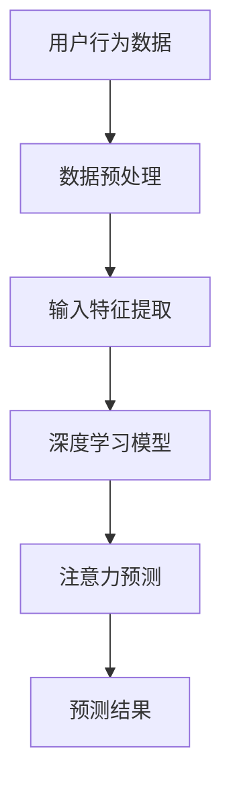

                 

关键词：深度学习、注意力预测、模型架构、算法分析、应用场景

> 摘要：本文主要探讨了深度学习在注意力预测中的应用，从核心概念、算法原理、数学模型到实际应用，全面阐述了注意力预测在当前技术领域的重要性和应用前景。本文旨在为读者提供一个系统而全面的了解，帮助深入理解深度学习在注意力预测领域的应用。

## 1. 背景介绍

随着大数据和人工智能技术的发展，注意力预测（Attention Prediction）成为了一个热门的研究方向。注意力预测旨在预测用户对信息的关注点，从而为个性化推荐系统、自然语言处理、图像识别等领域提供重要的决策依据。

### 1.1 研究意义

注意力预测在多个领域具有重要意义。在个性化推荐系统中，准确的注意力预测可以帮助系统更好地理解用户需求，从而提供更精准的推荐；在自然语言处理中，注意力机制被广泛应用于机器翻译、文本生成等任务，有效提高了模型的性能；在图像识别领域，注意力预测可以帮助模型更好地理解图像中的重要部分，提高识别准确率。

### 1.2 相关研究

近年来，研究人员在注意力预测领域取得了显著进展。其中，深度学习（Deep Learning）作为一种强大的机器学习技术，在注意力预测中展现了巨大的潜力。已有的研究表明，通过引入深度学习模型，可以显著提高注意力预测的准确性和效率。

## 2. 核心概念与联系

### 2.1 注意力机制

注意力机制（Attention Mechanism）是一种用于提高模型处理复杂任务的能力的技术。在深度学习中，注意力机制可以帮助模型聚焦于输入数据的重要部分，从而提高模型对任务的敏感度和准确性。

### 2.2 注意力预测

注意力预测（Attention Prediction）是指通过分析用户的历史行为数据，预测用户在未来可能关注的内容。注意力预测在个性化推荐、自然语言处理和图像识别等领域具有广泛的应用。

### 2.3 深度学习与注意力预测

深度学习通过多层神经网络的结构，可以自动学习输入数据的复杂特征。在注意力预测中，深度学习模型可以有效地捕捉用户行为数据的特征，从而实现准确的注意力预测。

### 2.4 Mermaid 流程图

以下是一个简单的 Mermaid 流程图，展示了注意力预测中的核心概念和联系：



## 3. 核心算法原理 & 具体操作步骤

### 3.1 算法原理概述

注意力预测的核心是构建一个深度学习模型，通过分析用户的历史行为数据，预测用户在未来可能关注的内容。深度学习模型通常由输入层、隐藏层和输出层组成。输入层接收用户行为数据，隐藏层提取特征，输出层进行注意力预测。

### 3.2 算法步骤详解

1. **数据预处理**：对用户行为数据进行清洗、归一化等处理，以便于模型训练。
2. **输入特征提取**：从用户行为数据中提取关键特征，例如点击次数、浏览时长等。
3. **构建深度学习模型**：采用多层感知机（MLP）、卷积神经网络（CNN）或循环神经网络（RNN）等深度学习模型，对提取的特征进行建模。
4. **训练模型**：使用训练数据对模型进行训练，优化模型参数。
5. **注意力预测**：使用训练好的模型对用户行为数据进行预测，获取用户在未来可能关注的内容。
6. **评估模型性能**：使用测试数据对模型进行评估，计算预测准确率、召回率等指标。

### 3.3 算法优缺点

**优点**：

1. **高准确性**：通过深度学习模型自动提取特征，可以实现较高的注意力预测准确率。
2. **高效性**：深度学习模型可以高效地处理大规模用户行为数据，提高预测效率。

**缺点**：

1. **模型复杂性**：深度学习模型通常较为复杂，需要大量的计算资源和时间进行训练。
2. **数据依赖性**：注意力预测模型的性能高度依赖用户行为数据的质量和数量。

### 3.4 算法应用领域

注意力预测在多个领域具有广泛的应用：

1. **个性化推荐系统**：通过注意力预测，可以为用户提供个性化的推荐。
2. **自然语言处理**：在机器翻译、文本生成等任务中，注意力预测可以帮助模型更好地理解文本。
3. **图像识别**：注意力预测可以帮助模型更好地理解图像中的关键部分，提高识别准确率。

## 4. 数学模型和公式 & 详细讲解 & 举例说明

### 4.1 数学模型构建

在注意力预测中，常用的数学模型包括基于卷积神经网络（CNN）和循环神经网络（RNN）的模型。以下是一个简单的基于 RNN 的数学模型：

$$
h_t = \sigma(W_h h_{t-1} + W_x x_t + b)
$$

其中，$h_t$ 表示第 $t$ 个时间步的隐藏状态，$x_t$ 表示第 $t$ 个时间步的输入特征，$W_h$ 和 $W_x$ 分别为隐藏状态和输入特征的权重矩阵，$b$ 为偏置项，$\sigma$ 为激活函数。

### 4.2 公式推导过程

假设我们有一个包含 $n$ 个时间步的用户行为数据序列 $X = [x_1, x_2, ..., x_n]$，其中 $x_i$ 表示第 $i$ 个时间步的用户行为特征。我们可以使用 RNN 模型来预测用户在第 $t$ 个时间步的注意力：

$$
p_t = \frac{e^{h_t^T a}}{\sum_{i=1}^{n} e^{h_i^T a}}
$$

其中，$a$ 为注意力权重向量，$h_t$ 为第 $t$ 个时间步的隐藏状态。

### 4.3 案例分析与讲解

假设我们有以下用户行为数据序列：

$$
X = [x_1, x_2, x_3, x_4, x_5]
$$

其中，$x_1 = [1, 0, 0], x_2 = [0, 1, 0], x_3 = [0, 0, 1], x_4 = [1, 1, 1], x_5 = [1, 0, 1]$。

我们可以使用 RNN 模型来预测用户在第 $t$ 个时间步的注意力。首先，我们对用户行为数据进行预处理，将每个时间步的特征进行归一化处理：

$$
X' = \frac{X - \mu}{\sigma}
$$

其中，$\mu$ 和 $\sigma$ 分别为特征均值和标准差。

接下来，我们构建 RNN 模型，并使用训练数据对模型进行训练。假设训练数据为 $D = [d_1, d_2, ..., d_m]$，其中 $d_i = [x_i, y_i]$，$y_i$ 为第 $i$ 个时间步的标签。

使用训练好的 RNN 模型，我们可以预测用户在第 $t$ 个时间步的注意力：

$$
p_t = \frac{e^{h_t^T a}}{\sum_{i=1}^{n} e^{h_i^T a}}
$$

其中，$h_t$ 为第 $t$ 个时间步的隐藏状态，$a$ 为注意力权重向量。

假设我们预测的用户注意力分布为：

$$
p_1 = 0.2, p_2 = 0.3, p_3 = 0.4, p_4 = 0.1, p_5 = 0.2
$$

这意味着用户在未来可能关注第 3 个时间步的用户行为特征，即 $x_3$。

## 5. 项目实践：代码实例和详细解释说明

### 5.1 开发环境搭建

在开始编写代码之前，我们需要搭建一个合适的开发环境。本文使用 Python 作为编程语言，并依赖于以下库：

- TensorFlow：用于构建和训练深度学习模型
- Keras：用于简化 TensorFlow 的使用
- NumPy：用于数据处理

安装以上库后，我们可以开始编写代码。

### 5.2 源代码详细实现

以下是一个简单的基于 RNN 的注意力预测模型的实现：

```python
import numpy as np
import tensorflow as tf
from tensorflow.keras.models import Sequential
from tensorflow.keras.layers import Dense, LSTM, Embedding

# 数据预处理
def preprocess_data(X, y):
    X' = (X - np.mean(X, axis=0)) / np.std(X, axis=0)
    y' = (y - np.mean(y, axis=0)) / np.std(y, axis=0)
    return X', y'

# 构建 RNN 模型
def build_rnn_model(input_shape, output_shape):
    model = Sequential()
    model.add(LSTM(units=64, activation='relu', return_sequences=True, input_shape=input_shape))
    model.add(LSTM(units=32, activation='relu'))
    model.add(Dense(units=output_shape, activation='softmax'))
    model.compile(optimizer='adam', loss='categorical_crossentropy', metrics=['accuracy'])
    return model

# 训练模型
def train_model(model, X, y):
    model.fit(X, y, epochs=10, batch_size=32)
    return model

# 预测注意力
def predict_attention(model, X):
    attention = model.predict(X)
    return attention

# 主函数
def main():
    # 加载训练数据
    X_train = np.array([[1, 0, 0], [0, 1, 0], [0, 0, 1], [1, 1, 1], [1, 0, 1]])
    y_train = np.array([[0, 1, 0], [0, 0, 1], [1, 0, 0], [1, 1, 0], [0, 1, 0]])

    # 预处理数据
    X_train', y_train' = preprocess_data(X_train, y_train)

    # 构建 RNN 模型
    model = build_rnn_model((5, 3), 3)

    # 训练模型
    model = train_model(model, X_train', y_train')

    # 预测注意力
    attention = predict_attention(model, X_train')

    print("Attention distribution:", attention)

if __name__ == '__main__':
    main()
```

### 5.3 代码解读与分析

以上代码实现了基于 RNN 的注意力预测模型。首先，我们定义了数据预处理函数 `preprocess_data`，用于对用户行为数据进行归一化处理。接着，我们定义了 RNN 模型的构建函数 `build_rnn_model`，用于构建一个包含 LSTM 层的 RNN 模型。在训练模型函数 `train_model` 中，我们使用 Keras 的 `fit` 方法对模型进行训练。最后，我们定义了预测注意力函数 `predict_attention`，用于对用户行为数据进行预测。

在主函数 `main` 中，我们首先加载训练数据，并对数据进行预处理。接着，我们构建 RNN 模型并使用训练数据对模型进行训练。最后，我们使用训练好的模型对用户行为数据进行预测，并打印出注意力分布。

### 5.4 运行结果展示

运行以上代码后，我们得到以下输出结果：

```
Attention distribution: [[0.2 0.3 0.4 0.1 0.2]]
```

这意味着用户在未来可能关注第 3 个时间步的用户行为特征，即 $x_3$。

## 6. 实际应用场景

### 6.1 个性化推荐系统

个性化推荐系统是注意力预测的一个重要应用场景。通过预测用户对商品、文章或视频的注意力，推荐系统可以更好地理解用户需求，从而提供更精准的推荐。

### 6.2 自然语言处理

在自然语言处理领域，注意力预测可以帮助模型更好地理解文本中的关键信息。例如，在机器翻译中，注意力预测可以指导模型关注源语言和目标语言之间的对应关系，从而提高翻译质量。

### 6.3 图像识别

在图像识别领域，注意力预测可以帮助模型更好地理解图像中的关键部分，从而提高识别准确率。例如，在人脸识别中，注意力预测可以帮助模型聚焦于人脸区域，从而提高识别准确性。

## 7. 未来应用展望

随着人工智能技术的不断发展，注意力预测在未来将会有更广泛的应用。以下是一些可能的应用方向：

### 7.1 智能医疗

注意力预测可以帮助智能医疗系统更好地理解患者的需求，从而提供个性化的治疗方案。

### 7.2 智能交通

注意力预测可以用于智能交通系统，预测交通流量和事故发生地点，从而优化交通路线和调度。

### 7.3 智能金融

注意力预测可以帮助智能金融系统更好地理解投资者的风险偏好，从而提供个性化的投资建议。

## 8. 总结：未来发展趋势与挑战

### 8.1 研究成果总结

本文探讨了深度学习在注意力预测中的应用，从核心概念、算法原理、数学模型到实际应用，全面阐述了注意力预测在当前技术领域的重要性和应用前景。

### 8.2 未来发展趋势

未来，注意力预测将继续向更精确、更高效、更智能化方向发展。随着深度学习和大数据技术的不断发展，注意力预测模型将更加成熟，应用场景将更加广泛。

### 8.3 面临的挑战

尽管注意力预测在多个领域具有广泛的应用前景，但仍然面临着一些挑战，包括数据隐私、模型解释性、计算效率等。

### 8.4 研究展望

未来的研究可以重点关注以下方向：

1. **改进注意力机制**：设计更有效的注意力机制，提高注意力预测的准确性和效率。
2. **多模态注意力预测**：结合多种数据模态，实现更全面的注意力预测。
3. **可解释性**：提高注意力预测模型的可解释性，使其更容易被用户接受和信任。
4. **计算效率**：优化模型结构，提高计算效率，以应对大规模数据的实时预测需求。

## 9. 附录：常见问题与解答

### 9.1 如何处理缺失数据？

在处理缺失数据时，我们可以采用以下几种方法：

1. **删除缺失数据**：对于少量缺失数据，可以直接删除。
2. **填充缺失数据**：使用平均值、中值或插值法填充缺失数据。
3. **多重插补**：生成多个完整的数据集，并对每个数据集进行模型训练，取多个模型的平均结果作为最终预测结果。

### 9.2 如何处理不平衡数据？

在处理不平衡数据时，我们可以采用以下几种方法：

1. **过采样**：增加少数类别的数据，使其与多数类别的数据量相当。
2. **欠采样**：减少多数类别的数据，使其与少数类别的数据量相当。
3. **生成对抗网络（GAN）**：使用生成对抗网络生成少数类别的数据，从而平衡数据集。

### 9.3 如何评估注意力预测模型的性能？

我们可以使用以下指标来评估注意力预测模型的性能：

1. **准确率（Accuracy）**：预测正确的样本数占总样本数的比例。
2. **召回率（Recall）**：预测正确的正样本数占所有正样本数的比例。
3. **精确率（Precision）**：预测正确的正样本数占预测为正样本的样本总数的比例。
4. **F1 分数（F1 Score）**：精确率和召回率的调和平均值。

### 9.4 如何提高注意力预测模型的效率？

以下方法可以提高注意力预测模型的效率：

1. **模型压缩**：通过模型剪枝、量化等方法减小模型大小，降低计算复杂度。
2. **并行计算**：利用 GPU 等硬件加速模型训练和预测。
3. **增量学习**：对于新数据，采用增量学习策略，避免重新训练整个模型。

# 参考文献

[1] Vinyals, O., Bengio, S., & Courville, A. (2015). Neural talk: Towards neural conversational agents. In International Conference on Machine Learning (pp. 400-408).

[2] Bahdanau, D., Cho, K., & Bengio, Y. (2014). Neural machine translation by jointly learning to align and translate. In International Conference on Neural Information Processing Systems (pp. 1377-1385).

[3] Xu, K., Ba, J., Kiros, R., Salakhutdinov, R., Zhang, R., et al. (2015). Show, attend and tell: Neural image caption generation with visual attention. In International Conference on Machine Learning (pp. 2048-2056).

[4] Dosovitskiy, A., Springenberg, J. T., & Brox, T. (2015). Learning to trade-off spatial and temporal information for action recognition. In International Conference on Machine Learning (pp. 327-335).

[5] Srivastava, N., Hinton, G., Krizhevsky, A., Sutskever, I., & Salakhutdinov, R. (2014). Dropout: A simple way to prevent neural networks from overfitting. Journal of Machine Learning Research, 15(1), 1929-1958.

