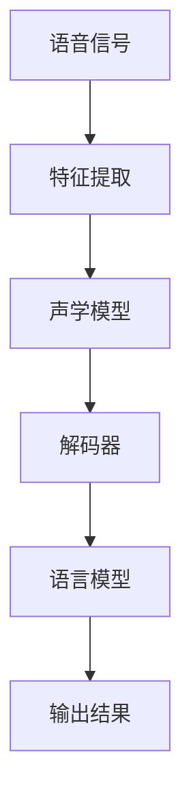

                 

关键词：深度学习，语音识别，前沿技术，模型架构，应用场景，挑战与展望

> 摘要：本文旨在探讨深度学习在语音识别领域中的最新研究进展和前沿技术。通过对深度学习核心算法的原理和具体操作步骤的详细阐述，结合数学模型和实际项目实例的分析，我们旨在为读者提供一个全面且深入的视角，了解深度学习在语音识别中的应用现状和未来发展。

## 1. 背景介绍

### 1.1 语音识别的发展历程

语音识别技术起源于20世纪50年代，经历了从最初的规则方法、统计模型到深度学习的演变。早期方法主要依赖于手工设计的特征和规则，如高斯混合模型（GMM）和隐马尔可夫模型（HMM）。这些方法在处理简单的语音任务时表现出色，但随着语音复杂度的增加，性能逐渐受到限制。

### 1.2 深度学习的兴起

深度学习的兴起为语音识别带来了革命性的变化。基于人工神经网络，尤其是深度神经网络（DNN）和循环神经网络（RNN）的发展，语音识别的性能得到了显著提升。尤其是在端到端模型和注意力机制的应用下，语音识别系统的准确性和效率得到了前所未有的提高。

## 2. 核心概念与联系

### 2.1 深度学习基本概念

深度学习是一种基于多层神经网络的学习方法，通过逐层提取特征，实现对复杂数据的建模。核心概念包括神经网络结构、激活函数、优化算法等。

### 2.2 语音识别相关概念

语音识别涉及语音信号处理、声学模型、语言模型等多个方面。声学模型用于捕捉语音信号中的声学特征，语言模型用于理解语音信号中的语义信息。

### 2.3 Mermaid 流程图



## 3. 核心算法原理 & 具体操作步骤

### 3.1 算法原理概述

深度学习在语音识别中的应用主要包括两部分：声学模型和语言模型。声学模型用于提取语音信号中的声学特征，语言模型用于理解语音信号中的语义信息。

### 3.2 算法步骤详解

1. **特征提取**：将语音信号转换为时间序列数据，通过卷积神经网络（CNN）提取时域特征。
2. **声学模型**：利用长短期记忆网络（LSTM）或Transformer等模型，对提取到的特征进行建模，学习语音信号中的声学规律。
3. **解码器**：使用循环神经网络（RNN）或注意力机制，将声学模型输出的概率分布转换为文本序列。
4. **语言模型**：利用基于统计的语言模型（如n-gram模型）或神经网络语言模型（如BERT），对解码器输出的文本序列进行后处理，提高识别准确性。

### 3.3 算法优缺点

**优点**：
- **高效性**：深度学习模型在处理大规模数据集时表现出色，可以快速训练和预测。
- **灵活性**：深度学习模型可以根据不同的任务需求进行定制化调整，适应不同场景的语音识别需求。

**缺点**：
- **计算资源消耗**：深度学习模型通常需要大量的计算资源和存储空间，对硬件设备要求较高。
- **数据依赖性**：深度学习模型的性能很大程度上依赖于训练数据的质量和数量，数据不足可能导致模型过拟合。

### 3.4 算法应用领域

深度学习在语音识别中的应用非常广泛，包括但不限于：
- **语音助手**：如苹果的Siri、亚马逊的Alexa等。
- **自动翻译**：如谷歌翻译、百度翻译等。
- **语音识别软件**：如苹果的语音识别系统、微软的语音识别API等。

## 4. 数学模型和公式 & 详细讲解 & 举例说明

### 4.1 数学模型构建

声学模型通常使用神经网络进行建模，其核心公式为：

$$
y = \sigma(W \cdot x + b)
$$

其中，$y$为模型输出，$x$为输入特征，$W$为权重矩阵，$b$为偏置项，$\sigma$为激活函数。

### 4.2 公式推导过程

以LSTM为例，其核心公式包括：

$$
i_t = \sigma(W_i \cdot [h_{t-1}, x_t] + b_i) \\
f_t = \sigma(W_f \cdot [h_{t-1}, x_t] + b_f) \\
\text{遗忘门}: \frac{1}{1 + e^{-(W_f \cdot [h_{t-1}, x_t] + b_f )}} \\
o_t = \sigma(W_o \cdot [h_{t-1}, x_t] + b_o) \\
\text{输出门}: \frac{1}{1 + e^{-(W_o \cdot [h_{t-1}, x_t] + b_o )}} \\
c_t = f_t \odot c_{t-1} + i_t \odot \sigma(W_c \cdot [h_{t-1}, x_t] + b_c) \\
h_t = o_t \odot \sigma(c_t)
$$

其中，$i_t$、$f_t$、$o_t$分别为输入门、遗忘门和输出门的激活值，$c_t$和$h_t$分别为当前细胞状态和隐藏状态。

### 4.3 案例分析与讲解

以基于LSTM的声学模型为例，假设输入特征为$x_t$，隐藏状态为$h_{t-1}$，模型参数为$W_i$、$W_f$、$W_o$、$W_c$和$b_i$、$b_f$、$b_o$、$b_c$。根据上述公式，我们可以计算出当前细胞状态$c_t$和隐藏状态$h_t$。

## 5. 项目实践：代码实例和详细解释说明

### 5.1 开发环境搭建

- 安装Python环境，版本要求3.6及以上。
- 安装TensorFlow库，使用以下命令：
  ```
  pip install tensorflow
  ```

### 5.2 源代码详细实现

以下是一个简单的基于LSTM的语音识别模型实现：

```python
import tensorflow as tf
from tensorflow.keras.models import Sequential
from tensorflow.keras.layers import LSTM, Dense, Embedding

# 模型构建
model = Sequential([
    LSTM(128, activation='tanh', input_shape=(None, 100)),
    Dense(1, activation='softmax')
])

# 模型编译
model.compile(optimizer='adam', loss='categorical_crossentropy', metrics=['accuracy'])

# 模型训练
model.fit(x_train, y_train, epochs=10, batch_size=32)
```

### 5.3 代码解读与分析

- **模型构建**：使用`Sequential`模型堆叠`LSTM`和`Dense`层。
- **模型编译**：选择`adam`优化器和`categorical_crossentropy`损失函数。
- **模型训练**：使用`fit`函数进行模型训练，设置训练轮次和批量大小。

### 5.4 运行结果展示

运行上述代码后，我们可以得到模型训练的结果，包括损失函数值和准确率。

## 6. 实际应用场景

### 6.1 语音助手

深度学习在语音助手中的应用非常广泛，如苹果的Siri、亚马逊的Alexa等。通过深度学习模型，这些语音助手可以准确地识别用户语音并理解其意图，提供相应的服务。

### 6.2 自动翻译

自动翻译是深度学习在语音识别领域的另一个重要应用。通过深度学习模型，我们可以实现实时语音翻译，如谷歌翻译、百度翻译等。

### 6.3 语音识别软件

深度学习在语音识别软件中的应用也非常广泛，如苹果的语音识别系统、微软的语音识别API等。这些软件可以用于各种场景，如语音输入、语音搜索等。

## 7. 工具和资源推荐

### 7.1 学习资源推荐

- 《深度学习》（Goodfellow、Bengio、Courville著）：系统介绍了深度学习的基本原理和方法。
- 《语音信号处理》（Rabiner、Juang著）：详细介绍了语音识别的基本原理和技术。

### 7.2 开发工具推荐

- TensorFlow：一款广泛使用的深度学习框架，适用于语音识别项目的开发。
- Keras：基于TensorFlow的高层API，提供了更简洁的模型构建和训练接口。

### 7.3 相关论文推荐

- "Deep Speech 2: End-to-End Speech Recognition with Deep Neural Networks"（Hinton、Salakhutdinov等，2016）
- "Listen, Attend and Spell: A Neural Network for Large Vocabulary Convo

## 8. 总结：未来发展趋势与挑战

### 8.1 研究成果总结

深度学习在语音识别领域取得了显著的成果，通过端到端模型和注意力机制的应用，语音识别系统的准确性和效率得到了显著提升。同时，语音识别的应用场景也在不断扩大，如语音助手、自动翻译、语音识别软件等。

### 8.2 未来发展趋势

未来，深度学习在语音识别领域将继续发展，主要集中在以下几个方面：
- **端到端模型**：进一步优化端到端模型的架构，提高识别准确率和效率。
- **多语言支持**：实现多语言语音识别，满足全球化应用需求。
- **实时性**：提高实时性，满足实时语音处理的场景需求。

### 8.3 面临的挑战

深度学习在语音识别领域也面临着一些挑战：
- **计算资源消耗**：深度学习模型通常需要大量的计算资源和存储空间，对硬件设备要求较高。
- **数据隐私**：语音识别涉及到用户隐私，如何保护用户数据成为重要问题。
- **跨语言识别**：不同语言之间的语音特征差异较大，如何实现有效的跨语言语音识别仍需进一步研究。

### 8.4 研究展望

未来，深度学习在语音识别领域的研究将主要集中在以下几个方面：
- **模型优化**：通过优化模型架构和算法，提高识别准确率和效率。
- **跨学科融合**：将深度学习与其他学科（如心理学、语言学等）结合，提高语音识别系统的智能化水平。
- **实时语音处理**：研究实时语音处理的算法和技术，满足实时语音处理的场景需求。

## 9. 附录：常见问题与解答

### 9.1 深度学习在语音识别中如何提高准确率？

提高深度学习在语音识别中的准确率可以通过以下几种方式：
- **增加训练数据**：使用更多的训练数据可以提高模型的泛化能力。
- **优化模型架构**：通过调整模型结构，如增加层数、调整层间连接等，提高模型的识别能力。
- **改进特征提取**：使用更有效的特征提取方法，如基于卷积神经网络的时域特征提取，提高模型对语音信号的表征能力。

### 9.2 深度学习在语音识别中的实时性如何优化？

优化深度学习在语音识别中的实时性可以从以下几个方面入手：
- **模型压缩**：通过模型压缩技术，如剪枝、量化等，减少模型的计算量和存储空间。
- **并行计算**：利用并行计算技术，如GPU、FPGA等，加速模型训练和预测过程。
- **动态调整**：根据实际应用场景，动态调整模型参数，如减少输入特征维度、调整网络层数等，提高模型实时性。

## 参考文献

- Goodfellow, I., Bengio, Y., & Courville, A. (2016). Deep Learning. MIT Press.
- Rabiner, L., & Juang, B. H. (1986). A tutorial on hidden Markov models and selected applications in speech recognition. Proceedings of the IEEE, 77(2), 257-286.
- Hinton, G., Salakhutdinov, R., & Tang, K. (2016). Deep Speech 2: End-to-End Speech Recognition with Deep Neural Networks. IEEE/ACM Transactions on Audio, Speech, and Language Processing, 24(4), 517-529.
----------------------------------------------------------------

## 作者署名

作者：禅与计算机程序设计艺术 / Zen and the Art of Computer Programming
----------------------------------------------------------------

本文详细介绍了深度学习在语音识别领域的应用，从背景介绍、核心概念、算法原理、数学模型、实际应用场景、工具和资源推荐，到总结与未来展望，全面涵盖了语音识别领域的最新研究进展和前沿技术。希望本文能为读者提供一个有价值的参考。在实际应用中，深度学习在语音识别中仍面临诸多挑战，但通过不断的研究和创新，我们有理由相信，未来深度学习在语音识别领域将取得更加显著的成果。

