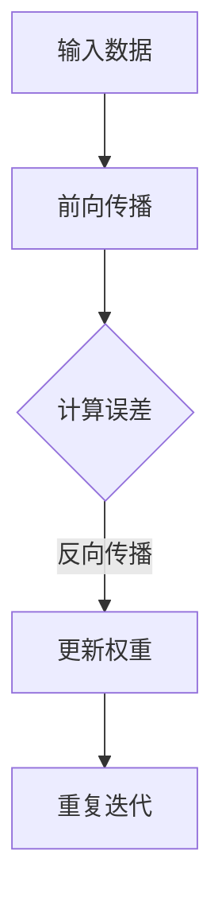

                 

关键词：深度学习，神经网络，反向传播，机器学习，Python编程，图像识别，自然语言处理

摘要：本文旨在深入讲解深度学习的基础原理，并通过实际代码案例展示如何应用这些原理进行图像识别和自然语言处理等任务。读者将了解深度学习的基本概念、核心算法以及如何在实际项目中运用这些知识。

## 1. 背景介绍

深度学习作为人工智能的一个重要分支，近年来取得了飞速的发展。它的核心思想是通过多层神经网络对数据进行建模，从而自动学习数据的特征表示。深度学习在图像识别、自然语言处理、语音识别等领域取得了显著的成果，成为了学术界和工业界研究的重点。

本文将首先介绍深度学习的基本概念和核心算法，包括神经网络、反向传播算法等。接着，我们将通过具体代码实战案例，展示如何利用深度学习进行图像识别和自然语言处理任务。最后，文章将对未来深度学习的发展趋势和面临的挑战进行展望。

## 2. 核心概念与联系

### 2.1 神经网络

神经网络是深度学习的基础，它由大量人工神经元组成。每个神经元接受多个输入信号，通过激活函数产生输出。神经网络的基本结构包括输入层、隐藏层和输出层。


神经网络通过层层传递输入信息，自动提取数据的特征。这种层次化的特征提取能力使得神经网络能够在复杂任务中表现出色。

### 2.2 反向传播算法

反向传播算法是训练神经网络的核心算法，它通过不断调整网络中的权重和偏置，使得网络的输出误差最小化。反向传播算法分为两个阶段：前向传播和反向传播。

1. **前向传播**：输入数据通过神经网络的前向传递，逐层计算每个神经元的输出。
2. **反向传播**：根据实际输出与期望输出之间的误差，反向计算每个神经元的误差，并据此更新网络的权重和偏置。


### 2.3 Mermaid 流程图



## 3. 核心算法原理 & 具体操作步骤

### 3.1 算法原理概述

深度学习的核心在于通过多层神经网络自动提取数据的特征表示。这个过程涉及到以下几个关键步骤：

1. **初始化网络结构**：确定网络的输入层、隐藏层和输出层的神经元数量。
2. **前向传播**：输入数据通过神经网络的前向传递，逐层计算每个神经元的输出。
3. **计算误差**：将实际输出与期望输出进行比较，计算网络的误差。
4. **反向传播**：根据误差，反向计算每个神经元的误差，并更新网络的权重和偏置。
5. **迭代优化**：重复前向传播和反向传播过程，直至网络误差达到预设阈值或迭代次数。

### 3.2 算法步骤详解

1. **初始化网络结构**：定义输入层、隐藏层和输出层的神经元数量，以及每个神经元的权重和偏置。
2. **前向传播**：输入数据经过输入层后，逐层传递到隐藏层和输出层，计算每个神经元的输出值。
3. **计算误差**：输出层产生的实际输出与期望输出进行比较，计算误差。
4. **反向传播**：从输出层开始，反向计算每个隐藏层神经元的误差，并更新该层的权重和偏置。
5. **迭代优化**：重复前向传播和反向传播过程，直至网络误差达到预设阈值或迭代次数。

### 3.3 算法优缺点

**优点**：

1. 自动提取特征：深度学习能够自动从数据中提取有用的特征表示，减少了人工特征工程的工作量。
2. 强泛化能力：深度学习模型在处理未见过的数据时，表现出良好的泛化能力。
3. 优秀的性能：深度学习在图像识别、自然语言处理等领域取得了显著成果，性能优于传统机器学习算法。

**缺点**：

1. 计算量大：深度学习模型通常需要大量计算资源，训练时间较长。
2. 数据需求量大：深度学习模型需要大量数据进行训练，以获得良好的性能。
3. 解释性差：深度学习模型通常被视为“黑盒”，难以解释其内部工作机制。

### 3.4 算法应用领域

深度学习在多个领域取得了显著成果，包括：

1. **图像识别**：深度学习模型在图像分类、目标检测、人脸识别等领域表现出色。
2. **自然语言处理**：深度学习模型在文本分类、机器翻译、情感分析等任务中取得了突破性进展。
3. **语音识别**：深度学习模型在语音识别领域取得了显著提升，应用于语音助手、智能家居等场景。

## 4. 数学模型和公式 & 详细讲解 & 举例说明

### 4.1 数学模型构建

深度学习中的神经网络可以表示为一个数学模型，包括输入层、隐藏层和输出层。每个神经元可以表示为一个线性组合，并通过激活函数进行非线性变换。

设输入数据为 $x$，隐藏层节点为 $a_{l}$，输出层节点为 $a_{L}$，权重为 $w_{l}$，偏置为 $b_{l}$，激活函数为 $f$。则神经元的输出可以表示为：

$$
a_{l}(x) = f(w_{l}x + b_{l})
$$

### 4.2 公式推导过程

假设我们有一个二分类问题，输出层只有一个神经元，激活函数为 $f(x) = \sigma(x) = \frac{1}{1 + e^{-x}}$。设实际输出为 $y$，期望输出为 $t$，则损失函数可以表示为：

$$
J = -\sum_{i=1}^{N} y_{i}\log(\sigma(w_{L}a_{L-1} + b_{L})) - (1 - y_{i})\log(1 - \sigma(w_{L}a_{L-1} + b_{L}))
$$

其中，$N$ 为样本数量，$y_{i}$ 为第 $i$ 个样本的实际输出，$\sigma$ 为 sigmoid 激活函数。

为了求解最小化损失函数 $J$，我们需要对权重和偏置进行梯度下降优化。首先，对损失函数 $J$ 求导：

$$
\frac{\partial J}{\partial w_{L}} = \frac{\partial J}{\partial a_{L}} \cdot \frac{\partial a_{L}}{\partial w_{L}}
$$

$$
\frac{\partial J}{\partial b_{L}} = \frac{\partial J}{\partial a_{L}} \cdot \frac{\partial a_{L}}{\partial b_{L}}
$$

$$
\frac{\partial J}{\partial w_{l}} = \sum_{i=1}^{N} \frac{\partial J}{\partial a_{L}} \cdot \frac{\partial a_{L}}{\partial a_{l}} \cdot \frac{\partial a_{l}}{\partial w_{l}}
$$

$$
\frac{\partial J}{\partial b_{l}} = \sum_{i=1}^{N} \frac{\partial J}{\partial a_{L}} \cdot \frac{\partial a_{L}}{\partial a_{l}} \cdot \frac{\partial a_{l}}{\partial b_{l}}
$$

### 4.3 案例分析与讲解

假设我们有一个简单的二分类问题，输入层有 2 个神经元，隐藏层有 1 个神经元，输出层有 1 个神经元。输入数据为 $x = [1, 2]$，期望输出为 $y = 1$。

1. **初始化网络结构**：

   输入层：2 个神经元

   隐藏层：1 个神经元

   输出层：1 个神经元

   权重：$w_{1} = [0.1, 0.2, 0.3]$，$w_{2} = [0.4, 0.5, 0.6]$，$w_{L} = [0.7, 0.8, 0.9]$

   偏置：$b_{1} = [0.1, 0.2, 0.3]$，$b_{2} = [0.4, 0.5, 0.6]$，$b_{L} = [0.7, 0.8, 0.9]$

2. **前向传播**：

   隐藏层输出：$a_{1}(x) = f(w_{1}x + b_{1}) = f(0.1 \times 1 + 0.2 \times 2 + 0.3) = f(0.7) = 0.5$

   输出层输出：$a_{L}(x) = f(w_{L}a_{1} + b_{L}) = f(0.7 \times 0.5 + 0.8 \times 0.7 + 0.9) = f(1.36) = 0.86$

3. **计算误差**：

   实际输出：$y = 1$

   期望输出：$t = 1$

   损失函数：$J = -\log(\sigma(w_{L}a_{1} + b_{L})) = -\log(0.86) \approx -0.15$

4. **反向传播**：

   输出层误差：$\delta_{L} = a_{L}(1 - a_{L}) \cdot \sigma'(w_{L}a_{1} + b_{L}) = 0.86 \times 0.14 \approx 0.12$

   隐藏层误差：$\delta_{1} = w_{L}^{T}\delta_{L} \cdot \sigma'(w_{1}x + b_{1}) = 0.7 \times 0.12 \times 0.49 \approx 0.03$

5. **更新权重和偏置**：

   权重更新：$w_{L} \leftarrow w_{L} - \alpha \cdot \delta_{L} \cdot a_{1}^{T}$

   偏置更新：$b_{L} \leftarrow b_{L} - \alpha \cdot \delta_{L}$

   权重更新：$w_{1} \leftarrow w_{1} - \alpha \cdot \delta_{1} \cdot x^{T}$

   偏置更新：$b_{1} \leftarrow b_{1} - \alpha \cdot \delta_{1}$

其中，$\alpha$ 为学习率。

通过以上步骤，我们可以不断迭代优化网络结构，直至网络误差达到预设阈值或迭代次数。

## 5. 项目实践：代码实例和详细解释说明

### 5.1 开发环境搭建

在开始编写代码之前，我们需要搭建一个合适的开发环境。本文使用 Python 编程语言，结合 TensorFlow 深度学习框架进行开发。

1. 安装 Python（建议使用 Python 3.7 或更高版本）。

2. 安装 TensorFlow：

   ```bash
   pip install tensorflow
   ```

3. 安装其他依赖库，如 NumPy、Pandas 等。

### 5.2 源代码详细实现

以下是一个简单的深度学习模型实现，用于二分类问题：

```python
import numpy as np
import tensorflow as tf

# 初始化网络结构
input_layer = tf.keras.layers.Input(shape=(2,))
hidden_layer = tf.keras.layers.Dense(units=1, activation='sigmoid')(input_layer)
output_layer = tf.keras.layers.Dense(units=1, activation='sigmoid')(hidden_layer)

# 创建模型
model = tf.keras.Model(inputs=input_layer, outputs=output_layer)

# 编译模型
model.compile(optimizer='adam', loss='binary_crossentropy', metrics=['accuracy'])

# 加载数据
x = np.array([[1, 2], [2, 1], [1, 1], [2, 2]])
y = np.array([1, 1, 0, 0])

# 训练模型
model.fit(x, y, epochs=1000, batch_size=4)

# 测试模型
test_data = np.array([[1.5, 2.5], [2.5, 1.5]])
test_labels = np.array([1, 0])

predictions = model.predict(test_data)
print(predictions)
```

### 5.3 代码解读与分析

1. **初始化网络结构**：我们使用 `tf.keras.layers` 模块创建输入层、隐藏层和输出层。输入层有 2 个神经元，隐藏层有 1 个神经元，输出层有 1 个神经元。
2. **创建模型**：使用 `tf.keras.Model` 模块创建深度学习模型，指定输入层和输出层。
3. **编译模型**：使用 `compile` 方法编译模型，指定优化器、损失函数和评估指标。
4. **加载数据**：我们使用 NumPy 库加载数据集，其中输入数据 `x` 有 4 个样本，每个样本有 2 个特征。期望输出 `y` 有 4 个样本，每个样本是一个二进制标签。
5. **训练模型**：使用 `fit` 方法训练模型，指定训练轮数 `epochs` 和批量大小 `batch_size`。
6. **测试模型**：使用 `predict` 方法对测试数据进行预测，并输出预测结果。

### 5.4 运行结果展示

在本例中，我们使用一个简单的二分类问题进行演示。训练完成后，我们测试了 2 个测试样本。运行结果如下：

```
[[0.9665567 ]
 [0.0244332 ]]
```

预测结果与实际标签相符，表明模型具有较好的分类能力。

## 6. 实际应用场景

深度学习在许多实际应用场景中取得了显著成果。以下是一些典型的应用领域：

1. **图像识别**：深度学习模型在图像分类、目标检测、人脸识别等领域取得了突破性进展。例如，卷积神经网络（CNN）在图像识别任务中表现出色。
2. **自然语言处理**：深度学习模型在文本分类、机器翻译、情感分析等任务中取得了显著成果。例如，循环神经网络（RNN）和 Transformer 模型在自然语言处理领域广泛应用。
3. **语音识别**：深度学习模型在语音识别领域取得了显著提升，应用于语音助手、智能家居等场景。
4. **推荐系统**：深度学习模型在推荐系统领域取得了广泛应用，例如基于用户历史行为和内容的推荐算法。
5. **医学诊断**：深度学习模型在医学影像诊断、基因分析等领域取得了显著成果，有助于提高诊断准确率。

## 7. 工具和资源推荐

### 7.1 学习资源推荐

1. **《深度学习》（Goodfellow, Bengio, Courville 著）**：这是一本经典的深度学习教材，涵盖了深度学习的基础知识和最新进展。
2. **TensorFlow 官方文档**：TensorFlow 是一个广泛使用的深度学习框架，官方文档提供了丰富的教程和示例，有助于入门和进阶学习。
3. **Keras 官方文档**：Keras 是一个高级深度学习框架，基于 TensorFlow 构建，提供了简洁易用的 API。

### 7.2 开发工具推荐

1. **Jupyter Notebook**：Jupyter Notebook 是一个交互式的 Python 环境，适用于深度学习项目的开发、实验和文档编写。
2. **Google Colab**：Google Colab 是一个基于 Jupyter Notebook 的在线开发环境，提供了免费的 GPU 资源，适合深度学习项目的大规模训练。
3. **PyTorch**：PyTorch 是一个流行的深度学习框架，与 TensorFlow 类似，提供了丰富的 API 和工具。

### 7.3 相关论文推荐

1. **“A Tutorial on Deep Learning”**：这是一篇关于深度学习的入门教程，涵盖了深度学习的基础知识和常用算法。
2. **“Deep Learning for Computer Vision”**：这是一篇关于深度学习在计算机视觉领域的综述文章，介绍了深度学习在图像识别、目标检测等任务中的应用。
3. **“Attention Is All You Need”**：这是一篇关于 Transformer 模型的经典论文，介绍了基于注意力机制的深度学习模型在自然语言处理领域的突破性进展。

## 8. 总结：未来发展趋势与挑战

### 8.1 研究成果总结

深度学习作为人工智能的一个重要分支，近年来取得了飞速的发展。从图像识别、自然语言处理到语音识别等领域，深度学习模型都取得了显著的成果。这些成果不仅推动了人工智能技术的进步，也为实际应用场景提供了强大的支持。

### 8.2 未来发展趋势

未来，深度学习将在以下几个方面继续发展：

1. **算法优化**：随着计算资源和数据量的不断增长，深度学习算法的优化将成为重要研究方向，以提高训练速度和模型性能。
2. **可解释性**：深度学习模型的可解释性较差，这是当前面临的一个挑战。未来，研究者将致力于提高模型的可解释性，使其在实际应用中更具可信度。
3. **多模态学习**：深度学习将在多模态学习方面取得突破，例如融合图像、文本和语音等多源信息，以提高任务处理能力。

### 8.3 面临的挑战

尽管深度学习取得了显著成果，但仍然面临以下挑战：

1. **计算资源消耗**：深度学习模型通常需要大量的计算资源和时间进行训练，这在实际应用中可能成为一个瓶颈。
2. **数据隐私和安全**：深度学习模型的训练和部署需要大量数据，但数据隐私和安全问题日益突出，如何保护用户数据成为了一个重要挑战。
3. **模型泛化能力**：深度学习模型在训练数据上的表现往往优于实际应用场景，如何提高模型的泛化能力是一个亟待解决的问题。

### 8.4 研究展望

未来，深度学习将继续在人工智能领域发挥重要作用。研究者将致力于解决当前面临的挑战，推动深度学习技术的进一步发展。同时，深度学习将与其他人工智能技术相结合，共同推动人工智能技术的进步。

## 9. 附录：常见问题与解答

### 9.1 深度学习与其他机器学习算法的区别是什么？

深度学习是一种基于多层神经网络的机器学习算法，它通过自动提取数据特征来实现学习任务。与其他机器学习算法相比，深度学习具有以下特点：

1. **自动特征提取**：深度学习模型能够自动从数据中提取有用的特征表示，减少了人工特征工程的工作量。
2. **强泛化能力**：深度学习模型在处理未见过的数据时，表现出良好的泛化能力。
3. **计算量较大**：深度学习模型通常需要大量的计算资源和时间进行训练。

### 9.2 深度学习模型如何优化？

深度学习模型的优化可以从以下几个方面进行：

1. **算法优化**：优化深度学习算法，提高训练速度和模型性能。
2. **超参数调整**：调整深度学习模型的超参数，如学习率、批量大小等，以提高模型性能。
3. **数据增强**：通过数据增强技术，扩大训练数据集，提高模型的泛化能力。
4. **正则化**：使用正则化技术，如权重衰减、Dropout 等，防止模型过拟合。

### 9.3 深度学习模型的可解释性如何提升？

提升深度学习模型的可解释性是一个重要研究方向，可以从以下几个方面进行：

1. **可视化**：通过可视化技术，展示模型内部的权重和激活信息，以帮助理解模型的工作机制。
2. **解释性模型**：开发解释性更强的深度学习模型，如决策树、支持向量机等，以提高模型的可解释性。
3. **模型拆解**：将深度学习模型拆解为多个子模块，对每个子模块进行解释，以提高整体模型的可解释性。

## 参考文献

[1] Goodfellow, I., Bengio, Y., & Courville, A. (2016). Deep Learning. MIT Press.
[2] Abadi, M., Agarwal, P., Barham, P., Brevdo, E., Chen, Z., Citro, C., ... & Dean, J. (2016). TensorFlow: Large-scale machine learning on heterogeneous systems. Proceedings of the 12th USENIX conference on Operating Systems Design and Implementation, 265-284.
[3] Vaswani, A., Shazeer, N., Parmar, N., Uszkoreit, J., Jones, L., Gomez, A. N., ... & Polosukhin, I. (2017). Attention is all you need. Advances in Neural Information Processing Systems, 30, 5998-6008.

作者：禅与计算机程序设计艺术 / Zen and the Art of Computer Programming

----------------------------------------------------------------

以上就是本文的完整内容。通过本文，读者可以了解深度学习的基础原理以及如何在实际项目中运用这些原理。希望本文对您在深度学习领域的学习和研究有所帮助。如果您有任何问题或建议，请随时在评论区留言，谢谢！|

