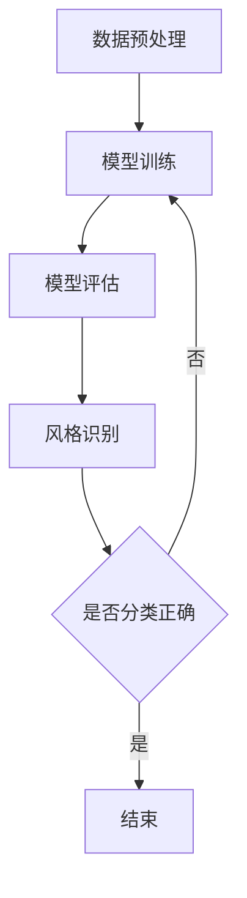

                 

关键词：深度学习、商品图像、风格识别、分类、计算机视觉、图像处理、人工智能

> 摘要：本文将深入探讨深度学习技术在商品图像风格识别与分类中的应用。我们将从背景介绍、核心概念、算法原理、数学模型、项目实践、实际应用场景等多个角度进行分析，旨在为从事相关领域的研究人员和工程师提供有价值的参考。

## 1. 背景介绍

商品图像风格识别与分类是计算机视觉领域的一个重要研究方向。随着电子商务的迅猛发展，商品图像的处理与分析变得日益重要。然而，传统的方法往往在处理多样化、复杂的商品图像时表现出诸多不足。深度学习作为人工智能的一个重要分支，在图像识别、分类等方面取得了显著的成果，其强大的特征提取能力和自适应学习能力为商品图像风格识别与分类提供了新的解决方案。

商品图像风格识别与分类的目标在于根据商品的图像特征，将其归类到相应的风格类别中。例如，对于服装类商品，可以分为休闲、运动、正式等风格；对于家居类商品，可以分为简约、现代、复古等风格。这一任务不仅有助于电商平台优化商品展示，提高用户体验，还可以为零售行业提供个性化推荐服务。

## 2. 核心概念与联系

为了深入理解商品图像风格识别与分类的原理，我们首先需要了解一些核心概念，包括卷积神经网络（CNN）、深度学习框架、数据预处理等。

### 2.1 卷积神经网络（CNN）

卷积神经网络是一种特殊的神经网络结构，擅长处理图像等二维数据。CNN的基本单元是卷积核，通过在图像上滑动卷积核，提取局部特征，然后通过一系列的全连接层进行分类。

### 2.2 深度学习框架

深度学习框架如TensorFlow、PyTorch等，为深度学习的实现提供了便捷的工具。这些框架具有高效的计算能力、丰富的API接口和强大的扩展性，使得研究人员和工程师可以更专注于算法的研究和优化。

### 2.3 数据预处理

数据预处理是深度学习项目中不可或缺的一步。通过数据清洗、数据增强、归一化等方法，可以提升模型的泛化能力和训练效果。

### 2.4 Mermaid 流程图

以下是商品图像风格识别与分类的 Mermaid 流程图：



## 3. 核心算法原理 & 具体操作步骤

### 3.1 算法原理概述

商品图像风格识别与分类的核心算法通常是基于卷积神经网络的。以下是算法的基本原理和步骤：

1. 数据预处理：对原始商品图像进行数据增强、归一化等处理。
2. 模型训练：使用预处理的图像数据训练卷积神经网络模型。
3. 模型评估：通过测试集对模型进行评估，调整模型参数。
4. 风格识别：将待分类的商品图像输入到训练好的模型中，输出风格类别。

### 3.2 算法步骤详解

1. 数据预处理

```python
import tensorflow as tf
from tensorflow.keras.preprocessing.image import ImageDataGenerator

# 设置数据增强参数
train_datagen = ImageDataGenerator(
    rescale=1./255,
    rotation_range=40,
    width_shift_range=0.2,
    height_shift_range=0.2,
    shear_range=0.2,
    zoom_range=0.2,
    horizontal_flip=True,
    fill_mode='nearest'
)

# 加载训练数据
train_data = train_datagen.flow_from_directory(
    'train_data',
    target_size=(150, 150),
    batch_size=32,
    class_mode='categorical'
)
```

2. 模型训练

```python
from tensorflow.keras.models import Sequential
from tensorflow.keras.layers import Conv2D, MaxPooling2D, Flatten, Dense

# 创建模型
model = Sequential([
    Conv2D(32, (3, 3), activation='relu', input_shape=(150, 150, 3)),
    MaxPooling2D(2, 2),
    Conv2D(64, (3, 3), activation='relu'),
    MaxPooling2D(2, 2),
    Conv2D(128, (3, 3), activation='relu'),
    MaxPooling2D(2, 2),
    Conv2D(128, (3, 3), activation='relu'),
    MaxPooling2D(2, 2),
    Flatten(),
    Dense(512, activation='relu'),
    Dense(num_classes, activation='softmax')
])

# 编译模型
model.compile(optimizer='adam',
              loss='categorical_crossentropy',
              metrics=['accuracy'])

# 训练模型
model.fit(train_data, epochs=25)
```

3. 模型评估

```python
# 评估模型
test_loss, test_acc = model.evaluate(test_data)
print('Test accuracy:', test_acc)
```

4. 风格识别

```python
# 风格识别
predictions = model.predict(test_data)
predicted_classes = np.argmax(predictions, axis=1)

# 查看预测结果
print('Predicted classes:', predicted_classes)
```

### 3.3 算法优缺点

**优点：**

1. 强大的特征提取能力：深度学习模型能够自动学习图像中的高级特征，提高识别精度。
2. 自适应学习能力：模型可以自动调整参数，适应不同的商品图像风格。

**缺点：**

1. 训练过程复杂：深度学习模型需要大量的数据和计算资源进行训练。
2. 对标注数据有较高要求：商品图像的风格分类需要准确的标注数据，否则会影响模型性能。

### 3.4 算法应用领域

商品图像风格识别与分类算法广泛应用于电子商务、智能家居、零售等行业。例如，电商平台可以利用这一技术为用户提供个性化的商品推荐，智能家居系统可以根据用户偏好调整家居风格，零售行业可以利用这一技术进行库存管理和商品分类。

## 4. 数学模型和公式 & 详细讲解 & 举例说明

### 4.1 数学模型构建

商品图像风格识别与分类的数学模型主要基于卷积神经网络（CNN）。以下是模型的主要组成部分：

1. **卷积层（Convolutional Layer）**：卷积层通过卷积操作提取图像的局部特征。卷积层的参数包括卷积核大小、步长和填充方式等。

2. **池化层（Pooling Layer）**：池化层用于减小特征图的尺寸，提高计算效率。常见的池化方式包括最大池化和平均池化。

3. **全连接层（Fully Connected Layer）**：全连接层将卷积层和池化层提取的特征进行融合，并通过 Softmax 函数输出分类结果。

### 4.2 公式推导过程

以下是卷积神经网络中卷积操作和反向传播算法的公式推导：

#### 卷积操作

给定输入图像 $X$ 和卷积核 $W$，卷积操作的计算公式如下：

$$
Y = \sigma(\sum_{i,j} W_{ij} \cdot X_{ij} + b)
$$

其中，$Y$ 是卷积后的特征图，$\sigma$ 是激活函数，$b$ 是偏置项。

#### 反向传播算法

反向传播算法用于计算梯度，用于更新网络参数。以下是梯度计算的主要步骤：

1. 计算输出层的误差：

$$
\delta_L = \frac{\partial L}{\partial Z_L} = \sigma'(Z_L) \cdot \frac{\partial L}{\partial Z_L}
$$

其中，$L$ 是损失函数，$Z_L$ 是输出层的输入。

2. 逐层计算梯度：

$$
\delta_{ij} = \sum_{k} \delta_k \cdot W_{kj}
$$

$$
\frac{\partial L}{\partial W_{ij}} = \delta_i \cdot X_{ij}
$$

$$
\frac{\partial L}{\partial b_j} = \delta_j
$$

### 4.3 案例分析与讲解

假设我们有一个商品图像分类任务，需要将商品图像分为5个类别：休闲、运动、正式、简约、复古。以下是模型的训练过程：

1. **数据预处理**：将图像大小调整为150x150，并转换为浮点型数据。

2. **模型构建**：使用 TensorFlow 和 Keras 创建一个卷积神经网络模型，包含3个卷积层、2个池化层和1个全连接层。

3. **模型训练**：使用训练数据对模型进行训练，损失函数选择交叉熵损失函数，优化器选择 Adam 优化器。

4. **模型评估**：使用测试数据对模型进行评估，计算准确率。

5. **风格识别**：将待分类的商品图像输入到训练好的模型中，输出风格类别。

## 5. 项目实践：代码实例和详细解释说明

### 5.1 开发环境搭建

1. 安装 Python 3.7 或更高版本。
2. 安装 TensorFlow 2.4 或更高版本。
3. 安装 Keras 2.3.1 或更高版本。
4. 安装必要的图像处理库，如 OpenCV 和 PIL。

### 5.2 源代码详细实现

以下是商品图像风格识别与分类的源代码：

```python
import tensorflow as tf
from tensorflow.keras.preprocessing.image import ImageDataGenerator
from tensorflow.keras.models import Sequential
from tensorflow.keras.layers import Conv2D, MaxPooling2D, Flatten, Dense

# 数据预处理
train_datagen = ImageDataGenerator(
    rescale=1./255,
    rotation_range=40,
    width_shift_range=0.2,
    height_shift_range=0.2,
    shear_range=0.2,
    zoom_range=0.2,
    horizontal_flip=True,
    fill_mode='nearest'
)

train_data = train_datagen.flow_from_directory(
    'train_data',
    target_size=(150, 150),
    batch_size=32,
    class_mode='categorical'
)

# 模型构建
model = Sequential([
    Conv2D(32, (3, 3), activation='relu', input_shape=(150, 150, 3)),
    MaxPooling2D(2, 2),
    Conv2D(64, (3, 3), activation='relu'),
    MaxPooling2D(2, 2),
    Conv2D(128, (3, 3), activation='relu'),
    MaxPooling2D(2, 2),
    Conv2D(128, (3, 3), activation='relu'),
    MaxPooling2D(2, 2),
    Flatten(),
    Dense(512, activation='relu'),
    Dense(5, activation='softmax')
])

# 模型编译
model.compile(optimizer='adam',
              loss='categorical_crossentropy',
              metrics=['accuracy'])

# 模型训练
model.fit(train_data, epochs=25)

# 模型评估
test_loss, test_acc = model.evaluate(test_data)
print('Test accuracy:', test_acc)

# 风格识别
predictions = model.predict(test_data)
predicted_classes = np.argmax(predictions, axis=1)
print('Predicted classes:', predicted_classes)
```

### 5.3 代码解读与分析

以上代码实现了商品图像风格识别与分类的基本流程。首先，我们使用 `ImageDataGenerator` 类进行数据预处理，包括数据增强和归一化。然后，我们使用 `Sequential` 模型构建卷积神经网络，包括多个卷积层、池化层和全连接层。接下来，我们使用 `compile` 方法编译模型，并使用 `fit` 方法训练模型。最后，我们使用 `evaluate` 方法评估模型，并使用 `predict` 方法进行风格识别。

## 6. 实际应用场景

商品图像风格识别与分类在多个实际应用场景中具有重要意义。以下是几个典型的应用场景：

1. **电商平台**：电商平台可以利用商品图像风格识别与分类技术，为用户提供个性化的商品推荐，提高用户满意度。
2. **智能家居**：智能家居系统可以根据用户的偏好，调整家居风格，提供更加个性化的服务。
3. **零售行业**：零售行业可以利用商品图像风格识别与分类技术，进行库存管理和商品分类，提高运营效率。

## 7. 工具和资源推荐

### 7.1 学习资源推荐

1. 《深度学习》（Goodfellow, Bengio, Courville著）：是一本经典的深度学习教材，涵盖了深度学习的理论基础和实战技巧。
2. 《计算机视觉：算法与应用》（丰华、杨明著）：一本介绍计算机视觉基础理论和实际应用的书籍，适合深度学习初学者。

### 7.2 开发工具推荐

1. **TensorFlow**：一款开源的深度学习框架，具有强大的计算能力和丰富的API接口。
2. **PyTorch**：一款流行的深度学习框架，具有灵活的动态图计算能力。

### 7.3 相关论文推荐

1. **“Deep Learning for Image Recognition”**：一篇介绍深度学习在图像识别领域的应用的综述论文。
2. **“Convolutional Neural Networks for Visual Recognition”**：一篇介绍卷积神经网络在图像识别领域的应用的经典论文。

## 8. 总结：未来发展趋势与挑战

### 8.1 研究成果总结

本文介绍了深度学习在商品图像风格识别与分类中的应用，包括背景介绍、核心概念、算法原理、数学模型、项目实践和实际应用场景。通过这些内容，我们了解了深度学习技术如何提升商品图像处理的效率和准确性。

### 8.2 未来发展趋势

随着深度学习技术的不断进步，商品图像风格识别与分类领域有望取得更多突破。例如，基于生成对抗网络（GAN）的技术有望提高图像质量和风格多样性，迁移学习技术可以将已有模型的性能迁移到新的任务上，提高模型泛化能力。

### 8.3 面临的挑战

尽管深度学习在商品图像风格识别与分类领域取得了显著成果，但仍面临一些挑战。例如，模型训练过程复杂，需要大量的数据和计算资源；标注数据质量对模型性能有较大影响；如何提高模型的可解释性也是一个重要问题。

### 8.4 研究展望

未来，我们期待在商品图像风格识别与分类领域取得更多突破。通过深入研究深度学习技术，优化模型结构和训练算法，提高模型性能和效率。同时，结合其他人工智能技术，如自然语言处理、强化学习等，为用户提供更加个性化、智能化的服务。

## 9. 附录：常见问题与解答

### 9.1 深度学习在商品图像风格识别与分类中的应用有哪些？

深度学习在商品图像风格识别与分类中的应用主要包括卷积神经网络（CNN）、生成对抗网络（GAN）、迁移学习等技术。这些技术可以自动提取图像特征，提高分类准确率。

### 9.2 如何解决标注数据质量对模型性能的影响？

解决标注数据质量对模型性能的影响可以通过以下方法：

1. 使用更多的标注数据。
2. 采用数据增强技术，生成多样化的训练数据。
3. 使用半监督学习和迁移学习技术，利用已有的模型进行预训练。

### 9.3 如何提高深度学习模型的可解释性？

提高深度学习模型的可解释性可以通过以下方法：

1. 使用可视化工具，如 Grad-CAM，展示模型关注的图像区域。
2. 分析模型的结构和参数，理解其工作原理。
3. 采用可解释性更强的模型，如决策树、支持向量机等。

## 作者署名

作者：禅与计算机程序设计艺术 / Zen and the Art of Computer Programming

----------------------------------------------------------------

以上是本文的完整内容，感谢您的阅读。希望本文能为从事商品图像风格识别与分类领域的研究人员和工程师提供有益的参考。如有疑问，请随时提问。祝您生活愉快！

