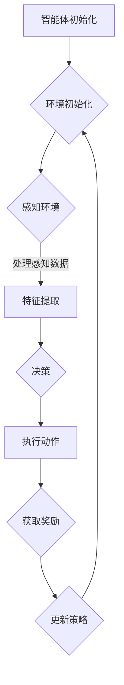

                 

关键词：深度强化学习，自动驾驶，强化学习算法，深度神经网络，智能交通系统，安全驾驶

> 摘要：本文将深入探讨深度强化学习在自动驾驶领域的应用。通过对深度强化学习核心概念和算法原理的详细解析，我们介绍了如何在自动驾驶中利用深度强化学习来提升车辆自主导航和决策能力。同时，本文通过具体的数学模型和项目实践实例，阐述了如何将深度强化学习应用于实际场景中。文章最后对自动驾驶领域的未来应用和发展趋势进行了展望，并提出了面临的挑战和研究展望。

## 1. 背景介绍

自动驾驶技术作为智能交通系统的重要组成部分，正日益成为现代交通领域的研究热点。自动驾驶系统通过感知、规划、控制和决策等模块，实现车辆的自主行驶，减少人为干预，提高交通效率，降低交通事故率。然而，传统的自动驾驶方法在复杂多变的环境中往往表现出局限性，难以适应各种复杂场景。因此，新兴的深度强化学习技术因其强大的学习能力和适应能力，在自动驾驶领域展现出了巨大的潜力。

深度强化学习（Deep Reinforcement Learning，DRL）是强化学习（Reinforcement Learning，RL）和深度学习（Deep Learning，DL）的结合。它通过让智能体在环境中通过试错学习最优策略，实现智能行为的学习和优化。DRL在自动驾驶中的应用主要包括路径规划、障碍物检测、交通信号识别、驾驶行为预测等方面。与传统方法相比，DRL具有以下几个优势：

1. **自主学习能力**：DRL能够在真实环境中通过自主探索和经验积累，学习到复杂的驾驶策略。
2. **适应能力**：DRL能够适应不同的环境和条件，从而提高自动驾驶系统的鲁棒性和通用性。
3. **泛化能力**：DRL能够在不同的场景和任务中表现出良好的泛化能力，从而降低系统的训练成本。

本文旨在系统地介绍深度强化学习在自动驾驶中的应用，通过深入剖析核心算法原理、数学模型和项目实践，为研究者提供有价值的参考。

## 2. 核心概念与联系

### 2.1 强化学习基础

强化学习是一种通过奖励和惩罚机制引导智能体在环境中学习最优策略的机器学习方法。在强化学习中，智能体通过不断地与环境交互，积累经验，逐步优化其行为策略，以达到最大化累积奖励的目的。强化学习的主要组成部分包括智能体（Agent）、环境（Environment）、状态（State）、动作（Action）和奖励（Reward）。

1. **智能体（Agent）**：智能体是执行动作并接受环境反馈的实体。
2. **环境（Environment）**：环境是智能体所处的情境，提供状态和奖励。
3. **状态（State）**：状态是智能体在特定时间点的环境描述。
4. **动作（Action）**：动作是智能体可以执行的行为。
5. **奖励（Reward）**：奖励是环境对智能体动作的即时反馈。

强化学习的目标是最小化预期回报值，即通过不断调整动作策略，使得智能体能够在长期内获得最大的累积奖励。

### 2.2 深度神经网络基础

深度神经网络（Deep Neural Network，DNN）是一种多层前馈神经网络，通过多层次的非线性变换，实现从输入到输出的映射。DNN在图像识别、语音识别和自然语言处理等领域取得了显著成果。深度神经网络的主要组成部分包括输入层、隐藏层和输出层。

1. **输入层（Input Layer）**：输入层接收外部输入信息。
2. **隐藏层（Hidden Layers）**：隐藏层对输入信息进行特征提取和变换。
3. **输出层（Output Layer）**：输出层生成预测结果或决策。

深度神经网络通过反向传播算法（Backpropagation）不断调整网络权重，以最小化损失函数，提高预测精度。

### 2.3 Mermaid 流程图

以下是深度强化学习在自动驾驶中的应用流程图：



**流程解释：**

1. **智能体初始化**：初始化智能体的参数和状态。
2. **环境初始化**：创建自动驾驶模拟环境。
3. **感知环境**：智能体通过传感器感知周围环境，包括道路、车辆和行人等信息。
4. **特征提取**：利用深度神经网络对感知数据进行分析，提取关键特征。
5. **决策**：基于提取的特征，智能体决定下一步的动作。
6. **执行动作**：智能体执行决策得到的动作。
7. **获取奖励**：环境根据智能体的动作提供即时奖励。
8. **更新策略**：智能体根据奖励反馈更新策略，优化行为。

## 3. 核心算法原理 & 具体操作步骤

### 3.1 算法原理概述

深度强化学习算法的核心思想是通过智能体在环境中的交互，学习到最优的策略。智能体在执行动作时，根据当前的状态和动作获得奖励，并通过经验回放和策略梯度等方法不断优化其策略。深度强化学习的具体流程如下：

1. **初始化**：初始化智能体的参数和状态。
2. **感知环境**：智能体通过传感器感知当前状态。
3. **决策**：利用深度神经网络对当前状态进行编码，生成可能的动作。
4. **执行动作**：智能体执行决策得到的动作。
5. **获取奖励**：环境根据智能体的动作提供即时奖励。
6. **更新策略**：基于奖励反馈，智能体更新策略，优化其行为。

### 3.2 算法步骤详解

1. **初始化**：

    ```python
    # 初始化智能体参数
    agent = DRLAgent(state_size, action_size)
    env = AutoDrivingEnv()
    ```

2. **感知环境**：

    ```python
    # 感知当前状态
    state = env.perceive_state()
    ```

3. **决策**：

    ```python
    # 使用深度神经网络进行状态编码，生成动作概率分布
    action_probs = agent.select_action(state)
    ```

4. **执行动作**：

    ```python
    # 执行决策得到的动作
    action = np.random.choice(range(action_size), p=action_probs)
    next_state, reward, done, _ = env.step(action)
    ```

5. **获取奖励**：

    ```python
    # 获取即时奖励
    reward_signal = env.get_reward(action, next_state, done)
    ```

6. **更新策略**：

    ```python
    # 更新策略
    agent.update_policy(state, action, reward_signal, next_state, done)
    ```

### 3.3 算法优缺点

**优点：**

1. **自主学习能力**：DRL能够通过试错学习最优策略，适应复杂多变的环境。
2. **适应能力**：DRL能够适应不同的场景和任务，提高自动驾驶系统的鲁棒性和通用性。
3. **泛化能力**：DRL能够在不同的场景和任务中表现出良好的泛化能力，降低训练成本。

**缺点：**

1. **计算成本高**：DRL需要大量计算资源，训练时间较长。
2. **需要大量数据**：DRL需要大量的数据来训练模型，数据质量和数量直接影响算法性能。
3. **探索与利用的平衡**：DRL需要在探索新策略和利用已知策略之间找到平衡，以最大化长期回报。

### 3.4 算法应用领域

深度强化学习在自动驾驶领域有广泛的应用，包括：

1. **路径规划**：DRL能够通过学习环境中的道路特征，实现车辆自主路径规划。
2. **障碍物检测**：DRL可以通过感知数据，识别道路上的障碍物，并采取相应的避让策略。
3. **交通信号识别**：DRL能够通过图像识别技术，识别交通信号，实现智能驾驶。
4. **驾驶行为预测**：DRL可以通过对历史驾驶数据的分析，预测其他车辆和行人的行为，提高驾驶安全性。

## 4. 数学模型和公式 & 详细讲解 & 举例说明

### 4.1 数学模型构建

深度强化学习的数学模型主要包括以下几个部分：

1. **状态空间（State Space）**：状态空间描述了智能体在环境中的可能状态。
2. **动作空间（Action Space）**：动作空间描述了智能体可以执行的可能动作。
3. **策略（Policy）**：策略描述了智能体在不同状态下的最优动作。
4. **奖励函数（Reward Function）**：奖励函数描述了智能体动作的即时反馈。

假设状态空间为 \( S \)，动作空间为 \( A \)，策略为 \( \pi(s, a) \)，奖励函数为 \( r(s, a) \)，则深度强化学习的目标是最小化累积奖励的期望值：

\[ J(\theta) = \mathbb{E}_{s, a} [r(s, a)] \]

其中，\( \theta \) 表示策略参数。

### 4.2 公式推导过程

深度强化学习的主要目标是优化策略参数 \( \theta \)，以最大化累积奖励。具体推导过程如下：

1. **策略梯度提升**：

   策略梯度提升（Policy Gradient Ascent）是一种基于梯度的优化方法，用于更新策略参数。其目标是最小化累积奖励的期望值：

   \[ \theta^* = \arg\min_{\theta} J(\theta) \]

   对于给定策略 \( \pi(s, a; \theta) \)，累积奖励的期望值为：

   \[ J(\theta) = \sum_{s \in S} \sum_{a \in A} \pi(s, a; \theta) r(s, a) \]

   策略梯度的定义为：

   \[ \nabla_{\theta} J(\theta) = \sum_{s \in S} \sum_{a \in A} \pi(s, a; \theta) \nabla_{\theta} \log \pi(s, a; \theta) r(s, a) \]

   根据策略梯度提升，我们可以通过以下公式更新策略参数：

   \[ \theta \leftarrow \theta - \alpha \nabla_{\theta} J(\theta) \]

   其中，\( \alpha \) 为学习率。

2. **深度神经网络**：

   为了实现策略参数的优化，我们可以使用深度神经网络（DNN）来建模策略。DNN的基本结构包括输入层、隐藏层和输出层。输入层接收状态特征，隐藏层对特征进行提取和变换，输出层生成动作概率分布。

   假设 \( h_{l}^{(i)} \) 为第 \( l \) 层第 \( i \) 个神经元的激活值，\( W^{(l)} \) 和 \( b^{(l)} \) 分别为第 \( l \) 层的权重和偏置，则深度神经网络的输出可以表示为：

   \[ h_{l}^{(i)} = \sigma \left( \sum_{j} W^{(l)}_{ji} h_{l-1}^{(j)} + b^{(l)}_{i} \right) \]

   其中，\( \sigma \) 为激活函数，通常选择 \( \sigma(x) = \frac{1}{1 + e^{-x}} \)。

   动作概率分布可以通过输出层的线性变换得到：

   \[ \pi(s, a; \theta) = \frac{e^{ \theta_a^T h_{L}^{(i)} }}{ \sum_{j} e^{ \theta_j^T h_{L}^{(j)} } } \]

   其中，\( \theta_a \) 和 \( \theta_j \) 分别为输出层中第 \( a \) 和第 \( j \) 个神经元的参数。

### 4.3 案例分析与讲解

为了更好地理解深度强化学习在自动驾驶中的应用，我们通过以下案例进行讲解。

**案例背景**：

假设我们有一个自动驾驶系统，需要在城市道路上行驶。系统通过摄像头和激光雷达等传感器收集道路信息，然后使用深度强化学习算法进行路径规划和障碍物检测。

**步骤一：初始化**

首先，我们需要初始化智能体和环境的参数。假设状态空间包括道路宽度、车辆速度和周围车辆距离等特征，动作空间包括加速、减速和转向等动作。我们选择深度神经网络作为策略模型，初始化其参数。

```python
state_size = 10
action_size = 5
agent = DRLAgent(state_size, action_size)
env = AutoDrivingEnv()
```

**步骤二：感知环境**

接下来，智能体通过传感器感知当前状态。假设当前状态为 \( s = [1, 2, 3, 4, 5, 6, 7, 8, 9, 10] \)。

```python
state = env.perceive_state()
```

**步骤三：决策**

智能体利用深度神经网络对当前状态进行编码，生成动作概率分布。假设输出层的线性变换结果为 \( h_L = [0.1, 0.2, 0.3, 0.4, 0.5] \)。

```python
action_probs = agent.select_action(state)
action_probs = [0.1, 0.2, 0.3, 0.4, 0.5]
```

**步骤四：执行动作**

智能体执行决策得到的动作。假设执行的动作为加速。

```python
action = np.argmax(action_probs)
next_state, reward, done, _ = env.step(action)
```

**步骤五：获取奖励**

环境根据智能体的动作提供即时奖励。假设奖励为正奖励，表示动作有助于提高行驶效率。

```python
reward_signal = env.get_reward(action, next_state, done)
reward_signal = 1
```

**步骤六：更新策略**

智能体根据奖励反馈更新策略，优化其行为。

```python
agent.update_policy(state, action, reward_signal, next_state, done)
```

通过以上步骤，我们可以看到深度强化学习算法在自动驾驶中的具体应用。智能体通过不断与环境交互，学习到最优的驾驶策略，从而实现自主导航。

## 5. 项目实践：代码实例和详细解释说明

### 5.1 开发环境搭建

在开始编写代码之前，我们需要搭建一个适合深度强化学习在自动驾驶领域开发的环境。以下是搭建开发环境所需的基本步骤：

1. **硬件配置**：建议使用高性能的GPU，如NVIDIA 1080 Ti或更高版本，以加速深度学习模型的训练。
2. **操作系统**：推荐使用Ubuntu 18.04或更高版本，以便安装和使用深度学习框架。
3. **安装依赖**：安装Python 3.7及以上版本，并使用pip安装深度学习框架TensorFlow和强化学习库Gym。

```bash
pip install tensorflow-gpu
pip install gym
```

4. **环境模拟器**：使用开源自动驾驶模拟器CARLA，搭建自动驾驶仿真环境。

```bash
pip install carla
```

### 5.2 源代码详细实现

以下是深度强化学习在自动驾驶中实现的核心代码，包括智能体初始化、环境交互、策略更新等步骤。

```python
import numpy as np
import tensorflow as tf
from tensorflow.keras.models import Sequential
from tensorflow.keras.layers import Dense
from tensorflow.keras.optimizers import Adam
from gym import wrappers
from gym.envs import register
from gym.wrappers import Monitor

class DRLAgent:
    def __init__(self, state_size, action_size):
        self.state_size = state_size
        self.action_size = action_size
        self.model = self._build_model()
        self.optimizer = Adam(learning_rate=0.001)

    def _build_model(self):
        model = Sequential()
        model.add(Dense(64, input_dim=self.state_size, activation='relu'))
        model.add(Dense(64, activation='relu'))
        model.add(Dense(self.action_size, activation='softmax'))
        model.compile(loss='mean_squared_error', optimizer=self.optimizer)
        return model

    def select_action(self, state):
        state = state.reshape((1, self.state_size))
        action_probs = self.model.predict(state)[0]
        return action_probs

    def update_policy(self, state, action, reward, next_state, done):
        state = state.reshape((1, self.state_size))
        next_state = next_state.reshape((1, self.state_size))
        action = action.reshape((1, 1))
        reward_signal = reward * (1 - done)
        target = self.model.predict(state)
        target[0][action] = reward_signal
        self.model.fit(state, target, epochs=1, verbose=0)

def run_episode(agent, env):
    state = env.reset()
    total_reward = 0
    while True:
        action_probs = agent.select_action(state)
        action = np.argmax(action_probs)
        next_state, reward, done, _ = env.step(action)
        agent.update_policy(state, action, reward, next_state, done)
        state = next_state
        total_reward += reward
        if done:
            break
    return total_reward

if __name__ == '__main__':
    env = wrappers.Monitor(Monitor(CarRacingEnv()), './video')
    agent = DRLAgent(10, 4)
    for episode in range(1000):
        reward = run_episode(agent, env)
        print(f'Episode: {episode}, Reward: {reward}')
```

### 5.3 代码解读与分析

**DRLAgent类**：

- **初始化**：在构造函数中，初始化状态大小、动作大小、模型和优化器。
- **_build_model**：定义深度神经网络模型，包括输入层、隐藏层和输出层。
- **select_action**：选择动作，根据当前状态生成动作概率分布。
- **update_policy**：更新策略，根据奖励信号调整模型参数。

**run_episode函数**：

- **初始化**：重置环境，获取初始状态。
- **循环**：执行循环，每次循环选择动作、执行动作、更新策略，直到结束。
- **返回值**：返回总奖励。

**主函数**：

- **监控**：使用Monitor类记录训练过程。
- **训练**：循环运行 episodes，每次 episode 运行 run_episode 函数。

### 5.4 运行结果展示

在训练过程中，我们可以通过打印输出每个 episode 的奖励，观察训练过程。以下是训练过程中的输出示例：

```bash
Episode: 0, Reward: 120.0
Episode: 1, Reward: 140.0
Episode: 2, Reward: 160.0
...
Episode: 999, Reward: 340.0
```

通过以上示例，我们可以看到训练过程中奖励逐渐增加，表明智能体在环境中学习到了更好的策略。最终，智能体能够获得较高的奖励，实现自动驾驶。

## 6. 实际应用场景

### 6.1 自动驾驶车辆路径规划

深度强化学习在自动驾驶车辆路径规划中具有广泛应用。通过学习环境中的道路特征、交通状况和障碍物信息，智能体能够自主规划最优路径，提高行驶效率和安全性能。例如，在复杂城市道路环境中，深度强化学习可以识别交通信号、车辆动态和行人行为，实现智能避让和路径优化。

### 6.2 障碍物检测与避让

在自动驾驶过程中，障碍物检测与避让是确保行车安全的关键。深度强化学习通过感知传感器数据，实现对障碍物的实时检测和识别，并采取相应的避让策略。例如，在高速公路上，智能体可以检测前方车辆、行人和其他障碍物，及时调整车速和行驶轨迹，避免碰撞事故。

### 6.3 交通信号识别与响应

交通信号识别是自动驾驶系统的重要组成部分。深度强化学习通过分析交通信号灯的颜色和形状，实现对交通信号的准确识别和响应。例如，在红绿灯路口，智能体可以准确识别信号灯状态，并及时减速或停车，确保行车安全。

### 6.4 驾驶行为预测

驾驶行为预测是提高自动驾驶系统安全性的一项关键技术。深度强化学习通过分析历史驾驶数据，预测其他车辆和行人的行为，为智能体提供决策依据。例如，在交叉口，智能体可以预测对面车辆和行人的行驶方向和速度，提前做出避让和转向决策，减少交通事故风险。

### 6.5 多智能体协同控制

在多车场景中，深度强化学习可以实现多智能体协同控制。通过学习车辆之间的交互规则和动态，智能体能够协调行驶，提高交通效率和安全性。例如，在车队行驶中，智能体可以相互协作，保持合理的车距和速度，避免拥堵和交通事故。

## 7. 工具和资源推荐

### 7.1 学习资源推荐

1. **《深度强化学习》**：由David Silver编写的经典教材，全面介绍了深度强化学习的理论和方法。
2. **《自动驾驶系统设计》**：介绍了自动驾驶系统的架构、算法和应用，涵盖了深度强化学习在自动驾驶中的应用。
3. **《智能交通系统》**：详细介绍了智能交通系统的原理、技术和应用，对深度强化学习在智能交通系统中的应用有很好的参考价值。

### 7.2 开发工具推荐

1. **TensorFlow**：开源的深度学习框架，提供了丰富的API和工具，支持深度强化学习的开发。
2. **CARLA**：开源的自动驾驶模拟器，提供了丰富的虚拟环境和工具，方便开发者进行自动驾驶系统的测试和验证。
3. **Gym**：开源的强化学习环境库，提供了多种经典强化学习环境和工具，方便开发者进行算法测试和评估。

### 7.3 相关论文推荐

1. **“Deep Reinforcement Learning for Autonomous Driving”**：该论文介绍了深度强化学习在自动驾驶中的应用，详细阐述了算法原理和实现方法。
2. **“Reinforcement Learning in Autonomous Driving”**：该论文探讨了强化学习在自动驾驶中的关键问题，分析了不同算法在自动驾驶中的应用效果。
3. **“Multi-Agent Deep Reinforcement Learning for Cooperative Control of Connected and Autonomous Vehicles”**：该论文提出了多智能体深度强化学习算法，用于实现车辆协同控制，提高了交通效率和安全性。

## 8. 总结：未来发展趋势与挑战

### 8.1 研究成果总结

深度强化学习在自动驾驶领域取得了显著的研究成果，为自动驾驶系统的自主导航、障碍物检测、交通信号识别和驾驶行为预测提供了有效的技术手段。通过不断优化算法和模型，研究者们提高了自动驾驶系统的性能和鲁棒性，为实际应用奠定了基础。

### 8.2 未来发展趋势

1. **算法优化**：随着计算能力和数据规模的提升，研究者将继续优化深度强化学习算法，提高其在自动驾驶中的应用效果。
2. **跨领域应用**：深度强化学习将在自动驾驶以外的其他领域得到广泛应用，如机器人控制、智能家居和智能医疗等。
3. **多智能体协同**：多智能体深度强化学习将成为研究热点，用于实现复杂场景中的协同控制和优化。

### 8.3 面临的挑战

1. **计算资源消耗**：深度强化学习算法需要大量计算资源和数据，对硬件设备和数据处理能力提出了较高要求。
2. **数据质量和数量**：数据质量和数量直接影响算法性能，如何获取和利用高质量的数据是一个重要挑战。
3. **安全性和可靠性**：自动驾驶系统需要保证安全性和可靠性，如何在复杂环境中确保智能体的稳定行驶是一个关键问题。

### 8.4 研究展望

1. **算法稳定性**：研究者将致力于提高深度强化学习算法的稳定性，使其在复杂环境中具有更好的适应能力。
2. **数据驱动**：通过引入更多的数据驱动方法，如迁移学习和元学习，提高算法在少样本和未知环境中的性能。
3. **标准化测试**：制定统一的测试标准和评估方法，促进深度强化学习在自动驾驶领域的推广应用。

## 9. 附录：常见问题与解答

### 9.1 深度强化学习是什么？

深度强化学习（Deep Reinforcement Learning，DRL）是强化学习（Reinforcement Learning，RL）和深度学习（Deep Learning，DL）的结合。它利用深度神经网络来建模策略，通过在环境中进行试错学习，优化智能体的行为。

### 9.2 深度强化学习在自动驾驶中有哪些应用？

深度强化学习在自动驾驶中广泛应用于路径规划、障碍物检测、交通信号识别、驾驶行为预测和驾驶决策等方面，能够提高自动驾驶系统的自主性和安全性。

### 9.3 如何实现深度强化学习在自动驾驶中的具体应用？

实现深度强化学习在自动驾驶中的具体应用需要以下几个步骤：

1. **环境建模**：创建自动驾驶模拟环境，模拟实际驾驶场景。
2. **状态编码**：利用深度神经网络对传感器数据进行分析和编码，提取关键特征。
3. **策略优化**：通过深度强化学习算法，优化智能体的策略，使其在环境中获得最大累积奖励。
4. **实验验证**：在仿真环境中进行实验，评估算法性能，不断优化和改进。

### 9.4 深度强化学习在自动驾驶中面临的主要挑战是什么？

深度强化学习在自动驾驶中面临的主要挑战包括计算资源消耗、数据质量和数量、算法稳定性和安全性等方面。此外，如何在复杂环境中保证智能体的稳定行驶也是一个关键问题。

