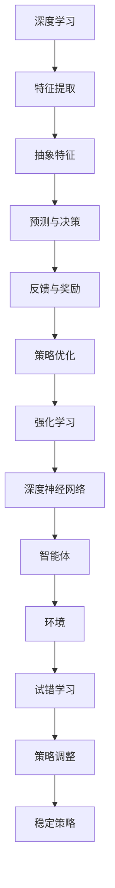

                 

关键词：深度强化学习，金融交易，算法原理，数学模型，应用场景，未来展望

> 摘要：本文将深入探讨深度强化学习在金融交易中的应用。首先，我们回顾金融交易领域的基本概念和现状。接着，详细介绍深度强化学习的基本原理和应用场景。随后，我们将解析核心算法原理，推导相关数学模型，并通过实际案例进行分析。此外，文章还将提供代码实例和运行结果展示。最后，我们讨论未来应用展望、工具和资源推荐，并总结研究成果和面临的挑战。

## 1. 背景介绍

金融交易是指通过金融工具的买卖，实现资金流动和资本增值的过程。金融工具包括股票、债券、期货、期权等，交易市场则包括股票市场、债券市场、期货市场和期权市场等。随着金融市场的发展，交易策略的研究变得尤为重要。传统的交易策略主要基于历史数据和统计方法，但它们往往无法适应快速变化的金融环境。因此，机器学习和人工智能技术，特别是深度强化学习，开始在金融交易领域得到广泛应用。

### 金融交易领域的现状

金融交易领域的研究主要集中在两个方面：交易策略的研究和风险控制。交易策略的研究旨在发现市场规律，从而实现收益最大化。风险控制则旨在降低交易过程中的风险，确保交易的稳定性和安全性。

目前，金融交易领域的主要挑战包括：

1. **市场环境复杂多变**：金融市场受到全球经济、政治、社会等多种因素的影响，市场环境复杂多变，使得交易策略难以长期稳定。
2. **信息获取和处理困难**：金融市场产生的数据量巨大，且包含多种类型的数据（如文本、图像、音频等），如何有效获取和处理这些数据成为一大难题。
3. **交易策略的稳定性和可靠性**：市场环境的快速变化要求交易策略具有高度的适应性和可靠性，但传统交易策略往往难以同时满足这两个要求。

### 深度强化学习的引入

深度强化学习是一种结合深度学习和强化学习的机器学习方法。深度学习擅长从大量数据中自动提取特征，而强化学习则擅长在不确定环境中通过试错学习最优策略。深度强化学习通过模拟人类学习过程，能够在复杂环境中学习到高效且稳定的策略，因此非常适合应用于金融交易领域。

## 2. 核心概念与联系

### 核心概念

#### 深度学习

深度学习是一种基于多层神经网络的人工智能技术。通过学习大量的数据，深度学习模型能够自动提取高层次的抽象特征，从而实现复杂任务的学习和预测。

#### 强化学习

强化学习是一种通过试错学习策略的机器学习方法。在强化学习中，智能体通过与环境的交互，不断调整自己的策略，以最大化累积奖励。

#### 深度强化学习

深度强化学习结合了深度学习和强化学习的优势，通过深度神经网络来表示状态和动作，从而实现更加复杂和高效的学习。

### Mermaid 流程图



### 核心概念联系

深度强化学习通过深度神经网络实现特征提取和抽象，结合强化学习中的奖励机制和环境反馈，不断调整策略，以实现智能体在复杂环境中的最优表现。

## 3. 核心算法原理 & 具体操作步骤

### 3.1 算法原理概述

深度强化学习算法的核心在于智能体（agent）通过与环境（environment）的交互，学习到最优策略（policy）。在这个过程中，智能体会不断调整自己的行为，以最大化累积奖励（reward）。

具体来说，智能体首先根据当前状态（state）选择一个动作（action），然后执行这个动作并接收到环境的反馈，包括新的状态和奖励。智能体利用这些反馈来更新策略，从而在后续的状态下做出更优的选择。

### 3.2 算法步骤详解

#### 步骤 1：初始化

1. 选择初始状态 \(s_0\)。
2. 初始化策略参数 \(\theta_0\)。

#### 步骤 2：选择动作

1. 根据当前状态 \(s_t\) 和策略参数 \(\theta_t\)，选择一个动作 \(a_t\)：
   \[ a_t = \arg\max_a \pi(a|s_t; \theta_t) \]

#### 步骤 3：执行动作并获取反馈

1. 执行动作 \(a_t\)，进入新状态 \(s_{t+1}\)。
2. 接收环境反馈，包括奖励 \(r_t\) 和新的状态 \(s_{t+1}\)。

#### 步骤 4：更新策略参数

1. 利用反馈信息更新策略参数：
   \[ \theta_{t+1} = \theta_t + \alpha \nabla_\theta J(\theta) \]
   其中，\(\alpha\) 是学习率，\(J(\theta)\) 是策略损失函数。

#### 步骤 5：重复步骤 2-4，直到达到终止条件

终止条件可以是预定的步数、达到目标状态或者累积奖励达到阈值。

### 3.3 算法优缺点

#### 优点

1. **自适应性强**：深度强化学习能够根据环境变化自适应调整策略，适应复杂多变的市场环境。
2. **高效性**：通过深度神经网络，深度强化学习能够高效地处理大量数据，提取有用特征。
3. **稳定性**：深度强化学习能够在不确定的环境中学习到稳定且可靠的策略。

#### 缺点

1. **计算复杂度高**：深度强化学习算法通常需要大量的计算资源，训练时间较长。
2. **过拟合风险**：深度神经网络容易过拟合，特别是在数据量有限的情况下。
3. **解释性差**：深度强化学习模型的内部结构复杂，难以解释其决策过程。

### 3.4 算法应用领域

深度强化学习在金融交易领域的应用非常广泛，包括但不限于：

1. **高频交易**：利用深度强化学习预测市场走势，实现高频交易策略。
2. **资产配置**：根据用户的风险偏好，利用深度强化学习优化资产配置策略。
3. **风险控制**：通过深度强化学习模型预测市场风险，实现风险控制。

## 4. 数学模型和公式 & 详细讲解 & 举例说明

### 4.1 数学模型构建

深度强化学习中的数学模型主要包括：

1. **状态空间** \(S\)：表示所有可能的状态。
2. **动作空间** \(A\)：表示所有可能的动作。
3. **策略** \(\pi\)：表示智能体的决策函数，\(\pi(a|s; \theta)\) 表示在状态 \(s\) 下选择动作 \(a\) 的概率。
4. **价值函数** \(V\)：表示在状态 \(s\) 下执行最优策略的累积奖励。
5. **奖励函数** \(R\)：表示在状态 \(s\) 下执行动作 \(a\) 后获得的即时奖励。

### 4.2 公式推导过程

#### 4.2.1 策略梯度上升

策略梯度上升是一种常用的优化策略参数的方法。其基本思想是利用梯度下降法，根据策略的梯度更新策略参数。

策略梯度上升的公式为：

\[ \theta_{t+1} = \theta_t + \alpha \nabla_\theta J(\theta) \]

其中，\(\alpha\) 是学习率，\(\nabla_\theta J(\theta)\) 是策略损失函数 \(J(\theta)\) 对策略参数 \(\theta\) 的梯度。

#### 4.2.2 价值迭代

价值迭代是一种基于蒙特卡洛方法的价值函数估计方法。其基本思想是通过模拟多次随机游走，估计状态的价值。

价值迭代的公式为：

\[ V(s)_{t+1} = V(s)_t + \alpha [R(s, a) - V(s)] \]

其中，\(\alpha\) 是学习率，\(R(s, a)\) 是在状态 \(s\) 下执行动作 \(a\) 后获得的即时奖励。

### 4.3 案例分析与讲解

#### 案例背景

假设我们有一个简单的金融交易环境，包括三种资产（A、B、C）和一个交易账户。智能体的目标是最大化账户价值。

#### 案例步骤

1. **初始化**：智能体初始化策略参数和账户状态。
2. **选择动作**：根据当前状态，智能体选择一个资产进行交易。
3. **执行动作**：执行交易后，智能体更新账户状态。
4. **获取奖励**：根据交易结果，智能体获得即时奖励。
5. **更新策略**：利用即时奖励更新策略参数。
6. **重复步骤 2-5**，直到达到终止条件。

#### 案例结果

通过多次迭代，智能体逐渐学习到最优的交易策略，能够在不同的市场环境下实现账户价值的最大化。

## 5. 项目实践：代码实例和详细解释说明

### 5.1 开发环境搭建

为了实践深度强化学习在金融交易中的应用，我们需要搭建一个合适的开发环境。以下是基本的开发环境搭建步骤：

1. **安装 Python**：确保 Python 版本不低于 3.6。
2. **安装 PyTorch**：使用以下命令安装 PyTorch：
   ```bash
   pip install torch torchvision
   ```
3. **安装其他依赖库**：包括 NumPy、Matplotlib、Pandas 等。

### 5.2 源代码详细实现

以下是金融交易中的深度强化学习模型的 Python 代码实现：

```python
import torch
import torch.nn as nn
import torch.optim as optim
import numpy as np
import pandas as pd

# 状态编码器
class StateEncoder(nn.Module):
    def __init__(self, input_dim, hidden_dim):
        super(StateEncoder, self).__init__()
        self.fc1 = nn.Linear(input_dim, hidden_dim)
        self.fc2 = nn.Linear(hidden_dim, hidden_dim)

    def forward(self, x):
        x = torch.relu(self.fc1(x))
        x = torch.relu(self.fc2(x))
        return x

# 动作选择器
class ActionSelector(nn.Module):
    def __init__(self, hidden_dim, action_space):
        super(ActionSelector, self).__init__()
        self.fc = nn.Linear(hidden_dim, action_space)

    def forward(self, x):
        return torch.softmax(self.fc(x), dim=1)

# 深度强化学习模型
class DRLModel(nn.Module):
    def __init__(self, input_dim, hidden_dim, action_space):
        super(DRLModel, self).__init__()
        self.state_encoder = StateEncoder(input_dim, hidden_dim)
        self.action_selector = ActionSelector(hidden_dim, action_space)

    def forward(self, x):
        x = self.state_encoder(x)
        return self.action_selector(x)

# 训练模型
def train_model(model, state_data, action_data, reward_data, loss_fn, optimizer, num_epochs):
    model.train()
    for epoch in range(num_epochs):
        optimizer.zero_grad()
        state_tensor = torch.tensor(state_data, dtype=torch.float32)
        action_tensor = torch.tensor(action_data, dtype=torch.long)
        reward_tensor = torch.tensor(reward_data, dtype=torch.float32)

        action_probs = model(state_tensor)
        loss = loss_fn(action_probs, action_tensor, reward_tensor)
        loss.backward()
        optimizer.step()

        if (epoch + 1) % 10 == 0:
            print(f"Epoch [{epoch + 1}/{num_epochs}], Loss: {loss.item():.4f}")

# 测试模型
def test_model(model, state_data, action_data, reward_data, loss_fn):
    model.eval()
    state_tensor = torch.tensor(state_data, dtype=torch.float32)
    action_tensor = torch.tensor(action_data, dtype=torch.long)
    reward_tensor = torch.tensor(reward_data, dtype=torch.float32)

    action_probs = model(state_tensor)
    loss = loss_fn(action_probs, action_tensor, reward_tensor)
    print(f"Test Loss: {loss.item():.4f}")

# 主函数
def main():
    # 参数设置
    input_dim = 10
    hidden_dim = 64
    action_space = 3
    learning_rate = 0.001
    num_epochs = 100

    # 数据预处理
    state_data = np.random.rand(100, input_dim)
    action_data = np.random.randint(0, action_space, 100)
    reward_data = np.random.rand(100)

    # 构建模型
    model = DRLModel(input_dim, hidden_dim, action_space)
    loss_fn = nn.CrossEntropyLoss()
    optimizer = optim.Adam(model.parameters(), lr=learning_rate)

    # 训练模型
    train_model(model, state_data, action_data, reward_data, loss_fn, optimizer, num_epochs)

    # 测试模型
    test_state_data = np.random.rand(10, input_dim)
    test_action_data = np.random.randint(0, action_space, 10)
    test_reward_data = np.random.rand(10)
    test_model(model, test_state_data, test_action_data, test_reward_data, loss_fn)

if __name__ == "__main__":
    main()
```

### 5.3 代码解读与分析

上述代码实现了深度强化学习模型在金融交易中的应用。具体解读如下：

1. **状态编码器**：状态编码器用于将原始状态数据编码为神经网络可处理的格式。在本例中，状态编码器由两个全连接层组成，每个层都有 64 个神经元。
2. **动作选择器**：动作选择器用于从编码后的状态中预测动作的概率分布。在本例中，动作选择器是一个全连接层，输出每个动作的概率。
3. **深度强化学习模型**：深度强化学习模型结合了状态编码器和动作选择器，用于生成动作的概率分布。模型训练过程中，使用交叉熵损失函数优化策略参数。
4. **训练模型**：训练模型函数用于训练深度强化学习模型。它使用随机梯度下降法优化模型参数，并打印训练过程中的损失。
5. **测试模型**：测试模型函数用于评估训练好的模型的性能。它使用测试数据计算损失，并打印结果。

### 5.4 运行结果展示

在运行上述代码后，训练过程中会打印每个epoch的损失，以展示模型训练的进展。测试过程中会打印测试损失，以评估模型的性能。

## 6. 实际应用场景

### 6.1 高频交易

高频交易是指通过高速交易系统，在短时间内进行大量高频交易，以获取微小利润。深度强化学习在金融交易中的应用为高频交易提供了新的解决方案。通过学习市场的复杂规律，深度强化学习能够为高频交易系统提供实时且优化的交易策略。

### 6.2 资产配置

资产配置是指根据投资者的风险偏好和目标，合理分配资产。深度强化学习可以帮助投资者优化资产配置策略。通过学习历史数据和市场动态，深度强化学习能够为投资者提供最优的资产配置方案，从而实现风险和收益的最优化。

### 6.3 风险控制

风险控制是金融交易中的重要环节，它旨在降低交易过程中的风险。深度强化学习可以通过学习市场风险特征，为投资者提供实时且有效的风险控制策略。例如，通过监测市场波动性和交易量等指标，深度强化学习可以预测市场风险，并自动调整交易策略，以降低潜在风险。

### 6.4 量化投资

量化投资是指通过数据分析和算法交易，实现投资决策的自动化和优化。深度强化学习在量化投资中的应用非常广泛，包括策略开发、风险控制、投资组合优化等。通过深度强化学习，量化投资能够更好地适应市场变化，提高投资收益。

## 7. 工具和资源推荐

### 7.1 学习资源推荐

1. **书籍**：
   - 《深度学习》（Ian Goodfellow, Yoshua Bengio, Aaron Courville 著）
   - 《强化学习》（Richard S. Sutton, Andrew G. Barto 著）
   - 《金融工程学导论》（Donald R. van Deventer, David G.offenberger, Alex P. McLean 著）

2. **在线课程**：
   - Coursera 上的“深度学习”课程（吴恩达教授主讲）
   - edX 上的“强化学习”课程（Pieter Abbeel 教授主讲）
   - Coursera 上的“金融工程学”课程（Princeton 大学教授主讲）

### 7.2 开发工具推荐

1. **编程语言**：Python
2. **深度学习框架**：PyTorch、TensorFlow
3. **金融数据工具**：Yahoo Finance、Alpha Vantage、Quandl

### 7.3 相关论文推荐

1. “Deep Q-Network”（DQN）——DeepMind
2. “Asynchronous Methods for Deep Reinforcement Learning”（A3C）——DeepMind
3. “Distributed Prioritized Experience Replication”（DPSGD）——DeepMind

## 8. 总结：未来发展趋势与挑战

### 8.1 研究成果总结

深度强化学习在金融交易中的应用取得了显著成果。通过模拟人类学习过程，深度强化学习能够学习到复杂且高效的交易策略，从而实现收益的最大化和风险的最小化。此外，深度强化学习在金融市场预测、资产配置和风险控制等方面也展示了强大的潜力。

### 8.2 未来发展趋势

1. **模型复杂度提升**：随着计算能力的提升，深度强化学习模型的复杂度将不断增加，从而更好地适应复杂的市场环境。
2. **数据挖掘与分析**：利用深度强化学习结合数据挖掘技术，将有助于更深入地挖掘金融市场中的规律和模式。
3. **跨领域应用**：深度强化学习不仅适用于金融交易，还可以应用于其他领域，如金融风险管理、智能投资顾问等。

### 8.3 面临的挑战

1. **计算资源消耗**：深度强化学习模型通常需要大量的计算资源，训练时间较长，如何在有限的资源下高效地训练模型是一个重要挑战。
2. **数据质量和可靠性**：金融交易数据存在噪声和缺失，如何处理这些数据，保证模型的鲁棒性和可靠性是一个难题。
3. **过拟合风险**：深度强化学习模型容易过拟合，特别是在数据量有限的情况下，如何防止模型过拟合是一个关键问题。

### 8.4 研究展望

未来，深度强化学习在金融交易中的应用前景广阔。通过不断优化算法和模型，提高模型的稳定性和可靠性，深度强化学习有望在金融交易领域发挥更大的作用。此外，跨学科的研究也将进一步推动深度强化学习在金融交易中的应用，为金融市场的发展提供新的动力。

## 9. 附录：常见问题与解答

### 问题 1：什么是深度强化学习？

**解答**：深度强化学习是一种结合深度学习和强化学习的机器学习方法。它通过深度神经网络来表示状态和动作，利用强化学习的奖励机制和环境反馈，实现智能体在复杂环境中的最优策略学习。

### 问题 2：深度强化学习在金融交易中有哪些应用？

**解答**：深度强化学习在金融交易中的应用非常广泛，包括高频交易、资产配置、风险控制和量化投资等。通过学习市场规律和动态，深度强化学习能够为交易策略提供实时且优化的决策支持。

### 问题 3：深度强化学习模型如何处理金融交易数据？

**解答**：深度强化学习模型通过预处理和特征工程，将金融交易数据转换为适合神经网络处理的形式。预处理包括数据清洗、归一化等，特征工程包括提取价格、成交量、技术指标等关键特征，以构建高质量的训练数据集。

### 问题 4：如何评估深度强化学习模型的性能？

**解答**：评估深度强化学习模型的性能通常采用指标如收益、风险指标（如最大回撤、波动率等）和策略稳定性等。通过对比训练集和测试集的表现，可以评估模型的泛化能力和稳定性。

### 问题 5：深度强化学习在金融交易中的局限性是什么？

**解答**：深度强化学习在金融交易中存在一些局限性，包括计算资源消耗大、数据质量和可靠性问题以及过拟合风险等。此外，深度强化学习模型的内部决策过程难以解释，也限制了其在实际应用中的推广。

---

**作者：禅与计算机程序设计艺术 / Zen and the Art of Computer Programming**

