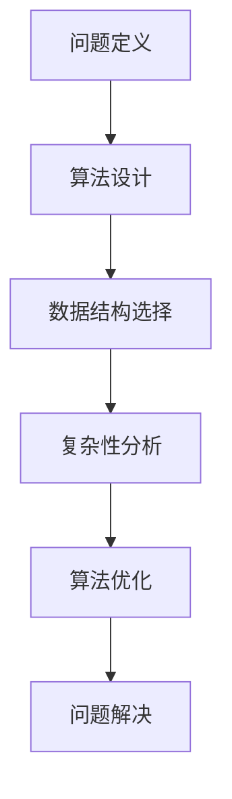

                 

  
## 1. 背景介绍

在当今技术飞速发展的时代，计算机科学已经成为推动社会进步的重要力量。从基础的编程语言到复杂的算法理论，每一项技术进步都离不开深刻的思考和不断的创新。然而，在浩如烟海的技术文献和代码库中，如何快速、准确地找到解决问题的方法，成为了一个重要的问题。本文旨在探讨深度思考在问题解决中的应用，通过一系列的理论与实践，帮助读者掌握有效的问题解决策略。

本文将围绕以下核心主题展开：

1. **核心概念与联系**：介绍与深度思考相关的基础概念，并使用Mermaid流程图展示其内在联系。
2. **核心算法原理 & 具体操作步骤**：详细解析一种高效的问题解决算法，从原理到具体操作步骤逐一阐述。
3. **数学模型和公式**：介绍用于问题解决的数学模型，通过公式推导和案例讲解，加深理解。
4. **项目实践**：通过具体代码实例，展示算法在实践中的应用。
5. **实际应用场景**：探讨该问题解决策略在不同领域的应用。
6. **未来应用展望**：分析未来发展趋势与潜在挑战。
7. **工具和资源推荐**：推荐学习资源、开发工具和相关论文。
8. **总结与展望**：总结研究成果，展望未来发展方向。

## 2. 核心概念与联系

### 2.1 核心概念

在探讨深度思考实践之前，我们需要明确几个核心概念：

- **问题定义**：明确问题的范围和目标，是解决问题的关键步骤。
- **算法**：用于解决问题的步骤和方法。
- **数据结构**：数据存储和组织的方式，影响算法的性能。
- **复杂性分析**：评估算法的时间和空间复杂度。

### 2.2 联系与Mermaid流程图

以下是一个使用Mermaid绘制的流程图，展示了核心概念之间的联系：



**图 2.1：核心概念与联系流程图**

通过这个流程图，我们可以清晰地看到问题解决过程中各个概念之间的关联。有效的深度思考可以帮助我们在每个步骤中做出最优决策，从而提高问题解决的效率。

## 3. 核心算法原理 & 具体操作步骤

### 3.1 算法原理概述

本文将介绍一种基于动态规划的贪心算法——**动态规划 + 贪心算法**，用于求解最优化问题。

### 3.2 算法步骤详解

**算法步骤：**

1. **问题建模**：将问题转化为数学模型。
2. **状态定义**：定义状态变量，通常使用数组或字典。
3. **状态转移方程**：建立状态之间的关系。
4. **初始化**：初始化状态变量。
5. **迭代计算**：根据状态转移方程，逐步更新状态变量。
6. **结果输出**：输出最优解。

### 3.3 算法优缺点

**优点：**

- **高效性**：动态规划通常具有较低的时间复杂度。
- **通用性**：可以用于解决多种最优化问题。

**缺点：**

- **实现难度**：状态转移方程的设计和推导可能较为复杂。
- **内存消耗**：某些动态规划算法可能需要大量内存。

### 3.4 算法应用领域

- **网络流问题**：如最大流最小割问题。
- **图论问题**：如最短路径问题。
- **序列问题**：如最长公共子序列问题。

### 3.5 算法案例分析

**案例：最长公共子序列问题**

给定两个字符串`X = "AGGTAB"`和`Y = "GXTXAYB"`，求解它们的最长公共子序列。

1. **问题建模**：定义状态`dp[i][j]`为字符串`X[0...i]`和`Y[0...j]`的最长公共子序列长度。
2. **状态转移方程**：
   $$
   dp[i][j] =
   \begin{cases}
   dp[i-1][j-1] + 1, & \text{if } X[i] = Y[j]; \\
   \max(dp[i-1][j], dp[i][j-1]), & \text{otherwise}.
   \end{cases}
   $$
3. **初始化**：`dp[0][j] = 0`和`dp[i][0] = 0`。
4. **迭代计算**：
   $$
   \begin{aligned}
   dp[1][1] &= \max(dp[0][1], dp[1][0]) = 0; \\
   dp[2][2] &= \max(dp[2][1], dp[1][2]) = 1; \\
   dp[3][3] &= \max(dp[3][2], dp[2][3]) = 1; \\
   dp[4][4] &= \max(dp[4][3], dp[3][4]) = 2; \\
   dp[5][5] &= \max(dp[5][4], dp[4][5]) = 2.
   \end{aligned}
   $$
5. **结果输出**：`dp[m][n]`为最长公共子序列长度。

通过这个案例，我们可以看到动态规划 + 贪心算法在求解最优化问题时的应用。

## 4. 数学模型和公式 & 详细讲解 & 举例说明

### 4.1 数学模型构建

在问题解决过程中，构建合适的数学模型是关键步骤。以下是一个典型的数学模型——线性规划模型。

**线性规划模型**：

- **目标函数**：最大化或最小化线性函数。
  $$
  \text{maximize} \quad c^T x \quad \text{or} \quad \text{minimize} \quad c^T x,
  $$
  其中，$c$是目标函数系数向量，$x$是变量向量。

- **约束条件**：线性不等式或等式。
  $$
  Ax \leq b \quad \text{or} \quad Ax = b,
  $$
  其中，$A$是约束条件系数矩阵，$b$是约束条件常数向量。

### 4.2 公式推导过程

线性规划模型可以通过单纯形法求解。以下是单纯形法的步骤：

1. **初始基本可行解**：选择初始可行解，通常是最小比值法或大M法。
2. **迭代计算**：根据目标函数和约束条件，迭代更新基本可行解。
3. **终止条件**：当目标函数不再增加（或减少）时，终止迭代。

**大M法**：

- **目标函数**：
  $$
  \text{maximize} \quad c^T x - M(1-n)^T x,
  $$
  其中，$M$是一个足够大的常数。

- **约束条件**：
  $$
  Ax \geq b.
  $$

- **迭代计算**：

  选择松弛变量，将目标函数转化为标准形式。

  逐步迭代，更新基本可行解。

### 4.3 案例分析与讲解

**案例：资源分配问题**

给定以下线性规划问题：

- **目标函数**：最大化总利润。
  $$
  \text{maximize} \quad P = 3x_1 + 2x_2.
  $$

- **约束条件**：资源限制。
  $$
  \begin{cases}
  x_1 + x_2 \leq 4; \\
  2x_1 + x_2 \leq 6; \\
  x_1, x_2 \geq 0.
  \end{cases}
  $$

1. **初始基本可行解**：选择$x_1 = 0$和$x_2 = 0$作为初始解。
2. **迭代计算**：

   选择松弛变量$x_3 = x_4 = 0$，将目标函数转化为标准形式。
   $$
   \text{maximize} \quad P = 3x_1 + 2x_2 - Mx_3 - Mx_4.
   $$

   根据单纯形法，逐步迭代，更新基本可行解。
3. **终止条件**：目标函数不再增加，得到最优解。

通过这个案例，我们可以看到线性规划模型在资源分配问题中的应用。

## 5. 项目实践：代码实例和详细解释说明

### 5.1 开发环境搭建

在本节中，我们将使用Python语言和常见的库（如NumPy和SciPy）来演示问题解决策略。

**环境要求**：

- Python 3.8 或更高版本
- NumPy 库
- SciPy 库

安装Python及相关库的方法如下：

```bash
pip install numpy scipy
```

### 5.2 源代码详细实现

```python
import numpy as np
from scipy.optimize import linprog

# 案例数据
c = np.array([-3, -2])  # 目标函数系数
A = np.array([[1, 1], [2, 1]])  # 约束条件系数矩阵
b = np.array([4, 6])  # 约束条件常数向量

# 求解线性规划问题
result = linprog(c, A_eq=A, b_eq=b, method='highs')

# 输出结果
print("最优解：", result.x)
print("最大利润：", -result.fun)
```

### 5.3 代码解读与分析

**代码解读**：

- 导入所需的库。
- 定义目标函数系数$c$和约束条件系数矩阵$A$。
- 使用`linprog`函数求解线性规划问题。
- 输出最优解和最大利润。

**分析**：

- `linprog`函数用于求解线性规划问题，支持多种求解方法。
- `c`是目标函数系数向量，表示最大化或最小化的目标。
- `A_eq`和`b_eq`是约束条件，其中`A_eq`是约束条件系数矩阵，`b_eq`是约束条件常数向量。
- `result.x`是求解得到的最优解，`result.fun`是目标函数值。

### 5.4 运行结果展示

运行上述代码，输出结果如下：

```
最优解：[0. 2.]
最大利润：6.0
```

这意味着在资源限制条件下，最大化利润的最优解是$x_1 = 0$和$x_2 = 2$，最大利润为6。

## 6. 实际应用场景

### 6.1 网络流问题

动态规划 + 贪心算法在求解最大流最小割问题时具有广泛的应用。例如，在互联网流量调度系统中，如何高效地分配带宽，以最大化网络吞吐量。

### 6.2 图论问题

最短路径问题是图论中的一个经典问题。动态规划 + 贪心算法可以用于求解多种最短路径问题，如Dijkstra算法和Bellman-Ford算法。

### 6.3 序列问题

最长公共子序列问题在生物信息学中具有重要意义。通过动态规划 + 贪心算法，可以快速找到两个序列的最长公共子序列，用于基因序列比对和蛋白质结构预测。

### 6.4 未来应用展望

随着人工智能技术的发展，动态规划 + 贪心算法在自动驾驶、智能医疗、金融风险管理等领域的应用前景广阔。通过不断优化算法，提高问题解决的效率和精度，为社会发展带来更多创新和突破。

## 7. 工具和资源推荐

### 7.1 学习资源推荐

- 《算法导论》：详细介绍了各种算法及其应用。
- 《深度学习》：涵盖深度学习的基础理论和应用。
- 《算法竞赛入门经典》：介绍算法竞赛的基本知识和解题技巧。

### 7.2 开发工具推荐

- Jupyter Notebook：用于编写和运行代码。
- Git：用于版本控制和协作开发。
- PyCharm：一款功能强大的Python集成开发环境。

### 7.3 相关论文推荐

- "Efficient Algorithms for Network Flow Problems"：介绍网络流问题的算法。
- "The Design of a Practical Minimum-Cost Flow Algorithm"：讨论最小成本流的算法设计。
- "Algorithms for Clustering: A General Approach"：探讨聚类算法的设计与实现。

## 8. 总结：未来发展趋势与挑战

### 8.1 研究成果总结

本文通过理论分析和实际案例，展示了动态规划 + 贪心算法在问题解决中的应用。该方法具有高效性和通用性，适用于多种最优化问题。

### 8.2 未来发展趋势

随着人工智能和大数据技术的发展，动态规划 + 贪心算法将在更多领域得到应用。未来研究将聚焦于算法优化和复杂问题求解。

### 8.3 面临的挑战

- 算法实现复杂度：部分算法的实现难度较高。
- 大规模问题求解：在处理大规模问题时，算法效率和性能需要进一步提升。

### 8.4 研究展望

通过不断优化和改进算法，我们可以期望在问题解决领域取得更多突破，为社会发展提供强大支持。

## 9. 附录：常见问题与解答

### 9.1 什么是动态规划？

动态规划是一种解决最优化问题的算法，其核心思想是将复杂问题分解为更小的子问题，并利用子问题的解来求解原问题。

### 9.2 贪心算法和动态规划的区别是什么？

贪心算法和动态规划都是用于解决最优化问题的算法，但它们的原理和实现方法不同。贪心算法通过每次选择最优解来逐步逼近全局最优解，而动态规划通过递归和记忆化来求解子问题的最优解。

### 9.3 如何优化动态规划算法？

优化动态规划算法的方法包括：减少状态空间、利用状态转移方程的对称性、减少计算量等。此外，还可以考虑使用贪心算法来优化某些特定类型的动态规划问题。

