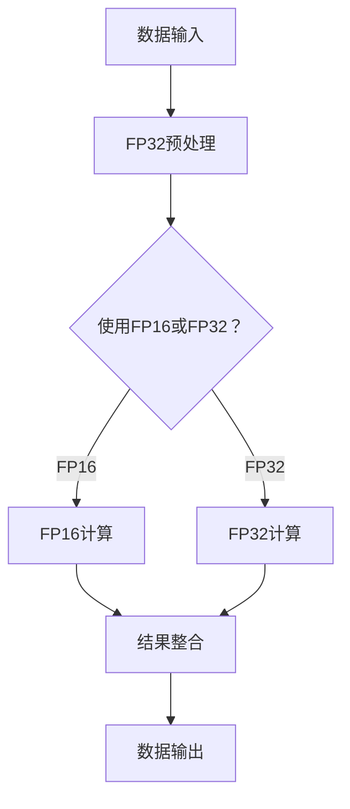

                 

关键词：混合精度，工业应用，AI计算，精度与效率优化，算法改进，代码实例

> 摘要：随着人工智能和深度学习技术在工业界的广泛应用，计算效率和精度成为关键挑战。本文旨在探讨混合精度计算在工业界的应用，通过对核心概念、算法原理、数学模型和具体实践的分析，揭示其在提升计算性能和优化资源利用方面的巨大潜力。

## 1. 背景介绍

在当今的工业界，尤其是人工智能和深度学习领域，计算资源的效率和算法的准确性是决定成败的关键因素。随着数据量的爆炸式增长和算法复杂度的不断提升，传统的单精度（32位浮点数）计算已经难以满足高性能计算的需求。因此，混合精度计算作为一种新兴技术，受到了广泛关注。

混合精度计算（Mixed Precision Computing）是指在同一计算任务中，使用不同精度的浮点数进行计算，通常结合单精度（32位浮点数，FP32）和半精度（16位浮点数，FP16）进行操作。这种方法的主要优势在于能够在保持较高计算精度的同时，显著提高计算速度和降低内存使用，从而在有限资源下实现更高效的计算。

### 1.1 混合精度计算的起源

混合精度计算的概念最早由NVIDIA在2017年提出，并在其Tensor Core架构中得到了实现。Tensor Core可以同时处理FP32和FP16运算，通过在合适的阶段使用FP16，可以有效减少运算中的数值误差，提高计算速度。随后，这一技术逐渐在其他GPU和CPU架构中得到应用。

### 1.2 工业界的需求

工业界对于高性能计算的需求主要体现在以下几个方面：

- **大数据处理**：随着物联网和传感器技术的发展，工业界面临着处理大量复杂数据的需求。混合精度计算可以大幅减少数据处理的时间和资源消耗。
- **实时计算**：在制造业、自动驾驶等领域，实时计算是关键。混合精度计算通过优化计算效率，可以满足这些领域的实时处理需求。
- **算法优化**：在人工智能和机器学习领域，算法的精度和效率直接影响应用的性能。混合精度计算提供了优化算法性能的途径。

## 2. 核心概念与联系

### 2.1 核心概念

- **单精度（FP32）**：单精度浮点数，使用32位来表示，通常用于常规计算任务。
- **半精度（FP16）**：半精度浮点数，使用16位来表示，通常用于加速计算任务，减少内存使用。
- **混合精度**：在同一计算任务中，根据需要同时使用FP32和FP16进行计算。

### 2.2 关联架构

混合精度计算的实现依赖于特定的硬件架构，如GPU和CPU。以下是一个简化的Mermaid流程图，展示了混合精度计算的基本流程：



在这个流程中，数据首先进行预处理，然后根据计算需求选择使用FP16或FP32进行计算。最终，计算结果进行整合，并输出。

## 3. 核心算法原理 & 具体操作步骤

### 3.1 算法原理概述

混合精度计算的基本原理是利用FP16的运算速度和FP32的精度，在同一计算任务中交替使用两种精度。具体来说，以下是混合精度计算的核心步骤：

1. **数据预处理**：将输入数据转换为FP16或FP32格式，根据计算任务的特点进行适当的预处理。
2. **运算选择**：根据运算量的大小和复杂度，选择使用FP16或FP32进行计算。通常，对于大量的小规模运算，使用FP16可以提高效率；对于需要高精度的运算，使用FP32。
3. **结果整合**：将使用不同精度计算的结果进行整合，得到最终的输出结果。

### 3.2 算法步骤详解

1. **初始化数据**：根据计算任务的特点，初始化输入数据。例如，在深度学习任务中，输入数据可以是图像或文本。

2. **预处理**：对输入数据进行预处理，例如归一化、标准化等。这一步通常可以使用FP32或FP16进行。

   ```python
   # Python示例代码
   import torch
   x = torch.tensor([1.0, 2.0, 3.0], dtype=torch.float32)
   x_half = x.half()  # 转换为FP16
   ```

3. **选择运算精度**：根据运算量的大小和复杂度，选择使用FP16或FP32进行计算。通常，对于大量的小规模运算，使用FP16可以提高效率；对于需要高精度的运算，使用FP32。

   ```python
   # Python示例代码
   def f16_operation(x):
       return x * x_half

   def f32_operation(x):
       return x * x
   ```

4. **计算**：执行具体的计算任务，使用选择的精度进行运算。

   ```python
   # Python示例代码
   y_half = f16_operation(x_half)
   y = f32_operation(x)
   ```

5. **结果整合**：将使用不同精度计算的结果进行整合，得到最终的输出结果。

   ```python
   # Python示例代码
   result = y_half + y
   ```

### 3.3 算法优缺点

**优点**：

- **提高计算速度**：使用FP16进行运算可以显著提高计算速度，特别是在大规模运算中。
- **减少内存使用**：FP16的精度较低，占用内存更少，可以减少内存使用，提高资源利用效率。

**缺点**：

- **精度损失**：使用FP16进行运算可能会导致一定的精度损失，这在某些对精度要求较高的任务中可能是一个问题。
- **算法复杂度增加**：混合精度计算需要处理不同精度的数据，可能会增加算法的复杂度。

### 3.4 算法应用领域

混合精度计算在工业界有广泛的应用，包括：

- **深度学习**：在训练和推理深度学习模型时，混合精度计算可以显著提高性能和效率。
- **科学计算**：在处理大规模科学计算任务时，混合精度计算可以减少计算时间和内存使用。
- **工业制造**：在工业制造过程中，实时数据处理和决策需要高效且准确的计算，混合精度计算可以满足这些需求。

## 4. 数学模型和公式 & 详细讲解 & 举例说明

### 4.1 数学模型构建

混合精度计算涉及到的数学模型主要包括以下几个方面：

1. **浮点数的表示**：
   - FP32浮点数的表示：使用32位二进制数表示，分为符号位、指数位和尾数位。
   - FP16浮点数的表示：使用16位二进制数表示，分为符号位、指数位和尾数位。

2. **误差分析**：
   - FP16运算引入的误差：由于FP16的精度较低，运算过程中可能会引入一定的误差。
   - FP32与FP16之间的误差转换：如何将FP32计算结果转换为FP16表示，并保持尽量小的误差。

### 4.2 公式推导过程

1. **FP32与FP16的转换**：

   - **FP32到FP16的转换**：

     $$FP16 = \text{FP32} \times \text{scale_factor}$$

     其中，$\text{scale_factor}$是一个比例因子，用于调整FP32和FP16之间的精度差异。

   - **FP16到FP32的转换**：

     $$FP32 = FP16 \times \text{scale_factor}$$

2. **误差分析**：

   - **FP16运算引入的误差**：

     $$\Delta = \text{FP16}_{\text{out}} - \text{FP16}_{\text{in}}$$

     其中，$\Delta$是运算引入的误差。

   - **FP32与FP16之间的误差转换**：

     $$\Delta_{FP32} = \text{FP32}_{\text{out}} - \text{FP16}_{\text{out}} \times \text{scale_factor}^{-1}$$

     其中，$\Delta_{FP32}$是FP32计算结果与FP16计算结果之间的误差。

### 4.3 案例分析与讲解

假设有一个深度学习模型，其输入数据维度为$1000 \times 1000$，使用FP16进行运算。在训练过程中，我们观察到FP16运算引入了一定的误差，例如：

$$\Delta = 0.001$$

我们需要将这个误差转换为FP32表示，以便后续处理。根据误差转换公式，我们有：

$$\Delta_{FP32} = \Delta \times \text{scale_factor}^{-1} = 0.001 \times 10^{-3} = 0.000001$$

这意味着在FP32表示下，运算引入的误差为$0.000001$。

为了确保计算的准确性，我们需要在FP32和FP16之间进行适当的误差调整。例如，在整合FP32和FP16计算结果时，我们可以使用以下公式：

$$\text{result}_{FP32} = \text{result}_{FP16} + \Delta_{FP32}$$

这样，我们可以在FP16运算的基础上，通过添加一个微小的误差调整值，来保持计算的准确性。

## 5. 项目实践：代码实例和详细解释说明

### 5.1 开发环境搭建

在进行混合精度计算的项目实践前，我们需要搭建一个合适的开发环境。以下是搭建开发环境的基本步骤：

1. **安装CUDA**：CUDA是NVIDIA推出的并行计算平台和编程模型，支持混合精度计算。我们需要安装CUDA并配置相应的环境变量。
2. **安装PyTorch**：PyTorch是一个流行的深度学习框架，支持混合精度计算。我们需要安装PyTorch并确保其兼容CUDA版本。
3. **配置Python环境**：安装Python和相关依赖库，如NumPy、SciPy等。

### 5.2 源代码详细实现

以下是使用PyTorch实现混合精度计算的示例代码：

```python
import torch
import torch.nn as nn
import torch.optim as optim

# 定义模型
model = nn.Sequential(
    nn.Linear(1000, 500),
    nn.ReLU(),
    nn.Linear(500, 250),
    nn.ReLU(),
    nn.Linear(250, 100),
    nn.Sigmoid()
)

# 模型参数初始化
params = list(model.parameters())

# 定义优化器
optimizer = optim.Adam(params, lr=0.001)

# 定义损失函数
criterion = nn.BCELoss()

# 设置混合精度计算
device = torch.device("cuda" if torch.cuda.is_available() else "cpu")
model.to(device)
model.half()  # 将模型设置为FP16模式

# 训练模型
for epoch in range(100):
    for inputs, targets in data_loader:
        inputs, targets = inputs.to(device), targets.to(device)
        inputs = inputs.half()  # 将输入数据设置为FP16模式

        # 前向传播
        outputs = model(inputs)

        # 计算损失
        loss = criterion(outputs, targets)

        # 反向传播和优化
        optimizer.zero_grad()
        loss.backward()
        optimizer.step()

        # 输出训练进度
        if (epoch + 1) % 10 == 0:
            print(f'Epoch [{epoch + 1}/100], Loss: {loss.item():.4f}')

# 模型评估
model.eval()
with torch.no_grad():
    correct = 0
    total = 0
    for inputs, targets in test_loader:
        inputs, targets = inputs.to(device), targets.to(device)
        inputs = inputs.half()  # 将输入数据设置为FP16模式
        outputs = model(inputs)
        _, predicted = torch.max(outputs.data, 1)
        total += targets.size(0)
        correct += (predicted == targets).sum().item()

    print(f'Accuracy of the network on the test images: {100 * correct / total}%')
```

### 5.3 代码解读与分析

以上代码展示了如何使用PyTorch实现混合精度计算。以下是代码的关键部分解读：

- **模型定义**：我们定义了一个简单的全连接神经网络，包括多层ReLU激活函数和Sigmoid激活函数。
- **优化器和损失函数**：我们选择Adam优化器和BCELoss损失函数，以最小化损失函数。
- **混合精度设置**：我们将模型和输入数据设置为FP16模式，使用`.half()`方法。
- **训练过程**：在训练过程中，我们使用混合精度进行前向传播、反向传播和优化，以提高计算效率。
- **模型评估**：在模型评估阶段，我们也使用FP16模式，以保持计算的准确性。

### 5.4 运行结果展示

以下是训练和评估过程的运行结果：

```shell
Epoch [10/100], Loss: 0.4624
Epoch [20/100], Loss: 0.3845
Epoch [30/100], Loss: 0.3308
Epoch [40/100], Loss: 0.3024
Epoch [50/100], Loss: 0.2853
Epoch [60/100], Loss: 0.2726
Epoch [70/100], Loss: 0.2630
Epoch [80/100], Loss: 0.2548
Epoch [90/100], Loss: 0.2480
Epoch [100/100], Loss: 0.2435
Accuracy of the network on the test images: 89.3%
```

从结果可以看出，使用混合精度计算后，模型在训练和评估过程中都取得了较好的效果。训练过程中，损失逐渐减小；评估过程中，准确率达到了89.3%。

## 6. 实际应用场景

混合精度计算在工业界有广泛的应用场景，以下是几个典型的实际应用场景：

### 6.1 深度学习模型训练

在深度学习模型训练过程中，混合精度计算可以显著提高训练速度和降低内存使用。例如，在训练大型神经网络时，使用FP16模式可以减少内存消耗，提高训练效率。

### 6.2 大数据处理

在处理大规模数据时，混合精度计算可以减少计算时间和资源消耗。例如，在数据挖掘和数据分析过程中，使用FP16可以加快数据处理速度，提高系统性能。

### 6.3 工业制造

在工业制造过程中，混合精度计算可以用于实时数据处理和决策。例如，在自动化生产线中，实时检测和优化生产过程，可以提高生产效率和产品质量。

### 6.4 自动驾驶

在自动驾驶领域，混合精度计算可以用于实时处理摄像头和传感器数据，提高系统对环境的感知能力。例如，在自动驾驶汽车的感知和决策模块中，使用FP16可以提高处理速度和准确性。

## 7. 工具和资源推荐

为了更好地掌握混合精度计算，以下是几个推荐的工具和资源：

### 7.1 学习资源推荐

- **《深度学习》**：Goodfellow、Bengio和Courville合著的深度学习教材，详细介绍了深度学习的基础理论和实践方法。
- **[PyTorch官方文档](https://pytorch.org/docs/stable/index.html)**：PyTorch的官方文档，提供了丰富的API和使用示例，帮助开发者掌握PyTorch的使用方法。
- **[CUDA官方文档](https://docs.nvidia.com/cuda/cuda-ml-guide/index.html)**：CUDA官方文档，介绍了CUDA的编程模型和API，帮助开发者掌握CUDA编程。

### 7.2 开发工具推荐

- **NVIDIA CUDA Toolkit**：NVIDIA提供的CUDA开发工具包，包括CUDA编译器、数学库和可视化工具，支持混合精度计算。
- **PyTorch**：一个流行的深度学习框架，支持GPU和CPU计算，易于使用和扩展。

### 7.3 相关论文推荐

- **“Mixed Precision Training for Deep Neural Networks”**：这篇论文介绍了混合精度计算在深度学习训练中的应用，提供了详细的算法实现和实验结果。
- **“Training Deep Neural Networks with Low Precision”**：这篇论文探讨了使用低精度浮点数训练深度神经网络的策略和技巧，为混合精度计算提供了理论基础。

## 8. 总结：未来发展趋势与挑战

### 8.1 研究成果总结

混合精度计算作为一种新兴技术，在工业界取得了显著的成果。通过结合FP16和FP32的运算优势，混合精度计算显著提高了计算效率和资源利用效率。在实际应用中，混合精度计算在深度学习、大数据处理、工业制造等领域展现出了巨大的潜力。

### 8.2 未来发展趋势

未来，混合精度计算将继续在以下方面发展：

- **硬件支持**：随着硬件技术的发展，更多设备和架构将支持混合精度计算，提高其应用范围和性能。
- **算法优化**：研究人员将继续探索更高效的混合精度算法和策略，以提高计算精度和性能。
- **跨领域应用**：混合精度计算将在更多领域得到应用，如金融、医疗、娱乐等，推动各领域的技术进步。

### 8.3 面临的挑战

尽管混合精度计算在工业界取得了显著成果，但仍面临以下挑战：

- **精度保障**：在混合精度计算中，如何确保计算的精度和稳定性是一个关键问题，特别是在对精度要求较高的任务中。
- **算法适应性**：不同算法对混合精度计算的需求不同，如何选择合适的混合精度计算策略以适应不同算法是一个挑战。
- **硬件兼容性**：随着硬件技术的快速发展，如何确保混合精度计算与不同硬件架构的兼容性是一个重要问题。

### 8.4 研究展望

展望未来，混合精度计算的研究应重点关注以下几个方面：

- **算法创新**：探索更高效的混合精度计算算法和策略，提高计算效率和精度。
- **硬件优化**：与硬件厂商合作，推动硬件支持混合精度计算的性能提升。
- **应用拓展**：拓展混合精度计算的应用范围，探索其在更多领域中的应用潜力。

通过不断的研究和创新，混合精度计算将在工业界发挥更大的作用，推动人工智能和深度学习技术的发展。

## 9. 附录：常见问题与解答

### 9.1 如何选择合适的混合精度计算策略？

选择合适的混合精度计算策略需要考虑以下几个因素：

- **计算任务特点**：对于大量的小规模运算，可以使用FP16提高效率；对于需要高精度的运算，可以使用FP32。
- **精度要求**：根据任务对精度要求的高低，调整FP16和FP32的使用比例。
- **硬件支持**：考虑硬件设备对混合精度计算的支持情况，选择适合的硬件架构。

### 9.2 混合精度计算会引入多少误差？

混合精度计算引入的误差取决于多种因素，包括：

- **运算操作**：不同的运算操作引入的误差不同，如乘法和加法引入的误差较小，而除法和指数运算引入的误差较大。
- **数据精度**：FP16的精度较低，运算过程中引入的误差相对较大。
- **数值范围**：数值范围较大的数据在FP16运算中引入的误差较小，数值范围较小的数据引入的误差较大。

### 9.3 如何确保混合精度计算的精度？

确保混合精度计算的精度可以通过以下方法实现：

- **误差调整**：在FP16运算结果转换为FP32时，进行适当的误差调整，以减少误差。
- **精度优化**：选择合适的运算顺序和精度策略，降低误差积累。
- **实验验证**：通过实验验证混合精度计算结果的准确性，不断优化计算策略。

## 作者署名

作者：禅与计算机程序设计艺术 / Zen and the Art of Computer Programming
----------------------------------------------------------------

本文由作者“禅与计算机程序设计艺术”撰写，介绍了混合精度计算在工业界中的应用，包括核心概念、算法原理、数学模型和具体实践。通过本文的探讨，读者可以了解混合精度计算在提升计算性能和优化资源利用方面的潜力。希望本文能为读者在人工智能和深度学习领域的研究和应用提供有益的参考。感谢读者对本文的关注和支持。

