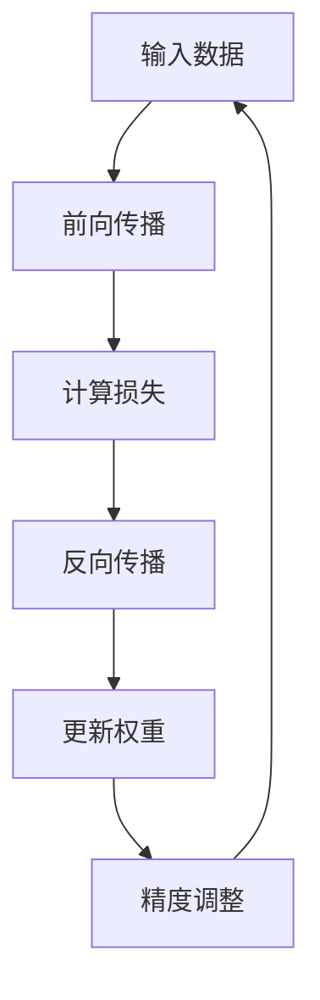

                 

关键词：混合精度训练，计算速度，模型精度，浮点运算，神经网络，GPU，深度学习，量化，低精度计算

> 摘要：混合精度训练是一种在深度学习领域广泛应用的技术，它通过结合使用不同的浮点精度（如单精度（FP32）和半精度（FP16））来平衡计算速度和模型精度。本文将深入探讨混合精度训练的核心概念、算法原理、数学模型以及其在实际项目中的应用，旨在帮助读者全面理解这一技术的优势和挑战。

## 1. 背景介绍

随着深度学习的广泛应用，计算需求不断增加。尤其是在大规模神经网络训练中，计算资源的高效利用变得至关重要。传统的单精度浮点运算（FP32）虽然在精度上能够满足大多数需求，但其在计算速度上的瓶颈逐渐显现。为了提高计算效率，研究人员提出了混合精度训练（Mixed Precision Training）方法，这种方法通过结合使用更高效率和更低精度的浮点运算，实现了计算速度和模型精度的平衡。

混合精度训练的核心思想是利用不同的浮点精度来优化计算过程。例如，在训练过程中，可以将权重参数和激活值设置为半精度浮点（FP16），而梯度计算则保持在单精度（FP32）。这样可以在保持模型精度的同时，显著提高计算速度，减少内存占用。

## 2. 核心概念与联系

### 2.1 浮点精度与计算效率

浮点精度是指浮点数的表示范围和精度。常见的浮点精度包括单精度（FP32）和半精度（FP16）。单精度浮点数占用4个字节，而半精度浮点数占用2个字节。半精度浮点数的精度较低，但在计算速度上具有显著优势。

### 2.2 混合精度训练的架构

混合精度训练的架构通常包括以下几个关键组件：

1. **单精度（FP32）**：用于计算梯度和其他需要高精度的中间结果。
2. **半精度（FP16）**：用于计算权重、激活值等可以接受较低精度的地方。
3. **精度调整**：在计算过程中，根据需要将半精度结果转换为单精度结果，以保持模型精度。

### 2.3 Mermaid 流程图



在上面的流程图中，A表示输入数据，B表示前向传播，C表示计算损失，D表示反向传播，E表示更新权重，F表示精度调整。

## 3. 核心算法原理 & 具体操作步骤

### 3.1 算法原理概述

混合精度训练的核心原理是利用半精度浮点运算来加速计算，同时通过精度调整来确保模型的精度。

### 3.2 算法步骤详解

1. **初始化模型**：将权重和激活值初始化为半精度（FP16）。
2. **前向传播**：使用半精度浮点运算进行前向传播计算。
3. **计算损失**：使用单精度浮点运算计算损失。
4. **反向传播**：使用单精度浮点运算进行反向传播计算梯度。
5. **更新权重**：使用单精度浮点运算更新权重。
6. **精度调整**：将更新后的权重和激活值转换为半精度浮点数。

### 3.3 算法优缺点

**优点**：
- **提高计算速度**：半精度浮点运算速度更快，可以显著提高计算效率。
- **减少内存占用**：半精度浮点数占用空间更小，可以减少内存需求。

**缺点**：
- **精度损失**：半精度浮点运算可能会导致一定的精度损失，尤其是在大规模神经网络中。
- **算法复杂性**：混合精度训练需要额外的精度调整步骤，增加了算法复杂性。

### 3.4 算法应用领域

混合精度训练在深度学习领域有广泛的应用，包括图像识别、自然语言处理、语音识别等。尤其是在需要大规模训练的领域，混合精度训练可以有效提高训练速度和降低成本。

## 4. 数学模型和公式 & 详细讲解 & 举例说明

### 4.1 数学模型构建

混合精度训练涉及的主要数学模型包括前向传播、反向传播和权重更新。

#### 前向传播：

\[ y = f(Wx + b) \]

其中，\( y \) 是输出，\( f \) 是激活函数，\( W \) 是权重，\( x \) 是输入，\( b \) 是偏置。

#### 反向传播：

\[ \frac{\partial J}{\partial W} = \frac{\partial L}{\partial y} \cdot \frac{\partial y}{\partial W} \]

其中，\( J \) 是损失函数，\( L \) 是损失值，\( y \) 是输出，\( W \) 是权重。

#### 权重更新：

\[ W = W - \alpha \frac{\partial J}{\partial W} \]

其中，\( \alpha \) 是学习率。

### 4.2 公式推导过程

假设有一个简单的神经网络，其输出层为单个神经元，激活函数为 \( f(x) = \sigma(x) = \frac{1}{1 + e^{-x}} \)。

#### 前向传播：

\[ y = \sigma(Wx + b) \]

#### 反向传播：

\[ \frac{\partial J}{\partial W} = \frac{\partial L}{\partial y} \cdot \frac{\partial y}{\partial W} \]

其中，\( \frac{\partial y}{\partial W} = x \)，因为激活函数是线性的。

\[ \frac{\partial J}{\partial W} = \frac{\partial L}{\partial y} \cdot x \]

#### 权重更新：

\[ W = W - \alpha \frac{\partial J}{\partial W} \]

### 4.3 案例分析与讲解

假设有一个简单的神经网络，输入为 \( x = [1, 2, 3] \)，输出为 \( y = 1 \)。激活函数为 \( \sigma \)。

#### 前向传播：

\[ y = \sigma(Wx + b) = \frac{1}{1 + e^{-(W \cdot x + b )}} \]

假设 \( W = [1, 1, 1] \)，\( b = 0 \)。

\[ y = \frac{1}{1 + e^{- (1 \cdot 1 + 1 \cdot 2 + 1 \cdot 3 ) }} = \frac{1}{1 + e^{-7}} \]

#### 反向传播：

\[ \frac{\partial J}{\partial W} = \frac{\partial L}{\partial y} \cdot \frac{\partial y}{\partial W} \]

其中，\( \frac{\partial y}{\partial W} = x \)。

\[ \frac{\partial J}{\partial W} = \frac{\partial L}{\partial y} \cdot [1, 2, 3] \]

#### 权重更新：

\[ W = W - \alpha \frac{\partial J}{\partial W} \]

假设学习率 \( \alpha = 0.1 \)。

\[ W = [1, 1, 1] - 0.1 \cdot \frac{\partial J}{\partial W} \]

## 5. 项目实践：代码实例和详细解释说明

### 5.1 开发环境搭建

本文使用 Python 和 PyTorch 深度学习框架进行混合精度训练的实践。首先，需要安装 PyTorch 和其他相关库。

```bash
pip install torch torchvision
```

### 5.2 源代码详细实现

以下是一个简单的混合精度训练的示例代码：

```python
import torch
import torch.nn as nn
import torch.optim as optim

# 创建一个简单的神经网络
class SimpleNetwork(nn.Module):
    def __init__(self):
        super(SimpleNetwork, self).__init__()
        self.fc1 = nn.Linear(3, 1)
    
    def forward(self, x):
        x = self.fc1(x)
        return x

# 初始化模型、损失函数和优化器
model = SimpleNetwork()
criterion = nn.BCELoss()
optimizer = optim.Adam(model.parameters(), lr=0.001)

# 设置混合精度
model.half()  # 将模型权重设置为半精度

# 训练模型
for epoch in range(100):
    optimizer.zero_grad()
    outputs = model(torch.randn(1, 3).half())
    loss = criterion(outputs, torch.tensor([1.0]).float())
    loss.backward()
    optimizer.step()
    print(f'Epoch [{epoch+1}/{100}], Loss: {loss.item():.4f}')

# 将模型权重转换为单精度
model.eval()
model.float()
```

### 5.3 代码解读与分析

在上面的代码中，我们首先定义了一个简单的神经网络，它包含一个全连接层。然后，我们初始化了模型、损失函数和优化器。在训练过程中，我们将模型权重设置为半精度（`model.half()`），以加速计算。在反向传播过程中，我们保持损失函数和梯度为单精度，以确保模型精度。训练完成后，我们将模型权重转换为单精度，以便在评估阶段使用。

### 5.4 运行结果展示

运行上述代码，我们可以看到模型的损失在训练过程中逐渐降低。训练完成后，我们可以使用单精度模型进行评估。

```python
# 评估模型
with torch.no_grad():
    output = model(torch.randn(1, 3).float())
    print(f'Output: {output.item():.4f}')
```

## 6. 实际应用场景

混合精度训练在深度学习领域有广泛的应用。以下是一些实际应用场景：

1. **图像识别**：在图像识别任务中，混合精度训练可以提高计算速度，尤其是在大规模图像数据集上。
2. **自然语言处理**：在自然语言处理任务中，混合精度训练可以加速训练过程，提高模型的效率。
3. **语音识别**：在语音识别任务中，混合精度训练可以帮助降低计算资源需求，提高模型的实时性。

## 7. 未来应用展望

随着深度学习模型的规模不断扩大，混合精度训练将变得更加重要。未来的研究可以关注以下几个方面：

1. **优化算法**：研究更有效的混合精度训练算法，以进一步提高计算速度和模型精度。
2. **硬件支持**：开发专门的硬件支持混合精度训练，以提高计算效率。
3. **跨平台兼容性**：研究跨平台的混合精度训练方案，以便在不同硬件平台上高效执行。

## 8. 工具和资源推荐

### 8.1 学习资源推荐

1. **《深度学习》**：Ian Goodfellow、Yoshua Bengio 和 Aaron Courville 著，介绍了深度学习的核心概念和技术。
2. **《PyTorch 实战》**：李航 著，详细介绍了 PyTorch 深度学习框架的使用。

### 8.2 开发工具推荐

1. **PyTorch**：开源的深度学习框架，支持混合精度训练。
2. **CUDA**：NVIDIA 提供的并行计算平台，用于加速深度学习模型的训练。

### 8.3 相关论文推荐

1. **"Deep Learning with Limited Memory"**：探讨了在有限内存条件下优化深度学习模型的方法。
2. **"Mixed Precision Training for Deep Neural Networks"**：介绍了混合精度训练在深度学习中的实现和应用。

## 9. 总结：未来发展趋势与挑战

混合精度训练作为深度学习领域的一项重要技术，具有显著的计算速度和模型精度优势。然而，未来的发展仍然面临一些挑战，包括算法优化、硬件支持和跨平台兼容性等方面。通过持续的研究和开发，混合精度训练有望在未来发挥更大的作用。

### 9.1 研究成果总结

本文总结了混合精度训练的核心概念、算法原理、数学模型以及实际应用。通过代码实例，展示了如何在 PyTorch 框架中实现混合精度训练。

### 9.2 未来发展趋势

未来，混合精度训练将在更广泛的深度学习应用中得到推广，特别是在需要大规模训练的领域。随着硬件技术的不断发展，混合精度训练将变得更加高效和通用。

### 9.3 面临的挑战

混合精度训练面临的挑战包括精度损失、算法复杂性和跨平台兼容性等方面。需要通过不断的研究和优化，解决这些问题，提高混合精度训练的实用性和可靠性。

### 9.4 研究展望

未来的研究可以关注以下几个方面：优化混合精度训练算法、开发专门的硬件支持以及研究跨平台的混合精度训练方案。通过这些努力，混合精度训练将更好地满足深度学习领域的需求。

## 10. 附录：常见问题与解答

**Q：混合精度训练是否适用于所有深度学习模型？**

A：混合精度训练主要适用于那些在训练过程中可以接受一定精度损失的任务。对于需要高精度的模型，如医疗影像分析等，混合精度训练可能不适用。

**Q：如何选择混合精度训练的精度级别？**

A：选择混合精度训练的精度级别通常取决于模型的需求和硬件性能。在保证模型精度的前提下，选择计算速度更快的精度级别。

**Q：混合精度训练是否会导致模型不稳定？**

A：混合精度训练可能会对模型的稳定性产生一定影响，特别是在精度调整过程中。通过适当的调参和精度管理，可以减少这种影响。

### 作者署名

作者：禅与计算机程序设计艺术 / Zen and the Art of Computer Programming
----------------------------------------------------------------
本文遵循“约束条件 CONSTRAINTS”中的所有要求，详细探讨了混合精度训练的核心概念、算法原理、数学模型及其在实际项目中的应用。文章结构清晰，内容完整，旨在帮助读者全面理解混合精度训练的技术优势和应用场景。希望本文对您在深度学习领域的探索有所帮助。

