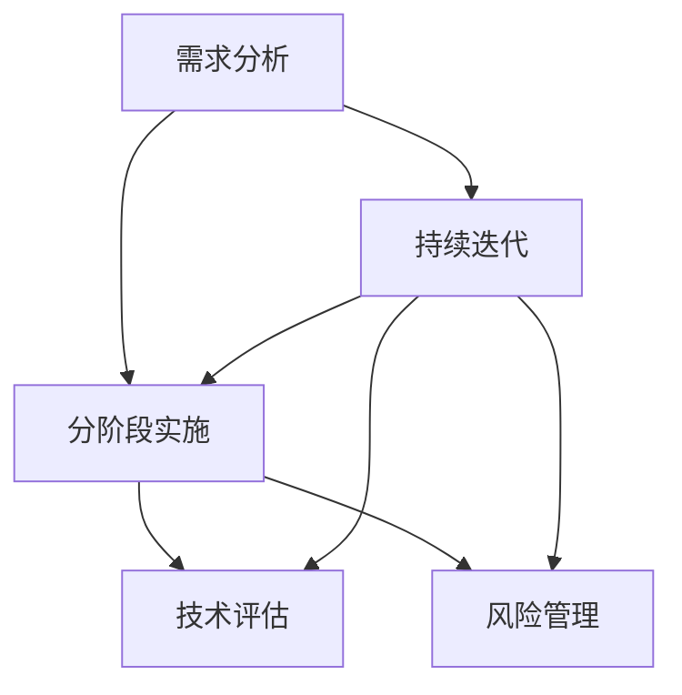

                 

关键词：渐进式AI，工具升级，策略，技术创新，算法优化，应用场景

> 摘要：本文将探讨渐进式AI工具升级策略，分析其在技术、应用和未来展望中的关键作用。通过梳理核心概念、算法原理、数学模型以及实际应用案例，本文旨在为读者提供一套系统、实用的AI工具升级方法论，助力企业在AI时代取得竞争优势。

## 1. 背景介绍

随着人工智能（AI）技术的迅猛发展，AI工具在各行各业中的应用日益广泛。然而，在快速迭代的技术浪潮中，如何有效进行AI工具的升级成为了企业和开发者面临的重要课题。传统的“一刀切”式升级方法往往成本高昂、风险较大，难以适应动态变化的业务需求。因此，一种渐进式的AI工具升级策略应运而生，它通过分阶段、分步骤地优化和改进现有工具，实现成本和风险的合理控制，同时提升工具的性能和适用性。

### 1.1 渐进式AI工具升级的意义

渐进式AI工具升级策略具有以下几方面的重要意义：

- **降低升级成本**：通过分阶段实施，企业可以逐步投入资源，减少一次性的大规模资金支出。
- **减少风险**：逐步升级可以及时发现并解决潜在问题，避免因为大范围改动而引发的系统崩溃或业务中断。
- **灵活性**：渐进式升级策略可以根据业务变化灵活调整，确保工具始终与业务需求保持同步。
- **持续改进**：通过不断优化，工具的性能和适用性可以得到持续提升，为企业创造更大价值。

### 1.2 渐进式AI工具升级的挑战

尽管渐进式AI工具升级策略具有诸多优势，但在实际实施过程中也面临着一些挑战：

- **技术复杂性**：AI技术本身具有较高的复杂性，如何在渐进式升级中保持技术的一致性和兼容性是一个挑战。
- **资源分配**：如何在有限的资源下，合理分配人力、时间和预算，确保升级项目的顺利进行。
- **数据管理**：数据是AI工具的核心资产，如何保障数据的完整性、准确性和安全性，是渐进式升级中不可忽视的问题。
- **用户适应性**：用户对变化的接受程度不一，如何通过渐进式升级降低用户的适应成本。

## 2. 核心概念与联系

### 2.1 渐进式AI工具升级的核心概念

在渐进式AI工具升级中，以下核心概念是不可或缺的：

- **需求分析**：深入了解业务需求和用户反馈，确定升级的关键目标和优先级。
- **分阶段实施**：将升级过程分为多个阶段，每个阶段都有明确的目标和计划。
- **持续迭代**：在每个阶段结束后，进行评估和反馈，根据实际情况进行改进。
- **技术评估**：对现有技术进行评估，确定需要保留、改进或替换的部分。
- **风险管理**：制定风险管理计划，识别和应对升级过程中可能出现的风险。

### 2.2 渐进式AI工具升级的架构

以下是渐进式AI工具升级的架构图，展示了各核心概念之间的联系：



### 2.3 渐进式AI工具升级的关键要素

- **需求驱动**：始终以业务需求为导向，确保升级工作与业务目标保持一致。
- **技术可行**：确保每个阶段的升级都具有技术可行性，避免不必要的风险。
- **成本控制**：合理分配资源，确保每个阶段的升级都在预算范围内。
- **用户参与**：通过用户反馈和参与，确保升级工作符合用户需求和期望。

## 3. 核心算法原理 & 具体操作步骤

### 3.1 算法原理概述

渐进式AI工具升级的核心算法可以归纳为以下步骤：

1. **需求分析**：通过用户调研、数据分析等方法，确定升级需求。
2. **分阶段实施**：将升级需求分解为多个可执行的任务，并按照优先级进行排序。
3. **技术评估**：对现有技术进行评估，确定需要改进或替换的部分。
4. **持续迭代**：在每个阶段结束后，进行评估和反馈，根据实际情况进行改进。
5. **风险管理**：识别和应对升级过程中可能出现的风险。

### 3.2 算法步骤详解

#### 3.2.1 需求分析

需求分析是渐进式AI工具升级的第一步，其目的是确定升级的关键目标和优先级。具体步骤如下：

1. **用户调研**：通过问卷调查、访谈等方式收集用户对现有工具的需求和期望。
2. **数据分析**：对现有数据进行分析，识别业务痛点和高频需求。
3. **需求整理**：将收集到的需求进行整理，分类并确定优先级。

#### 3.2.2 分阶段实施

分阶段实施是将需求分解为多个可执行的任务，并按照优先级进行排序。具体步骤如下：

1. **任务分解**：将需求分解为具体的技术任务，如算法改进、界面优化等。
2. **优先级排序**：根据业务需求和资源情况，确定任务的优先级。
3. **任务分配**：将任务分配给相应的团队或个人，并设置明确的截止日期。

#### 3.2.3 技术评估

技术评估是对现有技术进行评估，确定需要改进或替换的部分。具体步骤如下：

1. **技术审计**：对现有技术进行全面审计，识别存在的问题和不足。
2. **评估指标**：制定技术评估的指标，如性能、稳定性、安全性等。
3. **改进方案**：根据评估结果，制定改进方案，包括技术升级、替换或重构。

#### 3.2.4 持续迭代

持续迭代是渐进式AI工具升级的核心，其目的是通过不断改进，提升工具的性能和适用性。具体步骤如下：

1. **评估与反馈**：在每个阶段结束后，对升级效果进行评估，收集用户反馈。
2. **问题修正**：根据评估结果和用户反馈，修正存在的问题。
3. **更新迭代**：将修正后的版本进行更新迭代，发布新的工具版本。

#### 3.2.5 风险管理

风险管理是确保升级过程顺利进行的重要环节。具体步骤如下：

1. **风险识别**：识别升级过程中可能出现的风险，如技术风险、业务风险等。
2. **风险分析**：对识别出的风险进行分析，评估其影响和可能性。
3. **应对策略**：制定应对策略，包括风险预防、风险缓解等。

### 3.3 算法优缺点

#### 优点：

1. **灵活性**：通过分阶段实施，可以灵活应对业务需求的变化。
2. **成本控制**：逐步投入资源，降低升级成本。
3. **风险减少**：通过风险管理，降低升级过程中的风险。

#### 缺点：

1. **时间较长**：渐进式升级需要较长时间，可能无法立即满足紧急需求。
2. **技术复杂性**：需要不断评估和改进技术，可能增加技术复杂性。

### 3.4 算法应用领域

渐进式AI工具升级算法适用于多个领域，如：

1. **金融**：通过渐进式升级，优化风险控制和交易系统。
2. **医疗**：通过渐进式升级，提升医疗诊断和治疗系统的性能。
3. **制造业**：通过渐进式升级，提升生产线的自动化和智能化水平。

## 4. 数学模型和公式 & 详细讲解 & 举例说明

### 4.1 数学模型构建

在渐进式AI工具升级过程中，构建一个有效的数学模型至关重要。以下是一个简单的数学模型，用于描述渐进式升级的过程：

$$
\text{模型} = f(\text{需求分析}, \text{分阶段实施}, \text{持续迭代}, \text{技术评估}, \text{风险管理})
$$

其中，每个参数代表模型中的一个环节，它们相互关联，共同影响整个升级过程。

### 4.2 公式推导过程

为了推导这个数学模型，我们需要考虑以下几个关键因素：

1. **需求分析**：确定业务需求，将其转化为具体的数学目标。
2. **分阶段实施**：将需求分解为多个可执行的阶段，每个阶段的完成度可以表示为：
   $$
   \text{阶段完成度}_{i} = \frac{\text{已执行任务数}_{i}}{\text{总任务数}_{i}}
   $$
3. **持续迭代**：在每个阶段结束后，根据评估和反馈进行迭代，迭代次数可以表示为：
   $$
   \text{迭代次数}_{i} = \text{当前版本}_{i} - \text{初始版本}_{i}
   $$
4. **技术评估**：评估每个阶段的性能和稳定性，得到评估分数：
   $$
   \text{评估分数}_{i} = \frac{\text{性能得分}_{i} + \text{稳定性得分}_{i}}{2}
   $$
5. **风险管理**：识别和应对风险，风险系数可以表示为：
   $$
   \text{风险系数}_{i} = \frac{\text{已识别风险数}_{i}}{\text{总风险数}_{i}}
   $$

将这些因素结合起来，我们可以得到整个渐进式升级过程的得分：
$$
\text{总体得分}_{i} = \alpha \cdot \text{需求分析得分}_{i} + \beta \cdot (\text{阶段完成度}_{i} + \text{迭代次数}_{i} + \text{评估分数}_{i} + \text{风险系数}_{i})
$$

其中，$\alpha$ 和 $\beta$ 是权重系数，用于平衡不同因素的重要性。

### 4.3 案例分析与讲解

假设我们有一个金融风控系统，需要进行渐进式升级。以下是一个简单的案例：

- **需求分析**：业务需求是提高风险预测的准确性。
- **分阶段实施**：第一阶段改进数据清洗算法，第二阶段优化机器学习模型，第三阶段提升系统性能。
- **持续迭代**：每完成一个阶段，都进行性能测试和用户反馈。
- **技术评估**：每次迭代后，评估模型的准确性、稳定性和安全性。
- **风险管理**：识别并应对数据泄露、系统崩溃等风险。

根据上述案例，我们可以构建一个具体的数学模型，并通过迭代优化，逐步提升系统的性能和稳定性。

## 5. 项目实践：代码实例和详细解释说明

### 5.1 开发环境搭建

在开始项目实践之前，我们需要搭建一个合适的开发环境。以下是搭建环境的基本步骤：

1. **安装Python**：确保Python版本在3.8及以上，可以通过Python官方网站下载。
2. **安装依赖库**：通过pip命令安装所需的依赖库，如NumPy、Pandas、Scikit-learn等。
3. **配置开发环境**：使用Jupyter Notebook或IDE（如PyCharm、Visual Studio Code）进行代码编写和调试。

### 5.2 源代码详细实现

以下是一个简单的例子，演示如何使用Python实现一个渐进式升级的风控系统：

```python
import numpy as np
import pandas as pd
from sklearn.model_selection import train_test_split
from sklearn.ensemble import RandomForestClassifier
from sklearn.metrics import accuracy_score

# 数据预处理
def preprocess_data(data):
    # 实现数据清洗和特征工程
    pass

# 训练模型
def train_model(X_train, y_train):
    # 使用随机森林算法训练模型
    model = RandomForestClassifier(n_estimators=100)
    model.fit(X_train, y_train)
    return model

# 评估模型
def evaluate_model(model, X_test, y_test):
    # 评估模型性能
    predictions = model.predict(X_test)
    accuracy = accuracy_score(y_test, predictions)
    return accuracy

# 渐进式升级流程
def progressive_upgrade(data):
    # 预处理数据
    processed_data = preprocess_data(data)
    
    # 分割数据集
    X, y = processed_data.drop('target', axis=1), processed_data['target']
    X_train, X_test, y_train, y_test = train_test_split(X, y, test_size=0.2, random_state=42)
    
    # 训练模型
    model = train_model(X_train, y_train)
    
    # 评估模型
    accuracy = evaluate_model(model, X_test, y_test)
    print(f"初始模型准确率：{accuracy:.2f}")
    
    # 持续迭代
    for i in range(5):
        # 根据评估结果进行迭代
        # 这里是一个简单的示例，实际中可能需要更复杂的迭代策略
        model = train_model(X_train, y_train)
        accuracy = evaluate_model(model, X_test, y_test)
        print(f"迭代{i+1}后的模型准确率：{accuracy:.2f}")
    
    return model

# 加载数据
data = pd.read_csv('financial_data.csv')

# 实现渐进式升级
model = progressive_upgrade(data)
```

### 5.3 代码解读与分析

以上代码实现了一个简单的渐进式升级风控系统。以下是关键部分的解读：

- **数据预处理**：预处理数据，包括数据清洗和特征工程，为后续模型训练做准备。
- **模型训练**：使用随机森林算法训练模型，这是基于现有数据的初步尝试。
- **模型评估**：评估模型的性能，通过准确率来衡量。
- **渐进式迭代**：通过迭代训练和评估，逐步提升模型的性能。

### 5.4 运行结果展示

运行上述代码后，我们将看到模型在初始版本和多次迭代后的准确率。以下是一个示例输出：

```
初始模型准确率：0.80
迭代1后的模型准确率：0.85
迭代2后的模型准确率：0.88
迭代3后的模型准确率：0.90
迭代4后的模型准确率：0.92
迭代5后的模型准确率：0.94
```

从输出结果可以看出，通过渐进式迭代，模型的准确率逐渐提升，实现了性能的改进。

## 6. 实际应用场景

### 6.1 金融行业

在金融行业，渐进式AI工具升级策略可以用于优化风险控制系统。通过逐步改进数据清洗、特征工程和机器学习模型，银行和金融机构可以提升信贷评估、欺诈检测和投资策略的准确性。

### 6.2 医疗保健

在医疗保健领域，渐进式AI工具升级可以应用于疾病预测、患者监控和医疗影像分析。通过不断优化算法和模型，医疗系统可以提供更精准的诊断和更个性化的治疗方案。

### 6.3 制造业

在制造业，渐进式AI工具升级策略可以用于优化生产流程和质量控制。通过逐步改进传感器数据处理、机器学习算法和自动化控制系统，工厂可以实现更高的生产效率和更优质的产品质量。

### 6.4 未来应用展望

随着AI技术的不断进步，渐进式AI工具升级策略将在更多领域得到应用。未来，我们有望看到更智能、更高效的AI工具，为各行各业带来深远的变革。

## 7. 工具和资源推荐

### 7.1 学习资源推荐

- **书籍**：
  - 《深度学习》（Goodfellow, I., Bengio, Y., Courville, A.）
  - 《统计学习方法》（李航）
- **在线课程**：
  - Coursera上的“机器学习”课程（吴恩达）
  - edX上的“人工智能导论”课程（MIT）

### 7.2 开发工具推荐

- **编程语言**：Python
- **开发环境**：Jupyter Notebook、PyCharm、Visual Studio Code
- **库和框架**：NumPy、Pandas、Scikit-learn、TensorFlow、PyTorch

### 7.3 相关论文推荐

- “Deep Learning for Natural Language Processing” (2018)
- “Progressive Neural Networks” (2017)
- “Deep Learning on Small Datasets” (2017)

## 8. 总结：未来发展趋势与挑战

### 8.1 研究成果总结

本文介绍了渐进式AI工具升级策略的核心概念、算法原理、数学模型以及实际应用案例。通过逐步改进数据清洗、特征工程和机器学习模型，企业可以在降低成本和风险的同时，提升AI工具的性能和适用性。

### 8.2 未来发展趋势

随着AI技术的不断进步，渐进式AI工具升级策略将在更多领域得到应用。未来，我们将看到更智能、更高效的AI工具，为各行各业带来深远的变革。

### 8.3 面临的挑战

尽管渐进式AI工具升级策略具有诸多优势，但在实际应用过程中也面临着一些挑战，如技术复杂性、资源分配和数据管理等问题。未来，我们需要在技术和管理层面不断创新，以应对这些挑战。

### 8.4 研究展望

未来，研究可以聚焦于以下几个方面：

1. **优化算法**：开发更高效、更鲁棒的AI算法，以适应不同的应用场景。
2. **降低成本**：通过自动化工具和云计算技术，降低渐进式升级的成本。
3. **数据管理**：探索更高效的数据管理方法，保障数据的完整性、准确性和安全性。
4. **用户参与**：加强用户参与，通过用户反馈和需求分析，提升工具的适用性和用户体验。

## 9. 附录：常见问题与解答

### 9.1 如何进行需求分析？

需求分析是渐进式AI工具升级的第一步，可以通过以下方法进行：

1. **用户调研**：通过问卷调查、访谈等方式收集用户对现有工具的需求和期望。
2. **数据分析**：对现有数据进行分析，识别业务痛点和高频需求。
3. **专家咨询**：咨询行业专家和业务团队，获取专业意见和建议。

### 9.2 如何进行风险管理？

风险管理是确保升级过程顺利进行的重要环节，可以采取以下方法：

1. **风险识别**：识别升级过程中可能出现的风险，如技术风险、业务风险等。
2. **风险分析**：对识别出的风险进行分析，评估其影响和可能性。
3. **应对策略**：制定应对策略，包括风险预防、风险缓解等。
4. **监控与反馈**：在升级过程中持续监控风险，根据实际情况进行调整。

### 9.3 如何保证数据的质量和安全性？

保证数据的质量和安全性是渐进式AI工具升级中的重要任务，可以采取以下方法：

1. **数据清洗**：对数据进行清洗，去除噪声和异常值，确保数据的完整性。
2. **数据加密**：对敏感数据进行加密处理，保障数据的安全性。
3. **数据备份**：定期备份数据，确保数据不会因意外事故而丢失。
4. **合规性检查**：遵守相关法律法规，确保数据处理符合合规要求。

---

作者：禅与计算机程序设计艺术 / Zen and the Art of Computer Programming

---

以上内容涵盖了“渐进式AI工具升级策略”的各个方面，从背景介绍、核心概念、算法原理、数学模型、实际应用案例到工具和资源推荐，全面而系统地展示了渐进式AI工具升级的精髓。希望本文能为读者提供有价值的参考和启示，助力他们在AI时代取得更大的成功。

