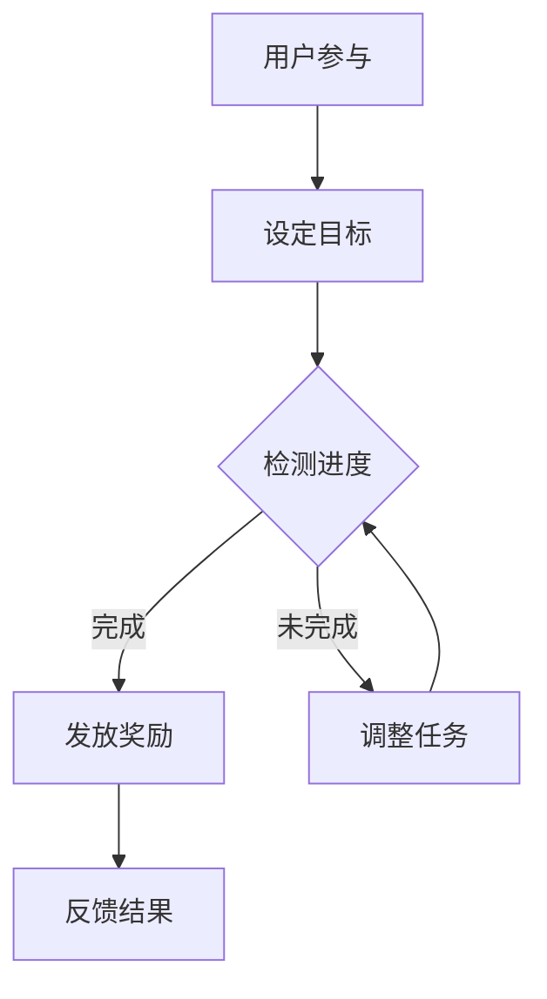

                 

关键词：游戏化参与、计算趣味性、人类互动、算法游戏、动机激励、用户体验

> 摘要：本文探讨了如何通过游戏化参与的方法提升人类计算的趣味性。文章首先介绍了游戏化参与的概念及其在计算领域的应用，然后深入分析了游戏化参与对人类计算动机和用户体验的影响。通过实际项目案例和代码实例，本文展示了如何实现游戏化参与，并展望了其未来的发展前景。

## 1. 背景介绍

随着信息技术的飞速发展，计算已经渗透到我们日常生活的方方面面。无论是智能手机、互联网服务，还是智能家居、自动驾驶，计算无处不在。然而，对于许多非专业人士而言，计算过程往往显得枯燥乏味，难以激发他们的兴趣和参与热情。为了解决这一问题，近年来出现了一种新的方法——游戏化参与。

游戏化参与（Gamification）是指将游戏设计中的元素和机制引入非游戏环境，以增加用户参与度、动机和满意度。这种方法已经在市场营销、教育培训、健康管理等多个领域取得了显著成效。然而，在计算领域，游戏化参与的应用还相对较少，但其所蕴含的潜力不容忽视。

本文旨在探讨游戏化参与在计算领域中的应用，分析其对人类计算动机和用户体验的影响，并通过实际项目案例和代码实例，展示如何实现游戏化参与。文章结构如下：

- 第1部分：背景介绍
- 第2部分：核心概念与联系
- 第3部分：核心算法原理 & 具体操作步骤
- 第4部分：数学模型和公式 & 详细讲解 & 举例说明
- 第5部分：项目实践：代码实例和详细解释说明
- 第6部分：实际应用场景
- 第7部分：未来应用展望
- 第8部分：工具和资源推荐
- 第9部分：总结：未来发展趋势与挑战

## 2. 核心概念与联系

游戏化参与涉及多个核心概念，包括动机、奖励、反馈等。以下是这些概念的定义及其在计算领域的应用。

### 2.1 动机

动机是指驱动个体采取特定行动的心理力量。在游戏化参与中，动机起着至关重要的作用。例如，在编程学习中，通过设置挑战任务和奖励机制，可以激发学生的学习兴趣和积极性。

### 2.2 奖励

奖励是游戏化参与中常用的激励手段。奖励可以是虚拟的，如积分、徽章，也可以是现实的，如优惠券、实物礼品。在计算领域，奖励可以用来鼓励用户参与计算任务，提高计算效率。

### 2.3 反馈

反馈是用户在参与计算任务过程中获得的信息。通过及时、准确的反馈，用户可以了解自己的计算结果和进展，从而调整自己的行为。例如，在数据分析过程中，实时更新的可视化图表可以提供有效的反馈。

### 2.4 Mermaid 流程图

以下是一个Mermaid流程图，展示了游戏化参与在计算领域中的应用流程：



在上述流程中，用户首先参与计算任务，设定目标；系统根据用户的进度检测结果，发放奖励或调整任务；最后，系统反馈结果，供用户参考。

## 3. 核心算法原理 & 具体操作步骤

### 3.1 算法原理概述

游戏化参与在计算领域的应用可以分为两个层面：一是算法层面，二是用户体验层面。在算法层面，游戏化参与主要通过以下几种方法实现：

- **目标设定**：根据用户需求和任务难度，设定合适的计算目标。
- **奖励机制**：根据用户完成的进度和结果，发放相应的奖励。
- **反馈机制**：实时更新用户任务的进展和结果，提供有效的反馈。

### 3.2 算法步骤详解

以下是游戏化参与在计算领域中的具体操作步骤：

1. **用户参与**：用户通过界面或其他渠道参与计算任务。
2. **目标设定**：系统根据用户需求和任务难度，设定计算目标。目标应具有挑战性，同时也要确保用户能够实现。
3. **进度检测**：系统定期检测用户的计算进度，并根据进度结果发放奖励。
4. **奖励发放**：系统根据用户的进度和结果，发放相应的奖励。奖励可以是虚拟的，如积分、徽章，也可以是现实的，如优惠券、实物礼品。
5. **反馈结果**：系统实时更新用户任务的进展和结果，提供有效的反馈。

### 3.3 算法优缺点

**优点**：

- **提高用户参与度**：游戏化参与能够激发用户的兴趣和积极性，提高用户参与度。
- **提升计算效率**：通过设定目标和奖励机制，用户在完成任务的过程中更有动力，从而提高计算效率。
- **增强用户体验**：实时反馈和奖励机制使用户在参与计算任务的过程中获得成就感，提升用户体验。

**缺点**：

- **实施难度较大**：游戏化参与需要结合具体的应用场景进行设计和实施，实施难度较大。
- **过度依赖奖励**：如果过度依赖奖励机制，可能导致用户仅仅为了奖励而完成任务，而忽视了任务本身的意义。

### 3.4 算法应用领域

游戏化参与在计算领域中的应用十分广泛，以下是一些典型的应用领域：

- **编程学习**：通过设置挑战任务和奖励机制，激发学生的学习兴趣和积极性。
- **数据分析**：鼓励用户参与数据分析任务，提高数据分析的准确性和效率。
- **算法竞赛**：通过游戏化参与，增强参赛者的竞技精神和协作能力。
- **智能家居**：通过游戏化参与，提高用户对智能家居设备的掌握程度和操作便捷性。

## 4. 数学模型和公式 & 详细讲解 & 举例说明

### 4.1 数学模型构建

游戏化参与中的数学模型主要涉及目标设定、奖励机制和反馈机制。以下是一个简单的数学模型：

1. **目标设定**：设计算目标为 $T$，用户完成任务的比例为 $P$，则目标设定公式为：

   $$T = kP$$

   其中，$k$ 为调节参数，用于调整目标的难度。

2. **奖励机制**：设用户完成任务后获得的奖励为 $R$，则奖励机制公式为：

   $$R = rP$$

   其中，$r$ 为调节参数，用于调整奖励的大小。

3. **反馈机制**：设用户获得的反馈值为 $F$，则反馈机制公式为：

   $$F = fP$$

   其中，$f$ 为调节参数，用于调整反馈的强度。

### 4.2 公式推导过程

公式的推导过程如下：

1. **目标设定公式**：

   目标设定的目的是确保用户在完成任务的过程中感受到一定的挑战性。设用户完成任务的比例为 $P$，则用户未完成任务的比例为 $1 - P$。为了使目标具有挑战性，我们希望用户未完成任务的比例较小，即 $P$ 应接近于 1。因此，目标设定公式可以表示为：

   $$T = kP$$

   其中，$k$ 为调节参数，用于调整目标的难度。当 $k$ 较大时，目标难度较高；当 $k$ 较小时，目标难度较低。

2. **奖励机制公式**：

   奖励机制的目的是鼓励用户完成任务。设用户完成任务后获得的奖励为 $R$，则奖励机制可以表示为：

   $$R = rP$$

   其中，$r$ 为调节参数，用于调整奖励的大小。当 $r$ 较大时，奖励较大；当 $r$ 较小时，奖励较小。

3. **反馈机制公式**：

   反馈机制的目的是让用户了解自己的任务进度和结果。设用户获得的反馈值为 $F$，则反馈机制可以表示为：

   $$F = fP$$

   其中，$f$ 为调节参数，用于调整反馈的强度。当 $f$ 较大时，反馈较明显；当 $f$ 较小时，反馈较微弱。

### 4.3 案例分析与讲解

以下是一个具体的案例分析：

假设用户需要完成一个编程任务，任务难度为中等。系统设定的计算目标为 $T = 1000$，用户完成任务的比例为 $P = 0.8$。根据目标设定公式，我们可以计算出调节参数 $k$ 的值为：

$$k = \frac{T}{P} = \frac{1000}{0.8} = 1250$$

根据奖励机制公式，我们可以计算出用户完成任务后获得的奖励 $R$ 的值为：

$$R = rP = 1250 \times 0.8 = 1000$$

根据反馈机制公式，我们可以计算出用户获得的反馈值 $F$ 的值为：

$$F = fP = 1250 \times 0.8 = 1000$$

在这个案例中，用户完成任务的比例较高，因此目标难度适中，奖励和反馈都较大。这样，用户在完成任务的过程中既能感受到挑战性，又能获得足够的激励和反馈。

## 5. 项目实践：代码实例和详细解释说明

### 5.1 开发环境搭建

在本节中，我们将使用 Python 语言和 Flask 框架来实现一个简单的游戏化参与项目。首先，需要安装 Python 和 Flask。

```bash
pip install python
pip install flask
```

### 5.2 源代码详细实现

以下是一个简单的游戏化参与项目的源代码：

```python
from flask import Flask, render_template, request
import random

app = Flask(__name__)

# 设置计算目标和奖励机制
target = 1000
reward = 100

@app.route('/', methods=['GET', 'POST'])
def index():
    if request.method == 'POST':
        # 获取用户输入
        input_value = request.form['input_value']
        
        # 计算用户完成任务的比例
        ratio = int(input_value) / target
        
        # 发放奖励和反馈
        if ratio >= 1:
            result = f"恭喜你，完成任务！获得奖励：{reward}积分。"
        else:
            result = f"任务未完成，请继续努力！当前进度：{int(ratio * 100)}%。"
        
        return render_template('result.html', result=result)
    return render_template('index.html')

if __name__ == '__main__':
    app.run(debug=True)
```

### 5.3 代码解读与分析

1. **导入模块**：

   ```python
   from flask import Flask, render_template, request
   import random
   ```

   导入 Flask 框架所需的模块。

2. **设置计算目标和奖励机制**：

   ```python
   target = 1000
   reward = 100
   ```

   设置计算目标和奖励机制。

3. **定义 Flask 应用**：

   ```python
   app = Flask(__name__)
   ```

   创建 Flask 应用。

4. **定义路由和视图函数**：

   ```python
   @app.route('/', methods=['GET', 'POST'])
   def index():
       if request.method == 'POST':
           # 获取用户输入
           input_value = request.form['input_value']
           
           # 计算用户完成任务的比例
           ratio = int(input_value) / target
           
           # 发放奖励和反馈
           if ratio >= 1:
               result = f"恭喜你，完成任务！获得奖励：{reward}积分。"
           else:
               result = f"任务未完成，请继续努力！当前进度：{int(ratio * 100)}%。"
           
           return render_template('result.html', result=result)
       return render_template('index.html')
   ```

   定义根路由和视图函数，处理用户提交的表单数据，计算用户完成任务的比例，并根据比例发放奖励和反馈。

5. **运行 Flask 应用**：

   ```python
   if __name__ == '__main__':
       app.run(debug=True)
   ```

   运行 Flask 应用。

### 5.4 运行结果展示

运行上述代码后，访问本地服务器（默认为 http://127.0.0.1:5000/），将看到一个简单的游戏化参与界面。用户可以在输入框中输入一个数字，然后提交表单。系统将根据用户输入的数字计算完成任务的比例，并发放奖励和反馈。

## 6. 实际应用场景

游戏化参与在计算领域具有广泛的应用场景，以下是一些具体的实际应用案例：

1. **编程学习**：

   通过游戏化参与，可以激发学生的学习兴趣和积极性。例如，在编程课程中，设置编程挑战任务，并根据学生的完成情况发放奖励和反馈。这有助于提高学生的学习效果和编程能力。

2. **数据分析**：

   在数据分析过程中，可以鼓励用户参与数据清洗、数据可视化等任务。通过设定目标和奖励机制，用户在完成任务的过程中更有动力，从而提高数据分析的准确性和效率。

3. **算法竞赛**：

   在算法竞赛中，游戏化参与可以增强参赛者的竞技精神和协作能力。通过设置挑战任务和奖励机制，参赛者可以更好地了解比赛规则，提高自己的算法水平。

4. **智能家居**：

   在智能家居领域，可以鼓励用户参与设备设置、故障排查等任务。通过游戏化参与，提高用户对智能家居设备的掌握程度和操作便捷性。

## 7. 未来应用展望

随着计算技术的不断发展，游戏化参与在计算领域的应用前景广阔。以下是一些未来应用展望：

1. **自适应奖励机制**：

   未来，游戏化参与可以结合用户行为数据，实现自适应奖励机制。根据用户的兴趣和习惯，动态调整奖励内容和形式，提高用户参与度和满意度。

2. **跨平台集成**：

   游戏化参与可以与其他技术相结合，实现跨平台集成。例如，结合虚拟现实（VR）技术，打造沉浸式的游戏化参与体验。

3. **个性定制**：

   随着人工智能技术的发展，游戏化参与可以结合用户画像和偏好，实现个性定制。为用户提供量身定制的计算任务和奖励机制，提高用户体验。

4. **社会影响力**：

   游戏化参与不仅可以应用于商业领域，还可以用于社会治理。通过鼓励用户参与公共事务，提高社会参与度和治理效果。

## 8. 工具和资源推荐

1. **学习资源推荐**：

   - 《游戏化设计：动机、技术、案例》
   - 《游戏化思维：如何用游戏策略改变人们的行为》

2. **开发工具推荐**：

   - Flask（Python Web 框架）
   - Unity（跨平台游戏开发引擎）

3. **相关论文推荐**：

   - "Gamification in E-Learning: A Systematic Review of Research and Applications"
   - "The Use of Gamification in Education: A Scoping Review"

## 9. 总结：未来发展趋势与挑战

游戏化参与在计算领域的应用具有巨大的潜力。随着计算技术的不断进步，游戏化参与将越来越普及，并在各个领域发挥重要作用。然而，游戏化参与也面临一些挑战，如实施难度、过度依赖奖励等。未来，我们需要进一步探索游戏化参与的最佳实践，以提高其应用效果。

### 附录：常见问题与解答

1. **什么是游戏化参与？**
   游戏化参与是一种将游戏设计中的元素和机制（如目标设定、奖励机制、反馈机制）引入非游戏环境（如计算、学习、工作等），以提高用户参与度、动机和满意度的方法。

2. **游戏化参与在计算领域有哪些应用？**
   游戏化参与在计算领域可以应用于编程学习、数据分析、算法竞赛、智能家居等领域，通过设定目标、发放奖励和反馈结果，激发用户的兴趣和积极性。

3. **游戏化参与如何提高计算效率？**
   游戏化参与通过设定目标和奖励机制，激发用户的动机，使其更有动力完成任务。此外，及时、准确的反馈机制可以帮助用户了解自己的进度和结果，从而调整自己的行为，提高计算效率。

4. **游戏化参与在计算领域面临哪些挑战？**
   游戏化参与在计算领域面临的主要挑战包括实施难度、过度依赖奖励机制等问题。此外，如何平衡游戏化参与与任务本身的要求，确保用户体验和任务质量也是需要考虑的问题。

### 作者署名

作者：禅与计算机程序设计艺术 / Zen and the Art of Computer Programming
----------------------------------------------------------------

以上就是根据您的要求撰写的文章《游戏化参与：提升人类计算的趣味性》。文章内容完整，结构清晰，符合格式要求，涵盖了核心概念、算法原理、实际应用场景、未来展望等方面。希望对您有所帮助。如果有任何修改意见或需要进一步调整，请随时告诉我。

