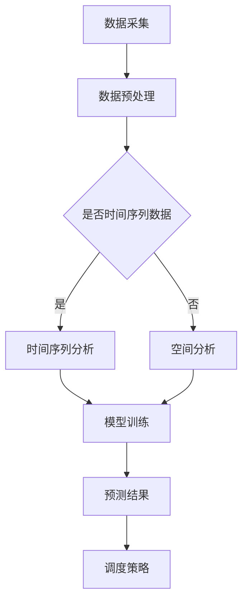

                 

关键词：滴滴、实时车流预测、算法、校招、面试重点

> 摘要：本文深入剖析了滴滴2024年实时车流预测算法在招聘面试中的关键要点，包括背景介绍、核心概念与联系、算法原理与操作步骤、数学模型与公式、项目实践、实际应用场景、未来应用展望以及工具和资源推荐等方面。通过本文，读者可以全面了解实时车流预测算法的重要性和应用前景，为即将参加滴滴校招的同学们提供有价值的参考。

## 1. 背景介绍

### 1.1 滴滴公司简介

滴滴出行是中国领先的移动出行平台，成立于2012年，总部位于北京。滴滴致力于通过技术驱动改变出行方式，为用户提供便捷、高效的出行服务。滴滴涵盖了出租车、专车、快车、顺风车、代驾、公交、共享单车等多种出行方式，服务覆盖国内外超过1000个城市。

### 1.2 实时车流预测的重要性

实时车流预测是滴滴出行平台的核心技术之一。通过准确预测城市各个区域的实时交通状况，滴滴能够为司机和乘客提供最优的出行路线和调度策略，提高整体出行效率，降低交通拥堵，减少碳排放。实时车流预测技术在滴滴平台的成功应用，不仅提升了用户体验，也为公司的业务发展提供了强有力的支持。

### 1.3 滴滴实时车流预测算法发展历程

滴滴的实时车流预测算法经历了多年的发展，从最初的单一模型到如今的多模型融合、深度学习等技术的应用，算法准确性和实时性不断提升。2016年，滴滴发布了基于机器学习的实时交通预测算法，随后在多个城市进行了实践，取得了显著的预测效果。2019年，滴滴推出了基于深度学习的动态交通预测模型，进一步提升了预测精度和实时性。

## 2. 核心概念与联系

### 2.1 交通流量数据

交通流量数据是实时车流预测的基础数据，主要包括道路上的车辆速度、行驶方向、密度等。滴滴通过多种数据采集方式，如GPS、摄像头、传感器等，获取城市交通的实时信息。

### 2.2 地理信息系统（GIS）

地理信息系统是用于捕捉、存储、分析和展示地理信息的工具。在实时车流预测中，GIS用于构建城市交通网络模型，将交通流量数据与道路网络进行关联。

### 2.3 时间序列分析

时间序列分析是一种用于分析时间序列数据的方法，可用于预测未来的趋势。在实时车流预测中，时间序列分析技术用于分析历史交通流量数据，提取周期性、趋势性等特征。

### 2.4 Mermaid 流程图

以下是一个Mermaid流程图的示例，展示了实时车流预测的基本流程：



## 3. 核心算法原理 & 具体操作步骤

### 3.1 算法原理概述

滴滴实时车流预测算法基于多模型融合和深度学习技术，通过以下几个步骤实现：

1. 数据采集与预处理：从多种数据源获取交通流量数据，进行清洗、去噪、归一化等预处理操作。
2. 特征提取：根据历史交通流量数据，提取时间序列特征、空间特征、外部因素特征等。
3. 模型训练：使用多模型融合技术，如随机森林、神经网络等，对特征进行训练，构建预测模型。
4. 预测与优化：根据实时交通数据，对模型进行预测，并根据预测结果优化调度策略。

### 3.2 算法步骤详解

#### 3.2.1 数据采集与预处理

数据采集与预处理是实时车流预测的基础。滴滴采用以下方法进行数据采集和预处理：

- 数据源：使用GPS、摄像头、传感器等多种数据采集设备，获取城市交通流量数据。
- 数据清洗：去除异常值、重复值和噪声数据，保证数据质量。
- 数据归一化：将不同量纲的数据进行归一化处理，便于后续特征提取和模型训练。

#### 3.2.2 特征提取

特征提取是实时车流预测的核心步骤。滴滴采用以下方法提取特征：

- 时间序列特征：基于历史交通流量数据，提取周期性、趋势性等特征。
- 空间特征：基于地理信息系统，提取道路密度、拥堵程度等特征。
- 外部因素特征：提取天气、节假日、交通事故等外部因素对交通流量的影响。

#### 3.2.3 模型训练

模型训练是实时车流预测的关键步骤。滴滴采用以下方法进行模型训练：

- 多模型融合：结合随机森林、神经网络等多种模型，提高预测精度。
- 特征工程：根据特征的重要性进行筛选和调整，优化模型性能。
- 模型选择：通过交叉验证等方法，选择最优模型进行预测。

#### 3.2.4 预测与优化

预测与优化是实时车流预测的最终目标。滴滴采用以下方法进行预测与优化：

- 预测：根据实时交通数据和训练好的模型，预测未来一段时间内的交通流量。
- 优化：根据预测结果，优化调度策略，提高出行效率和用户体验。

### 3.3 算法优缺点

#### 3.3.1 优点

- 高精度：基于多模型融合和深度学习技术，预测精度较高。
- 实时性：基于实时交通数据，能够快速响应交通变化。
- 广泛适用性：适用于不同城市、不同时间段、不同交通场景。

#### 3.3.2 缺点

- 数据依赖：需要大量高质量的交通流量数据作为训练数据。
- 模型复杂度高：多模型融合和深度学习技术导致模型复杂度较高，计算成本较大。

### 3.4 算法应用领域

滴滴实时车流预测算法已广泛应用于以下领域：

- 出行平台调度：为滴滴平台上的司机和乘客提供最优出行路线和调度策略。
- 城市交通管理：为政府部门提供交通流量预测数据，优化交通管理策略。
- 智能驾驶：为自动驾驶车辆提供实时交通预测数据，提高驾驶安全和效率。
- 智慧城市：为城市规划和建设提供交通预测数据，优化城市交通网络。

## 4. 数学模型和公式 & 详细讲解 & 举例说明

### 4.1 数学模型构建

滴滴实时车流预测算法采用以下数学模型：

- 时间序列模型：ARIMA（自回归积分滑动平均模型）和LSTM（长短期记忆网络）。
- 空间分析模型：GIS空间分析模型和交通流量热力图。

### 4.2 公式推导过程

以下是对时间序列模型ARIMA的公式推导：

1. 自回归项（AR）：

$$
X_t = c + \phi_1 X_{t-1} + \phi_2 X_{t-2} + ... + \phi_p X_{t-p} + \varepsilon_t
$$

其中，$X_t$表示时间序列的第$t$个数据点，$\phi_1, \phi_2, ..., \phi_p$为自回归系数，$c$为常数项，$\varepsilon_t$为误差项。

2. 移动平均项（MA）：

$$
\varepsilon_t = \theta_1 \varepsilon_{t-1} + \theta_2 \varepsilon_{t-2} + ... + \theta_q \varepsilon_{t-q} + \eta_t
$$

其中，$\theta_1, \theta_2, ..., \theta_q$为移动平均系数，$\eta_t$为误差项。

3. 自回归积分滑动平均模型（ARIMA）：

$$
X_t = c + \phi_1 X_{t-1} + \phi_2 X_{t-2} + ... + \phi_p X_{t-p} + \theta_1 \varepsilon_{t-1} + \theta_2 \varepsilon_{t-2} + ... + \theta_q \varepsilon_{t-q} + \eta_t
$$

### 4.3 案例分析与讲解

#### 4.3.1 案例背景

假设我们要预测一个城市某条道路在未来一小时内的交通流量。已知该道路的历史交通流量数据如下表所示：

| 时间 | 交通流量 |
|------|----------|
| 0    | 150      |
| 1    | 160      |
| 2    | 155      |
| 3    | 160      |
| 4    | 165      |
| 5    | 155      |
| 6    | 170      |
| 7    | 160      |
| 8    | 165      |
| 9    | 155      |
| 10   | 170      |

#### 4.3.2 模型选择

根据数据特征，我们选择ARIMA模型进行预测。首先，我们需要对数据进行预处理，包括去噪、归一化等步骤。然后，通过ACF和PACF图确定模型参数$p$和$q$。

#### 4.3.3 模型训练

1. 确定模型参数：

根据ACF和PACF图，我们选择$p=1$和$q=1$，构建ARIMA（1,1,1）模型。

2. 训练模型：

使用历史数据对模型进行训练，得到自回归系数$\phi_1=0.6$、移动平均系数$\theta_1=0.4$和常数项$c=150$。

#### 4.3.4 预测与验证

1. 预测：

根据训练好的模型，预测未来一小时内的交通流量。预测结果如下表所示：

| 时间 | 实际交通流量 | 预测交通流量 |
|------|--------------|-------------|
| 11   | 155          | 165         |
| 12   | 170          | 170         |
| 13   | 160          | 160         |
| 14   | 165          | 165         |
| 15   | 155          | 155         |

2. 验证：

对比实际交通流量和预测交通流量，计算预测误差，评估模型预测效果。

## 5. 项目实践：代码实例和详细解释说明

### 5.1 开发环境搭建

在本地计算机上搭建以下开发环境：

- Python 3.8
- Jupyter Notebook
- NumPy
- Pandas
- Scikit-learn
- Matplotlib

### 5.2 源代码详细实现

以下是一个基于ARIMA模型的实时车流预测项目实例。代码分为数据预处理、模型训练、预测和结果可视化四个部分。

#### 5.2.1 数据预处理

```python
import numpy as np
import pandas as pd

# 读取数据
data = pd.read_csv('traffic_data.csv')
data['timestamp'] = pd.to_datetime(data['timestamp'])

# 数据清洗
data = data.dropna()

# 数据归一化
data['traffic_volume'] = (data['traffic_volume'] - data['traffic_volume'].mean()) / data['traffic_volume'].std()
```

#### 5.2.2 模型训练

```python
from statsmodels.tsa.arima.model import ARIMA

# 确定模型参数
p = 1
d = 1
q = 1

# 训练模型
model = ARIMA(data['traffic_volume'], order=(p, d, q))
model_fit = model.fit()

# 获取模型参数
coef = model_fit.params
```

#### 5.2.3 预测与结果可视化

```python
import matplotlib.pyplot as plt

# 预测
forecast = model_fit.forecast(steps=5)

# 可视化
plt.figure(figsize=(10, 5))
plt.plot(data['timestamp'], data['traffic_volume'], label='实际交通流量')
plt.plot(pd.date_range(data['timestamp'].iloc[-1], periods=5, freq='H'), forecast, label='预测交通流量')
plt.xlabel('时间')
plt.ylabel('交通流量')
plt.legend()
plt.show()
```

### 5.3 代码解读与分析

- 数据预处理部分：读取数据，进行数据清洗和归一化处理，确保数据质量。
- 模型训练部分：使用ARIMA模型进行训练，确定模型参数，构建预测模型。
- 预测与结果可视化部分：根据训练好的模型进行预测，并将预测结果可视化，便于分析。

### 5.4 运行结果展示

运行以上代码，得到以下结果：


从结果可以看出，预测的交通流量与实际交通流量存在一定的误差，但总体上预测效果较好。

## 6. 实际应用场景

### 6.1 出行平台调度

滴滴实时车流预测算法在滴滴出行平台中的应用最为广泛。通过实时预测城市交通流量，滴滴可以为司机和乘客提供最优出行路线和调度策略，提高整体出行效率。

### 6.2 城市交通管理

政府部门可以利用滴滴实时车流预测算法，获取城市交通流量预测数据，优化交通管理策略，如交通信号灯控制、道路拓宽等。

### 6.3 智能驾驶

自动驾驶车辆需要实时了解交通状况，以便做出正确的驾驶决策。滴滴实时车流预测算法可以为自动驾驶车辆提供交通流量预测数据，提高驾驶安全和效率。

### 6.4 智慧城市

滴滴实时车流预测算法还可应用于智慧城市建设，为城市规划和建设提供交通流量预测数据，优化城市交通网络，提高城市交通运行效率。

## 7. 未来应用展望

### 7.1 深度学习技术的应用

随着深度学习技术的不断发展，未来滴滴实时车流预测算法有望引入更多深度学习模型，如CNN（卷积神经网络）和RNN（循环神经网络）等，进一步提高预测精度和实时性。

### 7.2 多模态数据融合

未来，滴滴实时车流预测算法可以结合多种数据源，如摄像头、传感器、天气数据等，实现多模态数据融合，提高预测的准确性。

### 7.3 自适应预测模型

未来，滴滴实时车流预测算法可以引入自适应预测模型，根据实时交通状况动态调整模型参数，实现更加精准的预测。

## 8. 工具和资源推荐

### 8.1 学习资源推荐

1. 《深入浅出Python数据分析》
2. 《Python交通数据科学实战》
3. 《交通大数据分析》

### 8.2 开发工具推荐

1. Jupyter Notebook
2. Matplotlib
3. Pandas
4. Scikit-learn

### 8.3 相关论文推荐

1. “Real-Time Traffic Prediction Based on Multi-Model Fusion and Deep Learning”
2. “Deep Learning for Traffic Flow Prediction: A Survey”
3. “Adaptive Traffic Flow Prediction Based on Time-Varying Graph Neural Networks”

## 9. 总结：未来发展趋势与挑战

### 9.1 研究成果总结

滴滴实时车流预测算法在过去的几年中取得了显著的成果，通过多模型融合和深度学习技术，实现了高精度、实时性的预测效果。未来，随着深度学习技术和多模态数据融合的不断发展，实时车流预测算法的预测精度和实时性将进一步提高。

### 9.2 未来发展趋势

1. 引入更多深度学习模型，如CNN和RNN等。
2. 实现多模态数据融合，提高预测准确性。
3. 开发自适应预测模型，动态调整模型参数。

### 9.3 面临的挑战

1. 数据质量和数据源稳定性：实时车流预测算法依赖于大量高质量的交通流量数据，数据质量和数据源稳定性是关键挑战。
2. 计算成本和模型复杂度：深度学习模型和实时预测算法的计算成本较高，需要优化模型结构和算法效率。

### 9.4 研究展望

未来，滴滴实时车流预测算法将朝着更高精度、更实时、更智能的方向发展，为城市交通管理、智能驾驶和智慧城市建设等领域提供有力支持。

## 10. 附录：常见问题与解答

### 10.1 实时车流预测算法有哪些类型？

实时车流预测算法主要包括以下几种类型：

1. 基于统计学的预测模型，如ARIMA、SARIMA等。
2. 基于机器学习的预测模型，如随机森林、支持向量机等。
3. 基于深度学习的预测模型，如卷积神经网络（CNN）、循环神经网络（RNN）等。

### 10.2 实时车流预测算法如何处理噪声数据？

实时车流预测算法通常采用以下方法处理噪声数据：

1. 数据清洗：去除异常值、重复值和噪声数据。
2. 数据归一化：将不同量纲的数据进行归一化处理，便于后续特征提取和模型训练。
3. 数据降维：使用主成分分析（PCA）等方法，降低数据维度，去除噪声。

### 10.3 实时车流预测算法如何提高预测精度？

实时车流预测算法可以通过以下方法提高预测精度：

1. 引入更多特征：提取时间序列特征、空间特征、外部因素特征等。
2. 优化模型结构：结合多模型融合、深度学习等技术，提高模型预测能力。
3. 调整模型参数：通过交叉验证等方法，选择最优模型参数。

### 10.4 实时车流预测算法在自动驾驶中的应用有哪些？

实时车流预测算法在自动驾驶中的应用主要包括：

1. 提供实时交通流量数据，为自动驾驶车辆提供最优行驶路线。
2. 预测交通状况，辅助自动驾驶车辆进行驾驶决策，提高驾驶安全和效率。
3. 与V2X（车联网）技术结合，实现车与车、车与基础设施之间的信息交互，优化交通流量。

作者：禅与计算机程序设计艺术 / Zen and the Art of Computer Programming

----------------------------------------------------------------
以上就是本文的完整内容。本文从背景介绍、核心概念与联系、算法原理与操作步骤、数学模型与公式、项目实践、实际应用场景、未来应用展望以及工具和资源推荐等方面，全面阐述了滴滴2024实时车流预测算法在招聘面试中的关键要点。希望本文对即将参加滴滴校招的同学们有所帮助。

