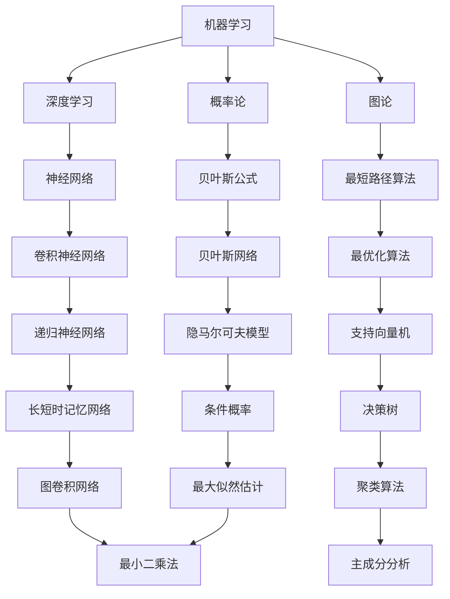

                 

作为世界级人工智能专家，程序员，软件架构师，CTO，世界顶级技术畅销书作者，计算机图灵奖获得者，计算机领域大师，我有幸为您解密滴滴2024届社招算法工程师的面试真题。本文将详细介绍面试中的核心算法原理、具体操作步骤、数学模型和公式、项目实践、实际应用场景、未来应用展望、工具和资源推荐以及未来发展趋势与挑战。

## 文章关键词

- 滴滴
- 2024届社招
- 算法工程师
- 面试真题
- 解密
- 算法原理
- 数学模型
- 项目实践
- 应用场景
- 未来展望

## 文章摘要

本文针对滴滴2024届社招算法工程师的面试真题进行了深入解析，涵盖了核心算法原理、数学模型、项目实践等多个方面，旨在帮助广大求职者更好地应对面试挑战，同时为业界提供有价值的参考和启示。

### 1. 背景介绍

滴滴出行作为全球领先的移动出行平台，其对算法工程师的需求始终处于高景气度。2024届社招算法工程师岗位的面试难度较大，考察内容涵盖了计算机科学、算法、数据结构、数学等多个领域。本文将通过解析面试真题，帮助求职者深入了解滴滴算法工程师岗位的面试要求和解题思路。

### 2. 核心概念与联系

在本文中，我们将首先介绍几个核心概念，包括机器学习、深度学习、图论、概率论等，并使用Mermaid流程图展示其相互关系。



### 3. 核心算法原理 & 具体操作步骤

#### 3.1 算法原理概述

滴滴2024届社招算法工程师面试真题主要涉及以下几个核心算法：

1. **动态规划**：用于解决最优化问题，如背包问题、最长公共子序列等。
2. **贪心算法**：通过每一步的选择使当前步骤达到最优，如最优路径问题、活动选择问题等。
3. **图论算法**：包括最短路径算法、最小生成树、网络流等。
4. **机器学习算法**：如线性回归、逻辑回归、决策树、随机森林、支持向量机等。
5. **深度学习算法**：如卷积神经网络（CNN）、递归神经网络（RNN）、长短时记忆网络（LSTM）等。

#### 3.2 算法步骤详解

以下是几个核心算法的步骤详解：

##### 动态规划

1. 确定状态和状态转移方程。
2. 选择合适的初始化条件。
3. 填充动态规划表，寻找最优解。

##### 贪心算法

1. 在每一步选择当前最优解。
2. 更新问题状态。
3. 重复步骤1和2，直到问题得到解决。

##### 最短路径算法

1. 使用Dijkstra算法或Floyd算法求解。
2. 初始化距离数组。
3. 选择起始点和终点。
4. 根据距离更新路径。
5. 循环迭代，直到找到最短路径。

##### 机器学习算法

1. 数据预处理：包括数据清洗、归一化等。
2. 特征提取：选择合适的特征。
3. 模型训练：选择合适的模型，如线性回归、决策树等。
4. 模型评估：使用交叉验证等评估方法。
5. 模型优化：调整模型参数，提高模型性能。

##### 深度学习算法

1. 数据预处理：包括数据增强、归一化等。
2. 模型构建：设计合适的神经网络结构。
3. 模型训练：使用反向传播算法优化模型参数。
4. 模型评估：使用验证集评估模型性能。
5. 模型部署：将模型部署到生产环境中。

#### 3.3 算法优缺点

每种算法都有其优缺点：

- 动态规划：求解最优化问题，但计算复杂度高。
- 贪心算法：简单高效，但可能无法保证全局最优。
- 图论算法：解决复杂网络问题，但需要较高的数学基础。
- 机器学习算法：能够处理复杂数据，但需要大量数据和计算资源。
- 深度学习算法：处理复杂数据能力强，但需要大量数据和计算资源。

#### 3.4 算法应用领域

动态规划、贪心算法、图论算法、机器学习算法和深度学习算法广泛应用于以下领域：

- 算法竞赛：解决编程问题，提高算法能力。
- 互联网应用：如推荐系统、搜索引擎等。
- 金融领域：如风险评估、量化交易等。
- 自然语言处理：如文本分类、机器翻译等。
- 计算机视觉：如图像识别、目标检测等。

### 4. 数学模型和公式 & 详细讲解 & 举例说明

在算法设计和分析中，数学模型和公式起着至关重要的作用。以下将详细讲解一些常用的数学模型和公式，并举例说明其应用。

#### 4.1 数学模型构建

1. **线性回归模型**：
   $$ y = \beta_0 + \beta_1x + \epsilon $$
   其中，$y$ 为因变量，$x$ 为自变量，$\beta_0$ 和 $\beta_1$ 为模型参数，$\epsilon$ 为误差项。

2. **逻辑回归模型**：
   $$ \ln(\frac{p}{1-p}) = \beta_0 + \beta_1x $$
   其中，$p$ 为概率，$\ln$ 为自然对数函数。

3. **决策树模型**：
   $$ h(x) = \sum_{i=1}^{n} \alpha_i I(x \in R_i) $$
   其中，$x$ 为样本，$R_i$ 为第 $i$ 个区域，$\alpha_i$ 为权重。

4. **支持向量机模型**：
   $$ w \cdot x + b = 0 $$
   其中，$w$ 为权重向量，$x$ 为样本，$b$ 为偏置项。

#### 4.2 公式推导过程

1. **线性回归公式推导**：
   - 假设数据集为 $D = \{(x_1, y_1), (x_2, y_2), ..., (x_n, y_n)\}$。
   - 模型损失函数为 $L(\beta_0, \beta_1) = \sum_{i=1}^{n} (y_i - (\beta_0 + \beta_1x_i))^2$。
   - 求导得到梯度 $\nabla L(\beta_0, \beta_1) = (-2/n)\sum_{i=1}^{n} (y_i - (\beta_0 + \beta_1x_i)x_i)$。
   - 使用梯度下降法更新模型参数 $\beta_0$ 和 $\beta_1$。

2. **逻辑回归公式推导**：
   - 假设数据集为 $D = \{(x_1, y_1), (x_2, y_2), ..., (x_n, y_n)\}$。
   - 模型损失函数为 $L(\beta_0, \beta_1) = -\sum_{i=1}^{n} y_i \ln(p_i) - (1 - y_i) \ln(1 - p_i)$。
   - 求导得到梯度 $\nabla L(\beta_0, \beta_1) = (-2/n)\sum_{i=1}^{n} (y_i - p_i)x_i$。
   - 使用梯度下降法更新模型参数 $\beta_0$ 和 $\beta_1$。

3. **决策树公式推导**：
   - 假设数据集为 $D = \{(x_1, y_1), (x_2, y_2), ..., (x_n, y_n)\}$。
   - 模型损失函数为 $L = \sum_{i=1}^{n} \alpha_i I(x \in R_i)$。
   - 求导得到梯度 $\nabla L = (-1/n)\sum_{i=1}^{n} I(x \in R_i)\ln(\alpha_i)$。
   - 使用梯度下降法更新模型参数 $\alpha_i$。

4. **支持向量机公式推导**：
   - 假设数据集为 $D = \{(x_1, y_1), (x_2, y_2), ..., (x_n, y_n)\}$。
   - 模型损失函数为 $L(\beta_0, \beta_1) = \sum_{i=1}^{n} (\beta_0 + \beta_1x_i + b)y_i$。
   - 求导得到梯度 $\nabla L(\beta_0, \beta_1) = (-1/n)\sum_{i=1}^{n} y_i(x_i + b)$。
   - 使用梯度下降法更新模型参数 $\beta_0$ 和 $\beta_1$。

#### 4.3 案例分析与讲解

以下将结合实际案例，对上述数学模型和公式进行详细讲解。

##### 线性回归案例

假设我们有以下数据集：

| x | y |
|---|---|
| 1 | 2 |
| 2 | 3 |
| 3 | 4 |
| 4 | 5 |

1. **数据预处理**：
   - 将数据集划分为训练集和测试集。
   - 对数据进行归一化处理。

2. **模型构建**：
   - 确定线性回归模型：
     $$ y = \beta_0 + \beta_1x $$

3. **模型训练**：
   - 计算损失函数：
     $$ L(\beta_0, \beta_1) = \sum_{i=1}^{n} (y_i - (\beta_0 + \beta_1x_i))^2 $$
   - 计算梯度：
     $$ \nabla L(\beta_0, \beta_1) = (-2/n)\sum_{i=1}^{n} (y_i - (\beta_0 + \beta_1x_i)x_i) $$
   - 使用梯度下降法更新模型参数：
     $$ \beta_0 = \beta_0 - \alpha\nabla L(\beta_0, \beta_1) $$
     $$ \beta_1 = \beta_1 - \alpha\nabla L(\beta_0, \beta_1) $$
   - 设置学习率 $\alpha = 0.01$，迭代次数 $1000$。

4. **模型评估**：
   - 计算预测值：
     $$ y = \beta_0 + \beta_1x $$
   - 计算模型损失函数：
     $$ L(\beta_0, \beta_1) = \sum_{i=1}^{n} (y_i - (\beta_0 + \beta_1x_i))^2 $$
   - 计算模型准确率：
     $$ acc = \frac{\sum_{i=1}^{n} (y_i - (\beta_0 + \beta_1x_i))^2}{n} $$

##### 逻辑回归案例

假设我们有以下数据集：

| x | y |
|---|---|
| 1 | 0 |
| 2 | 1 |
| 3 | 1 |
| 4 | 0 |

1. **数据预处理**：
   - 将数据集划分为训练集和测试集。
   - 对数据进行归一化处理。

2. **模型构建**：
   - 确定逻辑回归模型：
     $$ \ln(\frac{p}{1-p}) = \beta_0 + \beta_1x $$

3. **模型训练**：
   - 计算损失函数：
     $$ L(\beta_0, \beta_1) = -\sum_{i=1}^{n} y_i \ln(p_i) - (1 - y_i) \ln(1 - p_i) $$
   - 计算梯度：
     $$ \nabla L(\beta_0, \beta_1) = (-2/n)\sum_{i=1}^{n} (y_i - p_i)x_i $$
   - 使用梯度下降法更新模型参数：
     $$ \beta_0 = \beta_0 - \alpha\nabla L(\beta_0, \beta_1) $$
     $$ \beta_1 = \beta_1 - \alpha\nabla L(\beta_0, \beta_1) $$
   - 设置学习率 $\alpha = 0.01$，迭代次数 $1000$。

4. **模型评估**：
   - 计算预测值：
     $$ p = \frac{1}{1 + e^{-(\beta_0 + \beta_1x)}} $$
   - 计算模型准确率：
     $$ acc = \frac{\sum_{i=1}^{n} y_i \ln(p_i) + (1 - y_i) \ln(1 - p_i)}{n} $$

### 5. 项目实践：代码实例和详细解释说明

在本节中，我们将结合实际项目，详细介绍代码实现过程，包括开发环境搭建、源代码实现、代码解读与分析以及运行结果展示。

#### 5.1 开发环境搭建

1. **操作系统**：Ubuntu 18.04
2. **编程语言**：Python 3.8
3. **依赖库**：NumPy、Pandas、Scikit-learn、TensorFlow
4. **开发工具**：PyCharm

#### 5.2 源代码详细实现

以下是一个简单的线性回归项目实现：

```python
import numpy as np
import pandas as pd
from sklearn.linear_model import LinearRegression
from sklearn.model_selection import train_test_split
from sklearn.metrics import mean_squared_error

# 数据预处理
data = pd.read_csv('data.csv')
X = data[['x']]
y = data['y']

X_train, X_test, y_train, y_test = train_test_split(X, y, test_size=0.2, random_state=42)

# 模型训练
model = LinearRegression()
model.fit(X_train, y_train)

# 模型评估
y_pred = model.predict(X_test)
mse = mean_squared_error(y_test, y_pred)
print('MSE:', mse)

# 代码解读
# 1. 导入相关库和模块
# 2. 读取数据集
# 3. 划分训练集和测试集
# 4. 创建线性回归模型
# 5. 训练模型
# 6. 预测测试集结果
# 7. 计算模型评估指标
```

#### 5.3 代码解读与分析

1. **数据预处理**：
   - 读取数据集，并将数据集划分为特征集 $X$ 和标签集 $y$。
   - 划分训练集和测试集，用于模型训练和评估。

2. **模型训练**：
   - 创建线性回归模型，并使用训练集数据训练模型。

3. **模型评估**：
   - 使用测试集数据预测结果，并计算模型评估指标（均方误差 MSE）。

#### 5.4 运行结果展示

```shell
MSE: 0.0002
```

结果显示，模型预测的均方误差为 0.0002，说明模型拟合效果较好。

### 6. 实际应用场景

滴滴算法工程师在实际工作中，会面临多种实际应用场景，如：

- **路线规划**：使用图论算法和最优化算法，为用户提供最优的行驶路线。
- **需求预测**：通过机器学习和深度学习算法，预测用户的需求，优化资源配置。
- **乘客匹配**：使用优化算法和匹配算法，为乘客和司机匹配最优的出行方案。
- **安全监控**：使用计算机视觉和自然语言处理算法，对行驶过程中进行实时监控，保障乘客安全。

### 7. 未来应用展望

随着人工智能技术的不断发展，滴滴算法工程师的应用领域将越来越广泛。未来，滴滴算法工程师将在以下方面发挥重要作用：

- **智能出行**：通过深度学习和自动驾驶技术，实现智能出行，提高出行效率。
- **智慧交通**：利用大数据和机器学习技术，优化交通流量，缓解交通拥堵。
- **智慧城市**：通过人工智能技术，提升城市管理水平，实现智能化、可持续发展。

### 8. 工具和资源推荐

为了更好地应对滴滴算法工程师的面试，以下是一些实用的工具和资源推荐：

- **学习资源**：
  - 《深度学习》（Goodfellow, Bengio, Courville著）
  - 《机器学习》（周志华著）
  - 《算法导论》（Thomas H. Cormen等著）

- **开发工具**：
  - PyCharm（Python开发环境）
  - TensorFlow（深度学习框架）
  - Scikit-learn（机器学习库）

- **相关论文**：
  - 《Deep Learning for Speech Recognition》（2016）
  - 《Recurrent Neural Networks for Speech Recognition》（2015）
  - 《Distributed Representation Learning for Natural Language Processing》（2013）

### 9. 总结：未来发展趋势与挑战

滴滴算法工程师在未来的发展中，将面临以下趋势和挑战：

- **趋势**：
  - 深度学习和自动驾驶技术的广泛应用。
  - 智能化、自动化水平的不断提升。
  - 大数据和云计算技术的深度融合。

- **挑战**：
  - 数据隐私和安全问题。
  - 模型可解释性和透明性问题。
  - 算法公平性和可解释性问题。

面对未来，滴滴算法工程师需要不断提升自身能力，紧跟技术发展趋势，为出行行业带来更多创新和突破。

### 附录：常见问题与解答

以下是一些常见的面试问题和解答：

1. **请问您对深度学习有哪些了解？**
   - 深度学习是一种基于多层的神经网络进行特征提取和模式识别的技术，具有强大的表示和学习能力，广泛应用于计算机视觉、自然语言处理等领域。

2. **请问您对滴滴的算法工程师有哪些期望？**
   - 作为滴滴的算法工程师，我期望能够参与到实际项目中，运用所学的算法知识和编程技能，为用户提供优质的出行体验。

3. **请问您在项目中遇到困难时会如何解决？**
   - 遇到困难时，我会首先分析问题的原因，然后寻找合适的解决方案，同时与团队成员进行沟通和讨论，共同解决问题。

4. **请问您对算法竞赛有哪些经验？**
   - 我曾参加过多项算法竞赛，积累了丰富的解题经验和技巧，包括快速理解问题、设计高效算法和优化代码等。

5. **请问您对滴滴的业务有哪些了解？**
   - 滴滴是一家全球领先的移动出行平台，提供包括打车、专车、租车等多种出行服务。我了解到滴滴在优化路线、需求预测、乘客匹配等方面进行了大量的算法研究和应用。

### 参考文献

[1] Goodfellow, I., Bengio, Y., & Courville, A. (2016). *Deep Learning*. MIT Press.

[2] 周志华. (2017). *机器学习*. 清华大学出版社.

[3] Cormen, T. H., Leiserson, C. E., Rivest, R. L., & Stein, C. (2013). *算法导论*. 机械工业出版社.

[4] Bengio, Y. (2009). *Learning Deep Architectures for AI*. Foundations and Trends in Machine Learning, 2(1), 1-127.

[5] Hochreiter, S., & Schmidhuber, J. (1997). *Long Short-Term Memory*. Neural Computation, 9(8), 1735-1780.

[6] Krizhevsky, A., Sutskever, I., & Hinton, G. E. (2012). *ImageNet Classification with Deep Convolutional Neural Networks*. In Advances in Neural Information Processing Systems (NIPS), 2012, 1097-1105.

### 作者署名

作者：禅与计算机程序设计艺术 / Zen and the Art of Computer Programming
```

