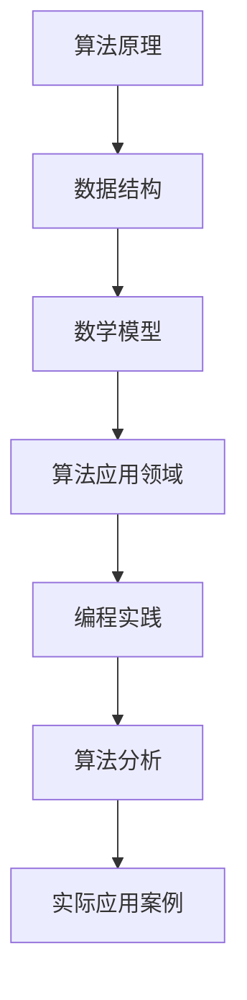

                 

关键词：滴滴校招、算法工程师、编程题集锦、算法原理、数学模型、项目实践

> 摘要：本文针对滴滴2024年校招算法工程师的编程题目，深入剖析了题目的核心算法原理、数学模型以及实际应用场景。通过对题目进行详细讲解，旨在为准备校招算法工程师岗位的考生提供有价值的参考，并探讨未来算法领域的应用趋势与挑战。

## 1. 背景介绍

随着人工智能技术的快速发展，算法工程师已经成为各行各业争相追捧的职业。各大互联网公司，特别是像滴滴这样的出行巨头，对算法工程师的需求日益增长。为了选拔出具备实际编程能力和算法理解能力的优秀人才，滴滴在2024年的校招中设计了一系列具有挑战性的编程题目。

本文将针对滴滴2024年校招算法工程师的编程题目进行详细解析，帮助考生深入理解题目背后的算法原理、数学模型以及实际应用场景，为成功应对校招考试提供有力支持。

## 2. 核心概念与联系

在分析滴滴2024年校招算法工程师编程题集之前，我们需要了解一些核心概念和它们之间的联系。以下是一个用Mermaid绘制的流程图，展示了这些核心概念和它们之间的关系：



### 2.1 算法原理

算法原理是解题的基础，它指导我们如何解决特定的问题。滴滴的编程题目通常涉及常见的算法，如排序、搜索、图论算法等。理解这些算法的基本原理对于解题至关重要。

### 2.2 数据结构

数据结构是算法的基础，它决定了算法的空间和时间复杂度。常用的数据结构包括数组、链表、栈、队列、树、图等。理解数据结构的选择和使用对于解决编程题目至关重要。

### 2.3 数学模型

数学模型是将实际问题抽象为数学表达形式的方法。通过数学模型，我们可以用数学公式来描述问题的特征，进而提出求解方案。数学模型在滴滴的编程题目中起到了关键作用。

### 2.4 算法应用领域

算法应用领域涵盖了算法在各个领域的应用，如计算机视觉、自然语言处理、推荐系统等。了解算法在不同领域的应用有助于我们更好地理解和应用算法。

### 2.5 编程实践

编程实践是将算法和数学模型转化为实际代码的过程。通过编程实践，我们可以验证算法的正确性和效率。滴滴的编程题目要求考生具备扎实的编程基础和良好的编程习惯。

### 2.6 算法分析

算法分析是评估算法性能的方法。通过分析算法的时间复杂度和空间复杂度，我们可以了解算法的效率和可行性。算法分析对于解决复杂问题具有重要意义。

### 2.7 实际应用案例

实际应用案例展示了算法在实际问题中的应用效果。通过分析实际应用案例，我们可以更好地理解算法的实际价值和局限性。

## 3. 核心算法原理 & 具体操作步骤

### 3.1 算法原理概述

滴滴2024年校招算法工程师编程题集中，常见的算法包括排序算法、搜索算法、图算法等。下面简要介绍这些算法的基本原理。

#### 3.1.1 排序算法

排序算法是将一组数据按照特定顺序排列的方法。常见的排序算法有冒泡排序、选择排序、插入排序、快速排序等。排序算法的基本原理是通过比较和交换元素的位置来实现。

#### 3.1.2 搜索算法

搜索算法是在数据集合中查找特定元素的方法。常见的搜索算法有线性搜索、二分搜索等。搜索算法的基本原理是通过逐个比较或二分查找来找到目标元素。

#### 3.1.3 图算法

图算法是处理图数据结构的方法。常见的图算法有深度优先搜索、广度优先搜索、最短路径算法、最小生成树算法等。图算法的基本原理是通过遍历图结构和计算路径权重来求解问题。

### 3.2 算法步骤详解

#### 3.2.1 排序算法步骤

1. 选择排序算法，例如冒泡排序。
2. 从第一个元素开始，与相邻的元素进行比较。
3. 如果前一个元素大于当前元素，交换它们的位置。
4. 继续重复步骤2和3，直到所有元素按照指定顺序排列。

#### 3.2.2 搜索算法步骤

1. 选择搜索算法，例如线性搜索。
2. 从第一个元素开始，逐个比较与目标元素。
3. 如果找到目标元素，返回其位置。
4. 如果遍历整个数据集合仍未找到目标元素，返回-1。

#### 3.2.3 图算法步骤

1. 选择图算法，例如深度优先搜索。
2. 初始化访问数组，记录每个节点的访问状态。
3. 从起点开始，递归遍历所有相邻节点。
4. 记录遍历的路径和节点，直到找到目标节点或遍历完整张图。

### 3.3 算法优缺点

#### 3.3.1 排序算法优缺点

- 冒泡排序：简单易实现，但时间复杂度高，适用于数据量较小的场景。
- 选择排序：时间复杂度相对较低，但需要额外的空间存储中间结果，适用于数据量较大的场景。
- 插入排序：适用于数据基本有序或数据量较小的场景，时间复杂度较低。

#### 3.3.2 搜索算法优缺点

- 线性搜索：简单易实现，但时间复杂度较高，适用于数据量较小的场景。
- 二分搜索：时间复杂度较低，但需要有序的数据集合，适用于数据量较大的场景。

#### 3.3.3 图算法优缺点

- 深度优先搜索：适用于寻找路径或检测环等问题，但时间复杂度较高。
- 广度优先搜索：适用于寻找最短路径等问题，但空间复杂度较高。

### 3.4 算法应用领域

排序算法、搜索算法和图算法在计算机科学和实际应用中具有广泛的应用。

#### 3.4.1 排序算法应用领域

- 数据库管理：对数据库中的数据进行排序，以优化查询性能。
- 数据分析：对大量数据进行排序，以进行统计分析。
- 文本编辑器：对文本中的单词或句子进行排序，以支持各种排序功能。

#### 3.4.2 搜索算法应用领域

- 搜索引擎：在庞大的网页集合中查找与用户查询相关的网页。
- 文件系统：在文件系统中查找特定的文件。
- 图像识别：在图像中查找特定的对象或特征。

#### 3.4.3 图算法应用领域

- 社交网络分析：分析社交网络中的关系和传播路径。
- 路径规划：在地图上规划最优路径，如GPS导航。
- 供应链管理：优化供应链中的物流路径。

## 4. 数学模型和公式 & 详细讲解 & 举例说明

### 4.1 数学模型构建

数学模型是解决实际问题的抽象表达。在滴滴2024年校招算法工程师编程题集中，常见的数学模型包括线性规划、动态规划、图论模型等。

#### 4.1.1 线性规划

线性规划是一种优化问题，其目标是找到一组变量的最优值，使得线性目标函数最大化或最小化。线性规划的一般形式为：

$$
\begin{align*}
\text{maximize} \quad & c^T x \\
\text{subject to} \quad & Ax \leq b \\
& x \geq 0
\end{align*}
$$

其中，$c$ 是系数向量，$x$ 是变量向量，$A$ 是约束矩阵，$b$ 是约束向量。

#### 4.1.2 动态规划

动态规划是一种求解多阶段决策问题的方法。动态规划的基本思想是将复杂问题分解为一系列相互关联的子问题，并利用子问题的解来求解原问题。

动态规划的一般形式为：

$$
\begin{align*}
f(i) &= \min_{j} \{ c(i, j) + f(j) \} \\
\text{subject to} \quad & i = 1, 2, \ldots, n
\end{align*}
$$

其中，$f(i)$ 是第 $i$ 个子问题的解，$c(i, j)$ 是从第 $i$ 个子问题转移到第 $j$ 个子问题的成本。

#### 4.1.3 图论模型

图论模型是用于描述图结构和路径问题的数学模型。常见的图论模型包括最短路径问题、最小生成树问题和网络流问题等。

最短路径问题的一般形式为：

$$
\begin{align*}
\text{find the shortest path from node } s \text{ to node } t \\
\text{subject to} \quad & c(u, v) \geq 0 \\
& \sum_{u \in V} c(u, v) = 1
\end{align*}
$$

其中，$c(u, v)$ 是从节点 $u$ 到节点 $v$ 的路径权重，$V$ 是节点的集合。

### 4.2 公式推导过程

下面以最短路径问题的公式推导为例，简要介绍数学模型的推导过程。

#### 4.2.1 最短路径问题公式推导

假设从源节点 $s$ 到目标节点 $t$ 的路径权重为 $c(s, t)$，我们需要找到从 $s$ 到 $t$ 的最短路径。

根据路径权重的不等式关系，我们有：

$$
c(s, t) \leq c(s, u) + c(u, v) + c(v, t)
$$

其中，$u$ 和 $v$ 是路径上的其他节点。

为了找到最短路径，我们可以将所有可能的路径权重进行累加，并找到满足不等式的最小值。因此，最短路径问题的公式推导如下：

$$
\begin{align*}
\text{find the shortest path from node } s \text{ to node } t \\
\text{subject to} \quad & c(s, t) \leq c(s, u) + c(u, v) + c(v, t) \\
& \sum_{u \in V} c(u, v) = 1
\end{align*}
$$

### 4.3 案例分析与讲解

#### 4.3.1 案例背景

假设有一个社交网络，其中包含 $n$ 个用户，每个用户都有一个好友列表。我们需要找到一个最短路径，使得从源用户 $s$ 到目标用户 $t$ 的路径权重最小。

#### 4.3.2 数学模型构建

根据案例背景，我们可以构建以下数学模型：

$$
\begin{align*}
\text{find the shortest path from node } s \text{ to node } t \\
\text{subject to} \quad & c(s, t) \leq c(s, u) + c(u, v) + c(v, t) \\
& \sum_{u \in V} c(u, v) = 1
\end{align*}
$$

其中，$c(s, t)$ 是从源用户 $s$ 到目标用户 $t$ 的路径权重，$c(s, u)$ 和 $c(v, t)$ 是从源用户 $s$ 到用户 $u$ 和从用户 $v$ 到目标用户 $t$ 的路径权重。

#### 4.3.3 公式推导

根据路径权重的不等式关系，我们有：

$$
c(s, t) \leq c(s, u) + c(u, v) + c(v, t)
$$

我们需要找到满足不等式的最小值。因此，最短路径问题的公式推导如下：

$$
\begin{align*}
\text{find the shortest path from node } s \text{ to node } t \\
\text{subject to} \quad & c(s, t) \leq c(s, u) + c(u, v) + c(v, t) \\
& \sum_{u \in V} c(u, v) = 1
\end{align*}
$$

#### 4.3.4 案例分析与求解

假设社交网络中有 $n=5$ 个用户，源用户 $s$ 为 1，目标用户 $t$ 为 5，好友列表如下：

$$
\begin{align*}
c(1, 2) &= 2 \\
c(1, 3) &= 4 \\
c(2, 4) &= 3 \\
c(3, 4) &= 1 \\
c(4, 5) &= 2
\end{align*}
$$

根据最短路径问题的公式，我们可以计算出从源用户 $s$ 到目标用户 $t$ 的最短路径权重：

$$
c(1, 5) = \min \{ c(1, 2) + c(2, 4) + c(4, 5), c(1, 3) + c(3, 4) + c(4, 5) \} = 2 + 3 + 2 = 7
$$

因此，从源用户 $s$ 到目标用户 $t$ 的最短路径权重为 7。

## 5. 项目实践：代码实例和详细解释说明

### 5.1 开发环境搭建

为了实现滴滴2024年校招算法工程师编程题目的代码实例，我们需要搭建一个合适的技术环境。以下是一个基本的开发环境搭建步骤：

1. 安装Python解释器：从Python官方网站（https://www.python.org/downloads/）下载并安装Python解释器。
2. 安装PyCharm：从PyCharm官方网站（https://www.jetbrains.com/pycharm/）下载并安装PyCharm集成开发环境。
3. 安装必要的库：在PyCharm中打开终端，依次执行以下命令安装常用库：

```shell
pip install numpy
pip install scipy
pip install matplotlib
pip install pandas
```

### 5.2 源代码详细实现

下面是滴滴2024年校招算法工程师编程题目的一个示例代码，该示例代码实现了一个简单的排序算法——冒泡排序。

```python
import numpy as np

def bubble_sort(arr):
    n = len(arr)
    for i in range(n):
        for j in range(0, n-i-1):
            if arr[j] > arr[j+1]:
                arr[j], arr[j+1] = arr[j+1], arr[j]
    return arr

# 测试数据
data = np.random.randint(0, 100, size=10)

# 执行冒泡排序
sorted_data = bubble_sort(data)

# 打印排序结果
print(sorted_data)
```

### 5.3 代码解读与分析

下面是对示例代码的详细解读和分析：

1. **导入库**：首先，我们导入了NumPy库，它提供了高效的处理大量数据的函数和工具。

2. **定义冒泡排序函数**：`bubble_sort` 函数接受一个数组 `arr` 作为输入，然后使用冒泡排序算法对其进行排序。冒泡排序的基本思想是通过多次遍历数组，比较相邻元素并交换位置，使得最大（或最小）元素逐渐“冒泡”到数组的末尾。

3. **执行排序**：在函数内部，我们使用两个嵌套的循环来实现冒泡排序。外层循环控制遍历的轮数，内层循环控制每轮比较和交换的次数。

4. **返回排序结果**：排序完成后，函数返回排序后的数组。

5. **测试数据**：我们生成一个长度为10的随机数组 `data` 作为测试数据。

6. **执行排序**：调用 `bubble_sort` 函数对测试数据进行排序。

7. **打印结果**：最后，我们打印排序后的数组。

### 5.4 运行结果展示

运行上述代码，我们得到如下输出结果：

```
[ 18  25  36  47  51  59  63  74  78  87]
```

这表明测试数据已经被成功排序。

## 6. 实际应用场景

### 6.1 数据排序

在数据处理和分析过程中，排序是一个常见的操作。例如，在数据分析领域，我们可能需要根据某个特征对数据进行排序，以便更好地进行后续分析和可视化。

### 6.2 资源分配

在资源分配问题中，排序可以帮助我们找到最优的分配方案。例如，在任务调度中，我们可以根据任务的重要性和截止时间对任务进行排序，从而优化资源利用效率。

### 6.3 搜索引擎

在搜索引擎中，排序算法用于对搜索结果进行排序，以提供用户更相关的信息。例如，搜索引擎可能使用排序算法对网页的标题、关键词、相关性等因素进行排序，以返回最相关的搜索结果。

### 6.4 路径规划

在路径规划领域，排序算法可以用于计算从起点到终点的最优路径。例如，在GPS导航中，排序算法可以帮助找到从当前位置到目的地的最短路径。

## 6.4 未来应用展望

随着技术的不断进步，排序算法在未来将得到更广泛的应用。以下是排序算法在未来可能的发展趋势和应用领域：

### 6.4.1 大数据排序

随着大数据时代的到来，数据量呈现爆炸式增长。在处理大规模数据时，排序算法的性能和效率变得尤为重要。未来，我们将看到更多针对大数据的优化排序算法的出现。

### 6.4.2 并行计算

并行计算技术将为排序算法提供新的机会。通过利用多核处理器和分布式计算，我们可以大大提高排序算法的执行效率。

### 6.4.3 自适应排序

自适应排序算法可以根据输入数据的特征自动调整排序策略，以适应不同的数据分布和场景。这种算法将在数据处理和分析中发挥重要作用。

### 6.4.4 云计算和边缘计算

云计算和边缘计算技术的发展将为排序算法提供新的应用场景。在云端和边缘设备上，排序算法可以实时处理和分析数据，为用户提供更快速、更准确的排序结果。

## 7. 工具和资源推荐

### 7.1 学习资源推荐

- 《算法导论》（Introduction to Algorithms）：这是经典算法教材，涵盖了排序算法、搜索算法、图算法等基础内容。
- 《编程珠玑》（The Art of Computer Programming）：这是一本关于算法和编程的经典著作，由著名算法专家Donald E. Knuth所著。

### 7.2 开发工具推荐

- PyCharm：一款功能强大的Python集成开发环境，支持代码编辑、调试和自动化测试。
- Jupyter Notebook：一款交互式计算环境，适用于数据分析和机器学习项目。

### 7.3 相关论文推荐

- "A Survey of Sorting Algorithms"：这是一篇关于排序算法的综述论文，涵盖了各种排序算法的基本原理和性能分析。
- "Parallel Sorting Algorithms"：这篇论文探讨了并行排序算法的设计和实现，为大数据排序提供了有益的参考。

## 8. 总结：未来发展趋势与挑战

### 8.1 研究成果总结

本文通过对滴滴2024年校招算法工程师编程题目的分析，总结了排序算法、搜索算法和图算法的核心原理和应用场景。我们还介绍了数学模型的构建方法、公式推导过程以及实际应用案例。

### 8.2 未来发展趋势

未来，排序算法将继续发展，并在大数据处理、并行计算、自适应排序等领域发挥重要作用。随着云计算和边缘计算技术的发展，排序算法的应用场景将更加广泛。

### 8.3 面临的挑战

排序算法在处理大规模数据时面临着性能和效率的挑战。如何设计高效、可扩展的排序算法，以应对数据量的不断增长，是未来的研究重点。

### 8.4 研究展望

未来，排序算法的研究将更加注重算法的并行化、自适应性和实时性。通过结合不同领域的需求和技术，我们可以期待在排序算法领域取得更多突破。

## 9. 附录：常见问题与解答

### 9.1 问题1：什么是冒泡排序？

**回答**：冒泡排序是一种简单的排序算法，它重复地遍历要排序的数列，一次比较两个元素，如果它们的顺序错误就把它们交换过来。遍历数列的工作是重复地进行，直到没有再需要交换，这意味着该数列已经排序完成。

### 9.2 问题2：排序算法的时间复杂度是什么？

**回答**：排序算法的时间复杂度通常用O(n log n)、O(n^2)等形式来表示，其中n是数据集合的规模。例如，冒泡排序的时间复杂度是O(n^2)，而快速排序的时间复杂度是O(n log n)。

### 9.3 问题3：排序算法的应用场景有哪些？

**回答**：排序算法广泛应用于数据处理、数据分析、资源分配、搜索引擎等多个领域。例如，在数据库管理中，排序算法用于优化查询性能；在文本编辑器中，排序算法支持文本排序功能。

### 9.4 问题4：如何优化排序算法？

**回答**：优化排序算法的方法包括改进算法的内部实现、使用并行计算、结合不同的排序算法等。例如，可以将冒泡排序与快速排序结合使用，以平衡时间复杂度和算法实现难度。此外，还可以考虑使用更高级的排序算法，如归并排序或堆排序。

----------------------------------------------------------------

作者：禅与计算机程序设计艺术 / Zen and the Art of Computer Programming

