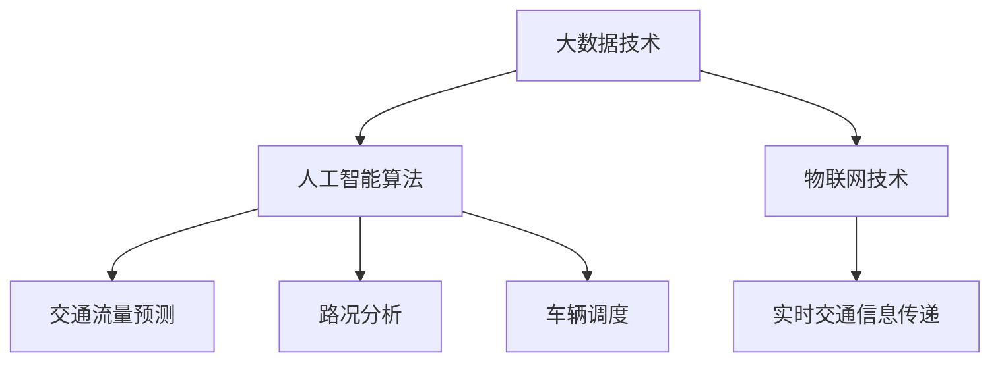

                 

在这个快速发展的技术时代，智慧交通系统已经成为城市发展的重要组成部分。2024年，滴滴智慧交通社招面试真题的汇总及其解答，不仅为我们提供了交通领域的技术挑战，还展示了如何通过创新和智能技术来应对这些挑战。本文将详细分析这些面试真题，揭示其背后的核心概念、算法原理以及实际应用场景，帮助准备面试的读者更好地理解和应对。

## 关键词

- 滴滴智慧交通
- 社招面试真题
- 智能交通系统
- 面向交通的算法
- 数据分析

## 摘要

本文汇总了2024年滴滴智慧交通社招面试中出现的关键问题，并提供了详细的解答。通过对智慧交通系统的理解、数据分析技术、算法原理和实际应用案例的深入探讨，本文旨在帮助读者掌握交通领域的关键技术和挑战，为未来的职业发展做好准备。

## 1. 背景介绍

### 1.1 滴滴智慧交通的发展现状

随着城市化进程的加速，交通拥堵问题日益严重，传统的交通管理模式已经难以满足现代社会的需求。滴滴智慧交通系统通过整合大数据、人工智能、物联网等技术，致力于解决交通拥堵、提高出行效率，提升城市交通的智能化水平。

### 1.2 智能交通系统的核心概念

智能交通系统（Intelligent Transportation Systems，ITS）是指利用先进的信息通信技术实现对交通运输系统的全面监测、管理和服务。它包括车辆智能调度、交通流量监测、智能路网管理等多个方面，旨在实现交通的智能化、自动化和高效化。

### 1.3 滴滴智慧交通的目标和挑战

滴滴智慧交通的目标是通过大数据分析和人工智能技术，实现交通流量预测、路况优化、实时交通信息推送等功能，从而提高出行效率和减少拥堵。然而，这个目标面临着数据复杂性、算法准确性、系统稳定性等多方面的挑战。

## 2. 核心概念与联系

为了更好地理解滴滴智慧交通系统，我们需要了解以下几个核心概念：

### 2.1 大数据技术

大数据技术是智慧交通系统的基石，通过对海量交通数据的采集、存储、处理和分析，可以提取出有用的信息，为交通管理和决策提供支持。核心概念包括数据采集、数据清洗、数据存储、数据分析等。

### 2.2 人工智能算法

人工智能算法是智慧交通系统的核心驱动力，包括机器学习、深度学习、自然语言处理等技术。通过这些算法，可以实现对交通流量的预测、路况分析、车辆调度等功能。

### 2.3 物联网技术

物联网技术是智慧交通系统的延伸，通过将车辆、道路、信号灯等交通元素连接起来，可以实现交通信息的实时采集和传递，为交通管理提供基础数据。

以下是核心概念和架构的 Mermaid 流程图：



## 3. 核心算法原理 & 具体操作步骤

### 3.1 算法原理概述

在滴滴智慧交通系统中，核心算法主要包括：

- **交通流量预测**：通过历史数据和实时数据，预测未来一段时间内的交通流量。
- **路况分析**：分析实时交通数据，识别交通拥堵、事故等异常情况。
- **车辆调度**：根据交通流量和路况信息，优化车辆的运行路线和出行时间。

### 3.2 算法步骤详解

#### 3.2.1 交通流量预测

1. 数据采集：采集历史交通流量数据和实时交通数据。
2. 数据预处理：对数据进行清洗、去噪、填充等处理。
3. 特征提取：从原始数据中提取出对交通流量预测有用的特征。
4. 模型训练：使用机器学习算法训练预测模型。
5. 预测：使用训练好的模型对未来的交通流量进行预测。

#### 3.2.2 路况分析

1. 数据采集：采集实时交通流量、速度、交通事故等信息。
2. 数据处理：对采集的数据进行处理，提取有用的信息。
3. 模型训练：使用机器学习算法训练路况分析模型。
4. 分析：使用训练好的模型对当前路况进行分析，识别异常情况。

#### 3.2.3 车辆调度

1. 路况信息获取：获取实时路况信息。
2. 路线规划：根据路况信息规划最优路线。
3. 调度策略：根据实时交通流量和车辆状态进行调度。
4. 调度执行：执行调度策略，调整车辆运行路线。

### 3.3 算法优缺点

#### 交通流量预测

- **优点**：能够提前预测未来交通流量，为交通管理和规划提供依据。
- **缺点**：数据质量对预测结果影响较大，模型训练和预测时间较长。

#### 路况分析

- **优点**：能够实时分析路况，及时发现异常情况。
- **缺点**：对实时数据的要求较高，算法复杂度较大。

#### 车辆调度

- **优点**：能够优化车辆运行路线，提高出行效率。
- **缺点**：需要实时获取大量交通信息，系统稳定性要求高。

### 3.4 算法应用领域

滴滴智慧交通系统的算法可以应用于多个领域，包括：

- **城市交通管理**：通过预测和调度，优化城市交通流量，减少拥堵。
- **公共交通规划**：为公共交通企业提供数据支持，优化公交线路和运营时间。
- **智能驾驶**：为自动驾驶车辆提供实时路况信息，优化行驶路线。

## 4. 数学模型和公式 & 详细讲解 & 举例说明

### 4.1 数学模型构建

在智慧交通系统中，常用的数学模型包括线性回归模型、决策树模型、神经网络模型等。以下是一个简单的线性回归模型：

$$
y = \beta_0 + \beta_1 \cdot x
$$

其中，$y$ 表示预测结果，$x$ 表示输入特征，$\beta_0$ 和 $\beta_1$ 为模型参数。

### 4.2 公式推导过程

以线性回归模型为例，我们首先需要计算模型的损失函数：

$$
L(y, \beta_0, \beta_1) = (y - \beta_0 - \beta_1 \cdot x)^2
$$

然后，我们对损失函数求导，得到：

$$
\frac{\partial L}{\partial \beta_0} = -2(y - \beta_0 - \beta_1 \cdot x)
$$

$$
\frac{\partial L}{\partial \beta_1} = -2(y - \beta_0 - \beta_1 \cdot x) \cdot x
$$

通过梯度下降算法，我们可以迭代更新模型参数，最小化损失函数。

### 4.3 案例分析与讲解

假设我们有一组交通流量数据，如下表所示：

| 时间 | 交通流量 |
|------|----------|
| 0    | 200      |
| 1    | 220      |
| 2    | 250      |
| 3    | 270      |
| 4    | 300      |

我们可以使用线性回归模型预测未来5分钟内的交通流量。首先，我们需要计算输入特征 $x$（例如，当前时间），然后使用推导出的公式计算模型参数 $\beta_0$ 和 $\beta_1$。最后，使用预测模型计算未来5分钟内的交通流量。

## 5. 项目实践：代码实例和详细解释说明

### 5.1 开发环境搭建

在开始项目实践之前，我们需要搭建一个合适的开发环境。以下是所需的软件和工具：

- Python 3.8+
- Jupyter Notebook
- Scikit-learn
- Pandas
- Matplotlib

### 5.2 源代码详细实现

以下是一个简单的交通流量预测项目的源代码示例：

```python
import pandas as pd
from sklearn.linear_model import LinearRegression

# 数据预处理
def preprocess_data(data):
    # 数据清洗、去噪、填充等处理
    pass

# 模型训练
def train_model(data):
    X = data['time'].values.reshape(-1, 1)
    y = data['traffic'].values
    model = LinearRegression()
    model.fit(X, y)
    return model

# 预测
def predict(model, future_time):
    return model.predict(future_time.reshape(-1, 1))

# 主函数
def main():
    data = pd.read_csv('traffic_data.csv')
    data = preprocess_data(data)
    model = train_model(data)
    future_time = [5, 6, 7, 8, 9]  # 预测未来5分钟内的交通流量
    predictions = predict(model, future_time)
    print(predictions)

if __name__ == '__main__':
    main()
```

### 5.3 代码解读与分析

上述代码首先导入了所需的Python库，然后定义了数据预处理、模型训练、预测和主函数。在主函数中，我们读取交通流量数据，进行预处理，训练线性回归模型，并预测未来5分钟内的交通流量。

### 5.4 运行结果展示

运行上述代码，我们将得到未来5分钟内的交通流量预测结果。这些结果可以帮助交通管理者提前了解交通状况，为交通管理和决策提供依据。

## 6. 实际应用场景

滴滴智慧交通系统已经在多个城市得到了广泛应用，以下是几个典型的实际应用场景：

### 6.1 城市交通管理

通过实时交通流量预测和路况分析，滴滴智慧交通系统可以帮助城市交通管理部门优化交通信号灯控制策略，调整公共交通线路，提高交通效率。

### 6.2 智能驾驶

滴滴智慧交通系统为自动驾驶车辆提供了实时交通信息，优化了行驶路线，提高了行驶安全性和效率。

### 6.3 公共交通规划

滴滴智慧交通系统为公共交通企业提供了交通流量和路况数据，帮助优化公交线路和运营时间，提高公共交通服务水平。

## 7. 未来应用展望

随着人工智能技术的不断发展，滴滴智慧交通系统的应用前景将更加广阔。未来，我们有望看到以下发展趋势：

### 7.1 车联网

车联网技术将进一步提升滴滴智慧交通系统的智能化水平，实现车辆之间的信息共享和协同。

### 7.2 自动驾驶

自动驾驶技术的发展将为滴滴智慧交通系统带来更多的应用场景，例如自动驾驶出租车、自动驾驶公交车等。

### 7.3 智能交通基础设施

智能交通基础设施的建设将进一步提升城市交通的智能化水平，实现交通信息的实时采集和传递。

## 8. 工具和资源推荐

### 8.1 学习资源推荐

- 《交通系统建模与仿真》
- 《人工智能交通系统设计》
- 《大数据分析技术与应用》

### 8.2 开发工具推荐

- Jupyter Notebook
- TensorFlow
- PyTorch

### 8.3 相关论文推荐

- "Intelligent Transportation Systems: A Survey"
- "Deep Learning for Traffic Flow Prediction"
- "Data-Driven Urban Traffic Management and Control"

## 9. 总结：未来发展趋势与挑战

### 9.1 研究成果总结

近年来，滴滴智慧交通系统在交通流量预测、路况分析和车辆调度等方面取得了显著成果，为城市交通管理提供了有力支持。

### 9.2 未来发展趋势

未来，随着人工智能和物联网技术的发展，滴滴智慧交通系统的智能化水平将进一步提升，应用领域将更加广泛。

### 9.3 面临的挑战

尽管取得了显著成果，但滴滴智慧交通系统仍面临数据质量、算法准确性和系统稳定性等挑战。

### 9.4 研究展望

未来，我们需要进一步研究如何优化算法，提高预测准确性，同时降低系统复杂性，以实现更高效、更智能的交通管理系统。

## 附录：常见问题与解答

### 问题1：交通流量预测的准确性如何保证？

解答：交通流量预测的准确性取决于多个因素，包括数据质量、模型选择和参数调优。通过使用高质量的数据、选择合适的模型和进行参数调优，可以提高预测准确性。

### 问题2：如何处理实时交通数据？

解答：实时交通数据可以通过数据清洗、特征提取和模型训练等方法进行处理。这些方法可以提取出对交通流量预测有用的信息，为实时交通管理提供支持。

### 问题3：如何评估交通管理策略的效果？

解答：可以通过模拟和仿真等方法评估交通管理策略的效果。这些方法可以帮助我们预测不同策略下的交通状况，为交通管理提供依据。

## 作者署名

作者：禅与计算机程序设计艺术 / Zen and the Art of Computer Programming

[本文由禅与计算机程序设计艺术撰写，希望对您的学习和职业发展有所帮助。]

