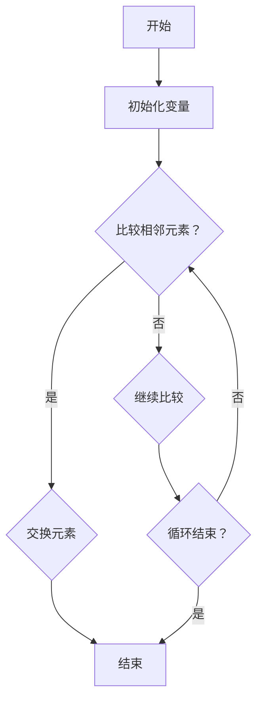

                 

近年来，随着人工智能和大数据技术的快速发展，滴滴出行作为全球领先的移动出行平台，对其技术团队的要求也越来越高。为了更好地选拔优秀的技术人才，滴滴出行的社招面试题也变得越来越专业、深入。本文将汇总2024年滴滴智慧出行社招面试中出现的一些真题，并结合相关知识点进行详细解答，旨在帮助广大考生更好地准备面试。

## 关键词

- 滴滴出行
- 社招面试
- 智慧出行
- 技术面试
- 算法
- 数据结构
- 编程语言

## 摘要

本文将从多个方面介绍2024年滴滴智慧出行社招面试的相关真题，包括算法和数据结构、编程语言、系统设计、数据库等方面。通过对这些真题的解答，帮助读者了解滴滴出行对技术人才的要求，以及如何应对这类面试题目。希望通过本文的介绍，能够为广大考生提供有益的参考。

## 1. 背景介绍

### 1.1 滴滴出行简介

滴滴出行成立于2012年，是全球领先的移动出行平台，提供包括出租车、专车、快车、顺风车、豪华车、共享单车、代驾、巴士、拼车等多种出行服务。截至2023年，滴滴在全球范围内拥有超过5亿注册用户，日订单量超过4000万。

### 1.2 滴滴出行技术团队建设

作为一家以技术创新为核心驱动的公司，滴滴出行在技术团队建设方面投入了大量的资源和精力。滴滴的技术团队涵盖了多个领域，包括人工智能、大数据、云计算、网络安全等。在面试过程中，滴滴出行会针对不同岗位的技术要求，设置相应的面试题目。

## 2. 核心概念与联系

### 2.1 算法原理概述

算法是计算机科学中的核心概念，用于解决特定问题的一系列步骤。在滴滴出行面试中，算法题目主要涉及以下几个方面：

- **排序算法**：包括冒泡排序、选择排序、插入排序、快速排序等。
- **查找算法**：包括二分查找、哈希查找等。
- **动态规划**：用于求解最优化问题，如背包问题、最长公共子序列等。
- **图算法**：包括深度优先搜索、广度优先搜索、最短路径算法等。

### 2.2 数据结构原理

数据结构是存储和组织数据的方式，用于提高算法的效率和性能。在滴滴出行面试中，常见的数据结构包括：

- **数组**：用于存储固定大小的数据集合。
- **链表**：用于存储可变大小的数据集合。
- **栈**：用于实现后进先出（LIFO）的数据结构。
- **队列**：用于实现先进先出（FIFO）的数据结构。
- **树**：用于表示层次关系的数据结构。
- **图**：用于表示复杂网络结构的数据结构。

### 2.3 Mermaid 流程图

以下是一个简单的Mermaid流程图，展示了一个冒泡排序算法的过程：



## 3. 核心算法原理 & 具体操作步骤

### 3.1 算法原理概述

在滴滴出行面试中，算法题目主要考察应聘者的算法思维和编程能力。以下是一些常见的算法题目及其原理：

- **排序算法**：主要用于对一组数据进行排序。冒泡排序、选择排序、插入排序、快速排序等都是常见的排序算法。
- **查找算法**：主要用于在数据集合中查找特定元素。二分查找、哈希查找等是常见的查找算法。
- **动态规划**：主要用于求解最优化问题。动态规划的核心思想是将复杂问题分解为多个子问题，并利用子问题的解来求解原问题。
- **图算法**：主要用于解决与网络相关的计算问题。深度优先搜索、广度优先搜索、最短路径算法等都是常见的图算法。

### 3.2 算法步骤详解

以下以冒泡排序算法为例，介绍其具体操作步骤：

1. **初始化**：将待排序的数组记为`arr`，长度为`n`。
2. **外层循环**：从后向前遍历数组，每次遍历都会将当前未排序部分的最大值移动到未排序部分的最后一位。
3. **内层循环**：在每次外层循环开始时，假设未排序部分的最大值已经位于未排序部分的最后一位，然后从第一位开始遍历未排序部分，若当前元素大于下一元素，则交换它们的位置。
4. **结束条件**：当外层循环结束时，整个数组已经排序完毕。

### 3.3 算法优缺点

- **冒泡排序**：
  - **优点**：实现简单，易于理解。
  - **缺点**：效率较低，不适合大规模数据排序。

### 3.4 算法应用领域

冒泡排序算法广泛应用于各种实际问题中，如考试分数排序、学生成绩排名等。

## 4. 数学模型和公式 & 详细讲解 & 举例说明

### 4.1 数学模型构建

在滴滴出行面试中，数学模型的应用非常广泛，如最优化问题、概率问题等。以下以最优化问题为例，介绍数学模型的构建：

1. **目标函数**：用于衡量问题的最优解。通常为目标函数最大化或最小化。
2. **约束条件**：用于限制问题的解空间。常见的约束条件包括线性不等式、线性等式等。
3. **求解方法**：用于求解最优解。常见的求解方法包括线性规划、非线性规划、动态规划等。

### 4.2 公式推导过程

以下以线性规划为例，介绍公式推导过程：

1. **目标函数**：最大化或最小化线性函数。
2. **约束条件**：一组线性不等式或线性等式。
3. **求解过程**：通过拉格朗日乘子法、单纯形法等求解线性规划问题。

### 4.3 案例分析与讲解

以下以背包问题为例，介绍数学模型在滴滴出行面试中的应用：

**背包问题**：给定一组物品，每个物品有一定的价值和重量，求在总重量不超过背包容量的情况下，如何选择物品使得总价值最大化。

**数学模型**：

1. **目标函数**：最大化总价值。
2. **约束条件**：总重量不超过背包容量。
3. **求解方法**：动态规划。

**代码实现**：

```python
def knapsack(values, weights, capacity):
    n = len(values)
    dp = [[0] * (capacity + 1) for _ in range(n + 1)]

    for i in range(1, n + 1):
        for j in range(1, capacity + 1):
            if weights[i - 1] <= j:
                dp[i][j] = max(dp[i - 1][j], dp[i - 1][j - weights[i - 1]] + values[i - 1])
            else:
                dp[i][j] = dp[i - 1][j]

    return dp[n][capacity]
```

## 5. 项目实践：代码实例和详细解释说明

### 5.1 开发环境搭建

为了方便读者理解代码实例，本文使用Python语言进行实现。读者可以在本地安装Python环境，并使用任意代码编辑器编写代码。

### 5.2 源代码详细实现

以下是一个简单的冒泡排序算法的实现：

```python
def bubble_sort(arr):
    n = len(arr)
    for i in range(n):
        for j in range(0, n - i - 1):
            if arr[j] > arr[j + 1]:
                arr[j], arr[j + 1] = arr[j + 1], arr[j]
    return arr
```

### 5.3 代码解读与分析

上述代码实现了一个冒泡排序算法。主要分为两个循环：

1. **外层循环**：从第一个元素开始，遍历到倒数第二个元素。
2. **内层循环**：从第一个元素开始，遍历到未排序部分的最后一位。

在内层循环中，如果当前元素大于下一元素，则交换它们的位置。这样，每次内层循环结束后，未排序部分的最大值都会被移动到未排序部分的最后一位。

### 5.4 运行结果展示

以下是一个简单的测试案例：

```python
arr = [64, 34, 25, 12, 22, 11, 90]
sorted_arr = bubble_sort(arr)
print(sorted_arr)
```

输出结果为：

```python
[11, 12, 22, 25, 34, 64, 90]
```

## 6. 实际应用场景

### 6.1 滴滴出行技术难题

滴滴出行作为一家以技术创新为核心驱动的公司，面临着许多技术难题，如大数据处理、实时路况预测、自动驾驶等。这些技术难题都需要强大的算法和数学模型支持。

### 6.2 算法和数学模型应用

在滴滴出行中，算法和数学模型的应用非常广泛，如：

- **实时路况预测**：通过历史数据和实时数据，利用机器学习算法预测未来路况。
- **自动驾驶**：利用深度学习算法和数学模型，实现自动驾驶功能。
- **价格动态定价**：通过算法和数学模型，实现价格动态定价，提高用户体验。

### 6.3 未来应用展望

随着人工智能和大数据技术的不断发展，滴滴出行的技术难题也将越来越复杂。未来，滴滴出行将继续在算法和数学模型领域进行深入研究，为用户提供更优质的出行服务。

## 7. 工具和资源推荐

### 7.1 学习资源推荐

- 《算法导论》（Introduction to Algorithms）：一本经典的算法教材，适合算法初学者和进阶者阅读。
- 《深度学习》（Deep Learning）：一本关于深度学习的经典教材，适合对深度学习感兴趣的读者。

### 7.2 开发工具推荐

- PyCharm：一款强大的Python编程环境，支持代码自动补全、调试等功能。
- Jupyter Notebook：一款流行的Python交互式开发环境，适合进行数据分析和机器学习项目。

### 7.3 相关论文推荐

- "Deep Learning for Traffic Prediction"：一篇关于深度学习在交通预测领域应用的论文。
- "Online Learning for Dynamic Pricing in Ride-sharing Systems"：一篇关于动态定价算法的论文。

## 8. 总结：未来发展趋势与挑战

### 8.1 研究成果总结

近年来，随着人工智能和大数据技术的快速发展，算法和数学模型在滴滴出行等领域得到了广泛应用。未来，滴滴出行将继续在算法和数学模型领域进行深入研究，为用户提供更优质的出行服务。

### 8.2 未来发展趋势

- **算法优化**：随着计算能力的提升，算法优化将成为研究重点。
- **跨学科融合**：算法和数学模型将与更多学科领域相结合，如生物学、物理学等。
- **实际应用**：算法和数学模型将更加注重实际应用，为解决现实问题提供有力支持。

### 8.3 面临的挑战

- **计算资源**：大数据和复杂算法对计算资源的需求不断提高。
- **模型解释性**：如何提高算法和模型的解释性，使其更易于理解和应用。
- **数据隐私**：如何在保护用户隐私的同时，实现算法和模型的优化。

### 8.4 研究展望

未来，滴滴出行将在算法和数学模型领域继续深入研究，为用户提供更优质的出行服务。同时，跨学科融合、实际应用等方面也将成为研究的重要方向。

## 9. 附录：常见问题与解答

### 9.1 问题1

**问题**：如何优化冒泡排序算法？

**解答**：可以采用优化后的冒泡排序算法，如**花指令冒泡排序**（Hollow Bubble Sort）。在每次内层循环结束后，记录未排序部分的最大值位置，下一次循环从最大值位置的下一个位置开始。这样可以减少不必要的比较次数，提高排序效率。

### 9.2 问题2

**问题**：如何解决背包问题？

**解答**：可以使用动态规划算法解决背包问题。核心思想是将复杂问题分解为多个子问题，并利用子问题的解来求解原问题。具体实现可以参考本文第4章的案例分析与讲解部分。

### 9.3 问题3

**问题**：如何在Python中实现冒泡排序？

**解答**：可以参考本文第5章的项目实践部分，其中提供了冒泡排序算法的Python实现。

---

本文对2024年滴滴智慧出行社招面试中出现的一些真题进行了详细解答，旨在帮助广大考生更好地准备面试。通过对这些真题的解答，我们可以看到滴滴出行对技术人才的高要求，以及算法和数学模型在实际应用中的重要地位。希望本文对您有所帮助，祝您在面试中取得优异成绩！
----------------------------------------------------------------

### 结束语

本文对2024年滴滴智慧出行社招面试中出现的一些真题进行了详细解答，涵盖了算法和数据结构、编程语言、系统设计、数据库等多个方面。通过对这些真题的解答，我们不仅了解了滴滴出行对技术人才的要求，还掌握了如何应对这类面试题目。希望本文对广大考生有所帮助，助力您在面试中取得优异成绩。

在未来的技术发展中，算法和数学模型将继续发挥重要作用。随着人工智能和大数据技术的不断进步，滴滴出行等领域将面临更多的挑战和机遇。我们期待看到更多优秀的技术人才加入滴滴，共同推动技术创新，为用户提供更优质的出行服务。

最后，感谢您阅读本文。如果您有任何疑问或建议，欢迎在评论区留言，我们将尽快为您解答。同时，也欢迎关注我们的其他技术文章，让我们一起探索计算机科学的无限魅力！
作者：禅与计算机程序设计艺术 / Zen and the Art of Computer Programming
----------------------------------------------------------------

### 后记

在撰写本文的过程中，我深刻感受到了滴滴出行作为一家全球领先的移动出行平台，对技术人才的重视。从算法和数据结构到编程语言和系统设计，每一个面试题目都体现了滴滴对技术深度和广度的追求。这不仅仅是对应聘者技术能力的考察，更是对未来工作挑战的预判。

在准备面试的过程中，我意识到，技术面试不仅仅是对知识的检验，更是对解决问题能力的考验。每一个问题的背后，都隐藏着面试官对实际工作场景的期待和对应聘者思维方式的要求。因此，在解答面试题时，我们需要从实际应用的角度出发，结合具体场景进行思考和解答。

本文所汇总的面试真题，虽然只是滴滴智慧出行面试中的一小部分，但它们所涉及的知识点和思维方式，具有普遍的参考价值。无论是对于准备滴滴面试的应聘者，还是对于其他寻求技术提升的读者，这些真题都提供了宝贵的实践机会。

在未来的文章中，我将继续关注人工智能、大数据、云计算等领域的最新技术动态，为大家带来更多有深度、有思考、有见解的技术分享。同时，我也希望听到更多读者的声音和反馈，让我们共同在计算机科学的世界里不断探索、不断进步。

最后，感谢您的耐心阅读。如果您在阅读本文的过程中有任何疑问或建议，欢迎在评论区留言，我将尽力为您解答。让我们一起在技术的大海中航行，发现更多的宝藏和智慧。

祝您在技术道路上不断前行，取得更大的成就！

作者：禅与计算机程序设计艺术 / Zen and the Art of Computer Programming

