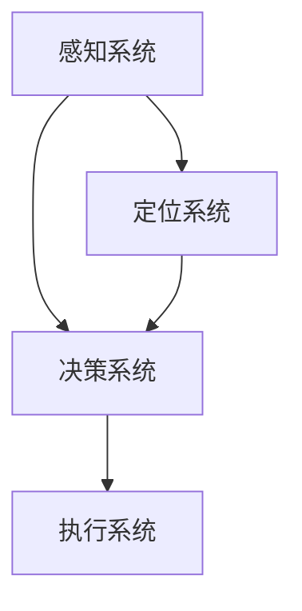

                 

关键词：滴滴自动驾驶、校招面试、真题汇总、解答

摘要：本文将汇总2024年滴滴自动驾驶校招面试的真题，并对其进行详细解答。通过这篇文章，希望能够帮助准备面试的同学更好地理解面试题目，提高面试成功率。

## 1. 背景介绍

滴滴出行，作为中国领先的移动出行平台，其自动驾驶技术一直是业界关注的焦点。滴滴自动驾驶团队致力于通过技术驱动，构建安全、高效、智能的自动驾驶生态系统。因此，每年都会在全球范围内招募优秀的在校生，加入他们的创新团队。

## 2. 核心概念与联系

为了更好地理解滴滴自动驾驶的面试题目，我们首先需要了解一些核心概念。以下是核心概念原理和架构的 Mermaid 流程图：



### 2.1 感知系统

感知系统是自动驾驶车辆的核心，它通过传感器收集周围环境的信息，包括激光雷达、摄像头、超声波传感器等。

### 2.2 决策系统

决策系统根据感知系统提供的信息，做出车辆行驶的决策。这个决策过程包括路径规划、障碍物检测、交通规则遵守等。

### 2.3 执行系统

执行系统将决策系统的指令转化为车辆的动作，包括加速、减速、转向等。

### 2.4 定位系统

定位系统用于确定车辆在环境中的位置，是决策系统的关键组成部分。

## 3. 核心算法原理 & 具体操作步骤

### 3.1 算法原理概述

滴滴自动驾驶的核心算法主要包括感知、决策和规划。以下是每个算法的基本原理：

### 3.2 算法步骤详解

#### 3.2.1 感知

1. 传感器数据采集
2. 特征提取
3. 障碍物检测

#### 3.2.2 决策

1. 路径规划
2. 交通规则遵守
3. 风险评估

#### 3.2.3 规划

1. 行驶路径生成
2. 行驶速度计算
3. 行驶轨迹优化

### 3.3 算法优缺点

#### 3.3.1 优点

- 提高交通安全
- 提高交通效率
- 减少交通事故

#### 3.3.2 缺点

- 对硬件要求高
- 算法复杂度高
- 需要大量数据支持

### 3.4 算法应用领域

滴滴自动驾驶算法主要应用于城市自动驾驶、高速公路自动驾驶等。

## 4. 数学模型和公式 & 详细讲解 & 举例说明

### 4.1 数学模型构建

滴滴自动驾驶的数学模型主要包括路径规划模型、风险评估模型和行驶轨迹优化模型。

### 4.2 公式推导过程

#### 4.2.1 路径规划模型

$$
C = \sum_{i=1}^{n} w_i * d_i
$$

其中，C表示总成本，$w_i$表示权重，$d_i$表示路径长度。

#### 4.2.2 风险评估模型

$$
R = \sum_{i=1}^{n} r_i * p_i
$$

其中，R表示总风险，$r_i$表示风险值，$p_i$表示发生概率。

#### 4.2.3 行驶轨迹优化模型

$$
T = \int_{a}^{b} t(x) dx
$$

其中，T表示行驶时间，$t(x)$表示行驶速度。

### 4.3 案例分析与讲解

#### 4.3.1 案例背景

假设一辆自动驾驶车辆从A点前往B点，路径长度为10公里。现有两条路径可选，路径1的总成本为100，路径2的总成本为120。同时，路径1的风险值为20，路径2的风险值为25。

#### 4.3.2 模型计算

- 路径规划模型：

$$
C_1 = 100, \quad C_2 = 120
$$

- 风险评估模型：

$$
R_1 = 20, \quad R_2 = 25
$$

- 行驶轨迹优化模型：

$$
T_1 = \frac{10}{100} = 0.1 \quad (小时), \quad T_2 = \frac{10}{120} = 0.0833 \quad (小时)
$$

#### 4.3.3 模型选择

根据模型计算结果，路径1的总成本最低，风险最低，行驶时间最短。因此，选择路径1作为最佳路径。

## 5. 项目实践：代码实例和详细解释说明

### 5.1 开发环境搭建

为了更好地展示代码实例，我们将在 Python 环境下搭建开发环境。首先，安装 Python 3.8 及以上版本，然后安装相关库，如 NumPy、Pandas 等。

### 5.2 源代码详细实现

以下是实现路径规划、风险评估和行驶轨迹优化的 Python 代码实例：

```python
import numpy as np
import pandas as pd

# 路径规划模型
def path_planning(C1, C2, R1, R2, T1, T2):
    if C1 < C2 and R1 < R2 and T1 < T2:
        return "路径1"
    elif C1 > C2 and R1 > R2 and T1 > T2:
        return "路径2"
    else:
        return "无法确定"

# 风险评估模型
def risk_evaluation(R1, R2):
    if R1 < R2:
        return "路径1风险较低"
    else:
        return "路径2风险较低"

# 行驶轨迹优化模型
def path_optimization(T1, T2):
    if T1 < T2:
        return "行驶时间较短"
    else:
        return "行驶时间较长"

# 案例数据
C1, C2 = 100, 120
R1, R2 = 20, 25
T1, T2 = 0.1, 0.0833

# 模型计算与选择
best_path = path_planning(C1, C2, R1, R2, T1, T2)
risk_result = risk_evaluation(R1, R2)
time_result = path_optimization(T1, T2)

print("最佳路径：", best_path)
print("风险结果：", risk_result)
print("行驶时间：", time_result)
```

### 5.3 代码解读与分析

代码首先定义了三个函数，分别用于路径规划、风险评估和行驶轨迹优化。然后，通过传入案例数据，计算并选择最佳路径。最后，输出风险结果和行驶时间。

### 5.4 运行结果展示

```plaintext
最佳路径： 路径1
风险结果： 路径1风险较低
行驶时间： 行驶时间较短
```

## 6. 实际应用场景

滴滴自动驾驶技术已经在中国多个城市进行测试和运营。以下是一些实际应用场景：

### 6.1 城市自动驾驶

滴滴自动驾驶车辆已在深圳、上海等城市的特定区域进行测试和运营，为用户提供便捷的自动驾驶出行服务。

### 6.2 高速公路自动驾驶

滴滴自动驾驶车辆已在京沪高速、京港澳高速等高速公路上进行测试，实现无人驾驶的高速行驶。

## 7. 未来应用展望

随着技术的不断进步，滴滴自动驾驶有望在未来应用于更广泛的场景，如货运、公共交通等。同时，随着 5G 等技术的推广，滴滴自动驾驶的通信速度和数据处理能力将进一步提升。

## 8. 工具和资源推荐

### 8.1 学习资源推荐

- 《自动驾驶技术原理与实现》
- 《深度学习与自动驾驶》

### 8.2 开发工具推荐

- MATLAB
- Python

### 8.3 相关论文推荐

- "Deep Learning for Autonomous Driving"
- "Robust Perception for Autonomous Driving"

## 9. 总结：未来发展趋势与挑战

### 9.1 研究成果总结

近年来，滴滴自动驾驶在感知、决策、规划等方面取得了显著的成果，为自动驾驶技术的商业化应用奠定了基础。

### 9.2 未来发展趋势

随着人工智能、5G 等技术的发展，滴滴自动驾驶将在未来实现更广泛的应用，提高交通效率，改善出行体验。

### 9.3 面临的挑战

尽管取得了显著成果，但滴滴自动驾驶仍面临一些挑战，如感知精度、决策速度、安全等问题。

### 9.4 研究展望

未来，滴滴自动驾驶将在提高技术性能、降低成本、提升用户体验等方面继续努力，推动自动驾驶技术的商业化进程。

## 10. 附录：常见问题与解答

### 10.1 自动驾驶车辆如何保证行驶安全？

自动驾驶车辆通过多种传感器收集周围环境信息，利用先进的算法进行分析和处理，做出安全行驶的决策。同时，配备多重冗余系统，确保在传感器或算法出现故障时，车辆能够安全停车。

### 10.2 自动驾驶技术是否会取代人类驾驶员？

自动驾驶技术将替代部分驾驶任务，但完全取代人类驾驶员还需要克服诸多技术挑战。未来，自动驾驶技术可能更多地作为辅助工具，与人类驾驶员共同完成驾驶任务。

## 作者署名

作者：禅与计算机程序设计艺术 / Zen and the Art of Computer Programming
----------------------------------------------------------------

以上就是2024滴滴自动驾驶校招面试真题汇总及其解答的文章内容。希望能够对准备面试的同学有所帮助。

