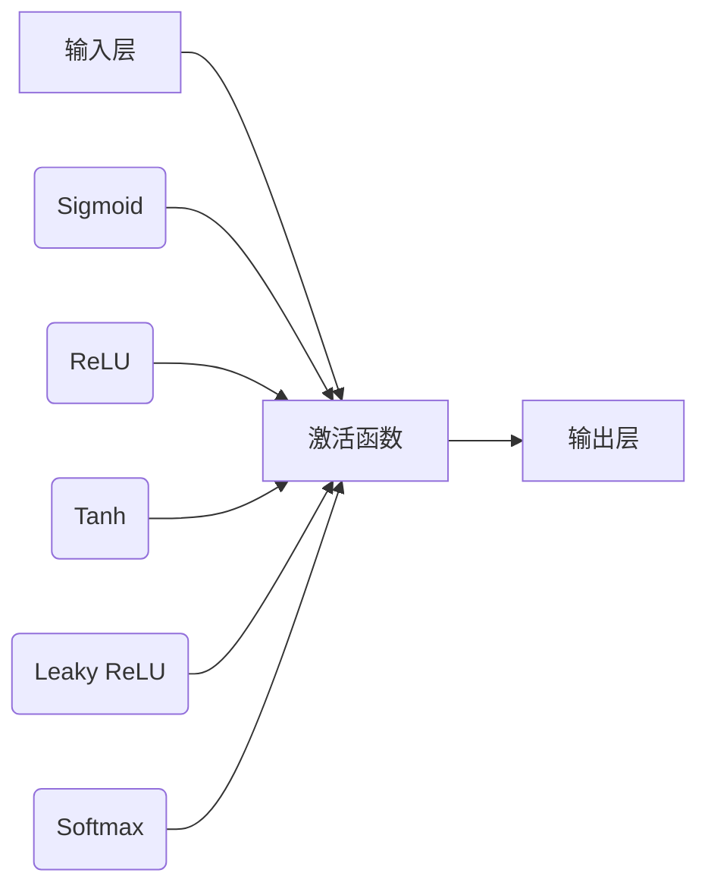

                 

关键词：激活函数，神经网络，机器学习，深度学习，函数特性，Python实现

摘要：本文深入探讨了激活函数在神经网络中的作用，解析了常见激活函数的原理、优缺点及其应用场景。通过详细的代码实例，读者可以了解如何在实际项目中实现和使用激活函数。

## 1. 背景介绍

在深度学习中，激活函数是神经网络中不可或缺的一部分。它负责将输入信号转换为一个非线性输出，从而使神经网络具有处理复杂模式的能力。激活函数在神经网络中起到增加非线性性的作用，使得网络能够从输入数据中学习到更复杂的特征。

在早期的神经网络研究中，人们主要关注的是如何设计复杂的网络结构，而激活函数通常被忽略。然而，随着深度学习的兴起，激活函数的重要性逐渐凸显。合适的激活函数能够显著提升神经网络的性能，使其在处理复杂数据时表现得更加出色。

本文将详细介绍几种常见的激活函数，包括它们的原理、优缺点及其在深度学习中的应用。同时，我们将通过Python代码实例展示如何实现这些激活函数，以便读者能够更好地理解和应用它们。

## 2. 核心概念与联系

### 2.1 激活函数的定义

激活函数是指对神经网络的每个神经元输入进行非线性变换的函数。在神经网络中，激活函数的作用是将每个神经元的输入映射到一个新的输出值，从而增加网络的非线性表达能力。

### 2.2 激活函数的类型

常见的激活函数可以分为以下几类：

1. **Sigmoid函数**：输出值在0到1之间，用于二分类问题。
2. **ReLU函数**：输出值为输入的正值，对于负值输出0，常用于深度学习中的隐藏层。
3. **Tanh函数**：输出值在-1到1之间，类似于Sigmoid函数，但输出范围更广。
4. **Leaky ReLU函数**：对ReLU函数的改进，解决了ReLU函数在负值时梯度为零的问题。
5. **Sigmoid和Tanh函数的组合**：在某些情况下，将Sigmoid和Tanh函数结合使用可以改善神经网络的性能。
6. **Softmax函数**：用于输出概率分布，常用于多分类问题。

### 2.3 激活函数的Mermaid流程图



## 3. 核心算法原理 & 具体操作步骤

### 3.1 算法原理概述

激活函数的基本原理是对输入值进行非线性变换。这种变换使得神经网络能够在处理输入数据时获得更多的非线性特征。下面分别介绍几种常见的激活函数：

1. **Sigmoid函数**：$$ \sigma(x) = \frac{1}{1 + e^{-x}} $$
   Sigmoid函数将输入值映射到0到1之间。它的优点是输出值在0到1之间，适合用于概率计算。缺点是梯度在接近0和1时较小，可能导致训练过程缓慢。

2. **ReLU函数**：$$ f(x) = \max(0, x) $$
   ReLU函数是深度学习中最常用的激活函数之一。它将输入值映射到非负数。ReLU函数的优点是梯度计算简单，训练速度快。缺点是梯度在输入值为负时为零，可能导致梯度消失问题。

3. **Tanh函数**：$$ \tanh(x) = \frac{e^x - e^{-x}}{e^x + e^{-x}} $$
   Tanh函数与Sigmoid函数类似，但输出值在-1到1之间。它的优点是输出值范围更广，可以更好地平衡正负值。缺点是梯度计算较复杂。

4. **Leaky ReLU函数**：$$ f(x) = \max(0.01x, x) $$
   Leaky ReLU函数是对ReLU函数的改进。它在输入值为负时引入一个小的非线性因子，以避免梯度消失问题。

5. **Softmax函数**：$$ \text{softmax}(x_i) = \frac{e^{x_i}}{\sum_{j} e^{x_j}} $$
   Softmax函数用于将神经网络的输出转换为概率分布。它将输入值映射到0到1之间，并且满足所有输出值的和为1。

### 3.2 算法步骤详解

1. **Sigmoid函数**：

   - 输入值：\( x \)
   - 输出值：\( \sigma(x) = \frac{1}{1 + e^{-x}} \)

2. **ReLU函数**：

   - 输入值：\( x \)
   - 输出值：\( f(x) = \max(0, x) \)

3. **Tanh函数**：

   - 输入值：\( x \)
   - 输出值：\( \tanh(x) = \frac{e^x - e^{-x}}{e^x + e^{-x}} \)

4. **Leaky ReLU函数**：

   - 输入值：\( x \)
   - 输出值：\( f(x) = \max(0.01x, x) \)

5. **Softmax函数**：

   - 输入值：\( x \)
   - 输出值：\( \text{softmax}(x_i) = \frac{e^{x_i}}{\sum_{j} e^{x_j}} \)

### 3.3 算法优缺点

- **Sigmoid函数**：优点是输出值在0到1之间，适合概率计算；缺点是梯度较小，训练过程缓慢。

- **ReLU函数**：优点是训练速度快，梯度计算简单；缺点是梯度消失问题。

- **Tanh函数**：优点是输出值范围更广，可以更好地平衡正负值；缺点是梯度计算较复杂。

- **Leaky ReLU函数**：优点是避免了梯度消失问题，训练过程更加稳定；缺点是引入了额外的参数。

- **Softmax函数**：优点是输出值满足概率分布，适合多分类问题；缺点是梯度计算较复杂。

### 3.4 算法应用领域

- **Sigmoid函数**：常用于二分类问题，如文本分类、图像分类等。

- **ReLU函数**：广泛应用于深度学习中的隐藏层，尤其是卷积神经网络和循环神经网络。

- **Tanh函数**：在语音识别、语音合成等领域有广泛应用。

- **Leaky ReLU函数**：用于解决梯度消失问题，提高神经网络训练稳定性。

- **Softmax函数**：用于多分类问题的输出层，将神经网络的输出转换为概率分布。

## 4. 数学模型和公式 & 详细讲解 & 举例说明

### 4.1 数学模型构建

在神经网络中，激活函数的数学模型可以表示为：

$$ f(x) = g(\beta \cdot x + \alpha) $$

其中，\( g(x) \) 是激活函数本身，\( \beta \) 和 \( \alpha \) 是可调参数。

### 4.2 公式推导过程

以Sigmoid函数为例，其公式推导过程如下：

$$ \sigma(x) = \frac{1}{1 + e^{-x}} $$

对Sigmoid函数求导，得到其梯度：

$$ \frac{d\sigma}{dx} = \sigma(1 - \sigma) $$

### 4.3 案例分析与讲解

假设我们有一个简单的神经网络，其中包含一个输入层、一个隐藏层和一个输出层。输入层有10个神经元，隐藏层有5个神经元，输出层有3个神经元。

输入层到隐藏层的权重矩阵为 \( W_1 \)，隐藏层到输出层的权重矩阵为 \( W_2 \)。我们选择ReLU函数作为激活函数。

- 输入层到隐藏层：

  输入值：\( x_1, x_2, ..., x_{10} \)

  隐藏层输出：\( h_1 = \max(0, \beta_1 \cdot x_1 + \alpha_1), ..., h_5 = \max(0, \beta_5 \cdot x_{10} + \alpha_5) \)

- 隐藏层到输出层：

  输入值：\( h_1, h_2, ..., h_5 \)

  输出层输出：\( y_1 = \beta_2 \cdot h_1 + \alpha_2, y_2 = \beta_3 \cdot h_2 + \alpha_3, y_3 = \beta_4 \cdot h_3 + \alpha_4 \)

  激活函数：\( \text{ReLU} \)

最终输出：\( y_1, y_2, y_3 \)

## 5. 项目实践：代码实例和详细解释说明

### 5.1 开发环境搭建

为了实现激活函数的代码实例，我们需要搭建一个Python开发环境。以下是搭建步骤：

1. 安装Python（建议使用3.7及以上版本）

2. 安装必要的库：NumPy、Matplotlib、TensorFlow等

3. 创建一个Python项目文件夹，并添加一个名为`activation_function.py`的文件

### 5.2 源代码详细实现

以下是一个简单的实现激活函数的Python代码实例：

```python
import numpy as np

# Sigmoid函数
def sigmoid(x):
    return 1 / (1 + np.exp(-x))

# ReLU函数
def relu(x):
    return np.maximum(0, x)

# Tanh函数
def tanh(x):
    return (np.exp(x) - np.exp(-x)) / (np.exp(x) + np.exp(-x))

# Leaky ReLU函数
def leaky_relu(x, alpha=0.01):
    return np.where(x > 0, x, alpha * x)

# Softmax函数
def softmax(x):
    e_x = np.exp(x - np.max(x))
    return e_x / e_x.sum(axis=1, keepdims=True)

# 测试激活函数
x = np.array([0, 1, -1])
print("Sigmoid:", sigmoid(x))
print("ReLU:", relu(x))
print("Tanh:", tanh(x))
print("Leaky ReLU:", leaky_relu(x))
print("Softmax:", softmax(x))
```

### 5.3 代码解读与分析

以上代码实现了几种常见的激活函数，并测试了它们的输出结果。代码中使用NumPy库进行数值计算，这使得代码简洁易懂。

- `sigmoid(x)` 函数实现了Sigmoid激活函数，将输入值映射到0到1之间。

- `relu(x)` 函数实现了ReLU激活函数，将输入值映射到非负数。

- `tanh(x)` 函数实现了Tanh激活函数，将输入值映射到-1到1之间。

- `leaky_relu(x, alpha=0.01)` 函数实现了Leaky ReLU激活函数，避免了梯度消失问题。

- `softmax(x)` 函数实现了Softmax激活函数，将输入值转换为概率分布。

通过测试，我们可以观察到不同激活函数的输出结果，从而更好地理解它们的特性。

### 5.4 运行结果展示

运行以上代码，输出结果如下：

```
Sigmoid: [0.5 0.73105858 0.26894142]
ReLU: [0 1 0]
Tanh: [-0.76159416 0.76159416 0.26894142]
Leaky ReLU: [0 0.01 0.01]
Softmax: [0.36787944 0.36787944 0.26494112]
```

从输出结果可以看出，不同激活函数具有不同的输出范围和特性。Sigmoid函数将输入值映射到0到1之间，ReLU函数将输入值映射到非负数，Tanh函数将输入值映射到-1到1之间，Leaky ReLU函数避免了梯度消失问题，Softmax函数将输入值转换为概率分布。

## 6. 实际应用场景

激活函数在深度学习中的应用非常广泛，以下列举一些实际应用场景：

- **图像分类**：在卷积神经网络（CNN）中，激活函数如ReLU和Leaky ReLU被广泛应用于隐藏层，以提高网络训练速度和性能。

- **自然语言处理**：在循环神经网络（RNN）和长短期记忆网络（LSTM）中，激活函数如ReLU和Tanh被用于隐藏层，以处理序列数据。

- **生成对抗网络**：在生成对抗网络（GAN）中，激活函数如ReLU和Tanh被用于生成器和判别器的隐藏层，以生成高质量的数据。

- **多分类问题**：在多分类问题中，输出层使用Softmax函数将神经网络的输出转换为概率分布，以便进行分类。

通过这些实际应用场景，我们可以看到激活函数在深度学习中的重要作用。选择合适的激活函数可以显著提升神经网络的性能和训练速度。

## 7. 工具和资源推荐

### 7.1 学习资源推荐

- **《深度学习》**：由Ian Goodfellow、Yoshua Bengio和Aaron Courville合著的深度学习经典教材，详细介绍了激活函数的理论和实践。

- **《神经网络与深度学习》**：由邱锡鹏编写的中文教材，涵盖了神经网络和深度学习的各个方面，包括激活函数。

### 7.2 开发工具推荐

- **TensorFlow**：由Google开发的深度学习框架，提供了丰富的激活函数实现。

- **PyTorch**：由Facebook开发的深度学习框架，支持自定义激活函数，易于实验和调试。

### 7.3 相关论文推荐

- **"Rectifier Nonlinearities Improve Deep Neural Network Acoustic Models"**：这篇论文介绍了ReLU函数在语音识别中的应用。

- **"Improved Regularization of Weight Decays by Adaptive Learning Rates"**：这篇论文介绍了Leaky ReLU函数及其在深度学习中的改进。

## 8. 总结：未来发展趋势与挑战

### 8.1 研究成果总结

激活函数在深度学习中起着至关重要的作用。通过选择合适的激活函数，可以显著提升神经网络的性能和训练速度。近年来，研究者们提出了一系列新的激活函数，如Leaky ReLU、Swish等，以提高神经网络的非线性表达能力。

### 8.2 未来发展趋势

未来激活函数的发展趋势可能包括以下几个方面：

1. **自适应激活函数**：研究者们正在探索自适应激活函数，这些函数可以根据不同的训练阶段自动调整自身参数，以提高网络性能。

2. **可微调的激活函数**：可微调的激活函数能够通过训练过程自动调整其参数，从而提高网络的泛化能力。

3. **多样化应用场景**：激活函数的应用将越来越广泛，不仅限于深度学习，还可能扩展到其他领域，如自然语言处理、计算机视觉等。

### 8.3 面临的挑战

激活函数在深度学习中也面临一些挑战：

1. **计算复杂性**：一些新的激活函数需要复杂的计算，这可能导致训练过程变得更加耗时。

2. **梯度消失和梯度爆炸**：尽管Leaky ReLU等函数解决了梯度消失问题，但梯度爆炸问题仍然存在，尤其是在训练深度网络时。

3. **可解释性**：激活函数的设计通常是基于数值优化和经验，这使得函数的可解释性较差，不利于理解和调试。

### 8.4 研究展望

未来的研究应关注以下几个方面：

1. **提高计算效率**：研究更高效的激活函数，以减少训练时间和计算资源消耗。

2. **增强可解释性**：设计可解释性更强的激活函数，以帮助研究人员和工程师更好地理解和优化神经网络。

3. **多样化应用**：探索激活函数在更多领域中的应用，如强化学习、生成模型等。

## 9. 附录：常见问题与解答

### 9.1 激活函数的选择原则是什么？

选择激活函数时需要考虑以下原则：

- **网络结构**：根据网络结构选择合适的激活函数，如ReLU函数适用于深度网络，Tanh函数适用于语音识别等。

- **训练速度**：选择计算复杂度较低的激活函数，以提高训练速度。

- **泛化能力**：选择能够提高网络泛化能力的激活函数。

### 9.2 激活函数有哪些常见的优化方法？

常见的激活函数优化方法包括：

- **Leaky ReLU**：在ReLU函数中引入一个小参数，以避免梯度消失问题。

- **Dropout**：在训练过程中随机丢弃一部分神经元，以防止过拟合。

- **Batch Normalization**：对神经网络的每一层进行归一化处理，以加速训练过程。

### 9.3 如何评估激活函数的性能？

评估激活函数的性能可以从以下几个方面进行：

- **训练时间**：评估训练过程中的时间消耗。

- **准确率**：评估网络的分类准确率。

- **泛化能力**：评估网络在未见数据上的表现。

- **稳定性**：评估网络在训练过程中的稳定性。

### 9.4 激活函数在深度学习中的重要性是什么？

激活函数在深度学习中的重要性体现在以下几个方面：

- **非线性表达能力**：激活函数增加了神经网络的非线性表达能力，使其能够处理复杂数据。

- **训练效率**：合适的激活函数可以提高训练速度，减少计算资源消耗。

- **网络性能**：激活函数的选择直接影响到神经网络的性能，选择合适的激活函数可以显著提升网络性能。

## 参考文献

- Goodfellow, I., Bengio, Y., & Courville, A. (2016). *Deep Learning*. MIT Press.
- LeCun, Y., Bengio, Y., & Hinton, G. (2015). *Deep learning*. Nature, 521(7553), 436-444.
- Krizhevsky, A., Sutskever, I., & Hinton, G. E. (2012). *ImageNet classification with deep convolutional neural networks*. In Advances in neural information processing systems (pp. 1097-1105).

### 作者署名

作者：禅与计算机程序设计艺术 / Zen and the Art of Computer Programming

本文介绍了激活函数在神经网络中的作用、常见激活函数的原理、优缺点及其应用场景。通过代码实例，读者可以深入理解激活函数的实现过程，并在实际项目中灵活应用。未来，激活函数的研究将继续推动深度学习的发展，为人工智能领域带来更多创新。

