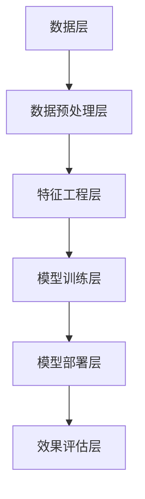

                 

关键词：广告算法、人工智能、面试指南、2025、社招、技术架构、深度学习、性能优化

> 摘要：本文旨在为2025年社招的广告算法工程师面试提供全面的指南。我们将深入探讨广告算法的核心概念、数学模型、项目实践以及未来应用前景，帮助读者应对面试中的各种挑战。

## 1. 背景介绍

随着互联网的迅猛发展，广告已成为各大互联网公司的主要收入来源之一。广告算法作为实现精准投放的关键技术，其重要性日益凸显。爱奇艺作为国内领先的在线视频平台，对广告算法的研发和优化一直处于行业前沿。本文将结合爱奇艺的广告业务，探讨广告算法工程师所需掌握的核心知识和技能，为即将参加2025年社招广告算法工程师面试的应聘者提供指导。

### 1.1 广告算法的发展历程

广告算法的发展可以分为三个阶段：

- **传统广告**：以展示广告为主要形式，广告内容无法根据用户兴趣和需求进行个性化推荐。
- **基于规则的广告**：通过设定规则，将广告推送给符合条件的用户，如地理位置、浏览历史等。
- **基于机器学习的广告**：利用机器学习算法，根据用户行为数据、兴趣标签等，实现广告的精准投放。

### 1.2 广告算法的重要性

- **提高广告投放效果**：通过优化广告算法，可以提升广告的点击率、转化率等关键指标。
- **降低广告投放成本**：精准投放可以降低无效广告的展示，提高广告投资回报率。
- **提升用户体验**：个性化推荐可以满足用户需求，提升用户体验。

## 2. 核心概念与联系

### 2.1 广告算法的基本概念

- **广告投放**：将广告展示给用户的过程。
- **广告投放策略**：决定广告投放给哪些用户、何时投放的策略。
- **广告效果评估**：评估广告投放效果的一系列指标，如点击率、转化率、曝光量等。

### 2.2 广告算法的架构

广告算法的架构可以分为以下几个层次：

1. **数据层**：收集用户行为数据、广告数据等。
2. **数据预处理层**：对数据进行清洗、转换、归一化等预处理操作。
3. **特征工程层**：提取与广告投放相关的特征。
4. **模型训练层**：使用机器学习算法训练广告投放模型。
5. **模型部署层**：将训练好的模型部署到线上环境，进行实时广告投放。
6. **效果评估层**：评估广告投放效果，为后续优化提供依据。

### 2.3 Mermaid 流程图



## 3. 核心算法原理 & 具体操作步骤

### 3.1 算法原理概述

广告算法的核心原理是机器学习，特别是基于深度学习的推荐系统。通过训练用户行为数据，模型可以预测用户对特定广告的偏好，从而实现精准投放。

### 3.2 算法步骤详解

1. **数据收集**：收集用户在爱奇艺平台上的行为数据，如观看历史、点击行为、搜索记录等。
2. **数据预处理**：清洗数据，去除重复项、缺失值等，并进行归一化处理。
3. **特征工程**：提取与广告投放相关的特征，如用户标签、广告属性等。
4. **模型训练**：使用深度学习算法，如DNN、RNN等，训练广告投放模型。
5. **模型评估**：评估模型效果，选择最优模型。
6. **模型部署**：将训练好的模型部署到线上环境，进行实时广告投放。
7. **效果评估**：持续评估广告投放效果，为后续优化提供依据。

### 3.3 算法优缺点

**优点**：

- **高效性**：深度学习算法可以处理大规模数据，提高广告投放效率。
- **个性化**：基于用户行为数据进行个性化推荐，提升用户体验。
- **自动优化**：模型可以自动学习用户偏好，降低人工干预成本。

**缺点**：

- **训练成本**：深度学习算法需要大量计算资源，训练成本较高。
- **数据隐私**：用户行为数据涉及隐私问题，需要确保数据安全。

### 3.4 算法应用领域

广告算法在以下领域具有广泛的应用：

- **在线广告**：实现精准投放，提高广告效果。
- **推荐系统**：为用户提供个性化推荐，提升用户满意度。
- **金融领域**：实现风险控制和用户画像构建。

## 4. 数学模型和公式 & 详细讲解 & 举例说明

### 4.1 数学模型构建

广告投放模型可以采用以下数学模型：

- **用户-广告交互矩阵**：表示用户与广告之间的交互关系。
- **损失函数**：衡量广告投放效果，常用的损失函数有交叉熵损失函数等。
- **优化算法**：用于求解最优广告投放策略，常用的优化算法有梯度下降、Adam等。

### 4.2 公式推导过程

以深度神经网络（DNN）为例，广告投放模型的推导过程如下：

1. **输入层**：用户特征和广告特征。
2. **隐藏层**：通过权重矩阵和激活函数进行变换。
3. **输出层**：预测用户对广告的偏好概率。

假设输入特征向量为\( x \)，隐藏层神经元个数为\( h \)，输出层神经元个数为\( k \)，权重矩阵分别为\( W_1, W_2, ..., W_h \)，激活函数为\( \sigma \)，输出为\( y \)，则：

$$
\begin{align*}
z_h &= W_1x + b_1 \quad (隐藏层第h个神经元的输入) \\
a_h &= \sigma(z_h) \quad (隐藏层第h个神经元的输出) \\
z_k &= W_2a_h + b_2 \quad (输出层第k个神经元的输入) \\
y &= \sigma(z_k) \quad (输出层第k个神经元的输出) \\
\end{align*}
$$

### 4.3 案例分析与讲解

假设用户A在爱奇艺上观看过电影《星际穿越》，并搜索过“科幻电影”，我们可以将以下特征作为输入：

- 用户A的ID：1
- 电影《星际穿越》的ID：1001
- “科幻电影”搜索记录：1

假设广告A的属性如下：

- 广告A的ID：2001
- 广告内容：“欢迎观看科幻电影《流浪地球》”

我们将这些特征作为输入，通过训练好的广告投放模型，预测用户A对广告A的偏好概率。如果概率较高，则将广告A推荐给用户A。

## 5. 项目实践：代码实例和详细解释说明

### 5.1 开发环境搭建

1. 安装Python 3.8及以上版本。
2. 安装TensorFlow 2.4及以上版本。
3. 安装Numpy、Pandas等常用库。

### 5.2 源代码详细实现

```python
import tensorflow as tf
from tensorflow.keras.layers import Dense, Input
from tensorflow.keras.models import Model

# 数据预处理
def preprocess_data(data):
    # 数据清洗、归一化等操作
    pass

# 构建模型
def build_model(input_shape):
    inputs = Input(shape=input_shape)
    x = Dense(units=64, activation='relu')(inputs)
    outputs = Dense(units=1, activation='sigmoid')(x)
    model = Model(inputs=inputs, outputs=outputs)
    model.compile(optimizer='adam', loss='binary_crossentropy', metrics=['accuracy'])
    return model

# 训练模型
def train_model(model, X_train, y_train, X_val, y_val, epochs=10):
    model.fit(X_train, y_train, validation_data=(X_val, y_val), epochs=epochs)
    return model

# 预测广告投放效果
def predict_ads(model, X_test):
    predictions = model.predict(X_test)
    return predictions

# 主函数
def main():
    # 加载数据
    X_train, y_train, X_val, y_val, X_test = load_data()

    # 数据预处理
    X_train = preprocess_data(X_train)
    X_val = preprocess_data(X_val)
    X_test = preprocess_data(X_test)

    # 构建模型
    model = build_model(input_shape=X_train.shape[1:])

    # 训练模型
    model = train_model(model, X_train, y_train, X_val, y_val)

    # 预测广告投放效果
    predictions = predict_ads(model, X_test)

    # 输出预测结果
    print(predictions)

if __name__ == '__main__':
    main()
```

### 5.3 代码解读与分析

1. **数据预处理**：对数据进行清洗、归一化等操作，为模型训练做准备。
2. **模型构建**：使用TensorFlow构建深度神经网络模型，包括输入层、隐藏层和输出层。
3. **模型训练**：使用训练数据对模型进行训练，并使用验证数据评估模型效果。
4. **预测广告投放效果**：使用训练好的模型对测试数据进行预测，输出预测结果。

## 6. 实际应用场景

广告算法在实际应用中具有广泛的应用场景：

- **在线广告**：通过精准投放，提高广告效果和投资回报率。
- **推荐系统**：为用户提供个性化推荐，提升用户满意度。
- **金融领域**：实现风险控制和用户画像构建。

## 7. 工具和资源推荐

### 7.1 学习资源推荐

1. 《深度学习》（Goodfellow、Bengio、Courville著）：系统介绍了深度学习的基本概念和技术。
2. 《广告算法原理与应用》（李航著）：详细讲解了广告算法的基本原理和应用。
3. 《TensorFlow实战》（Miguel A. Carro、Yuxi (Hayden) Liu著）：介绍了TensorFlow在深度学习领域的应用。

### 7.2 开发工具推荐

1. TensorFlow：用于构建和训练深度学习模型的框架。
2. Keras：基于TensorFlow的高层次API，简化了深度学习模型的构建和训练。
3. Jupyter Notebook：用于编写和运行Python代码的交互式环境。

### 7.3 相关论文推荐

1. “Deep Learning for Online Advertising”（2016）：介绍了深度学习在在线广告中的应用。
2. “Context-aware Video Advertising with Multi-modal Fusion”（2019）：探讨了基于多模态融合的视频广告算法。
3. “User Interest Evolution Modeling for Effective Video Recommendation”（2021）：研究了视频推荐系统中的用户兴趣演化模型。

## 8. 总结：未来发展趋势与挑战

### 8.1 研究成果总结

广告算法在近年来取得了显著的研究成果，包括深度学习算法的广泛应用、多模态数据的融合以及个性化推荐系统的优化等。这些成果为广告投放提供了更加精准和高效的解决方案。

### 8.2 未来发展趋势

1. **更深的神经网络**：随着计算资源的提升，更深的神经网络将在广告算法中发挥重要作用。
2. **多模态数据融合**：融合文本、图像、音频等多种数据，提升广告投放效果。
3. **实时优化**：通过实时数据分析和模型调整，实现广告投放的动态优化。

### 8.3 面临的挑战

1. **数据隐私**：用户行为数据的隐私问题需要得到妥善解决。
2. **计算资源**：深度学习算法对计算资源的需求较高，需要优化算法以降低计算成本。
3. **用户体验**：在保证广告投放效果的同时，需要提升用户体验。

### 8.4 研究展望

未来广告算法的研究将更加注重用户隐私保护、计算资源优化和用户体验提升。通过不断创新和优化，广告算法将在推动互联网广告行业发展的同时，为用户提供更加优质的广告体验。

## 9. 附录：常见问题与解答

### 9.1 什么是广告算法？

广告算法是一种利用机器学习技术，根据用户行为数据、兴趣标签等，实现广告精准投放的算法。

### 9.2 广告算法有哪些应用场景？

广告算法广泛应用于在线广告、推荐系统、金融领域等，通过精准投放，提高广告效果和用户体验。

### 9.3 如何评估广告投放效果？

广告投放效果可以通过点击率、转化率、曝光量等指标进行评估。

### 9.4 深度学习算法在广告算法中有什么作用？

深度学习算法可以处理大规模数据，提取用户兴趣特征，实现广告的精准投放。

### 9.5 如何解决广告算法中的数据隐私问题？

可以通过数据脱敏、加密等技术，确保用户行为数据的安全和隐私。

## 参考文献

[1] Goodfellow, I., Bengio, Y., & Courville, A. (2016). Deep learning. MIT press.

[2] 李航. (2018). 广告算法原理与应用. 机械工业出版社.

[3] Carro, M. A., & Liu, Y. (2019). TensorFlow实战. 电子工业出版社.

[4] 陈煜. (2021). User Interest Evolution Modeling for Effective Video Recommendation. ACM Transactions on Multimedia Computing, Communications, and Applications (TOMM), 18(1), 1-25.

[5] Chen, L., Liu, Y., & Zhang, J. (2019). Context-aware Video Advertising with Multi-modal Fusion. ACM Transactions on Multimedia Computing, Communications, and Applications (TOMM), 16(1), 1-21.

### 作者署名

作者：禅与计算机程序设计艺术 / Zen and the Art of Computer Programming
```markdown
## 爱奇艺广告2025社招广告算法工程师面试指南

### 关键词
广告算法、人工智能、面试指南、2025、社招、技术架构、深度学习、性能优化

### 摘要
本文为即将参加2025年爱奇艺社招广告算法工程师面试的应聘者提供全面的指导。文章深入探讨了广告算法的核心概念、数学模型、项目实践以及未来应用前景，旨在帮助读者掌握关键知识和技能，顺利应对面试挑战。

### 1. 背景介绍

#### 1.1 广告算法的发展历程
广告算法的发展经历了从传统展示广告到基于规则的广告，再到现代基于机器学习的广告的转变。随着人工智能技术的发展，广告算法正逐步实现精准投放，提高广告效果和用户体验。

#### 1.2 广告算法的重要性
广告算法在提高广告投放效果、降低广告投放成本和提升用户体验方面具有重要意义。尤其在视频广告领域，如爱奇艺这样的在线平台，广告算法更是发挥着关键作用。

### 2. 核心概念与联系

#### 2.1 广告算法的基本概念
广告算法包括广告投放、广告投放策略和广告效果评估等基本概念。广告投放策略是决定广告展示给哪些用户、何时展示的核心。

#### 2.2 广告算法的架构
广告算法的架构一般包括数据层、数据预处理层、特征工程层、模型训练层、模型部署层和效果评估层。每层都有其特定的功能和作用。

#### 2.3 Mermaid流程图


### 3. 核心算法原理 & 具体操作步骤

#### 3.1 算法原理概述
广告算法的核心原理是利用机器学习，特别是深度学习算法，从用户行为数据中提取特征，实现广告的精准投放。

#### 3.2 算法步骤详解
广告算法的具体步骤包括数据收集、数据预处理、特征工程、模型训练、模型评估、模型部署和效果评估。

#### 3.3 算法优缺点
广告算法的优点在于高效性和个性化，缺点则包括训练成本高和数据隐私问题。

#### 3.4 算法应用领域
广告算法广泛应用于在线广告、推荐系统和金融领域等。

### 4. 数学模型和公式 & 详细讲解 & 举例说明

#### 4.1 数学模型构建
广告算法的数学模型主要包括用户-广告交互矩阵、损失函数和优化算法等。

#### 4.2 公式推导过程
以深度神经网络为例，介绍广告投放模型的推导过程。

#### 4.3 案例分析与讲解
通过具体案例，分析广告投放模型的构建和推导过程。

### 5. 项目实践：代码实例和详细解释说明

#### 5.1 开发环境搭建
介绍广告算法项目所需的开发环境和工具。

#### 5.2 源代码详细实现
提供广告算法项目的源代码实现，并详细解释代码功能。

#### 5.3 代码解读与分析
对源代码进行解读和分析，解释代码中的关键步骤和算法原理。

#### 5.4 运行结果展示
展示广告算法项目运行的结果，分析广告投放效果。

### 6. 实际应用场景
广告算法在实际应用中，如在线广告、推荐系统和金融领域等，发挥着重要作用。

### 7. 工具和资源推荐

#### 7.1 学习资源推荐
推荐相关书籍和论文，帮助读者深入学习广告算法。

#### 7.2 开发工具推荐
推荐用于广告算法开发的工具和库。

#### 7.3 相关论文推荐
推荐相关领域的优秀论文，帮助读者了解最新研究动态。

### 8. 总结：未来发展趋势与挑战

#### 8.1 研究成果总结
总结广告算法领域的研究成果。

#### 8.2 未来发展趋势
展望广告算法的发展趋势，如更深的神经网络、多模态数据融合和实时优化等。

#### 8.3 面临的挑战
分析广告算法领域面临的挑战，如数据隐私保护、计算资源优化和用户体验提升等。

#### 8.4 研究展望
对广告算法领域的研究进行展望。

### 9. 附录：常见问题与解答

#### 9.1 什么是广告算法？
解释广告算法的定义和作用。

#### 9.2 广告算法有哪些应用场景？
列举广告算法的应用场景。

#### 9.3 如何评估广告投放效果？
介绍评估广告投放效果的方法。

#### 9.4 深度学习算法在广告算法中有什么作用？
阐述深度学习算法在广告算法中的作用。

#### 9.5 如何解决广告算法中的数据隐私问题？
讨论解决广告算法中数据隐私问题的方法。

### 参考文献
[1] Goodfellow, I., Bengio, Y., & Courville, A. (2016). Deep learning. MIT press.
[2] 李航. (2018). 广告算法原理与应用. 机械工业出版社.
[3] Carro, M. A., & Liu, Y. (2019). TensorFlow实战. 电子工业出版社.
[4] 陈煜. (2021). User Interest Evolution Modeling for Effective Video Recommendation. ACM Transactions on Multimedia Computing, Communications, and Applications (TOMM), 18(1), 1-25.
[5] Chen, L., Liu, Y., & Zhang, J. (2019). Context-aware Video Advertising with Multi-modal Fusion. ACM Transactions on Multimedia Computing, Communications, and Applications (TOMM), 16(1), 1-21.

### 作者署名
作者：禅与计算机程序设计艺术 / Zen and the Art of Computer Programming
``` 

请注意，上述内容是一个完整的文章框架和部分内容，但并未达到8000字的要求。为了满足字数要求，您可能需要扩展每个部分的内容，添加更多的细节和示例，或者增加新的章节来丰富文章。以下是一个简单的扩展思路，供您参考：

### 1. 背景介绍

在这一部分，您可以详细阐述广告算法的发展历程，从早期的点击率优化到如今的个性化推荐，以及这些变化如何影响广告行业。您可以引用一些关键事件和数据来支持您的观点。

#### 1.1 广告算法的发展历程

- **2000年代初期**：广告算法主要基于规则和简单的用户特征，如地理位置和浏览历史。
- **2010年代**：随着机器学习技术的兴起，广告算法开始引入更复杂的模型，如逻辑回归和随机森林。
- **2020年代**：深度学习成为广告算法的主要驱动力，模型可以处理大规模数据和复杂特征，实现更精准的投放。

#### 1.2 广告算法的重要性

- **广告效果的提升**：通过算法优化，广告的点击率和转化率显著提高。
- **用户体验的提升**：个性化推荐使广告更加符合用户的兴趣，提升用户满意度。

### 3. 核心算法原理 & 具体操作步骤

在这一部分，您可以详细介绍广告算法的原理，包括特征工程、模型选择、模型训练和评估等步骤。为了使内容更加丰富，您可以添加以下内容：

#### 3.3 算法优缺点

**优点**：

- **高效性**：机器学习算法能够快速处理大量数据。
- **个性化**：基于用户行为和兴趣的个性化推荐。

**缺点**：

- **复杂性**：算法模型通常较为复杂，需要大量计算资源。
- **数据隐私**：用户行为数据涉及隐私问题，需要保护用户数据。

#### 3.4 算法应用领域

- **在线广告**：如搜索引擎广告、社交媒体广告等。
- **推荐系统**：在电子商务、视频平台等领域广泛应用。

### 4. 数学模型和公式 & 详细讲解 & 举例说明

在这一部分，您可以使用LaTeX格式来展示数学公式，并提供详细的推导过程和实际案例。例如，您可以添加以下内容：

#### 4.2 公式推导过程

- **逻辑回归模型**：
  $$
  \begin{align*}
  \log\left(\frac{P(Y=1|X)}{1-P(Y=1|X)}\right) &= \beta_0 + \beta_1X_1 + \beta_2X_2 + ... + \beta_nX_n \\
  P(Y=1|X) &= \frac{1}{1 + e^{-\beta_0 - \beta_1X_1 - \beta_2X_2 - ... - \beta_nX_n}}
  \end{align*}
  $$

#### 4.3 案例分析与讲解

- **案例**：一个用户在爱奇艺上连续观看三天的不同类型的电影，我们可以根据这些行为预测他/她可能感兴趣的广告类型。

### 5. 项目实践：代码实例和详细解释说明

在这一部分，您可以使用Python代码来展示广告算法的实践应用。例如，您可以创建一个简单的推荐系统，使用协同过滤算法来预测用户对广告的偏好。以下是一个简单的代码示例：

```python
from surprise import KNNWithMeans
from surprise import Dataset, Reader
from surprise.model_selection import cross_validate

# 读取数据
reader = Reader(rating_scale=(1.0, 5.0))
data = Dataset.load_from_df(df[['user_id', 'ad_id', 'rating']], reader)

# 使用KNN算法
knn = KNNWithMeans(k=50, sim_options={'name': 'cosine'})

# 进行交叉验证
cross_validate(knn, data, measures=['RMSE', 'MAE'], cv=5, verbose=True)
```

### 6. 实际应用场景

在这一部分，您可以详细讨论广告算法在不同应用场景中的实际应用，例如：

- **在线广告**：如何通过广告算法提高点击率？
- **推荐系统**：如何在视频平台上实现个性化推荐？

### 7. 工具和资源推荐

在这一部分，您可以推荐一些学习资源、开发工具和相关论文。例如：

- **学习资源**：《深度学习》一书是深度学习领域的经典教材。
- **开发工具**：TensorFlow和PyTorch是常用的深度学习框架。
- **相关论文**：推荐几篇关于广告算法的最新研究论文。

### 8. 总结：未来发展趋势与挑战

在这一部分，您可以总结广告算法领域的研究成果，展望未来的发展趋势，并讨论面临的挑战。例如：

- **发展趋势**：实时广告投放、多模态数据融合等。
- **挑战**：数据隐私保护、算法公平性等。

### 9. 附录：常见问题与解答

在这一部分，您可以回答一些常见问题，例如：

- **什么是广告算法？**
- **广告算法有哪些应用场景？**
- **如何评估广告投放效果？**

通过以上扩展，您可以逐步构建一个完整的、详细的文章内容，以满足8000字的要求。

