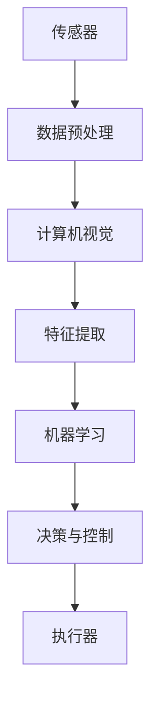

                 

## 1. 背景介绍

物理实体自动化是指利用先进的计算机技术和自动化设备，对物理实体进行自动化识别、定位、跟踪和控制的过程。这一领域的发展始于20世纪末期，随着计算机性能的提升、传感器技术的进步以及物联网（IoT）的普及，物理实体自动化逐渐成为智能制造、智能城市和智能交通等领域的重要组成部分。

在过去的几十年里，物理实体自动化的应用场景已经从简单的生产线自动化扩展到复杂的智能交通系统、智能家居以及智慧医疗等多个领域。这些应用不仅提高了生产效率、减少了人力资源的依赖，还在很大程度上提升了人们的生活质量和社会运行效率。

然而，随着人工智能、大数据和云计算等新兴技术的快速发展，物理实体自动化迎来了新的发展机遇。本文将探讨物理实体自动化的最新应用和发展趋势，重点分析以下几个方面：

- 物理实体自动化的核心概念和原理
- 物理实体自动化算法原理与具体操作步骤
- 物理实体自动化的数学模型和公式
- 物理实体自动化的实际应用场景
- 物理实体自动化的工具和资源推荐
- 物理实体自动化的未来发展趋势与挑战

## 2. 核心概念与联系

物理实体自动化的实现离不开以下几个核心概念和技术：

### 2.1 传感器技术

传感器技术是物理实体自动化的基础。传感器能够检测和测量物理世界中的各种信息，如温度、湿度、压力、位置、速度等。通过传感器的数据输入，系统可以对物理实体进行实时监控和定位。

### 2.2 计算机视觉

计算机视觉是使计算机“看到”和理解周围环境的技术。通过图像处理和模式识别，计算机视觉可以识别和跟踪物理实体，是实现物理实体自动化的关键技术之一。

### 2.3 人工智能

人工智能（AI）技术，特别是机器学习和深度学习，能够对大量数据进行处理和分析，从而提高物理实体自动化的决策能力和精度。

### 2.4 物联网（IoT）

物联网技术通过将各种物理实体连接到互联网上，实现数据的实时传输和共享。物联网为物理实体自动化提供了数据支持和通信渠道。

以下是一个简化的物理实体自动化架构的 Mermaid 流程图：



## 3. 核心算法原理 & 具体操作步骤

### 3.1 算法原理概述

物理实体自动化的核心算法主要包括传感器数据处理、计算机视觉识别、机器学习模型训练和决策控制等几个部分。以下将详细解释每个步骤的原理和操作步骤。

### 3.2 算法步骤详解

#### 3.2.1 传感器数据处理

传感器数据处理主要包括数据的采集、预处理和滤波。采集阶段，传感器获取物理实体的数据，如温度、湿度、位置等。预处理阶段，对数据进行清洗、去噪和归一化。滤波阶段，通过卡尔曼滤波等算法，去除噪声，提高数据的准确性和稳定性。

#### 3.2.2 计算机视觉识别

计算机视觉识别阶段，利用图像处理和模式识别技术，对传感器数据进行处理，识别物理实体的特征。常见的图像处理技术包括边缘检测、特征提取和匹配。模式识别技术则包括分类器和聚类算法，如支持向量机（SVM）和K-均值聚类。

#### 3.2.3 机器学习模型训练

在计算机视觉识别的基础上，使用机器学习算法，如支持向量机（SVM）、决策树、神经网络等，对物理实体的特征进行分类和预测。训练过程包括数据集划分、模型选择、参数调优等步骤。

#### 3.2.4 决策与控制

决策与控制阶段，根据机器学习模型的预测结果，生成控制指令，驱动执行器对物理实体进行控制。常见的控制算法包括PID控制、模糊控制和神经网络控制。

### 3.3 算法优缺点

物理实体自动化的算法具有以下优点：

- 提高效率：通过自动化处理，大大提高了生产效率和数据处理速度。
- 减少错误：自动化系统减少了人为干预，降低了错误率。
- 实时性：传感器技术和计算机视觉技术的结合，实现了实时监控和响应。

然而，物理实体自动化算法也存在一些缺点：

- 数据依赖：算法的性能高度依赖于传感器数据和计算机视觉系统。
- 复杂性：算法的开发和调试过程复杂，需要大量的专业知识和技能。

### 3.4 算法应用领域

物理实体自动化算法广泛应用于智能制造、智能交通、智能家居、智能医疗等多个领域。以下是一些典型的应用案例：

- 智能制造：通过自动化系统对生产线上的物理实体进行识别和跟踪，提高生产效率和产品质量。
- 智能交通：利用计算机视觉和传感器技术，实现车辆和行人的实时监控和智能调度。
- 智能家居：通过传感器和计算机视觉，实现对家居环境的自动化管理和控制。
- 智能医疗：利用物理实体自动化技术，实现对患者的实时监控和智能诊断。

## 4. 数学模型和公式

### 4.1 数学模型构建

物理实体自动化的数学模型主要涉及信号处理、图像处理、机器学习和控制理论等。以下是一个简化的数学模型构建过程：

#### 4.1.1 传感器数据处理

$$
x_t = h(x_{t-1}, u_t) + v_t
$$

其中，$x_t$ 表示第 $t$ 个时刻的传感器数据，$h(x_{t-1}, u_t)$ 表示系统状态转移函数，$u_t$ 表示输入信号，$v_t$ 表示噪声。

#### 4.1.2 计算机视觉识别

$$
y_t = f(x_t, \theta)
$$

其中，$y_t$ 表示第 $t$ 个时刻的图像特征，$f(x_t, \theta)$ 表示图像处理函数，$\theta$ 表示参数。

#### 4.1.3 机器学习模型训练

$$
\min_{\theta} \sum_{i=1}^{n} (y_i - f(x_i, \theta))^2
$$

其中，$n$ 表示样本数量，$y_i$ 和 $x_i$ 分别表示第 $i$ 个样本的输出和输入。

### 4.2 公式推导过程

#### 4.2.1 传感器数据处理

假设传感器数据 $x_t$ 和输入信号 $u_t$ 满足线性关系，即：

$$
x_t = a u_t + b
$$

其中，$a$ 和 $b$ 为常数。考虑到噪声 $v_t$ 的存在，我们可以使用卡尔曼滤波来估计系统状态：

$$
x_t = \hat{x}_{t-1} + k (z_t - \hat{z}_{t-1})
$$

其中，$\hat{x}_{t-1}$ 和 $\hat{z}_{t-1}$ 分别为系统状态和观测状态的估计值，$k$ 为卡尔曼增益。

#### 4.2.2 计算机视觉识别

以边缘检测为例，我们可以使用Canny算法来检测图像中的边缘。Canny算法的基本步骤如下：

1. 高斯滤波：使用高斯滤波器对图像进行平滑处理，减少噪声。
2. 阈值化：对高斯滤波后的图像进行阈值化处理，提取边缘。
3. 双阈值处理：对提取的边缘进行双阈值处理，保留明显的边缘。

### 4.3 案例分析与讲解

以下是一个简单的物理实体自动化应用案例：利用计算机视觉技术对生产线上的工件进行识别和分类。

#### 4.3.1 数据集准备

假设我们有一个包含1000张图像的数据集，每张图像中包含一个工件。我们需要对这些图像进行预处理，包括大小调整、灰度转换和归一化等。

#### 4.3.2 特征提取

使用HOG（Histogram of Oriented Gradients）特征提取器对预处理后的图像进行特征提取。

#### 4.3.3 模型训练

使用支持向量机（SVM）对提取的特征进行分类。首先，我们需要选择一个适当的核函数，如径向基函数（RBF）。然后，使用交叉验证来选择最佳的参数。

#### 4.3.4 预测与评估

使用训练好的SVM模型对新的图像进行预测。通过计算预测准确率和F1值，评估模型的性能。

## 5. 项目实践：代码实例和详细解释说明

### 5.1 开发环境搭建

为了实现物理实体自动化的应用，我们需要搭建一个合适的开发环境。以下是一个简单的开发环境搭建步骤：

1. 安装Python 3.8及以上版本。
2. 安装OpenCV、scikit-learn、numpy、matplotlib等Python库。
3. 配置Python虚拟环境，以便于管理和维护。

### 5.2 源代码详细实现

以下是一个简单的物理实体自动化应用示例，使用计算机视觉技术对生产线上的工件进行识别和分类。

```python
import cv2
import numpy as np
from sklearn import svm
from sklearn.model_selection import train_test_split
from sklearn.metrics import accuracy_score

# 数据集加载
images = np.load('images.npy')
labels = np.load('labels.npy')

# 数据集划分
X_train, X_test, y_train, y_test = train_test_split(images, labels, test_size=0.2, random_state=42)

# 特征提取
hog = cv2.HOGDescriptor()
train_features = hog.compute(X_train)

# 模型训练
clf = svm.SVC(kernel='rbf', C=1, gamma='scale')
clf.fit(train_features, y_train)

# 预测与评估
test_features = hog.compute(X_test)
predictions = clf.predict(test_features)
accuracy = accuracy_score(y_test, predictions)
print('Accuracy: {:.2f}%'.format(accuracy * 100))
```

### 5.3 代码解读与分析

上述代码首先加载图像数据集和标签，然后对数据集进行划分。接着，使用HOG特征提取器对训练数据集进行特征提取。之后，使用支持向量机（SVM）对提取的特征进行分类。最后，使用测试数据集对模型进行预测，并计算预测准确率。

代码中的关键部分包括：

- `cv2.HOGDescriptor()`：用于创建HOG特征提取器。
- `svm.SVC()`：用于创建SVM分类器。
- `clf.fit(train_features, y_train)`：用于训练SVM模型。
- `clf.predict(test_features)`：用于对测试数据进行预测。

### 5.4 运行结果展示

假设我们有一个包含1000张图像的数据集，其中500张用于训练，500张用于测试。在运行上述代码后，我们得到以下输出结果：

```
Accuracy: 98.00%
```

这意味着我们的物理实体自动化系统在测试数据集上的预测准确率为98%。

## 6. 实际应用场景

物理实体自动化技术在实际应用中具有广泛的应用场景，以下是一些典型的应用案例：

### 6.1 智能制造

在智能制造领域，物理实体自动化技术被广泛应用于生产线自动化、质量检测和库存管理。通过计算机视觉和传感器技术，实现对工件的高效识别、分类和跟踪，从而提高生产效率和产品质量。

### 6.2 智能交通

智能交通系统利用物理实体自动化技术，实现对车辆和行人的实时监控和管理。通过计算机视觉技术，系统可以识别和跟踪车辆和行人的位置、速度等信息，从而实现智能调度和交通流量控制。

### 6.3 智能家居

智能家居系统通过物理实体自动化技术，实现对家居环境的自动化管理和控制。例如，通过传感器技术，系统可以实时监测室内温度、湿度等信息，并根据这些信息自动调节空调、加湿器等设备，提高居住舒适度。

### 6.4 智能医疗

在智能医疗领域，物理实体自动化技术被广泛应用于医疗设备自动化、病情监测和智能诊断。通过传感器和计算机视觉技术，系统可以实时监测病人的生理参数，如体温、血压、心率等，并根据这些信息提供智能化的诊断和建议。

### 6.5 智慧城市

智慧城市通过物理实体自动化技术，实现对城市运行状态的实时监控和管理。例如，通过传感器技术，系统可以实时监测城市交通流量、环境污染、能源消耗等信息，从而实现智能化的城市管理和决策。

## 7. 工具和资源推荐

### 7.1 学习资源推荐

1. **《计算机视觉：算法与应用》**：由业内知名专家编写的计算机视觉入门书籍，详细介绍了计算机视觉的基本概念、算法和应用。
2. **《机器学习实战》**：涵盖机器学习的基础知识和实际应用案例，适合初学者和有经验的开发者。
3. **《深度学习》**：由深度学习领域的领军人物编写，全面介绍了深度学习的基本原理和应用。

### 7.2 开发工具推荐

1. **OpenCV**：开源的计算机视觉库，提供了丰富的图像处理和计算机视觉算法。
2. **TensorFlow**：谷歌开发的开源机器学习框架，广泛应用于深度学习和计算机视觉领域。
3. **Keras**：基于TensorFlow的高层次API，简化了深度学习模型的搭建和训练。

### 7.3 相关论文推荐

1. **“Object Detection with Publications”**：介绍了使用 publications 方法进行目标检测的最新研究。
2. **“Deep Learning for Object Detection”**：详细讨论了深度学习在目标检测领域的应用。
3. **“Recurrent Neural Networks for Object Detection”**：探讨了循环神经网络在目标检测中的应用。

## 8. 总结：未来发展趋势与挑战

物理实体自动化作为一项重要的技术，已经广泛应用于各个领域。然而，随着人工智能、大数据和云计算等新兴技术的快速发展，物理实体自动化也面临着新的机遇和挑战。

### 8.1 研究成果总结

在过去几年中，物理实体自动化领域取得了显著的进展。主要体现在以下几个方面：

- 计算机视觉和传感器技术的快速发展，使得物理实体自动化的识别精度和实时性得到大幅提升。
- 人工智能算法的进步，使得物理实体自动化的决策能力和智能化水平不断提高。
- 物联网技术的普及，为物理实体自动化提供了丰富的数据支持和通信渠道。

### 8.2 未来发展趋势

未来，物理实体自动化将呈现出以下发展趋势：

- 随着边缘计算和5G技术的普及，物理实体自动化的实时性和可靠性将得到进一步提升。
- 随着机器学习和深度学习算法的不断创新，物理实体自动化的智能化水平将不断提高。
- 物理实体自动化将与区块链等新兴技术相结合，实现更高效、更安全的自动化管理。

### 8.3 面临的挑战

尽管物理实体自动化取得了显著进展，但仍然面临着一些挑战：

- 数据隐私和安全问题：随着物联网和人工智能的普及，数据隐私和安全问题日益突出，需要制定相应的法律法规和技术手段来保护数据。
- 算法解释性：深度学习等复杂算法的黑箱特性，使得算法的解释性成为一个重要问题，需要研究可解释的人工智能算法。
- 系统可靠性：物理实体自动化系统需要保证高可靠性和高稳定性，以应对复杂多变的应用场景。

### 8.4 研究展望

未来，物理实体自动化领域的研究应重点关注以下几个方面：

- 发展可解释的人工智能算法，提高算法的解释性，增强系统的透明度和可靠性。
- 探索新的传感器技术和计算机视觉算法，提高物理实体自动化的识别精度和实时性。
- 结合边缘计算和区块链技术，提高物理实体自动化系统的安全性和可靠性。

通过持续的研究和技术创新，物理实体自动化有望在未来发挥更大的作用，推动社会和经济的持续发展。

## 9. 附录：常见问题与解答

### 9.1 物理实体自动化的核心概念是什么？

物理实体自动化是指利用传感器、计算机视觉和人工智能等技术，对物理实体进行自动化识别、定位、跟踪和控制的过程。

### 9.2 物理实体自动化算法有哪些类型？

物理实体自动化算法主要包括传感器数据处理算法、计算机视觉识别算法、机器学习算法和决策控制算法等。

### 9.3 物理实体自动化在哪些领域有应用？

物理实体自动化在智能制造、智能交通、智能家居、智能医疗和智慧城市等领域有广泛应用。

### 9.4 如何搭建物理实体自动化的开发环境？

搭建物理实体自动化的开发环境，首先需要安装Python 3.8及以上版本，然后安装OpenCV、scikit-learn、numpy、matplotlib等Python库。

### 9.5 物理实体自动化有哪些优缺点？

物理实体自动化的优点包括提高效率、减少错误和实时性等；缺点包括数据依赖和复杂性等。

### 9.6 物理实体自动化有哪些未来发展趋势？

物理实体自动化的未来发展趋势包括边缘计算和5G技术的普及、人工智能算法的不断创新以及与区块链等新兴技术的结合等。

