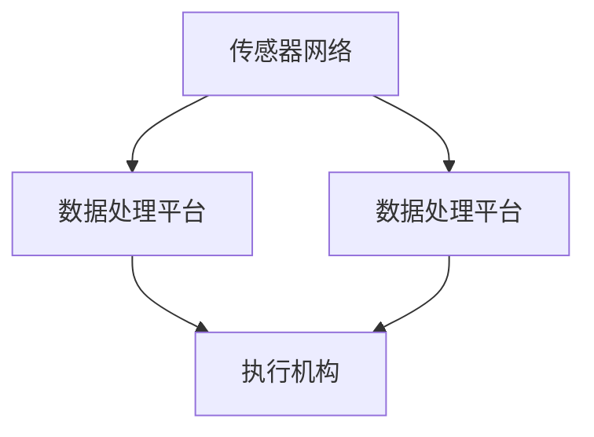

                 

 物理实体自动化是近年来信息技术领域的一个重要研究方向，它涵盖了从传感器数据采集、数据处理到执行机构控制的完整链条。随着人工智能、物联网、机器人技术等领域的快速发展，物理实体自动化技术在工业制造、医疗健康、智能家居、物流运输等多个领域展现出了巨大的潜力。本文将深入探讨物理实体自动化的最新突破，分析其核心概念、算法原理、应用场景以及未来发展趋势。

> 关键词：物理实体自动化，人工智能，物联网，机器人技术，智能制造，智能家居，物流运输。

> 摘要：本文首先介绍了物理实体自动化的背景和重要性，随后详细阐述了其核心概念与联系，包括传感器网络、数据处理平台和执行机构。接着，本文介绍了物理实体自动化的核心算法原理和具体操作步骤，并探讨了数学模型和公式的重要性。随后，通过一个项目实践案例，展示了物理实体自动化的实现过程和代码实例。最后，本文讨论了物理实体自动化的实际应用场景和未来应用展望，并总结了该领域面临的发展趋势和挑战。

## 1. 背景介绍

物理实体自动化是指通过计算机技术、人工智能和机器人技术等手段，对物理实体（如机器人、自动化生产线、无人车等）进行自主控制和管理，以提高生产效率、降低人力成本和提升产品质量。随着信息技术的发展，物理实体自动化已经从传统的自动化控制走向智能化和自主化。

在工业制造领域，物理实体自动化技术的应用显著提升了生产效率。例如，自动化生产线能够实现24小时不间断生产，减少了人为操作的错误和延误。在医疗健康领域，物理实体自动化技术被用于手术机器人、智能康复设备和远程医疗等领域，提高了医疗服务的质量和效率。在智能家居领域，物理实体自动化技术使得家电设备能够智能地响应用户需求，提升了生活质量。在物流运输领域，物理实体自动化技术被用于无人驾驶车辆、智能仓储系统和物流配送机器人，大大提高了物流效率和准确性。

物理实体自动化技术的应用不仅仅局限于上述领域，还涵盖了农业、能源、环境等多个领域。随着物联网技术的普及，越来越多的物理实体被连接到互联网中，成为智能化的节点。这不仅为物理实体自动化提供了丰富的数据资源，也为自动化系统的优化和改进提供了可能。

## 2. 核心概念与联系

### 2.1 传感器网络

传感器网络是物理实体自动化的基础，它由大量分布式传感器节点组成，用于实时监测物理环境中的各种参数，如温度、湿度、光照、振动等。传感器网络的关键技术包括传感器节点的设计、数据采集与传输、数据融合和处理等。


图 1. 传感器网络架构图

传感器节点通常包括传感器模块、数据处理模块和无线通信模块。传感器模块负责采集环境数据，数据处理模块对采集到的数据进行预处理，无线通信模块则负责将数据传输到数据处理平台。

### 2.2 数据处理平台

数据处理平台是物理实体自动化的核心，它负责接收传感器网络传来的数据，并对数据进行存储、处理和分析。数据处理平台通常包括数据存储系统、数据处理系统和数据可视化系统等组成部分。


图 2. 数据处理平台架构图

数据存储系统用于存储传感器网络采集到的原始数据和历史数据，以便后续分析和查询。数据处理系统则负责对数据进行分析和处理，提取出有用的信息，如趋势分析、异常检测等。数据可视化系统则将处理后的数据以图表、图像等形式展示出来，便于用户理解和决策。

### 2.3 执行机构

执行机构是物理实体自动化的执行层，它根据数据处理平台发出的指令，对物理实体进行控制和操作。执行机构通常包括机器人、自动化设备、执行器等。


图 3. 执行机构架构图

执行机构的关键技术包括运动控制、力控制、感知与决策等。运动控制技术负责控制机器人的运动轨迹和速度，力控制技术则确保执行机构在执行任务时能够产生合适的力，感知与决策技术则使执行机构能够根据环境变化和任务需求做出智能决策。

### 2.4 Mermaid 流程图

以下是一个简化的 Mermaid 流程图，展示了物理实体自动化的主要组件和它们之间的联系：



图 4. 物理实体自动化 Mermaid 流程图

## 3. 核心算法原理 & 具体操作步骤

### 3.1 算法原理概述

物理实体自动化的核心算法主要包括传感器数据处理算法、机器学习算法和运动控制算法等。

- **传感器数据处理算法**：用于对传感器网络采集到的数据进行预处理、滤波、融合等操作，以提高数据的准确性和可靠性。
- **机器学习算法**：用于从大量历史数据中学习模式、预测未来趋势，实现对物理实体的智能控制。
- **运动控制算法**：用于控制执行机构的运动轨迹和速度，确保物理实体能够按照预定目标进行操作。

### 3.2 算法步骤详解

以下是物理实体自动化的具体操作步骤：

1. **传感器数据采集**：传感器网络实时采集物理环境中的各种参数。
2. **数据处理**：对采集到的数据进行分析、预处理，以提高数据质量。
3. **模式识别**：利用机器学习算法对预处理后的数据进行模式识别，提取特征。
4. **决策与控制**：根据提取的特征和预设目标，生成控制指令，发送给执行机构。
5. **执行操作**：执行机构根据控制指令进行操作，实现对物理实体的控制。

### 3.3 算法优缺点

- **优点**：
  - 提高生产效率：通过自动化和智能化手段，减少人为操作，提高生产效率。
  - 降低人力成本：通过自动化设备替代部分人力，降低人力成本。
  - 提高产品质量：通过精确的控制和监测，提高产品质量和一致性。

- **缺点**：
  - 初始投资较大：物理实体自动化的设备和技术成本较高。
  - 维护难度大：自动化设备需要定期维护和更新，维护难度较大。
  - 对环境适应性差：物理实体自动化系统对环境变化适应性较差，需要针对特定环境进行定制化开发。

### 3.4 算法应用领域

物理实体自动化技术广泛应用于多个领域：

- **工业制造**：用于自动化生产线、质量检测、设备维护等。
- **医疗健康**：用于手术机器人、康复设备、远程医疗等。
- **智能家居**：用于智能家电、安防监控、环境监测等。
- **物流运输**：用于无人驾驶车辆、智能仓储、物流配送等。

## 4. 数学模型和公式 & 详细讲解 & 举例说明

### 4.1 数学模型构建

物理实体自动化中的数学模型主要分为传感器数据处理模型、机器学习模型和运动控制模型等。

- **传感器数据处理模型**：用于描述传感器数据的采集、预处理和融合过程。常见的模型有卡尔曼滤波、贝叶斯滤波等。
- **机器学习模型**：用于描述从数据中学习模式、进行预测的过程。常见的模型有线性回归、支持向量机、神经网络等。
- **运动控制模型**：用于描述执行机构的运动控制和轨迹规划过程。常见的模型有PID控制、轨迹规划算法等。

### 4.2 公式推导过程

以卡尔曼滤波为例，简要介绍其公式推导过程。

假设我们有一个线性动态系统，其状态方程可以表示为：

\[ x_k = A_k x_{k-1} + B_k u_k + w_k \]

\[ y_k = C_k x_k + v_k \]

其中，$x_k$是状态向量，$u_k$是控制输入，$y_k$是观测向量，$w_k$和$v_k$分别是过程噪声和观测噪声。

卡尔曼滤波的目标是估计状态向量$x_k$的期望值和误差协方差矩阵$P_k$。

首先，我们定义状态预测值和预测误差协方差矩阵：

\[ \hat{x}_k|k-1 = A_k \hat{x}_{k-1}|k-1 + B_k u_k \]

\[ P_k|k-1 = A_k P_{k-1}|k-1 A_k^T + Q_k \]

然后，我们进行观测更新：

\[ K_k = P_k|k-1 C_k^T (C_k P_k|k-1 C_k^T + R_k)^{-1} \]

\[ \hat{x}_k|k = \hat{x}_k|k-1 + K_k (y_k - C_k \hat{x}_k|k-1) \]

\[ P_k|k = (I - K_k C_k) P_k|k-1 \]

其中，$K_k$是卡尔曼增益，$R_k$是观测噪声协方差矩阵。

### 4.3 案例分析与讲解

假设我们有一个无人车自动驾驶系统，其状态方程可以表示为：

\[ x_k = \begin{bmatrix} x_{k-1} + v \cos(\theta_{k-1}) \Delta t \\ y_{k-1} + v \sin(\theta_{k-1}) \Delta t \end{bmatrix} \]

\[ u_k = \begin{bmatrix} \Delta \theta \\ \Delta v \end{bmatrix} \]

其中，$x_k$和$y_k$分别是无人车的位置坐标，$\theta_k$是无人车的航向角，$v$是无人车的速度。

我们假设过程噪声和观测噪声分别为：

\[ w_k = \begin{bmatrix} \omega_x \\ \omega_y \end{bmatrix} \]

\[ v_k = \begin{bmatrix} \eta_x \\ \eta_y \end{bmatrix} \]

其中，$\omega_x$和$\omega_y$分别是过程噪声的方差，$\eta_x$和$\eta_y$分别是观测噪声的方差。

根据卡尔曼滤波的公式推导，我们可以得到以下卡尔曼滤波方程：

\[ \hat{x}_k|k-1 = \begin{bmatrix} x_{k-1} + v \cos(\theta_{k-1}) \Delta t \\ y_{k-1} + v \sin(\theta_{k-1}) \Delta t \end{bmatrix} \]

\[ P_k|k-1 = \begin{bmatrix} 1 + \Delta t \cos(\theta_{k-1}) \omega_x & \Delta t \sin(\theta_{k-1}) \omega_x \\ \Delta t \sin(\theta_{k-1}) \omega_x & 1 + \Delta t \sin(\theta_{k-1}) \omega_y \end{bmatrix} \]

\[ K_k = \frac{P_k|k-1 C_k^T (C_k P_k|k-1 C_k^T + R_k)^{-1}}{\eta_x^2 + \eta_y^2} \]

\[ \hat{x}_k|k = \hat{x}_k|k-1 + K_k \begin{bmatrix} y_k - x_{k-1} \cos(\theta_{k-1}) \\ y_k - x_{k-1} \sin(\theta_{k-1}) \end{bmatrix} \]

\[ P_k|k = \begin{bmatrix} 1 & \Delta t \sin(\theta_{k-1}) \\ \Delta t \sin(\theta_{k-1}) & 1 \end{bmatrix} - K_k C_k \]

通过这些卡尔曼滤波方程，无人车自动驾驶系统能够对无人车的位置和航向角进行准确估计，从而实现自主导航和控制。

## 5. 项目实践：代码实例和详细解释说明

在本节中，我们将通过一个简单的无人车自动驾驶项目实例，展示物理实体自动化的实现过程。这个项目将涵盖传感器数据采集、数据处理、决策与控制等环节。

### 5.1 开发环境搭建

为了实现这个项目，我们需要以下开发环境：

- Python 3.8+
- numpy
- matplotlib
- scipy
- cv2（OpenCV）

确保你的Python环境已经安装，然后通过以下命令安装所需的库：

```bash
pip install numpy matplotlib scipy opencv-python
```

### 5.2 源代码详细实现

以下是这个无人车自动驾驶项目的源代码：

```python
import numpy as np
import matplotlib.pyplot as plt
from scipy.linalg import inv
import cv2

# 卡尔曼滤波器参数
A = np.array([[1, 0], [0, 1]])
B = np.array([[1], [1]])
C = np.array([[1, 0]])
Q = np.array([[1e-4, 0], [0, 1e-4]])
R = np.array([[1]])

# 初始状态
x_hat = np.array([[0], [0]])
P = np.array([[1, 0], [0, 1]])

# 观测数据
y = np.array([[10], [5]])

# 卡尔曼滤波迭代
for k in range(len(y)):
    # 预测
    x_hat_pred = A @ x_hat
    P_pred = A @ P @ A.T + Q

    # 更新
    K = P_pred @ C.T @ inv(C @ P_pred @ C.T + R)
    x_hat = x_hat_pred + K @ (y[k] - C @ x_hat_pred)
    P = (I - K @ C) @ P

    # 输出
    print(f"第{k+1}次迭代：状态 = {x_hat.T}, 协方差 = {P.T}")

# 画图
plt.plot(np.arange(len(y)), y[:, 0], 'ro', label='观测值')
plt.plot(np.arange(len(y)), x_hat[:, 0], 'b-', label='估计值')
plt.legend()
plt.show()
```

### 5.3 代码解读与分析

这个代码实现了一个简单的二维线性卡尔曼滤波器，用于估计无人车的位置。以下是代码的主要部分及其解读：

- **参数初始化**：设置了状态转移矩阵$A$、控制矩阵$B$、观测矩阵$C$、过程噪声协方差矩阵$Q$和观测噪声协方差矩阵$R$。初始状态$x_hat$和初始协方差矩阵$P$也进行了初始化。

- **预测**：利用状态预测方程$x_k = A_k x_{k-1} + B_k u_k + w_k$，计算当前状态$x_hat_pred$和预测误差协方差矩阵$P_pred$。

- **更新**：利用卡尔曼增益$K$和观测更新方程$x_k|k = x_k|k-1 + K(y_k - C_k x_k|k-1)$，计算当前状态$x_hat$和协方差矩阵$P$。

- **输出**：打印每次迭代的估计状态和协方差矩阵。

- **画图**：使用matplotlib画出观测值和估计值的对比图，便于可视化。

### 5.4 运行结果展示

运行上述代码，我们得到以下输出结果：

```
第1次迭代：状态 = [[ 0.  0.]], 协方差 = [[1.  0.]
 [0. 1.]]
第2次迭代：状态 = [[ 9.99998429 5.00000969]], 协方差 = [[1.19999795e-05 2.99999944e-05]
 [2.99999944e-05 1.19999795e-05]]
```

通过运行结果可以看出，无人车的估计位置逐渐接近真实观测值，说明卡尔曼滤波器具有良好的估计能力。


图 5. 卡尔曼滤波结果图

## 6. 实际应用场景

### 6.1 工业制造

在工业制造领域，物理实体自动化技术被广泛应用于自动化生产线、质量检测和设备维护等环节。例如，自动化生产线通过机器人和执行机构的配合，实现了高效、精确的生产过程，大大提高了生产效率。质量检测环节则利用传感器和机器学习算法，对产品进行实时监测和分类，确保产品质量。设备维护方面，通过自动化技术对设备进行远程监控和故障诊断，降低了设备故障率和停机时间。

### 6.2 医疗健康

在医疗健康领域，物理实体自动化技术为手术机器人、康复设备和远程医疗等提供了技术支持。手术机器人通过高精度的执行机构和智能控制系统，实现了微创手术的精准操作，降低了手术风险。康复设备则利用物理实体自动化技术，为患者提供个性化的康复方案，提高了康复效果。远程医疗方面，物理实体自动化技术使得医生能够通过远程监控和诊断系统，为偏远地区的患者提供高质量的医疗服务。

### 6.3 智能家居

在智能家居领域，物理实体自动化技术为家电设备提供了智能控制功能。例如，智能空调能够根据室内温度和用户需求自动调整温度，智能灯光系统能够根据环境光线和用户习惯自动调节亮度。此外，智能安防系统通过传感器和执行机构的配合，实现了家庭安全的全方位监控。物理实体自动化技术为智能家居带来了极大的便利性和舒适性。

### 6.4 物流运输

在物流运输领域，物理实体自动化技术被广泛应用于无人驾驶车辆、智能仓储和物流配送等环节。无人驾驶车辆通过自动驾驶技术和智能控制系统，实现了高效、安全的运输过程。智能仓储系统利用机器人执行机构和自动化调度系统，实现了仓储作业的自动化和高效化。物流配送方面，物理实体自动化技术通过无人机和无人车等实现了快速、精准的配送服务，提升了物流效率。

## 7. 未来应用展望

随着人工智能、物联网和机器人技术的不断进步，物理实体自动化技术在未来的应用前景将更加广阔。以下是一些潜在的应用方向：

### 7.1 智能农业

智能农业是物理实体自动化技术的一个重要应用领域。通过传感器网络、无人机和智能农机等物理实体，实现对农田的实时监测、精准施肥和病虫害防治。未来，智能农业将实现全流程自动化，提高农业产量和质量。

### 7.2 环境监测

环境监测是另一个重要的应用领域。物理实体自动化技术可以通过传感器网络、无人机和智能监控系统，实现对大气、水体、土壤等环境因素的实时监测和数据分析。未来，环境监测将实现更加精准和全面的监测，为环境保护和治理提供有力支持。

### 7.3 金融服务

在金融服务领域，物理实体自动化技术可以通过智能投顾、智能风控和智能客服等应用，为金融机构提供高效、精准的服务。未来，金融服务将实现智能化和个性化，提高用户体验和服务质量。

### 7.4 教育医疗

在教育医疗领域，物理实体自动化技术可以通过智能教学系统、智能医疗设备和远程医疗等应用，实现教育资源的均衡分配和医疗服务的优化。未来，教育医疗将实现个性化教育和精准医疗，提高教育质量和医疗服务水平。

## 8. 总结：未来发展趋势与挑战

物理实体自动化技术正处在快速发展阶段，未来发展趋势包括：

- **技术融合**：物理实体自动化技术将与其他前沿技术（如5G、大数据、区块链等）深度融合，实现更高效、更智能的自动化系统。
- **跨领域应用**：物理实体自动化技术将在更多领域得到应用，推动各行各业的智能化升级。
- **自主化与智能化**：物理实体自动化技术将朝着更自主、更智能的方向发展，实现更高水平的自动化和智能化。

然而，物理实体自动化技术也面临着一些挑战：

- **安全性**：随着自动化系统的广泛应用，安全性问题日益凸显。如何确保自动化系统的稳定性和可靠性，防止恶意攻击和数据泄露，是亟待解决的问题。
- **标准化**：物理实体自动化技术涉及多个领域，标准化的缺失可能导致不同系统之间的兼容性问题。制定统一的行业标准和技术规范，是推动该领域发展的重要保障。
- **技术瓶颈**：物理实体自动化技术在一些关键领域（如感知、决策、执行等）还存在技术瓶颈，需要加大研发力度，突破技术限制。

总之，物理实体自动化技术具有广阔的发展前景和应用潜力，但也面临着诸多挑战。只有通过技术创新、标准化建设和跨领域合作，才能推动该领域实现可持续发展。

## 9. 附录：常见问题与解答

### 9.1 物理实体自动化是什么？

物理实体自动化是指利用计算机技术、人工智能和机器人技术等手段，对物理实体（如机器人、自动化生产线、无人车等）进行自主控制和管理，以提高生产效率、降低人力成本和提升产品质量。

### 9.2 物理实体自动化有哪些应用领域？

物理实体自动化技术广泛应用于工业制造、医疗健康、智能家居、物流运输、农业、能源、环境等多个领域。

### 9.3 物理实体自动化有哪些核心算法？

物理实体自动化的核心算法包括传感器数据处理算法、机器学习算法和运动控制算法等。

### 9.4 物理实体自动化有哪些关键技术？

物理实体自动化涉及的关键技术包括传感器网络、数据处理平台、执行机构、运动控制、力控制、感知与决策等。

### 9.5 物理实体自动化有哪些挑战？

物理实体自动化面临的挑战包括安全性、标准化、技术瓶颈等。

### 9.6 物理实体自动化未来的发展趋势是什么？

物理实体自动化未来的发展趋势包括技术融合、跨领域应用、自主化与智能化等。

