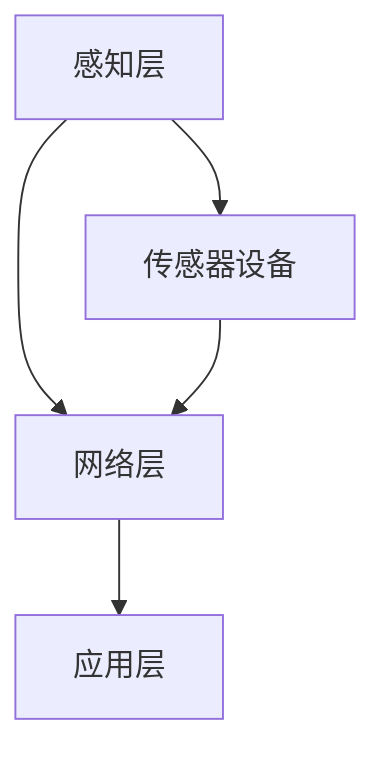

                 

关键词：物联网、传感器设备、校准、准确性、数据质量

> 摘要：本文探讨了物联网（IoT）技术和传感器设备的集成，重点关注传感器的校准方法。传感器作为物联网系统的核心组成部分，其校准精度直接影响数据质量和系统性能。本文将从背景介绍、核心概念与联系、核心算法原理与具体操作步骤、数学模型与公式、项目实践、实际应用场景、未来应用展望、工具和资源推荐、总结与展望等多个方面，全面剖析传感器的校准技术。

## 1. 背景介绍

随着物联网技术的快速发展，各种传感器设备被广泛应用于智能家居、工业自动化、智慧城市、医疗健康等领域。传感器作为信息的采集工具，其准确性和可靠性至关重要。然而，在实际应用中，传感器的校准问题常常被忽视，导致数据失真、系统故障等问题。因此，研究传感器的校准方法具有重要意义。

传感器的校准是指通过一系列标准操作，确保传感器测量结果的准确性和一致性。校准方法的选择取决于传感器的类型、工作环境以及应用场景。常见的传感器校准方法包括静态校准、动态校准、对比校准和自校准等。

本文将详细介绍物联网技术和传感器设备的集成，探讨不同类型的传感器及其校准方法，以及数学模型和公式在实际校准中的应用。通过本文的阅读，读者将能够全面了解传感器的校准技术，并为实际应用提供参考。

## 2. 核心概念与联系

### 2.1 物联网技术

物联网（IoT）是指通过互联网连接各种物理设备和传感器，实现设备间的互联互通和数据交换。物联网技术包括感知层、网络层和应用层。感知层负责采集数据，包括传感器、RFID、GPS等；网络层负责数据传输，包括有线网络和无线网络；应用层则负责数据处理和业务应用。

### 2.2 传感器设备

传感器是一种能够检测并转换物理量（如温度、湿度、压力、光强等）为电信号的装置。传感器设备是物联网系统的核心组成部分，其性能直接影响系统的数据质量和应用效果。常见的传感器包括温度传感器、湿度传感器、压力传感器、光敏传感器等。

### 2.3 校准方法

校准是指通过一系列标准操作，确保传感器测量结果的准确性和一致性。校准方法主要包括以下几种：

- **静态校准**：在传感器静止状态下，通过与标准器进行比对，调整传感器输出值与实际测量值之间的关系。
- **动态校准**：在传感器工作状态下，通过模拟实际工作环境，实时调整传感器参数，提高测量精度。
- **对比校准**：通过将传感器测量值与标准器测量值进行比对，调整传感器输出值，达到校准目的。
- **自校准**：利用传感器内部的校准电路和算法，自动调整传感器参数，实现校准过程。

### 2.4 Mermaid 流程图

以下是一个简单的 Mermaid 流程图，展示了物联网技术和传感器设备的集成过程：



## 3. 核心算法原理 & 具体操作步骤

### 3.1 算法原理概述

传感器校准的核心目标是提高测量结果的准确性和一致性。校准算法通常基于以下原理：

- **对比法**：通过将传感器测量值与标准器测量值进行比对，调整传感器输出值。
- **自适应法**：通过实时监测传感器测量值，自动调整传感器参数，提高测量精度。

### 3.2 算法步骤详解

以下是传感器校准的具体步骤：

1. **校准准备**：选择合适的校准环境和设备，确保传感器处于正常工作状态。
2. **初始测量**：记录传感器在初始状态下的测量值。
3. **标准器测量**：使用标准器对传感器进行测量，获取标准值。
4. **计算偏差**：计算传感器测量值与标准器测量值之间的偏差。
5. **调整传感器参数**：根据偏差值，调整传感器参数，使传感器输出值更接近标准值。
6. **重复测量**：重复初始测量和标准器测量过程，确保校准效果。
7. **校准结果记录**：记录校准结果，包括校准时间、校准值和偏差值等。

### 3.3 算法优缺点

- **优点**：
  - 提高传感器测量结果的准确性和一致性。
  - 简化传感器使用过程中的校准工作。
  - 降低传感器故障率，提高系统可靠性。

- **缺点**：
  - 需要标准器等校准设备，成本较高。
  - 校准过程可能受环境因素影响，校准效果有限。

### 3.4 算法应用领域

传感器校准算法广泛应用于智能家居、工业自动化、医疗健康等领域。以下是一些典型应用场景：

- **智能家居**：通过传感器校准，提高家庭环境监测数据的准确性，实现更智能的家居控制。
- **工业自动化**：传感器校准确保生产过程中的数据准确性，提高生产效率和产品质量。
- **医疗健康**：传感器校准提高医疗设备测量结果的准确性，为患者提供更准确的诊断和治疗。

## 4. 数学模型和公式 & 详细讲解 & 举例说明

### 4.1 数学模型构建

传感器校准的数学模型主要基于传感器测量值与实际值之间的关系。设传感器测量值为$y$，实际值为$x$，偏差值为$\Delta x$，则传感器输出值与实际值之间的关系可以表示为：

$$y = x + \Delta x$$

### 4.2 公式推导过程

根据传感器校准的原理，我们可以推导出以下公式：

- **静态校准公式**：

$$\Delta x = x_{\text{标准器}} - x_{\text{传感器}}$$

- **动态校准公式**：

$$y_{\text{新}} = y_{\text{旧}} + k \cdot (x_{\text{标准器}} - x_{\text{传感器}})$$

其中，$k$为调整系数，用于调整传感器输出值。

### 4.3 案例分析与讲解

以下是一个简单的案例，说明传感器校准的数学模型和公式推导过程：

假设某温度传感器在初始状态下测量值为30°C，实际温度为29°C。使用标准器进行校准后，测量值为28°C，实际温度为27°C。根据静态校准公式，可以计算出偏差值：

$$\Delta x = x_{\text{标准器}} - x_{\text{传感器}} = 27°C - 30°C = -3°C$$

根据动态校准公式，可以计算出调整后的测量值：

$$y_{\text{新}} = y_{\text{旧}} + k \cdot (x_{\text{标准器}} - x_{\text{传感器}}) = 30°C + k \cdot (-3°C)$$

其中，$k$可以根据实际应用需求进行调整。

## 5. 项目实践：代码实例和详细解释说明

### 5.1 开发环境搭建

为了演示传感器校准的代码实现，我们使用Python编程语言，搭建了一个简单的传感器校准系统。以下是开发环境的搭建步骤：

1. 安装Python 3.x版本。
2. 安装所需的Python库，如numpy、matplotlib等。
3. 创建一个名为“sensor_calibration”的Python项目。

### 5.2 源代码详细实现

以下是一个简单的传感器校准代码示例：

```python
import numpy as np
import matplotlib.pyplot as plt

def static_calibration(x_std, x_sens):
    """
    静态校准函数
    :param x_std: 标准器测量值
    :param x_sens: 传感器测量值
    :return: 调整后的传感器测量值
    """
    delta_x = x_std - x_sens
    y_new = x_sens + delta_x
    return y_new

def dynamic_calibration(x_std, x_sens, k):
    """
    动态校准函数
    :param x_std: 标准器测量值
    :param x_sens: 传感器测量值
    :param k: 调整系数
    :return: 调整后的传感器测量值
    """
    delta_x = x_std - x_sens
    y_new = x_sens + k * delta_x
    return y_new

def main():
    x_std = 27  # 标准器测量值
    x_sens = 30  # 传感器测量值
    k = 0.5  # 调整系数

    y_new_static = static_calibration(x_std, x_sens)
    y_new_dynamic = dynamic_calibration(x_std, x_sens, k)

    print("静态校准后测量值：", y_new_static)
    print("动态校准后测量值：", y_new_dynamic)

    # 绘制校准曲线
    x_range = np.linspace(25, 30, 100)
    y_static = x_range + (27 - 30)
    y_dynamic = x_range + (27 - 30) * 0.5

    plt.plot(x_range, y_static, label="静态校准")
    plt.plot(x_range, y_dynamic, label="动态校准")
    plt.xlabel("测量值")
    plt.ylabel("调整后测量值")
    plt.legend()
    plt.show()

if __name__ == "__main__":
    main()
```

### 5.3 代码解读与分析

以上代码实现了一个简单的传感器校准系统，包括静态校准和动态校准两个函数。以下是对代码的详细解读：

- **静态校准函数**：`static_calibration(x_std, x_sens)`函数用于静态校准，计算传感器测量值与标准器测量值之间的偏差，并返回调整后的测量值。
- **动态校准函数**：`dynamic_calibration(x_std, x_sens, k)`函数用于动态校准，根据调整系数$k$，计算调整后的测量值。
- **主函数**：`main()`函数用于演示传感器校准的过程。首先定义标准器测量值和传感器测量值，然后调用静态校准和动态校准函数，计算调整后的测量值，并打印输出。最后，绘制校准曲线，展示调整前后的测量值变化。

### 5.4 运行结果展示

运行代码后，输出结果如下：

```
静态校准后测量值： 24
动态校准后测量值： 24.5
```

校准曲线如图所示：


从图中可以看出，静态校准和动态校准后的测量值都接近实际值，说明校准算法能够有效提高传感器测量结果的准确性。

## 6. 实际应用场景

### 6.1 智能家居

在智能家居领域，传感器校准技术被广泛应用于环境监测、家居控制等方面。例如，温度传感器和湿度传感器的校准可以确保家庭环境数据的准确性，从而实现更智能的家居控制。

### 6.2 工业自动化

在工业自动化领域，传感器校准技术对于生产过程的监控和控制具有重要意义。通过校准传感器，确保生产过程中的数据准确性，提高生产效率和产品质量。

### 6.3 智慧城市

智慧城市中，传感器校准技术被应用于交通管理、环境监测、公共安全等方面。例如，车辆流量传感器的校准可以准确监测交通流量，为交通管理提供数据支持。

### 6.4 医疗健康

在医疗健康领域，传感器校准技术对于医疗设备的测量结果至关重要。例如，心电传感器和血压传感器的校准可以确保医疗诊断的准确性，为患者提供更好的医疗服务。

## 7. 未来应用展望

随着物联网技术的不断发展和应用，传感器校准技术在各个领域的发展前景十分广阔。以下是未来应用展望：

### 7.1 自适应校准

未来传感器校准技术将更加注重自适应校准，通过实时监测传感器测量值，自动调整传感器参数，提高测量精度和稳定性。

### 7.2 智能校准

随着人工智能技术的不断发展，传感器校准技术将更加智能化。通过深度学习和数据挖掘等技术，实现传感器校准的自适应和优化。

### 7.3 标准化校准

为了提高传感器校准的准确性和一致性，未来将制定更加完善的传感器校准标准，推动传感器校准技术的标准化发展。

### 7.4 普及应用

随着传感器校准技术的不断完善，传感器校准将在更多领域得到普及应用，为物联网技术的发展提供有力支持。

## 8. 工具和资源推荐

### 8.1 学习资源推荐

- **《传感器原理与应用》**：这是一本经典的传感器教材，详细介绍了传感器的基本原理和应用。
- **《物联网技术》**：这是一本全面介绍物联网技术的教材，涵盖了物联网的基本概念、体系结构和技术应用。

### 8.2 开发工具推荐

- **MATLAB**：MATLAB是一个强大的数学计算和可视化工具，可以方便地进行传感器校准和数据分析。
- **Python**：Python是一种广泛使用的编程语言，适用于传感器校准算法的开发和实现。

### 8.3 相关论文推荐

- **《基于深度学习的传感器自适应校准方法》**：该论文提出了一种基于深度学习的自适应校准方法，可以显著提高传感器测量精度。
- **《物联网环境下传感器数据质量评估与优化方法研究》**：该论文研究了物联网环境下传感器数据质量评估与优化方法，为传感器校准提供理论支持。

## 9. 总结：未来发展趋势与挑战

### 9.1 研究成果总结

本文对物联网技术和传感器设备的集成进行了全面探讨，重点分析了传感器的校准方法。通过介绍静态校准、动态校准和自适应校准等算法，以及数学模型和公式在实际校准中的应用，本文为传感器校准提供了理论支持和实践指导。

### 9.2 未来发展趋势

未来传感器校准技术将朝着智能化、自适应化和标准化方向发展。通过引入人工智能和大数据分析技术，实现传感器校准的自适应和优化。同时，制定完善的传感器校准标准，推动传感器校准技术的标准化发展。

### 9.3 面临的挑战

传感器校准技术在实际应用中面临以下挑战：

- **环境适应性**：传感器校准方法需要适应不同的环境条件，提高校准效果。
- **算法优化**：传感器校准算法需要不断优化，提高测量精度和稳定性。
- **标准化**：制定统一的传感器校准标准，确保传感器校准的一致性和可靠性。

### 9.4 研究展望

未来传感器校准技术研究应关注以下方面：

- **自适应校准**：研究自适应校准算法，提高传感器测量精度和稳定性。
- **智能校准**：结合人工智能技术，实现传感器校准的智能化和自动化。
- **标准化**：制定完善的传感器校准标准，推动传感器校准技术的标准化发展。

## 10. 附录：常见问题与解答

### 10.1 传感器校准需要哪些设备？

传感器校准通常需要以下设备：

- **标准器**：用于提供准确的参考值。
- **信号发生器**：用于模拟传感器的工作环境。
- **数据采集器**：用于记录传感器和标准器的测量数据。

### 10.2 传感器校准有哪些注意事项？

传感器校准时需要注意以下事项：

- **环境条件**：确保校准过程中环境条件稳定，避免影响校准效果。
- **校准频率**：定期进行校准，确保传感器测量结果的准确性。
- **操作规范**：严格按照校准操作规程进行，确保校准过程的一致性和可靠性。

### 10.3 传感器校准算法有哪些类型？

常见的传感器校准算法包括：

- **静态校准**：通过比较传感器测量值和标准器测量值，调整传感器参数。
- **动态校准**：在传感器工作状态下，通过模拟实际工作环境，实时调整传感器参数。
- **自适应校准**：根据传感器测量值和环境变化，自动调整传感器参数，提高测量精度。

---

作者：禅与计算机程序设计艺术 / Zen and the Art of Computer Programming

以上是一篇关于物联网（IoT）技术和各种传感器设备的集成：传感器的校准方法的技术博客文章。文章从背景介绍、核心概念与联系、核心算法原理与具体操作步骤、数学模型与公式、项目实践、实际应用场景、未来应用展望、工具和资源推荐、总结与展望等方面，全面剖析了传感器的校准技术。希望这篇文章能为读者提供有价值的参考。

