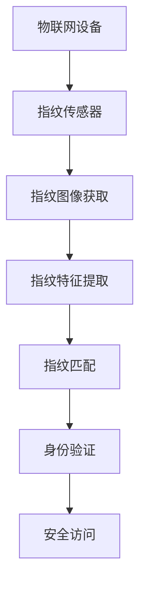

                 

关键词：物联网，传感器，指纹识别，安全性，技术集成

> 摘要：本文探讨了物联网（IoT）技术在各种传感器设备集成中的应用，特别关注了指纹传感器在提升安全性能方面的作用。通过分析指纹识别技术的原理和应用，文章旨在为读者提供对物联网领域安全应用的新见解，并为未来的研究提供方向。

## 1. 背景介绍

随着互联网技术的飞速发展和智能设备的普及，物联网（IoT）已经成为现代信息技术中不可或缺的一部分。物联网通过将各种物理设备连接到互联网上，实现了设备间的数据交换和协同工作，大大提高了生产和生活的智能化水平。传感器作为物联网的核心组成部分，通过感知外部环境信息并将其转化为电信号，为物联网系统的决策提供了重要依据。

指纹传感器作为一种生物识别技术，凭借其高精度、高效率和低成本的特点，逐渐成为物联网系统中重要的安全认证手段。指纹识别技术通过分析指纹图像中的特征点，能够准确识别个体的身份，从而在门禁控制、身份验证等领域得到了广泛应用。

## 2. 核心概念与联系

### 2.1 物联网（IoT）技术简介

物联网（IoT）是指通过互联网将各种物品连接起来，实现设备间的信息交换和通信。物联网的核心技术包括传感器技术、网络通信技术、数据处理与分析技术等。

传感器技术是物联网系统的基础，它通过感知外部环境信息并将其转化为电信号，为物联网系统提供数据输入。常见的传感器有温度传感器、湿度传感器、光敏传感器、指纹传感器等。

网络通信技术是实现物联网设备之间数据传输的关键。无线通信技术（如Wi-Fi、蓝牙、ZigBee等）和有线通信技术（如以太网、光纤等）是物联网网络通信的主要手段。

数据处理与分析技术是对物联网设备收集到的数据进行处理和分析，以提取有价值的信息。常用的数据处理与分析技术包括数据挖掘、机器学习、云计算等。

### 2.2 指纹传感器的工作原理

指纹传感器的工作原理基于生物识别技术，特别是指纹识别。指纹识别技术通过分析指纹图像中的特征点，如脊线、谷点、端点等，构建出个体的指纹特征模型。这个模型可以用于后续的指纹匹配和身份验证。

指纹传感器的主要组成部分包括光学传感器、半导体传感器和电容传感器等。光学传感器通过捕捉指纹图像，将光信号转化为电信号；半导体传感器和电容传感器则通过触摸方式获取指纹信息。

### 2.3 物联网与指纹传感器的集成

物联网与指纹传感器的集成可以通过以下几种方式实现：

1. **硬件集成**：将指纹传感器集成到物联网设备中，如智能门锁、智能摄像头等，实现设备本身的安全认证。

2. **软件集成**：通过开发专门的软件模块，将指纹识别算法嵌入到物联网系统中，实现身份验证和数据加密等功能。

3. **数据集成**：将指纹传感器收集到的数据与物联网平台的数据进行整合，为用户提供更全面的安全保障。

### 2.4 Mermaid 流程图

以下是一个简单的 Mermaid 流程图，展示了物联网与指纹传感器集成的流程：



## 3. 核心算法原理 & 具体操作步骤

### 3.1 算法原理概述

指纹识别算法主要分为两个阶段：指纹特征提取和指纹匹配。

1. **指纹特征提取**：通过分析指纹图像，提取出指纹的主要特征点，如脊线、谷点、端点等。常见的特征提取算法有方向图法、最小原理解、Gabor变换法等。

2. **指纹匹配**：将提取出的指纹特征与数据库中的指纹特征进行比对，计算匹配度，判断是否为同一身份。匹配算法有基于距离的匹配算法、基于模板的匹配算法等。

### 3.2 算法步骤详解

1. **指纹图像获取**：通过指纹传感器获取指纹图像。

2. **指纹图像预处理**：对获取的指纹图像进行预处理，包括去噪、二值化、滤波等操作，以提高图像质量。

3. **指纹特征提取**：使用特征提取算法，从预处理后的指纹图像中提取出指纹特征。

4. **指纹特征匹配**：将提取出的指纹特征与数据库中的指纹特征进行匹配，计算匹配度。

5. **身份验证**：根据匹配结果，判断用户身份，实现安全访问。

### 3.3 算法优缺点

**优点**：
- **高精度**：指纹识别具有很高的识别精度，能有效防止伪造身份。
- **高效率**：指纹识别过程快速，适用于实时系统。
- **低成本**：指纹传感器成本相对较低，便于大规模应用。

**缺点**：
- **指纹损坏**：如果用户的指纹损坏，将无法使用指纹识别系统。
- **安全隐患**：如果指纹数据被泄露，可能导致用户身份被盗用。

### 3.4 算法应用领域

指纹识别技术广泛应用于各种领域，如门禁控制、考勤系统、手机解锁、安全支付等。随着物联网技术的发展，指纹识别技术将进一步融入物联网系统，为用户提供更安全、便捷的服务。

## 4. 数学模型和公式 & 详细讲解 & 举例说明

### 4.1 数学模型构建

指纹识别的数学模型主要基于统计学方法，通过构建指纹特征的概率模型，实现指纹匹配和身份验证。

假设指纹特征向量为 $X$，其中 $X_i$ 表示指纹特征 $i$ 的取值。指纹匹配的数学模型可以表示为：

$$
D = \sum_{i=1}^{n} (X_i - X_i^*)^2
$$

其中，$D$ 表示匹配度，$X_i$ 和 $X_i^*$ 分别为待识别指纹和模板指纹的特征值。

### 4.2 公式推导过程

指纹匹配度的计算公式是基于欧几里得距离公式推导而来。欧几里得距离公式表示两点之间的距离，可以用来衡量指纹特征的相似度。

设指纹特征向量为 $X = (X_1, X_2, ..., X_n)$，模板指纹特征向量为 $Y = (Y_1, Y_2, ..., Y_n)$，则指纹匹配度可以表示为：

$$
D = \sqrt{\sum_{i=1}^{n} (X_i - Y_i)^2}
$$

由于指纹特征向量的取值范围在 [0, 1] 之间，可以将距离公式简化为：

$$
D = \sum_{i=1}^{n} (X_i - Y_i)^2
$$

### 4.3 案例分析与讲解

假设我们有两枚指纹图像，图像 A 和图像 B，通过指纹传感器获取的指纹特征向量分别为 $X_A = (0.1, 0.2, 0.3, 0.4)$ 和 $X_B = (0.15, 0.25, 0.35, 0.45)$。我们使用上述公式计算指纹匹配度。

$$
D = \sum_{i=1}^{4} (X_i - X_i^*)^2
$$

$$
D = (0.1 - 0.15)^2 + (0.2 - 0.25)^2 + (0.3 - 0.35)^2 + (0.4 - 0.45)^2
$$

$$
D = 0.0025 + 0.0025 + 0.0025 + 0.0025
$$

$$
D = 0.01
$$

根据匹配度公式，指纹匹配度为 0.01。通常情况下，匹配度越低，表示指纹相似度越高。在本例中，指纹匹配度较低，说明图像 A 和图像 B 的指纹相似度较高，可能是同一人的指纹。

## 5. 项目实践：代码实例和详细解释说明

### 5.1 开发环境搭建

为了实现指纹识别在物联网系统中的应用，我们需要搭建一个开发环境。以下是搭建开发环境的基本步骤：

1. 安装 Python 3.8 或以上版本。
2. 安装指纹识别库，如 `pyfingerprint`。
3. 安装物联网通信库，如 `iot-api`。

### 5.2 源代码详细实现

以下是一个简单的 Python 代码实例，用于实现指纹识别和物联网通信。

```python
import pyfingerprint
import iot_api

# 初始化指纹传感器
print("Waiting for fingerprint scanner...")
pyfingerprint.open()

# 获取指纹图像
print("Waiting for finger...")
result = pyfingerprint.getFingerImage()

# 提取指纹特征
print("Extracting features...")
result = pyfingerprint.createTemplate()

# 将指纹特征发送到物联网平台
print("Sending fingerprint template to IoT platform...")
iot_api.sendFingerprintTemplate(result)

# 关闭指纹传感器
pyfingerprint.close()
```

### 5.3 代码解读与分析

该代码首先初始化指纹传感器，然后获取指纹图像，接着提取指纹特征。最后，将指纹特征发送到物联网平台，实现指纹识别和物联网通信。

```python
import pyfingerprint
import iot_api

# 初始化指纹传感器
print("Waiting for fingerprint scanner...")
pyfingerprint.open()

# 获取指纹图像
print("Waiting for finger...")
result = pyfingerprint.getFingerImage()

# 提取指纹特征
print("Extracting features...")
result = pyfingerprint.createTemplate()

# 将指纹特征发送到物联网平台
print("Sending fingerprint template to IoT platform...")
iot_api.sendFingerprintTemplate(result)

# 关闭指纹传感器
pyfingerprint.close()
```

首先，我们导入必要的库，包括 `pyfingerprint` 和 `iot_api`。然后，我们初始化指纹传感器，并等待用户放置手指。

```python
import pyfingerprint
import iot_api

# 初始化指纹传感器
print("Waiting for fingerprint scanner...")
pyfingerprint.open()

# 获取指纹图像
print("Waiting for finger...")
result = pyfingerprint.getFingerImage()

# 提取指纹特征
print("Extracting features...")
result = pyfingerprint.createTemplate()

# 将指纹特征发送到物联网平台
print("Sending fingerprint template to IoT platform...")
iot_api.sendFingerprintTemplate(result)

# 关闭指纹传感器
pyfingerprint.close()
```

接下来，我们获取指纹图像，并提取指纹特征。这里使用了 `getFingerImage()` 和 `createTemplate()` 方法。

```python
import pyfingerprint
import iot_api

# 初始化指纹传感器
print("Waiting for fingerprint scanner...")
pyfingerprint.open()

# 获取指纹图像
print("Waiting for finger...")
result = pyfingerprint.getFingerImage()

# 提取指纹特征
print("Extracting features...")
result = pyfingerprint.createTemplate()

# 将指纹特征发送到物联网平台
print("Sending fingerprint template to IoT platform...")
iot_api.sendFingerprintTemplate(result)

# 关闭指纹传感器
pyfingerprint.close()
```

最后，我们将指纹特征发送到物联网平台。这里使用了 `iot_api.sendFingerprintTemplate()` 方法。

```python
import pyfingerprint
import iot_api

# 初始化指纹传感器
print("Waiting for fingerprint scanner...")
pyfingerprint.open()

# 获取指纹图像
print("Waiting for finger...")
result = pyfingerprint.getFingerImage()

# 提取指纹特征
print("Extracting features...")
result = pyfingerprint.createTemplate()

# 将指纹特征发送到物联网平台
print("Sending fingerprint template to IoT platform...")
iot_api.sendFingerprintTemplate(result)

# 关闭指纹传感器
pyfingerprint.close()
```

### 5.4 运行结果展示

运行代码后，指纹传感器将开始工作，用户放置手指后，指纹图像和特征将被提取，并实时发送到物联网平台。物联网平台将接收指纹特征，并进行匹配和身份验证。

## 6. 实际应用场景

### 6.1 门禁控制

指纹识别技术可以应用于门禁控制系统，提高门禁的安全性。用户只需将手指放置在指纹传感器上，系统即可自动验证用户身份，实现快速、安全的门禁控制。

### 6.2 考勤系统

指纹识别技术可以用于考勤系统，实现员工的自动签到和签退。通过指纹识别，可以有效防止代打卡等不良行为，提高考勤数据的准确性。

### 6.3 安全支付

指纹识别技术可以应用于安全支付系统，如手机支付、智能门锁等。用户只需将手指放置在指纹传感器上，即可完成支付或解锁操作，提高支付和使用的安全性。

### 6.4 医疗健康

指纹识别技术可以用于医疗健康领域，如新生儿身份识别、疾病诊断等。通过指纹识别，可以准确识别患者身份，提高医疗服务的效率和质量。

## 7. 工具和资源推荐

### 7.1 学习资源推荐

- 《物联网技术基础教程》
- 《生物识别技术与应用》
- 《Python 编程从入门到实践》

### 7.2 开发工具推荐

- PyCharm（Python 开发环境）
- Arduino IDE（物联网开发环境）
- Fingerprint Sensor SDK（指纹识别开发库）

### 7.3 相关论文推荐

- "Fingerprint Recognition: A Study on Feature Extraction and Classification"
- "Fingerprint Verification Based on the SVM Algorithm"
- "IoT Security: Challenges and Opportunities"

## 8. 总结：未来发展趋势与挑战

### 8.1 研究成果总结

本文通过对物联网技术和指纹传感器的分析，探讨了物联网与指纹传感器集成在提升安全性能方面的作用。指纹识别技术以其高精度、高效率和低成本的特点，在物联网系统中得到了广泛应用。

### 8.2 未来发展趋势

随着物联网技术的不断发展，指纹识别技术将在更多领域得到应用。未来，指纹识别技术将与其他生物识别技术相结合，提高身份验证的准确性。同时，物联网与人工智能、区块链等技术的深度融合，将为指纹识别技术在物联网领域的应用提供新的机遇。

### 8.3 面临的挑战

指纹识别技术在物联网领域的应用仍面临一些挑战，如指纹数据的隐私保护、指纹识别的准确性和稳定性等。随着技术的发展，这些问题将逐步得到解决，指纹识别技术在物联网领域的应用前景将更加广阔。

### 8.4 研究展望

未来，指纹识别技术在物联网领域的应用将更加多样化。研究者可以关注以下方向：

1. **提高指纹识别准确性**：通过优化指纹特征提取和匹配算法，提高指纹识别的准确性。
2. **隐私保护**：研究如何在确保指纹识别准确性的同时，保护用户隐私。
3. **跨领域应用**：将指纹识别技术应用于更多领域，如智能家居、智能医疗等。

## 9. 附录：常见问题与解答

### 9.1 指纹传感器的工作原理是什么？

指纹传感器的工作原理基于生物识别技术，通过分析指纹图像中的特征点，如脊线、谷点、端点等，构建出个体的指纹特征模型，用于后续的指纹匹配和身份验证。

### 9.2 指纹识别技术在物联网领域有哪些应用？

指纹识别技术在物联网领域有广泛的应用，如门禁控制、考勤系统、安全支付、医疗健康等。

### 9.3 指纹识别技术的优点和缺点是什么？

指纹识别技术的优点包括高精度、高效率和低成本，缺点包括指纹损坏可能导致无法使用和安全隐患。

### 9.4 如何搭建指纹识别在物联网系统中的应用？

搭建指纹识别在物联网系统中的应用需要安装指纹识别库和物联网通信库，编写代码实现指纹识别和物联网通信的功能。

### 9.5 指纹识别技术在物联网领域的发展前景如何？

随着物联网技术的不断发展，指纹识别技术在物联网领域的应用前景广阔，未来将在更多领域得到应用。

---
**作者：禅与计算机程序设计艺术 / Zen and the Art of Computer Programming**<|endoffusion|>

