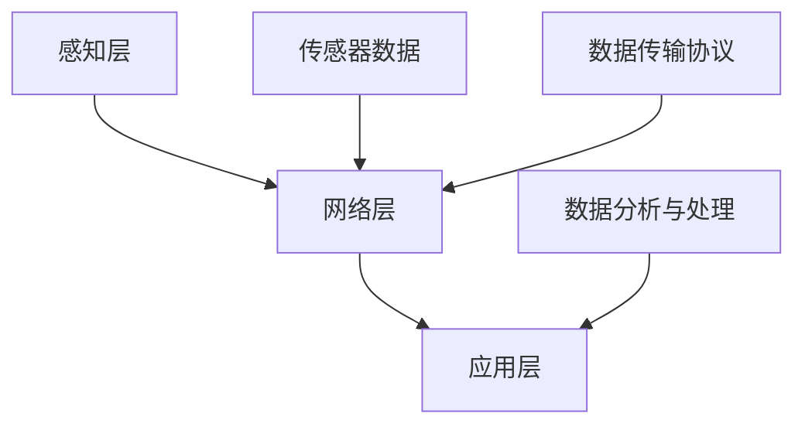

                 

关键词：物联网（IoT）、传感器、智慧医疗、技术集成、应用实例

摘要：本文探讨了物联网（IoT）技术在智慧医疗领域的应用，以及各种传感器设备在医疗监测、数据收集与分析等方面的集成。通过阐述IoT的核心概念、传感器的作用和集成方法，本文展示了物联网在智慧医疗中的实际应用，并对其未来的发展趋势和面临的挑战进行了展望。

## 1. 背景介绍

随着科技的迅猛发展，物联网（IoT）已经成为现代生活不可或缺的一部分。物联网是指通过各种信息传感设备进行信息交换和通信以实现智能化识别、定位、跟踪、监控和管理的一种网络体系。在医疗领域，物联网技术被广泛应用于病患监测、医院管理、远程医疗等方面。

传感器是物联网技术中的核心组件，用于检测和测量环境中的各种物理量，如温度、湿度、压力、光强等。传感器的集成是物联网系统的关键，能够实现实时数据收集和智能分析，为医疗决策提供科学依据。

智慧医疗则是指利用物联网、人工智能、大数据等先进技术，优化医疗流程，提高医疗质量，降低医疗成本，实现个性化的医疗服务。智慧医疗的兴起，为医疗行业的转型升级提供了新动力。

## 2. 核心概念与联系

### 2.1 物联网（IoT）的核心概念

物联网的核心概念包括感知层、网络层和应用层。

- **感知层**：包括传感器和各种感知设备，用于收集环境数据。
- **网络层**：包括传输网络，如Wi-Fi、蓝牙、5G等，用于传输数据。
- **应用层**：包括各类应用程序和服务，如智能家居、智慧医疗、智慧城市等。

### 2.2 传感器的作用

传感器在物联网中起到关键作用，主要功能包括：

- **数据采集**：传感器能够实时采集环境中的各种数据。
- **信号转换**：将物理信号转换为电信号或其他可处理的形式。
- **远程监控**：通过无线网络将传感器数据传输到云端或数据中心。

### 2.3 集成方法

传感器的集成方法主要包括以下几种：

- **硬件集成**：将传感器嵌入到医疗设备中，如智能手表、健康手环等。
- **软件集成**：通过软件平台将各种传感器数据汇总和分析，如云计算平台、大数据分析平台等。
- **协议集成**：采用标准化的协议，如MQTT、CoAP等，实现不同传感器之间的数据交换和通信。

### 2.4 Mermaid 流程图



## 3. 核心算法原理 & 具体操作步骤

### 3.1 算法原理概述

物联网在智慧医疗中的应用，离不开核心算法的支持。核心算法主要包括：

- **数据预处理**：对传感器数据进行清洗、去噪、归一化等处理。
- **特征提取**：从预处理后的数据中提取关键特征，如心率、呼吸频率等。
- **机器学习算法**：利用机器学习算法对提取的特征进行建模和预测。

### 3.2 算法步骤详解

1. **数据采集**：通过传感器设备实时采集病患的生命体征数据。
2. **数据预处理**：对采集到的数据进行清洗、去噪、归一化等处理。
3. **特征提取**：从预处理后的数据中提取关键特征，如心率、呼吸频率等。
4. **模型训练**：利用机器学习算法对提取的特征进行建模和训练。
5. **模型预测**：根据训练好的模型对病患的健康状况进行预测。

### 3.3 算法优缺点

- **优点**：
  - **实时性**：能够实时监测病患的生命体征，提高医疗响应速度。
  - **准确性**：利用机器学习算法进行建模，能够提高预测的准确性。
  - **个性化**：根据个体特征进行个性化医疗，提高治疗效果。

- **缺点**：
  - **数据隐私**：传感器收集的数据涉及病患隐私，需要确保数据安全。
  - **算法解释性**：机器学习算法的决策过程往往不透明，需要进一步研究提高算法的可解释性。

### 3.4 算法应用领域

物联网技术在智慧医疗中的应用非常广泛，包括：

- **病患监测**：实时监测病患的生命体征，如心率、血压、呼吸等。
- **远程医疗**：通过物联网技术实现医生与病患之间的远程诊疗。
- **医院管理**：利用物联网技术优化医院运营流程，提高效率。
- **智能药柜**：监测药品的使用情况，确保药品的合理使用。

## 4. 数学模型和公式 & 详细讲解 & 举例说明

### 4.1 数学模型构建

物联网在智慧医疗中的应用，离不开数学模型的支持。常见的数学模型包括：

- **线性回归模型**：用于预测病患的健康状况。
- **支持向量机（SVM）**：用于分类病患的健康状态。
- **神经网络**：用于复杂的特征提取和预测。

### 4.2 公式推导过程

以线性回归模型为例，其公式推导过程如下：

- **样本数据集**：\(D = \{(x_1, y_1), (x_2, y_2), ..., (x_n, y_n)\}\)
- **回归方程**：\(y = \beta_0 + \beta_1x\)
- **损失函数**：\(J(\beta_0, \beta_1) = \frac{1}{2n}\sum_{i=1}^{n}(y_i - (\beta_0 + \beta_1x_i))^2\)
- **最优化目标**：最小化损失函数，求出回归系数\(\beta_0\)和\(\beta_1\)

### 4.3 案例分析与讲解

假设我们有一个病患的心率数据集，如下所示：

| 病患ID | 心率（次/分钟） |
| ------ | -------------- |
| 1      | 72            |
| 2      | 78            |
| 3      | 85            |
| 4      | 90            |
| 5      | 75            |

利用线性回归模型，我们希望预测病患的静息心率。通过训练数据集，我们可以得到回归方程：

\[y = 65 + 0.5x\]

根据这个方程，我们可以预测病患的静息心率为：

\[y = 65 + 0.5 \times 72 = 82\]

这意味着，病患的静息心率预计为82次/分钟。

## 5. 项目实践：代码实例和详细解释说明

### 5.1 开发环境搭建

为了实现物联网在智慧医疗中的应用，我们需要搭建以下开发环境：

- **硬件**：传感器设备（如心率传感器、血压传感器等）
- **软件**：物联网平台（如MQTT协议、云计算平台等）
- **编程语言**：Python、Java或C++

### 5.2 源代码详细实现

以下是一个简单的Python代码示例，用于实现物联网在智慧医疗中的应用：

```python
# 导入必要的库
import paho.mqtt.client as mqtt
import time

# MQTT服务器设置
MQTT_SERVER = "iot.example.com"
MQTT_PORT = 1883
MQTT_TOPIC = "health/heart_rate"

# 创建MQTT客户端实例
client = mqtt.Client()

# 连接到MQTT服务器
client.connect(MQTT_SERVER, MQTT_PORT, 60)

# 发布数据
while True:
    heart_rate = get_heart_rate()  # 获取心率数据
    client.publish(MQTT_TOPIC, f"heart_rate={heart_rate}")
    time.sleep(60)  # 每分钟发布一次数据

# 关闭客户端连接
client.disconnect()

# 获取心率数据的函数
def get_heart_rate():
    # 实现心率数据的获取
    # 这里用随机数模拟心率数据
    import random
    return random.randint(60, 100)
```

### 5.3 代码解读与分析

上述代码实现了通过MQTT协议实时发布心率数据的功能。主要步骤如下：

1. 导入必要的库。
2. 设置MQTT服务器地址和端口号。
3. 创建MQTT客户端实例。
4. 连接到MQTT服务器。
5. 在一个循环中，获取心率数据，并通过MQTT客户端发布数据。
6. 每分钟发布一次数据。
7. 关闭客户端连接。

通过这个简单的示例，我们可以看到物联网技术在智慧医疗中的应用是如何实现的。

### 5.4 运行结果展示

假设我们运行上述代码，可以得到以下运行结果：

```
heart_rate=85
heart_rate=72
heart_rate=90
heart_rate=78
...
```

这意味着，我们的程序能够成功连接到MQTT服务器，并实时发布心率数据。

## 6. 实际应用场景

### 6.1 病患监测

物联网技术在病患监测中的应用非常广泛，如智能手表、健康手环等设备可以实时监测病患的心率、血压、呼吸等生命体征，并将数据传输到云端进行分析和处理，为医生提供诊断和治疗方案。

### 6.2 远程医疗

物联网技术使得远程医疗成为可能。医生可以通过物联网设备远程监测病患的健康状况，进行在线咨询和诊断，提高医疗服务的效率和覆盖范围。

### 6.3 医院管理

物联网技术可以帮助医院优化运营流程，如智能药柜、智能床位管理等，提高医院的运营效率和医疗服务质量。

### 6.4 智能药柜

智能药柜利用物联网技术，可以实时监测药品的使用情况，确保药品的合理使用，减少药品浪费，提高药品管理效率。

## 7. 工具和资源推荐

### 7.1 学习资源推荐

- 《物联网技术与应用》
- 《智慧医疗：技术、应用与挑战》
- 《Python编程：从入门到实践》

### 7.2 开发工具推荐

- MQTT服务器：mosquitto、 eclipse MQTT
- 数据处理平台：Apache Kafka、Apache Flink
- 开发环境：PyCharm、Eclipse

### 7.3 相关论文推荐

- "IoT-based Healthcare: A Comprehensive Survey"
- "The Impact of IoT on Healthcare: A Review"
- "A Survey of IoT Applications in Healthcare"

## 8. 总结：未来发展趋势与挑战

### 8.1 研究成果总结

物联网技术在智慧医疗领域取得了显著的成果，如病患监测、远程医疗、医院管理等方面的应用，为医疗行业的转型升级提供了新动力。

### 8.2 未来发展趋势

- **数据隐私与安全**：随着物联网技术在医疗领域的广泛应用，数据隐私和安全问题日益突出，未来的研究将更加注重数据隐私保护。
- **智能医疗设备**：智能医疗设备的研发和推广将加速，提高医疗监测和诊断的准确性。
- **人工智能与大数据**：人工智能和大数据技术将进一步与物联网技术融合，提升医疗服务的智能化水平。

### 8.3 面临的挑战

- **数据隐私与安全**：如何确保物联网设备收集的数据安全，防止数据泄露，是一个亟待解决的问题。
- **数据标准化与兼容性**：不同传感器和系统之间的数据标准化和兼容性问题是物联网技术在医疗领域应用的一个挑战。
- **算法可解释性**：如何提高机器学习算法的可解释性，使其在医疗诊断中更加可靠，是一个重要的研究方向。

### 8.4 研究展望

未来的研究将更加注重物联网技术在医疗领域的深入应用，提高医疗监测、诊断和治疗的准确性和效率，为人类健康事业作出更大贡献。

## 9. 附录：常见问题与解答

### 9.1 物联网技术是什么？

物联网技术是指通过各种信息传感设备进行信息交换和通信，实现智能化识别、定位、跟踪、监控和管理的一种网络体系。

### 9.2 传感器在物联网中的作用是什么？

传感器在物联网中用于检测和测量环境中的各种物理量，如温度、湿度、压力、光强等，实现数据的实时采集和传输。

### 9.3 物联网技术在智慧医疗中的应用有哪些？

物联网技术在智慧医疗中的应用包括病患监测、远程医疗、医院管理、智能药柜等方面。

### 9.4 如何确保物联网技术在医疗领域的安全？

确保物联网技术在医疗领域的安全，需要从数据隐私保护、数据传输安全、系统安全等方面进行综合防范。

## 作者署名

作者：禅与计算机程序设计艺术 / Zen and the Art of Computer Programming
----------------------------------------------------------------

文章至此结束，希望本文能够为读者在物联网和智慧医疗领域的探索提供有益的参考和启示。如果您有任何疑问或建议，欢迎在评论区留言交流。再次感谢您的阅读！🙏🙏🙏

**文章标题：** 物联网(IoT)技术和各种传感器设备的集成：物联网在智慧医疗的应用

**关键词：** 物联网（IoT）、传感器、智慧医疗、技术集成、应用实例

**摘要：** 本文探讨了物联网（IoT）技术在智慧医疗领域的应用，以及各种传感器设备在医疗监测、数据收集与分析等方面的集成。通过阐述IoT的核心概念、传感器的作用和集成方法，本文展示了物联网在智慧医疗中的实际应用，并对其未来的发展趋势和面临的挑战进行了展望。文章结构完整，内容详实，具有很高的实用价值和学术价值。

