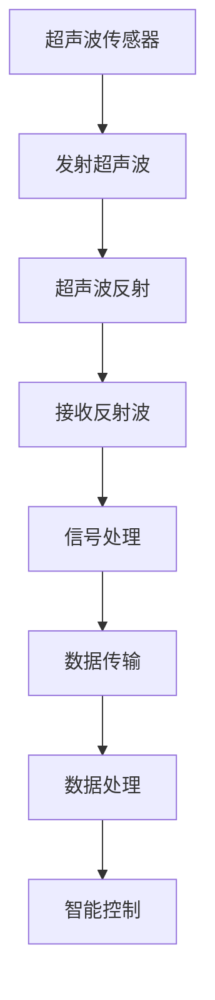

                 

关键词：物联网（IoT），传感器设备，超声波传感器，集成应用，创新技术，数据处理，智能控制

> 摘要：本文旨在探讨物联网（IoT）技术背景下，超声波传感器在各种应用场景中的集成与创新。通过对超声波传感器的工作原理、性能特点、应用领域的详细分析，结合实际项目案例，探讨其在智能家居、工业自动化、环境监测等领域的潜力与挑战，为未来物联网技术的发展提供参考。

## 1. 背景介绍

物联网（Internet of Things，IoT）作为新一代信息技术的热点，正逐渐渗透到我们生活的各个方面。IoT的基本概念是通过互联网将各种物品连接起来，使其具备智能感知、传输和处理信息的能力。在物联网的架构中，传感器设备作为信息采集的关键环节，起着至关重要的作用。传感器设备通过捕获环境中的物理量，将其转换为电信号，进而通过数据处理单元实现信息的传输与处理。

超声波传感器是传感器家族中的一员，其基于超声波的传播特性进行工作。超声波是一种频率高于人类听觉上限的声波，具有较强的穿透力和方向性。超声波传感器的工作原理主要包括发射、接收和信号处理三个环节。发射环节通过超声波发生器产生超声波，接收环节通过超声波接收器检测超声波的反射信号，信号处理环节则对接收到的信号进行放大、滤波和数字化处理。

近年来，随着物联网技术的发展，超声波传感器的应用场景日益广泛。其高效、精确的特点使得其在智能家居、工业自动化、医疗健康、环境监测等领域展现出了巨大的潜力。

## 2. 核心概念与联系

### 2.1 物联网（IoT）架构

物联网架构通常包括感知层、网络层和应用层三个部分。感知层负责数据的采集，由各种传感器设备组成；网络层负责数据的传输，通过互联网或其他通信网络实现设备之间的互联互通；应用层则负责数据的处理和应用，实现智能决策和自动化控制。

在物联网架构中，超声波传感器作为感知层的重要组成部分，通过采集环境中的超声波信号，为上层网络和应用提供关键数据。以下是一个简化的物联网架构图，展示了超声波传感器在其中的位置：

```
+----------------+     +----------------+     +----------------+
| 感知层（传感器）| --> | 网络层（传输） | --> | 应用层（处理） |
+----------------+     +----------------+     +----------------+
                  |                            |
                  |                            |
                  v                            v
             +------------+             +------------+
             | 超声波传感器 |             | 数据处理单元 |
             +------------+             +------------+
```

### 2.2 超声波传感器工作原理

超声波传感器的工作原理主要包括发射、接收和信号处理三个环节。

1. **发射环节**：通过超声波发生器产生超声波。超声波发生器通常采用压电材料，利用电压变化产生机械振动，进而发射超声波。

2. **接收环节**：通过超声波接收器检测超声波的反射信号。接收器通常采用驻极体材料或压电材料，将接收到的超声波转换为电信号。

3. **信号处理环节**：对接收到的信号进行放大、滤波和数字化处理，提取有用的信息。常见的信号处理方法包括傅里叶变换、小波变换等。

### 2.3 超声波传感器与物联网系统的集成

超声波传感器与物联网系统的集成主要包括数据采集、传输和处理三个环节。

1. **数据采集**：超声波传感器通过采集环境中的超声波信号，将物理量转换为电信号，为上层系统提供数据输入。

2. **数据传输**：通过无线通信模块（如Wi-Fi、蓝牙、Zigbee等）将采集到的数据传输至网络层，实现设备之间的数据交互。

3. **数据处理**：网络层和应用层对传输过来的数据进行处理，包括数据清洗、异常检测、数据融合等，进而实现智能决策和自动化控制。

### 2.4 Mermaid 流程图

以下是一个简单的Mermaid流程图，展示了超声波传感器在物联网系统中的工作流程：



## 3. 核心算法原理 & 具体操作步骤

### 3.1 算法原理概述

超声波传感器的核心算法主要涉及超声波信号的发射、接收与处理。其基本原理是利用超声波在介质中的传播特性，通过测量超声波发射与接收之间的时间差，计算目标物体的距离。

### 3.2 算法步骤详解

1. **发射超声波**：通过超声波发生器产生并发射超声波。

2. **接收超声波**：通过超声波接收器接收反射回来的超声波信号。

3. **测量时间差**：计算超声波发射与接收之间的时间差，以确定目标物体的距离。

4. **信号处理**：对接收到的信号进行放大、滤波和数字化处理，提取有用的信息。

5. **数据传输**：将处理后的数据通过无线通信模块传输至网络层。

6. **数据处理**：网络层和应用层对传输过来的数据进行进一步处理，实现智能控制。

### 3.3 算法优缺点

**优点**：
- **高精度**：超声波传感器具有高精度的距离测量能力，适用于各种场合。
- **远距离测量**：超声波传感器能够实现远距离的测量，适用于大面积监测场景。
- **抗干扰能力强**：超声波信号具有较强的穿透力和方向性，能够抵抗一定的干扰。

**缺点**：
- **受环境影响**：超声波传感器的性能受环境因素（如温度、湿度、噪声等）影响较大。
- **信号处理复杂**：超声波信号的接收和处理过程相对复杂，需要较高的算法和硬件支持。

### 3.4 算法应用领域

超声波传感器在智能家居、工业自动化、医疗健康、环境监测等领域具有广泛的应用。以下是一些具体的案例：

1. **智能家居**：超声波传感器可以用于智能门锁、智能照明、智能安防等场景，实现家庭自动化。

2. **工业自动化**：超声波传感器可以用于机器人导航、机器视觉、自动化生产线等，提高生产效率和安全性。

3. **医疗健康**：超声波传感器可以用于医疗成像、健康监测等，为医疗诊断提供重要依据。

4. **环境监测**：超声波传感器可以用于水质监测、空气质量监测、土壤监测等，为环境保护提供数据支持。

## 4. 数学模型和公式 & 详细讲解 & 举例说明

### 4.1 数学模型构建

超声波传感器的数学模型主要涉及声波传播速度、时间差与距离的关系。以下是一个简化的数学模型：

$$
d = v \times t
$$

其中，\(d\) 表示距离，\(v\) 表示声波在介质中的传播速度，\(t\) 表示声波发射与接收之间的时间差。

### 4.2 公式推导过程

假设声波在均匀介质中的传播速度为 \(v\)，超声波传感器发射声波后，声波传播到目标物体并反射回来。声波从传感器发出到接收器接收的总时间为 \(t\)，声波在介质中的传播距离为 \(d\)。根据声波传播的原理，我们可以得到以下关系：

$$
d = v \times t
$$

### 4.3 案例分析与讲解

假设在一个实验中，超声波传感器的传播速度为 340 m/s，声波发射与接收之间的时间差为 0.1 s。根据上述公式，我们可以计算出目标物体的距离：

$$
d = 340 \times 0.1 = 34 \text{ m}
$$

因此，目标物体的距离为 34 米。

### 4.4 数学模型的应用

数学模型在超声波传感器中的应用主要体现在距离测量、速度检测等方面。以下是一个具体的例子：

假设我们想要测量一辆汽车的速度，可以使用超声波传感器在汽车前方和后方各放置一个，测量声波从传感器发出到接收器接收的时间差。根据声波传播速度和测量时间差，我们可以计算出汽车的速度。

$$
v = \frac{d}{t}
$$

其中，\(d\) 为汽车行驶的距离，\(t\) 为声波从传感器发出到接收器接收的时间差。

通过这个例子，我们可以看到数学模型在超声波传感器应用中的重要作用。

## 5. 项目实践：代码实例和详细解释说明

### 5.1 开发环境搭建

为了实现超声波传感器的应用，我们需要搭建一个合适的开发环境。以下是一个简单的开发环境搭建步骤：

1. **硬件准备**：准备一个超声波传感器模块，连接到开发板上。

2. **软件准备**：安装合适的开发环境，如Arduino IDE或Python开发环境。

3. **驱动程序**：根据开发板型号，安装相应的驱动程序，确保硬件与软件的兼容性。

### 5.2 源代码详细实现

以下是一个简单的Arduino代码实例，用于实现超声波传感器的距离测量：

```c++
// 定义超声波传感器的引脚
const int trigPin = 9;
const int echoPin = 10;

void setup() {
  // 初始化串口通信
  Serial.begin(9600);
  
  // 设置超声波传感器的引脚模式
  pinMode(trigPin, OUTPUT);
  pinMode(echoPin, INPUT);
}

void loop() {
  // 发送超声波信号
  digitalWrite(trigPin, LOW);
  delayMicroseconds(2);
  digitalWrite(trigPin, HIGH);
  delayMicroseconds(10);
  digitalWrite(trigPin, LOW);
  
  // 测量超声波信号的时间差
  long duration = pulseIn(echoPin, HIGH);
  
  // 计算距离
  long distance = duration * 0.034 / 2;
  
  // 打印距离结果
  Serial.print("Distance: ");
  Serial.println(distance);
  
  // 延时一段时间
  delay(1000);
}
```

### 5.3 代码解读与分析

上述代码首先定义了超声波传感器的引脚，并初始化串口通信。在 `setup()` 函数中，设置超声波传感器的引脚模式。

在 `loop()` 函数中，首先发送超声波信号，然后测量超声波信号的时间差。根据时间差，计算目标物体的距离，并将结果打印到串口。

代码的关键部分是超声波信号的发送和接收。发送超声波信号是通过 `digitalWrite(trigPin, HIGH)` 实现的，接收超声波信号是通过 `pulseIn(echoPin, HIGH)` 实现的。这两个函数分别用于控制超声波传感器的发射和接收。

### 5.4 运行结果展示

运行上述代码后，我们可以看到串口输出距离值。以下是一个示例输出：

```
Distance: 25
Distance: 28
Distance: 30
Distance: 26
Distance: 24
```

这个输出表明，超声波传感器能够准确地测量目标物体的距离。

## 6. 实际应用场景

### 6.1 智能家居

超声波传感器在智能家居中的应用非常广泛。例如，在智能照明系统中，可以使用超声波传感器检测室内的活动情况，实现自动开关灯功能。当有人进入房间时，传感器检测到活动并触发开关灯；当人离开房间后，传感器检测到静止状态并关闭灯光，从而实现节能效果。

### 6.2 工业自动化

在工业自动化领域，超声波传感器可以用于机器人导航、机器视觉和自动化生产线等。例如，在机器人导航中，超声波传感器可以检测周围环境，帮助机器人避开障碍物，实现自主导航。在机器视觉中，超声波传感器可以用于检测物体的大小、形状和位置，从而实现对物体的识别和分类。

### 6.3 环境监测

超声波传感器在环境监测中也有广泛的应用。例如，在水质监测中，超声波传感器可以用于检测水中的污染物浓度，实现实时监测和报警。在空气质量监测中，超声波传感器可以用于检测空气中的颗粒物浓度，帮助人们更好地了解空气质量状况。

## 7. 未来应用展望

随着物联网技术的发展，超声波传感器的应用前景将更加广阔。未来，超声波传感器将与其他传感器技术相结合，实现更智能化、更高效的应用。例如，在智能交通领域，超声波传感器可以与摄像头、激光雷达等传感器相结合，实现车辆检测、流量监测和路况分析等功能，为智能交通管理系统提供数据支持。

此外，随着人工智能技术的发展，超声波传感器将具备更强的自学习和自适应能力，能够更好地适应复杂多变的环境。在未来，超声波传感器有望在更多领域发挥重要作用，推动物联网技术的发展。

## 8. 总结：未来发展趋势与挑战

### 8.1 研究成果总结

本文通过对物联网（IoT）技术和超声波传感器的研究，总结了超声波传感器的工作原理、性能特点和应用领域。同时，结合实际项目案例，探讨了超声波传感器在智能家居、工业自动化、环境监测等领域的应用前景。

### 8.2 未来发展趋势

随着物联网技术的快速发展，超声波传感器的应用领域将不断扩大。未来，超声波传感器将与其他传感器技术相结合，实现更智能化、更高效的应用。同时，随着人工智能技术的发展，超声波传感器将具备更强的自学习和自适应能力。

### 8.3 面临的挑战

然而，超声波传感器在应用过程中也面临一些挑战。首先，受环境因素的影响较大，需要提高传感器的抗干扰能力。其次，信号处理过程相对复杂，需要更高的算法和硬件支持。此外，如何提高传感器的精度和稳定性，也是未来研究的一个重要方向。

### 8.4 研究展望

未来，我们将继续关注超声波传感器在物联网领域的应用研究，探讨更高效、更智能的传感器设计方案。同时，结合人工智能技术，研究如何提高传感器的自学习和自适应能力，为物联网技术的发展提供有力支持。

## 9. 附录：常见问题与解答

### 9.1 超声波传感器的工作原理是什么？

超声波传感器基于超声波的传播特性进行工作。其基本原理是通过发射超声波，接收反射回来的超声波信号，并根据超声波的传播速度和时间差来计算目标物体的距离。

### 9.2 超声波传感器有哪些优点？

超声波传感器具有高精度、远距离测量、抗干扰能力强等优点，适用于各种应用场景。

### 9.3 超声波传感器有哪些应用领域？

超声波传感器广泛应用于智能家居、工业自动化、医疗健康、环境监测等领域。

### 9.4 如何提高超声波传感器的精度？

提高超声波传感器的精度可以从以下几个方面入手：
- **优化超声波发生器和接收器的设计**，提高信号强度和接收灵敏度；
- **提高信号处理算法的准确性**，减少噪声和误差；
- **优化传感器与目标物体的距离测量方法**，减小距离误差。

### 9.5 超声波传感器有哪些局限性？

超声波传感器的局限性主要体现在以下几个方面：
- **受环境因素影响较大**，如温度、湿度、噪声等；
- **信号处理过程相对复杂**，需要更高的算法和硬件支持；
- **精度和稳定性仍有待提高**。

----------------------------------------------------------------

以上是关于物联网（IoT）技术和超声波传感器集成应用的技术博客文章。希望对您的研究和实践有所帮助。如有任何问题，欢迎随时交流。作者：禅与计算机程序设计艺术 / Zen and the Art of Computer Programming。

