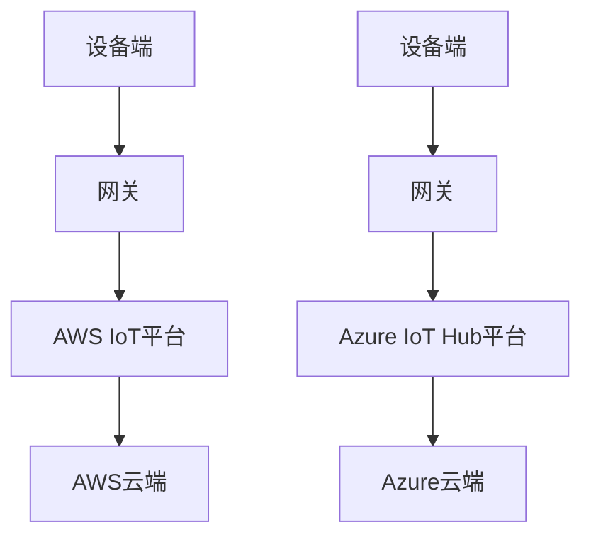

                 

 **关键词：** 物联网（IoT），AWS IoT，Azure IoT Hub，平台架构，安全性，数据管理，应用案例。

> **摘要：** 本文将深入探讨两大主流物联网平台AWS IoT和Azure IoT Hub，从背景介绍、核心概念、算法原理、数学模型、实践案例到未来展望，为您呈现这两大平台的技术细节、优势与挑战。

## 1. 背景介绍

物联网（Internet of Things，IoT）是近年来信息技术领域的重要发展方向。它通过将各种物理设备、传感器、软件系统连接到互联网上，实现设备之间的数据交换和智能协同。物联网平台作为连接设备与云端的桥梁，发挥着至关重要的作用。AWS IoT和Azure IoT Hub作为业界领先的物联网平台，吸引了众多开发者和企业用户。

### AWS IoT

Amazon Web Services（AWS）提供的AWS IoT是一个全面的物联网解决方案，它可以帮助开发者在云和设备端实现大规模的物联网应用。AWS IoT提供了一系列强大的功能，包括设备管理、数据收集、存储和处理、安全认证等。

### Azure IoT Hub

Azure IoT Hub是微软Azure云服务的一部分，它提供了一个可靠且安全的平台，用于连接、监视和管理大量物联网设备。Azure IoT Hub支持设备管理、双向通信、数据收集和分析、设备身份认证等功能。

## 2. 核心概念与联系

### 物联网平台架构

物联网平台通常包括以下几个核心组件：

- **设备端**：负责数据采集、传感和处理。
- **网关**：在设备无法直接连接互联网时，起到数据中转和协议转换的作用。
- **平台**：处理数据存储、分析和处理，提供API供开发者调用。
- **云端**：提供计算资源、存储和高级分析服务。

下面是AWS IoT和Azure IoT Hub的架构图（使用Mermaid绘制）：



### 核心概念原理

- **设备管理**：负责设备的注册、配置、状态监控和远程更新。
- **数据管理**：包括数据收集、存储、转换和分析。
- **安全性**：通过设备认证、数据加密和访问控制保护设备安全。
- **双向通信**：支持设备与云端之间的实时数据交换。

## 3. 核心算法原理 & 具体操作步骤

### 3.1 算法原理概述

物联网平台的核心算法主要包括：

- **数据采集算法**：用于从设备端采集数据。
- **数据处理算法**：用于清洗、转换和分析采集到的数据。
- **设备管理算法**：用于设备注册、配置和更新。

### 3.2 算法步骤详解

#### 数据采集算法

1. 设备端通过传感器或接口采集数据。
2. 数据通过网关或直接传输到物联网平台。
3. 平台对数据进行预处理，如清洗、去噪和格式转换。

#### 数据处理算法

1. 平台存储采集到的数据。
2. 使用数据分析工具，如机器学习模型，对数据进行挖掘和分析。
3. 根据分析结果，触发相应的操作或报警。

#### 设备管理算法

1. 设备通过物联网平台进行注册。
2. 平台分配唯一的设备ID，并生成设备证书。
3. 设备与平台建立安全连接，进行数据交互。

### 3.3 算法优缺点

- **数据采集算法**：优点是数据实时性强，缺点是易受设备性能和网络质量的影响。
- **数据处理算法**：优点是数据处理能力强，缺点是计算资源消耗较大。
- **设备管理算法**：优点是设备管理便捷，缺点是安全性依赖于设备证书。

### 3.4 算法应用领域

- **智能家居**：用于监控家电状态、能耗分析。
- **智能城市**：用于交通管理、环境监测。
- **工业物联网**：用于设备状态监控、故障预测。

## 4. 数学模型和公式 & 详细讲解 & 举例说明

### 4.1 数学模型构建

在物联网平台中，常用的数学模型包括：

- **线性回归模型**：用于预测设备运行状态。
- **决策树模型**：用于分类和预测设备故障类型。
- **神经网络模型**：用于复杂的数据分析和模式识别。

### 4.2 公式推导过程

以线性回归模型为例，其公式推导如下：

$$y = \beta_0 + \beta_1x$$

其中，$y$ 表示预测值，$x$ 表示输入特征，$\beta_0$ 和 $\beta_1$ 分别是模型的参数。

### 4.3 案例分析与讲解

#### 案例背景

假设我们想要预测一个智能家居系统中空调的能耗。

#### 数据预处理

1. 收集历史空调能耗数据。
2. 清洗数据，去除异常值。
3. 特征提取，如温度、湿度、使用时长等。

#### 模型训练

1. 使用线性回归模型对数据集进行训练。
2. 求解模型参数 $\beta_0$ 和 $\beta_1$。

#### 模型评估

1. 使用交叉验证方法评估模型性能。
2. 根据评估结果调整模型参数。

#### 模型应用

1. 使用训练好的模型预测未来某一时刻的空调能耗。
2. 根据预测结果优化空调运行策略，降低能耗。

## 5. 项目实践：代码实例和详细解释说明

### 5.1 开发环境搭建

1. 安装AWS IoT CLI。
2. 安装Azure IoT SDK。
3. 配置设备端和网关。

### 5.2 源代码详细实现

#### AWS IoT代码实例

```python
import boto3

# 创建AWS IoT客户端
client = boto3.client('iot')

# 注册设备
response = client.register_device(
    deviceCertificatePem='设备证书内容',
    deviceName='设备名称',
    attributes={'location': '设备位置'}
)

# 发送数据到AWS IoT平台
response = client.publish(
    topic='设备/数据',
    message={'temperature': 25, 'humidity': 60}
)
```

#### Azure IoT代码实例

```csharp
using Microsoft.Azure.Devices;

public class AzureIoTExample
{
    private static DeviceClient deviceClient;

    public static void Main()
    {
        // 创建Azure IoT设备客户端
        string connectionString = "设备连接字符串";
        deviceClient = DeviceClient.CreateFromConnectionString(connectionString);

        // 发送数据到Azure IoT平台
        var message = new Message(Encoding.UTF8.GetBytes("{ \"temperature\": 25, \"humidity\": 60 }"));
        deviceClient.SendEventAsync("device/data", message).Wait();
    }
}
```

### 5.3 代码解读与分析

- **AWS IoT代码实例**：首先创建AWS IoT客户端，然后使用设备证书注册设备，最后发送数据到指定主题。
- **Azure IoT代码实例**：首先创建Azure IoT设备客户端，然后发送JSON格式的数据到指定主题。

### 5.4 运行结果展示

- **AWS IoT结果**：设备注册成功，数据发送到AWS IoT平台，并可以在控制台中查看。
- **Azure IoT结果**：设备注册成功，数据发送到Azure IoT平台，并可以在Azure IoT Hub中查看。

## 6. 实际应用场景

### 6.1 智能家居

物联网平台在智能家居中的应用非常广泛，如智能灯泡、智能插座、智能空调等设备的远程控制、状态监控和能源管理。

### 6.2 智能城市

物联网平台可以用于智能交通管理、环境监测、公共安全等领域，提高城市管理效率和服务质量。

### 6.3 工业物联网

物联网平台在工业物联网中用于设备状态监控、故障预测、生产优化等方面，帮助企业提高生产效率和质量。

## 7. 工具和资源推荐

### 7.1 学习资源推荐

- 《物联网：从设备到云端的实践》
- 《AWS IoT开发指南》
- 《Azure IoT开发文档》

### 7.2 开发工具推荐

- AWS IoT CLI
- Azure IoT SDK
- ThingSpeak

### 7.3 相关论文推荐

- "Internet of Things: A Survey"
- "A Secure and Scalable IoT Platform for Smart City Applications"
- "Edge Computing for IoT: A Comprehensive Survey"

## 8. 总结：未来发展趋势与挑战

### 8.1 研究成果总结

物联网平台在技术成熟度、功能丰富度、安全性等方面取得了显著进展，为各种应用场景提供了强大的支持。

### 8.2 未来发展趋势

1. **边缘计算**：将计算和存储能力延伸到设备端，减少云端负担。
2. **5G**：提高物联网设备的连接速度和稳定性，支持大规模设备连接。
3. **人工智能**：在物联网平台中集成人工智能技术，实现更智能的数据分析和决策。

### 8.3 面临的挑战

1. **数据隐私和安全**：确保数据在采集、传输和处理过程中的安全。
2. **设备管理和运维**：如何高效管理大量设备，降低运维成本。
3. **标准化**：制定统一的物联网平台标准，促进跨平台的数据共享和互操作性。

### 8.4 研究展望

物联网平台在未来将面临更多挑战和机遇，如如何在边缘计算和云计算之间实现最佳平衡，如何提高数据隐私和安全性，以及如何实现更智能的设备管理。

## 9. 附录：常见问题与解答

### 9.1 如何选择合适的物联网平台？

- 考虑应用场景、数据规模、安全性需求等因素。
- 比较不同平台的功能、性能、成本和生态。

### 9.2 物联网平台如何保证数据安全？

- 使用加密传输和存储。
- 实施严格的访问控制和认证机制。
- 定期更新设备和平台的安全补丁。

### 9.3 物联网平台的数据处理能力如何提升？

- 利用边缘计算技术，减轻云端负担。
- 引入机器学习和人工智能技术，实现更智能的数据分析。

---

**作者：禅与计算机程序设计艺术 / Zen and the Art of Computer Programming**

