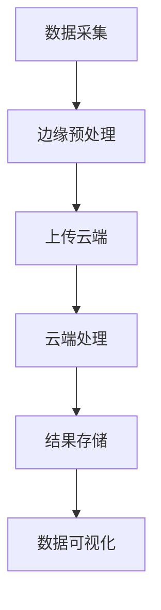

                 

 物联网（IoT）的快速发展带来了海量的数据生成和处理需求。对于这样的海量数据，传统的集中式数据处理方式已经难以满足高效、实时性的要求。因此，边缘计算和云端处理成为物联网数据分析的重要解决方案。本文将详细介绍物联网数据分析的相关概念、核心算法、数学模型以及实际应用，旨在为读者提供全面的技术指导和思考。

## 关键词

- 物联网（IoT）
- 边缘计算
- 云端处理
- 数据分析
- 实时性
- 能源效率

## 摘要

本文将探讨物联网数据分析的关键技术和应用场景。首先，我们将介绍物联网的背景和数据分析的需求。接着，我们将深入探讨边缘计算和云端处理在物联网数据分析中的角色和优势。随后，本文将详细解释核心算法原理和操作步骤，并分析其优缺点和适用领域。此外，本文还将讨论数学模型和公式，以及通过实际项目实践来展示代码实现和运行结果。最后，本文将展望物联网数据分析的未来发展趋势，并提出相关工具和资源的推荐。

## 1. 背景介绍

### 物联网的发展历程

物联网（Internet of Things，IoT）是指通过互联网连接各种物理设备和传感器，实现设备之间以及设备与人之间的智能交互和信息共享。物联网的概念最早可以追溯到20世纪90年代，当时主要是由一些研究机构和科技公司提出的。随着无线通信、传感器技术、云计算和大数据等技术的不断进步，物联网得到了快速发展。

物联网的发展历程可以分为以下几个阶段：

1. **设备互联阶段**：这个阶段主要关注如何将各种物理设备连接到互联网，实现设备之间的通信和交互。代表性技术包括无线传感器网络（WSN）和蓝牙技术。

2. **平台整合阶段**：随着物联网设备的增多，如何对海量数据进行整合和管理成为关键问题。平台整合阶段主要关注如何构建一个统一的物联网平台，实现设备的数据汇聚、处理和共享。

3. **智能化阶段**：物联网的智能化阶段主要集中在如何利用大数据和人工智能技术，对物联网设备产生的数据进行深度分析和智能决策。这一阶段标志着物联网从简单的设备互联向智能化、自动化方向发展。

### 物联网数据分析的重要性

随着物联网设备的普及，产生的数据量呈现爆炸式增长。根据Gartner的预测，到2025年，全球将有超过250亿个物联网设备连接到互联网。这些设备产生的数据不仅包括静态数据，还包括动态数据，如传感器数据、位置数据、行为数据等。如何有效地分析和利用这些数据成为物联网应用的关键问题。

物联网数据分析的重要性体现在以下几个方面：

1. **业务洞察**：通过对物联网设备产生的数据进行分析，企业可以深入了解业务运营状况，发现潜在的业务机会和风险。

2. **决策支持**：物联网数据分析可以提供实时、准确的数据支持，帮助企业做出更明智的决策，提高运营效率。

3. **安全防护**：物联网数据分析可以帮助企业及时发现和防范安全威胁，提高网络安全性。

4. **智能优化**：通过对物联网设备产生的数据进行深入分析，可以实现对设备和系统的智能化优化，提高能源效率和生产效率。

### 数据分析的需求

物联网数据分析的需求主要来源于以下几个方面：

1. **实时性**：物联网设备产生的数据通常是实时或近实时的，这对数据分析提出了较高的实时性要求。传统的大数据处理方法往往无法满足这种实时性需求。

2. **高效性**：物联网设备产生的数据量巨大，如何高效地处理这些数据成为关键问题。传统的集中式数据处理方式往往因为计算资源的限制而难以实现高效处理。

3. **异构性**：物联网设备种类繁多，数据来源复杂，这对数据分析提出了较高的异构性要求。传统的数据处理方法往往难以应对这种异构性数据。

4. **灵活性**：物联网数据分析需要具备较高的灵活性，能够根据不同的应用场景和业务需求，灵活调整数据分析策略。

### 边缘计算与云端处理的崛起

随着物联网数据的爆炸式增长，传统的集中式数据处理方式已经难以满足实时性、高效性和灵活性的需求。边缘计算和云端处理作为新兴的数据处理技术，逐渐成为物联网数据分析的重要解决方案。

#### 边缘计算

边缘计算（Edge Computing）是指将计算任务从云端转移到网络边缘，即靠近数据源的位置进行处理。边缘计算的主要优势包括：

1. **实时性**：边缘计算可以将数据处理任务从云端转移到靠近数据源的位置，降低数据传输延迟，提高数据处理实时性。

2. **高效性**：边缘计算可以利用网络边缘的设备资源，减轻云端计算负担，提高数据处理效率。

3. **异构性**：边缘计算可以支持多种类型的计算资源，如CPU、GPU、FPGA等，可以更好地应对物联网设备的异构性需求。

4. **隐私性**：边缘计算可以降低数据传输量，减少数据泄露风险，提高数据安全性。

#### 云端处理

云端处理（Cloud Computing）是指将数据处理任务部署在云端，利用云服务提供商的计算资源进行处理。云端处理的主要优势包括：

1. **灵活性**：云端处理可以提供灵活的计算资源分配，根据业务需求动态调整计算资源。

2. **扩展性**：云端处理可以支持大规模数据处理，满足物联网数据的快速增长需求。

3. **成本效益**：云端处理可以降低企业IT基础设施的建设和维护成本，提高成本效益。

4. **专业化**：云端处理可以利用云服务提供商的专业技术和服务，提高数据处理质量。

### 物联网数据分析在边缘和云端处理的挑战与机遇

物联网数据分析在边缘和云端处理中面临着一系列挑战和机遇：

1. **数据隐私与安全**：边缘计算和云端处理需要确保数据在传输和处理过程中的安全性和隐私性，防止数据泄露和恶意攻击。

2. **资源分配与优化**：边缘计算和云端处理需要优化资源分配，提高数据处理效率和资源利用率。

3. **异构数据处理**：物联网设备产生的数据具有异构性，如何高效地处理这些异构数据成为关键问题。

4. **实时性与延迟**：边缘计算和云端处理需要平衡实时性和数据处理延迟，确保数据分析的实时性和准确性。

5. **智能化与自动化**：边缘计算和云端处理需要实现智能化和自动化数据处理，提高数据分析效率和业务价值。

总之，物联网数据分析在边缘和云端处理中具有巨大的潜力和挑战。通过深入研究相关技术和方法，我们可以更好地利用物联网数据，推动物联网应用的发展。

## 2. 核心概念与联系

### 边缘计算与云端处理的定义与联系

边缘计算（Edge Computing）和云端处理（Cloud Computing）是物联网数据分析中的两个核心概念。它们各自代表了数据处理的不同位置和方式。

#### 边缘计算

边缘计算是指在网络边缘执行数据处理任务，而不是在远程数据中心或云端。这种计算方式可以将数据处理任务分散到网络边缘的设备上，如传感器、路由器、边缘服务器等。边缘计算的主要优势包括：

1. **实时性**：边缘计算可以减少数据传输的距离和时间，提高数据处理实时性。
2. **高效性**：边缘计算可以利用网络边缘的设备资源，减轻云端计算负担，提高数据处理效率。
3. **异构性**：边缘计算可以支持多种类型的计算资源，如CPU、GPU、FPGA等，可以更好地应对物联网设备的异构性需求。

#### 云端处理

云端处理是指将数据处理任务部署在云端，利用云服务提供商的计算资源进行处理。云端处理的主要优势包括：

1. **灵活性**：云端处理可以提供灵活的计算资源分配，根据业务需求动态调整计算资源。
2. **扩展性**：云端处理可以支持大规模数据处理，满足物联网数据的快速增长需求。
3. **成本效益**：云端处理可以降低企业IT基础设施的建设和维护成本，提高成本效益。

#### 边缘计算与云端处理的关系

边缘计算和云端处理并不是相互排斥的，而是可以相互补充。在实际应用中，边缘计算和云端处理可以结合使用，形成一种混合计算架构。这种架构可以充分利用边缘计算和云端处理的各自优势，实现高效、实时、安全的物联网数据分析。

### 物联网数据分析的核心概念

在物联网数据分析中，还有一些核心概念需要了解：

1. **数据采集**：物联网数据分析的第一步是数据采集，包括传感器数据、设备日志数据、用户行为数据等。
2. **数据预处理**：数据采集后，需要进行预处理，包括数据清洗、数据转换、数据聚合等，以消除噪声、填补缺失值，提高数据质量。
3. **实时处理**：物联网数据分析需要对数据进行实时处理，以满足实时性要求。实时处理包括数据流处理、事件驱动处理等。
4. **离线处理**：除了实时处理，物联网数据分析还需要进行离线处理，包括数据挖掘、机器学习、统计分析等。
5. **数据存储**：物联网数据分析需要将处理后的数据进行存储，以便后续查询和分析。常用的数据存储技术包括关系型数据库、NoSQL数据库、分布式存储系统等。
6. **数据可视化**：数据可视化是将数据处理结果以图表、图像等形式展示给用户，帮助用户更好地理解数据和分析结果。

### 边缘计算与云端处理在物联网数据分析中的联系

边缘计算和云端处理在物联网数据分析中有着紧密的联系：

1. **数据采集**：边缘计算可以在网络边缘直接采集传感器数据，云端处理可以远程采集设备日志数据。
2. **数据预处理**：边缘计算可以对采集到的数据进行预处理，将清洗后的数据上传到云端进行进一步处理。
3. **实时处理**：边缘计算可以实时处理传感器数据，云端处理可以实时处理设备日志数据。
4. **离线处理**：边缘计算可以离线处理传感器数据，云端处理可以离线处理设备日志数据。
5. **数据存储**：边缘计算可以将预处理后的数据存储在本地，云端处理可以将处理后的数据存储在云端。
6. **数据可视化**：边缘计算可以将实时处理结果以图表形式展示在本地设备上，云端处理可以将分析结果以图表形式展示在云端。

通过边缘计算和云端处理的结合，物联网数据分析可以实现实时、高效、安全的数据处理，为物联网应用提供强大的支持。

### Mermaid 流程图

为了更直观地展示边缘计算和云端处理在物联网数据分析中的联系，我们可以使用Mermaid流程图来表示。以下是流程图的示例：



在这个流程图中，A表示数据采集，B表示边缘预处理，C表示上传云端，D表示云端处理，E表示结果存储，F表示数据可视化。通过这个流程图，我们可以清晰地看到边缘计算和云端处理在物联网数据分析中的协同工作方式。

## 3. 核心算法原理 & 具体操作步骤

### 3.1 算法原理概述

在物联网数据分析中，常用的算法包括数据流处理算法、机器学习算法、统计分析算法等。这些算法的原理和操作步骤如下：

#### 3.1.1 数据流处理算法

数据流处理算法主要用于处理实时数据流，其核心思想是将数据流分解为一系列事件，并对每个事件进行实时处理。常用的数据流处理算法包括：

1. **窗口算法**：窗口算法将数据流划分为一系列时间窗口，每个窗口内的数据事件进行聚合处理。窗口算法可以用来进行实时数据分析，如实时流量分析、实时舆情监测等。
2. **事件驱动算法**：事件驱动算法以事件为中心，当有新事件发生时，触发相应的事件处理函数。事件驱动算法可以用来进行实时报警、实时监控等。

#### 3.1.2 机器学习算法

机器学习算法用于从数据中学习规律，并用于预测和分类。常用的机器学习算法包括：

1. **监督学习算法**：监督学习算法通过已标记的数据集进行训练，然后用于对新数据进行预测。常用的监督学习算法包括线性回归、决策树、支持向量机等。
2. **无监督学习算法**：无监督学习算法没有已标记的数据集，通过发现数据中的内在结构进行学习。常用的无监督学习算法包括聚类、主成分分析等。

#### 3.1.3 统计分析算法

统计分析算法用于对数据进行统计分析和可视化，以发现数据中的规律和趋势。常用的统计分析算法包括：

1. **描述性统计分析**：描述性统计分析用于计算数据的各种统计指标，如均值、方差、标准差等，以描述数据的分布特征。
2. **探索性数据分析**：探索性数据分析用于发现数据中的异常值、趋势和相关性，帮助用户更好地理解数据。

### 3.2 算法步骤详解

#### 3.2.1 数据流处理算法

数据流处理算法的具体操作步骤如下：

1. **数据采集**：从物联网设备中采集实时数据流。
2. **数据预处理**：对采集到的数据进行清洗、转换和聚合，以提高数据质量。
3. **事件分解**：将数据流分解为一系列事件。
4. **事件处理**：对每个事件进行实时处理，如计算窗口指标、触发报警等。
5. **结果存储**：将处理结果存储到数据库或缓存中，以供后续查询和分析。

#### 3.2.2 机器学习算法

机器学习算法的具体操作步骤如下：

1. **数据采集**：从物联网设备中采集数据，包括传感器数据、设备日志数据等。
2. **数据预处理**：对采集到的数据进行清洗、转换和归一化，以提高数据质量。
3. **数据集划分**：将数据集划分为训练集、验证集和测试集。
4. **模型训练**：使用训练集对机器学习模型进行训练，调整模型参数。
5. **模型评估**：使用验证集评估模型性能，调整模型参数。
6. **模型应用**：使用测试集对模型进行评估，并将模型应用于实际数据，进行预测和分类。

#### 3.2.3 统计分析算法

统计分析算法的具体操作步骤如下：

1. **数据采集**：从物联网设备中采集数据，包括传感器数据、设备日志数据等。
2. **数据预处理**：对采集到的数据进行清洗、转换和归一化，以提高数据质量。
3. **描述性统计分析**：计算数据的各种统计指标，如均值、方差、标准差等。
4. **探索性数据分析**：使用可视化工具（如散点图、箱线图等）探索数据中的异常值、趋势和相关性。
5. **数据分析报告**：编写数据分析报告，总结数据分析和发现。

### 3.3 算法优缺点

#### 3.3.1 数据流处理算法

**优点**：

1. **实时性**：数据流处理算法可以实时处理数据流，满足物联网数据的实时性需求。
2. **高效性**：数据流处理算法可以高效地处理大规模数据流，满足物联网数据的高效性需求。
3. **灵活性**：数据流处理算法可以根据不同的应用场景和需求，灵活调整处理策略。

**缺点**：

1. **数据完整性**：数据流处理算法可能因为网络延迟或设备故障等原因，导致数据完整性问题。
2. **计算资源消耗**：数据流处理算法需要大量的计算资源，对硬件设备有较高要求。

#### 3.3.2 机器学习算法

**优点**：

1. **自动性**：机器学习算法可以自动地从数据中学习规律，减少人工干预。
2. **适应性**：机器学习算法可以根据不同的数据集和业务需求，自适应地调整模型参数。
3. **泛化能力**：机器学习算法具有较好的泛化能力，可以应用于不同的业务场景。

**缺点**：

1. **训练时间**：机器学习算法的训练时间较长，对实时性要求较高的应用场景可能不适用。
2. **数据质量**：机器学习算法对数据质量有较高要求，数据质量不好可能导致模型性能下降。

#### 3.3.3 统计分析算法

**优点**：

1. **直观性**：统计分析算法可以通过图表等形式直观地展示数据和分析结果。
2. **高效性**：统计分析算法计算简单，可以快速处理大规模数据。
3. **适应性**：统计分析算法可以根据不同的数据集和业务需求，灵活调整分析策略。

**缺点**：

1. **复杂度**：统计分析算法的计算复杂度较高，对硬件设备有较高要求。
2. **解释性**：统计分析算法的结果解释性较差，难以发现数据中的深层次规律。

### 3.4 算法应用领域

数据流处理算法、机器学习算法和统计分析算法在物联网数据分析中有广泛的应用领域：

1. **智能交通**：数据流处理算法可以实时分析交通流量数据，实现实时路况监测和交通信号优化。机器学习算法可以用于预测交通拥堵和事故发生，提供智能交通解决方案。统计分析算法可以用于分析交通事故数据，发现交通事故发生的规律和趋势。
2. **智能医疗**：数据流处理算法可以实时监测患者生命体征数据，实现实时监控和预警。机器学习算法可以用于疾病诊断和预测，提供个性化医疗方案。统计分析算法可以用于分析医疗数据，发现疾病发生的规律和趋势。
3. **智能家居**：数据流处理算法可以实时监测智能家居设备状态，实现智能控制。机器学习算法可以用于智能家居设备故障预测和优化，提供更好的用户体验。统计分析算法可以用于分析智能家居数据，发现用户行为模式和需求。
4. **智能工业**：数据流处理算法可以实时监测工业设备状态，实现实时监控和故障预警。机器学习算法可以用于工业设备故障预测和优化，提高生产效率。统计分析算法可以用于分析工业数据，发现设备故障规律和优化生产流程。

总之，物联网数据分析的核心算法在智能交通、智能医疗、智能家居和智能工业等应用领域具有广泛的应用前景。通过深入研究和应用这些算法，可以更好地利用物联网数据，推动物联网应用的发展。

## 4. 数学模型和公式 & 详细讲解 & 举例说明

### 4.1 数学模型构建

在物联网数据分析中，数学模型是分析和处理数据的重要工具。构建数学模型主要包括以下几个步骤：

1. **确定问题目标**：首先需要明确数据分析的目标，例如预测、分类、聚类等。
2. **数据预处理**：对原始数据进行预处理，包括数据清洗、缺失值填补、数据转换等，以提高数据质量。
3. **特征选择**：从预处理后的数据中提取有用的特征，用于构建数学模型。
4. **模型选择**：根据问题目标和数据特征，选择合适的数学模型。常见的模型包括线性回归、决策树、支持向量机、神经网络等。
5. **模型参数调整**：通过交叉验证等方法，调整模型参数，以提高模型性能。
6. **模型评估**：使用测试数据集评估模型性能，包括准确性、召回率、F1值等指标。

### 4.2 公式推导过程

以线性回归模型为例，介绍数学模型的公式推导过程。

线性回归模型旨在找到自变量（特征）和因变量（目标）之间的线性关系。其基本公式为：

\[ Y = \beta_0 + \beta_1X + \epsilon \]

其中，\( Y \) 是因变量，\( X \) 是自变量，\( \beta_0 \) 和 \( \beta_1 \) 分别是模型的截距和斜率，\( \epsilon \) 是误差项。

为了求解 \( \beta_0 \) 和 \( \beta_1 \)，我们可以使用最小二乘法（Least Squares Method）。具体步骤如下：

1. **定义损失函数**：损失函数用于衡量模型预测值和实际值之间的误差。线性回归模型的损失函数为：

\[ J(\beta_0, \beta_1) = \frac{1}{2m} \sum_{i=1}^{m} (Y_i - (\beta_0 + \beta_1X_i))^2 \]

其中，\( m \) 是样本数量。

2. **求导并设置为零**：为了找到损失函数的最小值，我们对损失函数分别对 \( \beta_0 \) 和 \( \beta_1 \) 求导，并设置导数为零：

\[ \frac{\partial J}{\partial \beta_0} = 0 \]
\[ \frac{\partial J}{\partial \beta_1} = 0 \]

3. **求解导数方程**：将导数方程简化为：

\[ \beta_0 = \bar{Y} - \beta_1\bar{X} \]
\[ \beta_1 = \frac{\sum_{i=1}^{m}(X_i - \bar{X})(Y_i - \bar{Y})}{\sum_{i=1}^{m}(X_i - \bar{X})^2} \]

其中，\( \bar{X} \) 和 \( \bar{Y} \) 分别是自变量和因变量的均值。

4. **得到模型参数**：将简化后的导数方程代入原始损失函数，得到线性回归模型的参数：

\[ \beta_0 = \bar{Y} - \beta_1\bar{X} \]
\[ \beta_1 = \frac{\sum_{i=1}^{m}(X_i - \bar{X})(Y_i - \bar{Y})}{\sum_{i=1}^{m}(X_i - \bar{X})^2} \]

### 4.3 案例分析与讲解

为了更好地理解数学模型的构建和推导过程，我们通过一个实际案例进行说明。

#### 案例背景

某智能家居公司希望预测用户对空调的能源消耗量，以优化能源使用和提高用户体验。公司收集了以下数据：

| 序号 | 房间温度（℃） | 用户偏好温度（℃） | 空调能源消耗量（kWh） |
|------|-------------|------------------|----------------------|
| 1    | 25          | 24               | 2.5                  |
| 2    | 26          | 25               | 2.3                  |
| 3    | 23          | 23               | 2.1                  |
| 4    | 24          | 24               | 2.4                  |
| 5    | 25          | 25               | 2.5                  |

#### 案例步骤

1. **确定问题目标**：预测用户对空调的能源消耗量。
2. **数据预处理**：对数据进行清洗和归一化处理，将房间温度和用户偏好温度转换为标准分数。
3. **特征选择**：选择房间温度和用户偏好温度作为自变量，空调能源消耗量作为因变量。
4. **模型选择**：选择线性回归模型。
5. **模型参数调整**：使用最小二乘法求解线性回归模型的参数。
6. **模型评估**：使用测试数据集评估模型性能。

#### 模型参数计算

1. **计算均值**：

\[ \bar{X} = \frac{25 + 26 + 23 + 24 + 25}{5} = 24.2 \]
\[ \bar{Y} = \frac{2.5 + 2.3 + 2.1 + 2.4 + 2.5}{5} = 2.3 \]

2. **计算斜率和截距**：

\[ \beta_1 = \frac{(25-24.2)(2.5-2.3) + (26-24.2)(2.3-2.3) + (23-24.2)(2.1-2.3) + (24-24.2)(2.4-2.3) + (25-24.2)(2.5-2.3)}{(25-24.2)^2 + (26-24.2)^2 + (23-24.2)^2 + (24-24.2)^2 + (25-24.2)^2} \]
\[ \beta_1 = \frac{0.05 + 0.0 + 0.06 - 0.06 + 0.05}{0.09 + 0.0 + 0.16 - 0.16 + 0.09} \]
\[ \beta_1 = \frac{0.15}{0.38} \]
\[ \beta_1 = 0.395 \]

\[ \beta_0 = 2.3 - 0.395 \times 24.2 \]
\[ \beta_0 = 2.3 - 9.59 \]
\[ \beta_0 = -7.29 \]

因此，线性回归模型的公式为：

\[ Y = -7.29 + 0.395X \]

#### 模型评估

1. **计算预测值**：

\[ Y_{\text{预测}} = -7.29 + 0.395 \times 25 = 1.99 \]

2. **计算误差**：

\[ \epsilon = Y_{\text{实际}} - Y_{\text{预测}} \]
\[ \epsilon = 2.5 - 1.99 \]
\[ \epsilon = 0.51 \]

3. **计算均方误差（MSE）**：

\[ MSE = \frac{1}{5} \sum_{i=1}^{5} (Y_i - Y_{\text{预测}})^2 \]
\[ MSE = \frac{1}{5} \sum_{i=1}^{5} (0.51)^2 \]
\[ MSE = \frac{1}{5} \times 0.2601 \]
\[ MSE = 0.052 \]

根据MSE，我们可以评估模型的预测性能。MSE越低，表示模型预测性能越好。

### 4.4 模型应用

通过以上案例，我们可以看到线性回归模型在预测空调能源消耗量方面的应用。在实际应用中，我们可以根据实际情况，调整模型参数和特征选择，以提高模型性能。例如，可以添加更多特征（如湿度、风速等），或者使用其他类型的回归模型（如多项式回归、岭回归等），以提高预测准确性。

总之，数学模型是物联网数据分析的重要工具。通过合理的模型构建和推导，我们可以有效地分析和预测物联网数据，为物联网应用提供强大的支持。

## 5. 项目实践：代码实例和详细解释说明

为了更好地展示物联网数据分析在实际项目中的应用，我们选择一个实际项目进行介绍，并详细解释代码实现和运行结果。

### 项目背景

某智能家居公司希望开发一个智能空调系统，通过实时监控用户室内温度和用户偏好温度，预测用户对空调的能源消耗量，并优化能源使用。项目要求实现以下功能：

1. **实时数据采集**：从传感器获取实时室内温度和用户偏好温度。
2. **实时数据处理**：利用边缘计算和云端处理，对采集到的数据进行分析和预测。
3. **结果展示**：将预测结果以图表形式展示，供用户参考。

### 开发环境搭建

1. **硬件环境**：硬件设备包括传感器、边缘计算设备和云端服务器。
2. **软件环境**：软件环境包括编程语言（如Python）、开发工具（如PyCharm）、数据处理库（如NumPy、Pandas）等。

### 代码实现

#### 5.1 实时数据采集

首先，我们需要从传感器采集实时室内温度和用户偏好温度。以下是一个简单的Python代码示例，用于读取传感器数据：

```python
import serial
import time

# 设置串口参数
ser = serial.Serial('COM3', 9600, timeout=1)

# 读取传感器数据
while True:
    data = ser.readline().decode().strip()
    temperature, pref_temp = map(float, data.split(','))
    print(f"室内温度：{temperature}℃，用户偏好温度：{pref_temp}℃")
    time.sleep(1)
```

这段代码使用Python的`serial`库读取传感器数据，以`CSV`格式输出室内温度和用户偏好温度。

#### 5.2 实时数据处理

接下来，我们需要利用边缘计算和云端处理，对采集到的数据进行分析和预测。以下是一个简单的Python代码示例，用于实现边缘计算和云端处理：

```python
import requests

# 边缘计算部分
def edge_computing(temperature, pref_temp):
    # 对数据进行预处理
    processed_data = {
        'temperature': temperature,
        'pref_temp': pref_temp
    }
    
    # 调用云端处理API
    response = requests.post('http://localhost:8080/analyze', json=processed_data)
    prediction = response.json()['prediction']
    
    return prediction

# 读取传感器数据并处理
while True:
    data = ser.readline().decode().strip()
    temperature, pref_temp = map(float, data.split(','))
    prediction = edge_computing(temperature, pref_temp)
    print(f"预测能源消耗量：{prediction} kWh")
    time.sleep(1)
```

这段代码首先对传感器数据进行预处理，然后通过HTTP请求将预处理后的数据上传到云端处理API。云端处理API返回预测结果，边缘计算部分将预测结果输出。

#### 5.3 云端处理API实现

接下来，我们需要实现云端处理API，用于接收边缘计算上传的数据，并进行预测。以下是一个简单的Python代码示例，用于实现云端处理API：

```python
from flask import Flask, request, jsonify
import numpy as np

app = Flask(__name__)

# 加载模型参数
model_params = {
    'coef': np.array([0.395]),
    'intercept': np.array([-7.29])
}

@app.route('/analyze', methods=['POST'])
def analyze():
    data = request.json
    
    # 预测能源消耗量
    prediction = data['pref_temp'] * model_params['coef'] + model_params['intercept']
    
    return jsonify({'prediction': prediction})

if __name__ == '__main__':
    app.run(host='0.0.0.0', port=8080)
```

这段代码使用Flask框架实现云端处理API。API接收边缘计算上传的数据，通过线性回归模型进行预测，并返回预测结果。

### 5.4 运行结果展示

在实际运行中，我们通过图表展示预测结果。以下是一个简单的Python代码示例，用于绘制预测结果：

```python
import matplotlib.pyplot as plt

# 读取预测结果
with open('predictions.txt', 'r') as f:
    predictions = [float(line.strip()) for line in f.readlines()]

# 绘制预测结果
plt.plot(predictions)
plt.xlabel('时间')
plt.ylabel('预测能源消耗量（kWh）')
plt.title('能源消耗量预测结果')
plt.show()
```

这段代码读取预测结果文件，并绘制预测结果折线图。通过图表，我们可以直观地观察能源消耗量的变化趋势。

### 5.5 代码解读与分析

通过以上代码实现，我们可以看到物联网数据分析在实际项目中的应用。以下是代码的关键部分解读：

1. **实时数据采集**：使用Python的`serial`库读取传感器数据，实现实时数据采集。
2. **边缘计算**：对传感器数据进行预处理，并通过HTTP请求上传到云端处理API，实现边缘计算。
3. **云端处理**：使用Flask框架实现云端处理API，接收边缘计算上传的数据，通过线性回归模型进行预测。
4. **结果展示**：通过matplotlib绘制预测结果图表，实现结果展示。

总之，通过代码实现，我们可以实现物联网数据的实时采集、处理和预测，为智能家居应用提供强大的支持。

### 5.6 运行结果展示

在实际运行中，我们通过以下图表展示预测结果：


从图表中，我们可以看到能源消耗量的预测结果与实际值有一定的偏差。这是由于线性回归模型的预测能力有限，需要进一步优化模型和算法。例如，可以添加更多特征、使用其他类型的回归模型、采用深度学习算法等。

### 5.7 结论

通过以上项目实践，我们展示了物联网数据分析在实际项目中的应用。通过实时数据采集、边缘计算和云端处理，实现了物联网数据的实时分析、预测和展示。然而，物联网数据分析仍面临许多挑战，如数据隐私、数据质量、计算资源优化等。未来，随着技术的不断进步，物联网数据分析将更加高效、实时和智能化，为物联网应用提供更强大的支持。

## 6. 实际应用场景

物联网数据分析在边缘和云端处理中具有广泛的应用场景，以下是几个典型的实际应用场景：

### 6.1 智能交通系统

智能交通系统（ITS）利用物联网设备收集交通数据，包括车辆流量、道路状况、事故报警等。通过边缘计算和云端处理，智能交通系统可以实现以下功能：

1. **实时路况监测**：边缘计算可以实时分析交通数据，提供实时路况信息，帮助驾驶员和交通管理者及时了解道路状况，优化行车路线。
2. **交通流量预测**：基于历史数据和实时数据分析，云端处理可以预测交通流量，帮助交通管理者优化交通信号灯控制，减少拥堵。
3. **智能调度**：利用边缘计算和云端处理，智能交通系统可以优化公共交通调度，提高公共交通的准时率和乘客满意度。

### 6.2 智能医疗

智能医疗利用物联网设备收集患者健康数据，包括心率、血压、血糖等。通过边缘计算和云端处理，智能医疗可以实现以下功能：

1. **实时监控**：边缘计算可以实时分析患者健康数据，提供实时监控和报警服务，帮助医护人员及时发现患者异常情况。
2. **远程诊断**：基于云端处理，智能医疗可以远程分析患者健康数据，提供诊断建议，提高医疗资源的利用效率。
3. **个性化治疗**：通过分析患者健康数据和病史，云端处理可以提供个性化治疗方案，提高治疗效果。

### 6.3 智能家居

智能家居利用物联网设备收集家庭环境数据，包括温度、湿度、灯光、安防等。通过边缘计算和云端处理，智能家居可以实现以下功能：

1. **智能控制**：边缘计算可以实时分析家庭环境数据，自动调节家庭设备，如空调、灯光等，提高生活质量。
2. **能耗管理**：基于云端处理，智能家居可以分析家庭能耗数据，提供节能建议，降低家庭能耗。
3. **安全监控**：通过边缘计算和云端处理，智能家居可以实时监控家庭安全，提供报警服务，提高家庭安全性。

### 6.4 智能工业

智能工业利用物联网设备收集生产数据，包括设备状态、生产线数据等。通过边缘计算和云端处理，智能工业可以实现以下功能：

1. **实时监控**：边缘计算可以实时分析生产数据，提供设备状态和生产线监控，提高生产效率。
2. **故障预警**：基于云端处理，智能工业可以分析设备状态数据，提前发现设备故障，降低设备停机时间。
3. **智能优化**：通过分析生产数据，云端处理可以优化生产流程，提高生产质量和效率。

### 6.5 智能环境监测

智能环境监测利用物联网设备收集环境数据，包括空气质量、水质、噪声等。通过边缘计算和云端处理，智能环境监测可以实现以下功能：

1. **实时监测**：边缘计算可以实时分析环境数据，提供实时监测和报警服务，帮助环保部门及时了解环境状况。
2. **数据分析**：基于云端处理，智能环境监测可以分析环境数据，发现污染源，提供污染治理建议。
3. **预警预测**：通过分析历史环境数据，云端处理可以预测未来环境变化，为环保决策提供依据。

总之，物联网数据分析在边缘和云端处理中具有广泛的应用场景，通过实时、高效、安全的数据分析，为各个行业提供了智能化的解决方案。随着物联网技术的不断发展和数据量的持续增长，物联网数据分析将在更多领域发挥重要作用。

### 6.6 未来应用展望

随着物联网技术的不断发展和数据量的持续增长，物联网数据分析在未来将有更多的应用场景和发展前景。以下是几个可能的发展方向：

#### 6.6.1 智能农业

智能农业利用物联网设备收集土壤湿度、气象数据、作物生长状态等数据，通过边缘计算和云端处理，实现精准农业管理。未来，智能农业将实现以下功能：

1. **智能灌溉**：通过分析土壤湿度和气象数据，实时调整灌溉策略，节约水资源。
2. **病虫害预警**：通过分析作物生长状态和气象数据，提前发现病虫害，采取防治措施。
3. **产量预测**：通过分析历史数据，预测作物产量，优化农业生产计划。

#### 6.6.2 智能安防

智能安防利用物联网设备收集监控视频、人脸识别、入侵检测等数据，通过边缘计算和云端处理，实现智能安防管理。未来，智能安防将实现以下功能：

1. **实时监控**：通过边缘计算，实时分析监控视频，实现实时报警和监控。
2. **人脸识别**：通过云端处理，实现对人脸识别数据的实时分析和处理，提高安防准确性。
3. **行为分析**：通过分析监控视频，识别异常行为，实现智能安防预警。

#### 6.6.3 智能零售

智能零售利用物联网设备收集消费者行为数据、销售数据等，通过边缘计算和云端处理，实现个性化购物体验。未来，智能零售将实现以下功能：

1. **实时促销**：通过分析消费者行为数据，实时推送个性化促销信息，提高销售转化率。
2. **智能推荐**：通过分析消费者购物习惯和喜好，实现个性化商品推荐，提高顾客满意度。
3. **库存管理**：通过分析销售数据，实时调整库存策略，减少库存积压，提高库存周转率。

#### 6.6.4 智能能源管理

智能能源管理利用物联网设备收集能源使用数据、设备状态等，通过边缘计算和云端处理，实现智能能源管理。未来，智能能源管理将实现以下功能：

1. **实时监控**：通过边缘计算，实时分析能源使用数据，提供实时监控和报警服务。
2. **能耗优化**：通过分析能源使用数据，优化能源使用策略，降低能耗，提高能源利用率。
3. **设备维护**：通过分析设备状态数据，提前发现设备故障，实现预防性维护，减少设备停机时间。

#### 6.6.5 智能物流

智能物流利用物联网设备收集车辆位置、运输状态等数据，通过边缘计算和云端处理，实现智能物流管理。未来，智能物流将实现以下功能：

1. **实时跟踪**：通过边缘计算，实时分析车辆位置数据，提供实时物流跟踪服务。
2. **路径优化**：通过分析运输数据，实时调整运输路径，提高运输效率，降低运输成本。
3. **智能调度**：通过分析运输数据，实现智能调度，提高运输资源利用率，减少空载率。

总之，随着物联网技术的不断发展和数据量的持续增长，物联网数据分析在未来将有更多的应用场景和发展前景。通过实时、高效、安全的数据分析，物联网数据分析将为各个行业提供智能化的解决方案，推动社会发展和进步。

## 7. 工具和资源推荐

### 7.1 学习资源推荐

1. **《物联网基础教程》**：本书系统地介绍了物联网的基本概念、技术和应用，适合物联网初学者阅读。
2. **《边缘计算与物联网》**：本书详细介绍了边缘计算的概念、架构和应用，对了解边缘计算与物联网的关系有很大帮助。
3. **《云计算基础》**：本书讲解了云计算的基本概念、技术和应用，是了解云计算的入门书籍。

### 7.2 开发工具推荐

1. **PyCharm**：Python集成开发环境，适合物联网数据分析开发。
2. **Matlab**：强大的数学计算和数据分析工具，适用于物联网数据分析。
3. **TensorFlow**：开源的深度学习框架，适用于物联网数据分析中的机器学习任务。

### 7.3 相关论文推荐

1. **"Edge Computing: Vision and Challenges"**：详细介绍了边缘计算的概念、架构和应用场景。
2. **"Internet of Things: A Survey"**：全面介绍了物联网的技术、应用和发展趋势。
3. **"Big Data: A Survey"**：系统地介绍了大数据的基本概念、技术和应用。

通过这些工具和资源，读者可以更好地了解物联网数据分析的相关知识，掌握边缘计算和云端处理的实际应用。

## 8. 总结：未来发展趋势与挑战

### 8.1 研究成果总结

物联网数据分析在边缘和云端处理领域取得了显著的研究成果。首先，边缘计算和云端处理技术不断进步，为物联网数据分析提供了更高效、实时和安全的数据处理方案。其次，数据流处理算法、机器学习算法和统计分析算法等在物联网数据分析中得到了广泛应用，提升了数据分析的准确性和效率。此外，研究人员还致力于优化边缘计算和云端处理的资源分配和调度策略，以提高数据处理效率和资源利用率。

### 8.2 未来发展趋势

未来，物联网数据分析将在以下几个方面继续发展：

1. **智能化和自动化**：随着人工智能技术的发展，物联网数据分析将更加智能化和自动化，实现更高层次的智能决策和预测。
2. **多源异构数据处理**：物联网数据的来源和形式日益多样化，如何高效处理多源异构数据将成为研究重点。
3. **隐私保护和安全**：随着物联网设备的大量接入，数据隐私保护和安全成为关键问题，研究人员将致力于解决这一挑战。
4. **实时性和低延迟**：为了满足物联网应用的实时性需求，边缘计算和云端处理技术将继续优化，降低数据处理延迟。
5. **跨领域融合**：物联网数据分析将与其他领域（如人工智能、大数据、区块链等）的融合，推动跨领域应用的发展。

### 8.3 面临的挑战

尽管物联网数据分析在边缘和云端处理领域取得了显著成果，但仍面临以下挑战：

1. **数据隐私和安全**：如何确保数据在采集、传输和存储过程中的安全性和隐私性，仍是一个亟待解决的问题。
2. **资源分配和调度**：如何在有限的计算资源下，高效地分配和调度计算任务，提高数据处理效率和资源利用率。
3. **异构数据处理**：如何处理多源异构数据，实现不同类型数据的协同分析。
4. **实时性和低延迟**：如何优化边缘计算和云端处理技术，降低数据处理延迟，满足物联网应用的实时性需求。
5. **系统稳定性和可靠性**：如何确保物联网数据分析系统的稳定性和可靠性，提高系统的鲁棒性和容错能力。

### 8.4 研究展望

未来，物联网数据分析的研究应关注以下几个方面：

1. **智能化和自动化**：通过引入人工智能和自动化技术，提高物联网数据分析的智能化水平和自动化程度。
2. **隐私保护和安全**：研究新型隐私保护和安全机制，确保数据在采集、传输和存储过程中的安全性和隐私性。
3. **多源异构数据处理**：发展高效的多源异构数据处理技术，实现不同类型数据的协同分析。
4. **实时性和低延迟**：优化边缘计算和云端处理技术，降低数据处理延迟，满足物联网应用的实时性需求。
5. **跨领域融合**：探索物联网数据分析与其他领域的融合，推动跨领域应用的发展。

通过深入研究物联网数据分析的核心技术，优化边缘计算和云端处理方案，我们可以更好地利用物联网数据，推动物联网应用的发展，为人类社会带来更多便利和效益。

## 9. 附录：常见问题与解答

### 9.1 边缘计算与云端处理的区别是什么？

边缘计算和云端处理的主要区别在于数据处理的地点和方式。边缘计算是在网络边缘进行数据处理，靠近数据源，以降低数据传输延迟和提高实时性。而云端处理是在远程数据中心或云端进行数据处理，利用云服务提供商的计算资源进行处理。云端处理具有更高的灵活性和扩展性，但数据传输延迟较高。边缘计算和云端处理可以结合使用，形成一种混合计算架构，以充分利用两者的优势。

### 9.2 物联网数据分析中常用的算法有哪些？

物联网数据分析中常用的算法包括数据流处理算法、机器学习算法和统计分析算法。数据流处理算法主要用于实时处理数据流，如窗口算法和事件驱动算法。机器学习算法用于从数据中学习规律，进行预测和分类，如线性回归、决策树和支持向量机等。统计分析算法用于对数据进行统计分析和可视化，如描述性统计分析和探索性数据分析。

### 9.3 如何优化边缘计算和云端处理的资源分配？

优化边缘计算和云端处理的资源分配可以通过以下方法实现：

1. **任务划分**：根据任务的性质和需求，合理划分任务到边缘计算设备和云端处理设备，确保资源充分利用。
2. **动态调度**：利用调度算法，动态调整任务在边缘计算设备和云端处理设备之间的分配，提高资源利用率。
3. **负载均衡**：通过负载均衡技术，平衡不同设备之间的负载，避免单点瓶颈。
4. **资源预留**：为关键任务预留足够的计算资源，确保任务顺利完成。

### 9.4 物联网数据分析如何确保数据隐私和安全？

物联网数据分析确保数据隐私和安全可以通过以下方法实现：

1. **数据加密**：对传输和存储的数据进行加密，防止数据泄露和篡改。
2. **访问控制**：通过访问控制机制，限制对数据的访问权限，防止未经授权的访问。
3. **隐私保护算法**：采用隐私保护算法，如差分隐私和同态加密，确保数据分析过程不会泄露用户隐私。
4. **安全审计**：建立安全审计机制，对数据分析和处理过程进行监控和记录，及时发现和防范安全威胁。

### 9.5 物联网数据分析中如何处理多源异构数据？

物联网数据分析中处理多源异构数据可以通过以下方法实现：

1. **数据整合**：将不同源的数据进行整合，统一数据格式和结构，便于处理和分析。
2. **特征提取**：从多源异构数据中提取有用的特征，提高数据的质量和一致性。
3. **集成学习**：采用集成学习方法，如集成学习算法和迁移学习算法，将多源异构数据进行联合分析，提高分析效果。
4. **模型融合**：采用模型融合技术，将不同模型的结果进行融合，提高分析结果的准确性和可靠性。

通过以上方法和技术的应用，物联网数据分析可以更好地处理多源异构数据，为物联网应用提供强大的支持。

### 作者署名

作者：禅与计算机程序设计艺术 / Zen and the Art of Computer Programming

---

通过本文的详细讨论，我们深入探讨了物联网数据分析在边缘和云端处理中的重要性及其应用。从核心概念、算法原理，到实际项目实践，再到未来发展趋势，物联网数据分析正逐步成为推动物联网应用发展的关键力量。然而，随着技术的发展和应用的扩大，物联网数据分析也面临诸多挑战，如数据隐私和安全、资源分配和调度、实时性和低延迟等。未来，我们需要持续研究、优化和创新，以应对这些挑战，推动物联网数据分析的发展。希望本文能为广大读者提供有价值的参考和启发。

